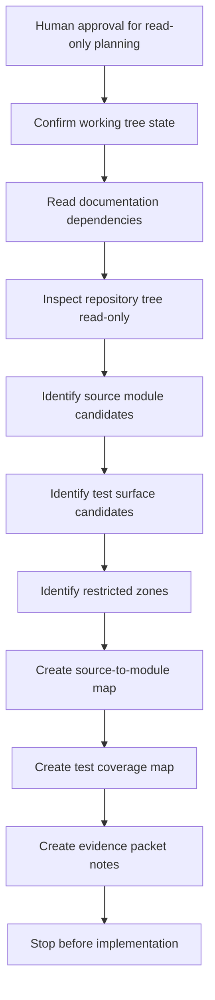
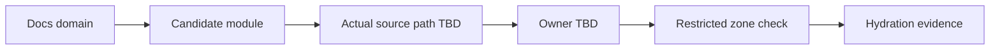
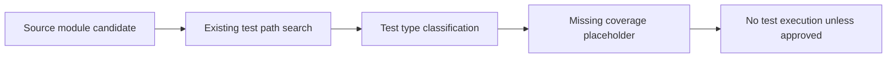

# 000069_Diagram_WP_8A_001_Runtime_Flow_Read_Only_Hydration_Diagram

## Purpose

Describe the read-only hydration flow for WP-8A-001.

This diagram is an inspection workflow. It does not define new runtime behavior.

## Read-Only Hydration Flow

## Source Scan Flow

| Step | Input | Output | Mutation Allowed |
|---|---|---|---|
| Confirm status | Git status output | Clean or known worktree state | No |
| List source tree | Directory/file names | Candidate source areas | No |
| Read file metadata | File paths and extensions | Toolchain hints | No |
| Inspect tests | Test paths and names | Test coverage candidates | No |
| Inspect docs dependencies | Existing docs | Traceability candidates | No |

## Module Registry Flow

## Test Discovery Flow

## Evidence Output Flow

| Evidence Output | Description |
|---|---|
| Dependency graph | Docs and source dependency placeholders |
| Source-to-module map | Source path to module and owner mapping |
| Module impact map | Candidate impact and forbidden mutation notes |
| Test coverage map | Existing and missing test categories |
| Pre-implementation test plan | Static validation and future test placeholders |
| Handoff checklist | Gate before any coding |

## Runtime Behavior Statement

This file does not add, change, authorize, or specify production runtime behavior. It only describes how to collect read-only evidence before a later human-approved implementation batch.
