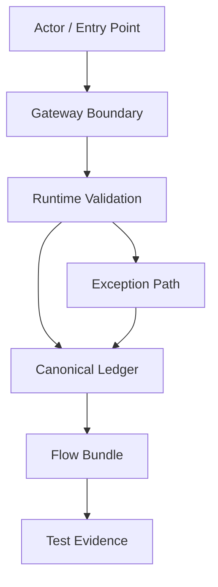

# 000403_Template_Development_Foundation_Overview_Document.md

## Purpose

This document defines the project foundation topic indicated by its filename and preserves its governed documentation role within `docs/000100_project_foundation/`.


---
DocumentType: Template
Band: 00100_project_foundation
Audience: Architect, Product Owner, Tech Lead, Claude Code Operator, Cursor Operator
Status: Draft
CanonicalPath: docs/00100_project_foundation/000660_Template_Development_Foundation_Overview_Document.md
RelatedPolicy:
  - 000640_Policy_Development_Foundation_Overview_Logic_Module_Documentation_Model.md
  - 000650_Index_Development_Foundation_Overview_Logic_Module_Registry.md
RelatedFlowRegistry:
  - 64000_Index_Runtime_Flow_Bundle_Registry.md
NoAISoloZone: false
---

## 1. Purpose

This template defines the standard structure for an `overview` development foundation document in the CatchMenu / Catch & Order project.

An overview document is not an implementation task by itself. It is a high-level map that explains how a business capability, runtime flow, or module family fits into the whole restaurant OS architecture.

The overview document must answer the following questions before any logic or module document is created:

1. What is the capability or flow being described?
2. Which actors, systems, gateways, ledgers, queues, and evidence stores are involved?
3. Which Flow Bundle documents are linked to this overview?
4. Which downstream `logic` and `module` documents must exist before implementation?
5. Which areas are restricted by No-AI-Solo rules?

## 2. Naming Rule

Overview development documents must follow the project canonical naming rule.

```text
NNNNN_Overview_<Capability_Or_Flow_Description>.md
```

Recommended examples:

```text
00670_Overview_POS_Gateway_Approval_Cancel_Reconciliation_Runtime_Map.md
00680_Overview_Customer_Order_To_KDS_POS_Handoff_Runtime_Map.md
00690_Overview_AI_Customer_Center_To_Digital_SOP_Response_Runtime_Map.md
```

Do not use the informal filename pattern directly as the canonical filename.

```text
01_overview_매장시스템_메인플로우.md
```

The `01_overview` expression may be used inside the document as a classification label, but not as the canonical repository filename when the document is placed under the official docs tree.

## 3. Overview Document Header Template

```yaml
---
DocumentType: Overview
Band: <target_band>
OverviewType: 01_overview
Audience: Product Owner, Architect, Developer, QA, Operator
Status: Draft | Review | Approved | Deprecated
CanonicalPath: docs/<target_folder>/<filename>.md
RelatedFlowBundles:
  - <64000_or_64100_flow_document>.md
RelatedLogicDocuments:
  - <logic_document>.md
RelatedModuleDocuments:
  - <module_document>.md
NoAISoloZone: true | false
HumanApprovalRequired: true | false
---
```

## 4. Required Sections

Every overview document must contain the sections below.

### 4.1 Purpose

Describe why this overview exists and what business or runtime capability it covers.

Required minimum:

```text
This overview defines the top-level runtime map for <capability>.
It is used before creating logic, module, test, and evidence documents.
```

### 4.2 Scope

Define what is included and excluded.

```text
In Scope:
- <actor or system>
- <runtime flow>
- <ledger or evidence dependency>

Out of Scope:
- <implementation detail deferred to module document>
- <policy detail covered elsewhere>
- <external provider internal behavior not controlled by this system>
```

### 4.3 Actor And System Map

List human actors, internal modules, external systems, and ledgers.

| Type | Name | Role | Trust Boundary | Related Document |
|---|---|---|---|---|
| Human Actor | Customer | Initiates order/payment flow | Public | TBD |
| Human Actor | Store Operator | Handles exception and manual recovery | Store Runtime | TBD |
| Internal Module | POS Gateway | Normalizes POS/PG/VAN events | Internal Controlled | TBD |
| External System | PG/VAN | Payment authorization and settlement source | External Regulated | TBD |
| Ledger | Audit Ledger | Immutable event and evidence record | No-AI-Solo | TBD |

### 4.4 Runtime Flow Summary

Provide the flow in plain language before diagramming it.

```text
1. Customer or store action starts the runtime event.
2. Gateway receives and normalizes the request or webhook.
3. Runtime state is recorded in the canonical ledger.
4. External response is reconciled with internal state.
5. Exception, retry, recovery, and evidence export paths are evaluated.
```

### 4.5 Mermaid Runtime Diagram

Every overview document should include a Mermaid diagram unless the flow is purely conceptual.



### 4.6 Flow Bundle Linkage

Map the overview to Runtime Flow Bundle documents.

| Flow Bundle | Relationship | Required Before Coding | Notes |
|---|---:|---:|---|
| 64100_Flow_POS_Gateway_Approval_To_Audit_Ledger_And_Reconciliation.md | Primary | Yes | Approval path |
| 64110_Flow_POS_Gateway_Cancel_Refund_Recovery_And_Audit.md | Related | Yes | Reverse transaction path |
| 64120_Flow_POS_Gateway_Timeout_Retry_DLQ_And_Replay.md | Related | Yes | Failure and retry path |

### 4.7 Downstream Logic Documents

Identify the `02_logic` documents that must be created after this overview.

| Logic Document | Required Rule Area | Status | Owner |
|---|---|---|---|
| TBD | State transition | Draft | TBD |
| TBD | Exception handling | Draft | TBD |
| TBD | Reconciliation decision rule | Draft | TBD |

### 4.8 Downstream Module Documents

Identify the `03_module` documents that must be created after logic is approved.

| Module Document | Implementation Area | Status | Owner |
|---|---|---|---|
| TBD | API handler / service | Draft | TBD |
| TBD | DB schema / migration map | Draft | TBD |
| TBD | Queue / worker / replay processor | Draft | TBD |

### 4.9 No-AI-Solo Boundary

Declare whether this overview touches restricted implementation zones.

No-AI-Solo zones include:

- Payment approval, cancellation, refund, and settlement mutation
- Audit ledger write path
- Reconciliation finalization
- DB migration
- Secret and credential handling
- Production deployment
- Security boundary, signature verification, token rotation

| Zone | Present In This Overview | AI May Draft? | AI May Modify Code Alone? | Human Approval Required |
|---|---:|---:|---:|---:|
| Payment | TBD | Yes | No | Yes |
| Settlement | TBD | Yes | No | Yes |
| Audit Ledger | TBD | Yes | No | Yes |
| DB Migration | TBD | Yes | No | Yes |
| Secret | TBD | No | No | Yes |
| Production Deployment | TBD | No | No | Yes |

### 4.10 Evidence Expectations

Define what evidence must exist when implementation reaches this overview boundary.

| Evidence Type | Required | Storage / Document | Notes |
|---|---:|---|---|
| Runtime diagram snapshot | Yes | Evidence packet | Mermaid source preserved |
| Flow Bundle dependency map | Yes | 64200 Matrix | Required before coding |
| Module impact map | Yes | 64210 Matrix | Required before coding |
| Test coverage map | Yes | 64220 Matrix | Required before coding |
| Human approval record | Conditional | 64370 / 64380 | Required for No-AI-Solo zones |

## 5. Authoring Rules

The author must follow these rules:

1. Do not place implementation instructions directly in the overview beyond high-level boundaries.
2. Do not assign Claude Code or Cursor a coding task from the overview alone.
3. Always create or reference at least one `logic` document before module implementation.
4. Always create or reference Flow Bundle maps when the overview touches POS, PG/VAN, settlement, audit ledger, security, or deployment.
5. Mark No-AI-Solo zones explicitly.
6. Use Mermaid diagrams for runtime maps whenever possible.
7. Use stable document links rather than vague references such as “the previous file.”

## 6. Completion Checklist

| Check | Required | Status |
|---|---:|---|
| H1 includes exact full filename with `.md` | Yes | TBD |
| Canonical naming rule followed | Yes | TBD |
| OverviewType is `01_overview` | Yes | TBD |
| Scope defined | Yes | TBD |
| Actor and system map included | Yes | TBD |
| Runtime diagram included or exception explained | Yes | TBD |
| Flow Bundle linkage included | Yes | TBD |
| Downstream logic documents identified | Yes | TBD |
| Downstream module documents identified | Yes | TBD |
| No-AI-Solo boundary checked | Yes | TBD |
| Evidence expectations listed | Yes | TBD |

## 7. Relationship To Development Routine

This template supports the development routine below:

```text
overview -> logic -> module -> file -> test -> evidence
```

The overview document is the first controlled map. It prevents the project from treating a single Markdown file as a coding unit.

A developer or AI coding agent must not proceed from overview directly to code. The required bridge is:

```text
Overview Document
  -> Logic Document
  -> Module Document
  -> Flow Bundle Matrix
  -> Code Handoff Gate
  -> Implementation
  -> Test
  -> Evidence
```

## 8. Change Control

Any major change to an overview document must be classified as one of the following:

| Change Type | Requires Logic Update | Requires Module Update | Requires Flow Bundle Re-Gate |
|---|---:|---:|---:|
| Text clarification only | No | No | No |
| Actor/system boundary change | Yes | Conditional | Yes |
| Runtime path change | Yes | Yes | Yes |
| Ledger/audit/evidence change | Yes | Yes | Yes |
| No-AI-Solo boundary change | Yes | Yes | Yes |
| Diagram-only correction | Conditional | No | Conditional |

## 9. Related Documents

- 000640_Policy_Development_Foundation_Overview_Logic_Module_Documentation_Model.md
- 000650_Index_Development_Foundation_Overview_Logic_Module_Registry.md
- 64000_Index_Runtime_Flow_Bundle_Registry.md
- 64200_Matrix_Flow_To_MD_Dependency_Graph.md
- 64210_Matrix_Flow_To_Module_Implementation_Map.md
- 64220_Matrix_Flow_To_Test_Coverage_Map.md
- 64300_Checklist_Flow_Bundle_Code_Handoff_Readiness_Gate.md
- 64370_Governance_Flow_Bundle_Human_Approval_And_No_AI_Solo_Zone_Control.md
