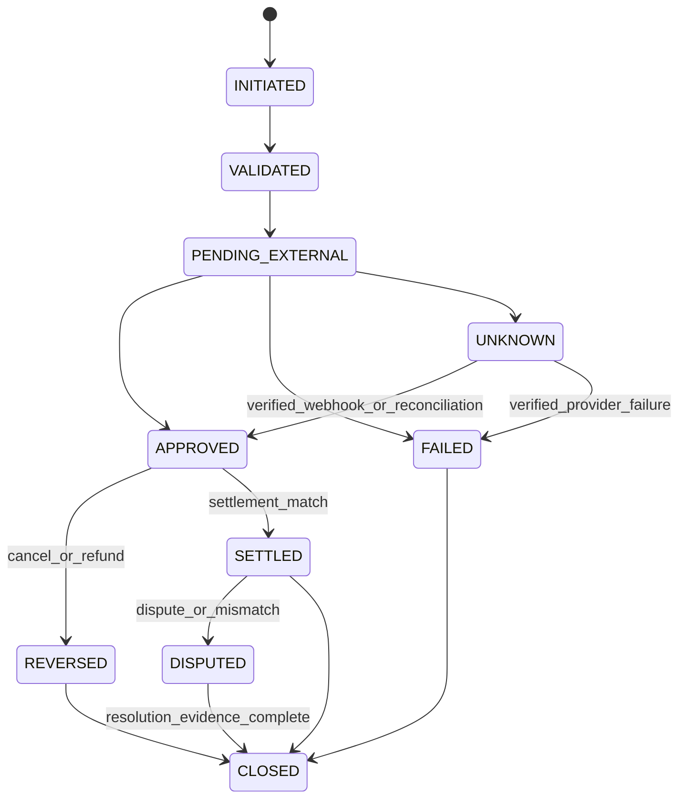
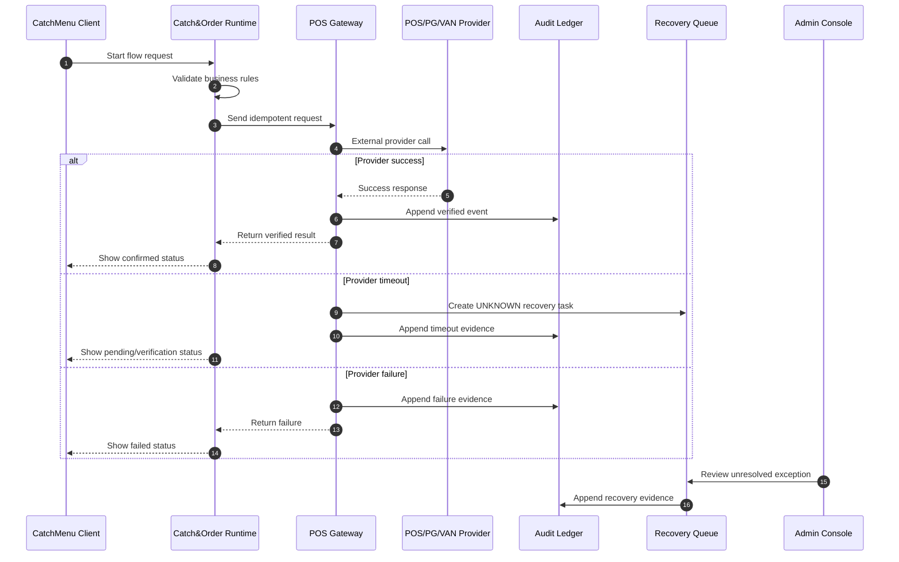

# 000404_Template_Development_Foundation_Logic_Document.md

## Purpose

This document defines the project foundation topic indicated by its filename and preserves its governed documentation role within `docs/000100_project_foundation/`.


## 1. Document Control

| Field | Value |
|---|---|
| Project | yoonsul_wait_order_handoff / CatchMenu-Catch&Order |
| Band | 00100_project_foundation |
| Document Type | Template |
| Document Role | Development Foundation Logic Document Template |
| Related Policy | 000640_Policy_Development_Foundation_Overview_Logic_Module_Documentation_Model.md |
| Related Registry | 000650_Index_Development_Foundation_Overview_Logic_Module_Registry.md |
| Previous Template | 000660_Template_Development_Foundation_Overview_Document.md |
| Next Template | 000680_Template_Development_Foundation_Module_Document.md |
| Status | Draft |
| Owner | Product / Architecture / Engineering |
| AI Solo Change | Prohibited for payment, settlement, audit, security, DB migration, secret, and release logic |

---

## 2. Purpose

This template defines the standard structure for `02_logic_*` development foundation documents.

A Logic Document is not a code file and not a policy essay.  
It is the implementation-facing rulebook that explains how a business/runtime flow must behave before code is written or changed.

The document must answer the following questions:

1. What states can the flow enter?
2. What event causes each state transition?
3. What conditions must be checked before action?
4. What happens on timeout, retry, duplicate, cancellation, mismatch, or failure?
5. What must be logged, audited, tested, and evidenced?
6. Which parts are AI-assisted implementation allowed, and which parts require human approval?

---

## 3. Naming Rule

Logic documents may use the project-wide official filename rule:

```text
NNNNN_DocumentType_Description.md
```

When this template is used for development sub-documents, the internal logic marker may appear in the description:

```text
NNNNN_Template_Development_Foundation_Logic_Document.md
NNNNN_Spec_Logic_POS_Gateway_Approval_State_Transition_And_Exception_Rule.md
NNNNN_Spec_Logic_Payment_Cancel_Refund_Retry_And_Audit_Rule.md
```

The informal `02_logic_*` wording is allowed as a development pattern, but it does not replace the official project naming rule.

---

## 4. When To Create A Logic Document

Create or update a Logic Document when any of the following is true:

| Trigger | Logic Document Required |
|---|---|
| A new payment, order, POS, KDS, settlement, audit, or customer handoff flow is added | Yes |
| State transition rules are unclear | Yes |
| Timeout, retry, cancellation, refund, or replay behavior may affect money or audit data | Yes |
| A Claude Code or Cursor implementation request touches runtime behavior | Yes |
| A bug shows mismatch between expected and actual behavior | Yes |
| Only visual text, copy, or non-runtime UI wording changes | Usually No |

No implementation agent may treat a single MD file as the whole implementation unit.  
The Logic Document must be connected to the relevant Flow Bundle and Module Document.

---

## 5. Required Links

Every Logic Document must link to the following:

| Link Type | Required |
|---|---|
| Parent Overview Document | Required |
| Related Flow Bundle | Required |
| Related MD Dependency Graph | Required when implementation impact exists |
| Related Module Implementation Map | Required when code impact exists |
| Related Test Coverage Map | Required when test impact exists |
| Related Evidence Packet | Required before merge or release |
| Related SOP / Runbook | Required for operational handling |
| Related Audit / Ledger Policy | Required for financial-grade flows |

---

## 6. Logic Document Template

Use the following structure for each actual `02_logic` document.

---

# <Exact_Filename_With_Extension.md>

## 1. Document Control

| Field | Value |
|---|---|
| Project | yoonsul_wait_order_handoff / CatchMenu-Catch&Order |
| Document Type | Spec / Logic |
| Logic Area | <Order / Payment / POS Gateway / KDS / Settlement / Audit / Customer Center / Admin / Security> |
| Parent Overview | <overview document filename> |
| Related Flow Bundle | <flow bundle filename> |
| Related Module Document | <module document filename or TBD> |
| Status | Draft / Review / Approved / Deprecated |
| Owner | <role/team> |
| Last Updated | YYYY-MM-DD |

---

## 2. Scope

### 2.1 Included

- <Included logic area>
- <Included state transitions>
- <Included exception cases>
- <Included audit/evidence requirements>

### 2.2 Excluded

- <Explicitly excluded area>
- <Out-of-scope integration>
- <Deferred logic>

### 2.3 No-AI-Solo Zone Check

| Area | AI Solo Allowed? | Human Approval Required? | Reason |
|---|---:|---:|---|
| Payment approval / cancel / refund | No | Yes | Money movement and audit impact |
| Settlement / reconciliation | No | Yes | Financial evidence impact |
| Audit ledger mutation | No | Yes | Tamper-evidence and legal hold impact |
| Security / secret / credential | No | Yes | Trust boundary impact |
| DB migration / production release | No | Yes | Irreversible runtime impact |
| Non-critical UI copy | Conditional | Conditional | Must not change runtime logic |

---

## 3. Business Intent

Explain the business reason for this logic.

Example:

```text
The system must prevent duplicate payment approval when a POS timeout occurs.
The customer, store owner, PG/VAN provider, and internal audit ledger must converge to one final state.
No retry may create a second approval without idempotency protection.
```

---

## 4. Actors And Systems

| Actor/System | Role |
|---|---|
| Customer | Initiates order or payment action |
| Store Staff | Confirms store-side status and exception recovery |
| CatchMenu Client | Customer-facing order/payment surface |
| Catch&Order Runtime | SaaS orchestration layer |
| POS Gateway | External POS/PG/VAN integration boundary |
| Audit Ledger | Immutable evidence and state trace |
| Admin Console | Human approval and recovery control |
| AI Assistant / Agent | May assist with analysis but cannot solo-change restricted logic |

---

## 5. State Model

### 5.1 Primary States

| State | Meaning | Entry Condition | Exit Condition | Terminal? |
|---|---|---|---|---:|
| INITIATED | Flow has started | Customer/store/system request received | Validation completed | No |
| VALIDATED | Request passed pre-check | Required fields and policy checks passed | External call or internal mutation starts | No |
| PENDING_EXTERNAL | Waiting for POS/PG/VAN response | External request sent | Response, timeout, webhook, or manual recovery | No |
| APPROVED | Approval confirmed | Valid approval response or verified webhook | Cancel/refund/settlement | Conditional |
| FAILED | Final failure | Provider rejection or unrecoverable rule violation | Evidence packet generated | Yes |
| UNKNOWN | System cannot determine final external state | Timeout, partial failure, conflicting response | Reconciliation or manual review | No |
| REVERSED | Approval/capture was reversed | Cancel/refund/reversal accepted | Audit closeout | Conditional |
| SETTLED | Settlement confirmed | Reconciliation matched | Dispute or archive | Conditional |
| DISPUTED | Mismatch or claim exists | Settlement mismatch, customer claim, provider dispute | Resolution | No |
| CLOSED | Flow complete | Evidence and audit closeout complete | None | Yes |

### 5.2 State Transition Diagram



---

## 6. Event Model

| Event | Producer | Consumer | Required Payload | Idempotency Key | Audit Required |
|---|---|---|---|---|---:|
| <event.name> | <system> | <system> | <fields> | <key> | Yes/No |
| payment.approval.requested | Catch&Order Runtime | POS Gateway | order_id, amount, store_id, provider | payment_attempt_id | Yes |
| payment.approval.timeout | POS Gateway | Recovery Queue | attempt_id, provider_ref, timeout_at | payment_attempt_id | Yes |
| payment.approval.verified | POS Gateway / Webhook | Audit Ledger | approval_no, amount, provider_time | provider_event_id | Yes |

---

## 7. Decision Rules

### 7.1 Rule Table

| Rule ID | Condition | Decision | Required Action | Evidence |
|---|---|---|---|---|
| LOGIC-R001 | <condition> | <decision> | <action> | <evidence> |
| LOGIC-R002 | Duplicate event with same idempotency key | Do not apply second mutation | Return existing result or mark duplicate | duplicate_event_log |
| LOGIC-R003 | Timeout without verified external result | Move to UNKNOWN | Start reconciliation / manual recovery | timeout_recovery_packet |
| LOGIC-R004 | Amount mismatch | Block settlement closeout | Raise dispute / admin review | amount_mismatch_evidence |

### 7.2 Priority Order

When multiple rules apply, use this priority order:

1. Security validation
2. Idempotency and duplicate prevention
3. Money movement correctness
4. Audit ledger immutability
5. Customer/store visible status
6. Retry and recovery
7. Notification and support message

---

## 8. Validation Rules

| Field / Condition | Required Rule | Failure Behavior |
|---|---|---|
| store_id | Must exist and be active | Reject before external call |
| order_id | Must exist and belong to store | Reject before payment attempt |
| amount | Must match locked order total | Block approval or mark mismatch |
| currency | Must match supported provider currency | Reject before provider call |
| provider | Must be enabled for store | Reject or route fallback |
| idempotency_key | Required for mutation | Reject if missing |
| signature | Required for webhook | Reject and log security event |

---

## 9. Exception Handling

### 9.1 Timeout

| Case | Rule |
|---|---|
| Client timeout before provider response | Do not assume failure |
| Provider timeout after request accepted | Move to UNKNOWN |
| Webhook arrives after timeout | Verify signature and reconcile |
| User retries same action | Use same idempotency key where applicable |
| Operator retries manually | Require recovery reason and evidence |

### 9.2 Duplicate

| Case | Rule |
|---|---|
| Same idempotency key, same payload | Return existing result |
| Same idempotency key, different payload | Block and raise security/audit exception |
| Same provider event delivered multiple times | Normalize once and mark duplicate delivery |
| Same order paid twice | Block settlement closeout and escalate |

### 9.3 Mismatch

| Mismatch Type | Rule |
|---|---|
| Amount mismatch | Block final closeout |
| Currency mismatch | Reject or dispute |
| Approval number mismatch | Send to reconciliation |
| Provider timestamp mismatch | Preserve both timestamps |
| Local ledger vs cloud ledger mismatch | Resync with audit trail |

### 9.4 Cancel / Refund / Reversal

| Case | Rule |
|---|---|
| Cancel before settlement | Use provider cancel path |
| Refund after settlement | Use refund path and separate evidence |
| Partial refund | Require amount split and audit reason |
| Failed refund with approved payment | Mark refund_pending_review |
| Webhook confirms refund later | Reconcile and close |

---

## 10. Idempotency Policy

| Item | Rule |
|---|---|
| Idempotency Scope | <order / payment attempt / provider event / refund attempt> |
| Key Format | <key format> |
| Storage | <table / ledger / cache> |
| Retention | <retention policy> |
| Collision Behavior | Block and escalate |
| Replay Behavior | Return stored result or route to review |

Minimum required key examples:

```text
order_id
payment_attempt_id
provider_event_id
refund_attempt_id
settlement_batch_id
audit_event_id
```

---

## 11. Retry Policy

| Retry Target | Allowed? | Max Attempts | Backoff | Stop Condition | Evidence |
|---|---:|---:|---|---|---|
| Provider approval request | Conditional | <n> | Exponential | Verified final state | retry_log |
| Webhook normalization | Yes | <n> | Queue retry | Normalized or rejected | normalization_retry_log |
| Audit ledger write | No blind retry | <n> | Controlled | Append success or incident | audit_write_evidence |
| Settlement export | Yes | <n> | Scheduled | Export checksum match | export_evidence |

Rules:

1. Retry must never create duplicate money movement.
2. Retry must be tied to idempotency.
3. Retry must generate evidence.
4. Retry failure must route to DLQ or manual review.
5. Retry policy must be covered by tests.

---

## 12. Rollback / Compensation Policy

| Situation | Rollback Allowed? | Compensation Required? | Rule |
|---|---:|---:|---|
| Internal validation failure before external call | Yes | No | Reject and close |
| External approval unknown | No | Yes | Reconcile first |
| External approval confirmed but internal update failed | No blind rollback | Yes | Repair internal ledger |
| Settlement exported incorrectly | No silent rollback | Yes | Issue correction packet |
| Audit ledger append error | No mutation rollback | Yes | Incident and recovery entry |

---

## 13. Audit And Evidence Requirements

Every material transition must produce audit evidence.

| Transition / Decision | Required Evidence |
|---|---|
| Request accepted | request_snapshot |
| External call sent | provider_request_log |
| External response received | provider_response_log |
| Timeout occurred | timeout_log |
| Unknown state entered | unknown_state_packet |
| Duplicate detected | duplicate_detection_log |
| Recovery action performed | recovery_approval_record |
| Settlement matched | reconciliation_result |
| Dispute opened | dispute_packet |
| Closeout completed | final_evidence_packet |

Evidence must be immutable or tamper-evident where required.

---

## 14. Data Consistency Rules

| Data Pair | Consistency Rule |
|---|---|
| Order total vs payment amount | Must match before approval |
| Payment ledger vs provider approval | Must reconcile |
| Local ledger vs cloud ledger | Must converge with conflict evidence |
| Customer-visible status vs audit state | Must not show final success unless verified |
| Settlement amount vs approved/canceled/refunded amount | Must match after reconciliation |

---

## 15. Security Rules

| Security Area | Required Rule |
|---|---|
| Webhook signature | Verify before normalization |
| Secret handling | No hardcoding, no plain text logs |
| Token refresh | Controlled rotation and audit |
| Admin recovery | RBAC/ABAC approval required |
| PII/payment data | Minimize and mask |
| Log exposure | No sensitive payload in general logs |

---

## 16. User / Store / Admin Message Rules

| Audience | Message Rule |
|---|---|
| Customer | Never expose provider internals or uncertain success as confirmed |
| Store Staff | Show operational status and next safe action |
| Admin | Show technical state, evidence, and recovery options |
| Support | Show approved guidance and linked SOP |
| AI Customer Center | May answer from SOP/evidence but must not invent final financial state |

---

## 17. Test Requirements

| Test Type | Required Coverage |
|---|---|
| Unit Test | Decision rules, validation rules, state transition guards |
| Integration Test | POS/PG/VAN boundary, webhook, ledger append, recovery queue |
| Contract Test | Provider request/response schema, webhook schema |
| Fault Injection Test | Timeout, duplicate, mismatch, network loss |
| Reconciliation Test | Provider file vs internal ledger |
| Security Test | Signature failure, replay attack, malformed payload |
| Audit Test | Evidence packet generation and immutability |
| Regression Test | Previously fixed incident scenarios |

---

## 18. Mermaid Sequence Diagram



---

## 19. Open Questions

| Question | Owner | Due Date | Blocking? |
|---|---|---|---:|
| <question> | <owner> | <date> | Yes/No |

---

## 20. Approval Gate

A Logic Document is not approved until:

- [ ] State model is complete.
- [ ] Event model is complete.
- [ ] Decision rules are complete.
- [ ] Exception handling is complete.
- [ ] Idempotency policy is defined.
- [ ] Retry policy is defined.
- [ ] Rollback/compensation policy is defined.
- [ ] Audit and evidence requirements are defined.
- [ ] Security rules are defined.
- [ ] Test coverage requirements are defined.
- [ ] No-AI-Solo Zone check is completed.
- [ ] Human approval is recorded for restricted logic.

---

## 21. Downstream Module Document Requirements

The related `03_module` document must not be created from code guesses alone.  
It must map each approved logic rule to actual implementation artifacts.

| Logic Rule ID | Module | Source File | Function/Class | Test | Evidence |
|---|---|---|---|---|---|
| LOGIC-R001 | <module> | <file> | <function> | <test> | <evidence> |

---

## 22. Change Control

Any change to this Logic Document must be classified as one of the following:

| Change Type | Description | Gate |
|---|---|---|
| Documentation clarification | No runtime behavior change | Review |
| Logic correction | Runtime behavior changes | Human approval required |
| Financial behavior change | Payment/settlement/audit impact | No-AI-Solo gate required |
| Security behavior change | Trust boundary or credential impact | Security approval required |
| DB behavior change | Schema/migration impact | Migration approval required |
| Test-only change | Test coverage update | Review with evidence |

---

## 23. Summary

A Logic Document is the bridge between overview-level architecture and module-level implementation.

The required chain is:

```text
Overview → Logic → Module → File → Test → Evidence
```

No Claude Code or Cursor task may skip this chain when the change affects runtime state, money movement, audit evidence, security boundary, DB migration, secret handling, or production release.
