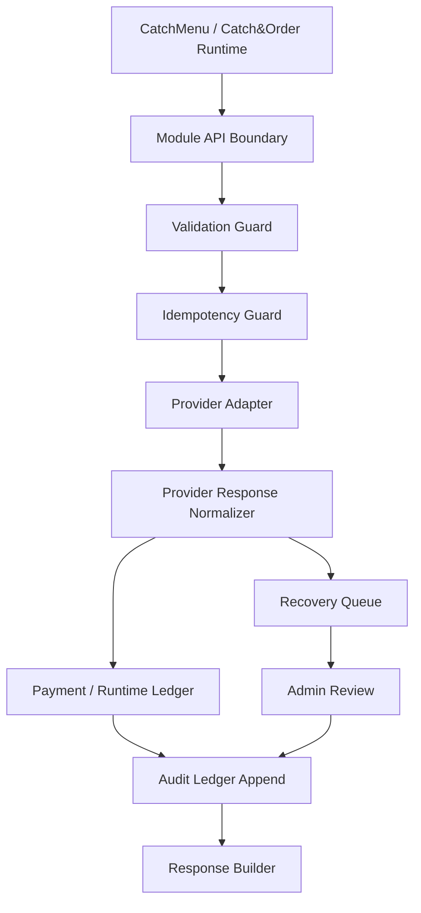

# 000405_Template_Development_Foundation_Module_Document.md

## Purpose

This document defines the project foundation topic indicated by its filename and preserves its governed documentation role within `docs/000100_project_foundation/`.


## 1. Document Control

| Field | Value |
|---|---|
| Project | yoonsul_wait_order_handoff / CatchMenu-Catch&Order |
| Band | 00100_project_foundation |
| Document Type | Template |
| Document Role | Development Foundation Module Document Template |
| Related Policy | 000640_Policy_Development_Foundation_Overview_Logic_Module_Documentation_Model.md |
| Related Registry | 000650_Index_Development_Foundation_Overview_Logic_Module_Registry.md |
| Previous Template | 000670_Template_Development_Foundation_Logic_Document.md |
| Next Recommended Document | 000690_Matrix_Development_Foundation_Overview_Logic_Module_Traceability.md |
| Status | Draft |
| Owner | Architecture / Engineering |
| AI Solo Change | Prohibited for payment, settlement, audit, security, DB migration, secret, and release modules |

---

## 2. Purpose

This template defines the standard structure for `03_module_*` development foundation documents.

A Module Document is the implementation-facing map that connects approved logic to real software artifacts.

It must answer the following questions:

1. Which runtime module implements the approved logic?
2. Which source files, functions, classes, jobs, queues, tables, APIs, and events are involved?
3. Which tests prove the implementation?
4. Which evidence packet proves the implementation was reviewed and safely released?
5. Which implementation areas are AI-assisted only, and which require human approval?

A Module Document must never be guessed from a single Markdown policy file.  
It must be derived from the approved chain:

```text
Overview → Logic → Module → File → Test → Evidence
```

---

## 3. Naming Rule

Module documents follow the project-wide official filename rule:

```text
NNNNN_DocumentType_Description.md
```

When this template is used for development sub-documents, the internal module marker may appear in the description:

```text
NNNNN_Spec_Module_POS_Gateway_Approval_API_Data_Model_And_Test_Map.md
NNNNN_Spec_Module_Payment_Timeout_Retry_DLQ_Replay_And_Evidence_Map.md
NNNNN_Spec_Module_Webhook_Verification_Normalization_Queue_And_Audit_Map.md
```

The informal `03_module_*` wording is allowed as a development pattern, but it does not replace the official project naming rule.

---

## 4. When To Create A Module Document

Create or update a Module Document when any of the following is true:

| Trigger | Module Document Required |
|---|---|
| A Flow Bundle reaches implementation planning | Yes |
| A Logic Document is approved and needs source mapping | Yes |
| Claude Code or Cursor will modify source files | Yes |
| API, DB, queue, job, event, or ledger structure changes | Yes |
| A defect needs code-level traceability | Yes |
| Release evidence must prove affected files and tests | Yes |

No code handoff should proceed when the Module Document cannot identify the affected files, tests, and evidence targets.

---

## 5. Required Links

Every Module Document must link to the following:

| Link Type | Required |
|---|---|
| Parent Overview Document | Required |
| Parent Logic Document | Required |
| Related Flow Bundle | Required |
| Related Module Implementation Map | Required |
| Related Test Coverage Map | Required |
| Related Evidence Packet | Required before merge |
| Related Code Review / Diff Control Runbook | Required before merge |
| Related Release Gate Checklist | Required before release |

---

## 6. Module Document Template

Use the following structure for each actual `03_module` document.

---

# <Exact_Filename_With_Extension.md>

## 1. Document Control

| Field | Value |
|---|---|
| Project | yoonsul_wait_order_handoff / CatchMenu-Catch&Order |
| Document Type | Spec / Module |
| Module Area | <POS Gateway / Payment / KDS / Settlement / Audit / Customer Center / Admin / Security> |
| Parent Overview | <overview document filename> |
| Parent Logic | <logic document filename> |
| Related Flow Bundle | <flow bundle filename> |
| Status | Draft / Review / Approved / Deprecated |
| Owner | <role/team> |
| Last Updated | YYYY-MM-DD |

---

## 2. Scope

### 2.1 Included

- <Runtime module>
- <API endpoints>
- <DB tables or migrations>
- <Queues/jobs/workers>
- <Events/webhooks>
- <Tests>
- <Evidence artifacts>

### 2.2 Excluded

- <Out-of-scope module>
- <Deferred implementation>
- <External provider behavior not controlled by this system>

### 2.3 No-AI-Solo Zone Check

| Area | AI Solo Allowed? | Human Approval Required? | Evidence Required |
|---|---:|---:|---|
| Payment approval/cancel/refund module | No | Yes | approval record + test evidence |
| Settlement/reconciliation module | No | Yes | reconciliation evidence |
| Audit ledger module | No | Yes | immutable ledger evidence |
| Security/secret/credential module | No | Yes | security approval |
| DB migration module | No | Yes | migration plan + rollback evidence |
| Production release/deploy module | No | Yes | release gate evidence |
| Non-critical UI module | Conditional | Conditional | diff review |

---

## 3. Implementation Summary

Describe what this module does in implementation terms.

Example:

```text
This module receives payment approval requests from the Catch&Order runtime,
creates an idempotent payment attempt, calls the external POS/PG/VAN provider,
normalizes the response, writes an immutable audit event, and returns a verified
or pending state to the caller.
```

---

## 4. Runtime Module Map

| Module | Responsibility | Runtime Boundary | Owner |
|---|---|---|---|
| <module_name> | <responsibility> | <internal/external boundary> | <owner> |
| pos_gateway.approval | Provider approval request and response normalization | External provider boundary | Backend |
| payment_ledger | Payment attempt state and idempotency | Internal ledger boundary | Backend |
| audit_ledger | Immutable event evidence | Audit boundary | Backend / Compliance |
| recovery_queue | Timeout, DLQ, replay, manual recovery | Recovery boundary | Backend / Ops |

---

## 5. Source File Map

| Source File | Role | Related Logic Rule | Test File | Evidence |
|---|---|---|---|---|
| <path/to/file> | <role> | <LOGIC-Rxxx> | <test path> | <evidence> |
| src/modules/pos_gateway/approval_service.ts | Approval orchestration | LOGIC-R001, LOGIC-R002 | tests/pos_gateway/approval_service.test.ts | approval_test_packet |
| src/modules/payment/idempotency_guard.ts | Duplicate prevention | LOGIC-R002 | tests/payment/idempotency_guard.test.ts | duplicate_prevention_evidence |
| src/modules/audit/audit_append_service.ts | Audit event append | LOGIC-R004 | tests/audit/audit_append_service.test.ts | audit_append_evidence |

---

## 6. API / Interface Map

### 6.1 Internal API

| API / Function | Caller | Callee | Request | Response | Related Logic |
|---|---|---|---|---|---|
| <function_or_endpoint> | <caller> | <callee> | <request schema> | <response schema> | <LOGIC-Rxxx> |

### 6.2 External Provider Interface

| Provider Interface | Direction | Required Validation | Retry Allowed? | Evidence |
|---|---|---|---:|---|
| <provider API> | Outbound / Inbound | <validation> | Yes/No | <evidence> |
| payment approval request | Outbound | amount, currency, store credential, idempotency | Conditional | provider_request_log |
| payment webhook | Inbound | signature, timestamp, event id, payload schema | Queue retry only | webhook_verification_log |

---

## 7. Data Model Map

### 7.1 Tables / Collections

| Table / Store | Purpose | Key Fields | Related Logic | Migration Required? |
|---|---|---|---|---:|
| <table> | <purpose> | <fields> | <LOGIC-Rxxx> | Yes/No |
| payment_attempts | Idempotent payment attempt state | payment_attempt_id, order_id, status, amount | LOGIC-R001, LOGIC-R002 | Conditional |
| provider_events | Raw and normalized provider event record | provider_event_id, provider, payload_hash | LOGIC-R003 | Conditional |
| audit_events | Immutable audit trace | audit_event_id, event_type, hash_chain | LOGIC-R004 | Conditional |
| recovery_tasks | Unknown state and manual recovery queue | recovery_task_id, reason, status | LOGIC-R005 | Conditional |

### 7.2 Field-Level Rules

| Field | Type | Required? | Rule |
|---|---|---:|---|
| idempotency_key | string | Yes | Required for mutation operations |
| provider_event_id | string | Conditional | Required for inbound provider events |
| payload_hash | string | Yes | Required for tamper-evidence |
| audit_event_id | string | Yes | Required for material state transition |

---

## 8. Event / Queue / Job Map

| Event / Job / Queue | Producer | Consumer | Retry Policy | DLQ Policy | Evidence |
|---|---|---|---|---|---|
| <event> | <producer> | <consumer> | <retry> | <dlq> | <evidence> |
| payment.approval.requested | runtime | pos_gateway | idempotent retry only | payment_approval_dlq | request_event_evidence |
| payment.approval.timeout | pos_gateway | recovery_queue | no blind money retry | recovery_dlq | timeout_evidence |
| provider.webhook.received | webhook_controller | normalization_queue | schema/signature gated | webhook_dlq | webhook_evidence |
| settlement.reconciliation.run | scheduler | reconciliation_worker | scheduled retry | reconciliation_dlq | settlement_evidence |

---

## 9. Function / Class Responsibility Map

| Function / Class | Responsibility | Must Not Do | Related Test |
|---|---|---|---|
| <function/class> | <responsibility> | <prohibited behavior> | <test> |
| approvePaymentAttempt() | Orchestrate approval attempt | Must not create duplicate provider charge | approval_service.test |
| verifyProviderWebhook() | Verify signature and replay window | Must not trust unsigned payload | webhook_security.test |
| appendAuditEvent() | Append immutable event | Must not mutate previous audit row | audit_ledger.test |
| enqueueRecoveryTask() | Create recovery task | Must not mark unknown state as success | recovery_queue.test |

---

## 10. Error Handling Map

| Error Type | Source | Module Behavior | User/Store/Admin Behavior | Evidence |
|---|---|---|---|---|
| Timeout | Provider | Move to UNKNOWN / recovery | Show pending verification | timeout_packet |
| Duplicate event | Provider/runtime | Return existing state or block conflict | Do not show duplicate success | duplicate_packet |
| Amount mismatch | Provider/reconciliation | Block closeout | Admin review required | mismatch_packet |
| Signature failure | Webhook | Reject and security log | No customer status change | security_event |
| Audit append failure | Audit ledger | Incident and controlled recovery | Admin review required | audit_incident_packet |

---

## 11. Security Implementation Map

| Security Control | Implementation Point | Test | Evidence |
|---|---|---|---|
| Secret isolation | <vault/env boundary> | secret_loading_test | secret_control_evidence |
| Webhook signature verification | verifyProviderWebhook() | webhook_signature_test | webhook_security_evidence |
| Replay attack prevention | provider_event_guard | replay_attack_test | replay_prevention_evidence |
| Log masking | logger middleware | pii_masking_test | log_masking_evidence |
| RBAC/ABAC for admin recovery | admin recovery API | admin_authz_test | admin_approval_evidence |

---

## 12. Test Map

| Test Type | Required Files | Required Scenarios | Evidence |
|---|---|---|---|
| Unit Test | <test file> | decision guards, validations | unit_test_report |
| Integration Test | <test file> | provider boundary, ledger write | integration_test_report |
| Contract Test | <test file> | API/request/response schema | contract_test_report |
| Fault Injection Test | <test file> | timeout, duplicate, mismatch | fault_test_report |
| Security Test | <test file> | signature, replay, secret leak | security_test_report |
| Audit Test | <test file> | evidence append, immutability | audit_test_report |
| Migration Test | <test file> | schema forward/backward safety | migration_test_report |

---

## 13. Traceability Matrix

| Flow Step | Logic Rule | Module | File | Function/Class | Test | Evidence |
|---|---|---|---|---|---|---|
| <step> | <LOGIC-Rxxx> | <module> | <file> | <function> | <test> | <evidence> |
| Approval request accepted | LOGIC-R001 | pos_gateway.approval | approval_service.ts | approvePaymentAttempt() | approval_service.test.ts | approval_request_evidence |
| Duplicate blocked | LOGIC-R002 | payment.idempotency | idempotency_guard.ts | guardIdempotency() | idempotency_guard.test.ts | duplicate_prevention_evidence |
| Timeout recovered | LOGIC-R003 | recovery_queue | recovery_service.ts | enqueueRecoveryTask() | recovery_service.test.ts | timeout_recovery_evidence |
| Audit appended | LOGIC-R004 | audit_ledger | audit_append_service.ts | appendAuditEvent() | audit_ledger.test.ts | audit_append_evidence |

---

## 14. Mermaid Module Diagram



---

## 15. Code Handoff Instructions

Claude Code or Cursor must receive this document together with:

1. Parent Overview Document
2. Parent Logic Document
3. Related Flow Bundle
4. Flow-to-MD Dependency Graph
5. Flow-to-Module Implementation Map
6. Flow-to-Test Coverage Map
7. No-AI-Solo Zone Approval Matrix
8. Code Review and Diff Control Runbook

The implementation agent must return:

```text
changed_files
unchanged_restricted_files
test_files
test_results
risk_notes
manual_review_required_items
evidence_packet_location
```

---

## 16. Diff Review Checklist

Before merge, verify:

- [ ] Changed files match this Module Document.
- [ ] No unapproved restricted file was modified.
- [ ] Logic rules are traceable to files and tests.
- [ ] API/schema changes are documented.
- [ ] DB/migration changes have human approval.
- [ ] Secret/security changes have human approval.
- [ ] Audit ledger changes have evidence.
- [ ] Tests were added or updated.
- [ ] Evidence packet was generated.
- [ ] Release gate checklist was passed.

---

## 17. Release Readiness

| Gate | Required? | Status | Evidence |
|---|---:|---|---|
| Logic approval | Yes | TBD | logic_approval_record |
| Module mapping approval | Yes | TBD | module_map_record |
| Test coverage approval | Yes | TBD | test_report |
| No-AI-Solo zone review | Conditional | TBD | human_approval_record |
| Evidence packet complete | Yes | TBD | evidence_packet |
| Pre-merge checklist complete | Yes | TBD | pre_merge_record |
| Release checklist complete | Yes | TBD | release_gate_record |

---

## 18. Change Control

| Change Type | Description | Required Gate |
|---|---|---|
| File mapping update only | Source path or ownership clarification | Review |
| Runtime behavior change | Logic-affecting module change | Logic re-approval |
| API schema change | Request/response contract change | Contract test + review |
| DB schema change | Migration or table change | DB migration approval |
| Security boundary change | Signature, secret, token, authz change | Security approval |
| Audit behavior change | Ledger append or evidence change | Audit approval |
| Release process change | Deployment or rollback change | Release approval |

---

## 19. Summary

A Module Document is the implementation bridge between approved logic and real source code.

The required chain is:

```text
Overview → Logic → Module → File → Test → Evidence
```

A Module Document is not complete until every material logic rule is traceable to implementation files, tests, and evidence.
