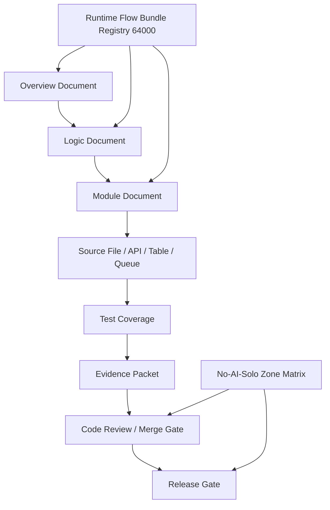

# 000406_Matrix_Development_Foundation_Overview_Logic_Module_Traceability.md

## Purpose

This document defines the project foundation topic indicated by its filename and preserves its governed documentation role within `docs/000100_project_foundation/`.


## 1. Document Control

| Field | Value |
|---|---|
| Project | yoonsul_wait_order_handoff / CatchMenu-Catch&Order |
| Band | 00100_project_foundation |
| Document Type | Matrix |
| Document Role | Overview → Logic → Module Traceability Matrix |
| Related Policy | 000640_Policy_Development_Foundation_Overview_Logic_Module_Documentation_Model.md |
| Related Registry | 000650_Index_Development_Foundation_Overview_Logic_Module_Registry.md |
| Related Overview Template | 000660_Template_Development_Foundation_Overview_Document.md |
| Related Logic Template | 000670_Template_Development_Foundation_Logic_Document.md |
| Related Module Template | 000680_Template_Development_Foundation_Module_Document.md |
| Status | Draft |
| Owner | Product / Architecture / Engineering / QA |
| AI Solo Change | Prohibited for payment, settlement, audit, security, DB migration, secret, and release traceability |

---

## 2. Purpose

This matrix defines how development foundation documents must remain connected across the full implementation chain.

The required chain is:

```text
Overview → Logic → Module → File → Test → Evidence
```

This document prevents a common failure pattern:

```text
One MD file is treated as one implementation unit.
Claude/Cursor edits code from partial context.
Flow logic, module boundaries, tests, and evidence become disconnected.
```

For CatchMenu / Catch&Order, this is not acceptable because POS, PG/VAN, settlement, reconciliation, audit ledger, security, DB migration, and production release flows have financial-grade consequences.

---

## 3. Core Rule

A feature, defect fix, refactor, or implementation task is not ready for code handoff unless the following traceability exists:

| Layer | Required Question |
|---|---|
| Overview | What is the whole flow and business context? |
| Logic | What rules, states, decisions, exceptions, and audit duties govern the flow? |
| Module | Which runtime modules, APIs, tables, queues, jobs, files, and functions implement the rules? |
| Test | Which tests prove each rule and module behavior? |
| Evidence | Which evidence packet proves review, approval, test result, and release readiness? |

If any row is missing, the implementation must remain blocked or be limited to non-runtime documentation work.

---

## 4. Traceability Matrix Template

Use this table for every development or Flow Bundle implementation scope.

| Trace ID | Overview Document | Overview Flow Step | Logic Document | Logic Rule ID | Module Document | Runtime Module | Source File / API / Table | Test Coverage | Evidence Packet | Status |
|---|---|---|---|---|---|---|---|---|---|---|
| TRACE-001 | <overview.md> | <flow step> | <logic.md> | <LOGIC-R001> | <module.md> | <module> | <file/api/table> | <test> | <evidence> | Draft |
| TRACE-002 | <overview.md> | <flow step> | <logic.md> | <LOGIC-R002> | <module.md> | <module> | <file/api/table> | <test> | <evidence> | Draft |

---

## 5. Required Status Values

| Status | Meaning |
|---|---|
| Draft | Row is proposed but not reviewed |
| Mapped | Documents are linked, but tests/evidence may be incomplete |
| Test Ready | Required tests are identified |
| Evidence Ready | Evidence packet location is defined |
| Approved | Row passed review and can support code handoff or merge |
| Blocked | Missing logic, module, test, evidence, or approval |
| Deprecated | Row is no longer active but preserved for audit/history |

---

## 6. Minimum Matrix For Runtime Flow Bundle Work

Every Flow Bundle that affects implementation must include at least the following matrix rows:

| Required Row Type | Required |
|---|---:|
| Main happy path | Yes |
| Validation failure path | Yes |
| Timeout path | Yes when external dependency exists |
| Duplicate/idempotency path | Yes for money/state mutation |
| Cancel/refund/reversal path | Yes when payment exists |
| Reconciliation path | Yes when provider settlement exists |
| Audit ledger path | Yes for material state changes |
| Security/replay/signature path | Yes for inbound/outbound provider boundary |
| DLQ/replay/recovery path | Yes for async or retry flows |
| Admin/manual approval path | Yes for No-AI-Solo or recovery flows |
| Evidence/export path | Yes for release and audit readiness |

---

## 7. POS Gateway Example Traceability

The following example shows how the matrix should be used for the POS Gateway approval-to-audit flow.

| Trace ID | Overview Document | Overview Flow Step | Logic Document | Logic Rule ID | Module Document | Runtime Module | Source File / API / Table | Test Coverage | Evidence Packet | Status |
|---|---|---|---|---|---|---|---|---|---|---|
| POS-APP-001 | 01_overview_POS_Gateway_Approval_Main_Flow.md | Order payment approval request | 02_logic_POS_Gateway_Approval_State_And_Exception_Rule.md | LOGIC-R001 | 03_module_POS_Gateway_Approval_API_Data_Model_And_Test_Map.md | pos_gateway.approval | approval_service / payment_attempts | approval happy path integration test | approval_request_evidence | Mapped |
| POS-APP-002 | 01_overview_POS_Gateway_Approval_Main_Flow.md | Duplicate approval prevention | 02_logic_POS_Gateway_Approval_State_And_Exception_Rule.md | LOGIC-R002 | 03_module_POS_Gateway_Approval_API_Data_Model_And_Test_Map.md | payment.idempotency | idempotency_guard / payment_attempts | duplicate prevention unit test | duplicate_prevention_evidence | Mapped |
| POS-APP-003 | 01_overview_POS_Gateway_Approval_Main_Flow.md | Provider timeout handling | 02_logic_POS_Gateway_Approval_State_And_Exception_Rule.md | LOGIC-R003 | 03_module_POS_Gateway_Approval_API_Data_Model_And_Test_Map.md | recovery_queue | recovery_task_worker / recovery_tasks | timeout fault injection test | timeout_recovery_packet | Mapped |
| POS-APP-004 | 01_overview_POS_Gateway_Approval_Main_Flow.md | Audit ledger append | 02_logic_POS_Gateway_Approval_State_And_Exception_Rule.md | LOGIC-R004 | 03_module_POS_Gateway_Approval_API_Data_Model_And_Test_Map.md | audit_ledger | audit_append_service / audit_events | audit immutability test | audit_append_evidence | Mapped |
| POS-APP-005 | 01_overview_POS_Gateway_Approval_Main_Flow.md | Provider webhook verification | 02_logic_POS_Gateway_Webhook_Verification_Rule.md | LOGIC-R005 | 03_module_POS_Gateway_Webhook_Verification_Normalization_Map.md | webhook_boundary | webhook_controller / provider_events | signature and replay security test | webhook_security_evidence | Mapped |

---

## 8. Relationship With Runtime Flow Bundle Registry

The development foundation document chain does not replace the Runtime Flow Bundle Registry.

Instead, it connects to it as follows:

```text
64000 Runtime Flow Bundle Registry
  ↓
64100~64150 Runtime Flow Bundle documents
  ↓
64200 Flow → MD Dependency Graph
64210 Flow → Module Implementation Map
64220 Flow → Test Coverage Map
  ↓
00640~00690 Development Foundation overview/logic/module model
  ↓
64300~64390 Code handoff, review, approval, evidence, release gates
```

The 64000 band defines which Flow Bundle is being implemented.  
The 00640~00690 foundation defines how the development documentation must be layered.  
The 64300~64390 band controls whether code handoff and release may proceed.

---

## 9. AI Handoff Gate

Claude Code or Cursor may not receive a runtime implementation task unless this matrix is at least `Mapped`.

For restricted zones, the row must be `Approved`.

| Work Area | Minimum Matrix Status Before AI Work |
|---|---|
| Documentation-only wording | Draft or Mapped |
| Non-critical UI implementation | Mapped |
| Runtime behavior change | Test Ready |
| Payment / cancel / refund | Approved |
| Settlement / reconciliation | Approved |
| Audit ledger | Approved |
| Security / secret / credential | Approved |
| DB migration | Approved |
| Production release / deployment | Approved |

---

## 10. Missing Link Handling

When a row is incomplete, use the following rules:

| Missing Item | Required Action |
|---|---|
| Missing Overview | Create or update Overview document before Logic |
| Missing Logic | Do not create implementation task |
| Missing Module | Do not assign code file changes |
| Missing Source File | Require codebase inspection and module mapping |
| Missing Test | Block merge until test coverage is defined |
| Missing Evidence | Block release until evidence packet exists |
| Missing Human Approval | Block No-AI-Solo zone changes |
| Conflicting Documents | Open exception/waiver log and resolve before handoff |

---

## 11. Review Checklist

Before marking a matrix row as `Approved`, confirm:

- [ ] Overview document exists and explains the flow context.
- [ ] Logic document defines state, event, decision, exception, retry, rollback, audit, and security rules.
- [ ] Module document maps logic to modules, files, APIs, tables, queues, jobs, and functions.
- [ ] Test coverage is explicit.
- [ ] Evidence packet target is explicit.
- [ ] No-AI-Solo zone classification is complete.
- [ ] Human approval is recorded where required.
- [ ] Flow Bundle references are consistent with the 64000 Runtime Flow Bundle Registry.
- [ ] Code handoff prompt can be built without guessing context.

---

## 12. Mermaid Traceability Diagram



---

## 13. Governance Notes

1. The matrix is mandatory for runtime-impacting implementation.
2. The matrix is advisory for pure copy, visual, or non-runtime documentation changes.
3. Any payment, settlement, audit, security, DB migration, secret, or deployment change requires human approval.
4. AI tools may assist in mapping and summarizing, but cannot independently approve restricted traceability rows.
5. Code handoff must be Flow Bundle based, not single-MD based.

---

## 14. Summary

This matrix is the bridge that keeps development documentation and implementation aligned.

The project-wide implementation chain remains:

```text
Overview → Logic → Module → File → Test → Evidence
```

When this chain is complete, Claude Code can be used as a Flow Bundle implementation agent and Cursor can be used as IDE-level assistive tooling.

When this chain is incomplete, code change must be blocked or narrowed to safe documentation-only work.
