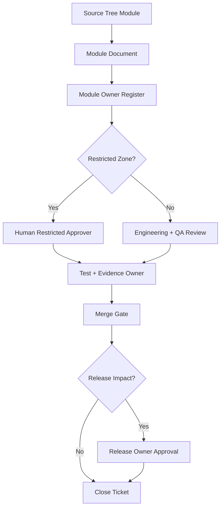

# 000420_Register_Development_Foundation_Repository_Module_Owner_Map.md

## Purpose

This document defines the project foundation topic indicated by its filename and preserves its governed documentation role within `docs/000100_project_foundation/`.


## 1. Document Control

| Field | Value |
|---|---|
| Project | yoonsul_wait_order_handoff / CatchMenu-Catch&Order |
| Band | 00100_project_foundation |
| Document Type | Register |
| Document Role | Repository Module Owner Map |
| Related Closeout | 000790_Index_Development_Foundation_Closeout_And_Runtime_Flow_Linkage.md |
| Related Hydration Guide | 000800_Guide_Development_Foundation_First_Codebase_Hydration_And_Module_Discovery.md |
| Related Implementation Ticket Template | 000810_Template_Development_Foundation_First_Flow_Bundle_Implementation_Ticket.md |
| Related Source Tree Matrix | 000820_Matrix_Development_Foundation_Source_Tree_To_Module_Document_Map.md |
| Related Restricted Register | 000750_Register_Development_Foundation_Restricted_File_And_Zone_Control.md |
| Related Runtime Flow Registry | 64000_Index_Runtime_Flow_Bundle_Registry.md |
| Status | Draft |
| Owner | Product / Architecture / Engineering / QA / Compliance |
| AI Solo Change | Prohibited for owner assignment and restricted-zone approval |

---

## 2. Purpose

This register maps repository modules to accountable owners.

It exists because Flow Bundle implementation cannot be safely delegated to Claude Code, Cursor, or a human developer unless the following are known:

1. which module is being touched
2. who owns the module
3. who reviews the change
4. who approves restricted-zone work
5. who verifies tests
6. who signs off evidence
7. who controls merge and release gates

The governing chain remains:

```text
Overview → Logic → Module → File → Test → Evidence
```

---

## 3. Core Rule

Every runtime module must have an owner before implementation.

Every restricted module must have a human approver before AI-assisted implementation.

```text
No owner → no implementation handoff.
No restricted-zone approver → no restricted change.
No QA/test owner → no merge.
No evidence owner → no release.
```

---

## 4. Owner Role Definitions

| Role | Responsibility |
|---|---|
| Product Owner | Confirms business intent and customer/store/admin impact |
| Architecture Owner | Confirms module boundary, Flow Bundle fit, and document consistency |
| Engineering Owner | Owns implementation correctness and code review |
| QA Owner | Owns test coverage, regression, and evidence validation |
| Security Owner | Approves security, webhook, secret, credential, auth, and replay-risk changes |
| Compliance/Audit Owner | Approves audit ledger, evidence, legal hold, and financial-grade traceability |
| Release Owner | Approves merge/release/rollback readiness |
| Operations Owner | Approves incident, manual recovery, support, and degraded-mode procedures |

One person may hold multiple roles in early stages, but the register must explicitly record that choice.

---

## 5. Module Owner Register Template

Use this table after source tree hydration.

| Register ID | Module | Source Path | Related Module Document | Related Flow Bundle | Primary Owner | Review Owner | QA Owner | Restricted Approver | Release Owner | Status |
|---|---|---|---|---|---|---|---|---|---|---|
| MOD-001 | TBD | TBD | TBD | TBD | TBD | TBD | TBD | TBD | TBD | Draft |

---

## 6. Ownership Status Values

| Status | Meaning |
|---|---|
| Draft | Proposed owner assignment |
| Candidate | Likely owner but not confirmed |
| Confirmed | Owner accepted responsibility |
| Restricted | Module requires special approval |
| Blocked | Owner or approver missing |
| Deprecated | Module no longer active |

---

## 7. Initial Candidate Module Owner Map

These rows are initial placeholders. Replace with actual owners after repository hydration and team assignment.

| Register ID | Module | Expected Source Area | Related Flow Bundle | Primary Owner | Review Owner | QA Owner | Restricted Approver | Status |
|---|---|---|---|---|---|---|---|---|
| MOD-POS-001 | pos_gateway.approval | POS Gateway approval services/adapters | 64100_Flow_POS_Gateway_Approval_To_Audit_Ledger_And_Reconciliation.md | Engineering | Architecture / Engineering | QA | Product / Engineering / Compliance | Candidate |
| MOD-POS-002 | pos_gateway.cancel_refund | Cancel/refund/reversal services | 64110_Flow_POS_Gateway_Cancel_Refund_Recovery_And_Audit.md | Engineering | Architecture / Engineering | QA | Product / Engineering / Compliance | Candidate |
| MOD-POS-003 | pos_gateway.retry_dlq | Timeout/retry/DLQ/replay workers | 64120_Flow_POS_Gateway_Timeout_Retry_DLQ_And_Replay.md | Engineering | Architecture / Engineering | QA | Engineering / Operations | Candidate |
| MOD-OFFLINE-001 | store_offline_ledger | Offline local ledger and resync | 64130_Flow_POS_Gateway_Store_Offline_Local_Ledger_And_Resync.md | Engineering | Architecture / Engineering | QA | Engineering / Compliance | Candidate |
| MOD-WEBHOOK-001 | webhook_boundary | Webhook verification and normalization | 64140_Flow_POS_Gateway_Webhook_Inbound_Verification_And_Event_Normalization.md | Engineering / Security | Security / Architecture | QA | Security | Candidate |
| MOD-SETTLE-001 | settlement_dispute | Settlement, dispute, evidence export | 64150_Flow_POS_Gateway_Settlement_Dispute_And_Evidence_Export.md | Engineering / Finance Ops | Compliance / Architecture | QA | Product / Compliance / Finance Ops | Candidate |
| MOD-AUDIT-001 | audit_ledger | Audit append, evidence, tamper-evidence | 64100~64150 | Engineering / Compliance | Compliance / Architecture | QA | Compliance | Candidate |
| MOD-ADMIN-001 | admin_recovery | Manual recovery and approval controls | 64110 / 64120 / 64130 / 64150 | Engineering / Operations | Product / Operations | QA | Operations / Compliance | Candidate |
| MOD-TEST-001 | test_harness | Unit/integration/contract/fault/security/audit tests | 64220_Matrix_Flow_To_Test_Coverage_Map.md | QA / Engineering | Architecture / QA | QA | Depends on tested zone | Candidate |

---

## 8. Restricted Ownership Requirements

| Restricted Zone | Required Approver |
|---|---|
| RZ-PAY Payment approval/cancel/refund/reversal | Product Owner + Engineering Owner + Compliance/Audit Owner |
| RZ-SETTLE Settlement/reconciliation/dispute | Product Owner + Compliance/Audit Owner + Finance/Ops Owner |
| RZ-AUDIT Audit ledger/tamper-evidence/legal hold | Compliance/Audit Owner + Architecture Owner |
| RZ-SEC Security/auth/signature/webhook verification | Security Owner + Architecture Owner |
| RZ-SECRET Secret/token/credential/vault | Security Owner only |
| RZ-DB DB migration/schema/backfill/data repair | Engineering Owner + Release Owner |
| RZ-DEPLOY CI/CD/production release/rollback | Release Owner + Engineering Owner |
| RZ-OPS Incident/manual recovery/admin override | Operations Owner + Compliance/Audit Owner |
| RZ-PII PII/payment log masking/export | Security Owner + Compliance/Audit Owner |
| RZ-CONTRACT Provider contract/API schema | Architecture Owner + Engineering Owner + Provider Integration Owner |

---

## 9. Owner Approval Matrix

Use this matrix when a ticket or Flow Bundle is prepared.

| Work Type | Product | Architecture | Engineering | QA | Security | Compliance/Audit | Operations | Release |
|---|---:|---:|---:|---:|---:|---:|---:|---:|
| Documentation-only | Review | Approve | Optional | Optional | Optional | Optional | Optional | N/A |
| Runtime logic change | Approve | Approve | Approve | Review | Conditional | Conditional | Conditional | Conditional |
| Payment change | Approve | Approve | Approve | Approve | Conditional | Approve | Optional | Conditional |
| Settlement change | Approve | Approve | Approve | Approve | Optional | Approve | Approve | Conditional |
| Audit ledger change | Optional | Approve | Approve | Approve | Optional | Approve | Optional | Conditional |
| Webhook/security change | Optional | Approve | Approve | Approve | Approve | Conditional | Optional | Conditional |
| DB migration | Optional | Review | Approve | Approve | Conditional | Conditional | Optional | Approve |
| Production release | Optional | Review | Approve | Review | Conditional | Conditional | Operations Review | Approve |

---

## 10. Module Handoff Readiness By Ownership

A module is ready for AI or human implementation handoff only when:

- [ ] Primary owner is assigned.
- [ ] Review owner is assigned.
- [ ] QA owner is assigned.
- [ ] Restricted approver is assigned if required.
- [ ] Release owner is assigned if merge/release impact exists.
- [ ] Related Module Document is linked.
- [ ] Related Source Tree mapping exists.
- [ ] Related Flow Bundle is linked.
- [ ] Evidence owner is identified.
- [ ] Owner approval route is clear.

---

## 11. Owner Change Control

Owner changes must be recorded.

| Change Type | Required Action |
|---|---|
| Owner unavailable | Assign delegate before implementation |
| Module moves to another team | Update source tree matrix and owner register |
| Restricted zone discovered | Add restricted approver |
| New provider integration added | Add provider integration owner |
| Audit/security risk increases | Add compliance/security owner |
| Release responsibility changes | Update release owner |

---

## 12. Escalation Rules

| Situation | Escalation |
|---|---|
| No owner for runtime module | Architecture Owner |
| No approver for restricted zone | Product Owner + Architecture Owner |
| Security owner missing for security/secret change | Block and escalate to Security Owner |
| Compliance owner missing for audit/settlement change | Block and escalate to Compliance/Audit Owner |
| QA owner missing for implementation | Block merge |
| Release owner missing for deploy/release change | Block release |
| Ownership conflict | Product Owner + Architecture Owner decision |

---

## 13. Relationship With Implementation Tickets

Every implementation ticket must reference this register.

```text
000810_Template_Development_Foundation_First_Flow_Bundle_Implementation_Ticket.md
  ↓
000830_Register_Development_Foundation_Repository_Module_Owner_Map.md
```

The ticket must list:

```text
primary_owner
review_owner
qa_owner
restricted_approver
release_owner
evidence_owner
```

If a required owner is missing, the ticket status is `Blocked`.

---

## 14. Relationship With Runtime Flow Bundle Governance

This owner map links to:

```text
64380_Register_Flow_Bundle_No_AI_Solo_Zone_Owner_And_Approval_Matrix.md
```

The 64380 register controls Flow Bundle-level No-AI-Solo approval.  
This 00830 register controls repository module-level ownership.

Both must agree before restricted implementation proceeds.

---

## 15. Mermaid Ownership Flow



---

## 16. Open Questions

| Question | Owner | Blocking? |
|---|---|---:|
| Who is the initial owner for POS Gateway approval implementation? | Product / Architecture | Yes |
| Who approves payment-related restricted changes in early-stage development? | Product / Compliance | Yes |
| Who owns audit ledger evidence review? | Compliance / Architecture | Yes |
| Who owns DB migration approval? | Engineering / Release | Yes |
| Who owns release gate until a formal DevOps role exists? | Product / Engineering | Yes |

---

## 17. Summary

This register assigns accountability to repository modules.

It ensures that source files are not just mapped technically, but owned operationally.

Implementation must remain traceable through:

```text
Overview → Logic → Module → File → Test → Evidence
```

and every restricted-zone change must have a human owner before Claude Code, Cursor, or a developer proceeds.
