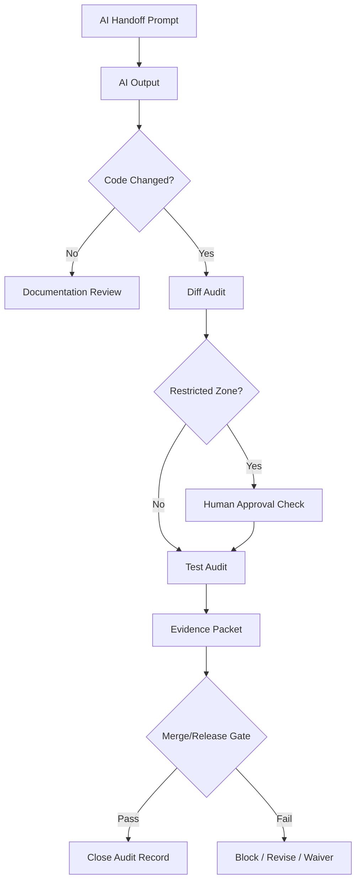

# 000760_Audit_Development_Foundation_AI_Assisted_Change_Control.md

## 1. Document Control

| Field | Value |
|---|---|
| Project | yoonsul_wait_order_handoff / CatchMenu-Catch&Order |
| Band | 00100_project_foundation |
| Document Type | Audit |
| Document Role | AI-Assisted Change Control Audit |
| Related Policy | 000640_Policy_Development_Foundation_Overview_Logic_Module_Documentation_Model.md |
| Related Registry | 000650_Index_Development_Foundation_Overview_Logic_Module_Registry.md |
| Related Matrix | 000690_Matrix_Development_Foundation_Overview_Logic_Module_Traceability.md |
| Related Handoff Checklist | 000700_Checklist_Development_Foundation_Code_Handoff_Readiness.md |
| Related Inspection Runbook | 000710_Runbook_Development_Foundation_Codebase_Read_Only_Inspection.md |
| Related Prompt Pack | 000740_Template_Development_Foundation_AI_Handoff_Prompt_Pack.md |
| Related Restricted Register | 000750_Register_Development_Foundation_Restricted_File_And_Zone_Control.md |
| Related Runtime AI Governance | 64360_Audit_Flow_Bundle_AI_Assisted_Implementation_Governance.md |
| Status | Draft |
| Owner | Architecture / Engineering / QA / Compliance |
| AI Solo Change | Prohibited for audit approval and restricted-zone closeout |

---

## 2. Purpose

This audit document defines how AI-assisted development changes must be recorded, reviewed, and controlled.

It applies whenever ChatGPT, Claude Code, Cursor, or another AI-assisted tool participates in:

- documentation drafting
- read-only codebase inspection
- Flow Bundle implementation
- local file editing
- test generation
- diff review
- evidence packet preparation
- release readiness review

The objective is not to ban AI tools.  
The objective is to make AI participation traceable, bounded, reviewable, and auditable.

---

## 3. Core Audit Rule

Every AI-assisted change must preserve the project chain:

```text
Overview → Logic → Module → File → Test → Evidence
```

Every runtime-impacting AI-assisted change must also preserve the Flow Bundle chain:

```text
Flow Step → Module → File → Test → Evidence
```

If the AI was involved but the change cannot be traced through these chains, the change must be blocked from merge or release.

---

## 4. Audit Scope

### 4.1 Included

| Activity | Audit Required? |
|---|---:|
| AI drafted or updated development foundation documents | Yes |
| AI drafted Flow Bundle documents | Yes |
| AI performed read-only codebase inspection | Yes |
| AI suggested implementation changes | Yes |
| AI applied or generated source code patches | Yes |
| AI generated or modified tests | Yes |
| AI reviewed a diff | Yes |
| AI prepared evidence packets | Yes |
| AI touched restricted-zone planning | Yes |

### 4.2 Excluded

| Activity | Audit Required? |
|---|---:|
| Casual architecture discussion with no artifact | Optional |
| Non-project explanation with no resulting document | No |
| User-only manual code change with no AI involvement | Use normal engineering audit |
| Pure copyediting of non-runtime prose | Lightweight audit only |

---

## 5. AI Tool Classification

| Tool / Actor | Audit Classification | Notes |
|---|---|---|
| ChatGPT | Planning / Documentation / Review Support | May draft docs and prompts; cannot approve restricted changes |
| Claude Code | Read-only Inspection / Flow Bundle Implementation | Must receive approved handoff packet |
| Cursor | IDE Assist / File-Level Edit / Diff Navigation | Must remain narrow in scope |
| Other AI Tool | External AI Assistant | Must be logged before use |
| Human Owner | Approver / Reviewer | Final accountable party |

---

## 6. AI-Assisted Change Audit Record Template

Use this template for each AI-assisted change.

```text
# AI-Assisted Change Audit Record

## 1. Change Summary
- Change ID:
- Date:
- Project:
- Related Flow Bundle:
- Related task:
- Change type:
- AI tool used:
- Human owner:

## 2. Input Context
- Prompt used:
- Documents provided:
- Files provided:
- Inspection report:
- Handoff checklist:
- Restricted file register:
- Approval record:

## 3. Scope
- Allowed files:
- Prohibited files:
- Restricted zones:
- Expected tests:
- Evidence target:

## 4. AI Output
- Summary:
- Files suggested:
- Files changed:
- Tests suggested:
- Tests changed:
- Risks identified:
- Questions raised:

## 5. Human Review
- Reviewer:
- Review date:
- Accepted:
- Rejected:
- Requires revision:
- Notes:

## 6. Test And Evidence
- Tests run:
- Tests not run:
- Results:
- Evidence packet:
- Missing evidence:

## 7. Final Decision
- Merge allowed:
- Release allowed:
- Blocked reason:
```

---

## 7. Required Audit Fields

| Field | Required For Documentation | Required For Code | Required For Restricted Zone |
|---|---:|---:|---:|
| Prompt used | Yes | Yes | Yes |
| Documents read | Yes | Yes | Yes |
| Flow Bundle reference | Conditional | Yes | Yes |
| Overview document | Conditional | Yes | Yes |
| Logic document | Conditional | Yes | Yes |
| Module document | Conditional | Yes | Yes |
| Changed files | No | Yes | Yes |
| Restricted file check | Conditional | Yes | Yes |
| Human approval record | No | Conditional | Yes |
| Tests run / not run | Conditional | Yes | Yes |
| Evidence packet | Conditional | Yes | Yes |
| Final decision | Yes | Yes | Yes |

---

## 8. Change Type Classification

| Change Type | Description | Required Gate |
|---|---|---|
| DOC-ONLY | Documentation only, no runtime impact | Documentation review |
| DOC-RUNTIME | Documentation changes runtime expectation | Logic review |
| READONLY-INSPECT | Codebase inspected but not changed | Inspection report |
| CODE-NONCRITICAL | Non-critical code change | Module map + tests |
| CODE-RUNTIME | Runtime behavior change | Full handoff checklist |
| CODE-RESTRICTED | Restricted-zone code change | Human approval + evidence |
| TEST-ONLY | Test added/updated | Test review |
| MIGRATION | DB migration/schema/backfill | DB approval |
| SECURITY | Auth/signature/secret/security boundary | Security approval |
| RELEASE | Deployment/release/rollback | Release approval |

---

## 9. Restricted-Zone Audit Requirements

When restricted zones are involved, the audit record must show explicit human approval.

| Restricted Zone | Required Evidence |
|---|---|
| Payment approval/cancel/refund/reversal | approval record + payment test evidence |
| Settlement/reconciliation/dispute | reconciliation evidence + financial review |
| Audit ledger/tamper-evidence/legal hold | audit evidence packet + compliance review |
| Security/auth/signature/webhook verification | security review + attack/failure tests |
| Secret/token/credential/vault handling | secret control review + no-leak evidence |
| DB migration/schema/backfill/data repair | migration plan + rollback/backout evidence |
| Production deployment/release/rollback | release gate approval + rollback plan |
| PII/payment log masking/export | privacy/security review + masking tests |

---

## 10. Prompt Audit

The exact prompt or summarized prompt must be preserved.

| Prompt Element | Required |
|---|---:|
| Task objective | Yes |
| Scope boundary | Yes |
| Allowed files | Yes for code |
| Prohibited files | Yes for code |
| Related documents | Yes |
| No-AI-Solo warning | Yes for restricted risk |
| Required output format | Yes |
| Stop conditions | Yes |
| Human approval reference | Required for restricted work |

Unsafe prompts must be rejected and rewritten.

Examples of unsafe prompts:

```text
Read this MD and implement it.
Fix all related files.
Refactor as needed.
Make the system work.
Update DB and deploy.
You decide the best financial behavior.
```

---

## 11. Diff Audit

For code changes, the diff audit must answer:

| Question | Required Answer |
|---|---|
| Which files changed? | List |
| Were all changed files approved in the Module Document? | Yes/No |
| Did restricted files change? | Yes/No |
| Was approval recorded for restricted changes? | Yes/No/Not applicable |
| Were tests added or updated? | Yes/No |
| Were test results recorded? | Yes/No |
| Did the diff include unrelated refactor? | Yes/No |
| Did the diff change public API/schema? | Yes/No |
| Did the diff change DB migration/secret/release files? | Yes/No |
| Is evidence packet updated? | Yes/No |

If any answer indicates scope breach, merge must be blocked.

---

## 12. Test Audit

| Test Category | Required When | Evidence |
|---|---|---|
| Unit | Logic guards or module functions changed | unit test report |
| Integration | Runtime module interaction changed | integration test report |
| Contract | API/provider schema changed | contract test report |
| Fault injection | Timeout/retry/DLQ/replay affected | fault test report |
| Security | Signature/secret/auth/replay affected | security test report |
| Audit | Ledger/evidence behavior changed | audit test report |
| Migration | DB/schema/backfill changed | migration test report |
| Regression | Incident or bug fixed | regression test report |

If tests cannot be run, the reason must be recorded.

Do not claim that tests passed unless they were actually run.

---

## 13. Evidence Audit

Evidence must be linked to the change.

| Evidence Type | Required For |
|---|---|
| Handoff prompt | all AI-assisted implementation |
| Read-only inspection report | unknown code surface |
| Module map | code changes |
| Restricted approval | restricted changes |
| Diff review | code changes |
| Test result | implementation and release |
| Evidence packet | merge/release |
| Release gate | production release |
| Exception/waiver log | approved deviations |

---

## 14. Exception And Waiver Handling

If a required audit item is missing, create an exception record.

| Missing Item | Can Be Waived? | Rule |
|---|---:|---|
| Prompt record | Conditional | Explain and reconstruct summary |
| Logic document | No for runtime change | Must create/update first |
| Module document | No for code change | Must create/update first |
| Test coverage | Conditional | Must record risk and blocker |
| Human approval for restricted zone | No | Required |
| Evidence packet | No for release | Required |
| Release gate | No for production release | Required |

---

## 15. Audit Closeout Checklist

Before the AI-assisted change is closed:

- [ ] Change type is classified.
- [ ] AI tool used is identified.
- [ ] Prompt is recorded.
- [ ] Related documents are listed.
- [ ] Flow Bundle is linked when runtime-impacting.
- [ ] Overview/Logic/Module chain is complete when required.
- [ ] Changed files are listed.
- [ ] Restricted file check is complete.
- [ ] Human approval is recorded when required.
- [ ] Tests are listed.
- [ ] Test results or test blockers are recorded.
- [ ] Evidence packet is linked.
- [ ] Final decision is recorded.
- [ ] Any exception/waiver is logged.

---

## 16. Audit Trail Storage

Recommended storage locations:

| Artifact | Suggested Location |
|---|---|
| AI prompts | docs audit/evidence folder or issue/ticket |
| Read-only inspection reports | development foundation evidence folder |
| Diff review notes | PR description or evidence packet |
| Test reports | CI artifact or evidence packet |
| Restricted approvals | approval matrix / register |
| Release decisions | release gate record |
| Waivers | exception and waiver register |

---

## 17. Mermaid Audit Flow



---

## 18. Relationship With Runtime Flow Bundle Audit

This document governs development foundation AI-assisted change control.

The runtime Flow Bundle equivalent is:

```text
64360_Audit_Flow_Bundle_AI_Assisted_Implementation_Governance.md
```

Use both documents together:

```text
00640~00760 Development Foundation
  ↓
64000~64390 Runtime Flow Bundle Implementation Gate
  ↓
Evidence Packet / Review / Release
```

---

## 19. Summary

AI-assisted development is allowed only when bounded, traceable, and reviewable.

The audit trail must show:

```text
what was asked
what context was provided
what AI produced
what files changed
what tests proved it
what evidence was stored
who approved restricted work
whether merge/release was allowed
```

No AI-assisted runtime change is complete until the audit record is closed.
