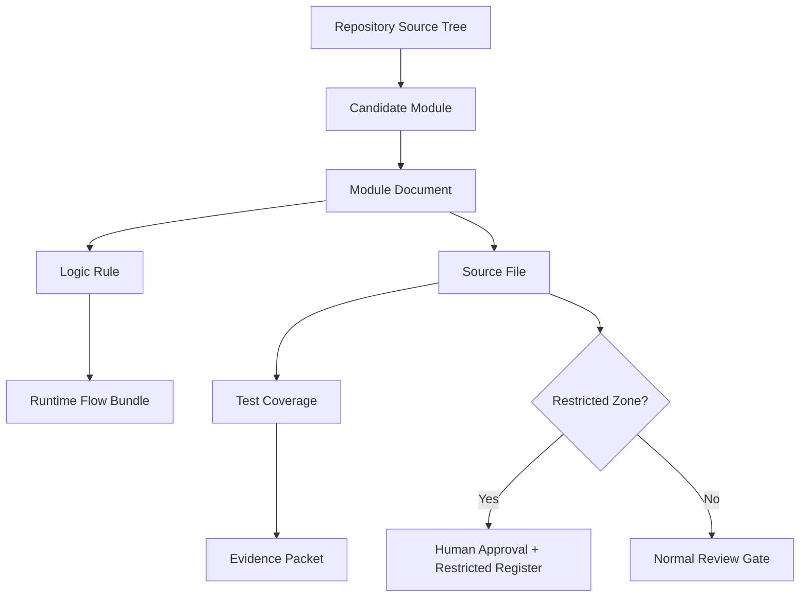

# 000820_Matrix_Development_Foundation_Source_Tree_To_Module_Document_Map.md

## 1. Document Control

| Field | Value |
|---|---|
| Project | yoonsul_wait_order_handoff / CatchMenu-Catch&Order |
| Band | 00100_project_foundation |
| Document Type | Matrix |
| Document Role | Source Tree To Module Document Map |
| Related Closeout | 000790_Index_Development_Foundation_Closeout_And_Runtime_Flow_Linkage.md |
| Related Hydration Guide | 000800_Guide_Development_Foundation_First_Codebase_Hydration_And_Module_Discovery.md |
| Related Implementation Ticket Template | 000810_Template_Development_Foundation_First_Flow_Bundle_Implementation_Ticket.md |
| Related Policy | 000640_Policy_Development_Foundation_Overview_Logic_Module_Documentation_Model.md |
| Related Traceability Matrix | 000690_Matrix_Development_Foundation_Overview_Logic_Module_Traceability.md |
| Related Restricted Register | 000750_Register_Development_Foundation_Restricted_File_And_Zone_Control.md |
| Related Runtime Flow Registry | 64000_Index_Runtime_Flow_Bundle_Registry.md |
| Status | Draft |
| Owner | Architecture / Engineering / QA |
| AI Solo Change | Mapping assistance allowed; restricted file approval prohibited |

---

## 2. Purpose

This matrix maps the actual repository source tree to approved Module Documents.

It exists to prevent implementation agents from guessing which files belong to which runtime module.

The required chain remains:

```text
Overview → Logic → Module → File → Test → Evidence
```

This document focuses on the `Module → File` section of the chain.

---

## 3. Core Rule

Every source file that participates in a runtime Flow Bundle must be mapped to one of the following:

| Mapping Result | Meaning |
|---|---|
| Approved Module Document | File is assigned to a known module document |
| Candidate Module Document | File likely belongs to a module, but document must be created/updated |
| Restricted Register | File is sensitive and must be controlled |
| Test Coverage Map | File requires specific test coverage |
| Unmapped / Blocked | File must not be modified until mapped |

No Claude Code or Cursor implementation task may modify an unmapped runtime file.

---

## 4. Source Tree Mapping Template

Use this table after codebase hydration.

| Map ID | Source Path | Source Type | Candidate Module | Module Document | Related Flow Bundle | Related Logic | Restricted Zone | Test Coverage | Status |
|---|---|---|---|---|---|---|---|---|---|
| STM-001 | TBD | folder/file/api/table/test | TBD | TBD | TBD | TBD | TBD | TBD | Draft |

---

## 5. Source Type Values

| Source Type | Meaning |
|---|---|
| app | Application entry or frontend app |
| api | API route, RPC route, controller, handler |
| service | Business/runtime service |
| adapter | External provider adapter |
| module | Domain module folder |
| worker | Queue/DLQ/replay/async worker |
| job | Scheduled job |
| event | Event producer/consumer |
| db_model | ORM model or schema object |
| migration | DB migration |
| table | Logical DB table |
| test | Test file |
| config | Runtime configuration |
| secret | Secret/env/vault area |
| deploy | CI/CD/deploy/infra |
| docs | Documentation |
| unknown | Needs inspection |

---

## 6. Status Values

| Status | Meaning |
|---|---|
| Draft | Proposed mapping, not reviewed |
| Candidate | Likely mapping, needs confirmation |
| Mapped | Confirmed to Module Document |
| Restricted | Controlled by restricted file register |
| Test-Mapped | Test coverage is identified |
| Approved | Ready for handoff scope |
| Blocked | Must not be modified yet |
| Deprecated | No longer active but retained for audit |

---

## 7. Initial Candidate Domain Map

Use this as the first logical grouping before actual codebase paths are known.

| Candidate Module | Expected Source Area | Related Flow Bundle | Expected Module Document | Restricted Zone |
|---|---|---|---|---|
| pos_gateway.approval | POS Gateway approval services/adapters | 64100_Flow_POS_Gateway_Approval_To_Audit_Ledger_And_Reconciliation.md | TBD | RZ-PAY / RZ-CONTRACT |
| pos_gateway.cancel_refund | Cancel/refund/reversal services | 64110_Flow_POS_Gateway_Cancel_Refund_Recovery_And_Audit.md | TBD | RZ-PAY |
| pos_gateway.retry_dlq | Timeout/retry/DLQ/replay workers | 64120_Flow_POS_Gateway_Timeout_Retry_DLQ_And_Replay.md | TBD | RZ-PAY / RZ-OPS |
| store_offline_ledger | Offline local ledger and resync | 64130_Flow_POS_Gateway_Store_Offline_Local_Ledger_And_Resync.md | TBD | RZ-DB / RZ-AUDIT |
| webhook_boundary | Webhook verification and normalization | 64140_Flow_POS_Gateway_Webhook_Inbound_Verification_And_Event_Normalization.md | TBD | RZ-SEC / RZ-CONTRACT |
| settlement_dispute | Settlement, dispute, evidence export | 64150_Flow_POS_Gateway_Settlement_Dispute_And_Evidence_Export.md | TBD | RZ-SETTLE / RZ-AUDIT |
| audit_ledger | Audit event append, evidence, hash/tamper controls | 64100~64150 | TBD | RZ-AUDIT |
| admin_recovery | Manual recovery and approval controls | 64110 / 64120 / 64130 / 64150 | TBD | RZ-OPS |
| customer_status_projection | Customer/store visible state projection | 64100 / 64110 / 64120 / 64130 | TBD | Conditional |
| test_harness | Unit/integration/contract/fault/security/audit tests | 64220_Matrix_Flow_To_Test_Coverage_Map.md | TBD | Conditional |

---

## 8. Actual Source Tree Mapping Section

Fill this section after read-only hydration.

| Map ID | Source Path | Source Type | Candidate Module | Module Document | Related Flow Bundle | Related Logic | Restricted Zone | Test Coverage | Status |
|---|---|---|---|---|---|---|---|---|---|
| STM-ACTUAL-001 | TBD | TBD | TBD | TBD | TBD | TBD | TBD | TBD | Draft |
| STM-ACTUAL-002 | TBD | TBD | TBD | TBD | TBD | TBD | TBD | TBD | Draft |
| STM-ACTUAL-003 | TBD | TBD | TBD | TBD | TBD | TBD | TBD | TBD | Draft |

---

## 9. Restricted Source Mapping

Any file or folder matching restricted behavior must be mapped here and synchronized with:

```text
000750_Register_Development_Foundation_Restricted_File_And_Zone_Control.md
```

| Restricted Map ID | Source Path | Zone Code | Restriction Level | Related Module | Approval Required? | Evidence |
|---|---|---|---|---|---:|---|
| RSTM-001 | TBD | RZ-PAY | Restricted | TBD | Yes | TBD |
| RSTM-002 | TBD | RZ-AUDIT | Restricted | TBD | Yes | TBD |
| RSTM-003 | TBD | RZ-SEC | Restricted | TBD | Yes | TBD |
| RSTM-004 | TBD | RZ-DB | Restricted | TBD | Yes | TBD |
| RSTM-005 | TBD | RZ-DEPLOY | Locked | TBD | Yes | TBD |

---

## 10. Test Source Mapping

Every runtime module must map to test coverage.

| Test Map ID | Test Path | Test Type | Covered Source Path | Covered Module | Related Logic Rule | Related Flow Bundle | Status |
|---|---|---|---|---|---|---|---|
| TSTM-001 | TBD | Unit | TBD | TBD | TBD | TBD | Draft |
| TSTM-002 | TBD | Integration | TBD | TBD | TBD | TBD | Draft |
| TSTM-003 | TBD | Contract | TBD | TBD | TBD | TBD | Draft |
| TSTM-004 | TBD | Fault Injection | TBD | TBD | TBD | TBD | Draft |
| TSTM-005 | TBD | Security | TBD | TBD | TBD | TBD | Draft |
| TSTM-006 | TBD | Audit | TBD | TBD | TBD | TBD | Draft |

---

## 11. Mapping Rules By File Category

### 11.1 Runtime Service Files

Runtime services must map to:

```text
Logic rule
Module document
Runtime Flow Bundle
Test coverage
Evidence packet
Restricted zone where applicable
```

### 11.2 Provider Adapter Files

Provider adapters must map to:

```text
Provider contract
Webhook/security rules
Idempotency rules
Contract tests
Security tests
Evidence packet
```

### 11.3 DB / Migration Files

DB/migration files must map to:

```text
DB approval
Migration plan
Rollback/backout evidence
Test plan
Human approval
```

AI solo modification is prohibited.

### 11.4 Audit Ledger Files

Audit ledger files must map to:

```text
Audit policy
Tamper-evidence rules
Append-only constraints
Audit tests
Compliance approval
Evidence packet
```

AI solo modification is prohibited.

### 11.5 Test Files

Test files must map to:

```text
Source file
Logic rule
Flow step
Expected evidence
```

Test-only changes may still require review if they alter financial/audit expectations.

---

## 12. Source Tree To Flow Bundle Linkage

| Flow Bundle | Required Source Mapping |
|---|---|
| 64100 Approval to Audit Ledger and Reconciliation | approval service, provider adapter, idempotency, audit append, reconciliation hook, tests |
| 64110 Cancel Refund Recovery and Audit | cancel/refund service, reversal adapter, recovery queue, audit append, tests |
| 64120 Timeout Retry DLQ and Replay | timeout handler, retry scheduler, DLQ worker, replay guard, tests |
| 64130 Store Offline Local Ledger and Resync | local ledger, sync worker, conflict resolver, audit evidence, tests |
| 64140 Webhook Inbound Verification and Event Normalization | webhook route, signature verifier, normalizer, event store, security tests |
| 64150 Settlement Dispute and Evidence Export | settlement importer/exporter, reconciliation worker, dispute module, evidence exporter, tests |

---

## 13. Mermaid Mapping Diagram



---

## 14. Handoff Readiness Use

A Flow Bundle implementation ticket may proceed only when all intended source files are:

- [ ] listed in this matrix
- [ ] mapped to a Module Document
- [ ] linked to a Logic rule or marked as non-runtime support
- [ ] linked to a Flow Bundle where runtime-impacting
- [ ] classified for restricted-zone status
- [ ] linked to test coverage or test gap
- [ ] linked to evidence target

If not, the implementation is blocked or reduced to read-only inspection.

---

## 15. Maintenance Rule

Update this matrix when:

| Trigger | Required Update |
|---|---|
| First codebase hydration completes | Add actual source paths |
| New module is discovered | Add candidate module row |
| New Flow Bundle is added | Add Flow Bundle linkage |
| Source file moves | Update source path and related module |
| Tests are added | Update Test Source Mapping |
| Restricted file discovered | Update restricted mapping and 00750 |
| Module document created | Replace TBD with filename |
| Implementation ticket created | Link source rows to ticket |

---

## 16. Open Questions

| Question | Owner | Blocking? |
|---|---|---:|
| What is the actual repository source tree for POS Gateway modules? | Engineering | Yes |
| Which folders contain payment/audit/security restricted code? | Engineering / Security | Yes |
| Which test framework and test folder structure are used? | Engineering / QA | Yes |
| Which module documents should be created first? | Architecture | Yes |
| Which Flow Bundle is first implementation candidate? | Product / Architecture | Yes |

---

## 17. Summary

This matrix is the source tree bridge between the documentation model and the real codebase.

It prevents uncontrolled implementation by ensuring that every source file is mapped into:

```text
Overview → Logic → Module → File → Test → Evidence
```

Runtime work remains blocked until source files, tests, restricted zones, and evidence targets are mapped.
