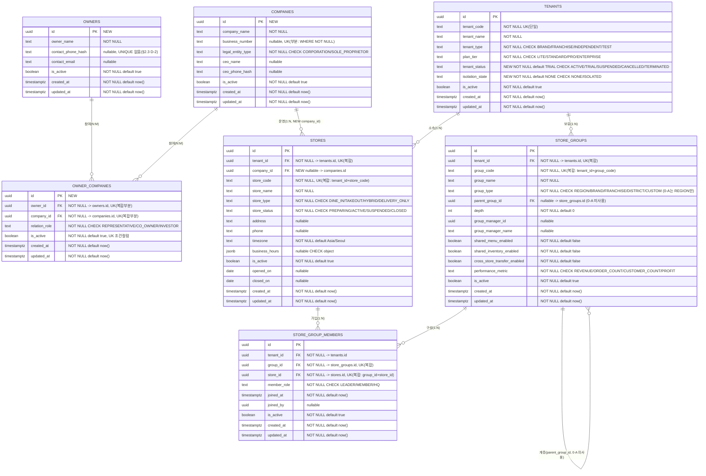

# 601501 ERD — 0-A Tenant / Company / HQ / Store

- **나선**: 0단계(운영 권위 기반) · **하위 나선 0-A** Tenant / Company / HQ / Store
- **단계**: §47.1 6단계 나선 중 **2단계 (ERD)** — 3단계 검증 반영 완료본
- **작성**: Claude Code
- **상태**: **v2 (3단계 인접도메인 대조 반영)**. 4단계 설계문서(601502 Overview / 601503 Logic)로 이관됨
- **선행 근거**: §48 Cursor 증거수집, 1단계 Human 업무규칙 선언, 3단계 인접도메인 대조(Opus 5, 별도 세션 — §47.1 세션 분리 요건 충족)

> **가드레일 준수(§47.2, §47.6)**: `.sql` 생성/수정 없음. `franchise_brands`(0085) 변경 없음.

## 개정 이력

| 버전 | 변경 | 근거 |
|---|---|---|
| v1 | 최초 ERD 초안 | 1단계 업무규칙 + §48 증거수집 |
| **v2** | B-1(tenant_status/isolation_state 2컬럼 분리), B-2(RLS deny-by-default 확정, "RLS 미정" 삭제), A-1~A-7 전량 반영 | 3단계 인접도메인 대조(Opus 5) + ChatGPT 교차검증 |

---

## §0. 확정 업무규칙 및 축 정의

### §0.1 1단계 Human 선언 (그대로 반영)

| # | 규칙 | ERD 반영 |
|---|---|---|
| 1 | **Tenant** 1개 — 브랜드 전체 경계, 기존 유지(0002) | `tenants` 유지 + 상태컬럼 2개 추가(§3.3) |
| 2 | **Owner**(사람) — 전역(tenant 무관), 신규 | `owners` 신규 |
| 3 | **Company**(사업자/법인) — 전역, 신규. Tenant에 직접 연결 안 함 → Store 경유 간접 | `companies` 신규, `stores.company_id`로만 연결 |
| 4 | **owner_companies** — Owner↔Company N:M | `owner_companies` 신규 |
| 5 | **운영본부(지역)** — 신규 테이블 금지, `store_groups` 재사용 | `group_type='REGION'`만 사용(§0.3) |
| 6 | **stores** — 기존 유지, `company_id`만 추가 | `stores.company_id` FK 신규 |
| 7 | **HQ** — 별도 테이블 아님, `catchmenu_hq` 스키마 자체가 HQ | 변경 없음 |

**핵심 위상**: `Owner ─(N:M)─ Company ─(1:N)─ Store ─(N:1)─ Tenant`.
Company와 Tenant 사이에 **직접 관계선이 없다** — 같은 Company가 서로 다른 Tenant 매장을 운영할 수 있다.

### §0.2 축 정의 — 사업자 축 vs 브랜드 축 (A-2, F-5)

`companies`(신규)와 `franchise_brands`(0085, 기존)는 **이름이 비슷해 혼동되기 쉬우나 서로 다른 축**이다.
어휘 혼동을 막기 위해 다음 2열 표를 이 도메인의 확정 정의로 고정한다.

| **사업자 축 — `companies` (0-A 소관)** | **브랜드 축 — `franchise_brands` (미래 브랜드 나선 소관)** |
|---|---|
| 법인격 (`legal_entity_type`) | 상표·브랜드명 (`brand_name`/`brand_code`) |
| 사업자번호 (`business_number`) | 로열티 정책 (`royalty_rate_pct`) |
| 대표자 (`ceo_name`) | 브랜드 가이드 (`brand_guidelines_url`/`brand_color`/`brand_logo_url`) |
| 계약 주체 — **누가 법적 책임을 지는가** | 멤버십·메뉴 공유 범위 (`shared_membership`/`shared_menu_template`) |

한 줄 판별식: **`companies`는 "누가 법적 책임을 지는가", `franchise_brands`는 "어떤 간판을 달고 무엇을 공유하는가".**

**기존 중첩 기록(해소하지 않음)**: `franchise_brands`는 이미 사업자 축 성격의 필드를 일부 포함한다 —
`hq_contact_name` / `hq_contact_email` / `hq_contact_phone`(연락 주체), `contract_start_date` /
`contract_end_date`(계약 기간). 이는 **0-A 이전부터 이미 존재하던 중첩**이며, **해소는 브랜드 나선 소관**이다.
0-A에서는 이 필드들을 건드리지 않고, 중첩이 존재한다는 사실만 기록한다(§47.2 먼 미래 상세설계 금지).

### §0.3 store_groups 사용 범위 (A-3, F-6)

- **0-A는 `group_type='REGION'`만 사용한다.** `'DISTRICT'`는 **0-A에서 사용하지 않는다**.
- `'DISTRICT'` 도입 **판정 조건**(이월): "실제 프랜차이즈 가맹계약이 체결되어, 하나의 REGION 아래에
  **독립된 관리 권역이 2개 이상** 생기고, 그 권역별로 별도 관리자·성과집계가 필요해지는 시점".
  이 조건이 성립하기 전에는 REGION 하나로 충분하며, 계층(`parent_group_id`)도 사용하지 않는다.
- `'BRAND'`/`'FRANCHISE'`/`'CUSTOM'`도 0-A 미사용(기존 CHECK 값은 그대로 두되 사용만 하지 않음).

---

## §1. Mermaid ERD

> 기존 테이블은 라이브 스키마 그대로. `NEW` 표시가 0-A 신규 요소.
> `UK` 뒤 괄호는 유니크 제약의 범위(단일/복합/부분).



### §1.1 관계 요약

| 관계 | 카디널리티 | 연결 컬럼 | 비고 |
|---|---|---|---|
| Owner ↔ Company | N:M | `owner_companies(owner_id, company_id)` | 신규 |
| Company → Store | 1:N | `stores.company_id` (NEW, nullable) | 운영 주체 |
| Tenant → Store | 1:N | `stores.tenant_id` | 기존 |
| Tenant → StoreGroup | 1:N | `store_groups.tenant_id` | 기존, REGION만 사용 |
| StoreGroup ↔ Store | N:M | `store_group_members(group_id, store_id)` | 기존 |
| StoreGroup → StoreGroup | 1:N | `store_groups.parent_group_id` | 기존, **0-A 미사용** |
| **Company ↔ Tenant** | **직접 없음** | (stores 경유 간접) | 업무규칙 3 |

---

## §2. 스키마 계약표

### §2.1 신규 테이블 제약

**owners** (전역 — `tenant_id` 컬럼 없음)

| 컬럼 | 타입 | NOT NULL | UNIQUE | CHECK / 비고 |
|---|---|---|---|---|
| id | uuid | ✓ (PK) | PK | `default gen_random_uuid()` |
| owner_name | text | ✓ | — | |
| contact_phone_hash | text | — | **없음**(§2.3 D-2 판정) | PII 평문 저장 금지 → 해시 |
| contact_email | text | — | 없음 | |
| is_active | boolean | ✓ | — | `default true` |
| created_at / updated_at | timestamptz | ✓ | — | `default now()` + `set_updated_at` 트리거 |

**companies** (전역 — `tenant_id` 컬럼 없음)

| 컬럼 | 타입 | NOT NULL | UNIQUE | CHECK / 비고 |
|---|---|---|---|---|
| id | uuid | ✓ (PK) | PK | |
| company_name | text | ✓ | — | 0112 `p_company_name` 대응 |
| business_number | text | **✗ (nullable)** | **부분 UK** `WHERE business_number IS NOT NULL` | **Human 결정(2026-08-09)** — §2.4 |
| legal_entity_type | text | ✓ | — | CHECK `('CORPORATION','SOLE_PROPRIETOR')` |
| ceo_name | text | — | — | 0112 `p_ceo_name` 대응 |
| ceo_phone_hash | text | — | — | 0112 `p_ceo_phone_hash` 대응 |
| is_active | boolean | ✓ | — | `default true` |
| created_at / updated_at | timestamptz | ✓ | — | `default now()` + 트리거 |

**owner_companies** (N:M)

| 컬럼 | 타입 | NOT NULL | UNIQUE | CHECK / 비고 |
|---|---|---|---|---|
| id | uuid | ✓ (PK) | PK | |
| owner_id | uuid | ✓ | 복합부분 UK | FK → `owners.id` |
| company_id | uuid | ✓ | 복합부분 UK | FK → `companies.id` |
| relation_role | text | ✓ | — | CHECK `('REPRESENTATIVE','CO_OWNER','INVESTOR')`, `default 'REPRESENTATIVE'` |
| is_active | boolean | ✓ | UK 조건컬럼 | `default true` |

### §2.2 기존 테이블 변경(가법적 추가만)

| 테이블 | 추가 컬럼 | NOT NULL | 비고 |
|---|---|---|---|
| `tenants` | `tenant_status text` | ✓ `default 'TRIAL'` | CHECK `('ACTIVE','TRIAL','SUSPENDED','CANCELLED','TERMINATED')` — 구독 생명주기 축 |
| `tenants` | `isolation_state text` | ✓ `default 'NONE'` | CHECK `('NONE','ISOLATED')` — 보안 격리 축 |
| `stores` | `company_id uuid` | ✗ (nullable) | FK → `companies.id` |

**기존 제약 유지 선언(A-1)**: `uq_stores_tenant_code (tenant_id, store_code)`는 **tenant 단위 유지**한다.
`company_id` 추가로 인해 store_code 유일성 범위를 company 단위로 바꾸지 **않는다** — 같은 Company가 서로 다른
Tenant에서 같은 `store_code`를 쓰는 것은 정상이며, 유일성 경계는 계속 Tenant다.

### §2.3 신규 3개 테이블의 RLS — deny-by-default 확정 (B-2)

`owners` / `companies` / `owner_companies` 3개 테이블은 **0021_enable_rls.sql의 deny-by-default 패턴을 그대로 적용**한다:

- `enable row level security` + `force row level security` 둘 다 적용
- **정책(policy)을 만들지 않는다** → `authenticated` 역할의 직접 `select`/`insert`/`update`/`delete` 전부 차단
- 접근은 `SECURITY DEFINER` RPC(소유자 `postgres`) 및 `service_role` 경로로만 — 0021이 이미 확립한 패턴과 동일

> 이 3개 테이블은 **전역(tenant 무관)** 이므로 기존 `catchmenu_hq` 테이블들이 쓰는
> `tenant_id = catchmenu_common.current_tenant_id()` 형태의 정책식을 **그대로 쓸 수 없다**.
> 이것은 미해결 공백이 아니라 **deny-by-default로 안전하게 닫힌 상태**이며, 정책 부여는 0-C 소관이다.

**0-C(Authorization) 후보 정책식 — 조인 기반(stores 경유)**:

```text
-- companies: 내 tenant의 매장을 운영하는 company만 보이게
USING (
  exists (
    select 1 from catchmenu_hq.stores s
    where s.company_id = companies.id
      and s.tenant_id = catchmenu_common.current_tenant_id()
  )
)

-- owners: owner_companies -> companies -> stores 2단 조인
USING (
  exists (
    select 1
    from catchmenu_hq.owner_companies oc
    join catchmenu_hq.stores s on s.company_id = oc.company_id
    where oc.owner_id = owners.id
      and oc.is_active = true
      and s.tenant_id = catchmenu_common.current_tenant_id()
  )
)
```

0-C에서 반드시 함께 판단할 것: (a) 조인 정책의 성능(인덱스 `stores.company_id` 필요),
(b) `company_id IS NULL`인 store만 가진 company는 어떤 정책으로도 안 보이게 되는 문제,
(c) 이 정책이 "다른 tenant도 이 company를 쓴다"는 사실을 노출하지 않는지.

### §2.4 유니크 제약 3건 판정 (A-5 / D-1~D-4)

| # | 대상 | 판정 | 근거 |
|---|---|---|---|
| D-1 | `companies.business_number` | **nullable + 부분 UNIQUE** (`WHERE business_number IS NOT NULL`) | Human 결정(2026-08-09). 1호점 실제 사업자번호가 **아직 미확정**이므로 NOT NULL은 즉시 걸림돌이 되고, placeholder를 넣으면 그 가짜값이 UNIQUE 슬롯을 점유해 2건 이상 만들 수 없다. 부분 UNIQUE는 "실제 번호끼리는 전역 유일"을 보장하면서 미확정 상태를 허용한다. 번호 확정 후 NOT NULL 승격은 가법적으로 가능. |
| D-2 | `owners.contact_phone_hash` 부분 유니크 여부 | **걸지 않음** | 사람에게는 안정적 자연키가 없다 — 동명이인, 번호 공유(가족/법인 대표번호), 번호 변경이 모두 정상이다. 전역 유니크를 걸면 "이 번호의 사람이 이미 등록됨"을 알려주는 **존재탐지 오라클**이 되고(§4-2와 동일 위험), 정상 케이스를 DB 레벨에서 거부한다. 중복 owner 방지는 RPC/운영 절차(0-C) 소관으로 이월. |
| D-3 | `owner_companies(owner_id, company_id)` **재가입 불가 문제** | **부분 UNIQUE** (`WHERE is_active = true`) | 전체 UNIQUE로 걸면 관계를 `is_active=false`로 종료한 뒤 **같은 Owner가 같은 Company에 다시 참여할 수 없다**(이력 행이 슬롯을 영구 점유). 부분 인덱스는 "동시에 활성인 관계는 최대 1건"만 강제하고, 종료된 이력 행은 여러 건 남을 수 있게 한다 — 재가입 가능. |
| D-4 | `stores` 기존 `uq_stores_tenant_code` | **tenant 단위 유지**(변경 없음) | §2.2 참조 |

---

## §3. phantom 컬럼 정리 방안

### §3.1 `tenants.company_name` / `business_number` / `ceo_name` (phantom)

- **참조**: 0112 `t.company_name`/`t.business_number`/`t.ceo_name`(L288–290), 사업자번호 중복확인을
  `from catchmenu_hq.tenants where business_number = ...`(L401–404)로 수행.
- **실제**: `tenants`(0002)는 8컬럼뿐 — 세 컬럼 모두 **없음**.
- **정리**: 이 값들은 **Company의 속성**이다. 업무규칙 3(한 Tenant에 여러 Company 가능)에 의해
  tenant 단위 "company_name"은 **정의 자체가 불가능**하다. → `companies`로 이관, 조회는 `stores.company_id` 조인.
  중복확인은 `companies.business_number` 부분 UNIQUE가 DB 레벨에서 보장.

### §3.2 `tenants.owner_name` / `owner_email` / `owner_phone` (phantom)

- **참조**: 0082 `p_owner_name` 수신 후 해당 컬럼에 기록 시도(L429, L479–483).
- **실제**: 없음.
- **정리**: `owners` + `owner_companies` 조인으로 대체.

### §3.3 `tenants.tenant_status` → **2개 컬럼으로 분리** (B-1, 최종 재확정)

**추가할 컬럼 2개**:

| 컬럼 | 정의 | 축 | 소관 |
|---|---|---|---|
| `tenant_status` | `text NOT NULL default 'TRIAL'` CHECK `('ACTIVE','TRIAL','SUSPENDED','CANCELLED','TERMINATED')` | 구독 생명주기 | 과금/구독 |
| `isolation_state` | `text NOT NULL default 'NONE'` CHECK `('NONE','ISOLATED')` | 보안 격리 | 보안 |

**두 축은 직교(orthogonal)하며 동시 표현 가능하다** — 예: `TRIAL` + `ISOLATED`, `ACTIVE` + `ISOLATED`.

**근거(라이브 코드 확인)**: 1컬럼 구조는 "구독상태 + 격리여부"를 동시에 표현할 수 없다는 **원리적 한계**를 가지며,
이것이 아래 상호 파괴의 진짜 원인이다:

1. `catchmenu_common.isolate_tenant()`(0090)는 `v_new_status := case p_isolate when true then 'ISOLATED' else 'ACTIVE' end`(L1283–1286)로 계산해 `tenant_status`에 덮어쓴다(L1293–1295).
2. `manage_subscription()`(0112)의 `SUSPEND` 분기는 `tenant_status='SUSPENDED'`를 쓴 **직후**(L592–597) `isolate_tenant(p_isolate := true)`를 호출한다(L599–606) → 방금 쓴 `'SUSPENDED'`가 **즉시 `'ISOLATED'`로 파괴**된다.
3. 격리 해제 시 `isolate_tenant()`는 무조건 `'ACTIVE'`로 되돌린다 → **격리 전 구독상태(TRIAL/SUSPENDED 등)가 소실**된다.

**분리 후 RPC 동작 원칙**(5단계가 아닌 **후속 RPC 워크패킷**에서 구현 — §4 범위절단 참조):

- `isolate_tenant()`는 **`isolation_state`만** 변경하고 `tenant_status`는 **그대로 보존**한다.
- **격리 해제 시 `tenant_status`를 자동으로 `'ACTIVE'`로 되돌리지 않는다** — 격리 전 값을 그대로 유지한다.
- `manage_subscription()`은 `tenant_status`만 변경한다.

**파급 범위 — `WHERE tenant_status = 'ACTIVE'` 필터 (6개 파일 전체)**: §5 근거목록 참조.
2컬럼 분리 후 이 필터들은 **격리된 테넌트까지 포함하게 되므로** `AND isolation_state = 'NONE'` 보강이 필요하다.
특히 0120은 필터가 **`pg_cron_jobs.sql_command` 내부의 `$sql$...$sql$` 문자열**에 들어있어
컴파일 시점 검증이 되지 않는다 — 문자열 내부까지 함께 수정해야 한다.

### §3.4 `stores.extra_metadata` (phantom)

- **참조**: 0060 `insert ... extra_metadata`(L235), 주석 "Stores franchisee info in extra_metadata"(L946).
- **실제**: 없음.
- **정리**: 0060이 `extra_metadata`에 넣던 franchisee 정보는 이제 정식 홈(`companies`/`owners`/`owner_companies`)이
  생겼다. → 구조화 정보는 관계 테이블로 이전. 진짜 비구조적 잔여 정보가 남는지는 0060 재설계 워크패킷에서 판정하며,
  **0-A DDL 범위에서 `extra_metadata` 컬럼을 추가하지 않는다**(§4 범위절단).

### §3.5 `catchmenu_common.onboard_tenant()` — 재설계 대상 (A-4, F-7)

`onboard_tenant()`은 **서로 독립적인 4개의 이유로 현재 비작동 상태**다. 어느 하나를 고쳐도 나머지가 남는다:

| # | 결함 | 위치 |
|---|---|---|
| 1 | `tenants.business_number` 조회 — 컬럼 없음 | 0112 L401–404 |
| 2 | `provision_tenant(p_company_name/p_business_number/p_ceo_name)` 전달 — 수신측 `tenants`에 대응 컬럼 없음 | 0112 L414–417 |
| 3 | `update stores set brand_id = ...` — `stores.brand_id` 컬럼 없음 | 0112 L456–458 |
| 4 | `p_plan_tier default 'TRIAL_30'` — `chk_tenants_plan` CHECK 허용값 `('LITE','STANDARD','PRO','ENTERPRISE')`에 **없음** | 0112 L378 vs 0002 L21–23 |

**실호출자 0건** — 저장소 전체 검색 결과 애플리케이션 코드(Flutter/TS/JS/Python) 어디에서도 호출하지 않으며,
`service_role`에만 GRANT되어 있고, 0137/0138의 헬스체크 문자열(`'Run onboard_tenant()'`)만 이름을 언급한다.

→ **판정: 재설계 대상.** 부분 수정이나 "조건부 no-op 격리" 같은 우회는 채택하지 않는다
(v1 초안의 해당 대안은 삭제됨). 재설계는 0-A DDL 범위 밖의 **별도 후속 워크패킷**이다.

### §3.6 `stores.brand_id` (phantom) — 0-A 범위 밖, 이월

- **참조**: 0112 L456–458. **실제**: `stores`에 없음(`brand_id`는 `menu_templates`에만 존재).
- **정리**: 브랜드-매장 연결은 **브랜드 축(§0.2) = 미래 브랜드 나선 소관**. 0-A에서 추가하면 §47.2 위반.
  → **0-A 미추가**, §3.5의 재설계 워크패킷에서 함께 판정.

### §3.7 정리 요약표

| phantom 참조 | 참조 RPC | 정리 방향 | 0-A DDL에서 컬럼 추가? |
|---|---|---|---|
| `tenants.company_name` | 0112 | `companies`로 이관 | ✗ (companies 신설) |
| `tenants.business_number` | 0112 | `companies.business_number` 부분 UK | ✗ (companies 신설) |
| `tenants.ceo_name` | 0112 | `companies.ceo_name` | ✗ (companies 신설) |
| `tenants.owner_name/email/phone` | 0082 | `owners`+`owner_companies` 조인 | ✗ (owners 신설) |
| `tenants.tenant_status` | 0090/0112/0120/0123/0129 | **2컬럼 분리 후 실제 추가** | **✓ tenants ×2** |
| `stores.extra_metadata` | 0060 | 관계 테이블로 이전 | ✗ (0-A 미추가) |
| `stores.brand_id` | 0112 | 브랜드 나선 이월 | ✗ (0-A 미추가) |

---

## §4. 3단계 검증 결과 — 최종 처분

| 항목 | 검증 결과 | 처분 |
|---|---|---|
| **B-1** | tenant_status 단일컬럼의 원리적 한계 | 2컬럼 분리 확정(§3.3) — **해소** |
| **B-2** | 전역 테이블 RLS "미정" 표현 | deny-by-default 확정(§2.3), "미정" 삭제 — **해소** |
| **A-1** (F-4) | `stores.company_id` 백필 | ADD COLUMN 선행순서 명시(601503 Logic §3), `uq_stores_tenant_code` tenant 단위 유지 선언(§2.2) |
| **A-2** (F-5) | companies↔franchise_brands 어휘 혼동 | 축 정의 2열 표(§0.2), 기존 중첩 기록 |
| **A-3** (F-6) | store_groups 사용 범위 | REGION만 사용, DISTRICT 판정조건 명시(§0.3) |
| **A-4** (F-7) | 0112 부분수정 가능성 | 4개 독립 결함 + 실호출자 0건 → 재설계 대상(§3.5), no-op 대안 삭제 |
| **A-5** (D-1~4) | 유니크 제약 | 3건 판정표(§2.4), Mermaid 반영(§1) |
| **A-6** (F-3) | `business_number` 전역 UNIQUE가 기존 어휘/FK와 충돌하는가 | **정정: 충돌 없음.** `business_number`를 참조하는 실제 FK나 유일성 계약이 기존 스키마에 **존재하지 않으므로**, 이는 기존 계약과의 충돌이 아니라 **유일성 의미론의 신규 정의**다. 다만 **존재탐지 오라클 위험**을 기록한다 — 사업자번호 중복 오류를 그대로 노출하면 "이 사업자번호가 이미 등록됨"을 미인증 호출자가 알아낼 수 있다. 오류 메시지 설계는 RPC 워크패킷/0-C 소관. |
| **A-7** | 범위 비대화 | 5단계를 **DDL 전용**으로 절단(601502 Overview §3) |

---

## §5. 근거 목록 (§46)

**방법론**
- `docs/000700_.../000701_Guide_Controlled_AI_Development_Pipeline.md` — §47.1(6단계 나선 + 세션 분리 요건), §47.2(먼 미래 상세설계 금지), §46(근거목록), §48(증거수집), §49.2(`ADD COLUMN`을 `CREATE OR REPLACE`보다 먼저 — PL/pgSQL 지연바인딩)

**기존 스키마 (그대로 표현)**
- `sql/migrations/0002_create_hq_tenant_store.sql` — `tenants`(L8–24, `chk_tenants_plan` L21–23), `stores`(L43–76, `uq_stores_tenant_code` L60)
- `sql/migrations/0021_enable_rls.sql` — deny-by-default RLS 패턴(enable+force, 정책 없음)
- `sql/migrations/0077_create_multistore_rpc.sql` — `store_groups`(L25–78, `chk_group_type` L63–71), `store_group_members`(L126–155)
- `sql/migrations/0085_create_franchise_os_foundation_rpc.sql` — `franchise_brands`(L123–160, 브랜드 축 / **참조만, 미변경**)
- `sql/migrations/0034_seed_data.sql` — 시드 tenant `YOONSUL_TEST`(L24–25), `윤슬 울산 1호점`(L52–55)

**`tenant_status` 참조 6개 파일 전량 (B-1 파급범위)**
| 파일 | 위치 | 성격 |
|---|---|---|
| `0082_create_saas_billing_rpc.sql` | L479–483 | `provision_tenant` INSERT 대상 컬럼 |
| `0090_create_multitenant_isolation_rpc.sql` | L1283–1286(`v_new_status` 계산), L1293–1295(UPDATE) | 격리 축이 구독 축을 덮어쓰는 지점 |
| `0112_create_hq_admin_rpc.sql` | L533(SELECT), L592–597(SUSPEND UPDATE), L599–606(isolate 호출) | 상호 파괴 발생 지점 |
| `0120_create_reconciliation_pipeline.sql` | L898, L916, L926 | **`pg_cron_jobs.sql_command` 내부 `$sql$` 문자열** — 컴파일 검증 안 됨 |
| `0123_create_ai_customer_center_v2.sql` | L636 | `WHERE t.tenant_status = 'ACTIVE'` |
| `0129_create_launch_readiness_package.sql` | L885 | `WHERE t.tenant_status = 'ACTIVE'` |

> `isolation_state`는 신규 컬럼이므로 기존 참조가 0건이다. 단, 위 6개 파일의 `tenant_status='ACTIVE'` 필터는
> **두 컬럼 모두**를 고려해 `AND isolation_state='NONE'`으로 보강해야 하므로, 동일한 6개 파일이
> `isolation_state`의 영향범위이기도 하다.

**기타 phantom 참조**
- `sql/migrations/0060_create_franchise_hq_rpc.sql` — `stores.extra_metadata`(L235, L946)
- `sql/migrations/0112_create_hq_admin_rpc.sql` — `stores.brand_id`(L456–458), `onboard_tenant` 시그니처(L373–384, `p_plan_tier default 'TRIAL_30'` L378)
- `sql/migrations/0137_patch_missing_functions.sql`(L64), `0138_patch_integration_functions.sql`(L59) — `'Run onboard_tenant()'` 문자열 언급(실호출 아님)

**후속 문서**
- `601502_Overview_Operational_Authority_Foundation_Ddl.md` — 4단계 Overview
- `601503_Logic_Operational_Authority_Foundation_Ddl.md` — 4단계 Logic
