# 601501 ERD — 0-A Tenant / Company / HQ / Store

- **나선**: 0단계(운영 권위 기반) · **하위 나선 0-A**
- **단계**: §47.1 6단계 나선 중 **2단계 (ERD)**
- **작성**: Claude Code
- **상태**: **v4 (3단계 2차 검증 반영 — 접근제어 사실 정정 + 대표권 테이블 분리)**
- **선행 근거**: §48 증거수집, 1단계 Human 선언, 3단계 인접도메인 대조 1차(Opus 5) 및 **2차**, 외부 검토(ChatGPT+Gemini) 합의, Architecture Verification

> **가드레일(§47.2, §47.6)**: `.sql` 생성/수정 없음. `franchise_brands`(0085) 변경 없음.

## 개정 이력

| 버전 | 변경 | 근거 |
|---|---|---|
| v1 | 최초 ERD 초안 (`companies`/`owner_companies`) | 1단계 선언 + §48 증거수집 |
| v2 | B-1(tenant_status 2컬럼 분리), B-2(RLS deny-by-default), A-1~A-7 | 3단계 1차 대조(Opus 5) |
| v3 | **LegalEntity 중심 모델** 전면 재작성, AV 7개 반영(v2의 `TRIAL_30` 오진·`service_role` 설명 정정 포함) | 외부 검토 합의 + AV |
| **v4** | **B-1 접근제어 서술 전면 재작성**(실제 차단 계층은 RLS가 아니라 GRANT+PostgREST), **B-2 `legal_entity_representatives` 별도 테이블 분리**, A-1~A-9 반영 | **3단계 2차 검증** |

**v3 → v4에서 정정된 사실 2건**:
- v3 §2.6의 "0021 패턴과 동일한 deny-by-default" 서술은 **차단 메커니즘을 잘못 지목**했다 → §2.7에서 전면 재작성.
- v3 §2.4의 대표권 표현(`is_legal_representative` + `representation_mode` 2컬럼 + 정합성 CHECK)은
  **"하나의 사실을 두 컬럼에 저장"하는 구조**였다 → §2.5에서 별도 테이블로 분리.

---

## §0. 확정 업무규칙 및 축 정의

### §0.1 최종 확정 구조

```text
Owner(사람) ↔(N:M)↔ LegalEntity(법적 사업주체, 사업자번호 보유) ↔(1:N)↔ Store
```

**핵심 원칙 2가지 (재논의 금지)**:

1. **법인(`CORPORATION`)은 별도 테이블이 아니라 `legal_entities.entity_type`의 한 값이다.**
   개인사업자·법인·조합·비영리는 전부 같은 테이블의 서로 다른 `entity_type`이며, 법적 사업주체를 담는 테이블은 **`legal_entities` 하나뿐**이다. (A-2)
2. **Store는 항상 정확히 1개의 LegalEntity에만 연결된다.** `company_id`/`owner_id`로 갈라지는 **두 갈래 FK 분기가 없다** — `legal_entity_id` 하나로 통일한다.

원칙 2의 이유: 두 갈래 FK를 두면 "이 매장의 법적 책임 주체가 누구인가"에 대한 답이 두 곳에 생기고,
둘이 어긋나는 순간 어느 쪽이 진실인지 판정할 방법이 없다. 이는 §3의 `tenant_status` 상호 파괴와
**정확히 같은 종류의 결함**이다 — 하나의 사실을 두 곳에 저장하면 반드시 갈라진다.
v4의 §2.5(대표권 테이블 분리)도 **같은 원칙을 대표권에 적용한 결과**다.

### §0.2 1단계 Human 선언과의 대응

| # | 1단계 선언 | v4 반영 |
|---|---|---|
| 1 | Tenant 1개, 기존 유지 | `tenants` 유지 + 상태컬럼 2개 추가(§3) |
| 2 | Owner(사람) 전역, 신규 | `owners` 신규 |
| 3 | 사업주체 전역·신규, Tenant 직접연결 금지 | **`legal_entities`** — 전역, `stores.legal_entity_id`로만 연결 |
| 4 | Owner↔사업주체 N:M | **`legal_entity_person_roles`**(역할·지분) + **`legal_entity_representatives`**(대표권) |
| 5 | 운영본부는 `store_groups` 재사용 | `group_type='REGION'`만(§0.5) |
| 6 | `stores`에 운영주체 FK 1개 | **`stores.legal_entity_id`** |
| 7 | HQ는 `catchmenu_hq` 스키마 자체 | 변경 없음 |

### §0.3 상위 개념문서와의 정합 — 003020의 실현

이번 나선은 **`003020`이 선언해 둔 company/legal_entity 분리 원칙을 LegalEntity 중심 모델로 실현한 것**이다.

`003020` §2/§3, `009030` L18–19, `009070` L19–20, `007040` L21/L40이 공통 규정하는 바:
`legal_entity` = 계약·세무·정산 권한 맥락 / `company` = 브랜드·운영 그룹핑 맥락, 두 축은 **parallel context axes**,
명시 금지 = "do not assume one company equals one legal_entity"(`003020` §3), "Do not treat company as legal entity automatically"(`007040` L40).

| 003020의 축 | v4 구현체 | 비고 |
|---|---|---|
| `legal_entity` (계약·세무·정산 권한) | **`legal_entities` (신규, 본 나선)** | 사업자번호를 보유하는 유일한 테이블 |
| `company` (브랜드 그룹핑) | 기존 `franchise_brands` | **`store_groups`는 여기 해당하지 않음** (A-3) |
| `operating_group` (지역·운영 그룹핑) | 기존 `store_groups` | `group_type='REGION'`만 사용 |
| `tenant` | 기존 `tenants` | SaaS 경계 |
| `store` | 기존 `stores` | `legal_entity_id`로 법적 주체와 연결 |

> **A-3 정정**: v3는 company 축의 구현체로 `franchise_brands`와 `store_groups`를 **함께** 적었으나,
> `003020`/`009070`은 `company`와 `operating_group`을 **서로 다른 축**으로 규정한다.
> `store_groups`는 `operating_group` 축의 구현체이지 company 축이 아니다 → 매핑에서 분리했다.

> **⚠️ 어휘 충돌 경고 (삭제 금지)**: `entity_type='CORPORATION'`은 **법인격의 종류(legal form)** 이며,
> `003020`이 말하는 **"company 축(브랜드 그룹핑)"과 전혀 다른 개념**이다. §0.1 원칙 1은 법인격 어휘 안에서만
> 성립하며, `003020`의 company 축을 legal_entity로 흡수한다는 뜻이 **아니다**.
> 이 프로젝트가 반복적으로 당해온 어휘 혼동의 정확한 재발 지점이다.

### §0.4 사업자 축 vs 브랜드 축

| **사업자 축 — `legal_entities` (0-A 소관)** | **브랜드 축 — `franchise_brands` (브랜드 나선 소관)** |
|---|---|
| 법인격 종류 (`entity_type`) | 상표·브랜드명 (`brand_name`/`brand_code`) |
| 사업자등록번호 (`business_registration_number`) | 로열티 정책 (`royalty_rate_pct`) |
| 법인등기번호 (`corporate_registration_number`) | 브랜드 가이드 (`brand_guidelines_url` 등) |
| 대표권 (`legal_entity_representatives`) | 멤버십·메뉴 공유 (`shared_membership` 등) |
| **누가 법적 책임을 지는가** | **어떤 간판을 달고 무엇을 공유하는가** |

**기존 중첩 기록(해소하지 않음)**: `franchise_brands`의 `hq_contact_*`, `contract_start_date`/`contract_end_date`는
0-A 이전부터 존재하던 사업자축 중첩이며 **해소는 브랜드 나선 소관**이다(§47.2).

### §0.5 store_groups 사용 범위

- 0-A는 **`group_type='REGION'`만** 사용. `DISTRICT`/`BRAND`/`FRANCHISE`/`CUSTOM` 미사용, 계층(`parent_group_id`) 미사용.
- `DISTRICT` 도입 판정조건(이월): "실제 가맹계약 체결로 하나의 REGION 아래 **독립 관리 권역이 2개 이상** 생기고, 권역별 별도 관리자·성과집계가 필요해지는 시점".

---

## §1. Mermaid ERD

```mermaid
erDiagram
    OWNERS ||--o{ LEGAL_ENTITY_PERSON_ROLES : "역할 보유(N:M)"
    LEGAL_ENTITIES ||--o{ LEGAL_ENTITY_PERSON_ROLES : "역할 부여(N:M)"
    OWNERS ||--o{ LEGAL_ENTITY_REPRESENTATIVES : "대표권 보유(N:M)"
    LEGAL_ENTITIES ||--o{ LEGAL_ENTITY_REPRESENTATIVES : "대표 지정(N:M)"
    LEGAL_ENTITIES ||--o{ STORES : "운영(1:N, NEW legal_entity_id)"
    TENANTS ||--o{ STORES : "소속(1:N)"
    TENANTS ||--o{ STORE_GROUPS : "보유(1:N)"
    STORE_GROUPS ||--o{ STORE_GROUP_MEMBERS : "구성(1:N)"
    STORES ||--o{ STORE_GROUP_MEMBERS : "가입(1:N)"
    STORE_GROUPS ||--o{ STORE_GROUPS : "계층(parent_group_id, 0-A 미사용)"

    OWNERS {
        uuid id PK "NEW"
        text owner_name "NOT NULL"
        text contact_phone_hash "nullable, UNIQUE 없음(§2.4)"
        text contact_email "nullable"
        boolean is_active "NOT NULL default true"
        timestamptz created_at "NOT NULL default now()"
        timestamptz updated_at "NOT NULL default now()"
    }

    LEGAL_ENTITIES {
        uuid id PK "NEW"
        text entity_type "NOT NULL CHECK SOLE_PROPRIETOR/CORPORATION/PARTNERSHIP/NON_PROFIT"
        text legal_name "NOT NULL"
        text business_registration_number "nullable, 표기 그대로"
        text brn_normalized "GENERATED STORED 숫자만, UK(부분 WHERE NOT NULL)"
        text corporate_registration_number "nullable, 표기 그대로"
        text crn_normalized "GENERATED STORED 숫자만, UK(부분 WHERE NOT NULL)"
        text tax_id "nullable, UNIQUE 없음"
        text status "NOT NULL default ACTIVE CHECK ACTIVE/SUSPENDED/CLOSED"
        timestamptz created_at "NOT NULL default now()"
        timestamptz updated_at "NOT NULL default now()"
    }

    LEGAL_ENTITY_PERSON_ROLES {
        uuid id PK "NEW"
        uuid legal_entity_id FK "NOT NULL -> legal_entities.id, UK(복합부분)"
        uuid owner_id FK "NOT NULL -> owners.id, UK(복합부분)"
        text role_type "NOT NULL CHECK OWNER/REPRESENTATIVE/DIRECTOR/EXECUTIVE/INVESTOR, UK(복합부분)"
        numeric ownership_percent "nullable CHECK 0..100"
        date effective_from "NOT NULL default current_date"
        date effective_to "nullable CHECK >= effective_from"
        boolean is_active "NOT NULL default true, UK 조건컬럼"
        timestamptz created_at "NOT NULL default now()"
        timestamptz updated_at "NOT NULL default now()"
    }

    LEGAL_ENTITY_REPRESENTATIVES {
        uuid id PK "NEW - 법적 대표권의 유일한 진실원천"
        uuid legal_entity_id FK "NOT NULL -> legal_entities.id, UK(복합부분)"
        uuid owner_id FK "NOT NULL -> owners.id, UK(복합부분)"
        text representation_mode "NOT NULL CHECK SOLE/JOINT/INDIVIDUAL"
        date effective_from "NOT NULL default current_date"
        date effective_to "nullable CHECK >= effective_from"
        boolean is_active "NOT NULL default true, UK 조건컬럼"
        timestamptz created_at "NOT NULL default now()"
        timestamptz updated_at "NOT NULL default now()"
    }

    TENANTS {
        uuid id PK
        text tenant_code "NOT NULL UK"
        text tenant_name "NOT NULL"
        text tenant_type "NOT NULL CHECK BRAND/FRANCHISE/INDEPENDENT/TEST"
        text plan_tier "NOT NULL CHECK LITE/STANDARD/PRO/ENTERPRISE"
        text tenant_status "NEW NOT NULL default TRIAL CHECK ACTIVE/TRIAL/SUSPENDED/CANCELLED/TERMINATED"
        text isolation_state "NEW NOT NULL default NONE CHECK NONE/ISOLATED"
        boolean is_active "NOT NULL default true"
        timestamptz created_at "NOT NULL default now()"
        timestamptz updated_at "NOT NULL default now()"
    }

    STORES {
        uuid id PK
        uuid tenant_id FK "NOT NULL -> tenants.id, UK(복합)"
        uuid legal_entity_id FK "NEW nullable -> legal_entities.id (5단계 말미 NOT NULL 승격 검토)"
        text store_code "NOT NULL, UK(복합: tenant_id+store_code)"
        text store_name "NOT NULL"
        text store_type "NOT NULL CHECK DINE_IN/TAKEOUT/HYBRID/DELIVERY_ONLY"
        text store_status "NOT NULL CHECK PREPARING/ACTIVE/SUSPENDED/CLOSED"
        text address "nullable"
        text phone "nullable"
        text timezone "NOT NULL default Asia/Seoul"
        jsonb business_hours "nullable CHECK object"
        boolean is_active "NOT NULL default true"
        date opened_on "nullable"
        date closed_on "nullable"
        timestamptz created_at "NOT NULL default now()"
        timestamptz updated_at "NOT NULL default now()"
    }

    STORE_GROUPS {
        uuid id PK
        uuid tenant_id FK "NOT NULL -> tenants.id, UK(복합)"
        text group_code "NOT NULL, UK(복합)"
        text group_name "NOT NULL"
        text group_type "NOT NULL CHECK REGION/BRAND/FRANCHISE/DISTRICT/CUSTOM (0-A는 REGION만)"
        uuid parent_group_id FK "nullable, 0-A 미사용"
        int depth "NOT NULL default 0"
        uuid group_manager_id "nullable"
        text group_manager_name "nullable"
        boolean shared_menu_enabled "NOT NULL default false"
        boolean shared_inventory_enabled "NOT NULL default false"
        boolean cross_store_transfer_enabled "NOT NULL default false"
        text performance_metric "NOT NULL CHECK REVENUE/ORDER_COUNT/CUSTOMER_COUNT/PROFIT"
        boolean is_active "NOT NULL default true"
        timestamptz created_at "NOT NULL default now()"
        timestamptz updated_at "NOT NULL default now()"
    }

    STORE_GROUP_MEMBERS {
        uuid id PK
        uuid tenant_id FK "NOT NULL -> tenants.id"
        uuid group_id FK "NOT NULL -> store_groups.id, UK(복합)"
        uuid store_id FK "NOT NULL -> stores.id, UK(복합)"
        text member_role "NOT NULL CHECK LEADER/MEMBER/HQ"
        timestamptz joined_at "NOT NULL default now()"
        uuid joined_by "nullable"
        boolean is_active "NOT NULL default true"
        timestamptz created_at "NOT NULL default now()"
        timestamptz updated_at "NOT NULL default now()"
    }
```



### §1.1 관계 요약

| 관계 | 카디널리티 | 연결 | 비고 |
|---|---|---|---|
| Owner ↔ LegalEntity (역할) | N:M | `legal_entity_person_roles` | 역할 종류·지분·유효기간 |
| Owner ↔ LegalEntity (대표권) | N:M | **`legal_entity_representatives`** | **법적 대표권의 유일한 진실원천** |
| LegalEntity → Store | **1:N** | `stores.legal_entity_id` | Store당 정확히 1개 |
| Tenant → Store | 1:N | `stores.tenant_id` | 기존 |
| Tenant → StoreGroup | 1:N | `store_groups.tenant_id` | 기존, REGION만 |
| StoreGroup ↔ Store | N:M | `store_group_members` | 기존 |
| **LegalEntity ↔ Tenant** | **직접 없음** | (stores 경유 간접) | 같은 사업주체가 서로 다른 Tenant 매장 운영 가능 |

---

## §2. 스키마 계약표

### §2.1 `legal_entities` (신규)

| 컬럼 | 타입 | NOT NULL | UNIQUE | CHECK / 비고 |
|---|---|---|---|---|
| id | uuid | ✓ (PK) | PK | `default gen_random_uuid()` |
| entity_type | text | ✓ | — | CHECK `('SOLE_PROPRIETOR','CORPORATION','PARTNERSHIP','NON_PROFIT')` |
| legal_name | text | ✓ | — | 법적 상호(브랜드명 아님 — §0.4) |
| business_registration_number | text | ✗ | — | 사업자등록번호. **표기 그대로 저장**(하이픈 보존) |
| `brn_normalized` | text | ✗ | **부분 UK** `WHERE NOT NULL` | **생성컬럼** — §2.2 |
| corporate_registration_number | text | ✗ | — | 법인등기번호. **표기 그대로 저장** |
| `crn_normalized` | text | ✗ | **부분 UK** `WHERE NOT NULL` | **생성컬럼 (A-6, v4 신규)** — §2.2 |
| tax_id | text | ✗ | **없음** | 국내에선 사업자번호와 동일값인 경우가 많아 유일성 미부여 |
| status | text | ✓ | — | `default 'ACTIVE'` CHECK `('ACTIVE','SUSPENDED','CLOSED')` — 사업자 자체 상태(휴업/폐업). `tenants.tenant_status`·`stores.store_status`와 **별개 축** |
| created_at / updated_at | timestamptz | ✓ | — | `default now()` + `set_updated_at` 트리거 |

**CHECK — 개인사업자의 법인등기번호 금지**: `entity_type <> 'SOLE_PROPRIETOR' or corporate_registration_number is null`.

> **A-7 판단 명시**: **`CORPORATION`에 `corporate_registration_number`를 요구하지 않는다**(NOT NULL 강제 없음).
> 법인 설립 등기 전이거나 번호를 아직 확보하지 못한 시점에도 `legal_entities` 행을 만들 수 있어야 하며,
> 이는 `business_registration_number`를 nullable로 둔 것과 **같은 이유·같은 원칙**이다
> (제약이 업무 절차를 앞질러 막지 않도록 한다). 역방향 금지(개인사업자는 CRN 불가)만 강제한다.

### §2.2 등록번호 정규화 — BRN·CRN 동일 방식 (A-6)

**문제**: `123-45-67890` / `1234567890` / `123 45 67890`은 같은 번호지만 문자열로는 다르다.
raw 컬럼에 UNIQUE를 걸면 **표기만 다른 중복 등록이 통과**한다. 법인등기번호도 동일 문제를 갖는다.

**채택 — 생성컬럼(stored generated column) + 그 컬럼에 부분 UNIQUE, 두 번호에 동일 적용**:

```text
brn_normalized text generated always as (
  nullif(regexp_replace(coalesce(business_registration_number,''), '[^0-9]', '', 'g'), '')
) stored

crn_normalized text generated always as (
  nullif(regexp_replace(coalesce(corporate_registration_number,''), '[^0-9]', '', 'g'), '')
) stored
```

**`nullif(..., '')`이 설계의 핵심이다.** 없으면 원본이 NULL인 행들이 전부 `''`로 정규화되어 **서로 충돌**한다
→ 번호 미확정 사업주체를 2건 이상 만들 수 없게 된다. v2에서 "placeholder가 UNIQUE 슬롯을 점유한다"며 배제했던
함정이, 정규화를 도입하며 **다른 얼굴로 재등장**하는 지점이다.

**v3 → v4 변경(A-6)**: v3는 CRN에만 정규화를 적용하지 않고 raw 컬럼에 부분 UNIQUE를 걸었다.
이는 "같은 번호의 표기 변형이 중복 등록된다"는 **BRN에서 이미 해결한 문제를 CRN에 그대로 남겨두는 것**이므로
동일 방식으로 통일했다. raw 컬럼은 두 번호 모두 입력 표기 그대로 보존한다(대외 문서 표기 일치 목적).

**표현식 인덱스 대신 생성컬럼인 이유**: (a) RPC가 정규화값으로 직접 조회 가능, (b) 정규화 규칙이 인덱스 정의에
숨지 않고 **스키마에 드러남**.

### §2.3 `legal_entity_person_roles` (신규 — 대표권 컬럼 제거됨)

| 컬럼 | 타입 | NOT NULL | UNIQUE | CHECK / 비고 |
|---|---|---|---|---|
| id | uuid | ✓ (PK) | PK | |
| legal_entity_id | uuid | ✓ | 복합부분 UK | FK → `legal_entities.id` |
| owner_id | uuid | ✓ | 복합부분 UK | FK → `owners.id` |
| role_type | text | ✓ | 복합부분 UK | CHECK `('OWNER','REPRESENTATIVE','DIRECTOR','EXECUTIVE','INVESTOR')` |
| ownership_percent | numeric(5,2) | ✗ | — | CHECK `null or (0 <= x <= 100)` |
| effective_from | date | ✓ | — | `default current_date` |
| effective_to | date | ✗ | — | CHECK `null or effective_to >= effective_from` |
| is_active | boolean | ✓ | UK 조건컬럼 | `default true` |

**복합 부분 UNIQUE**: `UNIQUE (legal_entity_id, owner_id, role_type) WHERE is_active = true`
— 같은 사람이 같은 법인에서 OWNER와 DIRECTOR를 동시에 가질 수 있고(정상), 역할 종료 후 재부여가 가능하다
(전체 UNIQUE면 종료 이력 행이 슬롯을 영구 점유해 재부여 불가).

> **v3에서 제거된 컬럼**: `is_legal_representative`, `representation_mode`, 그리고 이 둘을 묶던
> `chk_lepr_representative_consistency`. 전부 §2.5의 별도 테이블로 이관됐다.

### §2.4 `owners` (신규)

| 컬럼 | 타입 | NOT NULL | UNIQUE | 비고 |
|---|---|---|---|---|
| id | uuid | ✓ (PK) | PK | |
| owner_name | text | ✓ | — | |
| contact_phone_hash | text | ✗ | **없음** | PII 평문 금지 → 해시 |
| contact_email | text | ✗ | 없음 | |
| is_active | boolean | ✓ | — | `default true` |
| created_at / updated_at | timestamptz | ✓ | — | 트리거 |

**유니크를 걸지 않는 판정(계승)**: 동명이인·번호 공유(가족/법인 대표번호)·번호 변경이 전부 정상 시나리오다.
전역 유니크는 이 정상 케이스를 DB 레벨에서 거부하고 **존재탐지 오라클**을 만든다 → 중복 방지는 0-C 절차 소관.

### §2.5 `legal_entity_representatives` (신규 — B-2, v4의 핵심 변경)

**법적 대표권의 유일한 진실원천.**

| 컬럼 | 타입 | NOT NULL | UNIQUE | CHECK / 비고 |
|---|---|---|---|---|
| id | uuid | ✓ (PK) | PK | |
| legal_entity_id | uuid | ✓ | 복합부분 UK | FK → `legal_entities.id` |
| owner_id | uuid | ✓ | 복합부분 UK | FK → `owners.id` |
| representation_mode | text | ✓ | — | CHECK `('SOLE','JOINT','INDIVIDUAL')` — **`'NONE'` 값이 사라졌다** |
| effective_from | date | ✓ | — | `default current_date` |
| effective_to | date | ✗ | — | CHECK `null or effective_to >= effective_from` |
| is_active | boolean | ✓ | UK 조건컬럼 | `default true` |

**복합 부분 UNIQUE**: `UNIQUE (legal_entity_id, owner_id) WHERE is_active = true`

#### §2.5.1 왜 별도 테이블인가 — v3 설계의 결함

v3는 대표권을 `legal_entity_person_roles`의 **두 컬럼**(`is_legal_representative` boolean + `representation_mode`)으로
표현하고, 둘의 모순을 `chk_lepr_representative_consistency` CHECK로 막았다. 이 구조의 문제:

- **하나의 사실("이 사람은 이 법인의 법적 대표다")이 두 컬럼에 분산**되어 있었다.
  CHECK가 필요했다는 것 자체가 구조가 잘못됐다는 신호다 — 제약으로 봉합해야 하는 모순은 애초에 표현 가능해선 안 된다.
- `representation_mode='NONE'`이라는 **"대표가 아님"을 뜻하는 값**이 대표방식 도메인에 섞여 있었다.
  대표방식이라는 개념에 "대표 아님"은 속하지 않는다.
- 대표권에는 고유한 유효기간(`effective_from`/`to`)이 있는데, 역할의 유효기간과 **같은 행을 공유**해야 했다.
  대표권만 종료하고 이사 역할은 유지하는 정상 시나리오를 표현할 수 없었다.

**v4 판정**: "법적 대표인가"는 **`legal_entity_representatives`에 활성 행이 존재하는지로만** 판정한다.
사실이 한 곳에만 존재하도록 복원한 것이며, §0.1 원칙 2("하나의 사실을 두 곳에 저장하면 갈라진다")를
대표권에 적용한 결과다. `representation_mode`는 이제 **행이 존재할 때만 의미를 갖는** 순수한 대표방식 값이 되어
`'NONE'`이 불필요해졌고, 정합성 CHECK 자체가 사라졌다.

`representation_mode` 의미: `SOLE`=단독대표, `JOINT`=공동대표(2인 이상 공동 행사), `INDIVIDUAL`=각자대표(각자 단독 행사).

#### §2.5.2 이 테이블도 막지 못하는 것 (A-4 — 반드시 기록)

별도 테이블 분리로 **v3의 구조적 결함은 해소됐으나**, 다음은 **여전히 행 단위 CHECK로 막을 수 없다**:

| 막지 못하는 모순 | 이유 |
|---|---|
| **같은 법인에 `SOLE`(단독대표) 대표가 2명 이상** | 여러 행에 걸친 조건. 행 CHECK는 다른 행을 볼 수 없다 |
| `SOLE`과 `JOINT`가 같은 법인에 혼재 | 동상 |
| 대표가 **0명인 법인**(법인격상 필수인데 없음) | 존재하지 않는 행은 CHECK로 검사 불가 |

→ **§7 Open Item (c)** 로 기록. RPC/트리거 소관이며 0-A 범위 밖이다.
이를 적어두지 않으면 "테이블을 분리했으니 대표권 정합성이 보장된다"는 **잘못된 안심**이 생긴다.
분리가 해결한 것은 *한 행 내부의 모순*이고, *행 사이의 모순*은 그대로 남아 있다.

#### §2.5.3 `is_active` ↔ `effective_to` 이중 진실원천 (A-5)

`legal_entity_person_roles`와 `legal_entity_representatives` **양쪽 모두** 종료 상태를 두 가지로 표현할 수 있다:
`is_active = false` **또는** `effective_to < current_date`. 둘이 어긋나면(예: `is_active=true`인데 `effective_to`가 과거)
어느 쪽이 진실인지 판정 불가다. **§0.1 원칙 2 위반이 두 신규 테이블에 남아 있는 셈**이다.

0-A에서 즉시 해소하지 않는 이유: 부분 UNIQUE 인덱스가 `WHERE is_active = true`에 의존하는데,
날짜 기반 술어(`effective_to is null or effective_to >= current_date`)는 **`current_date`가 STABLE이라 인덱스 술어로 사용 불가**하다.
따라서 `is_active`를 제거하려면 유일성 보장 방식 자체를 재설계해야 한다(배타 제약 `EXCLUDE`+`daterange` 등).

**0-A 잠정 계약**: `is_active`를 **유일성 판정의 진실원천**으로 삼고, `effective_from`/`to`는 **이력 기록용**으로 둔다.
둘의 동기화는 RPC 책임이다. 근본 해소는 §7 Open Item (b)로 이월한다.

### §2.6 기존 테이블 변경 (가법적 추가만)

| 테이블 | 추가 | NOT NULL | 비고 |
|---|---|---|---|
| `tenants` | `tenant_status text` | ✓ `default 'TRIAL'` | CHECK 5값 — 구독 생명주기 축 |
| `tenants` | `isolation_state text` | ✓ `default 'NONE'` | CHECK 2값 — 보안 격리 축 |
| `stores` | `legal_entity_id uuid` | ✗ (nullable) | FK → `legal_entities.id`. **5단계 말미 NOT NULL 승격 검토**(§5.2, A-8) |

**기존 제약 유지 선언**: `uq_stores_tenant_code (tenant_id, store_code)`는 **tenant 단위 그대로 유지**한다.
`legal_entity_id`를 이 유니크 키에 넣지 않는다.

### §2.7 접근제어 — 실제 차단 계층 (B-1, v4 전면 재작성)

> **⚠️ v3 §2.6 서술 폐기**: v3는 "0021 패턴과 동일한 deny-by-default"라며 **RLS를 차단 메커니즘으로 지목**했다.
> 2차 검증 결과 **이는 차단 계층을 잘못 짚은 것**이다. 아래가 실제 사실이다.

#### §2.7.1 실제 차단은 RLS가 아니라 GRANT + PostgREST 노출 제한이다

| 계층 | 실제 상태 | 확인 근거 |
|---|---|---|
| **① PostgREST 노출 스키마** | `catchmenu_hq`가 **API에 노출되지 않음** | `supabase/config.toml` `[api] schemas = ["public", "graphql_public"]` |
| **② GRANT (테이블 권한)** | `catchmenu_hq`의 **16개 테이블 전부 테이블 권한 GRANT 0건** | migration 전수 검색 결과 `grant ... on ... catchmenu_hq.<table>` **0건** |
| ③ RLS | enable/force되어 있으나 **①②에 도달조차 못 하므로 실질 차단자가 아님** | — |

**역할별 실제 상태**:

- **`service_role`**: `BYPASSRLS = true`이지만 **`catchmenu_hq` 스키마에 USAGE 자체가 없다**
  (0022 L614–623의 `grant usage on schema` 대상은 `authenticated`뿐). → RLS를 우회할 수 있어도 **스키마에 진입할 수 없다**.
- **`authenticated`**: 스키마 USAGE는 있으나(0022 L615) **테이블 권한이 없다** → 테이블에 접근 불가.

즉 **RLS가 없더라도 이 테이블들은 이미 접근 불가**다. RLS는 3차 방어선이지 1차 차단자가 아니다.

#### §2.7.2 "0021 패턴과 동일" 서술 삭제 — 이 저장소 최초 사례

0021은 `enable`+`force`를 걸고 **0022가 그 테이블들에 정책을 붙이는 짝**으로 설계돼 있다.
즉 0021 단독이 "정책 0개" 상태로 남는 것이 아니다.

**본 워크패킷의 신규 4개 테이블은 이 저장소에서 최초로 "force RLS + 정책 0개"로 남는 사례다.**
선례가 없으므로 "기존 패턴을 따랐다"고 서술할 수 없으며, **의도된 신규 설계 결정**으로 명시한다.

#### §2.7.3 명시적 설계 결정 — 신규 4테이블에 GRANT를 주지 않는다

**결정**: `owners` / `legal_entities` / `legal_entity_person_roles` / `legal_entity_representatives`에
`authenticated`·`service_role` 어느 역할에도 **테이블 권한을 부여하지 않는다.**

근거: 0-A는 **구조 확정**까지이고 이 테이블들을 읽고 쓰는 RPC는 후속 워크패킷 소관이다(§47.6-1).
접근이 필요해지는 시점에 **필요한 최소 권한만** 부여하는 것이 순서다.
지금 GRANT를 주면 "쓰는 곳이 없는데 열려 있는 테이블"이 생기고, 0-C가 접근제어를 설계할 때
**이미 열린 문을 닫는 작업**부터 해야 한다.

#### §2.7.4 Open Item (l) — **조건부 해소** (`SECURITY DEFINER` 접근)

v3는 "`SECURITY DEFINER` 함수가 이 테이블에 접근 가능한지 미확인"으로 남겼다. **조건부로 해소한다**:

`SECURITY DEFINER` 함수는 **소유자 권한**으로 실행된다. 소유자가 `postgres`이면 `postgres`는 `BYPASSRLS`를 가지며
스키마·테이블 소유자이므로, `force row level security`와 GRANT 부재에 관계없이 **정상 접근한다**.
**소유권의 실제 근거 상태 (직접 확인)**:

| 확인 대상 | 결과 |
|---|---|
| `sql/migrations/*.sql`의 명시적 소유자 지정(`owner to postgres`) | **0건** |
| 클라우드 백업 덤프(`cloud_backup_before_sync_2026_07_11.sql`)의 `ALTER FUNCTION ... OWNER TO "postgres"` | 623건 |

즉 **소유자를 `postgres`로 고정하는 선언이 마이그레이션 어디에도 없다.** 현재 `postgres` 소유인 것은
"마이그레이션을 `postgres`로 실행해 왔다"는 **운영 관행의 결과(emergent property)** 일 뿐이며,
덤프의 623건은 그 결과를 사후에 기록한 것이지 계약이 아니다.

> **⚠️ 전제 조건 명시 (2차 검증 지적 반영)**: 이 해소는 **"함수 소유자를 `postgres`로 유지한다"는 배포 계약이
> 성립할 때만** 유효하다. 무조건적 사실이 아니며, 위 표대로 **그 계약은 현재 코드로 명문화돼 있지 않다**.
> 다음 중 하나라도 발생하면 **해소는 무효가 되고 접근이 막힌다**:
>
> - 후속 워크패킷이 RPC를 `postgres` 아닌 역할 소유로 생성/변경하는 경우
> - 배포 파이프라인이 마이그레이션을 `postgres` 아닌 역할로 실행해 함수 소유자가 그 역할이 되는 경우
> - Supabase 측 정책 변경으로 `postgres`의 `BYPASSRLS`가 사라지는 경우
>
> **따라서 Open Item (l)은 "삭제"가 아니라 "배포 계약 항목으로 전환"한다** — §7 (o)에 소유자 계약을 신설하고,
> 5단계에서 신규 함수 생성 시 소유자를 확인하는 것을 검증 항목으로 남긴다.
> GRANT를 주지 않는 설계(§2.7.3)를 택한 이상, **소유자 전제가 이 테이블들의 유일한 접근 경로**이므로
> 이 전제가 깨지면 조용히 "아무도 못 쓰는 테이블"이 된다.

#### §2.7.5 0-C 후보 정책식 (참고 — 접근이 필요해질 때)

```text
-- legal_entities: 내 tenant의 매장을 운영하는 법적 주체만
using (exists (
  select 1 from catchmenu_hq.stores s
  where s.legal_entity_id = legal_entities.id
    and s.tenant_id = catchmenu_common.current_tenant_id()
))
```

0-C 판단 필요: (a) 조인 성능(`idx_stores_legal_entity_id` 전제), (b) `legal_entity_id IS NULL`인 store만 가진
주체는 어떤 정책으로도 안 보이는 문제, (c) 교차 tenant 존재 노출 여부. **정책 이전에 GRANT가 선행 조건**이다.

---

## §3. `tenants` 상태 2컬럼 분리 (B-1 v2에서 계승)

| 컬럼 | 정의 | 축 | 단독 기록자 |
|---|---|---|---|
| `tenant_status` | `NOT NULL default 'TRIAL'` CHECK `('ACTIVE','TRIAL','SUSPENDED','CANCELLED','TERMINATED')` | 구독 생명주기 | `manage_subscription()` |
| `isolation_state` | `NOT NULL default 'NONE'` CHECK `('NONE','ISOLATED')` | 보안 격리 | `isolate_tenant()` |

**직교 — 동시 표현 가능**: `TRIAL`+`ISOLATED`, `ACTIVE`+`ISOLATED`, `SUSPENDED`+`ISOLATED` 전부 유효.

**근본원인**: `isolate_tenant()`(0090 L1283–1286)가 `'ISOLATED'`/`'ACTIVE'`를 `tenant_status`에 덮어쓴다(L1293–1295).
`manage_subscription()` SUSPEND(0112 L595)가 `'SUSPENDED'`를 쓴 직후 `isolate_tenant()`를 호출(L599–606)해
**자기가 쓴 값을 즉시 파괴**하고, 해제 시엔 무조건 `'ACTIVE'`로 되돌려 **구독상태를 소실**시킨다.

**CHECK 값의 실증 근거**: 0112가 이미 `'ACTIVE'`(L102,160,611,904)/`'TRIAL'`(L105,831)/
`'SUSPENDED'`(L108,595,828)/`'CANCELLED'`(L625,823)를 실제 사용한다 — 5값 중 4값은 기존 코드에서 역산됐다.
`'TERMINATED'`만 `tenants` 맥락 사용처가 **없다**(0053/0074/0076/0085의 것은 staff/pos/franchise 맥락)
→ **전방 호환용 신규 값**임을 명시한다.

**후속 RPC 계약(본 워크패킷 구현 아님)**:
- `isolate_tenant()`는 `isolation_state`만 변경, `tenant_status`는 읽지도 쓰지도 않는다.
- **격리 해제 시 `tenant_status`를 자동으로 `'ACTIVE'`로 되돌리지 않는다**.
- `manage_subscription()`은 `tenant_status`만 변경한다.

---

## §4. phantom 컬럼 정리 방안

| phantom 참조 | 참조 위치 | 정리 방향 | 0-A DDL 추가? |
|---|---|---|---|
| `tenants.company_name` | 0112 L288, L346, L533, L677, L690 | `legal_entities.legal_name` + `stores.legal_entity_id` 조인 | ✗ |
| `tenants.business_number` | 0112 L289, L404 | `legal_entities.business_registration_number` + `brn_normalized` 부분 UK | ✗ |
| `tenants.ceo_name` | 0112 L290 | **`legal_entity_representatives` 활성 행 조인** | ✗ |
| `tenants.owner_name/email/phone` | 0082 L479–483 | `owners` + `legal_entity_person_roles` 조인 | ✗ |
| `tenants.tenant_status` | 0082/0090/0112/0120/0123/0129 | **2컬럼 분리 후 실제 추가** | **✓ ×2** |
| `stores.extra_metadata` | 0060 L235, L946 | 구조화 정보는 `legal_entities`/`owners`로 이전 | ✗ |
| `stores.brand_id` | 0112 L456–458 | 브랜드 축 = 브랜드 나선 소관 | ✗ |

`ceo_name`이 단순 컬럼 이관이 아닌 이유: 법인은 대표자가 복수일 수 있고(공동/각자대표) 대표권에는 유효기간이 있다.
단일 `ceo_name` 컬럼은 이 현실을 표현할 수 없으며, **`legal_entity_representatives`의 활성 행 집합**이 정확한 답이다.

---

## §5. MVP 시드 및 백필 방향 (설계만 — 실제 값은 5단계)

### §5.1 시드 설계

| 대상 | 설계값 | 제약 통과 |
|---|---|---|
| Owner | 1명 (정영석) | — |
| LegalEntity | `entity_type='SOLE_PROPRIETOR'`, `business_registration_number=NULL` | `brn_normalized`도 NULL → 부분 UK 미적용 ✓ / `corporate_registration_number` **반드시 NULL** ✓ |
| 역할 | `legal_entity_person_roles`: `role_type='OWNER'` | 부분 UK ✓ |
| **대표권** | **`legal_entity_representatives`: `representation_mode='SOLE'` 1행** | 부분 UK ✓ / v4에서 별도 행이 됨 |
| Store | 기존 store 1개에 `legal_entity_id` 설정 | FK ✓ |

`ownership_percent`는 단독 사업주이므로 `100` 또는 `NULL` — 5단계 확정.

### §5.2 `stores.legal_entity_id` NOT NULL 승격 시점 (A-8)

v3는 승격을 "0단계 종료 판정"으로 미뤘다. v4는 **5단계 말미(시드 1건 생성 직후)로 앞당기는 것을 검토**한다.

**앞당기기 유리한 근거**: 라이브 `stores` 행이 사실상 시드 1건뿐이므로, 그 1건에 `legal_entity_id`를 채우면
**즉시 전 행이 NOT NULL 조건을 만족**한다. 나중으로 미루면 그 사이에 `legal_entity_id=NULL`인 store가
추가로 생겨 승격이 더 어려워질 수 있다 — **가장 쉬운 시점은 지금**이다.

**신중해야 할 근거**: NOT NULL 승격은 **가법적이지 않다**(기존 INSERT 경로가 이 컬럼을 채우지 않으면 즉시 실패).
`stores`에 INSERT하는 기존 RPC 전수 조사가 선행돼야 한다.

→ **판정 자체를 5단계 말미로 이관**하되, 그 시점에 위 두 근거를 대조해 결정한다. §7 Open Item (h).

**FK 검사와 RLS 관계 기록(A-8)**: `stores.legal_entity_id`의 FK 무결성 검사는 **RLS가 적용되지 않는다**
(PostgreSQL의 참조 무결성 검사는 시스템 내부에서 수행되며 RLS 정책을 우회한다).
따라서 `legal_entities`가 deny-by-default 상태여도 **FK는 정상 작동**한다.
반대로 이는 **FK 존재 자체가 정보 노출 경로**가 될 수 있음을 뜻한다(존재하지 않는 id로 INSERT 시 FK 위반 오류) —
0-C 오류 메시지 설계 시 함께 고려할 것.

---

## §6. 검증 결과 처분 요약

| 항목 | 처분 | 위치 |
|---|---|---|
| **B-1** 접근제어 서술 | 전면 재작성 — 실제 차단은 GRANT+PostgREST, RLS 아님. "0021 패턴 동일" 삭제, GRANT 미부여 설계결정 명시, Open Item (l) 해소 | §2.7 |
| **B-2** 대표권 분리 | `legal_entity_representatives` 신규 테이블, roles에서 2컬럼 제거 | §2.5 |
| **A-1** cron 실측 | `601503` §5에 반영 — `cron.job` 0행(로컬), 0120 카탈로그 불일치, `is_registered` 역논리 결함 신규 승계 | `601503` §5 |
| **A-2** 원칙1 재서술 | "Company" 단어 제거 → "법인은 `entity_type`의 한 값" | §0.1 |
| **A-3** 매핑표 정정 | company 축에서 `store_groups` 삭제, `franchise_brands`만 | §0.3 |
| **A-4** 대표권 잔여 허점 | 별도 테이블로 근본 해결됐으나 행간 모순(SOLE 2명 등)은 여전 → Open Item | §2.5.2 |
| **A-5** `is_active`↔`effective_*` | 두 신규 테이블 모두 이중 진실원천 → 잠정 계약 + Open Item | §2.5.3 |
| **A-6** CRN 정규화 | BRN과 동일한 생성컬럼 방식 적용 | §2.2 |
| **A-7** CORPORATION의 CRN | NOT NULL 요구하지 않음 — 판단 명시 | §2.1 |
| **A-8** NOT NULL 승격 | 5단계 말미로 앞당기기 검토 + FK/RLS 관계 기록 | §5.2 |
| **A-9** PG 17.6 | `SET EXPRESSION` 경로 실재 → Open Item (d) 긴급도 하향 | `601503` §6.3 |

---

## §7. Open Items

| # | 항목 | 소관 | v4 변동 |
|---|---|---|---|
| (a) | `is_active` vs `tenant_status` 진실원천 정리 | 0-A-2 | — |
| (b) | `is_active` ↔ `effective_from/to` 이중 진실원천 근본 해소(두 신규 테이블) | 후속 | **A-5 신규** |
| (c) | 대표권 **행간** 모순(같은 법인에 SOLE 2명, 대표 0명 등) 방지 | RPC/트리거 | **A-4 신규** |
| (d) | 등록번호 정규화 표현식·형식 CHECK 최종 확정 | 5단계 착수 전 | **긴급도 하향**(A-9) |
| (e) | `ownership_percent` 법인별 합계 ≤ 100 검증 | RPC/트리거 | — |
| (f) | 등록번호 중복 오류의 존재탐지 오라클 차단 | 0-C | — |
| (g) | `owners` 중복 등록 방지 절차 | 0-C | — |
| (h) | `stores.legal_entity_id` NOT NULL 승격 판정 | **5단계 말미** | **A-8 앞당김** |
| (i) | `store_groups` `DISTRICT` 도입 | 브랜드/프랜차이즈 나선 | — |
| (j) | `franchise_brands` 사업자축 중첩 해소 | 브랜드 나선 | — |
| (k) | `stores.extra_metadata` / `stores.brand_id` | 후속 / 브랜드 나선 | — |
| ~~(l)~~ | ~~`SECURITY DEFINER` 접근 가능 여부~~ | — | **조건부 해소 → (o)로 전환(§2.7.4)** |
| (m) | 라이브(클라우드) `pg_cron` 등록 상태 / 카탈로그 값 / PG 버전 확인 | 5단계 착수 전 | **로컬은 실측 완료**(A-1) |
| (n) | `pg_cron_jobs.is_registered` 역논리 결함 수정 | 0-A-2 | **A-1 신규** |
| (o) | **배포 계약: RPC 함수 소유자를 `postgres`로 유지** — 마이그레이션에 명시 선언 0건, 관행에만 의존 중 | **5단계 + 배포 정책** | **2차 검증 지적, (l) 대체** |

---

## §8. 근거 목록 (§46)

**방법론**
- `000701_...` — §46, §47.1(세션 분리 요건), §47.2, §47.3, §47.4, §47.6, §48(5단계 분류·D단계), §49.2(`ADD COLUMN` 선행)
- `000001_Md_Rules.md` — §5.4.1~§5.4.3

**상위 개념문서**
| 문서 | 인용 | 역할 |
|---|---|---|
| `docs/003000_saas_runtime/003020_Guide_Tenant_Company_Legal_Operating_Group_Context_Model.md` | §2 축 정의표, §3, §4, §6 | LegalEntity 중심 모델의 상위 근거 |
| `docs/009000_data_model_state_machine/009030_Register_Conceptual_Entity_Master.md` | L18, L19, L21 | 개념 엔터티 정의 |
| `docs/009000_data_model_state_machine/009070_Matrix_Context_Entity_Alignment_Model.md` | L5, L19–22, L30, L33 | **company≠operating_group 축 구분 근거(A-3)** |
| `docs/007000_admin_console/007040_Policy_Admin_Screen_Inventory_And_Navigation_Model.md` | L21, L40 | 관리자 화면 축 구분 |

**접근제어 근거 (v4 핵심 — B-1)**
| 파일 | 인용 | 역할 |
|---|---|---|
| **`supabase/config.toml`** | `[api] schemas = ["public","graphql_public"]` (L7–13) | **PostgREST가 `catchmenu_hq`를 노출하지 않음 — 1차 차단자** |
| `0022_create_rls_policies.sql` | L614–623(`grant usage on schema ... to authenticated`), L78–89(`is_service_role()`), L282–294/L606–611(서비스전용 정책 실례) | **`authenticated`만 스키마 USAGE 보유 / `service_role`은 USAGE 없음** |
| migration 전수 검색 | `grant ... on ... catchmenu_hq.<table>` **0건** | **16개 테이블 테이블권한 GRANT 부재 — 2차 차단자** |
| `0021_enable_rls.sql` | 전체 | enable+force. **0022와 짝을 이루는 구조이며 "정책 0개" 선례가 아님** |

**기존 스키마**
- `0002_create_hq_tenant_store.sql` — `tenants`(L8–24), `stores`(L43–76, `uq_stores_tenant_code` L60)
- `0072_create_pg_cron_schedules.sql` — `pg_cron_jobs` 카탈로그(L29–66), **등록 루프 `where is_registered = false`(L201–206) 및 등록 후 `true` 갱신(L226–230) — A-1 역논리 결함 근거**
- `0077_create_multistore_rpc.sql` — `store_groups`(L25–78), `store_group_members`(L126–155)
- `0085_...franchise_os_foundation_rpc.sql` — `franchise_brands`(L123–160) — **참조만, 미변경**
- `0034_seed_data.sql` — `YOONSUL_TEST`(L24–25), `윤슬 울산 1호점`(L52–55)

**`tenant_status` 참조 6개 파일 전량**
| 파일 | 위치 |
|---|---|
| `0082_create_saas_billing_rpc.sql` | L88–112(`subscription_plans` 시드, `TRIAL_30`=plan_code), L426–438(실제 시그니처), L465, L477–486, L490, L500 |
| `0090_create_multitenant_isolation_rpc.sql` | L1283–1286, L1293–1295 |
| `0112_create_hq_admin_rpc.sql` | **21개 지점** — UPDATE 3(L595/611/625), 집계 6(L102/105/108/823/828/831), 필터 4(L160/271–272/337–338/904), 출력 6(L194/291/362/533/665/670), 공개 파라미터 1(L248) / `provision_tenant` 오호출 L414–424 |
| `0120_create_reconciliation_pipeline.sql` | L898, L916, L926 (`sql_command` 내부 `$sql$`) |
| `0123_create_ai_customer_center_v2.sql` | L636 |
| `0129_create_launch_readiness_package.sql` | L873–885(`HOURLY_METRICS`), L885 |

**기타**
- `0060_create_franchise_hq_rpc.sql` — `stores.extra_metadata`(L235, L946)
- `0053`/`0074`/`0076`/`0085` — `'TERMINATED'` 사용 맥락(tenants 맥락 아님)
- `0137`/`0138` — `'Run onboard_tenant()'` 문자열(실호출 아님)

**후속 문서**
- `601502_Overview_Operational_Authority_Foundation_Ddl.md` (v4)
- `601503_Logic_Operational_Authority_Foundation_Ddl.md` (v4)
