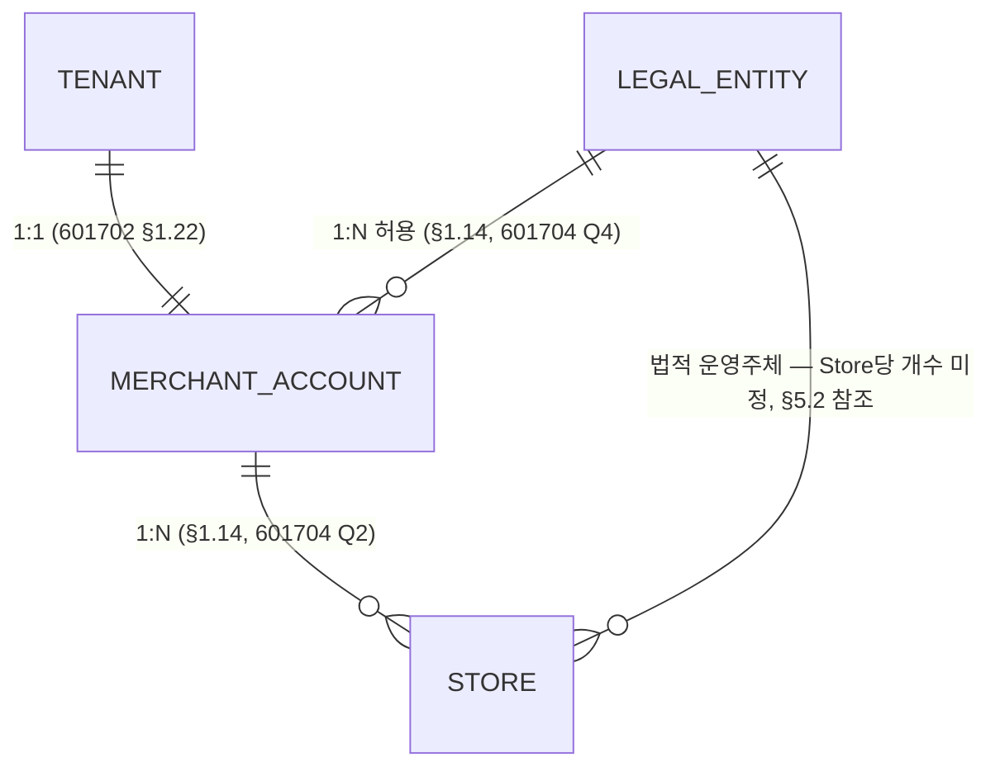

# 601705_Diagram_Operational_Authority_Core_ERD.md

Status: Active
Lifecycle: Diagram
Last Updated: 2026-08-22

**개정 이력**

| 일자 | 내용 |
|---|---|
| 2026-08-13 | 초안 작성 |
| 2026-08-13 | 3단계 대조(`601706`/`601707`) 반영 — Tenant→Store 를 격리 invariant 로 분류, 미정 관계 제거, Merchant Company 정규화 기록, 근거 목록 보완 |
| 2026-08-13 | 3단계 Blocker 전건 반영 완료. Status Draft → Active. 4단계 진입 기준선 |
| 2026-08-22 | External Provider Boundary 를 §7 에 annotation 으로 추가. 엔티티·테이블 미생성. Mermaid 무변경 |

## §0 성격과 범위

`000701` §47.1의 **2단계(ERD 초안)** 산출물이다.
1단계 업무규칙 선언(`601702`)을 관계 모델로 옮긴 것이며 **구현 설계가 아니다.**

> ✅ **3단계 인접 도메인 대조 반영 완료 — 4단계 진입 기준선 (2026-08-13)**
>
> `601706`(Cursor) / `601707`(Codex) 두 독립 검증에서 나온 Blocker 를 전부 반영했다.
>
> | Blocker | 처리 |
> |---|---|
> | 미정 관계를 확정 기호로 표기 | §3 에서 3개 관계 제거, 잔여 1건에 경고 |
> | `Tenant → Store` 구조 중복 | 격리 invariant 로 분류 (`601702` §1.26) |
> | `Merchant Company` 부재 | 분해 대상으로 기록 (§1.25·§1.29) |
> | store 상태 축 미반영 | 3축 dimension 으로 기록 (§1.27·§1.28) |
> | `company` homonym | 두 층위 구분 (§1.29) |
> | `operating_group` 병렬 축 | Candidate 유지, persistence 미결 (§1.30) |
> | 근거 목록 누락 3건 | `007010`/`007040`/`020310` 추가 |
> | 인용 권위 구분 미표시 | ACTIVE / 권위보류 표기 추가 |
>
> **이후 변경은 4단계 설계문서 정합화에서 다룬다.**
> 이 문서를 직접 수정하려면 개정 이력에 사유를 남긴다.

**물리 스키마를 확정하지 않는다.** 테이블명·컬럼·FK·제약·인덱스는 4단계(설계문서 정합화)와
5단계(SQL 구현)에서 정한다. 이 문서의 엔티티명은 **개념명**이며 물리 테이블명이 아니다.

**DocumentType 선택**: `ERD`는 `000001` §5.4 승인 목록에 없다.
승인된 `Diagram`(Group A — 관계·흐름 시각화)을 사용하고, 문서 내부에
Conceptual Diagram(§2)과 Formal ERD(§3)를 함께 수록한다.

### §0.1 세 구역

| 구역 | 의미 | 이 문서에서의 취급 |
|---|---|---|
| **Core** | 0-A가 책임지는 축. 관계가 확정되었거나 축 존재가 확정된 것 | §3 Formal ERD에 그린다 |
| **Candidate** | 의미는 확정됐으나 persistent entity 필요성이 미결인 것 | §6에 점선으로만. **Formal ERD에 그리지 않는다** |
| **External Boundary** | 0-A 범위 밖. 다른 워크패킷 또는 다른 시스템 소관 | §7에 경계 박스로만. 내부를 그리지 않는다 |

### §0.2 `601500`과의 관계

`601500`(1차 0-A)은 **AUTHORITY SUSPENDED** 상태다(`600020` §1.1).

**이 ERD는 `601501`~`601512`의 구조를 참조하지 않았다.**
관계와 cardinality는 `601702`의 1단계 Human 선언과 ACTIVE 상위 문서에서 독립적으로 도출했다.

`601501`이 결과적으로 같은 형태를 일부 포함하더라도, 그것을 근거로 삼지 않았다는 뜻이다
(`600020` §2: 새 설계가 결과적으로 동일해지는 것은 허용하되 기존 구현을 정답으로 놓고 맞추지 않는다).

**채택 우선순위**

```text
1. 1단계 Human Business Rules (`601702`)
2. ACTIVE source design documents
3. SQL physical evidence — 참고만, 채택 기준 아님
```

SQL에 있다는 이유로 개념을 채택하지 않고, SQL에 없다는 이유로 개념을 배제하지 않는다.
현재 SQL과의 차이는 §8에 **참고 자료로만** 기록한다.

## §1 소비한 1단계 선언

이 ERD가 직접 반영한 `601702` 항목이다. 전수 대조는 §9에 있다.

| 선언 | 이 ERD에서의 반영 |
|---|---|
| §1.1 자연인은 `Person`이다 | Core 엔티티명 `PERSON` |
| §1.2 무수식 `Owner` 금지 | 엔티티·관계 어디에도 `Owner` 단독 표기를 쓰지 않음 |
| §1.3 조직역할과 지분소유는 별개 | `OwnershipInterest`를 그리지 않음 (분리만 확정, 모델링은 미정) |
| §1.4 법적 운영주체와 시스템 권한은 다른 축 | `LEGAL_ENTITY`–`STORE` 관계로 표현. RBAC은 §7 경계 밖 |
| §1.5 네 축은 서로 독립 | Representative / PersonRole을 별개 관계로 분리 |
| §1.9 `HQ` 어휘 제한 | 엔티티명에 `HQ`를 쓰지 않음 |
| §1.10 세 세계 분리 | §2 Conceptual Diagram의 3구역 |
| §1.13 LegalEntity는 브랜드를 넘는다 | `LEGAL_ENTITY` → `STORE` 1:N. Brand를 Core 엔티티로 두지 않음 |
| §1.14 MerchantAccount 경계 독립 | `LEGAL_ENTITY` → `MERCHANT_ACCOUNT` 1:N, `MERCHANT_ACCOUNT` → `STORE` 1:N |
| §1.17 Person의 존재론적 경계 | `PERSON`이 `STORE`/`TENANT`와 직접 관계를 갖지 않음 |
| §1.21 `company`/`business_unit`은 내부 조직축 | §6 Candidate로 분리. Core에 넣지 않음 |
| §1.22 Tenant ↔ MerchantAccount 1:1 | Formal ERD 확정 관계 |
| §1.23 MerchantAccount와 LegalEntity 독립 | 한 `MERCHANT_ACCOUNT` 아래 서로 다른 `LEGAL_ENTITY`의 `STORE` 허용 |
| §1.24 Store는 현재 시점 법적 운영주체를 명시 | `LEGAL_ENTITY` → `STORE` 관계로 표현. 개수·이력은 §5 미정 |
| §1.25 `Merchant Company` 용어 정규화 | §4.6, §6, §7.4 |
| §1.26 Store 구조 부모는 MerchantAccount | §3 Mermaid, §5.3 격리 invariant |

## §2 Conceptual Context Diagram

```text
╔══════════════════════════════════════════════════════════════════════════╗
║ [A] Group World — 소유·전략 포트폴리오                        §1.10 §1.11 ║
║     윤슬 그룹 ─ 계열 사업 (윤슬김밥 / 윤슬보울 / CatchMenu SaaS …)        ║
║     ⚠ 계열 관계는 CatchMenu 권한을 자동 생성하지 않는다                   ║
╚══════════════════════════════════════════════════════════════════════════╝
                    ▲ 명시적 링크만 (cross_business_link) · 권한 생성 없음

╔══════════════════════════════════════════════════════════════════════════╗
║ [B] Franchise OS World — 외식사업 운영                         §1.6 §1.10 ║
║     Franchise HQ / FranchiseAgreement / 직영·가맹 / HR·급여·SOP·SCM       ║
║     ⚠ source of truth는 Franchise OS. CatchMenu가 소유하지 않는다         ║
╚══════════════════════════════════════════════════════════════════════════╝
                    ▲ 계약 기반 Scope만 (§1.8) · Merchant 역할 확장 금지 (§1.7)

╔══════════════════════════════════════════════════════════════════════════╗
║ [C] CatchMenu World — 0-A ERD 범위                                        ║
║                                                                           ║
║  ┌─ CORE (확정) ────────────────────────────────────────────────────┐    ║
║  │                                                                   │    ║
║  │   PERSON                                                          │    ║
║  │     ├── Representative ──┐  축 존재 확정 · cardinality 미정       │    ║
║  │     └── PersonRole ──────┤                                        │    ║
║  │                          ▼                                        │    ║
║  │                    LEGAL_ENTITY ──1:N(법적 운영주체)──┐            │    ║
║  │                          │                            │            │    ║
║  │                      1:N │                            ▼            │    ║
║  │                          ▼                                         │    ║
║  │   TENANT ══1:1══ MERCHANT_ACCOUNT ──────1:N──────▶ STORE          │    ║
║  │     ╎                                                ▲            │    ║
║  │     └╌╌╌ 격리 scope 보유·검증 (구조 관계 아님) ╌╌╌╌╌┘            │    ║
║  │                                                                   │    ║
║  └───────────────────────────────────────────────────────────────────┘    ║
║                                                                           ║
║  ┌╌ CANDIDATE (의미 확정 · persistent entity 미결) ╌╌╌╌╌╌╌╌╌╌╌╌╌╌╌┐     ║
║  ╎   Company        BusinessUnit        OperatingGroup             ╎     ║
║  ╎   §1.21 CatchMenu 내부 조직축. 프랜차이즈 본사가 아니다          ╎     ║
║  └╌╌╌╌╌╌╌╌╌╌╌╌╌╌╌╌╌╌╌╌╌╌╌╌╌╌╌╌╌╌╌╌╌╌╌╌╌╌╌╌╌╌╌╌╌╌╌╌╌╌╌╌╌╌╌╌╌╌╌┘     ║
║                                                                           ║
║  ┌╌ 0-B / 0-C 인계 경계 (§1.18) ╌╌╌╌╌╌╌╌╌╌╌╌╌╌╌╌╌╌╌╌╌╌╌╌╌╌╌╌╌╌╌┐     ║
║  ╎   User·Auth Identity   Staff   Session   Role   Permission     ╎     ║
║  ╎   ⚠ JWT subject를 Store의 staff에 종속시키지 않는다 (§1.16)     ╎     ║
║  └╌╌╌╌╌╌╌╌╌╌╌╌╌╌╌╌╌╌╌╌╌╌╌╌╌╌╌╌╌╌╌╌╌╌╌╌╌╌╌╌╌╌╌╌╌╌╌╌╌╌╌╌╌╌╌╌╌╌╌┘     ║
╚══════════════════════════════════════════════════════════════════════════╝
```

**읽는 법**: 실선 박스는 확정된 Core, 점선 박스는 미결이거나 다른 워크패킷 소관이다.
`══` 은 1:1, `──▶` 는 1:N 구조 관계를 뜻한다.
Representative / PersonRole은 축의 존재만 확정됐고 cardinality는 미정이므로
화살표 없이 선으로만 표시했다.

**`TENANT ╌╌▶ STORE` 의 점선은 구조 관계가 아니라 격리 scope 다**(`601702` §1.26).
구조 소유 경로는 `Tenant → MerchantAccount → Store` 하나이며,
Tenant 는 Store 의 두 번째 부모가 아니라 모든 Store 가 보유·검증해야 하는 필수 격리 scope 다.
§5.3 참조.

## §3 Formal ERD

**확정된 관계만 그린다.** Mermaid는 "미정"을 표현하는 문법이 없으므로,
미정 관계를 그리면 확정처럼 읽힌다. 미정은 §5 표에만 기록한다.

**속성 블록을 넣지 않는다.** 속성은 §4 표에 개념 수준으로만 기록한다.
Mermaid 속성 블록은 물리 컬럼처럼 읽히며, 이 단계는 물리 스키마를 확정하지 않는다(§0).



> ⚠️ **`LEGAL_ENTITY ||--o{ STORE` 표기 주의**
>
> `||` 는 Mermaid 에서 exactly-one 을 뜻하나, **Store 당 LegalEntity 개수는 미정이다**
> (`601702` §1.24 — "현재 시점의 법적 운영주체를 명시한다"까지만 확정).
> Mermaid 는 미정을 표현할 문법이 없어 최소 표기를 사용했다.
> **이 표기를 근거로 단일 FK 를 설계하지 않는다.** §5.2를 따른다.

> **Mermaid 는 "미정"을 표현할 수 없다.** 이 제약 때문에 3단계 대조에서
> 미정 관계(Representative / PersonRole)가 확정 기호 `}o--o{` 로 그려져 있다는
> 지적을 받았다(`601707`). 해당 관계는 다이어그램에서 제거하고 §5.2에만 기록한다.

> **Invariant — Tenant scope**
>
> 모든 Store 는 Tenant scope 를 보유하고 검증해야 한다(`010004` §4, `010640` §7·§8).
> 물리 스키마가 `stores.tenant_id` 를 직접 보유하는 것은 격리·RLS·조회 효율을 위한 것이며,
> **개념적 두 번째 소유 계층을 만들지 않는다**(`601702` §1.26).
> 구조 경로는 `Tenant → MerchantAccount → Store` 하나다.

**엔티티 5개 전부 개념명이다.** `PERSON`은 `owners` 테이블이 아니고(§1.1),
`MERCHANT_ACCOUNT`는 현재 SQL에 대응 테이블이 없다(§8).

## §4 Entity 정의

속성은 **개념·경계** 수준이다. 물리 컬럼이 아니다.
SQL physical evidence는 §8로 분리했다.

### §4.1 PERSON

| 속성/경계 | 출처 | 확정 여부 |
|---|---|---|
| 자연인을 식별하는 안정된 주체 | `601702` §1.1 | 확정 |
| Store/Tenant/고용 관계에 종속되지 않는다 | `601702` §1.17 | 확정 |
| 로그인 계정 그 자체가 아니다 | `601702` §1.17 | 확정 |
| `staff` row 그 자체가 아니다 | `601702` §1.16 | 확정 |
| `Person ↔ User` 1:1을 전제하지 않는다 | `601702` §1.17 | 확정 |
| 명칭에 무수식 `Owner`를 쓰지 않는다 | `601702` §1.2 | 확정 |
| 식별 속성(이름·연락처 등)의 구체 목록 | — | **미정** — 4단계 |

### §4.2 TENANT

| 속성/경계 | 출처 | 확정 여부 |
|---|---|---|
| SaaS customer boundary and contract scope | `003020` §2, `009030`, `009070` | 확정 |
| Root boundary for stores and configuration | `003020` §2 | 확정 |
| 단일 store 또는 legal entity와 동치가 아니다 | `003020` §2 | 확정 |
| tenant-owned 객체는 tenant 식별자를 갖는다 | `010004` §4 | 확정 |
| "같은 브랜드 식구들"을 뜻하지 않는다 | `601702` §1.22 | 확정 |
| 상태 축(구독·격리)의 구성 | `000170` §4 vs 실측 불일치 | **미정** — §2.1 과금 미결과 연동 |

### §4.3 LEGAL_ENTITY

| 속성/경계 | 출처 | 확정 여부 |
|---|---|---|
| 계약·세무·정산의 법적 주체 | `000150` §7, `003020` §2 | 확정 |
| company / business_unit과 구별된다 | `000150` §7–§8 | 확정 |
| 금전 최종성 검증의 기준 컨텍스트 | `010640` §9 | 확정 |
| 브랜드를 넘을 수 있다. 브랜드별로 복제하지 않는다 | `601702` §1.13 | 확정 |
| 전역 개념이며 tenant에 직접 종속되지 않는다 | `009030`, `003020` 역전파 층 A | 확정 |
| 동일성 판단 기준 | `601702` §1.13(`legal_entities.id` 인용은 사실 기록) | **미정** — 4단계 |

### §4.4 MERCHANT_ACCOUNT

| 속성/경계 | 출처 | 확정 여부 |
|---|---|---|
| CatchMenu SaaS 계약·관리 단위 | `601702` §1.14 | 확정 |
| 최상위 SaaS 고객 관계 | `000170` §4 | 확정 |
| LegalEntity 경계·Brand 경계·User Identity와 독립 | `601702` §1.14 | 확정 |
| 복수 Store를 포함할 수 있다 (다브랜드 포함) | `000170` §7, `020320` §40 | 확정 |
| 개수를 전역 규칙으로 고정하지 않는다 | `601702` §1.14 | 확정 |
| 권장 필드(`service_status`/`trial_status`/`primary_owner_user_id` 등) | `000170` §4 | **미정** — 어휘 정정 대상(§10) |

### §4.5 STORE

| 속성/경계 | 출처 | 확정 여부 |
|---|---|---|
| handoff runtime이 실행되는 운영 단위 | `003020` §2, `000170` §7 | 확정 |
| tenant에 속한다 | `003020` §2, `009070` | 확정 |
| 법적 운영주체를 LegalEntity 관계로 명시한다 | `601702` §1.4, §1.24 | 확정 |
| runtime context는 MerchantAccount의 customer context와 다르다 | `000170` §7 Core rule | 확정 |
| 직영/가맹 구분을 사람의 role로 표현하지 않는다 | `601702` §1.4 | 확정 |
| LegalEntity 개수·이력 표현 | `003020` §2 *may link* | **미정** — §5 |
| Store Service Status (축) | `000170` §14, `601702` §1.27 | 축 존재 확정 · **값 미확정** |
| Store Operating Status (축) | `000170` §15, `601702` §1.27 | 축 존재 확정 · **값 미확정** |
| Trial Status (축) | `000170` §16, `601702` §1.27 | 축 존재 확정 · **값 미확정** |

> ⚠️ **세 상태축의 취급**
>
> 이는 컬럼 설계가 아니라 **세 개의 독립된 상태 dimension** 을 기록한 것이다.
>
> ```text
> Status domain values : NOT FINALIZED IN 0-A
> Transition rules     : OUT OF SCOPE
> Billing effect       : OUT OF SCOPE (601702 §2.1)
> Authority effect     : OUT OF SCOPE
> ```
>
> 한 축의 값으로 다른 축을 추론하지 않는다(`601702` §1.27).
> 상위 객체 상태로 하위 객체 상태를 대신하지 않는다(§1.28).

### §4.6 `Merchant Company` — 엔티티가 아니다

`000170` §6의 `Merchant Company` 는 **0-A 모델에서 독립적인 canonical entity 로 사용하지 않는다**
(`601702` §1.25). **legacy composite terminology** 로 분류한다.

| 성격 | `000170` §6의 항목 | 정규화 대상 |
|---|---|---|
| **A. 법적 identity** | `legal_name` / `business_registration_ref` / tax invoice reference / contract reference | **`LEGAL_ENTITY`** (§4.3) |
| **B. 관리·접근 grouping** | owner access grouping / `billing_contact` / `contract_contact` / multi-store grouping | **`MERCHANT_ACCOUNT`** (§4.4) 및 후속 Role/Scope 모델 |

**`merchant_company` 를 `legal_entity` 로 단순 rename 하지 않는다.**
개념을 분해하고 각 책임을 해당 축으로 옮긴다(`601702` §1.25).

**3층 구조(Account → MerchantCompany → Store)를 도입하지 않는다.**
`MerchantCompany ↔ LegalEntity` cardinality, 한 운영회사가 여러 법인을 묶을 수 있는지,
`MerchantAccount` 와 별도로 grouping 이 필요한 이유 — 어느 것도 현재 source evidence 가
답하지 못한다. 근거 없는 축을 추가하지 않는다.

`000170` 은 **후속 상위문서 정합화 대상**이다(§7.4).

> 3단계 대조에서 `601706`(Cursor)이 "`Merchant Company` 가 ERD 에 없다"를 충돌로 보고했다.
> 단순 누락이 아니라 어휘 정규화 문제로 판정되었고, 그 판정이 `601702` §1.25다.

## §5 Relationship / Cardinality

### §5.1 확정

| # | 관계 | cardinality | 근거 |
|---|---|---|---|
| R1 | TENANT ↔ MERCHANT_ACCOUNT | **1:1** | `601702` §1.22 (Human Decision). `601704` Q1은 「추정만 가능」이었고 1단계에서 확정 |
| R2 | MERCHANT_ACCOUNT → STORE | **1:N** | `601704` Q2, `000170` §7, `020320` §40, `601702` §1.14 |
| R3 | LEGAL_ENTITY → MERCHANT_ACCOUNT | **1:N 허용** | `601704` Q4, `601702` §1.14. 금지 규정 없음 |
| R5 | LEGAL_ENTITY → STORE | **1:N** | `601702` §1.13 (한 LegalEntity가 여러 브랜드 매장 운영 가능) |
| R6 | PERSON ↔ LEGAL_ENTITY (Representative) | **축 존재만 확정** | `601702` §1.5. cardinality는 §5.2 |
| R7 | PERSON ↔ LEGAL_ENTITY (PersonRole) | **축 존재만 확정** | `601702` §1.5. cardinality는 §5.2 |

### §5.2 미정

| # | 관계 | 상태 | 근거 |
|---|---|---|---|
| U1 | STORE → LEGAL_ENTITY (Store 당 개수) | **미정** | `003020` §2는 *may link*만 서술. `601702` §1.24는 "현재 시점 운영주체가 명시되어야 한다"까지만 확정. `601704` Q3 「부분 확정」 |
| U2 | STORE → LEGAL_ENTITY (시점 이력 표현) | **미정** | `601702` §1.24가 2단계 ERD로 넘김. 본 문서는 결정하지 않음 |
| U3 | PERSON ↔ Representative cardinality | **미정** | `601704` Q7 「추정만 가능」. `601501`의 N:M은 권위보류 |
| U4 | PERSON ↔ PersonRole cardinality | **미정** | 동상 |
| U5 | PERSON ↔ Ownership (지분) | **미모델링** | `601702` §1.3 — 분리만 확정. 모델링 여부는 2단계에서도 미결 |
| U6 | MERCHANT_ACCOUNT 아래 혼재 LegalEntity의 허용 범위 | **개념 확정 / 제약 미정** | `601702` §1.23이 허용을 확정. 제약 조건(정산 분리 강제 방식)은 4단계 |

**U1과 R5는 다른 질문이다.** R5는 "한 LegalEntity가 여러 Store를 운영할 수 있는가"(확정),
U1은 "한 Store가 동시에 몇 개의 LegalEntity를 가질 수 있는가"(미정)다.

### §5.3 격리 invariant — 구조 관계가 아님

| # | 항목 | 성격 | 근거 |
|---|---|---|---|
| I1 | 모든 Store 는 Tenant scope 를 보유하고 검증한다 | **격리 invariant** | `010004` §4, `010640` §7·§8, `601702` §1.26 |

**초안의 R4(`TENANT → STORE` 1:N)를 여기로 옮겼다. 제거가 아니라 분류 변경이다.**

관계 자체는 사라지지 않았다. `003020` §2와 `009070`이 서술한 Tenant–Store 관계는 유효하며,
물리 스키마도 `stores.tenant_id` 를 직접 보유할 수 있다.
바뀐 것은 **분류**다 — 구조 소유 계층이 아니라 **필수 격리 scope** 로 취급한다.

§1.22가 Tenant ↔ MerchantAccount 를 1:1로 확정한 상태에서 `TENANT → STORE` 를
구조 관계로 두면 같은 SaaS 고객 계층이 두 경로로 표현된다(`601702` §1.26).
Conceptual 구조 경로는 `Tenant → MerchantAccount → Store` 하나다.

R5~R7 의 번호는 그대로 두었다. 기존 참조(§3·§9)를 깨뜨리지 않기 위함이며,
R4 번호는 이 절로 이동한 표시로 결번 처리한다.

## §6 Candidate 축

```text
┌╌╌╌╌╌╌╌╌╌╌╌╌╌╌╌╌╌╌╌╌╌╌╌╌╌╌╌╌╌╌╌╌╌╌╌╌╌╌╌╌╌╌╌╌╌╌╌╌╌╌╌╌╌╌╌╌╌┐
╎  Company          BusinessUnit          OperatingGroup      ╎
╎  의미 확정 (§1.21)  의미 확정 (§1.21)     병렬 컨텍스트 축     ╎
╎  persistent entity 필요성 — 전부 미결                        ╎
└╌╌╌╌╌╌╌╌╌╌╌╌╌╌╌╌╌╌╌╌╌╌╌╌╌╌╌╌╌╌╌╌╌╌╌╌╌╌╌╌╌╌╌╌╌╌╌╌╌╌╌╌╌╌╌╌╌┘
```

| 축 | 확정된 의미 | persistent entity |
|---|---|---|
| **Company** | CatchMenu platform operator 경계. **프랜차이즈 본사가 아니다** | **미결** |
| **BusinessUnit** | CatchMenu 내부 운영 책임 단위. 권한이 아니다 | **미결** |
| **OperatingGroup** | 지역·가맹·직영 그룹핑. 법적 정산 주체가 아니다 | **미결** |

**`OperatingGroup` 근거 보강** (`601702` §1.30)

| 축 | 판정 | 근거 |
|---|---|---|
| `OperatingGroup` | Candidate — 독립 conceptual axis, persistence 미결 | `009070` §2·§3·§6 / `003020` §6 / `010640` §10 / `601702` §1.30 |

`OperatingGroup` 은 법적 소유권·세무·정산 identity 를 나타내지 않으며,
그 존재만으로 금전권한이나 시스템 권한을 생성하지 않는다(`010640` §10).
`009070` §3은 `operating_group` 과 `company`/`legal_entity` 를 **병렬 context 축**으로 규정한다.

**물리 엔티티로 그리지 않는 이유** — 살아있는 문서 셋이 모두 미결로 남긴 상태다.

- `000150` §26: *Actual schema may be designed later*
- `003020` §6: Open Decisions
- `009070` §2: *Persistence depth open for MVP*
- `601704` Q6: 「부분 확정 — 내부 조직 context 확정, persistent entity OPEN」

의미가 확정됐다는 것과 테이블이 필요하다는 것은 다른 판단이다.
`601702` §1.21은 의미만 확정했고, 엔티티 필요성은 §2.2에서 2단계 조사 항목으로 남겼다.

**`Merchant Company` 는 Candidate 축이 아니다.** 검토했으나 축으로 추가하지 않았다.
Candidate 3축은 "의미는 확정, 엔티티 필요성 미결" 상태인 반면,
`Merchant Company` 는 **두 책임이 혼재된 legacy composite** 이므로
축으로 두는 것이 아니라 분해해야 한다(§4.6, `601702` §1.25).

> **고객사-side `company` 는 Candidate 축이 아니다.**
>
> `009070` §2 / `003020` 의 `company` 와 `000170` §6 의 `Merchant Company` 는
> **분해 대상 legacy terminology** 다(`601702` §1.25·§1.29).
> Candidate 로 두면 나중에 Core 로 승격될 여지가 남는다.
>
> Candidate 인 `Company` / `BusinessUnit` 은 `000150` §4·§6 의
> **CatchMenu 내부 조직축**을 가리킨다(§1.21). 고객사 축과 구분한다.

## §7 External / Handoff Boundary

경계만 표시하고 **내부 구조를 그리지 않는다.**

### §7.1 Franchise OS 경계

```text
┌────────────────────────────────────────────────────────┐
│ Franchise OS  (source of truth — CatchMenu 소유 아님)   │
│   Franchise HQ / FranchiseAgreement / 직영·가맹 구분    │
│   HR · 급여 · 시프트 · SOP · 교육 · 재고SCM             │
└────────────────────────────────────────────────────────┘
        ▲ cross_business_link (명시적 링크만)
        │ ⚠ 링크는 권한을 만들지 않는다
```

| 항목 | 경계 규칙 | 근거 |
|---|---|---|
| Franchise OS | 별도 사업 경계. CatchMenu가 소유하지 않는다 | `000150` §11, `601702` §1.10 |
| FranchiseAgreement | 당사자는 LegalEntity ↔ LegalEntity. source of truth는 Franchise OS | `601702` §1.6, §1.10 |
| Franchise Store Identity | 같은 물리 매장이 두 시스템에서 다른 정체성을 가질 수 있다 | `000150` §12, `601702` §1.12 |
| 연결 방식 | `cross_business_link` 명시적 링크만 | `000150` §12·§33 |
| 권한 | **링크는 권한을 만들지 않는다** (*Deny implicit authority*) | `000150` §33, `601702` §1.12 |
| 프랜차이즈 본사 접근 | 계약 기반 Scope로만. Merchant 역할 확장 금지 | `601702` §1.7, §1.8 |

### §7.2 0-B / 0-C 인계 경계

```text
PERSON  (0-A Core)
   ╎
   ╎  ⚠ 이 선을 넘는 설계는 0-A가 하지 않는다
   ╎
┌╌╌▼╌╌╌╌╌╌╌╌╌╌╌╌╌╌╌╌╌╌╌╌╌╌╌╌╌╌╌╌╌╌╌╌╌╌╌╌╌╌╌╌╌╌╌╌╌╌┐
╎  User · Auth Identity   Staff Assignment            ╎  0-B
╎  Session                                            ╎
╎  Role   Permission   Scope                          ╎  0-C
└╌╌╌╌╌╌╌╌╌╌╌╌╌╌╌╌╌╌╌╌╌╌╌╌╌╌╌╌╌╌╌╌╌╌╌╌╌╌╌╌╌╌╌╌╌╌╌╌╌┘
```

0-A는 `Person`이라는 기준점과 불변조건까지만 책임진다(`601702` §1.18).

| 인계 조건 | 내용 |
|---|---|
| ① | `Person` – `User`/Auth Identity – Staff Assignment 간 명시적 연결을 정의해야 한다 |
| ② | 하나의 `User`가 복수 Store/Scope를 가질 수 있어야 한다 |
| ③ | **JWT authentication subject를 특정 Store의 `staff.id`에 종속시키지 않는다** |
| ④ | 커스텀 세션이 별도의 인증 세계로 동작하지 않아야 한다 |

**이 제약이 0-B 1단계 업무규칙에 재선언되지 않으면 착수 검증에서 반려한다**(`601702` §1.18).

### §7.3 Group World 경계

| 항목 | 경계 규칙 | 근거 |
|---|---|---|
| 그룹 계열 관계 | 소유·전략 컨텍스트이며 **자동 접근 권한이 아니다** | `000150` §5, `601702` §1.11 |
| 계열사의 CatchMenu 지위 | 독립된 고객으로 취급한다 | `601702` §1.11 |

### §7.4 상위문서 정합화 인계

0-A ERD 가 고치지 않고 **4단계(설계문서 정합화)로 넘기는 어휘 정정 대상**이다.

| 대상 | 문제 | 정규화 방향 |
|---|---|---|
| `000170` §6 `Merchant Company` | legacy composite — 법적 identity와 관리 grouping 혼재 | §4.6에 따라 `LegalEntity` / `MerchantAccount` 로 분해 |
| `010640` §4 `company_id` | *corporate entity if separate from legal entity* 로 서술되어 용어 오염 잔존 | `601702` §1.21·§1.25 기준으로 정정 |
| `000170` §14~§16 store 상태 축 | service / operating / trial 상태 축이 ERD 에 미반영 | §10 O11 |

**이 문서는 위 문서들을 수정하지 않는다.** 정정은 별도 작업이며,
`601702` §2.2가 미결 항목으로 등재하고 있다.

### §7.5 External Provider Boundary — Deferred

> ⚠️ **엔티티·테이블을 그리지 않는다.** 경계의 존재만 표시한다.

```text
┌──────────────────────────────┐
│ CatchMenu Core (0-A)         │
│                              │
│ PERSON                       │
│ TENANT                       │
│ MERCHANT_ACCOUNT             │
│ STORE                        │
│ LEGAL_ENTITY                 │
└──────────────┬───────────────┘
               │
               │  <<Deferred Boundary>>
               │  External Provider Mapping
               │  physical model deferred
               ▼
┌──────────────────────────────┐
│ External Providers           │
│                              │
│ 거래 provider  (주문·결제)    │
│ 실행 provider  (KDS·DID)      │
└──────────────────────────────┘
```

**0-A 가 확정하는 것은 Authority Boundary 다.**

```text
금지   canonical id = 외부 provider 의 식별자

원칙   CatchMenu canonical identity
              │ mapping
              ▼
       External provider identity
```

**물리 구조는 그리지 않는다**(`601710` §3.1).
Toss / Smartcast 의 실제 identifier 축이 확보되지 않았으므로
mapping 테이블 형태를 추정하지 않는다.

provider 는 두 종류이며 성격이 다르다(`601702` §1.43).

| 구분 | 다루는 것 |
|---|---|
| 거래 provider | 주문·결제·정산 |
| 실행 provider | KDS·DID 화면 |

실제 계약·API·identifier 구조 확보 후
**별도 Provider Integration 워크패킷**에서 설계한다.

## §8 Physical Drift — 현재 SQL과 목표 모델의 차이

> ⚠️ **참고 자료이며 설계 근거가 아니다.**
> 이 표는 5단계 구현 시 무엇이 달라지는지 가늠하기 위한 것이며,
> 여기 적힌 현재 상태가 목표 모델을 정당화하지 않는다.
> `601501`의 구조를 참조하지 않았다(`600020` §2, §0.2).

| 개념 | 현재 SQL 상태 | 표기 |
|---|---|---|
| `MERCHANT_ACCOUNT` | 대응 테이블 없음 | **CONCEPT PRESENT / PHYSICAL IMPLEMENTATION MISSING** |
| `PERSON` | 자연인 개념의 테이블이 존재하나 명칭이 개념과 어긋남(§1.1) | 명칭 정정 대상 |
| `TENANT` | 존재 | 개념 일치 |
| `STORE` | 존재 | 개념 일치 |
| `LEGAL_ENTITY` | 존재 | 개념 일치 |
| Company / BusinessUnit | 대응 테이블 없음 | **CONCEPT PRESENT / PHYSICAL IMPLEMENTATION MISSING** (§6에서 엔티티 필요성 자체가 미결) |
| Representative / PersonRole | 관계 테이블 존재 | cardinality는 §5.2 미정 |
| Ownership | 역할 테이블에 지분 컬럼이 얹혀 있음 | `601702` §1.3이 분리를 확정. 목표 모델에는 없음 |

**`merchant_accounts` 미구현을 개념 배제 근거로 쓰지 않는다.**
`000170` §4가 정의하고 `601702` §1.14·§1.22·§1.23이 확정한 개념이며,
물리 구현이 없다는 것은 구현 과제이지 개념 부재가 아니다.

## §9 1단계 선언 대응표

`601702` §1.1~§1.24 전수 대조다. **반영되지 않은 선언은 사유를 적는다.**

| 선언 | 반영 위치 | 반영 여부 |
|---|---|---|
| §1.1 자연인은 `Person` | §3 `PERSON`, §4.1 | 반영 |
| §1.2 무수식 `Owner` 금지 | §3·§4 전체 명명 | 반영 |
| §1.3 조직역할 ≠ 지분소유 | §5.2 U5, §8 | **배제로 반영** — `OwnershipInterest`를 그리지 않음 |
| §1.4 법적 운영주체 vs 시스템 권한 | §3 R5, §4.5, §7.2 | 반영 |
| §1.5 네 축 독립 | §3 R6·R7, §5.1 | 반영 |
| §1.6 가맹계약 독립 | §7.1 | **경계로만 반영** — 내부 구조는 Franchise OS 소관 |
| §1.7 고객사 내부 vs 횡단 권한 분리 | §7.1 | **경계로만 반영** — RBAC은 0-C 소관 |
| §1.8 Franchise HQ 계약 기반 Scope | §7.1 | **경계로만 반영** — scope 구현은 0-C |
| §1.9 `HQ` 어휘 제한 | §3·§4 명명, §7.1 | 반영 |
| §1.10 세 세계 분리 | §2, §7.1, §7.3 | 반영 |
| §1.11 그룹 계열 ≠ SaaS 권한 | §7.3 | **경계로만 반영** |
| §1.12 같은 실체 다른 정체성 | §7.1 | **경계로만 반영** — `cross_business_link` 구조는 미구현(§10) |
| §1.13 LegalEntity는 브랜드를 넘는다 | §3 R5, §4.3 | 반영 |
| §1.14 MerchantAccount 경계 독립 | §3 R2·R3, §4.4 | 반영 |
| §1.15 JWT 해석 / DB 권한 확인 | §7.2 | **미반영** — 런타임 권한 흐름이며 ERD 대상이 아니다. 0-B/0-C 소관 |
| §1.16 Person · User · Staff 구분 | §4.1, §7.2 | **부분 반영** — `PERSON`만 Core. User/Staff는 경계 밖 |
| §1.17 Person의 존재론적 경계 | §3(직접 관계 없음), §4.1 | 반영 |
| §1.18 0-B 인계 조건 | §7.2 | **미반영** — 0-B 설계 제약이다. 인계 조건 표시로만 |
| §1.18.1 근거 실측 상태 | §8 | **미반영** — 사실 기록이며 관계 모델이 아니다 |
| §1.19 Role·Permission·Scope 삼각 | §7.2 | **미반영** — 0-C 소관 |
| §1.20 Scope taxonomy 보류 | §10 | **미반영** — 미결 사항이므로 그리지 않는다 |
| §1.21 `company`/`business_unit` 내부 조직축 | §6 | **Candidate로만 반영** — persistent entity 미결 |
| §1.22 Tenant ↔ MerchantAccount 1:1 | §3 R1, §5.1 | 반영 |
| §1.23 MerchantAccount와 LegalEntity 독립 | §3 R3·R5, §5.2 U6 | 반영 |
| §1.24 Store는 현재 법적 운영주체 명시 | §3 R5, §5.2 U1·U2 | **부분 반영** — 관계는 그렸고 개수·이력은 미정 |

| §1.25 `Merchant Company` 용어 정규화 | §4.6, §6, §7.4 | 반영 — 엔티티로 두지 않고 분해 기록 |
| §1.26 Store 구조 부모는 MerchantAccount | §3, §5.3 | 반영 — R4를 격리 invariant 로 분류 변경 |

**집계**: 반영 14건 / 부분·경계 반영 7건 / 미반영 5건.
미반영 5건은 전부 **0-B·0-C 소관이거나 미결 사항**이며, 누락이 아니다.

## §10 Open Decisions

이 ERD가 결정하지 않은 것이다. `601702` §2.2와 중복되어도 무방하다.

| # | 항목 | 넘기는 곳 |
|---|---|---|
| O1 | Store 당 LegalEntity 개수와 시점 이력 표현 | 4단계 |
| O2 | Person ↔ Representative / PersonRole cardinality | 4단계 |
| O3 | 지분소유 모델링 여부 | 미결 (`601702` §1.3) |
| O4 | Company / BusinessUnit / OperatingGroup persistent entity 필요성 | 3단계 인접 도메인 대조 |
| O5 | `merchant_accounts` 물리 구현 방식 | 4·5단계 |
| O6 | `cross_business_link` 구조 | 미구현 (`000150` §26 개념 엔티티) |
| O7 | Scope Type / Scope Level 통합 taxonomy | 0-C (`601702` §1.20) |
| O8 | `franchise_hq_id` 어휘 정정과 `000150` ↔ `010640` 충돌 판정 | 별도 워크패킷 (`601702` §2.4) |
| O9 | `primary_owner_user_id` 등 `000170` 권장 필드의 새 어휘 | 4단계 |
| O10 | 엔티티별 식별 속성 목록 | 4단계 |
| O11 | `000170` §14~§16 store 상태 축(service / operating / trial) 미반영 | 4단계 (`601706` 지적) |
| O12 | `company` homonym — `000150` 플랫폼 운영사 vs `003020`/`007010`/`009070` tenant 내 축 | 별도 워크패킷 (`601706` 지적) |
| O13 | `003020`/`009070` 의 company / operating_group 병렬 축이 ERD 에 없음 | §6 Candidate 판정과 연동. 4단계 |
| O14 | Store 상태 3축의 canonical enum · 전이 규칙 | 후속 (`601702` §1.27, §2.2) |
| O15 | `OperatingGroup` persistence | 후속 (`601702` §1.30 — ACTIVE 문서 넷이 미결) |
| O16 | `Brand` 축의 canonical 정의 | 후속 (`601702` §1.29) |
| O17 | External Provider Mapping 물리 구조 | 별도 Provider Integration 워크패킷 (`601702` §1.43, `601710` §3.1 — Deferred) |

## §11 근거 문서 목록 (`000701` §46)

**권위 표기**: `000150`/`000170`/`003020`/`009030`은 ACTIVE 본문과
2026-08-11 `AUTHORITY SUSPENDED` 역전파 블록이 **같은 파일에 혼재**한다(`600020` §5).
아래는 인용한 절과 그 절의 권위 상태를 함께 표기한다. **역전파 블록은 인용하지 않았다.**

| 문서 | 인용 | 권위 | 역할 |
|---|---|---|---|
| `601702_Register_Stage1_Business_Rules.md` | §1.1~§1.26, §2.2 | ACTIVE | **최우선 근거** — 1단계 Human 업무규칙 선언 |
| `601704_Register_Stage2_ERD_Relationship_Survey.md` | Q1~Q8, Core 5축 속성, 종합표 | ACTIVE | 관계·cardinality 조사 |
| `601701_Register_Stage0_Evidence_Collection.md` | §4.1~§4.5 A-4/B-1/C-1 | ACTIVE | §48 증거수집 |
| `601706_Audit_Stage3_Adjacent_Domain_Cursor.md` | V1~V5, Blocker | ACTIVE | 3단계 대조 — 외부 어휘·누락 |
| `601707_Audit_Stage3_Adjacent_Domain_Codex.md` | V1~V5, Blocker | ACTIVE | 3단계 대조 — ERD 내부 정합성 |
| `000150_Policy_CatchMenu_Company_Business_Unit_And_Legal_Entity.md` | §5, §7, §8, §11, §12, §26, §33 | **ACTIVE 본문** (역전파 블록 ⛔ 미인용) | LegalEntity·조직축 경계, Franchise OS 분리 |
| `000170_Policy_Merchant_Account_Company_And_Store_Context.md` | §4, §6, §7 | **ACTIVE 본문** (역전파 블록 ⛔ 미인용) | MerchantAccount·Store 정의, Merchant Company |
| `003020_Guide_Tenant_Company_Legal_Operating_Group_Context_Model.md` | §2, §6 | **ACTIVE 본문** (역전파 블록 ⛔ 미인용) | Tenant·Store 축, Open Decisions |
| `009030_Register_Conceptual_Entity_Master.md` | §2 | **ACTIVE 본문** (역전파 블록 ⛔ 미인용) | 개념 엔터티 정의 |
| `009070_Matrix_Context_Entity_Alignment_Model.md` | §2 | ACTIVE | 축 정렬, persistence depth |
| `010004_Policy_SaaS_Tenant_Isolation_And_Cross_Tenant_Data_Containment_Beam.md` | §4 | ACTIVE (§4.1 판별 기준) | tenant 소유 객체 식별자 규칙 |
| `010640_Policy_Tenant_Scope_Envelope.md` | §4, §7, §8, §9, §11 | ACTIVE | LegalEntity 금전 최종성, 격리 scope, 계약 기반 scope |
| `007010_Policy_Admin_Console_Context_And_Role_Model.md` | §2 | ACTIVE | Admin Console context axes (company homonym 근거) |
| `007040_Policy_Admin_Screen_Inventory_And_Navigation_Model.md` | §3 | ACTIVE | company ≠ legal_entity 금지 규칙 |
| `020310_Policy_User_Account_And_Login.md` | §12, §29 | ACTIVE | 계정유형, shared authentication ≠ shared authorization |
| `020320_Policy_Role_Permission_And_Scope.md` | §40 | ACTIVE | merchant account scope의 복수 store 포함 |
| `600020_Governance_Implementation_Lifecycle_Authority_Reset.md` | §1.1, §2, §5 | ACTIVE | `601500` 사용 제약, 역전파 블록 권위 |
| `000701_Guide_Controlled_AI_Development_Pipeline.md` | §35, §37, §46, §47.1 | ACTIVE | 2단계 규격, 원작자 배제, 검증자 다중화 |

**권위보류 문서 인용**: `601501`/`601503`을 §8의 현재 상태 서술 맥락에서 간접 참조했으나,
**구조를 근거로 삼지 않았다.** `600020` §2·§3에 따라 사실 기록 목적이며
그 설계 결론을 승인한 것이 아니다(§0.2).
