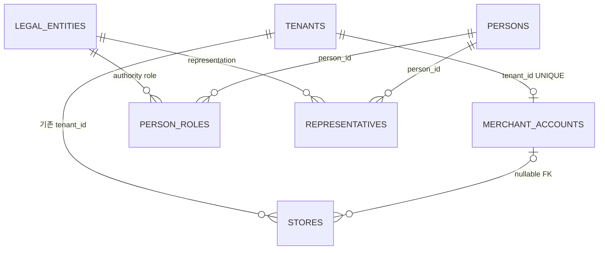
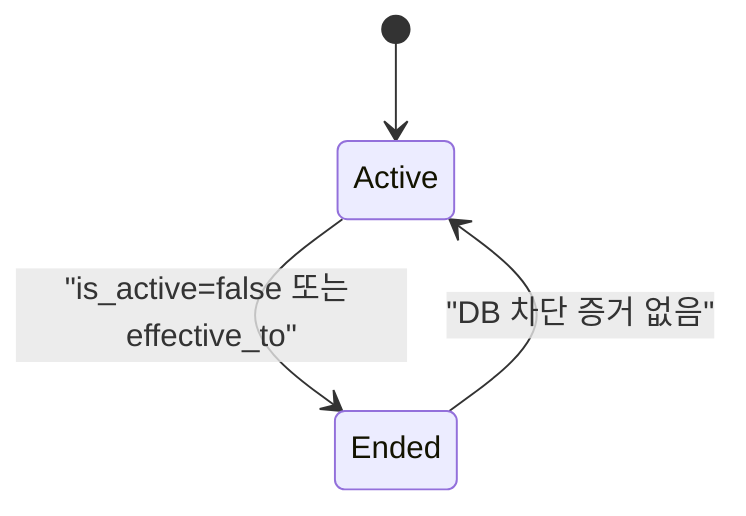

# 601745_Evidence_Stage11B_Blind_Audit_ChatGPT.md

Status: Active
Lifecycle: Evidence
Last Updated: 2026-08-24

## Change ID

Workpacket: 601700

## §1 Stage 11B Method

`000701` §13.8 이 요구하는 진짜 블라인드 조건으로 수행했다.

```text
사전 논의가 전혀 없는 새 대화창
Phase 1 에서 설계문서 · 계약 · TestPlan · 기존 감사결과 미제공
actual SQL + raw evidence 만 제공
blind reconstruction 완료 후 freeze
Phase 2 에서 601710 / 601713 / 601716 / 601717 / 601744 공개
기존 reconstruction 을 소급 수정하지 않고 비교
```

> ⚠️ **`000701` §13.7 Dual Anchor Principle** —
> 같은 AI 계열이 설계하고 같은 계열이 최종 감사하면 anchoring 이 발생한다.
> Stage 11A 단독으로는 Stage 12 병합 결정의 충분한 근거가 아니다.

## §2 Inputs — Phase 1

**제공**

```text
sql/migrations/0170_person_vocabulary_normalization.sql
sql/migrations/0171_merchant_account_foundation.sql
docs/implementation_evidence/601700/raw_logs/07_db_baseline.log
docs/implementation_evidence/601700/raw_logs/08_schema_positive.log
docs/implementation_evidence/601700/raw_logs/09_negative_checks.log
docs/implementation_evidence/601700/raw_logs/10_backfill_checks.log
docs/implementation_evidence/601700/raw_logs/11_regression.log
docs/implementation_evidence/601700/raw_logs/12_migration_history.log
docs/implementation_evidence/601700/raw_logs/13_rls_security.log
docs/implementation_evidence/601700/raw_logs/14_replay.log
docs/implementation_evidence/601700/raw_logs/15_rollback.log
```

**미제공 — 앵커링 방지**

```text
601710 / 601713 / 601716 / 601717
601739 / 601740 / 601741 / 601742 / 601743 / 601744
05_governance_check.log / 06_governance_strict.log
```

> ⚠️ **`05` · `06` 을 뺀 것은 문서 규칙과 naming 체계를 노출해
> 앵커링을 만들 수 있기 때문이다.**
>
> ⚠️ **`601740` · `601744` 를 Phase 1 에서 뺀 것이 특히 중요하다.**
> 둘 다 문제의 위치와 해석을 알려주는 강한 앵커다.

## §3 Phase 1 Blind Reconstruction — VERBATIM

**아래는 ChatGPT 답변 원문이다. 편집하지 않았다.**

````text
요약하면, 이 변경은 **기존 tenant–store 구조 위에 계약 계정(`merchant_accounts`)과 법적 권한·자연인 축을 덧붙이는 기반 마이그레이션**입니다.

하지만 실제 DB가 강제하는 구조는 문구상 “완전한 1:1”보다 약합니다. 또한 신규 점포 생성 경로가 새 관계를 채우지 않고, RLS는 tenant 격리 정책이 아니라 사실상 봉쇄 상태이며, clean replay와 정식 rollback은 검증되지 않았습니다.

## 1. 실제 SQL에서 확인되는 구조



### 발견한 사실

* `owners`가 `persons`로 이름이 바뀌었습니다.
* 관련 FK 컬럼·제약·인덱스·트리거도 `owner_*`에서 `person_*`으로 바뀌었습니다.
* `persons.is_active`가 삭제됐습니다.
* `legal_entity_person_roles.ownership_percent`와 CHECK가 삭제됐습니다.
* `merchant_accounts`가 새로 만들어졌습니다.
* `merchant_accounts.tenant_id`는 `NOT NULL + UNIQUE + FK`입니다.
* `stores.merchant_account_id`는 nullable FK입니다.
* 기존 tenant 1건에 merchant account 1건이 만들어졌고 기존 store 1건도 연결됐습니다.
* `stores.legal_entity_id`도 여전히 nullable이고, 현재 legal entity 데이터는 0건입니다.

근거: [0170 SQL](sandbox:/workspace/scratch/78192d4b5bb7/upload/0170_person_vocabulary_normalization.sql), [0171 SQL](sandbox:/workspace/scratch/78192d4b5bb7/upload/0171_merchant_account_foundation.sql), [스키마 실측](sandbox:/workspace/scratch/78192d4b5bb7/upload/08_schema_positive.log), [backfill 실측](sandbox:/workspace/scratch/78192d4b5bb7/upload/10_backfill_checks.log)

---

## 2. 데이터 경계 역설계

실측 구조상 최소 3개 축이 존재합니다.

| 축                     | 관찰되는 역할              | 실제 경계 강제 수준                                              |
| --------------------- | -------------------- | -------------------------------------------------------- |
| Tenant                | SaaS 고객·운영 격리 단위로 보임 | `stores.tenant_id` 등 기존 구조는 있으나 이번 자료만으로 전체 격리 규칙은 확인 불가 |
| Merchant account      | tenant별 계약·관리 계정     | tenant당 최대 1개만 강제                                        |
| Legal entity / Person | 법인·자연인·대표자·역할 관계     | tenant 귀속 방식은 제공 자료만으로 확정 불가                             |
| Store                 | 실제 운영점               | tenant와 merchant account를 각각 참조하지만 상호 일치 검증 없음           |

### 중요한 결론

SQL 주석은 다음과 같이 말합니다.

> One-to-one with tenant.

그러나 제약이 실제로 보장하는 것은:

[
\text{MerchantAccount} \rightarrow \text{Tenant}=1
]

[
\text{Tenant} \rightarrow \text{MerchantAccount}=0..1
]

즉 **tenant당 최대 1개**이지, 모든 tenant에 반드시 하나가 존재하는 완전한 1:1은 아닙니다.

현재 1 tenant = 1 merchant account인 것은 backfill 직후의 데이터 상태일 뿐, 영구 불변조건이 아닙니다.

---

## 3. 상태머신으로 보이는 것

### Tenant 상태

현재 실측값은 다음과 같습니다.

* `tenant_status = TRIAL`
* `isolation_state = NONE`
* `chk_tenants_status`
* `chk_tenants_isolation_state`

이것은 상태 값의 허용 집합이 있다는 증거지만, **상태 전이 규칙이 구현됐다는 증거는 아닙니다.**

예를 들어 다음은 자료에서 확인되지 않습니다.

* TRIAL → ACTIVE만 가능한지
* CANCELLED → ACTIVE 복귀가 금지되는지
* ISOLATED 상태에서 점포 접근이 차단되는지
* tenant 상태가 merchant account나 store 상태로 전파되는지

따라서 이것은 현재로서는 “상태머신”보다 **CHECK로 제한된 상태 컬럼**에 가깝습니다.

### 법적 권한 상태

관찰되는 요소:

* 역할 종류: `OWNER`, `REPRESENTATIVE`, `DIRECTOR`, `EXECUTIVE`, `INVESTOR`
* `effective_from`, `effective_to`
* `is_active`
* 동일 법인·인물·역할의 active 중복 방지
* 동일 법인에서 active `SOLE` 대표자 1명 제한
* 유효기간 역전 방지 CHECK

이는 다음과 같은 모델로 추론됩니다.



즉 “현재 활성 권한의 중복”은 일부 제어하지만 다음은 확인되지 않습니다.

* 현재 시각과 `effective_from/to`의 자동 정합성
* `is_active=true`인데 종료일이 과거인 행 금지
* 비활성 권한 재활성화 금지
* 역할 변경 이력의 불변 보존
* 대표자 테이블과 역할 테이블 간 의미 일치

### Merchant account 상태

상태 컬럼이 전혀 없습니다.

따라서 계약·관리 계정이라고 주석을 달았지만 다음을 표현할 수 없습니다.

* 준비 중
* 활성
* 정지
* 해지
* 종료
* tenant와 동기화된 lifecycle

현 단계에서는 “계약 상태 객체”라기보다 **tenant별 이름을 가진 구조적 중간 노드**입니다.

---

## 4. 구현된 불변조건

확실히 구현된 것:

1. merchant account는 반드시 존재하는 tenant를 가리켜야 합니다.
2. 하나의 tenant에 merchant account를 두 개 만들 수 없습니다.
3. merchant account 이름은 NULL일 수 없습니다.
4. store의 merchant account 값이 있다면 존재하는 account여야 합니다.
5. merchant account와 tenant 삭제·PK 변경은 연결 행이 있으면 자동 전파되지 않습니다.
6. 활성 법인 역할의 일부 중복이 제한됩니다.
7. 활성 단독 대표자는 법인당 최대 1명입니다.
8. 역할·대표 기간의 종료일은 시작일보다 빠를 수 없습니다.
9. `updated_at`은 UPDATE 트리거로 갱신됩니다.

반대로 구현되지 않은 핵심 불변조건:

1. 모든 tenant에 merchant account가 하나 있어야 한다.
2. 모든 store에 merchant account가 있어야 한다.
3. store와 merchant account가 같은 tenant 소속이어야 한다.
4. tenant 생성과 merchant account 생성이 하나의 원자적 작업이어야 한다.
5. store 생성 시 merchant account가 자동 연결돼야 한다.
6. tenant 상태와 merchant account·store 상태가 일치해야 한다.
7. person 또는 legal entity가 어느 tenant 경계에 속하는지 강제돼야 한다.

---

## 5. 핵심 위험과 모순

### Critical — 교차 tenant 연결이 허용됩니다

현재 FK는 이것만 확인합니다.

```sql
stores.merchant_account_id
    -> merchant_accounts.id
```

다음 일치 조건은 없습니다.

```text
stores.tenant_id = merchant_accounts.tenant_id
```

따라서 tenant A의 store가 tenant B의 merchant account를 참조해도 FK는 통과합니다.

이는 단순한 NULL 문제가 아니라 **multi-tenant 데이터 경계 침범을 구조적으로 허용하는 결함**입니다.

가능한 보강 방식은 `(merchant_account_id, tenant_id)` 복합 FK 또는 동등한 강제 장치입니다.

### Critical — 신규 store 생성 경로가 새 관계를 채우지 않습니다

점포 INSERT 함수는 2개입니다.

* `catchmenu_common.provision_tenant`
* `catchmenu_hq.create_franchise_store`

실측상 두 함수 모두 `merchant_account_id`를 INSERT하지 않습니다. 기존 1개 store가 연결된 것은 일회성 M-2 backfill 결과입니다.

따라서 향후 생성점은:

```text
stores.merchant_account_id = NULL
```

이 될 수 있습니다. 컬럼도 nullable이고 이를 차단하는 CHECK·트리거도 없습니다.

즉 현재 성공한 backfill 결과와 미래 쓰기 경로가 서로 양립하지 않습니다.

### High — “1:1” 주석과 제약이 일치하지 않습니다

`UNIQUE(tenant_id)`는 tenant당 merchant account가 “최대 하나”라는 뜻입니다. tenant가 account 없이 존재하는 것은 허용됩니다.

따라서 주석의 “1:1 relationship”은 과장된 설명입니다. 실제 구조는 tenant 기준 `0..1`입니다.

### High — RLS가 격리 정책이 아니라 deny-all 봉쇄입니다

다섯 테이블 모두:

* RLS ENABLE
* RLS FORCE
* 정책 0개

입니다.

`persons`에는 `catchmenu_authority_owner`가 CRUD 권한을 갖지만 이 역할은 `BYPASSRLS=true`입니다. 반면 `merchant_accounts`는 postgres 외에는 grant가 없습니다.

결과적으로:

| 객체               |  일반 정책 접근 |      authority role | postgres |
| ---------------- | --------: | ------------------: | -------: |
| Person 계열        | 정책 0개로 차단 | BYPASSRLS + 일부 CRUD |       가능 |
| Merchant account | 정책 0개로 차단 |    테이블 grant가 없어 불가 |       가능 |

이는 tenant별 접근정책이 아니라 다음과 같은 비대칭입니다.

* Person 계열: 특권 역할이 RLS 전체를 우회
* Merchant account: postgres 전용에 가까움
* 일반 client 역할: 접근 불가

`BYPASSRLS` 역할이 non-login인 것은 직접 로그인 위험을 낮추지만, 다른 로그인 역할이 이를 상속하거나 `SET ROLE`할 수 있는지는 제공 자료에 없습니다.

근거: [RLS·GRANT 실측](sandbox:/workspace/scratch/78192d4b5bb7/upload/13_rls_security.log)

### High — clean replay 성공이 입증되지 않았습니다

엄격한 전체 replay는 0093에서 중단됐고, 0170·0171까지 도달하지 못했습니다.

이후 두 마이그레이션이 성공했다는 결과는 “앞선 실패 19개를 무시하고 계속 실행한 보충 실험”입니다. 따라서 다음 둘은 구분해야 합니다.

* 0170/0171 DDL이 특정 불완전 DB에서 실행됨: 확인
* 처음부터 전체 migration chain이 성공함: 미확인

엄격한 의미에서 clean install/replay는 실패 상태입니다.

근거: [replay 로그](sandbox:/workspace/scratch/78192d4b5bb7/upload/14_replay.log)

### High — 마이그레이션 자체도 재실행 안전하지 않습니다

0171의 M-1은 매번 전체 tenant를 INSERT합니다.

```sql
INSERT INTO merchant_accounts (...)
SELECT ... FROM tenants;
```

`ON CONFLICT`가 없으므로 같은 DB에서 재실행하면 unique violation이 납니다. CREATE TABLE과 ALTER도 존재 여부 방어가 없습니다.

0170 역시 이미 rename/drop된 상태에서 재실행하면 실패합니다.

따라서 여기서 말하는 replay는 “깨끗한 DB에서 migration chain 재생”이어야 하며, **동일 migration 재적용 idempotency는 없습니다.**

### High — rollback은 복구가 아니라 데이터 폐기입니다

저장소에 실제 reverse migration 파일이 없습니다. 로그의 rollback SQL은 검증자가 별도로 조립한 임시 스크립트입니다.

더 큰 문제는 되돌릴 때 다음 데이터를 복원할 수 없다는 점입니다.

* 삭제된 `ownership_percent`
* 삭제된 `persons.is_active`
* merchant account 행 전체
* merchant account 생성 후 수정됐을 수 있는 이름·메타데이터
* store와 merchant account의 연결 이력

`is_active`는 재생성하면서 전부 `true` 기본값을 주기 때문에 기존 비활성 사람이 있었다면 원상복구되지 않습니다. 현재 persons가 0건이라 이번 샘플에서는 드러나지 않았을 뿐입니다.

또한 임시 rollback은 migration history의 0170/0171 성공 행을 삭제하거나 무효화하지 않았습니다. 따라서 스키마는 과거로 돌아가도 history에는 적용된 것으로 남을 수 있습니다.

근거: [rollback 로그](sandbox:/workspace/scratch/78192d4b5bb7/upload/15_rollback.log)

### Medium — 함수 실측값이 환경 간 다릅니다

`create_franchise_store`의 함수 본문 MD5가 서로 다릅니다.

* canonical regression: `87511a...`
* disposable rollback: `92a341...`

반면 `provision_tenant`는 양쪽이 같습니다.

가능한 해석:

* canonical DB와 replay DB의 migration 결과가 다름
* 실패 허용 replay 때문에 함수 버전이 달라짐
* 로그 수집 시점 또는 선행 migration 차이

어느 쪽이든 disposable rollback 결과를 canonical DB의 완전한 대리 검증으로 볼 수 없습니다.

### Medium — 자연인 모델이 lifecycle 정보를 잃었습니다

`persons.is_active` 삭제로 자연인 자체의 비활성·폐기 상태를 표현할 수 없습니다. 관계 행의 `is_active`는 “그 법인과의 관계” 상태이지 사람 레코드 자체의 상태가 아닙니다.

또한 `ownership_percent` 삭제로 `OWNER`나 `INVESTOR` 역할은 표현해도 지분율은 표현할 수 없습니다.

이것이 의도된 정규화인지 정보 손실인지는 자료만으로 결정할 수 없습니다. 다만 실제 SQL 기준으로는 **표현력이 제거된 것**이 확실합니다.

---

## 6. 증거가 약한 부분

현재 데이터셋은 다음 규모입니다.

* tenant: 1
* store: 1
* merchant account: 1
* person: 0
* legal entity: 0
* person role: 0
* representative: 0

따라서 다음 동작은 사실상 검증되지 않았습니다.

* 다중 tenant 간 교차 연결
* tenant 추가 생성 후 account 자동 생성
* store 추가 생성 후 account 연결
* 실제 사람·대표·역할 데이터의 rename 보존
* 비활성 person rollback
* ownership percentage rollback
* RLS 정책별 tenant 격리
* authority role의 실제 role inheritance 경로

특히 “현재 NULL이 0건”이라는 결과는 불변조건의 증거가 아닙니다. 샘플 1건이 backfill됐다는 증거일 뿐입니다.

---

## 7. 최종 판정

**현재 상태: 기반 DDL은 적용됐지만 운영 가능한 데이터 경계 계약은 미완성입니다.**

우선순위는 다음과 같습니다.

1. `store.tenant_id`와 `merchant_account.tenant_id`의 동일성 강제
2. tenant 생성 시 merchant account 동시 생성 보장
3. 모든 store 생성 경로에서 merchant account 연결
4. 완전한 1:1을 원한다면 tenant 측 존재성 보장 방법 결정
5. RLS 정책 또는 특권 RPC 접근모델 명시
6. strict clean replay를 0171까지 완주
7. repository에 정식 reverse migration 또는 forward-recovery 절차 추가
8. migration history까지 포함한 rollback 의미 정의
9. 다중 tenant·신규 store·교차 tenant·비활성 person 데이터로 재검증

생성된 이미지는 위 구조와 네 가지 핵심 위험—경계 미강제, RLS 비대칭, replay 차단, rollback 손실—을 표현한 개념도입니다. 정확한 스키마 명세는 이미지보다 위의 SQL 기반 판정을 기준으로 봐야 합니다.
````

## §4 Freeze — VERBATIM

**아래는 Human 지시와 ChatGPT 확인 응답 원문이다. 편집하지 않았다.**

**Human 지시**

````text
방금 역설계한 결과를 변경하지 말고 고정해주세요.

다음 단계에서 원 설계문서를 보여드릴 예정입니다.
그 문서를 본 뒤 현재 판단을 소급 수정하지 말고,

- 기존 독립 판단
- 설계문서가 주장하는 것
- 양자의 일치/불일치

를 별도로 비교해주세요.
````

**ChatGPT 확인 응답**

````text
네. 방금 결과를 독립 역설계 기준선(Baseline)으로 고정하겠습니다.
다음 설계문서를 받은 뒤에도 기존 판단을 소급 수정하지 않고, 다음 세 구역으로 분리하겠습니다.

1. 기존 독립 판단 — 방금 SQL·실측 로그만으로 도출한 결론 원문 유지
2. 설계문서의 주장 — 문서가 의도·불변조건·권한·경계를 무엇이라고 정의하는지 별도 추출
3. 일치/불일치 비교 — 일치, 부분 일치, 불일치, 문서만 존재, 구현만 존재, 판단 불가로 구분

설계문서는 기존 결과를 해석하거나 선의로 보정하는 자료가 아니라, 독립된 두 번째 증거 집합으로 취급하겠습니다. 특히 문서에 적힌 의도가 SQL에 구현되지 않았다면 기존 판단을 고치는 대신 "문서–구현 불일치"로 기록하겠습니다.
````

## §5 Inputs — Phase 2

```text
601710_Overview_Operational_Authority_Foundation_V2.md
601713_Logic_Operational_Authority_Foundation_V2.md
601716_TestPlan_Operational_Authority_Foundation_V2.md
601717_ChangeContract_Operational_Authority_Foundation_V2.md
601744_AuditReview_Operational_Authority_Foundation_V2.md
```

> ⚠️ **Stage 11A 의 `APPROVE_WITH_NOTES` 판정을 사전에 알리지 않았다.**
> `601744` 를 Phase 2 에서 제공하며 처음 알게 했다.
> 「Claude 는 승인했다」는 한 줄조차 blind audit 의 방향을 바꾼다.

## §6 Phase 2 Comparative Audit — VERBATIM

**아래는 ChatGPT 답변 원문이다. 편집하지 않았다.**

````text
앞서 고정한 blind reconstruction은 수정하지 않았습니다. 결론부터 말하면:

* 두 migration은 ChangeContract의 좁은 DDL/DML 명세에는 거의 정확히 일치합니다.
* 그러나 설계가 주장하는 tenant 격리와 `Tenant → MerchantAccount → Store` 구조를 실제 DB가 보장하지 못합니다.
* 특히 **store가 다른 tenant의 merchant account를 참조할 수 있는 문제는 문서·TestPlan·Stage 11A 모두 놓쳤습니다.**
* Stage 11A의 `APPROVE_WITH_NOTES`는 “계약 문면 준수” 판정으로는 이해할 수 있지만, “설계 불변조건 구현 완료” 판정으로는 과도하게 낙관적입니다.

## 기준선 보존

다음 blind reconstruction 결론은 그대로 유지합니다.

* tenant–merchant account는 엄밀한 1:1이 아니라 tenant 기준 `0..1`
* store–merchant account는 nullable
* store와 merchant account의 tenant 일치가 강제되지 않음
* 기존 데이터 backfill은 성공했으나 신규 write path는 새 관계를 공급하지 않음
* RLS는 tenant 정책이 아니라 `FORCE + 정책 0개`의 봉쇄 구조
* 권한 비대칭 존재
* strict clean replay 미완료
* rollback은 저장소 산출물이 아니며 일반적으로 손실적
* 상태 컬럼은 존재하지만 전이 상태머신 증거는 없음
* merchant account 자체 lifecycle 없음

---

# 1. 독립 역설계와 설계문서가 일치하는 부분

| 독립 판단                                         | 설계문서 주장                                                           | 판정                 |
| --------------------------------------------- | ----------------------------------------------------------------- | ------------------ |
| Person은 tenant/store에 종속되지 않은 자연인 축           | Logic I-1~I-16, Person은 canonical identity이며 여러 LegalEntity 역할 가능 | 일치                 |
| Person 자체 lifecycle이 제거됨                      | `persons.is_active` 제거가 I-36으로 명시됨                                | 일치                 |
| 지분 표현력이 제거됨                                   | `ownership_percent` 제거가 I-37로 명시됨                                 | 일치                 |
| MerchantAccount는 Tenant·LegalEntity와 별도 축     | Logic I-17~I-23                                                   | 일치                 |
| MerchantAccount에 상태 컬럼이 없음                    | 상태·서비스·체험 필드를 명시적으로 미채택                                           | 일치                 |
| tenant–merchant account를 1:1로 의도              | Overview와 Logic이 1:1을 주장                                          | 의도는 일치, 구현 강도는 불일치 |
| store는 tenant_id와 merchant_account_id를 동시에 보유 | tenant_id는 격리 축, merchant_account_id는 구조 부모라고 설명                  | 일치                 |
| store FK는 nullable이고 write path가 값을 공급하지 않음   | Contract C-1, N-1″, H-1~H-4에서 명시적으로 인지                            | 일치                 |
| LegalEntity 연결은 미완성                           | C-2로 deferred                                                     | 일치                 |
| RLS는 FORCE + 정책 0개                            | fail-closed baseline으로 의도됨                                        | 일치                 |
| authority role과 merchant account 권한이 비대칭      | Stage 11A F-7도 동일하게 관찰                                            | 일치                 |
| clean replay가 0093에서 막힘                       | Stage 11A F-4가 같은 사실 확인                                           | 일치                 |
| `stores.updated_at`이 backfill로 바뀜             | Contract N-4′, R-6이 비가역으로 명시                                      | 일치                 |
| 신규 provisioning부터 invariant가 다시 깨질 수 있음       | Contract N-1″가 정확히 같은 결론                                          | 일치                 |

따라서 blind reconstruction은 문서를 본 뒤 생긴 해석이 아니라, 문서가 인정한 주요 구조와 상당 부분 독립적으로 합치합니다.

근거: [Overview](sandbox:/workspace/scratch/78192d4b5bb7/upload/601710_Overview_Operational_Authority_Foundation_V2.md), [Logic](sandbox:/workspace/scratch/78192d4b5bb7/upload/601713_Logic_Operational_Authority_Foundation_V2.md), [ChangeContract](sandbox:/workspace/scratch/78192d4b5bb7/upload/601717_ChangeContract_Operational_Authority_Foundation_V2.md)

---

# 2. 설계문서에는 있으나 구현·실측에서 확인되지 않는 부분

## 2.1 Tenant isolation이 변경되지 않는다는 주장

Logic I-17은 MerchantAccount 도입이 tenant 경계를 넓히거나 좁히지 않는다고 주장합니다.

하지만 실제 제약은 다음 두 FK가 독립적으로 존재할 뿐입니다.

```text
stores.tenant_id                 → tenants.id
stores.merchant_account_id      → merchant_accounts.id
merchant_accounts.tenant_id     → tenants.id
```

다음 불변조건은 없습니다.

```text
stores.tenant_id = merchant_accounts.tenant_id
```

따라서 tenant A의 store가 tenant B의 merchant account를 참조할 수 있습니다.

**판정: 설계 주장 미구현. 실제 implementation defect.**

## 2.2 Tenant → MerchantAccount 완전한 1:1

문서는 반복해서 1:1이라고 주장하고 I-47은 다음을 정상 운영 상태로 허용하지 않는다고 합니다.

```text
Tenant는 존재하지만 MerchantAccount가 없는 상태
```

그러나 실제 제약은 child 쪽 `UNIQUE(tenant_id)`뿐입니다.

* merchant account가 있다면 tenant는 정확히 하나
* tenant당 merchant account는 최대 하나
* merchant account 없는 tenant는 DB가 허용

현재 missing 0은 backfill 직후 실측값일 뿐입니다.

Contract도 N-1″에서 이 사실을 알고 H-1으로 이월했지만, 그럼에도 COMMENT는 “이 컬럼 하나가 1:1을 enforce한다”고 단정합니다.

**판정: 문서 내부에서 의도와 수용 기준이 충돌. 현재 구현에서는 미확인·미강제.**

## 2.3 모든 Store가 MerchantAccount 아래 있어야 한다는 주장

Logic I-27은 store를 merchant account 없이 tenant에 직접 매달지 않는다고 합니다.

실제 구현:

* 컬럼 nullable
* CHECK 없음
* 자동 연결 트리거 없음
* 두 INSERT RPC 모두 값을 공급하지 않음

Contract가 C-1로 이월한 사실은 확인되지만, 현재 DB가 I-27을 구현한 것은 아닙니다.

**판정: 알려진 미구현. 계약 위반은 아니지만 설계 invariant 미달.**

## 2.4 법적 운영주체의 시점 관계

Logic I-40~I-42는 다음을 요구합니다.

* Store–LegalEntity 관계에 유효기간
* 기간 중첩 금지
* `stores.legal_entity_id`는 current pointer

실제 구현에는 시점 관계 테이블이 없습니다. `stores.legal_entity_id`도 nullable current FK일 뿐입니다.

**판정: 문서에만 존재하며 명시적으로 deferred. 차이 있음.**

## 2.5 애플리케이션 접근모델

문서는 0-C에서 merchant account 접근 정책을 추가한다고 합니다. 현재는:

* 정책 0개
* authority role grant 0개
* postgres만 권한 보유

**판정: 미래 경계만 설명됐고 현재 usable access path는 없음. 차이 있음.**

## 2.6 상태머신

설계문서는 신규 Person/MerchantAccount에 별도 상태 전이가 필요 없다고 봅니다. 실측도 상태 전이 로직이 없습니다.

**판정: 차이 없음.**

---

# 3. 구현·실측에는 있으나 설계문서가 설명하지 못하는 부분

## 3.1 교차 tenant MerchantAccount 연결 가능성

가장 중요한 누락입니다.

문서는 tenant_id를 “격리 축”, merchant_account_id를 “구조 축”이라고 개념적으로 구분하지만, 두 축이 동일 tenant를 가리켜야 한다는 물리 제약이나 deferred handoff가 없습니다.

H-1~H-4도 다음만 다룹니다.

* merchant account 동시 생성
* store INSERT에 merchant_account_id 공급
* NOT NULL 승격

**같은 tenant인지 검증하는 항목은 없습니다.**

따라서 NOT NULL을 나중에 적용해도 교차 tenant 연결 문제는 남습니다.

**판정: 문서·TestPlan·Stage 11A가 모두 설명하지 못한 실제 결함.**

## 3.2 rollback 후 migration history 불일치

실행한 임시 reverse DDL은 스키마와 데이터를 되돌렸지만 `migration_history`의 0170·0171 성공 행을 처리하지 않았습니다.

따라서 rollback 후:

```text
실제 스키마: 0169 상당
migration_history: 0170·0171 성공
```

상태가 될 수 있습니다.

ChangeContract rollback 정책도 이 부분을 다루지 않습니다.

**판정: 설명 누락. rollback 운영 결함.**

## 3.3 rollback 검증 환경의 함수 정의 차이

canonical 로그와 disposable rollback 환경에서 `create_franchise_store` MD5가 다릅니다.

* canonical: `87511a...`
* disposable: `92a341...`

Stage 11A는 disposable baseline이 canonical과 달라 TP-RB-08을 SKIP했다고 하면서도 Rollback Review는 PASS 및 “완전 역전 성공”으로 표현합니다.

**판정: evidence 환경 불일치를 충분히 설명하지 못함.**

## 3.4 rollback의 시간 의존성

현재 merchant account 1행은 migration backfill로 만들어졌으므로 즉시 rollback할 때 삭제 가능했습니다.

하지만 migration 적용 후 신규 업무 데이터가 생성되면 `DELETE FROM merchant_accounts`는 backfill 행과 업무 행을 구분하지 않습니다.

즉 실행된 reverse script는 “적용 직후 빈 시스템”에서는 성립하지만 일반 rollback 절차로는 안전하지 않습니다.

**판정: 설계 설명 누락.**

## 3.5 로그 자체의 이상징후

* 최초 migration history 조회는 존재하지 않는 `migration_name` 컬럼 때문에 실패
* `12_migration_history.log`에 제목 블록이 반복됨
* 일부 “delta 기준 신규 객체” 검사는 출력만으로 delta 귀속을 재현하기 어려움

핵심 구현을 뒤집을 정도는 아니지만 evidence 품질상 이상징후입니다.

**판정: Stage 11A 설명 없음.**

---

# 4. TestPlan 기대값과 실제 PostgreSQL 동작의 충돌

| 항목                           |           TestPlan 기대 |                                                              실제 | 판정                                              |
| ---------------------------- | --------------------: | --------------------------------------------------------------: | ----------------------------------------------- |
| BL-33 / TP-R-19 store 트리거 총수 |                   241 |                                                             243 | PostgreSQL FK가 내부 RI 트리거 2개를 자동 생성. TestPlan 오류 |
| BL-22 / TP-R-14 stores 참조 함수 |                   158 |                                                             151 | 4개 측정법 모두 151. 기준선 오류 또는 모집단 정의 불명확             |
| TP-M-07 0171 내부 순서           | 테이블→M-1→store DDL→M-2 |                                           테이블→store DDL→M-1→M-2 | 실제 SQL도 PostgreSQL상 유효. TestPlan 과지정            |
| TP-M-08 clean replay         |        전 migration 성공 |                                                       0093에서 중단 | 기대 미충족. 0170/0171 결함은 아니지만 replay acceptance 실패 |
| TP-RB-03 baseline 복원         |           BL-26 제외 복원 |                                                       일부 상태만 측정 | 완전 복원 입증 부족                                     |
| TP-RB-08 두 RPC 본문 불변         |                    불변 | canonical과 disposable의 `create_franchise_store` MD5 상이, 항목 SKIP | 기대 충족 미입증                                       |
| TP-D-02 tenant당 정확히 1 MA     |      missing 0, dup 0 |                                                    현 데이터에서는 0/0 | 시점 검사로는 PASS, 미래 불변조건 검사는 아님                    |
| TP-RT-06 앱 경로 도달 0           |                     0 |                                                        권한·정책상 0 | 차이 없음                                           |
| TP-N-40/42/43 nullable 유지    |       nullable, 강제 없음 |                                                             그대로 | 차이 없음                                           |
| TP-M-05 history 성공 2행        |                    2행 |                                                              2행 | 차이 없음                                           |

Stage 11A의 F-1·F-2·F-3·F-4 판정에는 대체로 동의합니다.

다만 TP-D-02를 I-47의 검증으로 간주한 것은 잘못된 테스트 의미 부여입니다. 이는 현재 데이터 정합성 검사이지 invariant enforcement 검사가 아닙니다.

근거: [TestPlan](sandbox:/workspace/scratch/78192d4b5bb7/upload/601716_TestPlan_Operational_Authority_Foundation_V2.md), [Stage 11A](sandbox:/workspace/scratch/78192d4b5bb7/upload/601744_AuditReview_Operational_Authority_Foundation_V2.md)

---

# 5. Stage 11A 감사가 놓친 부분

## Critical

1. **Store–MerchantAccount 교차 tenant 연결 가능성**

   * 가장 중대한 누락입니다.
   * I-17 tenant isolation과 I-25 tenant scope를 실제로 위반할 수 있습니다.
   * nullable을 NOT NULL로 바꿔도 해결되지 않습니다.

## High

2. **“1:1 enforcement” COMMENT가 실제 제약보다 강한 주장**

   * `UNIQUE` child FK는 tenant 존재성을 강제하지 않습니다.
   * Stage 11A는 exact literal 일치만 확인하고 의미 정확성을 감사하지 않았습니다.

3. **TP-D-02를 I-47 enforcement 증거로 오인**

   * 현재 missing 0은 migration 직후 스냅샷입니다.
   * 다음 tenant 생성부터 다시 깨지는 것을 Contract 자체가 N-1″로 인정합니다.

4. **rollback 후 migration history 불일치**

   * reverse DDL만 실행했고 migration ledger를 되돌리지 않았습니다.

5. **rollback 검증 환경 불일치**

   * `create_franchise_store` MD5 차이가 있어 canonical rollback 검증으로 일반화할 수 없습니다.

## Medium

6. **reverse script의 무차별 데이터 삭제**

   * 향후 생성된 merchant account까지 삭제합니다.
   * 적용 직후 rollback과 운영 후 rollback을 구분하지 않았습니다.

7. **RLS를 “안전”과 “tenant 격리 구현”으로 구분하지 않음**

   * deny-all은 누출에는 안전하지만 usable tenant authorization은 아닙니다.
   * Stage 11A F-7은 비대칭만 봤고, 접근모델 미구현의 운영 효과를 충분히 평가하지 않았습니다.

8. **실제 state machine 부재**

   * 문서가 상태 전이 불필요라고 했으므로 계약 위반은 아닙니다.
   * 다만 tenant 상태와 merchant account 계약 상태가 전혀 연결되지 않는다는 blind finding을 감사에서 다루지 않았습니다.

---

# 6. Stage 11A가 과도하게 문제 삼은 부분

## F-1 트리거 241 대 243

문제 발견 자체는 정확합니다. 그러나 이것은 implementation defect가 아니라 PostgreSQL 내부 FK 트리거를 누락한 TestPlan 산술 오류입니다.

**판정: Finding은 타당, HIGH가 구현 위험도로 읽힌다면 과도함.**

## F-2 함수 158 대 151

불일치는 실재하지만 migration이 함수를 변경하지 않았으므로 0170/0171 implementation defect가 아닙니다.

**판정: 기준선·측정 정의 문제. implementation 감사에서 HIGH는 다소 과도함.**

## F-3 TP-M-07 순서

Stage 11A가 “과지정”이라고 본 것이 맞습니다. 실제 순서도 FK와 backfill 관점에서 정상입니다.

**판정: Stage 11A가 과도하게 문제 삼은 것이 아니라 TestPlan의 과도한 요구를 바로잡은 것.**

## F-4 0093 replay blocker

전체 저장소의 clean replay에는 중요한 문제지만 0170/0171보다 78개 앞에서 발생합니다.

**판정: repository defect로서는 타당, 이번 implementation defect로 취급하면 과도함. Stage 11A도 이를 별건으로 분리했으므로 최종 판정은 적절함.**

## F-5 reverse migration 파일 부재

계약 문면상 rollback 결정 시 만들도록 해석할 여지가 있으므로 즉시 implementation violation은 아닙니다.

하지만 “Rollback Review PASS”라고 하면서 이를 단순 LOW evidence gap으로만 본 것은 오히려 과소평가에 가깝습니다.

## F-6 DocumentType 충돌

거버넌스 문서 체계의 실제 충돌일 수 있지만 SQL implementation의 안전성·정합성과는 무관합니다.

**판정: 이번 implementation audit의 핵심 finding으로는 과도한 범위 확장.**

## F-7 권한 비대칭

FO-7이 grant 추가를 금지했으므로 위반이 아니라는 판정은 맞습니다.

**판정: LOW informational은 적절. 차이 없음.**

---

# 7. 실제 implementation defect 여부

## A. 확정 implementation defect

### D-1. Store–MerchantAccount tenant 경계 미강제

다음 데이터가 허용됩니다.

```text
Store.tenant_id = Tenant A
Store.merchant_account_id = MerchantAccount of Tenant B
```

이는 새로 추가한 구조가 tenant isolation을 훼손할 수 있게 만든 것이므로 실제 defect입니다.

권장 불변조건은 개념적으로 다음과 같습니다.

```text
(stores.merchant_account_id, stores.tenant_id)
    → merchant_accounts(id, tenant_id)
```

또는 동등한 DB 수준 강제가 필요합니다.

## B. 계약상 허용됐지만 시스템에는 남은 결함

### D-2. tenant–merchant account 존재성 미강제

* 문서: 정상 상태에서 missing 금지
* 구현: point-in-time backfill만 수행
* 신규 provisioning: merchant account 생성 안 함

계약이 H-1으로 이월했으므로 승인된 delta 위반은 아닙니다. 그러나 운영 시스템 관점에서는 여전히 결함입니다.

### D-3. store–merchant account 필수성 미강제

마찬가지로 C-1/H-2~H-4로 명시적 이월됐으므로 계약 위반은 아니지만 시스템 invariant는 미완성입니다.

### D-4. rollback 운영 절차 불완전

* repository reverse migration 없음
* migration history 미처리
* 운영 후 생성 데이터 구분 없음
* canonical과 disposable 함수 정의 불일치

즉 rollback 가능성이 완전히 입증됐다고 볼 수 없습니다.

## C. implementation defect가 아닌 것

| 항목                                 | 판정                                           |
| ---------------------------------- | -------------------------------------------- |
| 트리거 243건                           | PostgreSQL 정상 동작                             |
| stores 참조 함수 151건                  | 기준선/TestPlan 문제                              |
| M-1이 store DDL 뒤에 위치               | PostgreSQL상 정상                               |
| 0093 replay 실패                     | 저장소 선행 migration defect, 0170/0171 defect 아님 |
| 정책 0개                              | 의도된 fail-closed 계약                           |
| merchant account grant 0개          | FO-7 준수                                      |
| `is_active`·`ownership_percent` 삭제 | 명시적 계약 준수                                    |
| Person rename과 관련 FK·인덱스 rename    | 계약 및 실측 일치                                   |
| provider mapping 미생성               | 계약 준수                                        |
| merchant account 상태 컬럼 부재          | 의도적 최소 필드 계약                                 |

# 최종 재판정

| 평가 축                                    | 결론                   |
| --------------------------------------- | -------------------- |
| ChangeContract 문면 준수                    | 대체로 PASS             |
| TestPlan 정확성                            | FAIL 항목 존재           |
| strict clean replay                     | 미충족                  |
| rollback 완전성                            | 미입증                  |
| 설계 불변조건 완성도                             | 미완성                  |
| tenant 데이터 경계                           | 실제 defect 존재         |
| Stage 11A의 “implementation deviation 0” | 좁은 계약 기준으로는 타당       |
| Stage 11A `APPROVE_WITH_NOTES`          | 좁은 범위승인으로만 조건부 수용 가능 |
| 시스템 구조 승인                               | 현 상태로는 승인 불가         |

핵심은 이것입니다.

> Stage 11A는 “구현자가 승인된 SQL 목록을 정확히 수행했는가”는 잘 감사했습니다.
> 하지만 “그 승인된 SQL이 설계가 주장하는 tenant 경계를 실제로 구현하는가”는 충분히 감사하지 않았습니다.

따라서 최종적으로는 **계약 준수 구현이면서 동시에 구조적 tenant-boundary defect를 가진 구현**입니다.
````

## §7 Provenance

```text
수행        ChatGPT (Projects / Work), 2026-08-24
대화창      이 워크패킷 사전 논의가 없는 신규 대화
            메모리·프로젝트 맥락 격리 확인 후 수행
오염 검사   Claude 수행 → §8
            Claude Code 재검증 → §8
```

**원문 보존 조치 — 3건**

| # | 조치 | 사유 |
|---|---|---|
| 1 | 코드펜스를 4중 백틱으로 열었다 | GPT 원문 안에 3중 펜스 블록(mermaid · sql · text)이 다수 있어 3중으로 감싸면 중간에서 끊긴다. 4중은 CommonMark 표준이며 내부 텍스트를 바이트 단위로 보존한다. **원문에 4중 백틱은 0회임을 사전 확인했다** |
| 2 | §4 를 두 블록으로 나눴다 | 화자 구분이 없으면 Human 지시와 GPT 응답의 경계가 사라져 evidence 가치가 떨어진다. **라벨은 펜스 밖에 두어 펜스 안 텍스트는 원문 그대로다** |
| 3 | 줄바꿈만 CRLF → LF 정규화 | 두 입력 파일은 CRLF 였다. `000001` §1 의 LF 규칙과 「원문 그대로」가 충돌하는 지점이다. **문자 내용은 완전 보존하고 줄바꿈만 정규화했다** |

> ⚠️ **3번을 기록하는 이유** — 기록이 없으면 미래에 원본과 바이트 대조하는 사람이
> 불일치를 발견하고 원문 훼손으로 오인한다.
> **줄바꿈은 파일 인코딩 속성이지 내용이 아니다.**

**입력 파일 SHA-256**

```text
170~171sql검증-1차.txt   aa6c109a88e93a8117aecaef1e75a009cd8512b0dd5964892778289f1f724a04
170~171sql검증-2차.txt   aeb84567fa49bd0524add9681c123d1da98a500833f035796782ae7619e9a026
```

**세 절 모두 diff 0줄로 확인했다**(위 정규화 기준).

## §8 Contamination Check

**Phase 1 답변을 제공 파일 어휘와 대조했다.**

| 검사 어휘 | 출현 |
|---|---|
| `0-A` / `재수행` | **0회** |
| `601700` / 워크패킷 번호 | **0회** |
| `윤슬` / `캐치메뉴` 브랜드 맥락 | **0회** |
| `Stage 6` / `Stage 9` / `ChangeContract` | **0회** |
| `TP-M-07` / `C-1` / `C-2` / `BL-22` / `BL-33` | **0회** |
| 「이전에」 / 「앞서 논의한」 류 | **0회** |
| `10_backfill_checks.log` 의 `윤슬 테스트 브랜드` 인용 | **0회** |

> ⚠️ `catchmenu_hq` · `catchmenu_common` 스키마명은 제공 SQL 에 있으므로 정상이다.
> 로그에 실재하는 `TP-*` Test ID 를 인용하는 것도 정상이다.
> **파일에 없는 어휘가 나오는 것이 오염 신호다.**

**정상 출현 — 제공 파일에 실재**

```text
catchmenu_hq · catchmenu_common          각 1회 — 0170 · 0171 SQL
D-* / M-1 / M-2                          0170 · 0171 SQL 주석에 존재
0170 / 0171 / 0093                       파일명 및 14_replay.log
provision_tenant / create_franchise_store  09 · 11 · 15 로그
87511a… / 92a341…                        11 · 15 로그의 md5
TP-* Test ID                             0회 인용
```

**판정** — **오염 없음.**

Phase 1 답변은 제공된 SQL 2건과 raw log 9건에 실재하는 어휘만 사용했다.
워크패킷 번호 · 문서 번호 · Test ID · 브랜드 맥락 · 선행 대화 참조가 전부 0회다.

### §8.1 G13 관측 — 원문 보존의 부수 효과

**이 문서는 `Check-Governance.ps1` 의 G13 을 5건 발생시킨다.**

```text
link target not found: sandbox:/workspace/scratch/.../601710_Overview_….md
                                                      601713_Logic_….md
                                                      601716_TestPlan_….md
                                                      601717_ChangeContract_….md
                                                      601744_AuditReview_….md
```

**원인**

```text
GPT 답변 §6 의 「근거:」 인용 링크가 GPT 샌드박스 경로를 가리킨다
체커의 G13 이 코드펜스 내부를 제외하지 않고 파일 전문에 정규식을 돌린다
  tools/Check-Governance.ps1:771  $linkRegex.Matches($text)
https? / mailto / # 만 건너뛰고 sandbox: 는 걸러지지 않는다
대상이 .md 로 끝나면 존재 검사를 한다
```

**펜스 종류와 무관하다.** 3중으로 해도 동일하게 발생한다.

**처분 — 감수한다**

```text
❌  GPT 원문을 편집해 링크를 제거   → 원문 보존 원칙 위반
❌  체커 예외 등록                  → tools/ 수정. 별건 워크패킷
⭕  발생 사실을 기록하고 감수
```

> ⚠️ **이것은 도구 관측이기도 하다.**
> **외부 증거를 원문 그대로 보존하면 G13 이 반드시 발생한다.**
> 체커가 코드펜스 내부를 제외하지 않는 것은 별건 governance 개선 대상이다.

Phase 1 의 `sandbox:` 링크는 `.sql` · `.log` 를 가리켜 검사 대상이 아니다.

## §9 Status

```text
Evidence only.
```

**이 문서는 Human adjudication 을 담지 않는다.**
**Stage 11C 가 conflict resolution 을 수행한다.**
