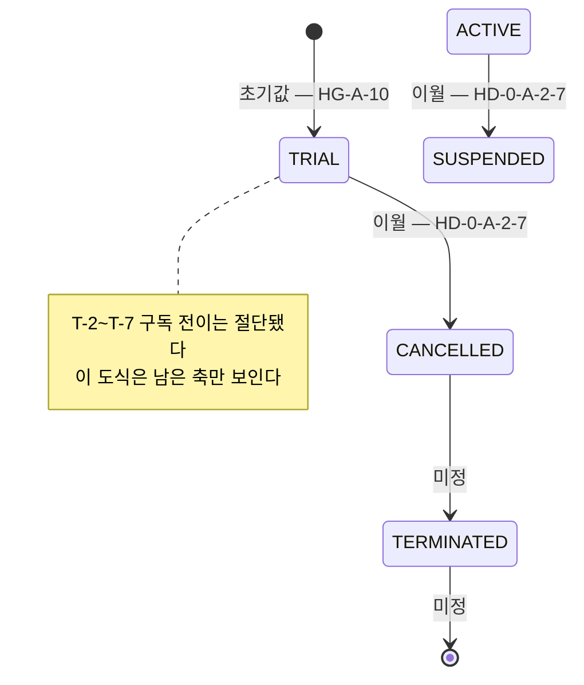
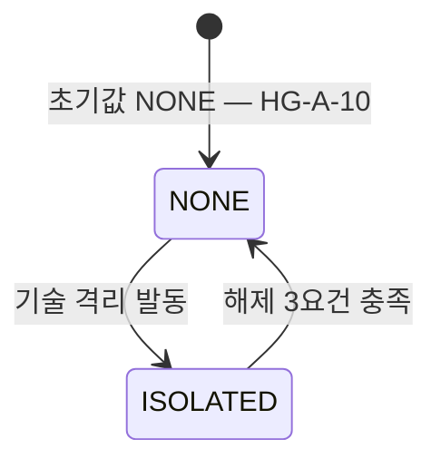
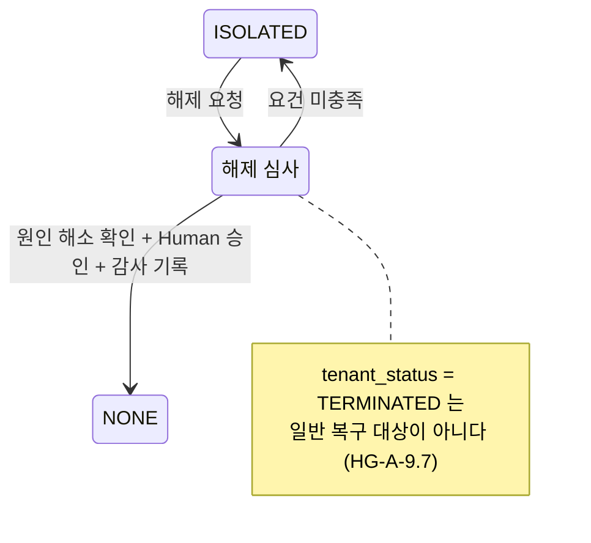
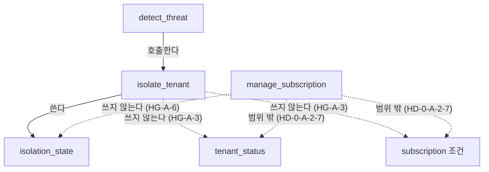
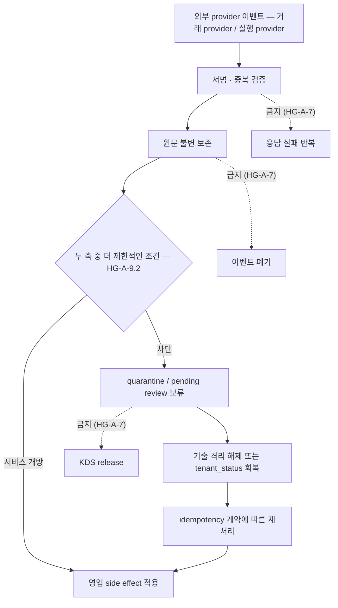
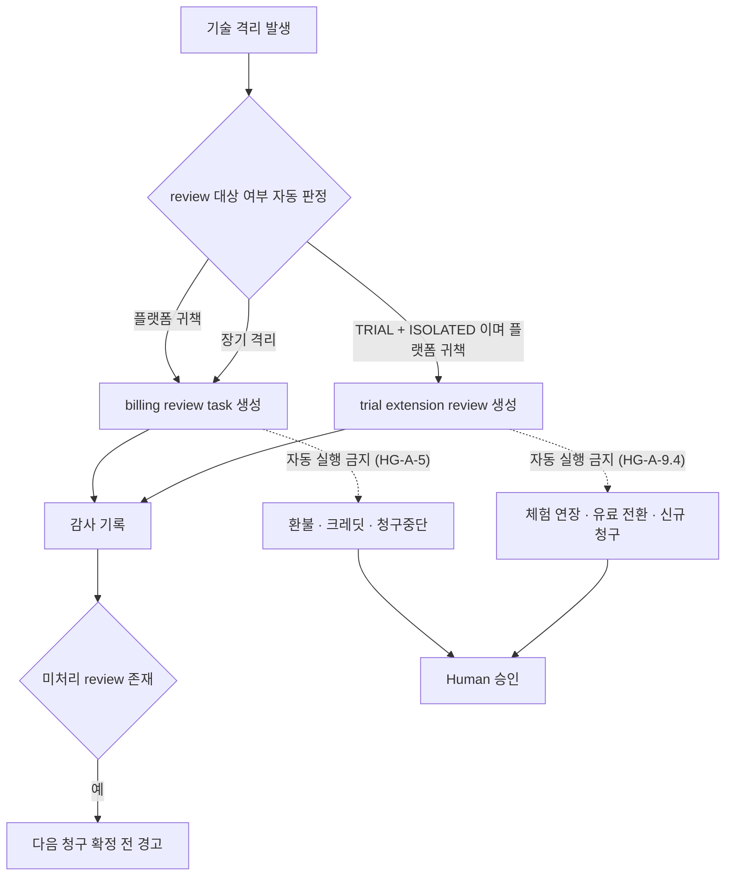

# 601803_Diagram_Tenant_Lifecycle_State_Machine.md

Status: Active
Lifecycle: Diagram
Last Updated: 2026-08-29

## 개정 이력

| 일자 | 내용 |
|---|---|
| 2026-08-27 | 초안 — `601801` `HG-A-1`~`HG-A-9` 를 상태 전이 모델로 옮김 |
| 2026-08-29 | 3단계 반영 — `601808` 대조표 30건(`RESOLVED` 7 · `STAGE_4` 23)을 반영하고 `OUT_OF_SCOPE` 3건을 §7 에 이관 기록했다. `HD-0-A-2-7` 로 `manage_subscription` 전이를 §1 에서 절단하고, `HD-0-A-2-8` 에 따라 `HG-A-9-N` 표기를 `HG-A-9.N` 으로 정합화했다. `Draft` → `Active` |

## §0 성격과 범위

`000701` §47.1 의 **2단계 ERD 산출물**이다.

**`601801` 의 업무규칙 선언을 모델로 옮긴 것이며 구현 설계가 아니다.**

```text
관계 모델이 아니라 상태 전이 모델이다
0-A-2 의 중심이 tenant_status × isolation_state 두 축이기 때문이다
```

> ⚠️ **테이블 · 컬럼 · 제약명을 확정하지 않는다.**
> **물리 확정은 4단계 ChangeContract 소관이다.**
>
> 이 문서에 등장하는 물리 이름은 **전부 `601802` 가 실측한 기존 객체**이며
> **신규 명명은 하나도 하지 않았다.**

### §0.1 `601802` 실측이 정한 성격

```text
isolation_state 를 참조하는 함수    전 스키마 0개          601802 §6.2
isolate_tenant                       tenant_status 에
                                     'ISOLATED' 를 쓴다      601802 §5.2
tenant_status  허용값                ACTIVE / TRIAL / SUSPENDED /
                                     CANCELLED / TERMINATED  601802 §6.1
                                     → 'ISOLATED' 는 허용값 밖
isolation_state 허용값               NONE / ISOLATED         601802 §6.1
manage_subscription                  phantom tenants.company_name
                                     isolate_tenant 인자명 불일치 2곳  601802 §5.2
```

> ⚠️ **제약명 출처 정정** — `601808` `N-12`
>
> ```text
> chk_tenants_status            sql/migrations/0168_create_operational_authority_foundation.sql 169행
> chk_tenants_isolation_state   같은 파일 187행
> ```
>
> **`601802` §6.1 은 컬럼 · 타입 · default · 허용값만 기록하며 제약명을 담지 않는다.**

**두 축 분리는 CHECK 에만 있고 로직에 없다.**

> ⚠️ **이 나선은 「기존 RPC 정렬」이 아니라 「축 신설」에 가깝다.**
> **다만 그 판정은 3~4단계 소관이며 이 문서는 모델만 그린다.**

### §0.2 이 문서가 하지 않는 것

```text
물리 객체 명명 · 제약 설계
현재 구현에 대한 처분 판단
미선언 전이의 추정 보완
offline_queue 재사용 가부 판정
manage_subscription 구독 전이 설계 — HD-0-A-2-7 로 절단
```

### §0.3 어휘 — 두 「격리」를 구분한다

**`601808` `S-6`.**

| 이 문서의 표기 | 뜻 | 근거 |
|---|---|---|
| **tenant 경계** | 멀티테넌트 데이터 경계 · RLS. 상시 유지되는 구조 | `601702` §1.26 |
| **기술 격리** (`isolation_state`) | 보안 · 장애 대응을 위한 일시적 containment | `HG-A-1` |

**이 문서에서 「격리」는 단독으로 쓰지 않는다.**
**`isolation_state` 축을 뜻할 때는 「기술 격리」로 적는다.**

> ⚠️ **물리 객체명과 policy 명명은 4단계 소관이다.**
> **여기서는 서술 어휘만 구분한다.**

## §1 `tenant_status` 전이도

**근거 — `HG-A-9.1`(5값 정의역) · `HG-A-10`(전이 선언 형식 · 초기값) · `HD-0-A-2-7`(범위 절단)**

> ⚠️ **`isolation_state` 는 이 전이도에 등장하지 않는다**(`HG-A-9.8`).

### §1.1 `HD-0-A-2-7` — 구독 전이 절단

```text
manage_subscription 과 T-2~T-7 구독 전이를 0-A-2 범위에서 절단한다
별도 Subscription Lifecycle 워크패킷으로 이월한다
```

**초안이 그렸던 `TRIAL→ACTIVE` · `TRIAL→CANCELLED` · `ACTIVE→SUSPENDED` ·
`SUSPENDED→ACTIVE` · `ACTIVE→CANCELLED` · `SUSPENDED→CANCELLED` 6건은
이 문서에서 제거한다.**

```text
제거 사유   601801 이 그 전이의 허용 여부도 수행 주체도 선언하지 않았다
            HG-A-10 「미선언 전이는 미정으로 남긴다. 2~4단계가 채우지 않는다」
            HD-0-A-2-7 이 범위 자체를 절단했다

이월처      별도 Subscription Lifecycle 워크패킷
```

**`tenant_status` 는 범위에 남는다. `0-A-2` 가 접근 판단을 위해 읽으며 변경하지 않는다.**

### §1.2 남은 전이



**전이 판정표**

| # | 전이 | 허용 / 금지 | 누가 바꾸는가 | 전제 조건 | 근거 |
|---|---|---|---|---|---|
| T-1 | `[*]` → `TRIAL` | 허용 | bootstrap 경로 — **미정** | tenant 생성 | `HG-A-10` — 「`tenant_status` 초기값은 bootstrap 경로가 정한다 — `0-A-3` 소관」 |
| T-2 ~ T-7 | 구독 전이 6건 | **이 나선 범위 밖** | — | — | `HD-0-A-2-7` |
| T-8 | `CANCELLED` → `TERMINATED` | **미정** | 미정 | 미정 | `HG-A-9.6` · `HG-A-9.7` 은 종료 상태의 의미만 선언 |
| T-9 | `CANCELLED` → `ACTIVE` | **기술 격리 해제로는 금지.** 그 외 경로는 **미정** | 미정 | 미정 | `HG-A-9.6` |
| T-10 | `TRIAL` / `ACTIVE` / `SUSPENDED` → `TERMINATED` | **미정** | 미정 | 미정 | `HG-A-*` 미선언 |
| T-11 | `TERMINATED` → 임의 상태 | **미정** | 미정 | 미정 | `HG-A-9.7` 은 terminal containment 만 선언 |

> ⚠️ **`T-1` 의 초기값 근거를 DB default 에서 `HG-A-10` 으로 바꿨다**(`601808` `S-1`).
> **「현재 DB default 를 설계 근거로 승격하지 않는다」**(`HG-A-10` · `601702` §1.27).

> ⚠️ **`HG-A-9.8`** — `tenant_status` 변경은 `isolation_state` 를 자동 변경하지 않는다.
> **남은 전이 어느 것도 `isolation_state` 를 건드리지 않는다.**

> ⚠️ **미정을 추정으로 채우지 않았다.**
> `HG-A-1` 표와 `HG-A-9` 표는 **조합의 유효성**을 선언했을 뿐
> **전이의 허용 여부를 전건 선언하지 않았다.** §7 참조.

## §2 `isolation_state` 전이도

**근거 — `HG-A-8`(해제 3요건) · `HG-A-3` · `HG-A-9.7` · `HG-A-9.8` · `HG-A-10`**



**전이 판정표**

| # | 전이 | 허용 / 금지 | 누가 바꾸는가 | 전제 조건 | 근거 |
|---|---|---|---|---|---|
| I-1 | `[*]` → `NONE` | 허용 | bootstrap 경로 — **미정** | tenant 생성 | `HG-A-10` — 「`isolation_state` 초기값 `NONE`」 |
| I-2 | `NONE` → `ISOLATED` | 허용 | `isolate_tenant` | 격리 사유 발생 — 사유 분류는 `601801` §2. **고객의 자발적 사용 중지는 사유가 아니다** | `HG-A-3` · `601801` §2 |
| I-3 | `ISOLATED` → `NONE` | 허용 — **3요건 전부 충족 시** | 승인된 복구 경로 — **미정** | ① 원인 해소 확인 ② Human 승인 ③ 감사 기록 | `HG-A-8` |
| I-4 | `ISOLATED` → `NONE` (`tenant_status` = `TERMINATED`) | **일반 격리 복구 대상이 아니다** | — | — | `HG-A-9.7` |

> ⚠️ **`I-2` 금지 사유**(`601808` `N-9`) — `601801` §2 마지막 행.
>
> ```text
> 고객의 자발적 사용 중지 → ISOLATED 사용 금지
> 그것은 SUSPENDED 또는 별도 구독 상태의 문제다
> 기술 격리를 편의상 재사용하면 축이 오염된다
> ```

> ⚠️ **`I-4` 표현 정정**(`601808` `N-2`) — 초안은 「해제 불가」로 강화했다.
> **`HG-A-9.7` 원문은 「해당 tenant 는 일반 격리 복구 대상이 아니다」이며
> 비일반 경로를 배제하지 않는다.** `U-12` 참조.

**`HG-A-8` 3요건**



> ⚠️ **`HG-A-9.8`** — 기술 격리 해제는 `tenant_status` 를 변경하지 않는다.
> **`I-3` 은 `SUSPENDED` 를 `ACTIVE` 로 만들지 않고**(`HG-A-9.5`),
> **`CANCELLED` 를 `ACTIVE` 로 만들지 않는다**(`HG-A-9.6`).

## §3 두 축의 독립성 — 10개 조합 격자

**근거 — `HG-A-1`(축 독립) · `HG-A-2`(`ACTIVE`+`ISOLATED` 의 차단 범위) · `HG-A-9.1`(전 조합 표현 가능) · `HG-A-9.2`(더 제한적인 조건 적용) · `HG-A-9.8` · `HG-A-11`(2축 소유) · `HG-A-13`(격리 범위)**


### §3.1 이 나선이 소유하는 축 — `HG-A-11`

```text
직접 소유   tenant_status · isolation_state

나머지 4축  MerchantAccountStatus · StoreServiceStatus ·
            StoreOperatingStatus · TrialStatus

  이번 나선의 직접 변경 대상이 아니다
  두 직접 상태축으로부터 자동 파생되지 않는다
  0-A-2 RPC 가 변경하지 않는다
  접근 판단에서 참조가 필요하면 명시적 precondition 으로만 사용한다
```

> ⚠️ **`MerchantAccount` 는 세 번째 lifecycle 상태축이 아니다**(`HG-A-12` · `HD-0-A-2-4`).
>
> ```text
> 0-A-2 RPC 가 하지 않는 것
>   merchant_account 생성 · 삭제 · 교체
>   merchant_account_id 변경
>   tenant ↔ merchant_account 연결 수정
>
> 허용되는 것
>   정상 운영 자격 판단에서
>   tenant 와 연결된 유효한 merchant_account 존재 여부를
>   별도 prerequisite 로 검사
> ```
>
> **생성과 연결 복구는 `0-A-3` 소관이다.**
> **`MerchantAccountStatus` 축은 이 나선이 설계하지 않는다** — `601746` §2.11 d.

**기존 store 의 상태 효과도 위 4축 조항이 답한다.**
**`0-A-2` 는 `StoreServiceStatus` · `StoreOperatingStatus` 를 변경하지 않는다.**

### §3.2 10개 조합 — `HG-A-9` 표를 그대로 옮긴다

| `tenant_status` | `NONE` | `ISOLATED` |
|---|---|---|
| `TRIAL` | `tenant_status` = `TRIAL`. 서비스 개방 여부는 `TrialStatus` 축이 정한다 | 기술 격리로 CatchMenu 접근 차단. 체험조건은 자동 변경하지 않음 |
| `ACTIVE` | 정상 서비스 · 활성 구독 | CatchMenu 접근 차단. 활성 계약 · 기본료 유지 |
| `SUSPENDED` | 서비스 정지 · 정지 계약조건 | 정지에 기술 격리 추가 |
| `CANCELLED` | 신규 서비스 금지 · 종료 처리. **반복과금 없음** | 종료 처리 중 기술 격리 유지 |
| `TERMINATED` | 영구 종료 · 보존 / 삭제 절차. **과금 없음** | terminal containment |

> ⚠️ **`TRIAL` 행 정정**(`601808` `S-5`) — 초안은 「체험 서비스」로 적었다.
> **`tenant_status` = `TRIAL` 에서 `TrialStatus` 를 추론한 것이며
> `601702` §1.27 이 금지한다**(`HG-A-11` ⚠️).
> **`TrialStatus` 는 이 나선이 소유하지 않는 4축 중 하나다.**

> ⚠️ **`CANCELLED` · `TERMINATED` 과금 처분은 `601801` §2 의 기록이다**(`601808` `N-10`).

### §3.3 두 축이 결정하는 것 — `HG-A-9` 합성 규칙

| 결정 대상 | `tenant_status` | `isolation_state` | 합성 방식 | 근거 |
|---|---|---|---|---|
| 서비스 접근 | 관여 | 관여 | **더 제한적인 조건 적용**. 차단 범위는 `HG-A-2` 표 | `HG-A-2` · `HG-A-9.2` |
| 계약 · 기본 구독료 · 체험조건 · 취소 효력일 · 반복과금 | 관여 | **미관여** | `tenant_status` + subscription 계약만 | `HG-A-9.3` |
| 사용량 산정 | **관여** — `CANCELLED` 이후 반복과금 없음 · `TERMINATED` 이후 과금 없음 | 관여 — 기술 격리 중 차단분 미산정 | 두 축이 각각 관여한다 | `HG-A-4` · `601801` §2 |
| 축 변경 권한 · 사유 · 승인 · 감사 | 별도 | 별도 | **각각 독립** | `HG-A-9.8` |

> ⚠️ **「사용량 산정 — `tenant_status` 미관여」 판정을 지웠다**(`601808` `S-9`).
> **`601801` 은 그 부정 선언을 하지 않았고 §2 가 오히려 관여를 기록했다.**
> **산정 로직 자체는 `U-13` 이 이월한 그대로다.**

### §3.4 기술 격리의 범위 — `HG-A-13`

**`601808` `S-10`.**

```text
적용 대상   CatchMenu 가 소유하거나 통제하는
            데이터 · API · 세션 · integration credential · 외부 전달 경로

적용 대상 아님   CatchMenu 와 별도 권위를 가진 외부 제품의 업무 쓰기
                 그 제품이 자기 DB 에서 하는 처리
```

> ⚠️ **기술 격리는 CatchMenu 밖으로 전파되지 않는다.**
> **외부 제품이 해당 tenant 자격으로 CatchMenu API 를 호출하면
> 그 호출을 fail-closed 로 거부한다** — 통로 차단이지 제품 격리가 아니다.

> ⚠️ **유효하다는 것이 정상 영업상태라는 뜻은 아니다.**
> **표현 가능한 조합과 서비스가 열리는 조합은 다르다**(`601801` §1.9).

## §4 책임 경계 — `HG-A` 대 `601802` 실측

**근거 — `HG-A-3` · `HG-A-6` · `HG-A-9.8` · `HD-0-A-2-7`**

**모델이 정한 책임 경계**



**`HG-A` 선언과 `601802` 실측의 대조**

| 함수 | `HG-A-*` 가 정한 것 | `601802` 실측 |
|---|---|---|
| `isolate_tenant` | `isolation_state` 만 변경한다. `tenant_status` · subscription 상태 · 청구조건을 자동 변경하지 않는다 — `HG-A-3` | `tenant_status` WRITE, `isolation_state` READ/WRITE 0건. `tenant_status` 에 `'ISOLATED'` 를 쓰며 허용값에 그 값이 없다 — §5.2 · §9.1 |
| `detect_threat` | 기술 격리 발동 권한 주체를 `601801` 이 선언하지 않았다 — `U-6` | `isolate_tenant` 의 DB 직접 호출자 2건 중 하나. FATAL 경로에서 호출하며 named argument `p_reason` 불일치가 있다 — §5.3 · §9.1 |
| `manage_subscription` | **`HD-0-A-2-7` 로 `0-A-2` 범위 밖.** `isolation_state` 를 변경하지 않는다는 경계만 유효 — `HG-A-6` | `isolation_state` 0참조로 그 부분은 부합. `tenant_status` READ/WRITE. `tenants.company_name` phantom 참조 1건, `isolate_tenant` 호출 named argument `p_reason` 불일치 2곳 — §5.2 |
| `isolation_state` 소비자 전반 | 서비스 접근 판정에 두 축 중 더 제한적인 조건을 적용한다 — `HG-A-9.2` | `isolation_state` 를 참조하는 함수 · VIEW · MATVIEW · TRIGGER **전 스키마 0건**. `tenant_status` 소비 함수는 7건 — §6.2 |
| 격리 복구 경로 | 원인 해소 확인 · Human 승인 · 감사 기록 3요건 — `HG-A-8` | 3요건을 표현하는 별도 복구 함수는 §5 · §9 관측 범위에서 확인되지 않았다 |
| `TERMINATED` 예외 | 일반 격리 복구 대상이 아니다 — `HG-A-9.7` | `tenant_status` 값에 `TERMINATED` 가 존재. 복구 경로의 상태 분기는 관측되지 않았다 — §6.1 · §6.2 |
| 전이 guard | 모델은 제한된 전이를 그렸다 | 라이브 `manage_subscription` 에 source-state guard 가 없다. 두 축 조합을 제한하는 제약도 없다 — `601804` `F-2` · `F-4` |

> ⚠️ **차이를 기록한 것이며 처분이 아니다.**
> **처분은 `U-15` 로 이월한다** — 4단계 ChangeContract 소관.

## §5 isolation queue 정보 요소 — 후보

**근거 — `HG-A-7` · `HG-A-2`(외부 webhook 은 직접 반영 금지) · `HG-A-9.2`**

> ⚠️ **테이블명 · 컬럼명을 정하지 않는다.**
> **`catchmenu_common.offline_queue` 재사용 가부도 여기서 판정하지 않는다**(`HG-A-7`).

**`HG-A-7` 이 요구하는 흐름**



> ⚠️ **분기 정정**(`601808` `S-4`) — 초안은 `"tenant 가 ISOLATED 인가"` 단일 축으로 분기했다.
> **§3.3 이 서비스 접근을 「두 축 중 더 제한적인 조건」으로 정의했으므로
> `CANCELLED`+`NONE` 같은 조합도 차단 쪽으로 간다.**

> ⚠️ **`KDS release` 금지를 개별 표현했다**(`601808` `N-5`) — `HG-A-7` 표 7행 중 1행.

**필요한 정보 요소 — 개념 수준**

| # | 정보 요소 | 왜 필요한가 | 근거 |
|---|---|---|---|
| Q-1 | 외부 이벤트 원문 | 불변 증거로 보존해야 한다 | `HG-A-7` |
| Q-2 | provider 식별과 이벤트 고유 식별 — **거래 provider 와 실행 provider 를 구분한다** | 중복 검증의 기준. 두 provider 는 성격이 다르다 | `HG-A-7` · `601702` §1.43 |
| Q-3 | 서명 · 검증 결과 | 검증은 기술 격리 중에도 수행한다 | `HG-A-7` |
| Q-4 | 귀속 tenant 와 두 축의 값 | 「더 제한적인 조건」 판정 대상 | `HG-A-9.2` |
| Q-5 | 보류 상태 — quarantine / pending review | side effect 를 적용하지 않았음을 표시 | `HG-A-7` |
| Q-6 | 보류 사유 — 기술 격리 때문인가 | 네트워크 단절 보류와 구분해야 한다 | `HG-A-7` 경고 |
| Q-7 | 재처리 시 중복 적용 방지 키 | idempotency 계약 | `HG-A-7` |
| Q-8 | 재처리 결과와 시각 | 해제 후 확정 여부 판정 | `HG-A-7` · `HG-A-4` |
| Q-9 | 사용량 산정 반영 여부 | 「복구 후 확정된 경우에만 산정」 | `HG-A-4` |
| Q-10 | 보존기간 정책 | **미정** — §7 | `HG-A-7` 미선언 |

> ⚠️ **`601802` 가 관측한 기존 자산 2건**(`601808` `N-8`).
>
> ```text
> catchmenu_common.offline_queue        601802 §8.3
>   action_type      주문 · KDS · waiting · 결제 등 업무 action
>   queue_status     PENDING / PROCESSING / COMPLETED / FAILED / EXPIRED / SKIPPED
>   expires_at       default now() + 24 hours
>   isolation 전용 표식   0건
>
> catchmenu_common.idempotency_keys     601802 §8.1
>   21컬럼. provider_event_id · replay_count · max_replay_allowed
>   UNIQUE (tenant_id, key_domain, idempotency_key)
>   → Q-2 · Q-7 과 겹치는 기존 자산
> ```
>
> **관측 사실을 옮긴 것이며 재사용 가부 판정이 아니다** — `U-8`.

## §6 billing review task 정보 요소 — 후보

**근거 — `HG-A-5` · `HG-A-9.4`**

> ⚠️ **테이블명 · 컬럼명을 정하지 않는다.**



> ⚠️ **「그 외 → 생성하지 않음」 분기를 지웠다**(`601808` `S-3`).
> **`HG-A-5` 는 플랫폼 귀책 · 장기 격리에서 생성하라고 정했을 뿐
> 나머지 원인에서 생성을 금지하지 않았다.** 미표현으로 되돌린다.

> ⚠️ **세 분기를 배타로 그리지 않았다**(`601808` `N-4`).
> **billing review 와 trial extension review 의 중첩 여부를 `601801` 이 선언하지 않았다** — `U-21`.

**필요한 정보 요소 — 개념 수준**

| # | 정보 요소 | 왜 필요한가 | 근거 |
|---|---|---|---|
| B-1 | 대상 tenant 와 격리 사건 참조 | review 는 특정 격리에서 나온다 | `HG-A-5` |
| B-2 | 격리 원인 분류와 귀책 주체 | 플랫폼 귀책 여부가 자동 판정 기준. 발동 주체는 `U-6` | `HG-A-5` · `601801` §2 |
| B-3 | review 종류 — billing / trial extension | `TRIAL` 은 별도 종류 | `HG-A-9.4` |
| B-4 | 처리 상태 — 미처리 / 처리됨 | 청구 확정 전 경고의 기준 | `HG-A-5` |
| B-5 | Human 승인 기록 — 승인자 · 시각 · 결정 | 금전 조작은 Human 승인으로만 | `HG-A-5` · `HG-A-9.4` |
| B-6 | 감사 기록 연결 | review 생성과 동시에 감사 기록 | `HG-A-5` |
| B-7 | 대상 청구 주기 | 「다음 청구 확정 전」의 대상 특정 | `HG-A-5` |
| B-8 | 「장기 격리」 판정 기준 | **미정** — 구독 · SLA 정책이 정한다 | `HG-A-5` 명시 |

> ⚠️ **`HG-A-5`** — review task 생성은 금전 조작이 아니다.
> **자동화 가능한 것은 생성 · 알림 · 청구 전 경고까지다.**

## §7 미정 항목

**이 단계에서 정하지 않은 것이다. 4단계 설계와 후속 나선이 채운다.**

| # | 미정 항목 | 성격 | 근거 |
|---|---|---|---|
| U-1 | `TRIAL` / `ACTIVE` / `SUSPENDED` → `TERMINATED` 전이 허용 여부 | `HG-A-*` 미선언 | §1.2 T-10 |
| U-2 | `CANCELLED` → `ACTIVE` 의 기술 격리 해제 외 경로 | `HG-A-9.6` 은 격리 해제 경로만 금지했다 | §1.2 T-9 |
| U-3 | `TERMINATED` 를 벗어나는 전이의 존재 여부 | `HG-A-9.7` 은 terminal containment 만 선언. **`HG-A-10` 이 미정 유지를 지시한다** — `601808` `N-20` | §1.2 T-11 |
| U-4 | tenant 생성 시 두 축 초기값을 세우는 bootstrap 경로 | **`0-A-3` 소관**(`HG-A-10`) | §1.2 T-1 · §2 I-1 |
| U-5 | 기술 격리 해제를 수행하는 주체와 경로 | `HG-A-8` 은 요건만 정했다. 권한 주체는 `0-C`(`HG-A-10`) | §2 I-3 |
| U-6 | 기술 격리 발동 권한 주체 | `HG-A-3` 은 함수 책임만 정했다. `detect_threat` 경로가 실재한다 | §2 I-2 · §4 |
| U-7 | 「더 제한적인 조건」의 판정 위치 | **`0-C` 소관** — `000221` §4.4 「0-C 에서 처음으로 RLS policy 를 만든다」. **`0-A-2` 안에서 확정하지 않는다** | §3.3 · `HG-A-9.2` |
| U-8 | isolation queue 물리 구조와 `offline_queue` · `idempotency_keys` 재사용 가부 | `HG-A-7` 이 판정을 이월했다 | §5 |
| U-9 | isolation queue 보존기간 정책 | `HG-A-7` 미선언 | §5 Q-10 |
| U-10 | billing review task 물리 표현 | `601801` §4 가 이월했다 | §6 |
| U-11 | 「장기 격리」의 시간 기준 | `HG-A-5` 가 구독 · SLA 정책으로 이월했다 | §6 B-8 |
| U-12 | `TERMINATED` 보존 · 삭제 · 익명화 절차 | `601801` §4 가 이월했다. `I-4` 의 비일반 경로가 여기 속한다 | `HG-A-9.7` |
| U-13 | 과금 금액 계산 · 정산 로직 | `601801` §4 가 이월했다 | `HG-A-4` |
| U-14 | `tenant_status` 와 다른 lifecycle 값집합의 관계 — `tenant_plan_configs.plan_status`={TRIAL,ACTIVE,SUSPENDED,CANCELLED,EXPIRED} · `white_label_configs.contract_status`={NEGOTIATING,SIGNED,ACTIVE,SUSPENDED,TERMINATED} | `601802` §7.2 가 **세** 값집합을 실측했다. `plan_status` 참조 함수 13개 · `tenant_status` 7개. **실측 행 1건으로는 어휘 간 불변식을 확정할 수 없다** — `601804` `F-5`·`F-6` | `601802` §7.2 |
| U-15 | 현재 구현과 모델의 차이에 대한 처분 — 라이브 guard 부재 · 두 축 조합 제약 부재 포함 | 4단계 ChangeContract 소관 | §4 |
| U-16 | **`HG-A-2` 의 기능별 차단 9행이 모델에 없다** — 로그인 / 주문·대기·멤버십·재고 쓰기 / 일반 조회 / store·user 생성 / 외부 POS·KDS 명령 / webhook / 감사 조사 / 격리 해제 / 계약 조회 | §3.3 은 합성 규칙 수준으로만 표현했다. 기능별 분해는 `U-7`(판정 위치)이 정해져야 그릴 수 있고 `U-7` 은 `0-C` 소관이다. **`HG-A-13` 이 차단 범위를 CatchMenu 통제 대상으로 한정했다** | `HG-A-2` · `HG-A-13` |
| U-17 | **`HG-A-4` 의 사용량 3분류가 상태 격자에 없다** — 격리 전 확정 사용량은 정상 청구 / 격리 중 차단된 요청은 사용량 미산정 / 격리 큐에 보존된 이벤트는 복구 후 확정된 경우에만 산정 | 시간축(격리 전 / 중 / 해제 후)이 상태 격자에 나타나지 않는다. 사용량 산정은 금전에 직결된다 | `HG-A-4` |
| U-18 | `U-7` 을 `0-A-2` 안에서 닫으면 `0-C` 침범 | **`601808` `N-7` — `OUT_OF_SCOPE`.** 소관은 `0-C` 이며 이 문서는 판정 위치를 확정하지 않았다 | `000221` §4.4 |
| U-19 | `601748` §8 Mandatory Gates 게이트 1 — 「C-3 는 H-2 · H-3 · RLS policy · grant · RPC write path 보다 선행」과 `U-7` · `U-16` 의 RLS 예고 순서 | **`601808` `N-15` — `OUT_OF_SCOPE`.** C-3 는 `0-A-3` 소관이며 이 문서는 RLS policy 를 만들지 않으므로 순서를 침범하지 않는다 | `601748` §8 |
| U-20 | `000221` §4.2 가 `601746` §8 을 인용했으나 실제는 `601748` §8 이다 | **`601808` `N-23` — `OUT_OF_SCOPE`.** `601803` 의 오류가 아니며 **2026-08-28 정정 완료** | `000221` §4.2 |
| U-21 | billing review 와 trial extension review 의 중첩 여부 | `HG-A-5` · `HG-A-9.4` 가 선언하지 않았다 | §6 노드 `J` |

> ⚠️ **`U-16` · `U-17` 은 모델 누락이지 선언 누락이 아니다.**
> **`HG-A-2` · `HG-A-4` 는 `601801` 에 온전히 있다.**
> **이 문서가 상태 전이 모델이라 표현하지 못한 것을 기록한 것이다.**

> ⚠️ **`U-18` ~ `U-20` 은 `601808` 이 `OUT_OF_SCOPE` 로 분류한 3건이다.**
> **이 문서가 처분하지 않으며 이관 사실만 기록한다.**

**미정 21건.**

> ⚠️ **미정을 추정으로 채우지 않았다.**
> **`601801` 이 선언하지 않은 것을 이 문서가 만들어내면
> 1단계 Human 전담 원칙이 무너진다**(`000701` §47.1).

## §8 근거 문서 목록 (`000701` §46)

| 문서 | 인용 | 지위 |
|---|---|---|
| `601801_Register_Stage1_Business_Rules.md` | `HG-A-1` ~ `HG-A-13` · `HD-0-A-2-1` ~ `HD-0-A-2-8` · §2 · §4 | ACTIVE |
| `601802_Register_Stage0_Evidence_Collection.md` | §5.2 · §5.3 · §6.1 · §6.2 · §7.2 · §8.1 · §8.3 · §9.1 | ACTIVE |
| `601800_Readme_Tenant_Lifecycle_Rpc_Alignment.md` | §1 · §5 · §6 | ACTIVE |
| `601804_Audit_Stage3_Adjacent_Domain_Codex.md` | `F-2` · `F-4` · `F-5` · `F-6` | ACTIVE |
| `601807_Report_Stage3_Integration.md` | `S-1` ~ `S-10` · `N-1` ~ `N-23` | ACTIVE |
| `601808_Report_Stage3_Impact_Reconciliation.md` | §2 대조표 33건 — **이 개정의 지시서** | ACTIVE |
| `601702_Register_Stage1_Business_Rules.md` | §1.26 어휘 · §1.27 축 추론 금지 · §1.28 6축 · §1.43 provider 2종 | ACTIVE |
| `601746_Report_Stage11C_Conflict_Analysis.md` | §2.11 d — `MerchantAccountStatus` 축 이관 | ACTIVE |
| `601748_Evidence_Stage12_Human_Merge_Decision.md` | §8 Mandatory Gates 게이트 1 — `U-19` | ACTIVE |
| `600010_Tracker_Spiral_Workpacket_Progress.md` | §1 · §2 — 나선 식별자 · 금지 조항 | ACTIVE |
| `000220_Guide_Shared_Commerce_Kernel_And_Foundation_Axis.md` | Foundation 축 ⑥ External Provider Boundary · ⑦ Reliability — §5 정보 요소와 겹친다. **축 귀속은 `000220` §4 소관이며 이 문서가 판정하지 않는다** | ACTIVE |
| `000221_Guide_Post_0A_Spiral_Sequence.md` | §3 · §3.2 · §4.1 · §4.4 — `U-7` 소관 · §6.1 A급 판별 | ACTIVE |
| `000701_Guide_Controlled_AI_Development_Pipeline.md` | §46 · §47.1 | ACTIVE |
| `sql/migrations/0168_create_operational_authority_foundation.sql` | 169 · 187행 — 제약명 실재 위치 | — |
| `601502` · `601503` · `601505` | 인용하지 않음 — 이 문서는 권위보류 대역을 근거로 삼지 않는다 | ⛔ **권위보류** |

> ⚠️ **`0-A-2` 검증 등급은 A 다** — `HD-0-A-2-1`(`601801` §3).
> **등급 판정 기록은 `601801` §3 에 있으며 이 문서가 다시 판정하지 않는다.**

### §8.1 요소별 `HG-A-N` 추적

| 이 문서의 요소 | 근거 |
|---|---|
| §0.3 어휘 구분 | `HG-A-1` · `601702` §1.26 |
| §1.1 구독 전이 절단 | `HD-0-A-2-7` · `HG-A-10` |
| §1.2 T-1 ~ T-11 `tenant_status` 전이 | `HG-A-9.1` · `HG-A-9.6` · `HG-A-9.7` · `HG-A-9.8` · `HG-A-10` |
| §2 I-1 ~ I-4 `isolation_state` 전이 | `HG-A-3` · `HG-A-8` · `HG-A-9.5` · `HG-A-9.6` · `HG-A-9.7` · `HG-A-9.8` · `HG-A-10` · `601801` §2 |
| §3 축 다이어그램 | `HG-A-1` · `HG-A-9.8` |
| §3.1 소유 축 · `MerchantAccount` 경계 | `HG-A-11` · `HG-A-12` · `HD-0-A-2-3` · `HD-0-A-2-4` |
| §3.2 10개 조합 격자 | `HG-A-2` · `HG-A-9.1` · `HG-A-11` · `601801` §2 |
| §3.3 합성 규칙 표 | `HG-A-2` · `HG-A-4` · `HG-A-9.2` · `HG-A-9.3` · `HG-A-9.8` · `601801` §2 |
| §3.4 격리 범위 | `HG-A-13` |
| §4 책임 경계 | `HG-A-3` · `HG-A-6` · `HG-A-8` · `HG-A-9.2` · `HG-A-9.7` · `HD-0-A-2-7` |
| §5 Q-1 ~ Q-10 | `HG-A-2` · `HG-A-4` · `HG-A-7` · `HG-A-9.2` · `601702` §1.43 |
| §6 B-1 ~ B-8 | `HG-A-5` · `HG-A-9.4` |
| §7 U-1 ~ U-21 | 해당 `HG-A-N` 의 **미선언 지점** 및 `601808` `OUT_OF_SCOPE` 3건 |

**`HG-A-1` ~ `HG-A-13` 전건이 §0.3~§6 중 최소 한 곳에서 인용됐다.**
**`HD-0-A-2-1` ~ `HD-0-A-2-8` 중 이 문서에 영향을 준 것은
`HD-0-A-2-1` · `HD-0-A-2-3` · `HD-0-A-2-4` · `HD-0-A-2-7` · `HD-0-A-2-8` 이다.**
