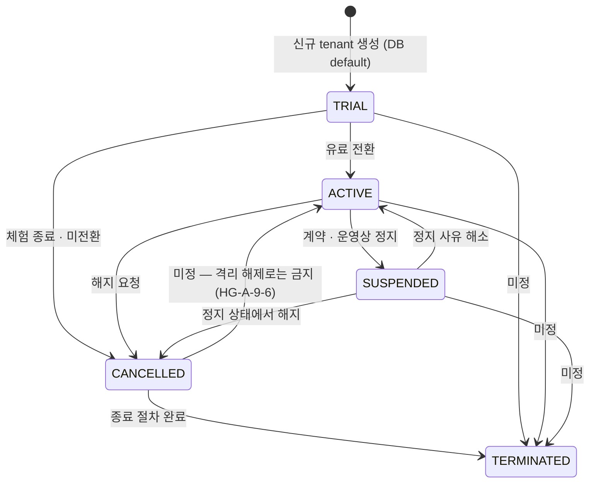
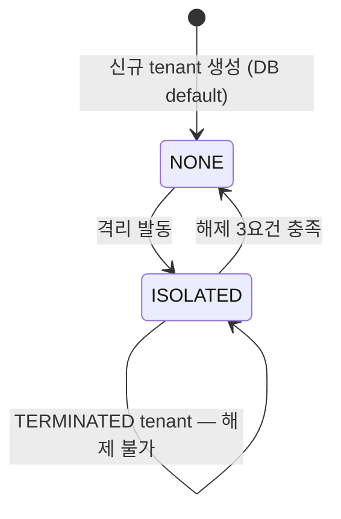
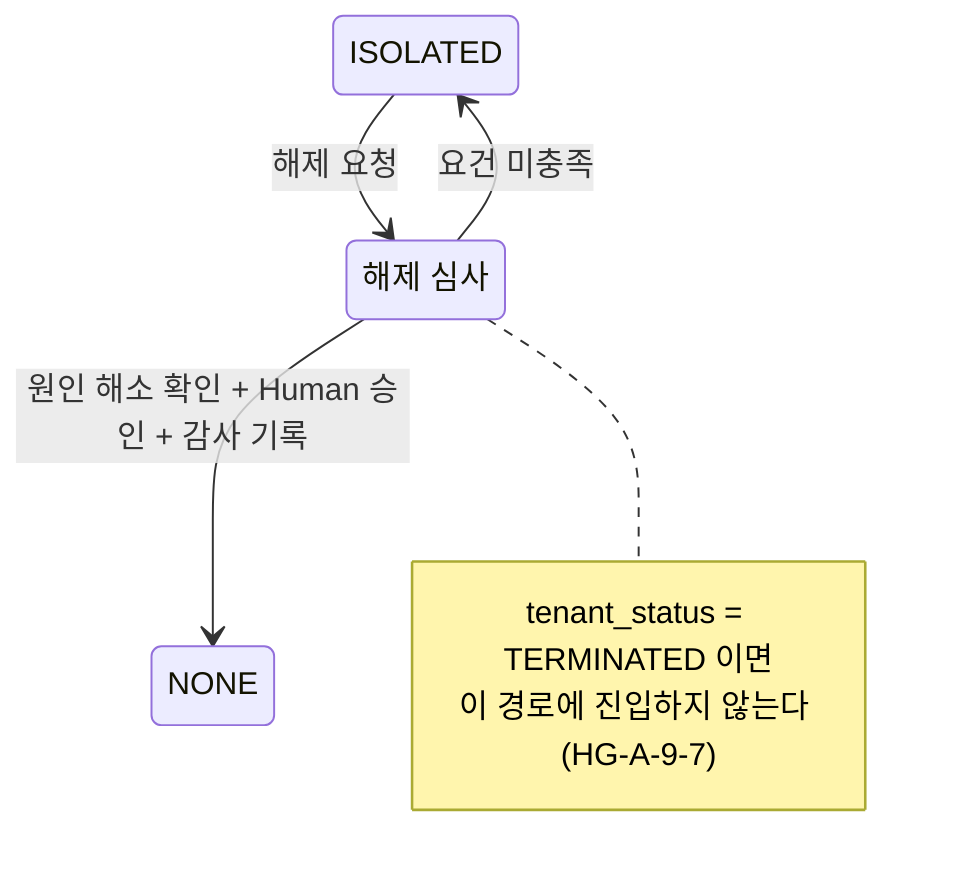
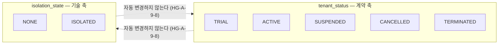
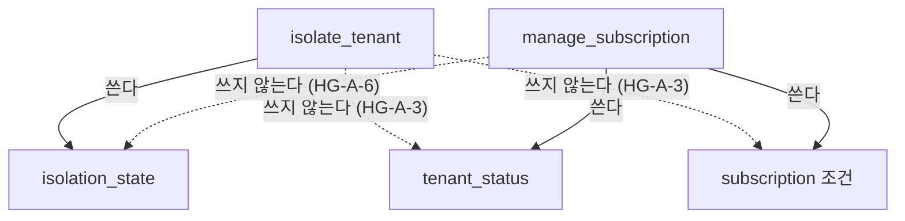
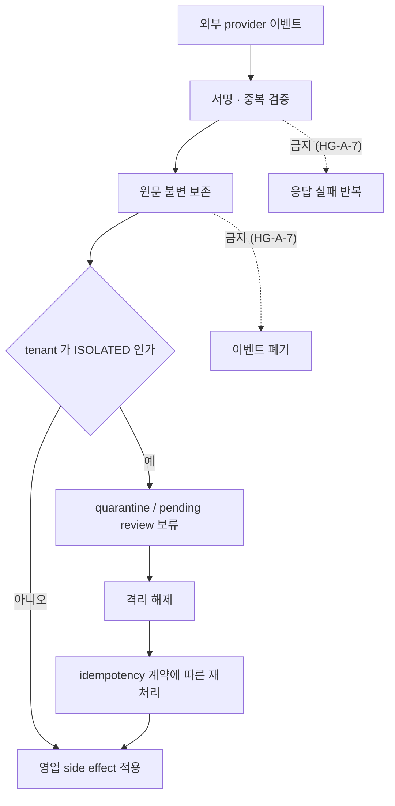
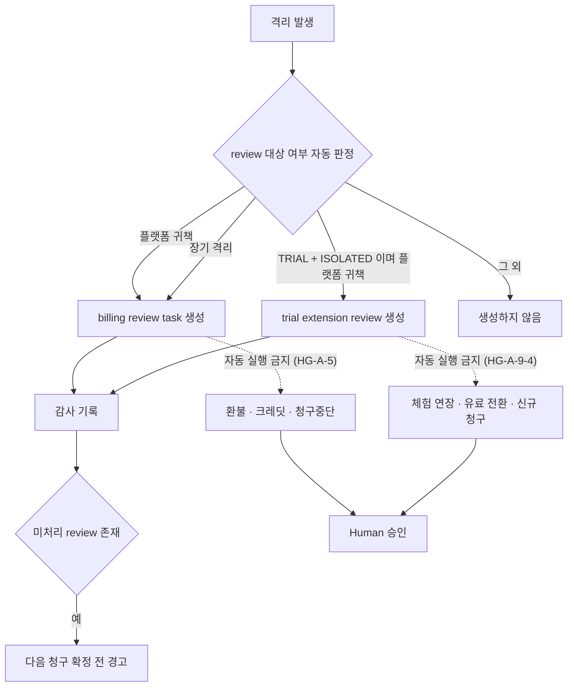

# 601803_Diagram_Tenant_Lifecycle_State_Machine.md

Status: Draft
Lifecycle: Diagram
Last Updated: 2026-08-27

## 개정 이력

| 일자 | 내용 |
|---|---|
| 2026-08-27 | 초안 — `601801` `HG-A-1`~`HG-A-9` 를 상태 전이 모델로 옮김 |

## §0 성격과 범위

`000701` §47.1 의 **2단계 ERD 초안** 산출물이다.

**`601801` 의 업무규칙 선언을 모델로 옮긴 것이며 구현 설계가 아니다.**

```text
관계 모델이 아니라 상태 전이 모델이다
0-A-2 의 중심이 tenant_status × isolation_state 두 축이기 때문이다
```

> ⚠️ **테이블 · 컬럼 · 제약명을 확정하지 않는다.**
> **물리 확정은 4단계 ChangeContract 소관이다.**
>
> 이 문서에 등장하는 물리 이름은 **전부 `601802` 가 실측한 기존 객체**이며
> **신규 명명은 하나도 하지 않았다.**

### §0.1 `601802` 실측이 정한 성격

```text
isolation_state 를 참조하는 함수    전 스키마 0개          601802 §6.2
isolate_tenant                       tenant_status 에
                                     'ISOLATED' 를 쓴다      601802 §5.2
chk_tenants_status                   ACTIVE / TRIAL / SUSPENDED /
                                     CANCELLED / TERMINATED  601802 §6.1
                                     → 'ISOLATED' 는 허용값 밖
chk_tenants_isolation_state          NONE / ISOLATED         601802 §6.1
manage_subscription                  phantom tenants.company_name
                                     isolate_tenant 인자명 불일치 2곳  601802 §5.2
```

**두 축 분리는 CHECK 에만 있고 로직에 없다.**

> ⚠️ **이 나선은 「기존 RPC 정렬」이 아니라 「축 신설」에 가깝다.**
> **다만 그 판정은 3~4단계 소관이며 이 문서는 모델만 그린다.**

### §0.2 이 문서가 하지 않는 것

```text
물리 객체 명명 · 제약 설계
현재 구현에 대한 처분 판단
미선언 전이의 추정 보완
offline_queue 재사용 가부 판정
```

## §1 `tenant_status` 전이도

**근거 — `HG-A-9-1`(5값 정의역) · `HG-A-9-3`(계약 조건은 이 축이 결정) · `HG-A-6`**

> ⚠️ **`isolation_state` 는 이 전이도에 등장하지 않는다**(`HG-A-9-8`).



**전이 판정표**

| # | 전이 | 허용 / 금지 | 누가 바꾸는가 | 전제 조건 | 근거 |
|---|---|---|---|---|---|
| T-1 | `[*]` → `TRIAL` | 허용 | provisioning 경로 — **미정** | tenant 생성 | `601802` §6.1 default `'TRIAL'` |
| T-2 | `TRIAL` → `ACTIVE` | 허용 | `manage_subscription` | 구독 계약 성립 | `HG-A-6` · `HG-A-9-3` |
| T-3 | `TRIAL` → `CANCELLED` | 허용 | `manage_subscription` | 체험 종료 · 미전환 | `HG-A-9-3` |
| T-4 | `ACTIVE` → `SUSPENDED` | 허용 | `manage_subscription` | 계약 · 운영상 정지 사유 | `HG-A-1` 표 · `HG-A-9-3` |
| T-5 | `SUSPENDED` → `ACTIVE` | 허용 | `manage_subscription` | 정지 사유 해소 | `HG-A-9-3` |
| T-6 | `ACTIVE` → `CANCELLED` | 허용 | `manage_subscription` | 해지 요청 · 효력일 | `HG-A-9-3` |
| T-7 | `SUSPENDED` → `CANCELLED` | 허용 | `manage_subscription` | 해지 요청 | `HG-A-9-3` |
| T-8 | `CANCELLED` → `TERMINATED` | 허용 | **미정** | 종료 절차 완료 | `HG-A-9-6` · `HG-A-9-7` |
| T-9 | `CANCELLED` → `ACTIVE` | **격리 해제로는 금지.** 그 외 경로는 **미정** | 미정 | 미정 | `HG-A-9-6` |
| T-10 | `TRIAL` / `ACTIVE` / `SUSPENDED` → `TERMINATED` | **미정** | 미정 | 미정 | `HG-A-*` 미선언 |
| T-11 | `TERMINATED` → 임의 상태 | **미정** | 미정 | 미정 | `HG-A-9-7` 은 terminal containment 만 선언 |

> ⚠️ **`HG-A-9-8`** — `tenant_status` 변경은 `isolation_state` 를 자동 변경하지 않는다.
> **`T-1` ~ `T-11` 어느 것도 `isolation_state` 를 건드리지 않는다.**

> ⚠️ **미정 5건은 추정으로 채우지 않았다.**
> `HG-A-1` 표와 `HG-A-9` 표는 **조합의 유효성**을 선언했을 뿐
> **전이의 허용 여부를 전건 선언하지 않았다.** §7 참조.

## §2 `isolation_state` 전이도

**근거 — `HG-A-8`(해제 3요건) · `HG-A-3` · `HG-A-9-7` · `HG-A-9-8`**



**전이 판정표**

| # | 전이 | 허용 / 금지 | 누가 바꾸는가 | 전제 조건 | 근거 |
|---|---|---|---|---|---|
| I-1 | `[*]` → `NONE` | 허용 | provisioning 경로 — **미정** | tenant 생성 | `601802` §6.1 default `'NONE'` |
| I-2 | `NONE` → `ISOLATED` | 허용 | `isolate_tenant` | 격리 사유 발생 — 사유 분류는 `601801` §2 | `HG-A-3` |
| I-3 | `ISOLATED` → `NONE` | 허용 — **3요건 전부 충족 시** | 승인된 복구 경로 — **미정** | ① 원인 해소 확인 ② Human 승인 ③ 감사 기록 | `HG-A-8` |
| I-4 | `ISOLATED` → `NONE` (`tenant_status` = `TERMINATED`) | **금지** | — | — | `HG-A-9-7` |

**`HG-A-8` 3요건**



> ⚠️ **`HG-A-9-8`** — 격리 해제는 `tenant_status` 를 변경하지 않는다.
> **`I-3` 은 `SUSPENDED` 를 `ACTIVE` 로 만들지 않고**(`HG-A-9-5`),
> **`CANCELLED` 를 `ACTIVE` 로 만들지 않는다**(`HG-A-9-6`).

## §3 두 축의 독립성 — 10개 조합 격자

**근거 — `HG-A-1`(축 독립) · `HG-A-2`(`ACTIVE`+`ISOLATED` 의 차단 범위) · `HG-A-9-1`(전 조합 표현 가능) · `HG-A-9-2`(더 제한적인 조건 적용) · `HG-A-9-8`**



**10개 조합 — `HG-A-9` 표를 그대로 옮긴다**

| `tenant_status` | `NONE` | `ISOLATED` |
|---|---|---|
| `TRIAL` | 체험 서비스 · 체험 과금조건 | 체험 서비스 차단. 체험조건은 자동 변경하지 않음 |
| `ACTIVE` | 정상 서비스 · 활성 구독 | 서비스 차단. 활성 계약 · 기본료 유지 |
| `SUSPENDED` | 서비스 정지 · 정지 계약조건 | 정지에 보안격리 추가 |
| `CANCELLED` | 신규 서비스 금지 · 종료 처리 | 종료 처리 중 기술적 격리 유지 |
| `TERMINATED` | 영구 종료 · 보존 / 삭제 절차 | terminal containment |

**두 축이 결정하는 것 — `HG-A-9` 합성 규칙**

| 결정 대상 | `tenant_status` | `isolation_state` | 합성 방식 | 근거 |
|---|---|---|---|---|
| 서비스 접근 | 관여 | 관여 | **더 제한적인 조건 적용**. 차단 범위는 `HG-A-2` 표 | `HG-A-2` · `HG-A-9-2` |
| 계약 · 기본 구독료 · 체험조건 · 취소 효력일 · 반복과금 | 관여 | **미관여** | `tenant_status` + subscription 계약만 | `HG-A-9-3` |
| 사용량 산정 | 미관여 | 관여 — 차단분 미산정 | 격리 중 차단된 요청은 제외 | `HG-A-4` |
| 축 변경 권한 · 사유 · 승인 · 감사 | 별도 | 별도 | **각각 독립** | `HG-A-9-8` |

> ⚠️ **유효하다는 것이 정상 영업상태라는 뜻은 아니다.**
> **표현 가능한 조합과 서비스가 열리는 조합은 다르다**(`601801` §1.9).

## §4 책임 경계 — `HG-A` 대 `601802` 실측

**근거 — `HG-A-3` · `HG-A-6` · `HG-A-9-8`**

**모델이 정한 책임 경계**



**`HG-A` 선언과 `601802` 실측의 대조**

| 함수 | `HG-A-*` 가 정한 것 | `601802` 실측 |
|---|---|---|
| `isolate_tenant` | `isolation_state` 만 변경한다. `tenant_status` · subscription 상태 · 청구조건을 자동 변경하지 않는다 — `HG-A-3` | `tenant_status` WRITE, `isolation_state` READ/WRITE 0건. `tenant_status` 에 `'ISOLATED'` 를 쓰며 `chk_tenants_status` 허용값에 그 값이 없다 — §5.2 · §9.1 |
| `manage_subscription` | `tenant_status` 와 subscription 만 다룬다. `isolation_state` 를 변경하지 않는다 — `HG-A-6` | `isolation_state` 0참조로 이 부분은 부합. `tenant_status` READ/WRITE. `tenants.company_name` phantom 참조 1건, `isolate_tenant` 호출 named argument `p_reason` 불일치 2곳 — §5.2 |
| `isolation_state` 소비자 전반 | 서비스 접근 판정에 두 축 중 더 제한적인 조건을 적용한다 — `HG-A-9-2` | `isolation_state` 를 참조하는 함수 · VIEW · MATVIEW · TRIGGER **전 스키마 0건**. `tenant_status` 소비 함수는 7건 — §6.2 |
| 격리 복구 경로 | 원인 해소 확인 · Human 승인 · 감사 기록 3요건 — `HG-A-8` | 3요건을 표현하는 별도 복구 함수는 §5 · §9 관측 범위에서 확인되지 않았다 |
| `TERMINATED` 예외 | 일반 격리 복구 대상이 아니다 — `HG-A-9-7` | `tenant_status` 값에 `TERMINATED` 가 존재. 복구 경로의 상태 분기는 관측되지 않았다 — §6.1 · §6.2 |

> ⚠️ **차이를 기록한 것이며 처분이 아니다.**
> **어느 쪽을 어떻게 할지는 3단계 대조와 4단계 계약이 정한다.**

## §5 isolation queue 정보 요소 — 후보

**근거 — `HG-A-7` · `HG-A-2`(외부 webhook 은 직접 반영 금지)**

> ⚠️ **테이블명 · 컬럼명을 정하지 않는다.**
> **`catchmenu_common.offline_queue` 재사용 가부도 여기서 판정하지 않는다**(`HG-A-7`).

**`HG-A-7` 이 요구하는 흐름**



**필요한 정보 요소 — 개념 수준**

| # | 정보 요소 | 왜 필요한가 | 근거 |
|---|---|---|---|
| Q-1 | 외부 이벤트 원문 | 불변 증거로 보존해야 한다 | `HG-A-7` |
| Q-2 | provider 식별과 이벤트 고유 식별 | 중복 검증의 기준 | `HG-A-7` |
| Q-3 | 서명 · 검증 결과 | 검증은 격리 중에도 수행한다 | `HG-A-7` |
| Q-4 | 귀속 tenant | 격리 여부 판정 대상 | `HG-A-9-2` |
| Q-5 | 보류 상태 — quarantine / pending review | side effect 를 적용하지 않았음을 표시 | `HG-A-7` |
| Q-6 | 보류 사유 — 격리 때문인가 | 네트워크 단절 보류와 구분해야 한다 | `HG-A-7` 경고 |
| Q-7 | 재처리 시 중복 적용 방지 키 | idempotency 계약 | `HG-A-7` |
| Q-8 | 재처리 결과와 시각 | 해제 후 확정 여부 판정 | `HG-A-7` · `HG-A-4` |
| Q-9 | 사용량 산정 반영 여부 | 「복구 후 확정된 경우에만 산정」 | `HG-A-4` |
| Q-10 | 보존기간 정책 | **미정** — §7 | `HG-A-7` 미선언 |

> ⚠️ **`601802` §8.3 이 `offline_queue` 구조를 기록했다.**
>
> ```text
> action_type      주문 · KDS · waiting · 결제 등 업무 action
> queue_status     PENDING / PROCESSING / COMPLETED / FAILED / EXPIRED / SKIPPED
> expires_at       default now() + 24 hours
> isolation 전용 표식   0건
> ```
>
> **관측 사실을 옮긴 것이며 재사용 가부 판정이 아니다.**

## §6 billing review task 정보 요소 — 후보

**근거 — `HG-A-5` · `HG-A-9-4`**

> ⚠️ **테이블명 · 컬럼명을 정하지 않는다.**



**필요한 정보 요소 — 개념 수준**

| # | 정보 요소 | 왜 필요한가 | 근거 |
|---|---|---|---|
| B-1 | 대상 tenant 와 격리 사건 참조 | review 는 특정 격리에서 나온다 | `HG-A-5` |
| B-2 | 격리 원인 분류와 귀책 주체 | 플랫폼 귀책 여부가 자동 판정 기준 | `HG-A-5` · `601801` §2 |
| B-3 | review 종류 — billing / trial extension | `TRIAL` 은 별도 종류 | `HG-A-9-4` |
| B-4 | 처리 상태 — 미처리 / 처리됨 | 청구 확정 전 경고의 기준 | `HG-A-5` |
| B-5 | Human 승인 기록 — 승인자 · 시각 · 결정 | 금전 조작은 Human 승인으로만 | `HG-A-5` · `HG-A-9-4` |
| B-6 | 감사 기록 연결 | review 생성과 동시에 감사 기록 | `HG-A-5` |
| B-7 | 대상 청구 주기 | 「다음 청구 확정 전」의 대상 특정 | `HG-A-5` |
| B-8 | 「장기 격리」 판정 기준 | **미정** — 구독 · SLA 정책이 정한다 | `HG-A-5` 명시 |

> ⚠️ **`HG-A-5`** — review task 생성은 금전 조작이 아니다.
> **자동화 가능한 것은 생성 · 알림 · 청구 전 경고까지다.**

## §7 미정 항목

**이 단계에서 정하지 않은 것이다. 3단계 대조와 4단계 설계가 채운다.**

| # | 미정 항목 | 성격 | 근거 |
|---|---|---|---|
| U-1 | `TRIAL` / `ACTIVE` / `SUSPENDED` → `TERMINATED` 전이 허용 여부 | `HG-A-*` 미선언 | §1 T-10 |
| U-2 | `CANCELLED` → `ACTIVE` 의 격리 해제 외 경로 | `HG-A-9-6` 은 격리 해제 경로만 금지했다 | §1 T-9 |
| U-3 | `TERMINATED` 를 벗어나는 전이의 존재 여부 | `HG-A-9-7` 은 terminal containment 만 선언 | §1 T-11 |
| U-4 | tenant 생성 시 두 축 초기값을 세우는 경로 | provisioning 소관 — 0-A-3 경계와 겹친다 | §1 T-1 · §2 I-1 |
| U-5 | 격리 해제를 수행하는 주체와 경로 | `HG-A-8` 은 요건만 정했다 | §2 I-3 |
| U-6 | 격리 발동 권한 주체 | `HG-A-3` 은 함수 책임만 정했다 | §2 I-2 |
| U-7 | 「더 제한적인 조건」의 판정 위치 | RLS · 함수 · 애플리케이션 중 어디인가 | §3 · `HG-A-9-2` |
| U-8 | isolation queue 물리 구조와 `offline_queue` 재사용 가부 | `HG-A-7` 이 판정을 이월했다 | §5 |
| U-9 | isolation queue 보존기간 정책 | `HG-A-7` 미선언 | §5 Q-10 |
| U-10 | billing review task 물리 표현 | `601801` §4 가 이월했다 | §6 |
| U-11 | 「장기 격리」의 시간 기준 | `HG-A-5` 가 구독 · SLA 정책으로 이월했다 | §6 B-8 |
| U-12 | `TERMINATED` 보존 · 삭제 · 익명화 절차 | `601801` §4 가 이월했다 | `HG-A-9-7` |
| U-13 | 과금 금액 계산 · 정산 로직 | `601801` §4 가 이월했다 | `HG-A-4` |
| U-14 | `tenant_plan_configs.plan_status` 와 `tenant_status` 의 관계 | `601802` §7.2 가 두 번째 lifecycle 값 집합을 관측했다 | `601802` §7.2 |
| U-15 | 현재 구현과 모델의 차이에 대한 처분 | 3~4단계 소관 | §4 |
| U-16 | **`HG-A-2` 의 기능별 차단 9행이 모델에 없다** — 로그인 / 주문·대기·멤버십·재고 쓰기 / 일반 조회 / store·user 생성 / 외부 POS·KDS 명령 / webhook / 감사 조사 / 격리 해제 / 계약 조회 | §3 은 「서비스 접근 = 더 제한적인 조건」이라는 합성 규칙 수준으로만 표현했다. 기능별 분해는 `U-7`(판정 위치)이 정해져야 그릴 수 있다. 이 표는 RLS policy 와 함수 권한의 설계 단위가 된다 | `HG-A-2` |
| U-17 | **`HG-A-4` 의 사용량 3분류가 상태 격자에 없다** — 격리 전 확정 사용량은 정상 청구 / 격리 중 차단된 요청은 사용량 미산정 / 격리 큐에 보존된 이벤트는 복구 후 확정된 경우에만 산정 | §3 은 「격리 중 차단분 미산정」 한 줄로 압축했고 세 번째 항목은 §5 `Q-9` 에서만 다뤄진다. 시간축(격리 전 / 중 / 해제 후)이 상태 격자에 나타나지 않는다. 사용량 산정은 금전에 직결되므로 3단계에서 별도로 본다 | `HG-A-4` |

> ⚠️ **`U-16` · `U-17` 은 모델 누락이지 선언 누락이 아니다.**
> **`HG-A-2` · `HG-A-4` 는 `601801` 에 온전히 있다.**
> **이 문서가 상태 전이 모델이라 표현하지 못한 것을 기록한 것이다.**

**미정 17건.**

> ⚠️ **미정을 추정으로 채우지 않았다.**
> **`601801` 이 선언하지 않은 것을 이 문서가 만들어내면
> 1단계 Human 전담 원칙이 무너진다**(`000701` §47.1).

## §8 근거 문서 목록 (`000701` §46)

| 문서 | 인용 | 지위 |
|---|---|---|
| `601801_Register_Stage1_Business_Rules.md` | `HG-A-1` ~ `HG-A-9`, §2, §4 | ACTIVE |
| `601802_Register_Stage0_Evidence_Collection.md` | §5.2 · §6.1 · §6.2 · §7.2 · §8.3 · §9.1 | ACTIVE |
| `601800_Readme_Tenant_Lifecycle_Rpc_Alignment.md` | §1 · §5 · §6 | ACTIVE |
| `000221_Guide_Post_0A_Spiral_Sequence.md` | §3 · §3.2 · §4.1 | ACTIVE |
| `000701_Guide_Controlled_AI_Development_Pipeline.md` | §46 · §47.1 | ACTIVE |
| `601502` · `601503` · `601505` | 인용하지 않음 — 이 문서는 권위보류 대역을 근거로 삼지 않는다 | ⛔ **권위보류** |

### §8.1 요소별 `HG-A-N` 추적

| 이 문서의 요소 | 근거 `HG-A-N` |
|---|---|
| §1 T-1 ~ T-11 `tenant_status` 전이 | `HG-A-6` · `HG-A-9-1` · `HG-A-9-3` · `HG-A-9-6` · `HG-A-9-7` · `HG-A-9-8` |
| §2 I-1 ~ I-4 `isolation_state` 전이 | `HG-A-3` · `HG-A-8` · `HG-A-9-7` · `HG-A-9-8` |
| §3 10개 조합 격자 | `HG-A-1` · `HG-A-2` · `HG-A-9-1` |
| §3 합성 규칙 표 | `HG-A-2` · `HG-A-4` · `HG-A-9-2` · `HG-A-9-3` · `HG-A-9-8` |
| §4 책임 경계 | `HG-A-3` · `HG-A-6` · `HG-A-8` · `HG-A-9-2` · `HG-A-9-7` |
| §5 Q-1 ~ Q-10 | `HG-A-2` · `HG-A-4` · `HG-A-7` · `HG-A-9-2` |
| §6 B-1 ~ B-8 | `HG-A-5` · `HG-A-9-4` |
| §7 U-1 ~ U-15 | 해당 `HG-A-N` 의 **미선언 지점** |

**`HG-A-1` ~ `HG-A-9` 전건이 §1~§6 중 최소 한 곳에서 인용됐다.**
