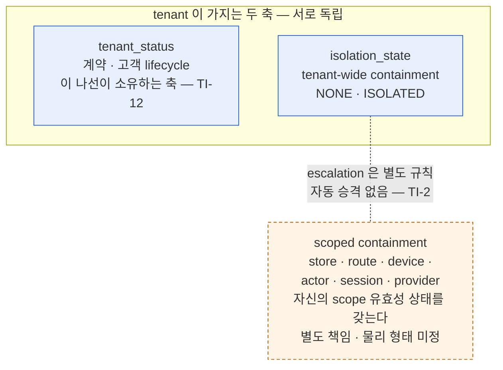
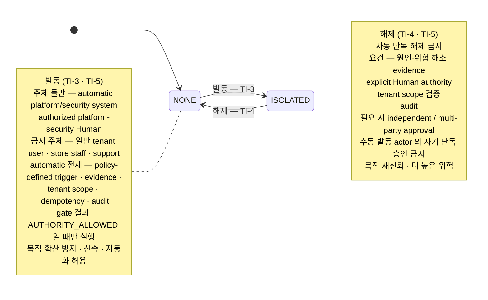
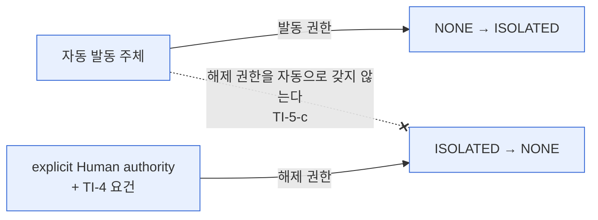
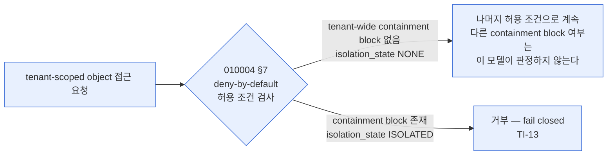
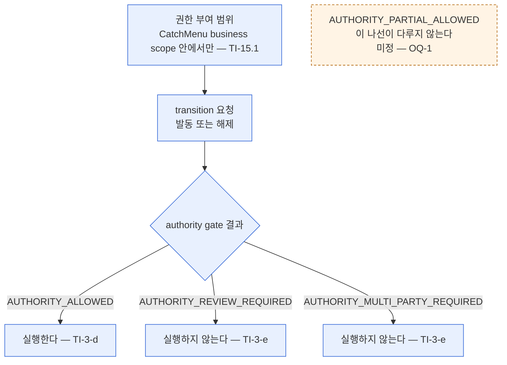
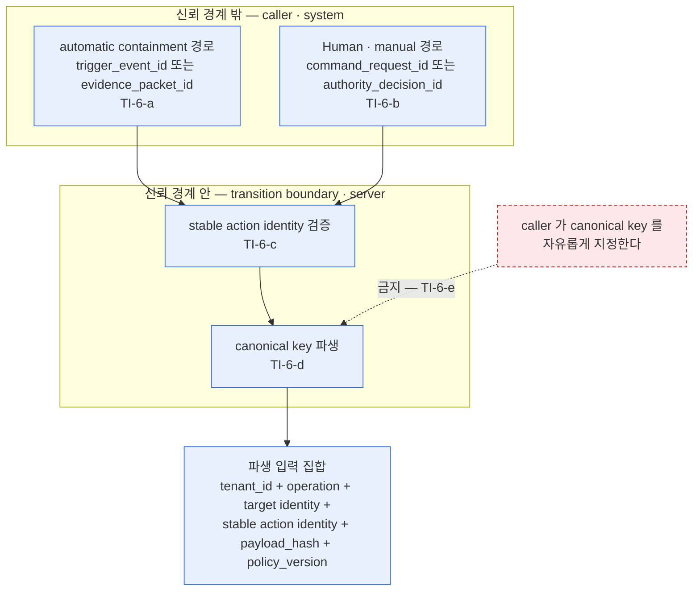
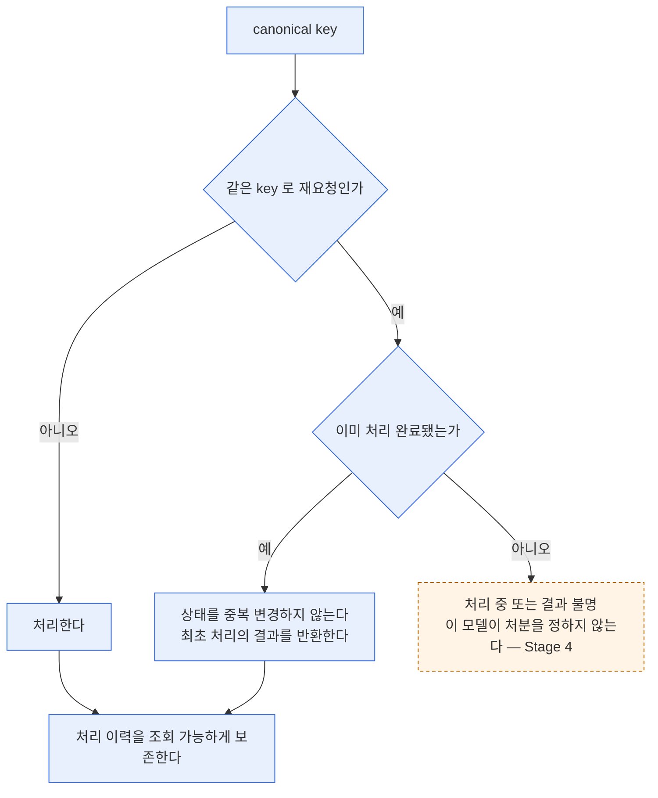
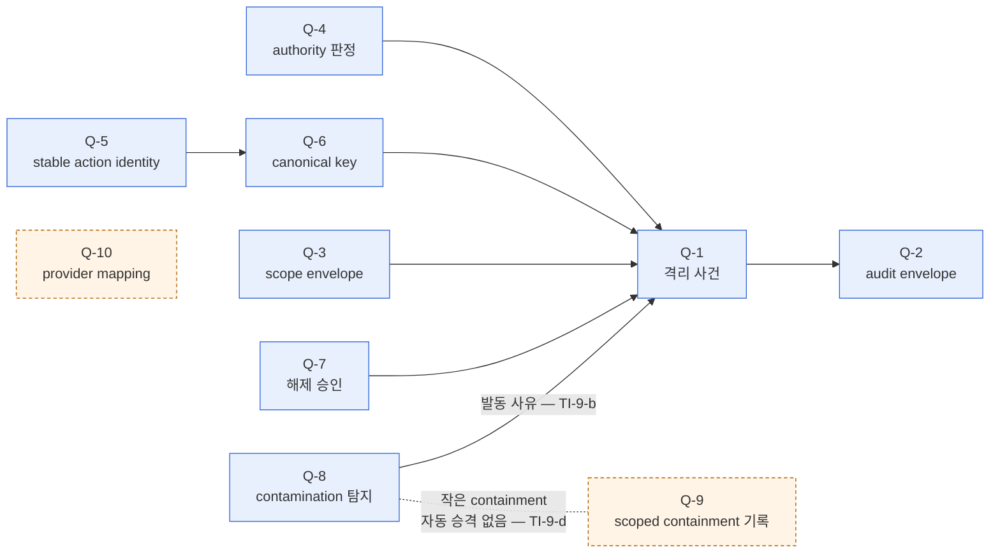

# 601905_Diagram_Tenant_Isolation_Axis_Model.md

Status: Draft
Lifecycle: Diagram
Last Updated: 2026-09-05

**개정 이력**

| 일자 | 내용 |
|---|---|
| 2026-09-04 | 초안 — `601902` `TI-1`~`TI-11` 을 상태 · 책임 모델로 옮겼다 |
| 2026-09-04 | `TI-12` 반영 — 초판이 `TI-11` 까지만 알고 작성됐다. `601702` §1.28 계층 상태 분리를 §1 에 추가하고 §8 추적표를 12건으로 갱신 |
| 2026-09-05 | 2단계 재동기화 — `TI-13` · `TI-14` · `TI-15` 를 반영하고 보강 5건(`TI-2` · `TI-3` · `TI-6` · `TI-10` · `TI-12`)을 옮겼다. §8 추적표 15건, §7.4 `OQ-1`~`OQ-4` 신설 |

## §0 성격과 범위

`000701` §47.1 의 **2단계 ERD 초안** 산출물이다.

**`601902` `TI-1`~`TI-15` 를 모델로 옮긴 것이며 구현 설계가 아니다.**

```text
관계 모델이 아니라 상태 · 책임 모델이다
이 나선의 중심이 tenant-wide isolation 과 scoped containment 의
책임 분리이기 때문이다
```

> ⚠️ **테이블 · 컬럼 · 제약명을 확정하지 않는다. Stage 4 소관이다.**
> ⚠️ **`601902` 에 없는 선언을 만들지 않는다.**
> ⚠️ **`601803`(옛 ERD)을 열지 않았다.** `600021` 이 `601800` 대역을 권위보류했고
> `601902` §0 이 그 설계 결론을 승계하지 않는다고 선언했다.

### §0.1 입력

```text
601902   TI-1 ~ TI-15 · HD-0-A-2R-1 ~ 13 · OQ-1 ~ OQ-4
601903   Cursor 조사 — 개념 축 · TI-N-x 정보 요소 · P-1 ~ P-13
601904   Codex 조사 — 실측 축 · C1 강제 가능성 · C5 간극표
601901   Stage 0 — 원천 8건 · 라이브 실측
```

### §0.2 두 조사의 수렴

```text
Cursor 「자산 없음」   TI-1 · TI-2 · TI-3 · TI-4 · TI-5 · TI-6 · TI-7 · TI-11
Codex  「강제 안 됨」  TI-3 · TI-4 · TI-5 · TI-6 · TI-8 · TI-9 · TI-10

수렴   TI-3 · TI-4 · TI-5 · TI-6
```

**이 넷이 모델의 중심이다.** §2 · §3 · §4 가 그 넷을 그린다.

### §0.3 표기 규약

```text
실선     601902 이 선언한 것
점선     미정 — P-N 또는 OQ-N 이 걸려 있다
Q-N      개념 수준 정보 요소. 물리 이름이 아니다
```

**물리 객체명은 `601904` §2 · §6 에 실측으로 남아 있다. 이 문서는 옮기지 않는다.**

> ⚠️ **이 모델에 없는 것 — 의도된 부재 3건**
>
> ```text
> 과금 · 구독 · 청구 요소   TI-14
>   격리와 과금이 독립 축이므로 과금 노드를 만들지 않는다
>   금지 간선을 그으려면 과금 노드를 먼저 만들어야 하고
>   그것 자체가 TI-14.3 이 부정한 결합이 된다
>
> 기능별 차단 목록          TI-13
>   010004 §7 이 deny-by-default 로 정했다
>   열거하면 열거되지 않은 것이 열린 채 남는다
>
> cross-business link 노드   TI-15
>   link 의 물리 표현이 별도로 유보됐다
>   노드를 만들면 이 모델의 요소가 된다
> ```
>
> **셋 다 「빠뜨린 것」이 아니라 「그리지 않는 것이 선언의 이행」이다.**
> **4단계는 §8 추적표와 함께 이 블록을 읽는다.**

## §1 두 축의 독립성

**`TI-2` 가 정한 책임 경계다.**



**읽는 법**

| 요소 | 출처 |
|---|---|
| 두 축이 서로 독립 | `TI-2` (`TI-2-a` · `TI-2-b`) |
| `isolation_state` 가 tenant 전체에만 적용 | `TI-2-b` |
| scoped containment 가 별도 representation | `TI-2-c` · `TI-2-d` |
| 자동 승격 없음 | `TI-2-e` · `HD-0-A-2R-2` |
| scoped containment 상자가 점선인 이유 | `TI-2-f` — 물리 표현 Stage 4 유보 (`P-4`) |
| scoped containment 가 자신의 scope 유효성 상태를 가짐 | `TI-2` 보강 · `010640` §6 |
| `tenant_status` 가 이 나선의 소유 축 | `TI-12` · `601909` `T3-5` |

> ⚠️ **escalate 화살표를 방향선으로 그리지 않았다.**
> **`TI-2` 가 「부분 containment 가 tenant-wide 로 자동 승격되지 않는다」고 선언했으므로
> 방향 있는 전이로 그리면 선언과 어긋난다.**
> **어느 오염 유형이 escalate 되는지는 `OQ-2` · `P-2` 로 열려 있다.**

> ⚠️ **`tenant_status` 값 집합을 그리지 않았다.**
> **`601902` 가 그 축의 값 집합을 선언하지 않았기 때문이며
> 이 나선이 그 축을 소유하지 않아서가 아니다** — `601909` `T3-5`.
>
> ```text
> 소유   이 나선이 그 축의 의미와 경계를 정한다 — TI-12
> 변경   tenant_status 변경 주체는 Subscription Lifecycle 이다
>        TI-14.1 이 isolation_state 변경의 자동 파급을 막았다
> ```

> ⚠️ **`TI-2` 보강 — scoped containment 의 scope 유효성 상태**
>
> **`010640` §6 이 `SCOPE_PARTIAL_VALID` 를 scope 상태로 요구한다.**
> **그 상태를 `isolation_state` 로 표현하지 않는다.**
> **scoped containment representation 이 자신의 scope 유효성 상태를 갖는다.**
>
> **값 집합과 물리 표현은 Stage 4 가 정한다.**
> **`010004` §7 의 「containment block」이 그것을 포함하는지는 §7 `OQ-4` 다.**

> ⚠️ **`TI-12` — 계층 상태 분리**
>
> ```text
> 601702 §1.28 이 여섯 축을 열거한다
>
>   TenantStatus
>     ≠ MerchantAccountStatus
>     ≠ StoreServiceStatus
>     ≠ StoreOperatingStatus
>     ≠ TrialStatus
>     ≠ IsolationState
> ```
>
> **이 모델이 소유하는 축은 둘이다.**
>
> ```text
> tenant_status
> isolation_state
> ```
>
> **나머지 4축은 이 모델의 요소가 아니다.**
> **두 소유 축에서 파생되지 않으며 이 나선이 변경하지 않는다.**
> **접근 판단에서 참조가 필요하면 명시적 precondition 으로만 쓴다.**
>
> ⚠️ **`TI-2` 는 containment scope 의 책임을 나눈다.**
> **`TI-12` 는 계층 상태 사이의 파생을 금지한다.**
> **둘은 다른 축이며 서로를 대체하지 않는다.**

## §2 isolation_state 전이

**`TI-3` · `TI-4` · `TI-5` 가 두 전이의 주체 · 전제 · 비대칭을 정한다.**



**비대칭 — `TI-5`**



**읽는 법**

| 요소 | 출처 |
|---|---|
| 상태값 `NONE` · `ISOLATED` | `TI-2-a` |
| 발동 주체 둘 · 금지 주체 | `TI-3-a` · `TI-3-b` |
| automatic 발동 전제 5건 | `TI-3-c` |
| `AUTHORITY_ALLOWED` 일 때만 실행 | `TI-3-d` |
| 해제 요건 5건 | `TI-4-a` ~ `TI-4-e` |
| 자기 단독 해제 금지 | `TI-4-f` · `HD-0-A-2R-3` |
| 자동 단독 해제 금지 | `TI-4-g` |
| 권한 비상속 | `TI-5-c` |

> ⚠️ **role ID · approver 수를 그리지 않았다.** `TI-4-h` 가 Stage 4 · `0-C` 로 유보했다 (`P-5`).

**`ISOLATED` 의 효과 — `TI-13`**

**전이의 절차가 아니라 전이한 상태가 무엇을 하는가다.**



**읽는 법**

| 요소 | 출처 |
|---|---|
| `ISOLATED` 가 containment block 이라는 것 | `TI-13` |
| containment block 이 있으면 접근이 거부된다는 것 | `TI-13` · `010004` §7 |
| 거부가 fail closed 라는 것 | `TI-13` · `010004` §7 |
| `NONE` 이 tenant-wide containment block 없음만 뜻한다는 것 | `TI-2` · `OQ-4` |

> ⚠️ **`NONE` 이 「containment block 전부 없음」을 뜻하지 않는다.**
>
> ```text
> TI-2 가 scoped containment 를 별도 책임으로 분리했다
> OQ-4 가 010004 §7 의 「containment block」이
> scoped 를 포함하는지를 열어두었다
> ```
>
> **`tenant NONE + scoped block` 조합을 이 모델이 배제하지 않는다.**
> **초판이 역방향까지 등치해 열린 질문을 확정했다** — `601910` `B-1`.

> ⚠️ **기능별 차단 목록을 그리지 않았다.**
> **`TI-13` 이 「기능을 열거하면 열거되지 않은 기능이 열린 채로 남는다」고 선언했다.**
> **원천이 deny-by-default 로 정했고 허용 조건에 「no containment block」을 넣었다.**

> ⚠️ **`OK` 노드 뒤를 그리지 않았다.**
> **나머지 허용 조건 — role · authority · policy permission · Safe Projection —
> 의 판정은 `TI-13` 이 `0-C` 와 별도로 넘긴 것이다.**

## §3 authority gate

**`TI-3` 이 gate 결과에 따른 실행 여부를 정한다.**



**읽는 법**

| gate 결과 | 모델의 처리 | 출처 |
|---|---|---|
| `AUTHORITY_ALLOWED` | 실행 | `TI-3-d` |
| `AUTHORITY_REVIEW_REQUIRED` | 실행하지 않음 | `TI-3-e` |
| `AUTHORITY_MULTI_PARTY_REQUIRED` | 실행하지 않음 | `TI-3-e` |
| `AUTHORITY_PARTIAL_ALLOWED` | **이 나선이 다루지 않음** | `TI-3` 보강 · `OQ-1` · `P-1` |
| 권한 부여 범위 | CatchMenu business scope 안 | `TI-15.1` |

**네 값은 `601901` 이 채록한 `010630` 의 canonical 상태값이다. 이 문서가 만든 이름이 아니다.**

> ⚠️ **`AUTHORITY_PARTIAL_ALLOWED` 노드에 간선을 그리지 않았다.**
> **`TI-3` 보강이 본문을 네 상태로 열되 partial 의 처분을 `OQ-1` 로 넘겼다.**
> **실행/미실행 어느 쪽으로 잇든 `601902` 에 없는 선언이 된다** — `601909` `T3-7`.

> ⚠️ **`TI-15.1` — 다른 business 의 admin 이라는 사실만으로
> CatchMenu tenant 를 격리 · 해제할 권한을 갖지 않는다.**
> **`000150` §22 · `000190` §17 — link 는 reference 이며 permission 이 아니다.**
> **role 모델과 물리 ACL 은 `0-C` 소관이다.**

## §4 idempotency key 파생

**`TI-6` 이 caller 와 server 의 책임 경계를 정한다.**



**읽는 법**

| 요소 | 출처 |
|---|---|
| stable action identity 입력 2경로 | `TI-6-a` · `TI-6-b` |
| 신뢰 경계 안 검증 | `TI-6-c` |
| 파생 입력 6항 | `TI-6-d` |
| caller 가 key 를 정하지 않음 | `TI-6-e` · `HD-0-A-2R-4` |

> ⚠️ **파라미터명 · 타입 · hash 알고리즘 · 기존 함수 유지 여부를 정하지 않았다.**
> **`TI-6-f` 가 Stage 4 로 유보했다 (`P-6` · `P-13`).**
> **위 6항은 `TI-6` 이 선언한 파생 입력의 개념 목록이며 컬럼 목록이 아니다.**

**파생 이후 — `TI-6` 보강**



**읽는 법**

| 요소 | 출처 |
|---|---|
| 재요청이 이미 처리된 것인지 판정 | `TI-6` 보강 |
| 처리됐다면 상태 중복 변경 없음 | `TI-6` 보강 |
| 처리됐다면 최초 처리 결과 반환 | `TI-6` 보강 |
| 처리 이력 보존 | `TI-6` 보강 |
| 처리 중 · 결과 불명 재요청의 처분 | **미정 — Stage 4** |

> ⚠️ **재요청 여부와 완료 여부는 다르다.**
>
> **`TI-6` 이 「이미 처리된 요청인지 판정한다」를 먼저 두고
> 「처리됐다면」에만 결과 반환을 요구한다.**
>
> **첫 요청이 처리 중이거나 transaction 결과가 불명인 재요청에는
> 반환할 최초 결과가 확정돼 있지 않다** — `601910` `B-2` ·
> `010660` §6 · §10.
>
> **처리 중 재요청의 처분은 Stage 4 가 정한다.**

> ⚠️ **초판이 key 를 파생하고 그 다음을 그리지 않았다** — `601909` `T3-8`.
> **`010660` §4 가 key 는 「one business action」을 식별해야 한다고 요구한다.**
> **식별만 하고 그 결과로 아무것도 하지 않으면 멱등성이 성립하지 않는다.**

> ⚠️ **보존 기간 · 저장 위치 · 반환 형식을 그리지 않았다.**
> **`TI-6` 보강이 Stage 4 로 유보했다.**

## §5 정보 요소 — 개념 수준

**`Q-N` 은 개념 식별자다. 테이블명 · 컬럼명이 아니다.**

| `Q-N` | 개념 | 담아야 할 것 (개념) | 출처 |
|---|---|---|---|
| Q-1 | 격리 사건 | 어느 tenant 가 언제 어느 방향으로 전이했는가 | `TI-4` · `TI-10-b` |
| Q-2 | audit envelope | tenant · store · actor · actor role · surface · device · target object id · type · action · previous scope · new scope · authority reference · policy reference · evidence reference · cross-scope attempt if any | `TI-8-f` · `TI-10-a` · `TI-10` 보강 |
| Q-3 | scope envelope | 해당 action 에 필요한 scope dimension 묶음 | `TI-8-a` · `TI-8-b` · `TI-8-f` |
| Q-4 | authority 판정 | gate 결과와 그 참조 | `TI-3-d` · `TI-3-e` |
| Q-5 | stable action identity | 요청을 식별하는 안정 값 | `TI-6-a` · `TI-6-b` |
| Q-6 | canonical idempotency key | server 가 파생한 값 | `TI-6-d` |
| Q-7 | 해제 승인 | 승인 주체와 발동 actor 의 비동일성 | `TI-4-e` · `TI-4-f` |
| Q-8 | contamination 탐지 | 오염 유형과 탐지 사실 | `TI-9-a` · `TI-9-b` |
| Q-9 | scoped containment 기록 | 어느 scope 를 어느 범위로 막았는가 | `TI-2-c` · `TI-9-c` |
| Q-10 | provider ↔ 내부 context mapping | provider merchant identifier 와 내부 고객 관계의 연결 | `TI-7-c` · `TI-7-d` |



> ⚠️ **`601904` 가 실측한 것은 「현재 강제되지 않는다」이다.**
> **이 절은 `TI-N` 이 요구하는 개념을 나열한 것이며
> 「무엇을 만들어야 한다」로 읽지 않는다.**
> **개념을 어느 자산에 담을지, 기존 자산을 확장할지 병행할지는 Stage 4 가 정한다
> (`TI-8-h` · `TI-10-e` · `P-8` · `P-9`).**

> ⚠️ **`Q-9` · `Q-10` 이 점선인 이유** — `Q-9` 는 scoped containment 물리 표현이
> Stage 4 유보(`TI-2-f` · `P-4`)이고, `Q-10` 은 mapping 물리 구조가
> Stage 4 유보(`TI-7-e` · `P-7`)다. 다른 요소와의 연결선을 그리지 않았다.

> ⚠️ **`TI-14` 를 정보 요소로 그리지 않았다.**
>
> ```text
> TI-14.1 · TI-14.2   isolation_state 변경은 그 자체로
>                     상업적 결과를 발생시키지 않는다
> TI-14.3             billing lifecycle 과 독립된 상태축으로 유지한다
> ```
>
> **과금 요소가 이 모델에 하나도 없다는 것이 `TI-14` 의 표현이다.**
> **`TI-14.4` 는 격리 사실을 미래 과금 판단의 evidence 로 쓰는 것을 열어두었다.**
> **그 소비자는 Billing Review · Subscription Lifecycle 이며 이 모델 밖이다.**

> ⚠️ **`TI-15` 도 정보 요소를 새로 만들지 않는다.**
> **`TI-15.2` 가 「link 는 reference 이며 permission 이 아니다」라고 선언했으므로
> cross-business link 를 `Q-4`(authority 판정)의 입력으로 그리지 않았다.**
> **`TI-15.4` 의 link data flow 차단은 `TI-13` 의 deny-by-default 적용이며
> §2 `ISOLATED` 의 효과가 그것을 담는다.**

## §6 현재 상태 대 모델

**`601904` §6 C5 실측을 옮긴다. 차이를 기록하되 처분하지 않는다.**

| `TI-N` | 모델이 요구 | 현재 강제 |
|---|---|---|
| `TI-1` | 원천 정책 3건을 직접 구속으로 채택 | 측정 불가 — 정책 채택 지위는 DB schema 속성이 아니다 |
| `TI-2` | tenant-wide 2값과 scoped containment 책임 분리 | 2값 CHECK 만 강제. 별도 scoped containment · escalation 강제 객체 0건 |
| `TI-3` | 발동 주체 두 class 와 `AUTHORITY_ALLOWED` | 강제되지 않음. authority-state 검사 0건 |
| `TI-4` | 자동 단독 해제 · 동일 발동자 단독 승인 금지 | 강제되지 않음. actor 분리 · evidence · 다자 승인 검사 0건 |
| `TI-5` | 발동 · 해제 권한 비대칭 | 강제되지 않음. 단일 boolean 분기와 단일 ACL |
| `TI-6` | stable action identity 기반 server key 파생 | 강제되지 않음. isolation transition 의 idempotency 참조 0건 |
| `TI-7` | 두 merchant identity domain 분리와 mapping | 별도 컬럼 · 타입만 존재. 두 identity 사이 mapping 제약 0건 |
| `TI-8` | action 별 scope envelope 와 누락 시 mutation 금지 | 일부 자산의 RLS · FK 만 존재. transition 전반의 authority/policy/evidence scope 검사 0건 |
| `TI-9` | contamination 발동 사유와 scope 별 escalation | threat type 값만 존재. threat 와 isolation transition 연결 · escalation 검사 0건 |
| `TI-10` | 격리 audit context 전건 | 일부 명명 항목과 자유형 JSON. 누락 명명 항목 및 key CHECK 0건 |
| `TI-11` | Stage 7 전 `010004` §24 11항 선언 | 측정 불가 — 승인 문서 선언은 DB schema 측정 대상이 아니다 |
| `TI-12` | 계층 상태 분리 — 여섯 축 사이 파생 금지 | 강제되지 않음. 축 사이 파생 금지를 검사하는 객체 0건. `601901` 이 상위 상태를 하위 상태 대신 쓰는 실물 경로를 실측으로 기록했다 |
| `TI-13` | `ISOLATED` 가 containment block 이며 접근이 fail closed 로 거부됨 | 강제되지 않음. `isolation_state` 를 참조하는 함수 · 뷰 · 트리거 0건. `tenants` 에 `chk_tenants_isolation_state` CHECK 1건 존재 — `601901` §17.1. 다른 테이블의 관련 제약 0건 — `601901` §17.2. 접근 차단을 강제하는 것은 없다 |
| `TI-14` | 격리 변경이 상업적 결과를 자동 발생시키지 않음 | 측정 불가 — 과금 · 구독 모델이 문서로 존재하지 않는다. 격리와 과금을 잇는 객체도 0건이므로 현재 위반은 관측되지 않는다 |
| `TI-15` | 격리 권한이 business scope 를 넘지 않고 link 가 permission 이 아님 | 강제되지 않음. business scope 별 권한 분리를 검사하는 객체 0건. cross-business link 의 격리 연동 객체도 0건 |

**출처** — `601904` §2 C1 · §6 C5. **물리 객체명은 그 문서에 있고 이 표는 옮기지 않는다.**

> ⚠️ **CHECK 는 값 집합을 제한하며 접근을 차단하지 않는다.**
> **초판이 「제약 0건」으로 적어 실측 범위를 바꿨다** — `601910` `B-3`.

> ⚠️ **이 표는 관측이다. 간극을 채우는 방법을 적지 않는다.**
> **`601904` 도 「간극을 채우는 방법은 기록하지 않았다」고 명시했다.**

**수렴 표시** — `601903` 「자산 없음」과 `601904` 「강제 안 됨」이 함께 가리키는 것.

```text
TI-3 · TI-4 · TI-5 · TI-6
```

## §7 미정 항목

### §7.1 `601903` 선결 항목 — 미정으로 유지

**추정으로 채우지 않았다.**

| # | 원 질문 | 이 문서에서의 처리 |
|---|---|---|
| P-1 | `AUTHORITY_PARTIAL_ALLOWED` 가 scoped containment 를 허용하는가 (`OQ-1`) | §3 에서 점선 · 「미정」 노드로 표기. 실행/비실행 어느 쪽으로도 그리지 않았다 |
| P-2 | `010004` §20 어느 오염 유형이 tenant-wide escalate 인가 (`OQ-2`) | §1 · §5 에서 escalate 를 방향 화살표로 그리지 않았다. 점선 연결선만 두었다 |
| P-3 | `010650` §38 anti-pattern 중 이 나선 강제 범위 (`OQ-3`) | §2 는 `TI-4-f` 가 명시한 자기 단독 해제 금지만 그렸다. 나머지 anti-pattern 을 모델에 넣지 않았다 |

### §7.2 `P-4` ~ `P-13` — Stage 4 소관

**ERD 를 막지 않았다. 각 항목이 걸린 지점만 표시했다.**

| # | 걸린 지점 |
|---|---|
| P-4 | §1 scoped containment 상자 · §5 `Q-9` — 점선 |
| P-5 | §2 발동 · 해제 주체를 class 로만 그렸다. role 노드 없음 |
| P-6 · P-13 | §4 파생 입력을 개념 목록으로만 두었다 |
| P-7 | §5 `Q-10` — 연결선 없이 점선 노드 |
| P-8 | §5 `Q-2` · `Q-3` 을 개념으로만 두었다. 담을 자산을 지정하지 않았다 |
| P-9 | §5 `Q-1` · `Q-2` 를 분리해 두되 병합/분리 여부를 정하지 않았다 |
| P-10 | §8 추적표에 `TI-11` 을 게이트 항목으로만 기록했다 |
| P-11 | §3 gate 를 판정 결과로만 그렸다. 판정 주체 swimlane 을 두지 않았다 |
| P-12 | §1 scoped containment 를 단일 점선 상자로 두었다. 단위별 분해를 하지 않았다 |

### §7.3 이 문서가 새로 발견한 미정 — `D-N`

| # | 내용 | 근거 |
|---|---|---|
| D-1 | `TI-1` · `TI-11` 은 모델에 그릴 요소가 없다. 둘 다 `601904` 가 「측정 불가」로 판정한 문서 · 게이트 층위다. 이 둘을 2단계 산출물의 어디에 남길지 정해지지 않았다 | `601904` §2 C1 · §8 추적표 |
| D-2 | `Q-1`(격리 사건)과 `Q-2`(audit envelope)가 하나의 개념인지 둘인지 `601902` 가 정하지 않았다. `TI-10-e` 가 확장/병행을 Stage 4 로 유보했으므로 이 단계에서도 갈리지 않는다 | `TI-10-b` · `TI-10-e` · `P-9` |
| D-3 | scoped containment(`Q-9`)가 이 나선의 범위 안인지 밖인지 `601902` 가 명시하지 않았다. `TI-2` 는 「별도 책임」이라고만 했고 그 책임의 소재 나선을 지목하지 않았다 | `TI-2-d` · `TI-2-f` |
| D-4 | `Q-4`(authority 판정)를 이 나선이 소유하는지, `0-C` 가 소유하고 이 나선은 결과만 소비하는지 정해지지 않았다 → 2026-09-04 `TI-12` 가 부분적으로 답했다. 나머지 4축은 이 나선의 직접 변경 대상이 아니며 명시적 precondition 으로만 참조한다. 「authority 판정을 이 나선이 소유하는가」는 여전히 열려 있다 → 2026-09-05 `TI-15.1` 이 권한의 **부여 범위**를 CatchMenu business scope 안으로 좁혔다. 판정의 **소유 주체**는 여전히 열려 있다 | `TI-3-d` · `TI-4-h` · `TI-12` · `TI-15.1` |

> ⚠️ **`D-1` ~ `D-4` 는 관측이며 판정이 아니다.**
> **`601902` 에 없는 선언을 만들지 않았다.**

### §7.4 `601902` §6 열린 질문 — 모델에서의 처리

| # | 원 질문 | 이 문서에서의 처리 |
|---|---|---|
| OQ-1 | `AUTHORITY_PARTIAL_ALLOWED` 가 scoped containment 를 허용하는가 | §3 에서 간선 없는 점선 노드로 두었다. `P-1` 과 같은 질문이다 |
| OQ-2 | `010004` §20 의 어느 오염 유형이 tenant-wide 로 escalate 되는가 | §1 · §5 에서 escalate 를 방향 화살표로 그리지 않았다. `P-2` 와 같은 질문이다 |
| OQ-3 | `010650` §38 anti-pattern 중 이 나선이 강제할 범위 | §2 는 자기 단독 해제 금지만 그렸다. `P-3` 과 같은 질문이다 |
| OQ-4 | `010004` §7 의 「containment block」이 tenant-wide 만 뜻하는가 scoped containment 도 포함하는가 | §2 는 `isolation_state` 만 containment block 으로 그렸다. scoped containment 를 그 조건에 넣지 않았고, 넣지 않는다고 선언하지도 않았다. §1 `TI-2` 보강 ⚠️ 와 짝이다 |

## §8 `TI-N` 추적표

| `TI-N` | 모델의 어디에 나타나는가 |
|---|---|
| `TI-1` | **모델에 나타나지 않는다.** 정책 채택 지위는 상태 · 책임 모델의 요소가 아니다. `601904` C1 이 「측정 불가 — DB schema 속성이 아니다」로 판정했다. §6 표와 §7.3 `D-1` 에 기록했다 |
| `TI-2` | §1 전체 — 두 축의 독립, scoped containment 분리, 자동 승격 없음. §5 `Q-9` |
| `TI-3` | §2 발동 전이와 그 note, §3 gate 전체. §5 `Q-4` |
| `TI-4` | §2 해제 전이와 그 note. §5 `Q-1` · `Q-7` |
| `TI-5` | §2 비대칭 다이어그램 |
| `TI-6` | §4 전체. §5 `Q-5` · `Q-6` |
| `TI-7` | §5 `Q-10` — 점선 노드. 물리 구조가 `TI-7-e` 로 유보돼 연결선을 그리지 않았다 |
| `TI-8` | §5 `Q-2` · `Q-3` |
| `TI-9` | §5 `Q-8` 및 `Q-1` 로의 발동 사유 화살표, `Q-9` 로의 점선 |
| `TI-10` | §5 `Q-1` · `Q-2` |
| `TI-11` | **모델에 나타나지 않는다.** §24 11항 선언은 Stage 4 산출물 이후 Stage 7 승인 문서가 기록하는 게이트이며 상태 · 책임 모델의 요소가 아니다. `601904` C1 이 「측정 불가」로 판정했다. §6 표와 §7.2 `P-10` · §7.3 `D-1` 에 기록했다 |
| `TI-12` | §1 Mermaid `tenant_status` 소유 라벨 · §1 ⚠️ 계층 상태 분리 · §1 ⚠️ 소유/변경 구분 · §6 |
| `TI-13` | §2 「`ISOLATED` 의 효과」 다이어그램과 읽는 법 · §6 |
| `TI-14` | **다이어그램 요소로 나타나지 않는다.** 과금 요소가 이 모델에 하나도 없다는 것이 `TI-14` 의 표현이다. §5 ⚠️ 가 그 부재를 명시하고 §6 이 실측을 기록했다 |
| `TI-15` | §3 `SCOPE` 노드와 ⚠️(`TI-15.1`) · §5 ⚠️(`TI-15.2` · `TI-15.4`) · §6 |

**15건 전건 기록. 미표현 3건(`TI-1` · `TI-11` · `TI-14`)은 사유를 적었다.**

> ⚠️ **`TI-14` 의 미표현은 `TI-1` · `TI-11` 과 성격이 다르다.**
> **`TI-1` · `TI-11` 은 층위가 달라 그릴 것이 없고,
> `TI-14` 는 그리지 않는 것 자체가 선언의 이행이다** — 격리와 과금의 분리.

## §9 근거 문서 목록 (`000701` §46)

| 문서 | 인용 | 지위 |
|---|---|---|
| `601902_Register_Stage1_Business_Rules.md` | `TI-1`~`TI-15` · `HD-0-A-2R-1`~`13` · `OQ-1`~`OQ-4` — 모델의 유일한 선언 출처 | ACTIVE |
| `601903_Evidence_Stage2_ERD_Survey_Cursor.md` | §2 `TI-N-x` 정보 요소 · §6 `P-1`~`P-13` | ACTIVE |
| `601904_Evidence_Stage2_ERD_Survey_Codex.md` | §2 C1 · §6 C5 — §6 표의 출처 | ACTIVE |
| `601901_Register_Stage0_Evidence_Collection.md` | `010630` authority 상태값 채록 · `010004` §7 채록 · Pass 2 실측 | ACTIVE |
| `601909_Report_Stage3_Integration.md` | `T3-1`~`T3-8` · `N-1`~`N-7` — 이 재동기화의 근거 | ACTIVE |
| `010004` | §7 deny-by-default — `TI-13` 원천. §19 — `TI-10` 원천 | ACTIVE — mandatory |
| `000150` · `000190` | cross-business boundary — `TI-15` 원천 | ACTIVE — mandatory |
| `010640` | §6 `SCOPE_PARTIAL_VALID` — `TI-2` 보강 원천 | ACTIVE — mandatory |
| `010660` | §4 one business action — `TI-6` 보강 원천 | ACTIVE — `TI-1` 채택 |
| `601702_Register_Stage1_Business_Rules.md` | §1.27 · §1.28 — `TI-12` 근거 | ACTIVE |
| `601900_Readme_Tenant_Isolation_Axis_V2.md` | §3 착수 순서 · §4 구속 | ACTIVE |
| `600021_Governance_Tenant_Isolation_Axis_Authority_Reset.md` | §2 — `601800` 을 답안지로 쓰지 않는다 | ACTIVE |
| `601803` · `601809`~`601812` | 열지 않았다 | ⛔ **AUTHORITY SUSPENDED** |
| `000701_Guide_Controlled_AI_Development_Pipeline.md` | §46 · §47.1 | ACTIVE |
