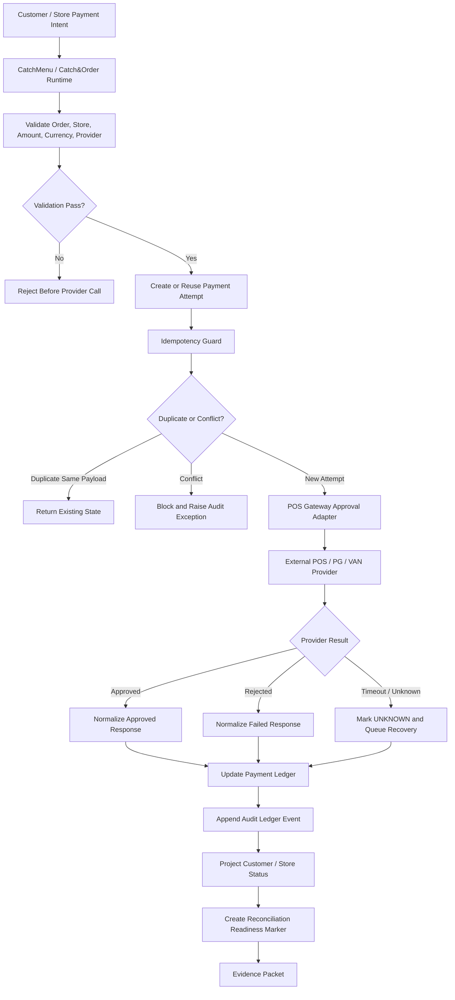
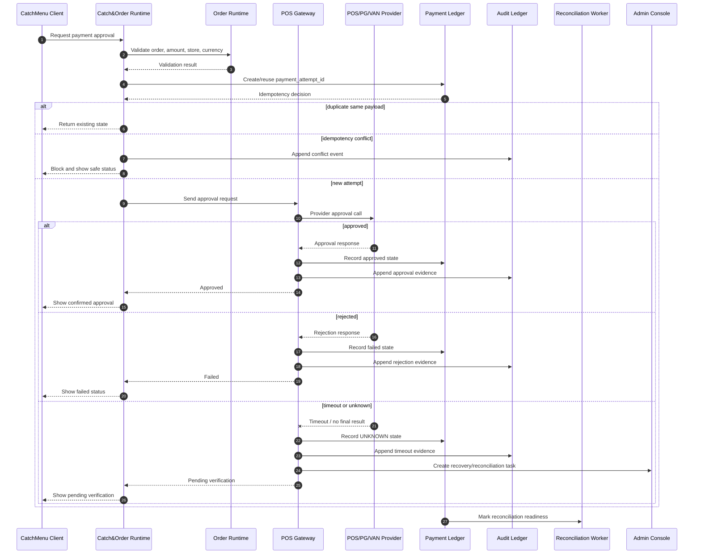

# 000910_Spec_Overview_POS_Gateway_Approval_Main_Flow.md

## 1. Document Control

| Field | Value |
|---|---|
| Project | yoonsul_wait_order_handoff / CatchMenu-Catch&Order |
| Band | 00100_project_foundation |
| Document Type | Spec |
| Document Layer | Overview |
| Document Role | POS Gateway Approval Main Flow Overview |
| Related Policy | 000640_Policy_Development_Foundation_Overview_Logic_Module_Documentation_Model.md |
| Related Overview Template | 000660_Template_Development_Foundation_Overview_Document.md |
| Related Traceability Matrix | 000690_Matrix_Development_Foundation_Overview_Logic_Module_Traceability.md |
| Related Runtime Flow Bundle | 064100_Flow_POS_Gateway_Approval_To_Audit_Ledger_And_Reconciliation.md |
| Related Flow Registry | 064000_Index_Runtime_Flow_Bundle_Registry.md |
| Next Logic Document | 000920_Spec_Logic_POS_Gateway_Approval_State_Transition_And_Exception_Rule.md |
| Next Module Document | 000930_Spec_Module_POS_Gateway_Approval_API_Data_Model_And_Test_Map.md |
| Status | Draft |
| Owner | Product / Architecture / Engineering / QA / Compliance |
| AI Solo Change | Documentation drafting allowed; runtime implementation approval prohibited |

---

## 2. Purpose

This overview document defines the high-level POS Gateway approval flow for CatchMenu / Catch&Order.

It describes the full runtime path from customer payment intent to provider approval, internal payment state, audit ledger recording, reconciliation readiness, customer/store status projection, and evidence capture.

This document is the `Overview` layer of the development foundation chain:

```text
Overview → Logic → Module → File → Test → Evidence
```

It must be followed by a Logic document and a Module document before implementation is assigned to Claude Code, Cursor, or a developer.

---

## 3. Scope

### 3.1 Included

- Customer or store-triggered payment approval request.
- Catch&Order runtime validation.
- POS Gateway approval orchestration.
- External POS/PG/VAN provider approval request.
- Provider response normalization.
- Idempotency boundary.
- Unknown/timeout state boundary.
- Internal payment ledger update.
- Audit ledger append.
- Customer/store visible status projection.
- Reconciliation readiness marker.
- Evidence packet requirement.

### 3.2 Excluded

- Cancel/refund/reversal flow.
- Settlement dispute handling.
- Offline local ledger resync.
- Webhook-only inbound recovery.
- Provider onboarding.
- DB migration implementation.
- Secret/credential rotation.
- Production deployment.

Excluded flows must be handled by their own Flow Bundle and Overview/Logic/Module documents.

---

## 4. Business Intent

The payment approval flow must ensure that a customer/order payment is never treated as finally approved unless the external provider result is verified and the internal audit trail is recorded.

The system must protect against:

- duplicate approval
- double charge
- unknown external provider state
- payment status mismatch
- audit gap
- customer-visible false success
- store-visible false completion
- provider response replay
- reconciliation mismatch

The business goal is not merely to call a payment API.  
The goal is to create a verifiable, idempotent, auditable approval path from order to ledger to evidence.

---

## 5. Primary Actors And Systems

| Actor / System | Role |
|---|---|
| Customer | Initiates or confirms payment through CatchMenu or store-facing payment surface |
| Store Staff | Observes store-side approval state and handles exception guidance |
| CatchMenu Client | Customer-facing order/payment UI |
| Catch&Order Runtime | SaaS runtime orchestration layer |
| Order Runtime | Holds order and amount state |
| POS Gateway | Integration boundary to POS/PG/VAN providers |
| POS/PG/VAN Provider | External approval system |
| Payment Ledger | Internal payment attempt and state ledger |
| Audit Ledger | Immutable/tamper-evident evidence trail |
| Reconciliation Worker | Later verifies provider settlement and internal ledger consistency |
| Admin Console | Exception, recovery, and human approval surface |
| AI Customer Center | May answer from SOP/evidence but must not invent final payment state |

---

## 6. High-Level Flow

```text
1. Customer or store initiates payment approval.
2. Catch&Order runtime validates order, store, amount, currency, provider, and idempotency key.
3. Runtime creates or reuses an idempotent payment attempt.
4. POS Gateway sends approval request to POS/PG/VAN provider.
5. Provider returns approval, rejection, timeout, or ambiguous result.
6. POS Gateway normalizes the provider response.
7. Payment ledger records the verified or pending/unknown state.
8. Audit ledger appends material state transition evidence.
9. Customer/store status projection is updated only according to verified state.
10. Reconciliation readiness marker is created for later settlement verification.
11. Evidence packet records request, response, decision, audit, and test traces.
```

---

## 7. Runtime Flow Diagram



---

## 8. Runtime Sequence Diagram



---

## 9. State Overview

This document does not define full state rules.  
The detailed state rules must be defined in:

```text
000920_Spec_Logic_POS_Gateway_Approval_State_Transition_And_Exception_Rule.md
```

High-level states:

| State | Meaning |
|---|---|
| INITIATED | Payment approval flow started |
| VALIDATED | Order/payment/provider pre-check passed |
| IDEMPOTENCY_CHECKED | Duplicate/conflict condition evaluated |
| PROVIDER_PENDING | External provider call is in progress |
| APPROVED | Provider approval is verified |
| FAILED | Provider rejection or validation failure is final |
| UNKNOWN | External provider state is not verified |
| AUDIT_RECORDED | Material state transition was appended to audit ledger |
| RECON_READY | Approval result is ready for later reconciliation |
| CLOSED | Flow has reached a terminal or review-closed state |

---

## 10. Major Control Points

| Control Point | Purpose |
|---|---|
| Order amount lock | Prevent amount change after approval request starts |
| Idempotency key | Prevent duplicate approval/double charge |
| Provider contract validation | Prevent malformed request/response handling |
| Timeout-to-UNKNOWN rule | Prevent false failure or false success |
| Audit append | Preserve immutable evidence |
| Status projection guard | Prevent customer/store false final status |
| Reconciliation readiness | Ensure later settlement match |
| Restricted file gate | Prevent AI solo modification of payment/audit/security code |

---

## 11. No-AI-Solo Zone

This flow touches restricted areas.

| Area | AI Solo Allowed? | Human Approval Required? |
|---|---:|---:|
| Payment approval runtime | No | Yes |
| Provider adapter behavior | No | Yes |
| Idempotency guard for money movement | No | Yes |
| Audit ledger append behavior | No | Yes |
| Webhook/security fallback if involved | No | Yes |
| DB migration/schema changes | No | Yes |
| Secret/credential handling | No | Yes |
| Production release/deployment | No | Yes |

Claude Code may assist only after Flow Bundle handoff is complete and human approval is recorded where required.  
Cursor may assist only with narrow file-level tasks after scope is mapped.

---

## 12. Related Flow Bundle Documents

| Document | Relationship |
|---|---|
| 064000_Index_Runtime_Flow_Bundle_Registry.md | Registry for Runtime Flow Bundle family |
| 064100_Flow_POS_Gateway_Approval_To_Audit_Ledger_And_Reconciliation.md | Parent Runtime Flow Bundle |
| 064200_Matrix_Flow_To_MD_Dependency_Graph.md | MD dependency graph |
| 064210_Matrix_Flow_To_Module_Implementation_Map.md | Module impact map |
| 064220_Matrix_Flow_To_Test_Coverage_Map.md | Test coverage map |
| 064300_Checklist_Flow_Bundle_Code_Handoff_Readiness_Gate.md | Code handoff gate |
| 064370_Governance_Flow_Bundle_Human_Approval_And_No_AI_Solo_Zone_Control.md | Restricted zone governance |
| 064390_Checklist_Flow_Bundle_Pre_Merge_And_Release_Gate.md | Pre-merge/release gate |

---

## 13. Related Development Foundation Documents

| Document | Relationship |
|---|---|
| 000640_Policy_Development_Foundation_Overview_Logic_Module_Documentation_Model.md | Defines Overview/Logic/Module model |
| 000690_Matrix_Development_Foundation_Overview_Logic_Module_Traceability.md | Traceability matrix |
| 000700_Checklist_Development_Foundation_Code_Handoff_Readiness.md | Handoff readiness |
| 000750_Register_Development_Foundation_Restricted_File_And_Zone_Control.md | Restricted file/zone control |
| 000820_Matrix_Development_Foundation_Source_Tree_To_Module_Document_Map.md | Source-to-module mapping |
| 000830_Register_Development_Foundation_Repository_Module_Owner_Map.md | Module ownership |
| 000850_Checklist_Development_Foundation_First_Runtime_Code_Change_Gate.md | First runtime change gate |
| 000880_Evidence_Development_Foundation_First_Runtime_Change_Review_Packet.md | First runtime change evidence |

---

## 14. Required Downstream Documents

This overview is incomplete as an implementation package until the following exist:

| Required Document | Purpose |
|---|---|
| 000920_Spec_Logic_POS_Gateway_Approval_State_Transition_And_Exception_Rule.md | Defines states, events, decisions, exceptions, retry, audit, and security rules |
| 000930_Spec_Module_POS_Gateway_Approval_API_Data_Model_And_Test_Map.md | Maps logic to modules, source files, APIs, DB, queues, tests, and evidence |
| Actual hydration evidence | Provides real file paths |
| Updated source tree matrix | Maps real files to module document |
| Updated restricted register | Registers real restricted files |
| Test coverage evidence | Proves approval flow behavior |

---

## 15. Implementation Readiness Status

| Readiness Item | Status |
|---|---|
| Overview defined | Draft |
| Logic defined | Pending 00920 |
| Module mapped | Pending 00930 and hydration |
| Source files known | Pending hydration |
| Tests known | Pending hydration/test map |
| Evidence target known | Pending implementation ticket |
| Restricted approval ready | Pending human approval |
| Ready for code handoff | No |

---

## 16. Open Questions

| Question | Owner | Blocking? |
|---|---|---:|
| Which provider adapter is first target: Toss, PAYCO, generic POS, or mock provider? | Product / Architecture | Yes |
| Does first approval implementation include real PG/VAN call or simulated contract adapter? | Architecture / Engineering | Yes |
| Where will payment_attempt_id and idempotency key be stored? | Engineering | Yes |
| Which audit ledger implementation is canonical? | Architecture / Compliance | Yes |
| What is the first safe test environment? | Engineering / QA | Yes |
| Which files are actual restricted files after hydration? | Engineering / Security | Yes |

---

## 17. Summary

This Overview document defines the high-level POS Gateway approval path.

It must not be used alone as an implementation instruction.

Implementation may proceed only after the chain is complete:

```text
Overview → Logic → Module → File → Test → Evidence
```

and the parent Runtime Flow Bundle gate confirms:

```text
Flow Step → Module → File → Test → Evidence
```
