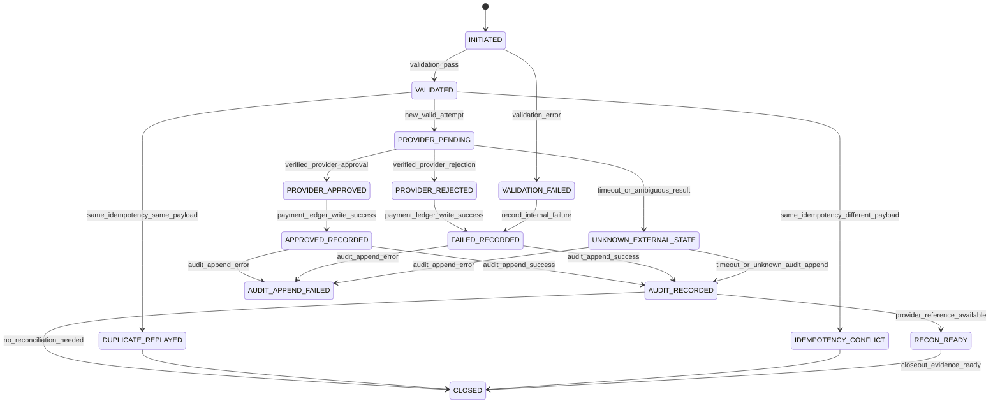

# 000920_Spec_Logic_POS_Gateway_Approval_State_Transition_And_Exception_Rule.md

## 1. Document Control

| Field | Value |
|---|---|
| Project | yoonsul_wait_order_handoff / CatchMenu-Catch&Order |
| Band | 00100_project_foundation |
| Document Type | Spec |
| Document Layer | Logic |
| Document Role | POS Gateway Approval State Transition And Exception Rule |
| Parent Overview | 000910_Spec_Overview_POS_Gateway_Approval_Main_Flow.md |
| Related Logic Template | 000670_Template_Development_Foundation_Logic_Document.md |
| Related Traceability Matrix | 000690_Matrix_Development_Foundation_Overview_Logic_Module_Traceability.md |
| Related Runtime Flow Bundle | 064100_Flow_POS_Gateway_Approval_To_Audit_Ledger_And_Reconciliation.md |
| Related Flow Registry | 064000_Index_Runtime_Flow_Bundle_Registry.md |
| Next Module Document | 000930_Spec_Module_POS_Gateway_Approval_API_Data_Model_And_Test_Map.md |
| Status | Draft |
| Owner | Product / Architecture / Engineering / QA / Compliance |
| AI Solo Change | Documentation drafting allowed; runtime implementation approval prohibited |

---

## 2. Purpose

This Logic document defines the state transition, decision, exception, retry, audit, and evidence rules for the POS Gateway approval flow.

It is the second layer in the development foundation chain:

```text
Overview → Logic → Module → File → Test → Evidence
```

This document must be approved before any runtime code change is assigned to Claude Code, Cursor, or a human developer.

---

## 3. Scope

### 3.1 Included

- Approval request validation.
- Payment attempt creation and idempotency.
- Provider approval request decision.
- Provider response classification.
- Approved, failed, duplicate, conflict, timeout, and unknown-state handling.
- Payment ledger state transition rules.
- Audit ledger append requirements.
- Customer/store/admin status projection rules.
- Reconciliation readiness rules.
- Test and evidence requirements.

### 3.2 Excluded

- Cancel/refund/reversal logic.
- Settlement dispute resolution.
- Offline local ledger resync.
- Webhook-only inbound recovery.
- Secret rotation.
- DB migration execution.
- Production deployment.

---

## 4. Business Logic Intent

The approval logic must guarantee that the system never creates or displays a final successful payment state unless the provider result is verified and the audit evidence is recorded.

The system must also guarantee that retries, timeouts, duplicate requests, replayed provider events, and mismatched responses do not create duplicate money movement.

Core intent:

```text
One customer payment intent must converge to one verified final payment outcome.
Unverified provider state must remain UNKNOWN, not SUCCESS.
Every material state transition must produce audit evidence.
```

---

## 5. No-AI-Solo Zone Classification

This logic touches restricted financial and audit areas.

| Area | AI Solo Allowed? | Human Approval Required? | Reason |
|---|---:|---:|---|
| Payment approval state transition | No | Yes | Money movement and customer-visible status |
| Idempotency guard | No | Yes | Duplicate charge prevention |
| Provider adapter behavior | No | Yes | External POS/PG/VAN contract |
| Audit ledger append | No | Yes | Financial-grade evidence |
| Reconciliation readiness | No | Yes | Settlement consistency |
| Security/webhook fallback if involved | No | Yes | Replay/signature risk |
| DB schema/migration | No | Yes | Data integrity risk |
| Secret/credential handling | No | Yes | Credential compromise risk |
| Deployment/release | No | Yes | Runtime availability risk |

---

## 6. Actors And Systems

| Actor/System | Responsibility In This Logic |
|---|---|
| Customer | Initiates or confirms payment |
| Store Staff | Observes store-safe payment status |
| CatchMenu Client | Sends payment intent and shows safe status |
| Catch&Order Runtime | Validates order and orchestrates payment attempt |
| Order Runtime | Provides locked order amount and order state |
| POS Gateway | Executes provider approval boundary |
| POS/PG/VAN Provider | Returns approval/rejection/timeout/unknown external result |
| Payment Ledger | Records internal payment attempt state |
| Audit Ledger | Records immutable evidence of material transitions |
| Reconciliation Worker | Later compares provider/settlement records |
| Admin Console | Handles unknown, conflict, mismatch, and recovery tasks |

---

## 7. State Model

### 7.1 Primary States

| State | Meaning | Entry Condition | Exit Condition | Terminal? |
|---|---|---|---|---:|
| INITIATED | Payment approval flow started | Customer/store/runtime request received | Validation starts | No |
| VALIDATION_FAILED | Request failed pre-provider validation | Order/store/amount/provider/idempotency invalid | Audit/log closeout | Yes |
| VALIDATED | Request passed validation | Required checks passed | Idempotency check starts | No |
| DUPLICATE_REPLAYED | Same request already processed | Same idempotency key and same payload | Existing state returned | Conditional |
| IDEMPOTENCY_CONFLICT | Same idempotency key with different payload | Conflict detected | Audit exception and block | Yes |
| PROVIDER_PENDING | Provider approval request sent | New valid payment attempt | Provider response, timeout, or unknown | No |
| PROVIDER_APPROVED | Provider returned verified approval | Valid approval response | Ledger/audit append | No |
| PROVIDER_REJECTED | Provider returned verified rejection | Valid rejection response | Ledger/audit append | No |
| UNKNOWN_EXTERNAL_STATE | Provider final result cannot be verified | Timeout, connection loss, ambiguous response | Reconciliation/recovery | No |
| APPROVED_RECORDED | Internal ledger recorded verified approval | Provider approved and ledger write succeeded | Audit append | No |
| FAILED_RECORDED | Internal ledger recorded verified failure | Provider rejected or validation failed | Audit append | No |
| AUDIT_APPEND_FAILED | Audit append failed after material event | Ledger or provider state exists but audit write failed | Incident/recovery | No |
| AUDIT_RECORDED | Audit event appended successfully | Material state transition recorded | Projection/reconciliation marker | No |
| RECON_READY | Flow is ready for later reconciliation | Audit recorded and provider reference exists | Settlement/reconciliation | Conditional |
| CLOSED | Flow completed or safely closed | Final state and evidence complete | None | Yes |

---

## 8. State Transition Diagram



---

## 9. Event Model

| Event | Producer | Consumer | Required Payload | Idempotency Key | Audit Required |
|---|---|---|---|---|---:|
| payment.approval.initiated | CatchMenu/Catch&Order | Runtime | order_id, store_id, amount, currency, provider | payment_attempt_id | Yes |
| payment.validation.failed | Runtime | Payment Ledger / Audit | reason, order_id, store_id | payment_attempt_id | Yes |
| payment.idempotency.duplicate | Payment Ledger | Runtime / Audit | idempotency_key, existing_state | payment_attempt_id | Yes |
| payment.idempotency.conflict | Payment Ledger | Runtime / Audit | idempotency_key, payload_hashes | payment_attempt_id | Yes |
| provider.approval.requested | POS Gateway | Provider | provider_payload, amount, order_ref | payment_attempt_id | Yes |
| provider.approval.approved | Provider | POS Gateway | approval_no, amount, provider_time | provider_event_id | Yes |
| provider.approval.rejected | Provider | POS Gateway | rejection_code, reason | provider_event_id | Yes |
| provider.approval.timeout | POS Gateway | Recovery Queue / Audit | timeout_at, attempt_id | payment_attempt_id | Yes |
| payment.ledger.recorded | Payment Ledger | Audit Ledger | before_state, after_state | payment_attempt_id | Yes |
| audit.event.appended | Audit Ledger | Runtime / Evidence | audit_event_id, hash/reference | audit_event_id | Yes |
| reconciliation.ready | Runtime | Reconciliation Worker | provider_ref, ledger_ref | payment_attempt_id | Yes |

---

## 10. Decision Rules

| Rule ID | Condition | Decision | Required Action | Evidence |
|---|---|---|---|---|
| LOGIC-POS-APP-R001 | Order is not locked or amount changed | Reject before provider call | Record validation failure | validation_failure_evidence |
| LOGIC-POS-APP-R002 | Store is inactive or provider not enabled | Reject before provider call | Record validation failure | provider_validation_evidence |
| LOGIC-POS-APP-R003 | Idempotency key missing for mutation | Reject before provider call | Block approval attempt | idempotency_missing_evidence |
| LOGIC-POS-APP-R004 | Same idempotency key and same payload | Do not call provider again | Return existing state | duplicate_replay_evidence |
| LOGIC-POS-APP-R005 | Same idempotency key with different payload | Block as conflict | Append audit exception | idempotency_conflict_evidence |
| LOGIC-POS-APP-R006 | Provider returns verified approval | Mark provider approved | Write payment ledger and audit | approval_response_evidence |
| LOGIC-POS-APP-R007 | Provider returns verified rejection | Mark provider rejected | Write failure ledger and audit | rejection_response_evidence |
| LOGIC-POS-APP-R008 | Provider timeout or ambiguous result | Do not mark success/failure | Mark UNKNOWN and queue recovery | timeout_unknown_evidence |
| LOGIC-POS-APP-R009 | Payment ledger write fails after provider approval | Do not retry provider blindly | Create internal repair incident | ledger_write_failure_evidence |
| LOGIC-POS-APP-R010 | Audit append fails after material transition | Do not hide event | Create audit incident and block closeout | audit_append_failure_evidence |
| LOGIC-POS-APP-R011 | Provider approval amount mismatches locked amount | Block confirmed success | Mark mismatch and recovery review | amount_mismatch_evidence |
| LOGIC-POS-APP-R012 | Customer-visible status requested while UNKNOWN | Show pending verification | Do not show approved | customer_safe_status_evidence |
| LOGIC-POS-APP-R013 | Reconciliation marker missing after approval | Block settlement readiness | Create reconciliation repair task | recon_marker_gap_evidence |

---

## 11. Validation Rules

| Validation Item | Rule | Failure Behavior |
|---|---|---|
| order_id | Must exist and belong to store | Reject before provider call |
| store_id | Must be active and allowed to accept payment | Reject before provider call |
| order_total | Must be locked before approval | Reject or require amount lock |
| amount | Must match locked order total | Reject before provider call |
| currency | Must match supported provider currency | Reject before provider call |
| provider | Must be enabled for store and channel | Reject or route to configured fallback |
| payment_attempt_id | Must be unique and traceable | Reject if missing/invalid |
| idempotency_key | Required for money mutation | Reject if missing |
| provider_credentials_ref | Must exist but secret value must not be logged | Reject if missing |
| customer_status_channel | Must not display success before verification | Show pending/safe failure only |

---

## 12. Idempotency Rules

| Rule | Requirement |
|---|---|
| Idempotency scope | payment_attempt_id + order_id + store_id + amount + provider |
| Same key, same payload | Return existing state without provider re-call |
| Same key, different payload | Block and raise conflict |
| Provider retry | Must use same approved idempotency scope when applicable |
| Timeout retry | Must not create duplicate provider approval |
| Replay result | Must be tied to existing provider_event_id or attempt_id |
| Retention | Must be long enough for dispute/reconciliation window |
| Evidence | Every duplicate/conflict decision must be auditable |

---

## 13. Timeout / UNKNOWN Rules

| Case | Required Behavior |
|---|---|
| Client timeout before provider call | No provider state exists; return safe pending/failure per runtime validation |
| Timeout after provider request sent | Mark UNKNOWN_EXTERNAL_STATE |
| Provider connection lost after request | Mark UNKNOWN_EXTERNAL_STATE |
| Provider response malformed | Mark UNKNOWN or FAILED depending on contract rule; do not mark success |
| Late webhook/provider event arrives | Verify before applying; reconcile with existing attempt |
| User retries while UNKNOWN | Do not create new independent approval without idempotency/recovery decision |
| Admin views UNKNOWN | Show recovery task and evidence, not final success |

UNKNOWN is not a failure and not a success.  
It is a controlled state requiring reconciliation or verified recovery.

---

## 14. Provider Response Classification

| Provider Result | Classification | Internal State |
|---|---|---|
| Valid approval with matching amount/currency/provider ref | VERIFIED_APPROVAL | PROVIDER_APPROVED |
| Valid rejection | VERIFIED_REJECTION | PROVIDER_REJECTED |
| Timeout/no response | UNKNOWN | UNKNOWN_EXTERNAL_STATE |
| Network error after request may have reached provider | UNKNOWN | UNKNOWN_EXTERNAL_STATE |
| Malformed response without valid approval proof | UNKNOWN or FAILED by contract rule | UNKNOWN_EXTERNAL_STATE default |
| Approval amount mismatch | MISMATCH | UNKNOWN_EXTERNAL_STATE + admin review |
| Duplicate provider event | DUPLICATE_EVENT | Return existing state / audit duplicate |
| Replay outside allowed window | SECURITY_EXCEPTION | Block and audit |

---

## 15. Payment Ledger Rules

| Transition | Rule |
|---|---|
| INITIATED → VALIDATED | Record request snapshot and validation pass |
| VALIDATED → PROVIDER_PENDING | Record payment attempt before provider call |
| PROVIDER_PENDING → APPROVED_RECORDED | Only after verified provider approval |
| PROVIDER_PENDING → FAILED_RECORDED | Only after verified provider rejection |
| PROVIDER_PENDING → UNKNOWN_EXTERNAL_STATE | Timeout/ambiguous result |
| UNKNOWN_EXTERNAL_STATE → APPROVED_RECORDED | Only after verified later provider confirmation |
| UNKNOWN_EXTERNAL_STATE → FAILED_RECORDED | Only after verified failure or reconciliation proof |
| Any material transition | Must be followed by audit append |

Payment ledger must not silently overwrite prior states.  
State changes must be append-aware or history-preserving.

---

## 16. Audit Ledger Rules

| Audit Item | Required |
|---|---:|
| Request accepted snapshot | Yes |
| Validation failure reason | Yes |
| Idempotency duplicate/conflict | Yes |
| Provider request reference | Yes |
| Provider response summary | Yes |
| Timeout/UNKNOWN entry | Yes |
| Ledger state transition | Yes |
| Audit append failure | Yes |
| Reconciliation readiness marker | Yes |
| Admin/manual recovery action | Yes when applicable |

Audit logs must not contain raw secrets, full credential payloads, or unnecessary sensitive payment data.

---

## 17. Status Projection Rules

| Audience | Allowed Status |
|---|---|
| Customer | Pending, Approved, Failed, Verification Required |
| Store Staff | Pending, Approved, Failed, Verification Required, Recovery Required |
| Admin | Full technical state with evidence links |
| AI Customer Center | SOP/evidence-based explanation only; no invented final financial state |

Projection rules:

1. UNKNOWN must never be shown as Approved.
2. Validation failure may be shown as Failed only if no provider request occurred.
3. Provider rejection may be shown as Failed after verified rejection.
4. Provider approval may be shown as Approved only after ledger and audit rules are satisfied or explicitly marked with internal repair incident if audit append is delayed.
5. Admin sees unresolved evidence gaps.

---

## 18. Reconciliation Readiness Rules

| Condition | Rule |
|---|---|
| Provider approval verified | Create reconciliation readiness marker |
| Provider rejection verified | Mark non-settlement or failure reconciliation status |
| UNKNOWN exists | Reconciliation/recovery task required |
| Provider ref missing | Block settlement readiness |
| Audit evidence missing | Block release/closeout |
| Amount mismatch | Route to dispute/review |
| Duplicate approval suspected | Block closeout and escalate |

---

## 19. Error Handling Rules

| Error | Handling |
|---|---|
| Validation error | Reject before provider call |
| Idempotency duplicate | Return existing state |
| Idempotency conflict | Block and audit |
| Provider timeout | UNKNOWN + recovery queue |
| Provider rejection | FAILED_RECORDED + audit |
| Provider approval mismatch | UNKNOWN/mismatch + admin review |
| Payment ledger write failure | Incident + repair, no blind provider retry |
| Audit append failure | Incident + no closeout |
| Reconciliation marker failure | Repair task + evidence gap |
| Secret/credential missing | Reject before provider call and security/audit log |

---

## 20. Test Requirements

| Test Type | Required Scenarios |
|---|---|
| Unit | validation rules, idempotency duplicate/conflict, state transition guards |
| Integration | runtime → POS Gateway → provider mock → payment ledger → audit ledger |
| Contract | provider approval/rejection/malformed response schemas |
| Fault Injection | timeout, network loss, provider late response, ledger failure, audit append failure |
| Security | replay attempt, idempotency conflict, secret masking, provider credential absence |
| Audit | audit event generated for every material transition |
| Reconciliation | marker created for verified approval and blocked for UNKNOWN/mismatch |
| Regression | duplicate charge prevention and UNKNOWN safe projection |

---

## 21. Evidence Requirements

| Evidence | Required For |
|---|---|
| validation_failure_evidence | rejected pre-provider calls |
| idempotency_duplicate_evidence | duplicate replay |
| idempotency_conflict_evidence | conflict block |
| provider_request_evidence | outbound approval call |
| approval_response_evidence | verified approval |
| rejection_response_evidence | verified rejection |
| timeout_unknown_evidence | timeout/ambiguous result |
| ledger_write_evidence | internal state recording |
| audit_append_evidence | material transition proof |
| recon_marker_evidence | reconciliation readiness |
| customer_status_projection_evidence | safe visible state |
| incident_repair_evidence | ledger/audit/reconciliation failure |

---

## 22. Downstream Module Mapping Requirements

The module document must map every Logic rule to implementation artifacts.

Required downstream document:

```text
000930_Spec_Module_POS_Gateway_Approval_API_Data_Model_And_Test_Map.md
```

Minimum mapping table:

| Logic Rule | Required Module Mapping |
|---|---|
| LOGIC-POS-APP-R001~R003 | validation module / payment attempt creation |
| LOGIC-POS-APP-R004~R005 | idempotency guard |
| LOGIC-POS-APP-R006~R008 | provider adapter and response normalizer |
| LOGIC-POS-APP-R009 | payment ledger error handling |
| LOGIC-POS-APP-R010 | audit append and audit incident handling |
| LOGIC-POS-APP-R011 | mismatch detector |
| LOGIC-POS-APP-R012 | status projection guard |
| LOGIC-POS-APP-R013 | reconciliation readiness marker |

---

## 23. Approval Gate

This Logic document is not implementation-ready until:

- [ ] Product confirms business behavior.
- [ ] Architecture confirms state and module boundary.
- [ ] Engineering confirms implementability.
- [ ] QA confirms testability.
- [ ] Compliance confirms audit/evidence sufficiency.
- [ ] Security confirms credential/log/replay safeguards.
- [ ] No-AI-Solo restricted classification is accepted.
- [ ] Module document 00930 is created.
- [ ] Source files are mapped after hydration.
- [ ] Test coverage map is updated.

---

## 24. Summary

This document defines the logic rules for POS Gateway approval.

It must not be used alone as a code instruction.

Runtime implementation requires the full chain:

```text
Overview → Logic → Module → File → Test → Evidence
```

and the Runtime Flow Bundle chain:

```text
Flow Step → Module → File → Test → Evidence
```
