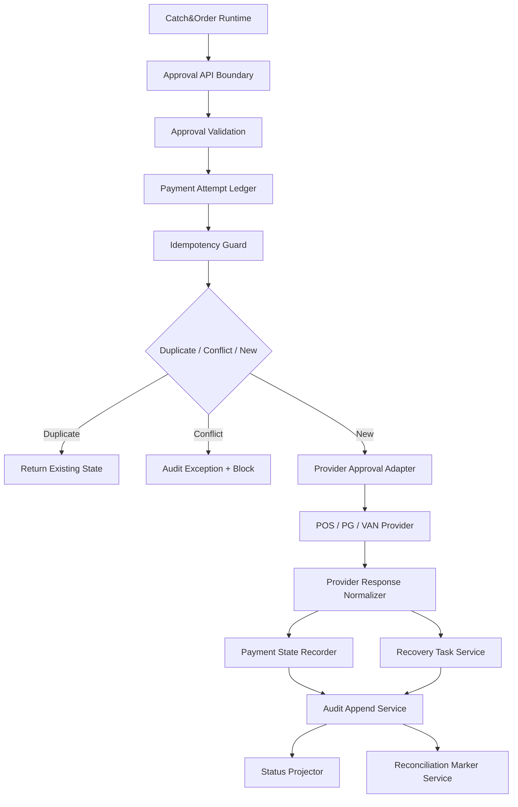

# 000930_Spec_Module_POS_Gateway_Approval_API_Data_Model_And_Test_Map.md

## 1. Document Control

| Field | Value |
|---|---|
| Project | yoonsul_wait_order_handoff / CatchMenu-Catch&Order |
| Band | 00100_project_foundation |
| Document Type | Spec |
| Document Layer | Module |
| Document Role | POS Gateway Approval API, Data Model, And Test Map |
| Parent Overview | 000910_Spec_Overview_POS_Gateway_Approval_Main_Flow.md |
| Parent Logic | 000920_Spec_Logic_POS_Gateway_Approval_State_Transition_And_Exception_Rule.md |
| Related Module Template | 000680_Template_Development_Foundation_Module_Document.md |
| Related Traceability Matrix | 000690_Matrix_Development_Foundation_Overview_Logic_Module_Traceability.md |
| Related Source Tree Matrix | 000820_Matrix_Development_Foundation_Source_Tree_To_Module_Document_Map.md |
| Related Owner Register | 000830_Register_Development_Foundation_Repository_Module_Owner_Map.md |
| Related Runtime Flow Bundle | 064100_Flow_POS_Gateway_Approval_To_Audit_Ledger_And_Reconciliation.md |
| Related Flow Registry | 064000_Index_Runtime_Flow_Bundle_Registry.md |
| Status | Draft / Pending Codebase Hydration |
| Owner | Architecture / Engineering / QA / Compliance |
| AI Solo Change | Documentation drafting allowed; runtime implementation approval prohibited |

---

## 2. Purpose

This Module document maps the POS Gateway approval Logic rules to implementation-facing modules, APIs, data models, queues, tests, and evidence.

It is the third layer in the development foundation chain:

```text
Overview → Logic → Module → File → Test → Evidence
```

This document must be updated with actual source paths after first codebase hydration.

Until actual files are mapped, this document is not sufficient for code handoff.

---

## 3. Scope

### 3.1 Included

- POS Gateway approval API boundary.
- Approval validation module.
- Payment attempt and idempotency module.
- Provider approval adapter.
- Provider response normalizer.
- Payment ledger recording.
- Audit ledger append.
- Timeout/UNKNOWN recovery handoff.
- Reconciliation readiness marker.
- Customer/store/admin status projection.
- Test coverage map.
- Evidence map.

### 3.2 Excluded

- Cancel/refund/reversal module.
- Settlement dispute module.
- Offline local ledger resync module.
- Webhook inbound recovery-only module.
- Secret rotation module.
- DB migration execution.
- Production release configuration.

---

## 4. Implementation Readiness Warning

This document contains expected module boundaries and placeholder source paths.

Actual implementation may proceed only after:

1. first codebase hydration is completed,
2. actual source paths are filled,
3. restricted files are registered,
4. module owners are assigned,
5. tests are identified,
6. evidence packet is prepared,
7. human approval exists for restricted zones.

---

## 5. Runtime Module Map

| Module | Responsibility | Related Logic Rule | Restricted Zone | Owner |
|---|---|---|---|---|
| approval_api_boundary | Receives internal approval request from Catch&Order runtime | R001~R003 | Conditional | Engineering |
| approval_validation | Validates order, store, amount, currency, provider, idempotency key | R001~R003 | RZ-PAY | Engineering / Product |
| payment_attempt_ledger | Creates/reuses payment attempt and stores internal state | R003~R005, R009 | RZ-PAY / RZ-DB | Engineering |
| idempotency_guard | Prevents duplicate approval and detects conflicts | R003~R005 | RZ-PAY | Engineering / Compliance |
| provider_approval_adapter | Sends approval request to POS/PG/VAN provider | R006~R008 | RZ-PAY / RZ-CONTRACT | Engineering |
| provider_response_normalizer | Classifies approval/rejection/timeout/mismatch | R006~R008, R011 | RZ-PAY / RZ-CONTRACT | Engineering / QA |
| payment_state_projector | Projects safe customer/store/admin status | R012 | Conditional | Engineering / Product |
| audit_append_service | Appends material state transition evidence | R010 | RZ-AUDIT | Engineering / Compliance |
| reconciliation_marker_service | Creates reconciliation readiness marker | R013 | RZ-SETTLE / RZ-AUDIT | Engineering / Compliance |
| recovery_task_service | Creates recovery task for UNKNOWN or repair cases | R008~R010 | RZ-OPS | Engineering / Operations |
| approval_test_harness | Tests validation, idempotency, provider responses, audit, reconciliation | All | Conditional | QA / Engineering |

---

## 6. Source File Map

Actual paths must be filled after hydration.

| Source File / Folder | Expected Role | Related Module | Related Logic | Test File | Evidence |
|---|---|---|---|---|---|
| TBD | Approval API boundary | approval_api_boundary | R001~R003 | TBD | approval_api_evidence |
| TBD | Approval validation rules | approval_validation | R001~R003 | TBD | validation_evidence |
| TBD | Payment attempt ledger | payment_attempt_ledger | R003~R005, R009 | TBD | payment_attempt_evidence |
| TBD | Idempotency guard | idempotency_guard | R003~R005 | TBD | idempotency_evidence |
| TBD | Provider approval adapter | provider_approval_adapter | R006~R008 | TBD | provider_request_evidence |
| TBD | Provider response normalizer | provider_response_normalizer | R006~R008, R011 | TBD | provider_response_evidence |
| TBD | Payment status projection | payment_state_projector | R012 | TBD | status_projection_evidence |
| TBD | Audit append service | audit_append_service | R010 | TBD | audit_append_evidence |
| TBD | Reconciliation readiness marker | reconciliation_marker_service | R013 | TBD | reconciliation_marker_evidence |
| TBD | Recovery task service | recovery_task_service | R008~R010 | TBD | recovery_task_evidence |

---

## 7. API / Interface Map

### 7.1 Internal Approval API

| Interface | Direction | Caller | Callee | Request | Response | Related Logic |
|---|---|---|---|---|---|---|
| createPaymentApprovalAttempt | Internal | Catch&Order Runtime | POS Gateway Approval Module | order_id, store_id, amount, currency, provider, idempotency_key | approval_state, payment_attempt_id, safe_status | R001~R008 |

### 7.2 Provider Approval Adapter Interface

| Interface | Direction | Caller | Callee | Required Validation | Retry Allowed? | Evidence |
|---|---|---|---|---|---:|---|
| sendProviderApprovalRequest | Outbound | POS Gateway | POS/PG/VAN Provider | amount, currency, store credential ref, provider contract, idempotency | Conditional | provider_request_evidence |
| normalizeProviderApprovalResponse | Internal | Provider Adapter | Payment Ledger | approval_no, provider_status, amount, provider_time, response_hash | N/A | provider_response_evidence |

### 7.3 Status Projection Interface

| Interface | Direction | Caller | Callee | Rule |
|---|---|---|---|---|
| projectPaymentStatus | Internal | Payment Ledger / Runtime | Customer/Store/Admin projection | UNKNOWN must not be displayed as Approved |

---

## 8. Data Model Map

Actual schema names must be confirmed after hydration.

| Data Model / Table | Purpose | Key Fields | Related Logic | Restricted? |
|---|---|---|---|---:|
| payment_attempts | Payment attempt and idempotency scope | payment_attempt_id, order_id, store_id, amount, provider, status, idempotency_key, payload_hash | R003~R005 | Yes |
| payment_events | Payment state transition history | payment_event_id, payment_attempt_id, before_state, after_state, reason | R006~R013 | Yes |
| provider_approval_events | Raw/normalized provider approval response | provider_event_id, provider, provider_ref, approval_no, response_hash, status | R006~R008, R011 | Yes |
| audit_events | Immutable audit trace | audit_event_id, event_type, entity_ref, hash/ref, created_at | R010 | Yes |
| recovery_tasks | UNKNOWN/repair queue | recovery_task_id, payment_attempt_id, reason, status, owner | R008~R010 | Conditional |
| reconciliation_markers | Settlement/reconciliation readiness | marker_id, payment_attempt_id, provider_ref, readiness_state | R013 | Yes |

---

## 9. Field-Level Rules

| Field | Required Rule |
|---|---|
| payment_attempt_id | Required for all mutation and audit correlation |
| idempotency_key | Required before provider approval request |
| payload_hash | Required to detect same-key/different-payload conflict |
| amount | Must equal locked order total |
| currency | Must match provider-supported currency |
| provider_ref | Required for verified provider result and reconciliation |
| approval_no | Required for provider approved state where provider supplies it |
| audit_event_id | Required for material transition evidence |
| status | Must follow approved Logic state model |
| credential_ref | May be referenced but secret value must not be logged |

---

## 10. Queue / Job / Event Map

| Item | Type | Producer | Consumer | Related Logic | Retry / DLQ | Evidence |
|---|---|---|---|---|---|---|
| payment.approval.initiated | Event | Runtime | POS Gateway | R001~R003 | No blind retry | request_evidence |
| provider.approval.requested | Event | POS Gateway | Provider Adapter | R006~R008 | Idempotent retry only | provider_request_evidence |
| payment.approval.timeout | Event | Provider Adapter | Recovery Task Service | R008 | DLQ required | timeout_unknown_evidence |
| payment.ledger.recorded | Event | Payment Ledger | Audit Append Service | R009~R010 | Controlled retry | ledger_write_evidence |
| reconciliation.ready | Event | Reconciliation Marker Service | Reconciliation Worker | R013 | Scheduled retry | recon_marker_evidence |
| audit.append.failed | Incident Event | Audit Append Service | Admin / Ops | R010 | Incident workflow | audit_failure_evidence |

---

## 11. Function / Class Responsibility Map

Expected symbols must be confirmed after hydration.

| Function / Class | Responsibility | Must Not Do | Related Logic | Test |
|---|---|---|---|---|
| validateApprovalRequest | Validate order/store/amount/provider/idempotency | Must not call provider | R001~R003 | validation unit tests |
| createOrReusePaymentAttempt | Create or find idempotent attempt | Must not duplicate provider charge | R003~R005 | idempotency tests |
| detectIdempotencyConflict | Compare payload hash for same key | Must not ignore mismatch | R004~R005 | conflict tests |
| sendApprovalToProvider | Call external provider | Must not retry without idempotency | R006~R008 | provider contract tests |
| normalizeApprovalResponse | Classify provider result | Must not mark malformed response as success | R006~R008, R011 | response classification tests |
| recordPaymentState | Persist internal state transition | Must not overwrite history silently | R009 | ledger tests |
| appendPaymentAuditEvent | Append audit evidence | Must not mutate previous audit event | R010 | audit tests |
| createReconciliationMarker | Mark provider result for later reconciliation | Must not mark UNKNOWN as settled-ready | R013 | reconciliation tests |
| projectSafePaymentStatus | Build customer/store/admin status | Must not show UNKNOWN as Approved | R012 | projection tests |

---

## 12. Error Handling Map

| Error Type | Module Behavior | User/Store/Admin Behavior | Evidence |
|---|---|---|---|
| Validation error | Reject before provider call | Customer/store sees safe failure | validation_failure_evidence |
| Idempotency duplicate | Return existing state | No duplicate success | duplicate_evidence |
| Idempotency conflict | Block and audit | Admin review required | conflict_evidence |
| Provider timeout | Mark UNKNOWN and queue recovery | Customer/store sees pending verification | timeout_unknown_evidence |
| Provider rejection | Record failed state | Customer/store sees failed status | rejection_evidence |
| Provider amount mismatch | Mark mismatch/UNKNOWN and block closeout | Admin review required | amount_mismatch_evidence |
| Ledger write failure | Create repair incident | Admin review required | ledger_failure_evidence |
| Audit append failure | Block closeout and create incident | Admin/compliance review required | audit_failure_evidence |
| Reconciliation marker failure | Create repair task | Admin/recon review required | recon_marker_gap_evidence |

---

## 13. Security Implementation Map

| Security Control | Implementation Point | Test | Evidence |
|---|---|---|---|
| Idempotency conflict protection | idempotency_guard | idempotency_conflict_test | idempotency_evidence |
| Provider credential reference only | provider_approval_adapter | secret_masking_test | secret_control_evidence |
| No raw secret logs | logging middleware / adapter | log_masking_test | log_masking_evidence |
| Provider response replay protection | provider_event guard | replay_test | replay_evidence |
| Safe UNKNOWN projection | status projector | projection_guard_test | status_projection_evidence |
| Restricted file gate | 00750 register | diff review | restricted_zone_evidence |

---

## 14. Test Map

| Test Type | Required Scenarios | Candidate Test File | Evidence |
|---|---|---|---|
| Unit | validation, idempotency duplicate, idempotency conflict, response classification | TBD | unit_test_report |
| Integration | runtime → approval module → provider mock → ledger → audit | TBD | integration_test_report |
| Contract | provider approval/rejection/malformed schemas | TBD | contract_test_report |
| Fault Injection | timeout, network loss, late response, ledger failure, audit failure | TBD | fault_test_report |
| Security | replay, secret masking, credential absence, payload hash conflict | TBD | security_test_report |
| Audit | every material transition creates audit event | TBD | audit_test_report |
| Reconciliation | marker created only for valid states | TBD | reconciliation_test_report |
| Regression | duplicate approval prevention and UNKNOWN safe projection | TBD | regression_test_report |

---

## 15. Traceability Matrix

| Flow Step | Logic Rule | Module | Source File | Function/Class | Test | Evidence |
|---|---|---|---|---|---|---|
| Validate approval request | R001~R003 | approval_validation | TBD | validateApprovalRequest | TBD | validation_evidence |
| Create/reuse payment attempt | R003~R005 | payment_attempt_ledger | TBD | createOrReusePaymentAttempt | TBD | payment_attempt_evidence |
| Detect duplicate/conflict | R004~R005 | idempotency_guard | TBD | detectIdempotencyConflict | TBD | idempotency_evidence |
| Send provider request | R006~R008 | provider_approval_adapter | TBD | sendApprovalToProvider | TBD | provider_request_evidence |
| Normalize provider response | R006~R008, R011 | provider_response_normalizer | TBD | normalizeApprovalResponse | TBD | provider_response_evidence |
| Record payment state | R009 | payment_attempt_ledger | TBD | recordPaymentState | TBD | ledger_write_evidence |
| Append audit event | R010 | audit_append_service | TBD | appendPaymentAuditEvent | TBD | audit_append_evidence |
| Project safe status | R012 | payment_state_projector | TBD | projectSafePaymentStatus | TBD | status_projection_evidence |
| Create recon marker | R013 | reconciliation_marker_service | TBD | createReconciliationMarker | TBD | recon_marker_evidence |
| Queue recovery | R008~R010 | recovery_task_service | TBD | createRecoveryTask | TBD | recovery_task_evidence |

---

## 16. Mermaid Module Diagram



---

## 17. Code Handoff Requirements

Before any implementation:

- [ ] Actual source paths are filled.
- [ ] Restricted paths are registered in 00750.
- [ ] Module owners are confirmed in 00830.
- [ ] Test files are identified.
- [ ] Evidence packet target is defined.
- [ ] Human approval exists for restricted changes.
- [ ] 00850 first runtime code change gate is passed.
- [ ] 00860 bounded handoff prompt is prepared.

---

## 18. Open Questions

| Question | Owner | Blocking? |
|---|---|---:|
| What are the actual source paths for approval modules? | Engineering | Yes |
| Which provider adapter is first target? | Product / Architecture | Yes |
| Does implementation start with mock provider or real POS/PG/VAN provider? | Architecture / Engineering | Yes |
| What is the canonical audit ledger module? | Architecture / Compliance | Yes |
| Which test framework is used? | Engineering / QA | Yes |
| Are DB tables already present or pending migration? | Engineering | Yes |

---

## 19. Summary

This Module document maps POS Gateway approval logic to expected implementation surfaces.

It is not yet a code handoff packet.

Implementation requires actual hydration results and the complete chain:

```text
Overview → Logic → Module → File → Test → Evidence
```

along with the parent Runtime Flow Bundle chain:

```text
Flow Step → Module → File → Test → Evidence
```
