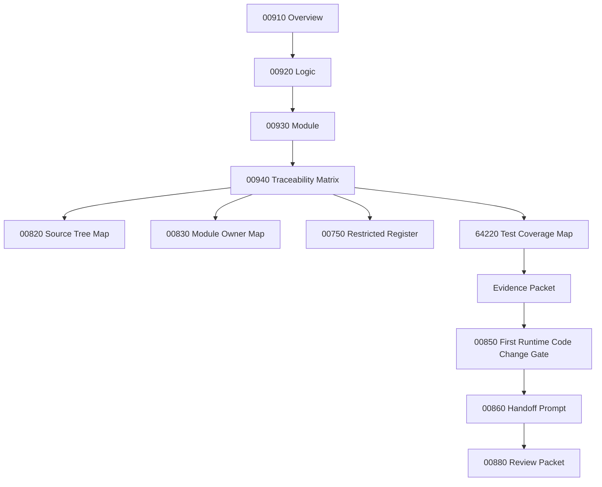

# 000940_Matrix_POS_Gateway_Approval_Overview_Logic_Module_To_Flow_Bundle_Traceability.md

## 1. Document Control

| Field | Value |
|---|---|
| Project | yoonsul_wait_order_handoff / CatchMenu-Catch&Order |
| Band | 00100_project_foundation |
| Document Type | Matrix |
| Document Role | POS Gateway Approval Overview / Logic / Module To Flow Bundle Traceability |
| Related Overview | 000910_Spec_Overview_POS_Gateway_Approval_Main_Flow.md |
| Related Logic | 000920_Spec_Logic_POS_Gateway_Approval_State_Transition_And_Exception_Rule.md |
| Related Module | 000930_Spec_Module_POS_Gateway_Approval_API_Data_Model_And_Test_Map.md |
| Related Development Foundation Traceability | 000690_Matrix_Development_Foundation_Overview_Logic_Module_Traceability.md |
| Related Source Tree Matrix | 000820_Matrix_Development_Foundation_Source_Tree_To_Module_Document_Map.md |
| Related Runtime Flow Bundle | 064100_Flow_POS_Gateway_Approval_To_Audit_Ledger_And_Reconciliation.md |
| Related Flow Registry | 064000_Index_Runtime_Flow_Bundle_Registry.md |
| Related Flow Module Map | 064210_Matrix_Flow_To_Module_Implementation_Map.md |
| Related Flow Test Map | 064220_Matrix_Flow_To_Test_Coverage_Map.md |
| Status | Draft |
| Owner | Product / Architecture / Engineering / QA / Compliance |
| AI Solo Change | Documentation mapping allowed; runtime implementation approval prohibited |

---

## 2. Purpose

This matrix connects the POS Gateway Approval `Overview → Logic → Module` document set to the parent Runtime Flow Bundle.

It confirms that the implementation package is not driven by a single MD file.

The required chain is:

```text
Overview → Logic → Module → File → Test → Evidence
```

The parent Runtime Flow Bundle chain is:

```text
Flow Step → Module → File → Test → Evidence
```

This document is the bridge between those two chains.

---

## 3. Traceability Scope

### 3.1 Included

- 00910 Overview flow steps.
- 00920 Logic rules.
- 00930 Module mappings.
- 64100 Runtime Flow Bundle alignment.
- Test coverage expectations.
- Evidence expectations.
- Restricted-zone awareness.
- Hydration-dependent TBD fields.

### 3.2 Excluded

- Actual source code changes.
- Actual DB migration.
- Provider credential handling.
- Production release approval.
- Cancel/refund-specific flow.
- Settlement dispute-specific flow.
- Webhook inbound-only flow.

---

## 4. Traceability Matrix

| Trace ID | Overview Flow Step | Logic Rule | Module | Source File | Test Coverage | Evidence | Runtime Flow Step | Status |
|---|---|---|---|---|---|---|---|---|
| POSAPP-TRACE-001 | Payment approval request received | R001~R003 | approval_api_boundary / approval_validation | TBD | validation unit/integration test | validation_evidence | Approval request intake | Draft |
| POSAPP-TRACE-002 | Order/store/amount/provider validation | R001~R003 | approval_validation | TBD | validation unit test | provider_validation_evidence | Pre-provider validation | Draft |
| POSAPP-TRACE-003 | Create or reuse payment attempt | R003~R005 | payment_attempt_ledger | TBD | idempotency unit/integration test | payment_attempt_evidence | Payment attempt creation | Draft |
| POSAPP-TRACE-004 | Duplicate same payload handling | R004 | idempotency_guard | TBD | duplicate replay test | duplicate_replay_evidence | Duplicate prevention | Draft |
| POSAPP-TRACE-005 | Idempotency conflict handling | R005 | idempotency_guard | TBD | conflict test | idempotency_conflict_evidence | Conflict block | Draft |
| POSAPP-TRACE-006 | Send provider approval request | R006~R008 | provider_approval_adapter | TBD | provider contract/integration test | provider_request_evidence | Provider approval call | Draft |
| POSAPP-TRACE-007 | Provider approved response | R006 | provider_response_normalizer / payment_attempt_ledger | TBD | approved response contract test | approval_response_evidence | Approval normalization | Draft |
| POSAPP-TRACE-008 | Provider rejected response | R007 | provider_response_normalizer / payment_attempt_ledger | TBD | rejection contract test | rejection_response_evidence | Rejection normalization | Draft |
| POSAPP-TRACE-009 | Timeout or ambiguous provider state | R008 | provider_response_normalizer / recovery_task_service | TBD | timeout fault injection test | timeout_unknown_evidence | UNKNOWN state handling | Draft |
| POSAPP-TRACE-010 | Payment ledger write failure | R009 | payment_attempt_ledger / recovery_task_service | TBD | ledger failure test | ledger_write_failure_evidence | Ledger repair path | Draft |
| POSAPP-TRACE-011 | Audit append | R010 | audit_append_service | TBD | audit append/immutability test | audit_append_evidence | Audit ledger append | Draft |
| POSAPP-TRACE-012 | Amount mismatch | R011 | provider_response_normalizer / recovery_task_service | TBD | mismatch test | amount_mismatch_evidence | Mismatch review path | Draft |
| POSAPP-TRACE-013 | Safe customer/store status projection | R012 | payment_state_projector | TBD | projection guard test | status_projection_evidence | Status projection | Draft |
| POSAPP-TRACE-014 | Reconciliation readiness marker | R013 | reconciliation_marker_service | TBD | reconciliation marker test | recon_marker_evidence | Reconciliation readiness | Draft |
| POSAPP-TRACE-015 | Evidence packet completion | R001~R013 | approval_test_harness / evidence packet | TBD | evidence completeness review | approval_flow_evidence_packet | Flow evidence closeout | Draft |

---

## 5. Status Values

| Status | Meaning |
|---|---|
| Draft | Proposed trace row |
| Mapped | Overview, Logic, Module, and Flow Step are linked |
| Hydration Required | Actual source/test paths are still unknown |
| Test Ready | Test target is known |
| Evidence Ready | Evidence target is known |
| Approved | Ready for implementation handoff |
| Blocked | Missing document, source path, test, evidence, or approval |
| Deprecated | Replaced but retained for audit history |

---

## 6. Hydration Dependency

This matrix is not implementation-ready until actual paths are added from codebase hydration.

Required hydration sources:

| Required Source | Document |
|---|---|
| Actual source paths | 000840_Evidence_Development_Foundation_First_Codebase_Hydration_Report.md |
| Source-to-module rows | 000820_Matrix_Development_Foundation_Source_Tree_To_Module_Document_Map.md |
| Module owner rows | 000830_Register_Development_Foundation_Repository_Module_Owner_Map.md |
| Restricted file rows | 000750_Register_Development_Foundation_Restricted_File_And_Zone_Control.md |
| Actual test paths | 064220_Matrix_Flow_To_Test_Coverage_Map.md or hydration output |

---

## 7. Restricted-Zone Traceability

| Trace ID | Restricted Area | AI Solo Allowed? | Human Approval Required? |
|---|---|---:|---:|
| POSAPP-TRACE-003 | Payment attempt / idempotency | No | Yes |
| POSAPP-TRACE-004 | Duplicate charge prevention | No | Yes |
| POSAPP-TRACE-005 | Idempotency conflict | No | Yes |
| POSAPP-TRACE-006 | Provider approval adapter | No | Yes |
| POSAPP-TRACE-007 | Payment approval state | No | Yes |
| POSAPP-TRACE-009 | UNKNOWN external state | No | Yes |
| POSAPP-TRACE-011 | Audit ledger append | No | Yes |
| POSAPP-TRACE-014 | Reconciliation readiness | No | Yes |

Any implementation touching these rows must pass No-AI-Solo approval.

---

## 8. Test Coverage Requirements By Trace Row

| Trace ID | Minimum Test Types |
|---|---|
| POSAPP-TRACE-001 | Unit, integration |
| POSAPP-TRACE-002 | Unit |
| POSAPP-TRACE-003 | Unit, integration |
| POSAPP-TRACE-004 | Unit, regression |
| POSAPP-TRACE-005 | Unit, security |
| POSAPP-TRACE-006 | Contract, integration |
| POSAPP-TRACE-007 | Contract, integration, audit |
| POSAPP-TRACE-008 | Contract, integration |
| POSAPP-TRACE-009 | Fault injection, recovery |
| POSAPP-TRACE-010 | Fault injection, incident/recovery |
| POSAPP-TRACE-011 | Audit, immutability |
| POSAPP-TRACE-012 | Contract, fault injection |
| POSAPP-TRACE-013 | Unit, regression |
| POSAPP-TRACE-014 | Integration, reconciliation |
| POSAPP-TRACE-015 | Evidence review |

---

## 9. Evidence Requirements By Trace Row

| Trace ID | Evidence |
|---|---|
| POSAPP-TRACE-001 | request_snapshot, validation_start |
| POSAPP-TRACE-002 | validation_result |
| POSAPP-TRACE-003 | payment_attempt_record |
| POSAPP-TRACE-004 | duplicate_replay_record |
| POSAPP-TRACE-005 | idempotency_conflict_record |
| POSAPP-TRACE-006 | provider_request_record |
| POSAPP-TRACE-007 | approval_response_record, ledger_write_record |
| POSAPP-TRACE-008 | rejection_response_record, ledger_write_record |
| POSAPP-TRACE-009 | timeout_unknown_record, recovery_task_record |
| POSAPP-TRACE-010 | ledger_failure_incident |
| POSAPP-TRACE-011 | audit_append_record |
| POSAPP-TRACE-012 | mismatch_review_record |
| POSAPP-TRACE-013 | status_projection_record |
| POSAPP-TRACE-014 | reconciliation_marker_record |
| POSAPP-TRACE-015 | final_evidence_packet |

---

## 10. Code Handoff Readiness Check

This POS Gateway Approval package is ready for code handoff only when:

- [ ] 00910 Overview is reviewed.
- [ ] 00920 Logic is reviewed.
- [ ] 00930 Module map is reviewed.
- [ ] 00940 Traceability matrix is updated with actual source paths.
- [ ] 00820 source tree mapping has actual file rows.
- [ ] 00830 owner map has actual module owners.
- [ ] 00750 restricted register has actual restricted files.
- [ ] 64220 test map has actual or planned test rows.
- [ ] Evidence packet target is defined.
- [ ] Human approval exists for restricted rows.
- [ ] 00850 first runtime code change gate is passed.

---

## 11. Mermaid Traceability Diagram



---

## 12. Open Questions

| Question | Owner | Blocking? |
|---|---|---:|
| What are the actual source paths for approval validation and provider adapter? | Engineering | Yes |
| Which provider contract will be used first? | Product / Architecture | Yes |
| Which test framework and folder structure apply? | Engineering / QA | Yes |
| Where will approval flow evidence packet be stored? | QA / Compliance | Yes |
| Who approves first restricted payment implementation? | Product / Compliance | Yes |

---

## 13. Summary

This matrix confirms that POS Gateway Approval is now represented as a connected implementation package:

```text
00910 Overview
  ↓
00920 Logic
  ↓
00930 Module
  ↓
00940 Traceability
  ↓
Source / Test / Evidence / Gate
```

It is still not code-handoff ready until real source paths, tests, owners, restricted approvals, and evidence targets are filled after hydration.
