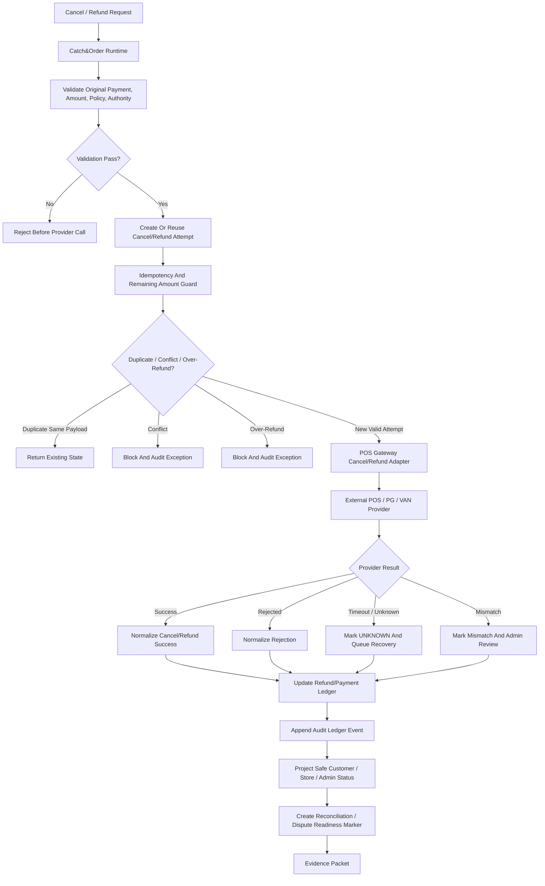

# 001000_Spec_Overview_POS_Gateway_Cancel_Refund_Recovery_Main_Flow.md

## 1. Document Control

| Field | Value |
|---|---|
| Project | yoonsul_wait_order_handoff / CatchMenu-Catch&Order |
| Band | 00100_project_foundation |
| Document Type | Spec |
| Document Layer | Overview |
| Document Role | POS Gateway Cancel / Refund / Recovery Main Flow Overview |
| Related Approval Package Closeout | 000990_Index_POS_Gateway_Approval_Implementation_Package_Closeout.md |
| Related Runtime Flow Bundle | 064110_Flow_POS_Gateway_Cancel_Refund_Recovery_And_Audit.md |
| Related Flow Registry | 064000_Index_Runtime_Flow_Bundle_Registry.md |
| Related Development Foundation Model | 000640_Policy_Development_Foundation_Overview_Logic_Module_Documentation_Model.md |
| Related Traceability Matrix | 000690_Matrix_Development_Foundation_Overview_Logic_Module_Traceability.md |
| Next Logic Document | 001010_Spec_Logic_POS_Gateway_Cancel_Refund_State_Transition_And_Exception_Rule.md |
| Next Module Document | 001020_Spec_Module_POS_Gateway_Cancel_Refund_API_Data_Model_And_Test_Map.md |
| Status | Draft |
| Owner | Product / Architecture / Engineering / QA / Compliance |
| AI Solo Change | Documentation drafting allowed; runtime implementation approval prohibited |

---

## 2. Purpose

This overview defines the POS Gateway cancel, refund, and recovery main flow for CatchMenu / Catch&Order.

It covers the high-level runtime path from a cancellation or refund request to provider reversal, internal ledger update, audit evidence, customer/store status projection, recovery handling, and reconciliation readiness.

This document is the `Overview` layer of the development foundation chain:

```text
Overview → Logic → Module → File → Test → Evidence
```

It must be followed by Logic and Module documents before implementation handoff.

---

## 3. Scope

### 3.1 Included

- Full cancellation before settlement where provider supports cancellation.
- Partial refund where provider and policy allow it.
- Full refund after approval.
- Recovery from timeout/unknown cancel or refund result.
- Duplicate cancel/refund prevention.
- Refund amount validation.
- Provider response normalization.
- Internal payment/refund ledger update.
- Audit ledger append.
- Customer/store/admin status projection.
- Reconciliation and dispute readiness markers.
- Evidence packet requirements.

### 3.2 Excluded

- Initial payment approval flow.
- Settlement dispute adjudication after final settlement.
- Chargeback handling by card issuer or PG/VAN dispute office.
- Manual cash refund outside system.
- Provider credential rotation.
- DB migration execution.
- Production release/deployment.

---

## 4. Business Intent

Cancel/refund logic is more dangerous than approval logic because it can create mismatched money movement after the customer and store already believe payment was completed.

The system must prevent:

- duplicate refund,
- refund greater than approved amount,
- refund after already fully cancelled/refunded state,
- false refund success,
- unknown external provider state shown as completed,
- ledger state divergence,
- audit evidence gap,
- settlement/reconciliation mismatch,
- manual staff action without traceability.

The business goal is:

```text
Every cancel/refund request must converge to a single verified financial outcome,
or remain in controlled UNKNOWN / RECOVERY state with audit evidence.
```

---

## 5. Primary Actors And Systems

| Actor / System | Role |
|---|---|
| Customer | May request order cancellation or refund according to policy |
| Store Staff | May initiate cancellation/refund or handle customer request |
| Store Manager | May approve exceptional refund/manual recovery |
| CatchMenu Client | Shows customer-safe cancellation/refund status |
| Catch&Order Runtime | Validates refund/cancel policy and orchestrates flow |
| POS Gateway | Integrates cancellation/refund request to POS/PG/VAN provider |
| POS/PG/VAN Provider | Executes provider-side cancel/refund/reversal |
| Payment Ledger | Stores original approval and refund/cancel attempt state |
| Refund Ledger | Stores refund/cancel attempt history and amount tracking |
| Audit Ledger | Stores immutable evidence of material transitions |
| Reconciliation Worker | Checks final settlement/refund consistency |
| Admin Console | Handles recovery, mismatch, exception, and approval |
| AI Customer Center | Explains safe SOP status; must not invent financial completion |

---

## 6. High-Level Flow

```text
1. Customer, store staff, manager, or system initiates cancel/refund request.
2. Runtime validates original payment state, amount, policy, provider, and authority.
3. Runtime creates or reuses an idempotent cancel/refund attempt.
4. POS Gateway sends cancel/refund request to provider if eligible.
5. Provider returns success, rejection, timeout, ambiguous result, or mismatch.
6. Gateway normalizes provider result.
7. Refund/cancel ledger records verified or UNKNOWN state.
8. Audit ledger appends material transition evidence.
9. Customer/store/admin status projection is updated safely.
10. Reconciliation/dispute readiness marker is created.
11. Recovery task is created when external state is UNKNOWN or mismatched.
12. Evidence packet records request, decision, response, ledger, audit, and review.
```

---

## 7. Runtime Flow Diagram



---

## 8. Runtime Sequence Diagram

```mermaid
sequenceDiagram
    autonumber
    participant Actor as Customer / Store / Manager
    participant Runtime as Catch&Order Runtime
    participant Ledger as Payment/Refund Ledger
    participant Gateway as POS Gateway
    participant Provider as POS/PG/VAN Provider
    participant Audit as Audit Ledger
    participant Recon as Reconciliation Worker
    participant Admin as Admin Console
    participant Client as Customer/Store Projection

    Actor->>Runtime: Request cancel/refund
    Runtime->>Ledger: Validate original payment and remaining refundable amount
    Ledger-->>Runtime: State, amount, prior refund/cancel attempts
    Runtime->>Ledger: Create/reuse cancel_refund_attempt_id
    Ledger-->>Runtime: Idempotency/amount decision

    alt duplicate same payload
        Runtime-->>Client: Return existing safe status
    else conflict or over-refund
        Runtime->>Audit: Append exception evidence
        Runtime-->>Client: Block request
        Runtime->>Admin: Create review task
    else valid provider request
        Runtime->>Gateway: Send cancel/refund request
        Gateway->>Provider: Provider cancel/refund call

        alt success
            Provider-->>Gateway: Cancel/refund success
            Gateway->>Ledger: Record verified cancel/refund
            Gateway->>Audit: Append success evidence
            Gateway-->>Runtime: Success
            Runtime-->>Client: Show verified cancel/refund status
        else rejected
            Provider-->>Gateway: Rejection
            Gateway->>Ledger: Record rejected state
            Gateway->>Audit: Append rejection evidence
            Gateway-->>Runtime: Failed
            Runtime-->>Client: Show failed status
        else timeout or unknown
            Provider--xGateway: Timeout / ambiguous
            Gateway->>Ledger: Record UNKNOWN state
            Gateway->>Audit: Append unknown evidence
            Gateway->>Admin: Create recovery task
            Gateway-->>Runtime: Pending verification
            Runtime-->>Client: Show pending verification
        end
    end

    Ledger->>Recon: Mark reconciliation/dispute readiness
```

---

## 9. State Overview

Detailed state rules must be defined in:

```text
001010_Spec_Logic_POS_Gateway_Cancel_Refund_State_Transition_And_Exception_Rule.md
```

High-level states:

| State | Meaning |
|---|---|
| CANCEL_REFUND_REQUESTED | Cancel/refund request received |
| VALIDATED | Original payment, amount, policy, and authority passed |
| VALIDATION_FAILED | Request rejected before provider call |
| IDEMPOTENCY_CHECKED | Duplicate/conflict check complete |
| PROVIDER_PENDING | Provider cancel/refund call is in progress |
| CANCELLED_OR_REFUNDED | Verified provider success and internal ledger recorded |
| REJECTED | Provider or policy rejection recorded |
| UNKNOWN_EXTERNAL_STATE | Provider final result is not verified |
| MISMATCH_REVIEW | Amount/state/provider mismatch requires human review |
| AUDIT_RECORDED | Material transition evidence appended |
| RECON_READY | Flow is ready for settlement/refund reconciliation |
| CLOSED | Terminal or review-closed state |

---

## 10. Major Control Points

| Control Point | Purpose |
|---|---|
| Original approval existence | Prevent refund/cancel without valid payment |
| Remaining refundable amount | Prevent over-refund |
| Refund/cancel idempotency | Prevent duplicate reversal |
| Authority/policy validation | Prevent unauthorized refund |
| Provider contract validation | Prevent malformed reversal requests |
| Timeout-to-UNKNOWN rule | Prevent false refund success/failure |
| Audit append | Preserve immutable evidence |
| Safe status projection | Prevent false customer/store completion |
| Reconciliation marker | Ensure final settlement consistency |
| Restricted file gate | Prevent AI solo changes to money movement |

---

## 11. Cancel / Refund Type Boundary

| Type | Description | Key Risk |
|---|---|---|
| Full cancel | Cancel entire approved payment before settlement or provider cutline | duplicate cancel / unknown provider result |
| Partial refund | Refund part of approved amount | over-refund / cumulative mismatch |
| Full refund | Refund entire remaining approved amount | duplicate full refund |
| Recovery refund | Refund/cancel continued from UNKNOWN state | double reversal risk |
| Manual review refund | Requires manager/admin approval | audit and authorization gap |
| Provider rejection | Provider refuses cancel/refund | false customer expectation |
| Settlement-after-cutline case | Cancel/refund may become settlement/dispute process | provider contract mismatch |

---

## 12. No-AI-Solo Zone

This flow touches restricted areas.

| Area | AI Solo Allowed? | Human Approval Required? |
|---|---:|---:|
| Cancel/refund runtime | No | Yes |
| Refund amount validation | No | Yes |
| Idempotency guard for refund | No | Yes |
| Provider cancel/refund adapter | No | Yes |
| Payment/refund ledger state | No | Yes |
| Audit ledger append | No | Yes |
| Reconciliation/dispute readiness | No | Yes |
| DB migration/schema change | No | Yes |
| Secret/credential handling | No | Yes |
| Production release/deploy | No | Yes |

Claude Code and Cursor may assist only within approved, bounded, reviewed file scope.

---

## 13. Related Flow Bundle Documents

| Document | Relationship |
|---|---|
| 064000_Index_Runtime_Flow_Bundle_Registry.md | Runtime Flow Bundle registry |
| 064110_Flow_POS_Gateway_Cancel_Refund_Recovery_And_Audit.md | Parent cancel/refund/recovery flow |
| 064200_Matrix_Flow_To_MD_Dependency_Graph.md | Dependency graph |
| 064210_Matrix_Flow_To_Module_Implementation_Map.md | Runtime module map |
| 064220_Matrix_Flow_To_Test_Coverage_Map.md | Runtime test coverage map |
| 064300_Checklist_Flow_Bundle_Code_Handoff_Readiness_Gate.md | Runtime handoff readiness |
| 064370_Governance_Flow_Bundle_Human_Approval_And_No_AI_Solo_Zone_Control.md | Human approval / No-AI-Solo control |
| 064390_Checklist_Flow_Bundle_Pre_Merge_And_Release_Gate.md | Pre-merge/release gate |

---

## 14. Required Downstream Documents

This overview is incomplete as an implementation package until the following exist:

| Required Document | Purpose |
|---|---|
| 001010_Spec_Logic_POS_Gateway_Cancel_Refund_State_Transition_And_Exception_Rule.md | Defines state transitions, exception rules, amount guard, idempotency, recovery, and audit requirements |
| 001020_Spec_Module_POS_Gateway_Cancel_Refund_API_Data_Model_And_Test_Map.md | Maps logic to APIs, modules, data models, queues, tests, and evidence |
| 001030_Matrix_POS_Gateway_Cancel_Refund_Overview_Logic_Module_To_Flow_Bundle_Traceability.md | Connects Overview/Logic/Module to Flow Bundle |
| 001040_Checklist_POS_Gateway_Cancel_Refund_Code_Handoff_Readiness.md | Determines handoff readiness |
| 001050_Template_POS_Gateway_Cancel_Refund_Claude_Code_Handoff_Prompt.md | Provides bounded Claude handoff |
| 001060_Template_POS_Gateway_Cancel_Refund_Cursor_IDE_File_Level_Assist_Prompt.md | Provides bounded Cursor assist |
| 001070_Evidence_POS_Gateway_Cancel_Refund_Code_Handoff_And_Review_Packet.md | Records handoff/review evidence |
| 001080_Index_POS_Gateway_Cancel_Refund_Implementation_Package_Closeout.md | Closes the package |

---

## 15. Implementation Readiness Status

| Readiness Item | Status |
|---|---|
| Overview defined | Draft |
| Logic defined | Pending 01010 |
| Module mapped | Pending 01020 and hydration |
| Source files known | Pending hydration |
| Tests known | Pending hydration/test map |
| Evidence target known | Pending implementation ticket |
| Restricted approval ready | Pending human approval |
| Ready for code handoff | No |

---

## 16. Open Questions

| Question | Owner | Blocking? |
|---|---|---:|
| Which refund type is first implementation target: full cancel, partial refund, full refund, or recovery? | Product / Architecture | Yes |
| Which provider supports cancellation/refund first? | Product / Architecture | Yes |
| Is partial refund in MVP or deferred? | Product | Yes |
| What is the refund/cancel cutline relative to settlement? | Compliance / Provider Integration | Yes |
| How is remaining refundable amount computed and locked? | Engineering / Compliance | Yes |
| Which manager approval cases are required? | Product / Operations | Yes |
| What is the first safe test environment? | Engineering / QA | Yes |

---

## 17. Summary

This Overview document defines the high-level POS Gateway cancel/refund/recovery path.

It must not be used alone as an implementation instruction.

Implementation may proceed only after the chain is complete:

```text
Overview → Logic → Module → File → Test → Evidence
```

and the parent Runtime Flow Bundle gate confirms:

```text
Flow Step → Module → File → Test → Evidence
```
