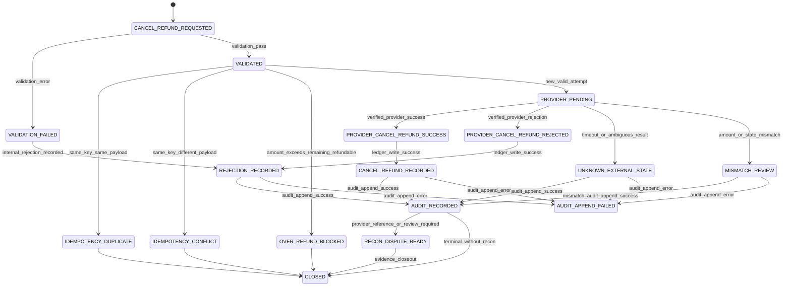

# 001010_Spec_Logic_POS_Gateway_Cancel_Refund_State_Transition_And_Exception_Rule.md

## 1. Document Control

| Field | Value |
|---|---|
| Project | yoonsul_wait_order_handoff / CatchMenu-Catch&Order |
| Band | 00100_project_foundation |
| Document Type | Spec |
| Document Layer | Logic |
| Document Role | POS Gateway Cancel / Refund State Transition And Exception Rule |
| Parent Overview | 001000_Spec_Overview_POS_Gateway_Cancel_Refund_Recovery_Main_Flow.md |
| Related Runtime Flow Bundle | 064110_Flow_POS_Gateway_Cancel_Refund_Recovery_And_Audit.md |
| Related Approval Package | 000990_Index_POS_Gateway_Approval_Implementation_Package_Closeout.md |
| Related Logic Template | 000670_Template_Development_Foundation_Logic_Document.md |
| Related Traceability Matrix | 000690_Matrix_Development_Foundation_Overview_Logic_Module_Traceability.md |
| Related Flow Registry | 064000_Index_Runtime_Flow_Bundle_Registry.md |
| Next Module Document | 001020_Spec_Module_POS_Gateway_Cancel_Refund_API_Data_Model_And_Test_Map.md |
| Status | Draft |
| Owner | Product / Architecture / Engineering / QA / Compliance |
| AI Solo Change | Documentation drafting allowed; runtime implementation approval prohibited |

---

## 2. Purpose

This Logic document defines the state transition, validation, exception, idempotency, amount guard, provider response, recovery, audit, and evidence rules for the POS Gateway cancel/refund flow.

It is the second layer of the Development Foundation implementation chain:

```text
Overview → Logic → Module → File → Test → Evidence
```

This document must be reviewed before runtime code handoff.

---

## 3. Scope

### 3.1 Included

- Full cancel before settlement where allowed.
- Full refund after approval where allowed.
- Partial refund where allowed by policy and provider contract.
- Cancel/refund request validation.
- Remaining refundable amount guard.
- Idempotency and duplicate refund prevention.
- Provider cancel/refund request and response classification.
- Timeout/UNKNOWN external state handling.
- Mismatch and manual review handling.
- Ledger and audit transition rules.
- Reconciliation/dispute readiness.
- Customer/store/admin safe status projection.
- Test and evidence requirements.

### 3.2 Excluded

- Initial approval flow logic.
- Post-settlement dispute adjudication.
- Chargeback handling.
- Manual cash refund outside system.
- Provider onboarding.
- Secret rotation.
- DB migration execution.
- Production deployment.

---

## 4. Business Logic Intent

Cancel/refund logic must ensure that the system never creates duplicate reversal or over-refund.

Core rule:

```text
A cancel/refund request may become final only when provider result, internal ledger state, and audit evidence are consistent.
```

If the external provider result is not verified, the state must remain:

```text
UNKNOWN_EXTERNAL_STATE
```

not:

```text
CANCELLED
REFUNDED
FAILED
```

unless the provider contract and reconciliation evidence prove the final outcome.

---

## 5. No-AI-Solo Zone Classification

| Area | AI Solo Allowed? | Human Approval Required? | Reason |
|---|---:|---:|---|
| Cancel/refund runtime state transition | No | Yes | Money reversal |
| Remaining refundable amount computation | No | Yes | Over-refund prevention |
| Refund/cancel idempotency | No | Yes | Duplicate reversal prevention |
| Provider cancel/refund adapter | No | Yes | External financial contract |
| Refund ledger state | No | Yes | Financial record integrity |
| Audit ledger append | No | Yes | Evidence integrity |
| Reconciliation/dispute marker | No | Yes | Settlement consistency |
| DB schema/migration | No | Yes | Data integrity |
| Secret/credential handling | No | Yes | Security |
| Release/deploy | No | Yes | Runtime stability |

---

## 6. Primary State Model

| State | Meaning | Entry Condition | Exit Condition | Terminal? |
|---|---|---|---|---:|
| CANCEL_REFUND_REQUESTED | Request received | Customer/store/manager/system request | Validation begins | No |
| VALIDATION_FAILED | Request rejected before provider call | Invalid original payment, amount, policy, authority, or provider | Audit/log closeout | Yes |
| VALIDATED | Request passed validation | Original payment and amount guard pass | Idempotency check begins | No |
| IDEMPOTENCY_DUPLICATE | Same key and same payload already processed | Duplicate same payload | Existing state returned | Conditional |
| IDEMPOTENCY_CONFLICT | Same key with different payload | Conflict detected | Audit exception and block | Yes |
| OVER_REFUND_BLOCKED | Requested amount exceeds refundable balance | Amount guard fails | Audit exception and block | Yes |
| PROVIDER_PENDING | Provider cancel/refund request sent | New valid attempt | Provider response, timeout, mismatch | No |
| PROVIDER_CANCEL_REFUND_SUCCESS | Provider verified cancel/refund success | Valid success response | Ledger update | No |
| PROVIDER_CANCEL_REFUND_REJECTED | Provider verified rejection | Valid rejection response | Ledger update | No |
| UNKNOWN_EXTERNAL_STATE | Provider result cannot be verified | Timeout, connection loss, ambiguous response | Recovery/reconciliation | No |
| MISMATCH_REVIEW | Provider/internal amount or state mismatch | Amount/ref/state mismatch | Admin/compliance review | No |
| CANCEL_REFUND_RECORDED | Internal ledger recorded verified reversal | Provider success and ledger write pass | Audit append | No |
| REJECTION_RECORDED | Internal ledger recorded verified rejection | Provider rejection and ledger write pass | Audit append | No |
| AUDIT_APPEND_FAILED | Audit append failed after material transition | Ledger/provider state exists but audit fails | Incident/recovery | No |
| AUDIT_RECORDED | Material event appended | Audit write succeeded | Projection/reconciliation marker | No |
| RECON_DISPUTE_READY | Ready for reconciliation or dispute check | Audit recorded and provider ref exists | Settlement/refund reconciliation | Conditional |
| CLOSED | Flow safely terminal or review-closed | Evidence complete or blocked terminal state | None | Yes |

---

## 7. State Transition Diagram



---

## 8. Event Model

| Event | Producer | Consumer | Required Payload | Idempotency Key | Audit Required |
|---|---|---|---|---|---:|
| cancel_refund.requested | Runtime / Store / Admin | CancelRefund Runtime | original_payment_id, order_id, amount, reason, actor | cancel_refund_attempt_id | Yes |
| cancel_refund.validation.failed | Runtime | Refund Ledger / Audit | reason, original_payment_id, requested_amount | cancel_refund_attempt_id | Yes |
| cancel_refund.idempotency.duplicate | Refund Ledger | Runtime / Audit | existing_state, payload_hash | cancel_refund_attempt_id | Yes |
| cancel_refund.idempotency.conflict | Refund Ledger | Runtime / Audit | previous_hash, new_hash | cancel_refund_attempt_id | Yes |
| cancel_refund.over_refund.blocked | Refund Ledger | Runtime / Audit | requested_amount, remaining_amount | cancel_refund_attempt_id | Yes |
| provider.cancel_refund.requested | POS Gateway | Provider | provider_ref, amount, type, reason | cancel_refund_attempt_id | Yes |
| provider.cancel_refund.success | Provider | POS Gateway | provider_ref, cancel_refund_ref, amount, time | provider_event_id | Yes |
| provider.cancel_refund.rejected | Provider | POS Gateway | rejection_code, reason | provider_event_id | Yes |
| provider.cancel_refund.timeout | POS Gateway | Recovery Queue / Audit | timeout_at, attempt_id | cancel_refund_attempt_id | Yes |
| refund.ledger.recorded | Refund Ledger | Audit Ledger | before_state, after_state, amount | cancel_refund_attempt_id | Yes |
| cancel_refund.recon.ready | Runtime | Reconciliation Worker | provider_ref, refund_ledger_ref | cancel_refund_attempt_id | Yes |

---

## 9. Decision Rules

| Rule ID | Condition | Decision | Required Action | Evidence |
|---|---|---|---|---|
| LOGIC-POS-CREF-R001 | Original payment is not verified approved | Reject before provider call | Record validation failure | original_payment_validation_evidence |
| LOGIC-POS-CREF-R002 | Requested cancel/refund amount is invalid | Reject before provider call | Record validation failure | amount_validation_evidence |
| LOGIC-POS-CREF-R003 | Requested amount exceeds remaining refundable amount | Block as over-refund | Append audit exception | over_refund_evidence |
| LOGIC-POS-CREF-R004 | Actor lacks authority or policy disallows refund | Reject before provider call | Record policy failure | authority_policy_evidence |
| LOGIC-POS-CREF-R005 | Idempotency key missing for mutation | Reject before provider call | Block attempt | idempotency_missing_evidence |
| LOGIC-POS-CREF-R006 | Same idempotency key and same payload | Do not call provider again | Return existing state | duplicate_replay_evidence |
| LOGIC-POS-CREF-R007 | Same idempotency key with different payload | Block as conflict | Append audit exception | idempotency_conflict_evidence |
| LOGIC-POS-CREF-R008 | Provider returns verified cancel/refund success | Mark provider success | Write refund ledger and audit | provider_success_evidence |
| LOGIC-POS-CREF-R009 | Provider returns verified rejection | Mark provider rejected | Write rejection ledger and audit | provider_rejection_evidence |
| LOGIC-POS-CREF-R010 | Provider timeout or ambiguous result | Do not mark success/failure | Mark UNKNOWN and queue recovery | timeout_unknown_evidence |
| LOGIC-POS-CREF-R011 | Provider amount/state mismatches internal request | Block final status | Mark mismatch review | mismatch_review_evidence |
| LOGIC-POS-CREF-R012 | Ledger write fails after provider success | Do not retry blindly | Create repair incident | ledger_write_failure_evidence |
| LOGIC-POS-CREF-R013 | Audit append fails after material transition | Do not close flow | Create audit incident | audit_append_failure_evidence |
| LOGIC-POS-CREF-R014 | Customer/store status requested while UNKNOWN | Show pending verification | Do not show cancelled/refunded | safe_projection_evidence |
| LOGIC-POS-CREF-R015 | Reconciliation marker missing after success | Block closeout | Create reconciliation repair task | recon_marker_gap_evidence |

---

## 10. Validation Rules

| Validation Item | Rule | Failure Behavior |
|---|---|---|
| original_payment_id | Must exist and be verified approved or eligible | Reject before provider call |
| order_id | Must match original payment/order | Reject before provider call |
| store_id | Must match original store | Reject before provider call |
| requested_amount | Must be positive and within refundable balance | Reject or over-refund block |
| refund_type | Must be supported by policy/provider | Reject or route to manual review |
| actor_authority | Must allow requested operation | Reject or require manager approval |
| reason_code | Required for refund/cancel evidence | Reject if required but missing |
| provider | Must support cancel/refund operation | Reject or route to manual path |
| idempotency_key | Required for mutation | Reject if missing |
| provider_credentials_ref | Must exist but secret value must not be logged | Reject if missing |

---

## 11. Amount Guard Rules

| Rule | Requirement |
|---|---|
| Remaining refundable amount | original_approved_amount - verified_cancel_refund_total |
| Pending unknown attempts | Must reserve or block overlapping amount until resolved |
| Partial refund | Must not exceed remaining refundable amount |
| Full refund | Must equal remaining refundable amount or approved total depending policy |
| Duplicate same request | Return existing state, do not subtract twice |
| Rejected refund | Does not reduce remaining refundable amount unless provider contract says otherwise |
| UNKNOWN refund | Must not allow overlapping new refund without recovery decision |
| Over-refund attempt | Block and audit |
| Currency | Must match original payment currency unless provider contract supports conversion |

---

## 12. Idempotency Rules

| Rule | Requirement |
|---|---|
| Idempotency scope | cancel_refund_attempt_id + original_payment_id + amount + type + provider |
| Same key, same payload | Return existing state without provider re-call |
| Same key, different payload | Block conflict |
| Retry after timeout | Must use same attempt and recovery path |
| New refund while UNKNOWN exists | Block or require admin recovery decision |
| Duplicate provider event | Must map to existing attempt |
| Retention | Must cover refund/dispute/reconciliation period |
| Evidence | Every duplicate/conflict decision must be auditable |

---

## 13. Timeout / UNKNOWN Rules

| Case | Required Behavior |
|---|---|
| Timeout before provider request sent | No provider reversal exists; safe failure/pending allowed |
| Timeout after provider request sent | Mark UNKNOWN_EXTERNAL_STATE |
| Connection loss after request may have reached provider | Mark UNKNOWN_EXTERNAL_STATE |
| Provider malformed response | UNKNOWN by default unless contract confirms rejection |
| Late provider event arrives | Verify and reconcile with existing attempt |
| User repeats refund while UNKNOWN exists | Do not create independent overlapping refund |
| Admin recovery confirms success | Move to verified success with audit and reconciliation evidence |
| Admin recovery confirms no reversal | Move to verified failure/rejected with audit evidence |

UNKNOWN is neither success nor failure.

---

## 14. Provider Response Classification

| Provider Result | Classification | Internal State |
|---|---|---|
| Valid cancel/refund success with matching amount/ref | VERIFIED_SUCCESS | PROVIDER_CANCEL_REFUND_SUCCESS |
| Valid rejection | VERIFIED_REJECTION | PROVIDER_CANCEL_REFUND_REJECTED |
| Timeout/no response | UNKNOWN | UNKNOWN_EXTERNAL_STATE |
| Network error after request may have reached provider | UNKNOWN | UNKNOWN_EXTERNAL_STATE |
| Malformed response without proof | UNKNOWN default | UNKNOWN_EXTERNAL_STATE |
| Success amount mismatch | MISMATCH | MISMATCH_REVIEW |
| Provider says already cancelled/refunded | DUPLICATE_OR_PRIOR_SUCCESS | Match to existing attempt or review |
| Replay outside allowed window | SECURITY_EXCEPTION | Block and audit |

---

## 15. Refund Ledger Rules

| Transition | Rule |
|---|---|
| REQUESTED → VALIDATED | Record request snapshot and validation pass |
| VALIDATED → PROVIDER_PENDING | Record cancel/refund attempt before provider call |
| PROVIDER_PENDING → CANCEL_REFUND_RECORDED | Only after verified provider success |
| PROVIDER_PENDING → REJECTION_RECORDED | Only after verified provider rejection |
| PROVIDER_PENDING → UNKNOWN_EXTERNAL_STATE | Timeout/ambiguous result |
| UNKNOWN_EXTERNAL_STATE → CANCEL_REFUND_RECORDED | Only after verified later provider success |
| UNKNOWN_EXTERNAL_STATE → REJECTION_RECORDED | Only after verified no reversal or provider rejection |
| MISMATCH_REVIEW → CANCEL_REFUND_RECORDED | Only after approved manual recovery |
| Any material transition | Must be audit appended |

Ledger must preserve history.  
It must not overwrite prior refund/cancel attempts silently.

---

## 16. Audit Ledger Rules

| Audit Item | Required |
|---|---:|
| Cancel/refund request snapshot | Yes |
| Original payment validation result | Yes |
| Amount guard decision | Yes |
| Authority/policy decision | Yes |
| Idempotency duplicate/conflict | Yes |
| Provider request reference | Yes |
| Provider response summary | Yes |
| Timeout/UNKNOWN event | Yes |
| Mismatch review event | Yes |
| Refund ledger transition | Yes |
| Audit append failure | Yes |
| Reconciliation/dispute readiness marker | Yes |
| Admin/manual recovery action | Yes when applicable |

Audit logs must not include raw secrets, credential values, or unnecessary sensitive payment payloads.

---

## 17. Status Projection Rules

| Audience | Allowed Status |
|---|---|
| Customer | Requested, Pending Verification, Cancelled/Refunded, Rejected, Contact Store |
| Store Staff | Requested, Pending, Verified Success, Rejected, Recovery Required, Review Required |
| Manager/Admin | Full technical state with evidence and approval actions |
| AI Customer Center | SOP/evidence-based explanation only; no invented financial completion |

Projection rules:

1. UNKNOWN must never be shown as Cancelled/Refunded.
2. Over-refund block must be shown as blocked/review required.
3. Verified provider rejection may be shown as rejected.
4. Verified success may be shown as cancelled/refunded only after ledger and audit rules are satisfied.
5. Admin sees evidence gaps and recovery requirements.

---

## 18. Reconciliation / Dispute Readiness Rules

| Condition | Rule |
|---|---|
| Provider success verified | Create refund reconciliation marker |
| Provider rejection verified | Mark non-refund/rejected reconciliation state |
| UNKNOWN exists | Recovery/reconciliation task required |
| Provider ref missing | Block final closeout |
| Amount mismatch exists | Route to dispute/review |
| Audit evidence missing | Block closeout/release |
| Duplicate reversal suspected | Block and escalate |
| Settlement cutline passed | Route to settlement/dispute process if provider requires |

---

## 19. Error Handling Rules

| Error | Handling |
|---|---|
| Original payment missing | Reject before provider call |
| Original payment not approved | Reject before provider call |
| Amount invalid | Reject before provider call |
| Over-refund | Block and audit |
| Unauthorized actor | Reject or require manager approval |
| Idempotency duplicate | Return existing state |
| Idempotency conflict | Block and audit |
| Provider timeout | UNKNOWN + recovery |
| Provider rejection | Rejection recorded + audit |
| Provider success mismatch | Mismatch review |
| Ledger write failure | Repair incident |
| Audit append failure | Incident + no closeout |
| Reconciliation marker failure | Repair task |
| Secret/credential missing | Reject before provider call and security/audit log |

---

## 20. Test Requirements

| Test Type | Required Scenarios |
|---|---|
| Unit | original payment validation, amount guard, over-refund, idempotency duplicate/conflict |
| Integration | runtime → cancel/refund module → provider mock → refund ledger → audit ledger |
| Contract | provider success/rejection/malformed response schemas |
| Fault Injection | timeout, connection loss, late response, ledger failure, audit append failure |
| Security | replay attempt, idempotency conflict, secret masking, authority bypass attempt |
| Audit | audit event generated for every material transition |
| Reconciliation | marker created only for verified eligible states |
| Regression | duplicate refund prevention and UNKNOWN safe projection |

---

## 21. Evidence Requirements

| Evidence | Required For |
|---|---|
| original_payment_validation_evidence | original payment eligibility |
| amount_validation_evidence | requested amount validation |
| over_refund_evidence | over-refund block |
| authority_policy_evidence | actor/policy decision |
| idempotency_duplicate_evidence | duplicate replay |
| idempotency_conflict_evidence | conflict block |
| provider_request_evidence | outbound cancel/refund call |
| provider_success_evidence | verified provider success |
| provider_rejection_evidence | verified provider rejection |
| timeout_unknown_evidence | timeout/ambiguous result |
| mismatch_review_evidence | amount/state mismatch |
| refund_ledger_write_evidence | internal state recording |
| audit_append_evidence | material transition proof |
| recon_marker_evidence | reconciliation/dispute readiness |
| safe_projection_evidence | customer/store visible status |

---

## 22. Downstream Module Mapping Requirements

Required downstream document:

```text
001020_Spec_Module_POS_Gateway_Cancel_Refund_API_Data_Model_And_Test_Map.md
```

Minimum mapping:

| Logic Rule | Required Module Mapping |
|---|---|
| R001~R004 | validation and authority/policy module |
| R003 | amount guard / refundable balance calculator |
| R005~R007 | idempotency guard |
| R008~R011 | provider adapter and response normalizer |
| R012 | refund ledger error handling |
| R013 | audit append and audit incident handling |
| R014 | safe status projection |
| R015 | reconciliation/dispute readiness marker |

---

## 23. Approval Gate

This Logic document is not implementation-ready until:

- [ ] Product confirms cancel/refund policy.
- [ ] Architecture confirms state and module boundary.
- [ ] Engineering confirms implementability.
- [ ] QA confirms testability.
- [ ] Compliance confirms refund/evidence sufficiency.
- [ ] Security confirms credential/log/replay safeguards.
- [ ] No-AI-Solo classification is accepted.
- [ ] Module document 01020 is created.
- [ ] Source files are mapped after hydration.
- [ ] Test coverage map is updated.

---

## 24. Summary

This document defines the logic rules for POS Gateway cancel/refund/recovery.

It must not be used alone as a code instruction.

Runtime implementation requires the full chain:

```text
Overview → Logic → Module → File → Test → Evidence
```

and the Runtime Flow Bundle chain:

```text
Flow Step → Module → File → Test → Evidence
```
