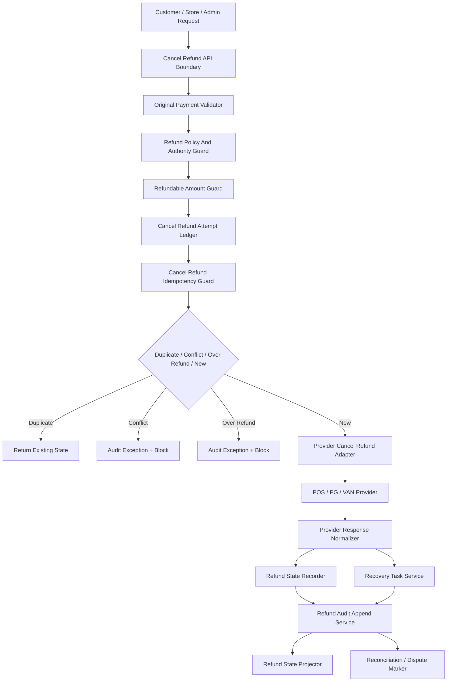

# 001020_Spec_Module_POS_Gateway_Cancel_Refund_API_Data_Model_And_Test_Map.md

## 1. Document Control

| Field | Value |
|---|---|
| Project | yoonsul_wait_order_handoff / CatchMenu-Catch&Order |
| Band | 00100_project_foundation |
| Document Type | Spec |
| Document Layer | Module |
| Document Role | POS Gateway Cancel / Refund API, Data Model, And Test Map |
| Parent Overview | 001000_Spec_Overview_POS_Gateway_Cancel_Refund_Recovery_Main_Flow.md |
| Parent Logic | 001010_Spec_Logic_POS_Gateway_Cancel_Refund_State_Transition_And_Exception_Rule.md |
| Related Approval Module Package | 000930_Spec_Module_POS_Gateway_Approval_API_Data_Model_And_Test_Map.md |
| Related Runtime Flow Bundle | 064110_Flow_POS_Gateway_Cancel_Refund_Recovery_And_Audit.md |
| Related Module Template | 000680_Template_Development_Foundation_Module_Document.md |
| Related Source Tree Matrix | 000820_Matrix_Development_Foundation_Source_Tree_To_Module_Document_Map.md |
| Related Owner Register | 000830_Register_Development_Foundation_Repository_Module_Owner_Map.md |
| Related Restricted Register | 000750_Register_Development_Foundation_Restricted_File_And_Zone_Control.md |
| Status | Draft / Pending Codebase Hydration |
| Owner | Architecture / Engineering / QA / Compliance |
| AI Solo Change | Documentation drafting allowed; runtime implementation approval prohibited |

---

## 2. Purpose

This Module document maps the POS Gateway cancel/refund/recovery Logic rules to implementation-facing APIs, modules, data models, queues, jobs, tests, and evidence.

It is the third layer in the Development Foundation chain:

```text
Overview → Logic → Module → File → Test → Evidence
```

Actual source paths and test paths must be filled after codebase hydration.

---

## 3. Scope

### 3.1 Included

- Cancel/refund request API boundary.
- Original payment eligibility validation.
- Refund policy and authority validation.
- Remaining refundable amount guard.
- Cancel/refund idempotency.
- Provider cancel/refund adapter.
- Provider response normalizer.
- Refund/cancel ledger.
- Audit append service.
- Recovery task service.
- Reconciliation/dispute readiness marker.
- Customer/store/admin status projection.
- Test and evidence map.

### 3.2 Excluded

- Initial payment approval implementation.
- Post-settlement chargeback workflow.
- Manual cash refund outside system.
- Provider onboarding.
- Secret rotation.
- DB migration execution.
- Production deployment.

---

## 4. Implementation Readiness Warning

This document contains expected module boundaries and placeholder paths.

Runtime implementation is blocked until:

1. actual source paths are known,
2. actual tests are known,
3. restricted files are registered,
4. owners are assigned,
5. human approval exists for restricted zones,
6. evidence targets are created.

---

## 5. Runtime Module Map

| Module | Responsibility | Related Logic Rule | Restricted Zone | Owner |
|---|---|---|---|---|
| cancel_refund_api_boundary | Receives cancel/refund request from customer/store/admin/runtime | R001~R005 | Conditional | Engineering |
| original_payment_validator | Validates original approval, order, store, provider, and eligibility | R001 | RZ-PAY | Engineering / Compliance |
| refund_policy_authority_guard | Validates actor authority, reason, policy, refund type, and manager approval | R004 | RZ-PAY / RZ-OPS | Product / Engineering |
| refundable_amount_guard | Calculates remaining refundable amount and blocks over-refund | R002~R003 | RZ-PAY / RZ-SETTLE | Engineering / Compliance |
| cancel_refund_attempt_ledger | Creates/reuses cancel/refund attempt and stores state | R005~R007, R012 | RZ-PAY / RZ-DB | Engineering |
| cancel_refund_idempotency_guard | Prevents duplicate reversal and detects conflicts | R005~R007 | RZ-PAY | Engineering / Compliance |
| provider_cancel_refund_adapter | Sends cancel/refund request to provider | R008~R011 | RZ-PAY / RZ-CONTRACT | Engineering |
| provider_cancel_refund_response_normalizer | Classifies success, rejection, timeout, mismatch, duplicate provider event | R008~R011 | RZ-PAY / RZ-CONTRACT | Engineering / QA |
| refund_state_projector | Projects customer/store/admin-safe status | R014 | Conditional | Engineering / Product |
| refund_audit_append_service | Appends cancel/refund material state evidence | R013 | RZ-AUDIT | Engineering / Compliance |
| refund_reconciliation_marker_service | Creates reconciliation/dispute readiness marker | R015 | RZ-SETTLE / RZ-AUDIT | Engineering / Compliance |
| refund_recovery_task_service | Creates recovery tasks for UNKNOWN, mismatch, ledger/audit gaps | R010~R015 | RZ-OPS | Engineering / Operations |
| cancel_refund_test_harness | Tests amount guard, idempotency, provider response, recovery, audit, reconciliation | All | Conditional | QA / Engineering |

---

## 6. Source File Map

Actual paths must be filled after hydration.

| Source File / Folder | Expected Role | Related Module | Related Logic | Test File | Evidence |
|---|---|---|---|---|---|
| TBD | Cancel/refund API boundary | cancel_refund_api_boundary | R001~R005 | TBD | cancel_refund_api_evidence |
| TBD | Original payment validation | original_payment_validator | R001 | TBD | original_payment_validation_evidence |
| TBD | Refund policy and authority guard | refund_policy_authority_guard | R004 | TBD | authority_policy_evidence |
| TBD | Remaining refundable amount guard | refundable_amount_guard | R002~R003 | TBD | amount_guard_evidence |
| TBD | Cancel/refund attempt ledger | cancel_refund_attempt_ledger | R005~R007, R012 | TBD | cancel_refund_attempt_evidence |
| TBD | Cancel/refund idempotency guard | cancel_refund_idempotency_guard | R005~R007 | TBD | idempotency_evidence |
| TBD | Provider cancel/refund adapter | provider_cancel_refund_adapter | R008~R011 | TBD | provider_cancel_refund_request_evidence |
| TBD | Provider cancel/refund response normalizer | provider_cancel_refund_response_normalizer | R008~R011 | TBD | provider_cancel_refund_response_evidence |
| TBD | Refund/cancel status projection | refund_state_projector | R014 | TBD | safe_projection_evidence |
| TBD | Refund audit append service | refund_audit_append_service | R013 | TBD | audit_append_evidence |
| TBD | Refund reconciliation marker service | refund_reconciliation_marker_service | R015 | TBD | recon_dispute_marker_evidence |
| TBD | Refund recovery task service | refund_recovery_task_service | R010~R015 | TBD | recovery_task_evidence |

---

## 7. API / Interface Map

### 7.1 Internal Cancel/Refund Request API

| Interface | Direction | Caller | Callee | Request | Response | Related Logic |
|---|---|---|---|---|---|---|
| createCancelRefundAttempt | Internal | Catch&Order Runtime / Admin Console | POS Gateway CancelRefund Module | original_payment_id, order_id, store_id, amount, refund_type, reason_code, actor, idempotency_key | cancel_refund_state, cancel_refund_attempt_id, safe_status | R001~R007 |

### 7.2 Provider Cancel/Refund Adapter Interface

| Interface | Direction | Caller | Callee | Required Validation | Retry Allowed? | Evidence |
|---|---|---|---|---|---:|---|
| sendProviderCancelRefundRequest | Outbound | POS Gateway | POS/PG/VAN Provider | original provider ref, amount, type, provider contract, idempotency | Conditional | provider_cancel_refund_request_evidence |
| normalizeProviderCancelRefundResponse | Internal | Provider Adapter | Refund Ledger | provider_ref, cancel_refund_ref, provider_status, amount, response_hash | N/A | provider_cancel_refund_response_evidence |

### 7.3 Recovery / Reconciliation Interface

| Interface | Direction | Caller | Callee | Rule |
|---|---|---|---|---|
| createCancelRefundRecoveryTask | Internal | CancelRefund Module | Admin/Recovery Queue | UNKNOWN, mismatch, ledger failure, audit failure must be visible |
| createRefundReconciliationMarker | Internal | Refund Ledger / Runtime | Reconciliation Worker | Verified provider success or review-required state must be traceable |

---

## 8. Data Model Map

Actual schema names must be confirmed after hydration.

| Data Model / Table | Purpose | Key Fields | Related Logic | Restricted? |
|---|---|---|---|---:|
| payments | Canonical original approval record | payment_id, order_id, store_id, approved_amount, currency, provider_ref, status | R001 | Yes |
| cancel_refund_attempts | Cancel/refund attempt and idempotency scope | cancel_refund_attempt_id, original_payment_id, amount, type, status, idempotency_key, payload_hash | R002~R007 | Yes |
| cancel_refund_events | Cancel/refund transition history | event_id, attempt_id, before_state, after_state, reason, actor | R008~R015 | Yes |
| provider_cancel_refund_events | Provider-side cancel/refund response | provider_event_id, provider, provider_ref, cancel_refund_ref, amount, status, response_hash | R008~R011 | Yes |
| refundable_balance_snapshots | Remaining refundable amount record | original_payment_id, approved_amount, refunded_total, pending_unknown_total, remaining_amount | R002~R003 | Yes |
| audit_events | Immutable audit trace | audit_event_id, event_type, entity_ref, hash/ref, created_at | R013 | Yes |
| recovery_tasks | UNKNOWN/mismatch/repair queue | task_id, attempt_id, reason, status, owner | R010~R015 | Conditional |
| reconciliation_markers | Refund reconciliation/dispute readiness | marker_id, attempt_id, provider_ref, readiness_state | R015 | Yes |

---

## 9. Field-Level Rules

| Field | Required Rule |
|---|---|
| cancel_refund_attempt_id | Required for all mutation and audit correlation |
| original_payment_id | Must reference verified approved payment or eligible original transaction |
| idempotency_key | Required before provider cancel/refund request |
| payload_hash | Required to detect same-key/different-payload conflict |
| requested_amount | Must be positive and within remaining refundable balance |
| remaining_refundable_amount | Must consider verified refunds and unresolved UNKNOWN attempts |
| refund_type | Must be full_cancel, partial_refund, full_refund, recovery, or provider-supported equivalent |
| reason_code | Required for evidence and provider contract where required |
| provider_ref | Required for provider-side reversal and reconciliation |
| cancel_refund_ref | Required when provider returns reversal reference |
| audit_event_id | Required for material transition evidence |
| credential_ref | May be referenced but secret value must not be logged |

---

## 10. Queue / Job / Event Map

| Item | Type | Producer | Consumer | Related Logic | Retry / DLQ | Evidence |
|---|---|---|---|---|---|---|
| cancel_refund.requested | Event | Runtime / Admin | CancelRefund Module | R001~R005 | No blind retry | request_evidence |
| provider.cancel_refund.requested | Event | POS Gateway | Provider Adapter | R008~R011 | Idempotent retry only | provider_request_evidence |
| cancel_refund.timeout | Event | Provider Adapter | Recovery Task Service | R010 | DLQ required | timeout_unknown_evidence |
| cancel_refund.mismatch.detected | Event | Response Normalizer | Admin / Recovery | R011 | Review queue | mismatch_review_evidence |
| refund.ledger.recorded | Event | Refund Ledger | Audit Append Service | R012~R013 | Controlled retry | refund_ledger_evidence |
| audit.append.failed | Incident Event | Audit Append Service | Admin / Ops | R013 | Incident workflow | audit_failure_evidence |
| refund.reconciliation.ready | Event | Reconciliation Marker Service | Reconciliation Worker | R015 | Scheduled retry | recon_marker_evidence |

---

## 11. Function / Class Responsibility Map

Expected symbols must be confirmed after hydration.

| Function / Class | Responsibility | Must Not Do | Related Logic | Test |
|---|---|---|---|---|
| validateOriginalPaymentForRefund | Validate original payment eligibility | Must not call provider | R001 | original payment validation tests |
| validateRefundPolicyAndAuthority | Validate actor, reason, policy, refund type | Must not bypass manager approval | R004 | authority/policy tests |
| calculateRemainingRefundableAmount | Compute remaining refundable balance | Must not ignore UNKNOWN attempts | R002~R003 | amount guard tests |
| createOrReuseCancelRefundAttempt | Create or find idempotent attempt | Must not duplicate provider reversal | R005~R007 | idempotency tests |
| detectCancelRefundConflict | Compare payload hash for same key | Must not ignore mismatch | R006~R007 | conflict tests |
| sendCancelRefundToProvider | Call external provider | Must not retry without idempotency | R008~R011 | provider contract tests |
| normalizeCancelRefundResponse | Classify provider result | Must not mark malformed response as success | R008~R011 | response classification tests |
| recordCancelRefundState | Persist internal state transition | Must not overwrite history silently | R012 | refund ledger tests |
| appendCancelRefundAuditEvent | Append audit evidence | Must not mutate prior audit event | R013 | audit tests |
| projectSafeCancelRefundStatus | Build customer/store/admin status | Must not show UNKNOWN as Refunded/Cancelled | R014 | projection tests |
| createRefundReconciliationMarker | Mark for settlement/refund reconciliation | Must not mark UNKNOWN as final reconciled | R015 | reconciliation tests |
| createRefundRecoveryTask | Create admin recovery task | Must not hide mismatch/UNKNOWN | R010~R015 | recovery tests |

---

## 12. Error Handling Map

| Error Type | Module Behavior | User/Store/Admin Behavior | Evidence |
|---|---|---|---|
| Original payment missing | Reject before provider call | Customer/store sees safe failure or contact store | original_payment_validation_evidence |
| Original payment not approved | Reject before provider call | Safe failure | original_payment_validation_evidence |
| Invalid amount | Reject before provider call | Safe failure | amount_validation_evidence |
| Over-refund | Block and audit | Store/admin review if needed | over_refund_evidence |
| Unauthorized actor | Reject or require manager approval | Manager approval prompt | authority_policy_evidence |
| Idempotency duplicate | Return existing state | No duplicate refund | duplicate_evidence |
| Idempotency conflict | Block and audit | Admin review required | conflict_evidence |
| Provider timeout | UNKNOWN + recovery | Pending verification | timeout_unknown_evidence |
| Provider rejection | Rejection recorded + audit | Failed/rejected status | rejection_evidence |
| Provider mismatch | Mismatch review | Admin review required | mismatch_review_evidence |
| Ledger write failure | Repair incident | Admin review required | ledger_failure_evidence |
| Audit append failure | Incident + no closeout | Admin/compliance review required | audit_failure_evidence |
| Reconciliation marker failure | Repair task | Admin/recon review required | recon_marker_gap_evidence |

---

## 13. Security Implementation Map

| Security Control | Implementation Point | Test | Evidence |
|---|---|---|---|
| Refund idempotency conflict protection | cancel_refund_idempotency_guard | idempotency_conflict_test | idempotency_evidence |
| Over-refund prevention | refundable_amount_guard | over_refund_test | amount_guard_evidence |
| Authority bypass prevention | refund_policy_authority_guard | authority_bypass_test | authority_policy_evidence |
| Provider credential reference only | provider_cancel_refund_adapter | secret_masking_test | secret_control_evidence |
| No raw secret logs | logging middleware / adapter | log_masking_test | log_masking_evidence |
| Provider response replay protection | provider_event guard | replay_test | replay_evidence |
| Safe UNKNOWN projection | refund_state_projector | projection_guard_test | safe_projection_evidence |
| Restricted file gate | 00750 register | diff review | restricted_zone_evidence |

---

## 14. Test Map

| Test Type | Required Scenarios | Candidate Test File | Evidence |
|---|---|---|---|
| Unit | original payment validation, amount validation, over-refund, authority, idempotency | TBD | unit_test_report |
| Integration | runtime → cancel/refund module → provider mock → refund ledger → audit ledger | TBD | integration_test_report |
| Contract | provider success/rejection/malformed schemas | TBD | contract_test_report |
| Fault Injection | timeout, network loss, late response, ledger failure, audit failure | TBD | fault_test_report |
| Security | replay, secret masking, authority bypass, payload hash conflict | TBD | security_test_report |
| Audit | every material transition creates audit event | TBD | audit_test_report |
| Reconciliation | marker created only for verified or review-required states | TBD | reconciliation_test_report |
| Regression | duplicate refund prevention and UNKNOWN safe projection | TBD | regression_test_report |

---

## 15. Traceability Matrix

| Flow Step | Logic Rule | Module | Source File | Function/Class | Test | Evidence |
|---|---|---|---|---|---|---|
| Request cancel/refund | R001~R005 | cancel_refund_api_boundary | TBD | createCancelRefundAttempt | TBD | request_evidence |
| Validate original payment | R001 | original_payment_validator | TBD | validateOriginalPaymentForRefund | TBD | original_payment_validation_evidence |
| Validate policy/authority | R004 | refund_policy_authority_guard | TBD | validateRefundPolicyAndAuthority | TBD | authority_policy_evidence |
| Validate refundable amount | R002~R003 | refundable_amount_guard | TBD | calculateRemainingRefundableAmount | TBD | amount_guard_evidence |
| Create/reuse attempt | R005~R007 | cancel_refund_attempt_ledger | TBD | createOrReuseCancelRefundAttempt | TBD | cancel_refund_attempt_evidence |
| Detect duplicate/conflict | R006~R007 | cancel_refund_idempotency_guard | TBD | detectCancelRefundConflict | TBD | idempotency_evidence |
| Send provider request | R008~R011 | provider_cancel_refund_adapter | TBD | sendCancelRefundToProvider | TBD | provider_request_evidence |
| Normalize provider response | R008~R011 | provider_cancel_refund_response_normalizer | TBD | normalizeCancelRefundResponse | TBD | provider_response_evidence |
| Record refund state | R012 | cancel_refund_attempt_ledger | TBD | recordCancelRefundState | TBD | refund_ledger_evidence |
| Append audit event | R013 | refund_audit_append_service | TBD | appendCancelRefundAuditEvent | TBD | audit_append_evidence |
| Project safe status | R014 | refund_state_projector | TBD | projectSafeCancelRefundStatus | TBD | safe_projection_evidence |
| Create recon/dispute marker | R015 | refund_reconciliation_marker_service | TBD | createRefundReconciliationMarker | TBD | recon_marker_evidence |
| Queue recovery | R010~R015 | refund_recovery_task_service | TBD | createRefundRecoveryTask | TBD | recovery_task_evidence |

---

## 16. Mermaid Module Diagram



---

## 17. Code Handoff Requirements

Before any implementation:

- [ ] Actual source paths are filled.
- [ ] Restricted paths are registered in 00750.
- [ ] Module owners are confirmed in 00830.
- [ ] Test files are identified.
- [ ] Evidence packet target is defined.
- [ ] Human approval exists for restricted changes.
- [ ] Cancel/refund handoff readiness checklist is passed.
- [ ] Bounded Claude/Cursor prompts are prepared.

---

## 18. Open Questions

| Question | Owner | Blocking? |
|---|---|---:|
| What are the actual source paths for cancel/refund modules? | Engineering | Yes |
| Which refund type is first target? | Product / Architecture | Yes |
| Does MVP include partial refund? | Product | Yes |
| How are UNKNOWN attempts reserved against remaining refundable amount? | Engineering / Compliance | Yes |
| What provider contract handles cancel vs refund after settlement cutline? | Provider Integration / Compliance | Yes |
| What is the canonical refund ledger schema? | Architecture / Engineering | Yes |
| Which test framework is used? | Engineering / QA | Yes |

---

## 19. Summary

This Module document maps POS Gateway cancel/refund/recovery logic to expected implementation surfaces.

It is not yet a code handoff packet.

Implementation requires actual hydration results and the complete chain:

```text
Overview → Logic → Module → File → Test → Evidence
```

along with the parent Runtime Flow Bundle chain:

```text
Flow Step → Module → File → Test → Evidence
```
