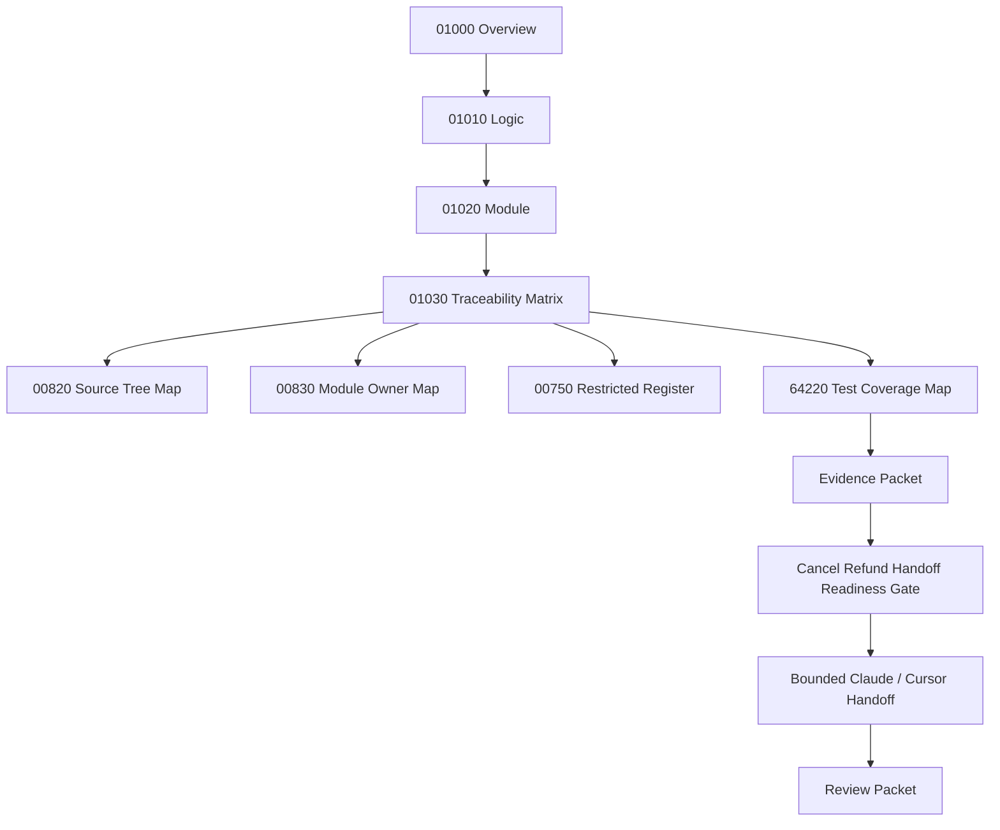

# 001030_Matrix_POS_Gateway_Cancel_Refund_Overview_Logic_Module_To_Flow_Bundle_Traceability.md

## 1. Document Control

| Field | Value |
|---|---|
| Project | yoonsul_wait_order_handoff / CatchMenu-Catch&Order |
| Band | 00100_project_foundation |
| Document Type | Matrix |
| Document Role | POS Gateway Cancel / Refund Overview / Logic / Module To Flow Bundle Traceability |
| Related Overview | 001000_Spec_Overview_POS_Gateway_Cancel_Refund_Recovery_Main_Flow.md |
| Related Logic | 001010_Spec_Logic_POS_Gateway_Cancel_Refund_State_Transition_And_Exception_Rule.md |
| Related Module | 001020_Spec_Module_POS_Gateway_Cancel_Refund_API_Data_Model_And_Test_Map.md |
| Related Approval Package Traceability | 000940_Matrix_POS_Gateway_Approval_Overview_Logic_Module_To_Flow_Bundle_Traceability.md |
| Related Development Foundation Traceability | 000690_Matrix_Development_Foundation_Overview_Logic_Module_Traceability.md |
| Related Source Tree Matrix | 000820_Matrix_Development_Foundation_Source_Tree_To_Module_Document_Map.md |
| Related Runtime Flow Bundle | 064110_Flow_POS_Gateway_Cancel_Refund_Recovery_And_Audit.md |
| Related Flow Registry | 064000_Index_Runtime_Flow_Bundle_Registry.md |
| Related Flow Module Map | 064210_Matrix_Flow_To_Module_Implementation_Map.md |
| Related Flow Test Map | 064220_Matrix_Flow_To_Test_Coverage_Map.md |
| Status | Draft / Hydration Required |
| Owner | Product / Architecture / Engineering / QA / Compliance |
| AI Solo Change | Documentation mapping allowed; runtime implementation approval prohibited |

---

## 2. Purpose

This matrix connects the POS Gateway Cancel / Refund / Recovery `Overview → Logic → Module` document set to the parent Runtime Flow Bundle.

It ensures the implementation package is not driven by a single document.

The required development chain is:

```text
Overview → Logic → Module → File → Test → Evidence
```

The parent Runtime Flow Bundle chain is:

```text
Flow Step → Module → File → Test → Evidence
```

This matrix bridges the two chains for cancel/refund/recovery.

---

## 3. Traceability Scope

### 3.1 Included

- 01000 Overview flow steps.
- 01010 Logic rules.
- 01020 Module mappings.
- 64110 Runtime Flow Bundle alignment.
- Test coverage expectations.
- Evidence expectations.
- Restricted-zone awareness.
- Hydration-dependent TBD fields.

### 3.2 Excluded

- Actual source code changes.
- Actual DB migration.
- Provider credential handling.
- Production release approval.
- Initial approval implementation.
- Post-settlement chargeback adjudication.
- Manual cash refund outside system.

---

## 4. Traceability Matrix

| Trace ID | Overview Flow Step | Logic Rule | Module | Source File | Test Coverage | Evidence | Runtime Flow Step | Status |
|---|---|---|---|---|---|---|---|---|
| POSCREF-TRACE-001 | Cancel/refund request received | R001~R005 | cancel_refund_api_boundary | TBD | API/request validation test | request_evidence | Cancel/refund request intake | Draft |
| POSCREF-TRACE-002 | Original payment validation | R001 | original_payment_validator | TBD | original payment validation test | original_payment_validation_evidence | Original approval eligibility | Draft |
| POSCREF-TRACE-003 | Refund amount validation | R002~R003 | refundable_amount_guard | TBD | amount guard / over-refund test | amount_guard_evidence | Refund amount guard | Draft |
| POSCREF-TRACE-004 | Policy and authority validation | R004 | refund_policy_authority_guard | TBD | authority/policy test | authority_policy_evidence | Refund authority/policy decision | Draft |
| POSCREF-TRACE-005 | Idempotency key required | R005 | cancel_refund_idempotency_guard | TBD | idempotency missing test | idempotency_missing_evidence | Mutation idempotency guard | Draft |
| POSCREF-TRACE-006 | Duplicate same payload handling | R006 | cancel_refund_idempotency_guard | TBD | duplicate replay test | duplicate_replay_evidence | Duplicate refund prevention | Draft |
| POSCREF-TRACE-007 | Idempotency conflict handling | R007 | cancel_refund_idempotency_guard | TBD | conflict test | idempotency_conflict_evidence | Conflict block | Draft |
| POSCREF-TRACE-008 | Provider cancel/refund request | R008~R011 | provider_cancel_refund_adapter | TBD | provider contract/integration test | provider_cancel_refund_request_evidence | Provider reversal call | Draft |
| POSCREF-TRACE-009 | Provider verified success | R008 | provider_cancel_refund_response_normalizer / cancel_refund_attempt_ledger | TBD | provider success contract test | provider_success_evidence | Provider success normalization | Draft |
| POSCREF-TRACE-010 | Provider verified rejection | R009 | provider_cancel_refund_response_normalizer / cancel_refund_attempt_ledger | TBD | provider rejection contract test | provider_rejection_evidence | Provider rejection normalization | Draft |
| POSCREF-TRACE-011 | Timeout or ambiguous result | R010 | provider_cancel_refund_response_normalizer / refund_recovery_task_service | TBD | timeout fault injection test | timeout_unknown_evidence | UNKNOWN state recovery | Draft |
| POSCREF-TRACE-012 | Provider/internal mismatch | R011 | provider_cancel_refund_response_normalizer / refund_recovery_task_service | TBD | mismatch test | mismatch_review_evidence | Mismatch review path | Draft |
| POSCREF-TRACE-013 | Refund ledger write failure | R012 | cancel_refund_attempt_ledger / refund_recovery_task_service | TBD | ledger failure test | ledger_write_failure_evidence | Ledger repair path | Draft |
| POSCREF-TRACE-014 | Audit append | R013 | refund_audit_append_service | TBD | audit append/immutability test | audit_append_evidence | Audit ledger append | Draft |
| POSCREF-TRACE-015 | Safe status projection | R014 | refund_state_projector | TBD | projection guard test | safe_projection_evidence | Customer/store/admin status projection | Draft |
| POSCREF-TRACE-016 | Reconciliation/dispute marker | R015 | refund_reconciliation_marker_service | TBD | recon/dispute marker test | recon_marker_evidence | Reconciliation/dispute readiness | Draft |
| POSCREF-TRACE-017 | Evidence packet closeout | R001~R015 | cancel_refund_test_harness / evidence packet | TBD | evidence completeness review | cancel_refund_flow_evidence_packet | Flow evidence closeout | Draft |

---

## 5. Status Values

| Status | Meaning |
|---|---|
| Draft | Proposed trace row |
| Mapped | Overview, Logic, Module, and Flow Step are linked |
| Hydration Required | Actual source/test paths are still unknown |
| Test Ready | Test target is known |
| Evidence Ready | Evidence target is known |
| Approved | Ready for implementation handoff |
| Blocked | Missing document, source path, test, evidence, or approval |
| Deprecated | Replaced but retained for audit history |

---

## 6. Hydration Dependency

This matrix is not implementation-ready until actual paths are added from codebase hydration.

Required hydration sources:

| Required Source | Document |
|---|---|
| Actual source paths | 000840_Evidence_Development_Foundation_First_Codebase_Hydration_Report.md or later hydration packet |
| Source-to-module rows | 000820_Matrix_Development_Foundation_Source_Tree_To_Module_Document_Map.md |
| Module owner rows | 000830_Register_Development_Foundation_Repository_Module_Owner_Map.md |
| Restricted file rows | 000750_Register_Development_Foundation_Restricted_File_And_Zone_Control.md |
| Actual test paths | 064220_Matrix_Flow_To_Test_Coverage_Map.md or hydration output |

---

## 7. Restricted-Zone Traceability

| Trace ID | Restricted Area | AI Solo Allowed? | Human Approval Required? |
|---|---|---:|---:|
| POSCREF-TRACE-002 | Original payment eligibility | No | Yes |
| POSCREF-TRACE-003 | Refund amount / over-refund guard | No | Yes |
| POSCREF-TRACE-005 | Idempotency for money reversal | No | Yes |
| POSCREF-TRACE-006 | Duplicate refund prevention | No | Yes |
| POSCREF-TRACE-007 | Idempotency conflict | No | Yes |
| POSCREF-TRACE-008 | Provider cancel/refund adapter | No | Yes |
| POSCREF-TRACE-009 | Verified refund success state | No | Yes |
| POSCREF-TRACE-011 | UNKNOWN external refund state | No | Yes |
| POSCREF-TRACE-014 | Audit ledger append | No | Yes |
| POSCREF-TRACE-016 | Reconciliation/dispute readiness | No | Yes |

Any implementation touching these rows must pass No-AI-Solo approval.

---

## 8. Test Coverage Requirements By Trace Row

| Trace ID | Minimum Test Types |
|---|---|
| POSCREF-TRACE-001 | Unit, integration |
| POSCREF-TRACE-002 | Unit, integration |
| POSCREF-TRACE-003 | Unit, regression |
| POSCREF-TRACE-004 | Unit, security |
| POSCREF-TRACE-005 | Unit, security |
| POSCREF-TRACE-006 | Unit, regression |
| POSCREF-TRACE-007 | Unit, security |
| POSCREF-TRACE-008 | Contract, integration |
| POSCREF-TRACE-009 | Contract, integration, audit |
| POSCREF-TRACE-010 | Contract, integration |
| POSCREF-TRACE-011 | Fault injection, recovery |
| POSCREF-TRACE-012 | Contract, fault injection, review |
| POSCREF-TRACE-013 | Fault injection, incident/recovery |
| POSCREF-TRACE-014 | Audit, immutability |
| POSCREF-TRACE-015 | Unit, regression |
| POSCREF-TRACE-016 | Integration, reconciliation |
| POSCREF-TRACE-017 | Evidence review |

---

## 9. Evidence Requirements By Trace Row

| Trace ID | Evidence |
|---|---|
| POSCREF-TRACE-001 | request_snapshot |
| POSCREF-TRACE-002 | original_payment_validation_evidence |
| POSCREF-TRACE-003 | amount_validation_evidence, over_refund_evidence |
| POSCREF-TRACE-004 | authority_policy_evidence |
| POSCREF-TRACE-005 | idempotency_missing_evidence |
| POSCREF-TRACE-006 | duplicate_replay_evidence |
| POSCREF-TRACE-007 | idempotency_conflict_evidence |
| POSCREF-TRACE-008 | provider_cancel_refund_request_evidence |
| POSCREF-TRACE-009 | provider_success_evidence, refund_ledger_write_evidence |
| POSCREF-TRACE-010 | provider_rejection_evidence, refund_ledger_write_evidence |
| POSCREF-TRACE-011 | timeout_unknown_evidence, recovery_task_evidence |
| POSCREF-TRACE-012 | mismatch_review_evidence |
| POSCREF-TRACE-013 | ledger_write_failure_evidence |
| POSCREF-TRACE-014 | audit_append_evidence |
| POSCREF-TRACE-015 | safe_projection_evidence |
| POSCREF-TRACE-016 | recon_marker_evidence |
| POSCREF-TRACE-017 | cancel_refund_flow_evidence_packet |

---

## 10. Code Handoff Readiness Check

This POS Gateway Cancel/Refund package is ready for code handoff only when:

- [ ] 01000 Overview is reviewed.
- [ ] 01010 Logic is reviewed.
- [ ] 01020 Module map is reviewed.
- [ ] 01030 Traceability matrix is updated with actual source paths.
- [ ] 00820 source tree mapping has actual file rows.
- [ ] 00830 owner map has actual module owners.
- [ ] 00750 restricted register has actual restricted files.
- [ ] 64220 test map has actual or planned test rows.
- [ ] Evidence packet target is defined.
- [ ] Human approval exists for restricted rows.
- [ ] Cancel/refund handoff readiness checklist is passed.

---

## 11. Mermaid Traceability Diagram



---

## 12. Relationship With Approval Package

Cancel/refund implementation depends on approval state correctness.

| Dependency | Source |
|---|---|
| Original approved payment state | 00920 / 00930 approval logic and module maps |
| Payment attempt ledger | Approval package and runtime ledger model |
| Provider approval reference | Approval provider response evidence |
| Audit chain continuity | Approval audit append evidence |
| Reconciliation baseline | Approval reconciliation marker |

Cancel/refund must not proceed if the original approval record is not verifiable.

---

## 13. Open Questions

| Question | Owner | Blocking? |
|---|---|---:|
| What are actual cancel/refund source paths? | Engineering | Yes |
| Which refund type is MVP? | Product | Yes |
| Is partial refund supported in first provider contract? | Provider Integration | Yes |
| How are UNKNOWN refund attempts reserved against remaining amount? | Engineering / Compliance | Yes |
| Where is final cancel/refund evidence stored? | QA / Compliance | Yes |
| Who approves first restricted refund implementation? | Product / Compliance | Yes |

---

## 14. Summary

This matrix confirms that POS Gateway Cancel/Refund/Recovery is represented as a connected implementation package:

```text
01000 Overview
  ↓
01010 Logic
  ↓
01020 Module
  ↓
01030 Traceability
  ↓
Source / Test / Evidence / Gate
```

It is not code-handoff ready until real source paths, tests, owners, restricted approvals, and evidence targets are filled after hydration.
