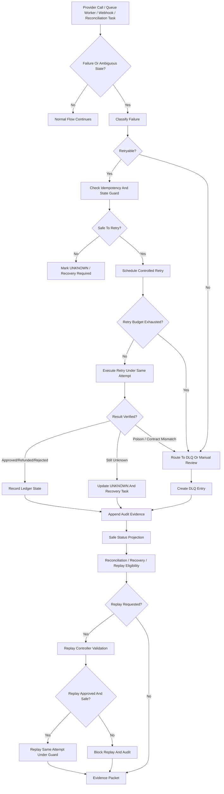
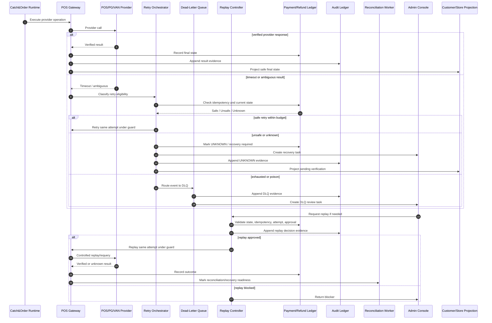

# 001090_Spec_Overview_POS_Gateway_Timeout_Retry_DLQ_And_Replay_Main_Flow.md

## 1. Document Control

| Field | Value |
|---|---|
| Project | yoonsul_wait_order_handoff / CatchMenu-Catch&Order |
| Band | 00100_project_foundation |
| Document Type | Spec |
| Document Layer | Overview |
| Document Role | POS Gateway Timeout / Retry / DLQ / Replay Main Flow Overview |
| Related Approval Package Closeout | 000990_Index_POS_Gateway_Approval_Implementation_Package_Closeout.md |
| Related Cancel Refund Package Closeout | 001080_Index_POS_Gateway_Cancel_Refund_Implementation_Package_Closeout.md |
| Related Runtime Flow Bundle | 064120_Flow_POS_Gateway_Timeout_Retry_DLQ_And_Replay.md |
| Related Flow Registry | 064000_Index_Runtime_Flow_Bundle_Registry.md |
| Related Development Foundation Model | 000640_Policy_Development_Foundation_Overview_Logic_Module_Documentation_Model.md |
| Related Traceability Matrix | 000690_Matrix_Development_Foundation_Overview_Logic_Module_Traceability.md |
| Next Logic Document | 001100_Spec_Logic_POS_Gateway_Timeout_Retry_DLQ_Replay_State_Transition_And_Exception_Rule.md |
| Next Module Document | 001110_Spec_Module_POS_Gateway_Timeout_Retry_DLQ_Replay_API_Data_Model_And_Test_Map.md |
| Status | Draft |
| Owner | Product / Architecture / Engineering / QA / Compliance / Operations |
| AI Solo Change | Documentation drafting allowed; runtime implementation approval prohibited |

---

## 2. Purpose

This overview defines the POS Gateway timeout, retry, dead-letter queue, and replay main flow for CatchMenu / Catch&Order.

It covers how the runtime handles provider timeouts, network failures, ambiguous external states, retry eligibility, DLQ routing, controlled replay, duplicate prevention, audit evidence, and reconciliation readiness.

This document is the `Overview` layer of the Development Foundation chain:

```text
Overview → Logic → Module → File → Test → Evidence
```

It must be followed by Logic and Module documents before implementation handoff.

---

## 3. Scope

### 3.1 Included

- Timeout classification for approval, cancel, refund, webhook, and reconciliation paths.
- Retry eligibility and retry budget.
- Idempotent retry rules.
- Unknown external state protection.
- Dead-letter queue routing.
- Replay request validation.
- Replay safety checks.
- Duplicate provider event prevention.
- Recovery task creation.
- Audit ledger append.
- Customer/store/admin safe status projection.
- Reconciliation readiness and closeout.
- Evidence packet requirements.

### 3.2 Excluded

- Provider-specific approval business logic.
- Provider-specific refund policy.
- Offline local ledger resync.
- Settlement dispute adjudication.
- Secret rotation.
- DB migration execution.
- Production deployment.

---

## 4. Business Intent

Timeout/retry/replay is the part of the system that prevents financial chaos when external providers, store networks, POS systems, or internal workers fail.

The system must prevent:

- duplicate approval,
- duplicate refund,
- replaying a money-moving command without idempotency,
- marking an unknown provider state as success or failure,
- retry storms,
- queue poison-message loops,
- DLQ invisibility,
- evidence gaps,
- settlement/reconciliation mismatch,
- AI or operator replay without approval.

Core goal:

```text
Every uncertain external state must either be verified, safely retried under idempotency, routed to recovery, or preserved in DLQ with audit evidence.
```

---

## 5. Primary Actors And Systems

| Actor / System | Role |
|---|---|
| Catch&Order Runtime | Detects timeout/retry/replay condition and coordinates state |
| POS Gateway | Performs provider calls and normalizes failure/timeout outcomes |
| Provider Adapter | Talks to POS/PG/VAN provider |
| Payment Ledger | Holds approval/payment attempt state |
| Refund Ledger | Holds cancel/refund attempt state |
| Retry Orchestrator | Determines retry eligibility and retry schedule |
| Dead-Letter Queue | Holds non-processable or exhausted events |
| Replay Controller | Allows controlled replay after validation |
| Audit Ledger | Stores immutable evidence of timeout, retry, DLQ, replay |
| Reconciliation Worker | Confirms eventual provider/ledger consistency |
| Admin Console | Reviews UNKNOWN, DLQ, replay, and recovery tasks |
| AI Customer Center | Explains SOP/evidence-based state only; must not invent final payment result |
| Human Approver | Approves restricted replay/recovery actions where required |

---

## 6. High-Level Flow

```text
1. Runtime or provider adapter encounters timeout, network failure, malformed response, queue failure, or unknown provider state.
2. System classifies the failure as retryable, non-retryable, unknown, duplicate, poison, or manual-review-required.
3. Idempotency and state guards determine whether retry is safe.
4. Retry Orchestrator schedules retry only within retry budget and idempotency scope.
5. Exhausted or unsafe messages route to DLQ.
6. DLQ entry records reason, state snapshot, payload hash, and restricted-zone status.
7. Replay Controller validates replay request, actor authority, idempotency, state, and evidence.
8. Replay is executed only as a controlled continuation of the same attempt, not as a new money-moving command.
9. Ledger and audit events are appended for every material retry/DLQ/replay transition.
10. Reconciliation or recovery verifies final external state.
11. Customer/store/admin status projection remains safe until state is verified.
12. Evidence packet records classification, retry decision, DLQ, replay, audit, and final outcome.
```

---

## 7. Runtime Flow Diagram



---

## 8. Runtime Sequence Diagram



---

## 9. State Overview

Detailed state rules must be defined in:

```text
001100_Spec_Logic_POS_Gateway_Timeout_Retry_DLQ_Replay_State_Transition_And_Exception_Rule.md
```

High-level states:

| State | Meaning |
|---|---|
| OPERATION_PENDING | Provider operation is in progress |
| TIMEOUT_DETECTED | Timeout or no response detected |
| AMBIGUOUS_RESPONSE | Response cannot prove final state |
| RETRY_ELIGIBLE | Retry may be safe under idempotency/state guard |
| RETRY_SCHEDULED | Retry is scheduled within budget |
| RETRY_EXECUTED | Retry executed under same attempt |
| UNKNOWN_EXTERNAL_STATE | Provider final state remains unknown |
| DLQ_ROUTED | Event routed to dead-letter queue |
| REPLAY_REQUESTED | Human/system requested replay |
| REPLAY_BLOCKED | Replay failed safety/approval validation |
| REPLAY_APPROVED | Replay approved under guard |
| REPLAY_EXECUTED | Replay executed as continuation of same attempt |
| OUTCOME_VERIFIED | Final provider/internal outcome verified |
| AUDIT_RECORDED | Material transition appended to audit ledger |
| RECON_READY | Ready for reconciliation/recovery closeout |
| CLOSED | Flow safely terminal or review-closed |

---

## 10. Major Control Points

| Control Point | Purpose |
|---|---|
| Failure classification | Distinguish retryable, unknown, poison, mismatch, duplicate, manual-review cases |
| Idempotency guard | Prevent duplicate approval/refund |
| Retry budget | Prevent retry storm |
| Backoff and jitter | Prevent provider/server overload |
| State guard | Prevent retry after terminal outcome |
| Unknown protection | Prevent false final customer/store status |
| DLQ reason capture | Prevent invisible failed events |
| Replay authorization | Prevent unauthorized money-moving replay |
| Replay same-attempt rule | Prevent creating new financial command |
| Audit append | Preserve evidence for timeout/retry/DLQ/replay |
| Reconciliation marker | Ensure final outcome is verified later |

---

## 11. Retry Type Boundary

| Retry Type | Description | Allowed? | Key Risk |
|---|---|---:|---|
| Safe read retry | Re-query provider status | Yes | stale provider state |
| Idempotent write retry | Retry same attempt with same key and payload | Conditional | duplicate provider action |
| New write retry | New attempt after ambiguous write | Usually No | duplicate charge/refund |
| Recovery replay | Human-approved continuation from UNKNOWN/DLQ | Conditional | unauthorized replay |
| Poison replay | Replay malformed/invalid message | No until fixed | repeated failure loop |
| Bulk replay | Replay many DLQ entries | Restricted | mass duplicate money movement |

---

## 12. DLQ Boundary

A message must be routed to DLQ when:

- retry budget is exhausted,
- payload is malformed,
- required idempotency key is missing,
- provider contract validation fails,
- ledger state is inconsistent,
- audit append repeatedly fails,
- replay would be unsafe,
- manual review is required,
- restricted-zone approval is missing.

DLQ is not a trash bin.  
It is a controlled evidence queue.

Every DLQ entry must include:

```text
reason
attempt_id
entity_ref
payload_hash
failure_classification
retry_count
last_error
restricted_zone
created_at
owner_or_queue
evidence_ref
```

---

## 13. Replay Boundary

Replay may be allowed only when:

1. original attempt is known,
2. idempotency scope is known,
3. replay is for the same attempt, not a new money movement,
4. current state is not terminal success/failure unless replay is read-only verification,
5. actor authority is verified,
6. restricted approval exists where required,
7. test/evidence path exists,
8. audit event is appended before and after replay decision,
9. replay result updates ledger/recovery/reconciliation safely.

Replay must be blocked when:

- original attempt is missing,
- idempotency key is missing,
- payload hash differs unexpectedly,
- terminal financial state already exists,
- replay would create duplicate charge/refund,
- approval is missing,
- secret or credential is missing,
- provider contract does not allow replay,
- evidence target is missing.

---

## 14. No-AI-Solo Zone

This flow touches restricted runtime operations.

| Area | AI Solo Allowed? | Human Approval Required? |
|---|---:|---:|
| Retry of money-moving provider call | No | Yes |
| Replay of approval/cancel/refund operation | No | Yes |
| DLQ replay | No | Yes |
| Unknown external state resolution | No | Yes |
| Idempotency guard | No | Yes |
| Audit ledger append behavior | No | Yes |
| Reconciliation closeout | No | Yes |
| DB migration/schema change | No | Yes |
| Secret/credential handling | No | Yes |
| Production release/deploy | No | Yes |

AI may assist with documentation, mapping, read-only inspection, and diff review.  
AI may not independently approve or execute restricted runtime replay.

---

## 15. Related Flow Bundle Documents

| Document | Relationship |
|---|---|
| 064000_Index_Runtime_Flow_Bundle_Registry.md | Runtime Flow Bundle registry |
| 064120_Flow_POS_Gateway_Timeout_Retry_DLQ_And_Replay.md | Parent timeout/retry/DLQ/replay flow |
| 064100_Flow_POS_Gateway_Approval_To_Audit_Ledger_And_Reconciliation.md | Upstream approval flow |
| 064110_Flow_POS_Gateway_Cancel_Refund_Recovery_And_Audit.md | Upstream cancel/refund flow |
| 064200_Matrix_Flow_To_MD_Dependency_Graph.md | Dependency graph |
| 064210_Matrix_Flow_To_Module_Implementation_Map.md | Runtime module map |
| 064220_Matrix_Flow_To_Test_Coverage_Map.md | Runtime test coverage map |
| 064300_Checklist_Flow_Bundle_Code_Handoff_Readiness_Gate.md | Runtime handoff readiness |
| 064370_Governance_Flow_Bundle_Human_Approval_And_No_AI_Solo_Zone_Control.md | Human approval / No-AI-Solo control |
| 064390_Checklist_Flow_Bundle_Pre_Merge_And_Release_Gate.md | Pre-merge/release gate |

---

## 16. Required Downstream Documents

This overview is incomplete as an implementation package until the following exist:

| Required Document | Purpose |
|---|---|
| 001100_Spec_Logic_POS_Gateway_Timeout_Retry_DLQ_Replay_State_Transition_And_Exception_Rule.md | Defines state transitions, retry eligibility, DLQ routing, replay validation, audit, and recovery rules |
| 001110_Spec_Module_POS_Gateway_Timeout_Retry_DLQ_Replay_API_Data_Model_And_Test_Map.md | Maps logic to APIs, modules, data models, queues, jobs, tests, and evidence |
| 001120_Matrix_POS_Gateway_Timeout_Retry_DLQ_Replay_Overview_Logic_Module_To_Flow_Bundle_Traceability.md | Connects Overview/Logic/Module to Flow Bundle |
| 001130_Checklist_POS_Gateway_Timeout_Retry_DLQ_Replay_Code_Handoff_Readiness.md | Determines handoff readiness |
| 001140_Template_POS_Gateway_Timeout_Retry_DLQ_Replay_Claude_Code_Handoff_Prompt.md | Provides bounded Claude handoff |
| 001150_Template_POS_Gateway_Timeout_Retry_DLQ_Replay_Cursor_IDE_File_Level_Assist_Prompt.md | Provides bounded Cursor assist |
| 001160_Evidence_POS_Gateway_Timeout_Retry_DLQ_Replay_Code_Handoff_And_Review_Packet.md | Records handoff/review evidence |
| 001170_Index_POS_Gateway_Timeout_Retry_DLQ_Replay_Implementation_Package_Closeout.md | Closes the package |

---

## 17. Implementation Readiness Status

| Readiness Item | Status |
|---|---|
| Overview defined | Draft |
| Logic defined | Pending 01100 |
| Module mapped | Pending 01110 and hydration |
| Source files known | Pending hydration |
| Tests known | Pending hydration/test map |
| Evidence target known | Pending implementation ticket |
| Restricted approval ready | Pending human approval |
| Ready for code handoff | No |

---

## 18. Open Questions

| Question | Owner | Blocking? |
|---|---|---:|
| What is the retry budget per provider operation type? | Architecture / Operations | Yes |
| What is the timeout threshold per provider and network path? | Engineering / Operations | Yes |
| Which operations allow idempotent write retry? | Architecture / Compliance | Yes |
| Which replay operations require manager/admin approval? | Product / Compliance | Yes |
| How is DLQ ownership assigned? | Operations / Engineering | Yes |
| What is the audit evidence schema for replay decisions? | Compliance / Engineering | Yes |
| What is the first safe test environment for retry/DLQ/replay? | Engineering / QA | Yes |

---

## 19. Summary

This Overview document defines the high-level POS Gateway timeout, retry, DLQ, and replay path.

It must not be used alone as an implementation instruction.

Implementation may proceed only after the chain is complete:

```text
Overview → Logic → Module → File → Test → Evidence
```

and the parent Runtime Flow Bundle gate confirms:

```text
Flow Step → Module → File → Test → Evidence
```
