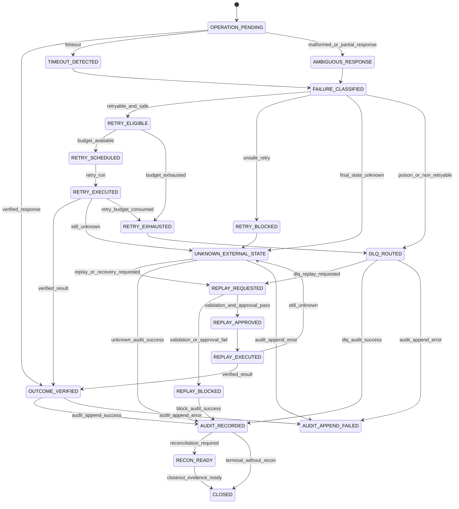

# 001100_Spec_Logic_POS_Gateway_Timeout_Retry_DLQ_Replay_State_Transition_And_Exception_Rule.md

## 1. Document Control

| Field | Value |
|---|---|
| Project | yoonsul_wait_order_handoff / CatchMenu-Catch&Order |
| Band | 00100_project_foundation |
| Document Type | Spec |
| Document Layer | Logic |
| Document Role | POS Gateway Timeout / Retry / DLQ / Replay State Transition And Exception Rule |
| Parent Overview | 001090_Spec_Overview_POS_Gateway_Timeout_Retry_DLQ_And_Replay_Main_Flow.md |
| Related Runtime Flow Bundle | 064120_Flow_POS_Gateway_Timeout_Retry_DLQ_And_Replay.md |
| Related Approval Package | 000990_Index_POS_Gateway_Approval_Implementation_Package_Closeout.md |
| Related Cancel Refund Package | 001080_Index_POS_Gateway_Cancel_Refund_Implementation_Package_Closeout.md |
| Related Logic Template | 000670_Template_Development_Foundation_Logic_Document.md |
| Related Traceability Matrix | 000690_Matrix_Development_Foundation_Overview_Logic_Module_Traceability.md |
| Related Flow Registry | 064000_Index_Runtime_Flow_Bundle_Registry.md |
| Next Module Document | 001110_Spec_Module_POS_Gateway_Timeout_Retry_DLQ_Replay_API_Data_Model_And_Test_Map.md |
| Status | Draft |
| Owner | Architecture / Engineering / QA / Compliance / Operations |
| AI Solo Change | Documentation drafting allowed; runtime implementation approval prohibited |

---

## 2. Purpose

This Logic document defines the state transition, classification, retry, DLQ, replay, audit, recovery, and evidence rules for POS Gateway timeout, retry, dead-letter queue, and replay handling.

It is the second layer of the Development Foundation implementation chain:

```text
Overview → Logic → Module → File → Test → Evidence
```

This document must be reviewed before runtime code handoff.

---

## 3. Scope

### 3.1 Included

- Timeout classification.
- Retry eligibility.
- Retry budget and retry storm prevention.
- Idempotent retry guard.
- UNKNOWN external state handling.
- DLQ routing and poison-message handling.
- Replay request validation.
- Replay approval and block rules.
- Audit ledger append rules.
- Recovery task rules.
- Reconciliation readiness.
- Customer/store/admin safe status projection.
- Test and evidence requirements.

### 3.2 Excluded

- Provider-specific approval business logic.
- Provider-specific refund policy.
- Offline local ledger resync.
- Settlement dispute adjudication.
- Secret rotation.
- DB migration execution.
- Production deployment.

---

## 4. Business Logic Intent

Timeout/retry/DLQ/replay logic must prevent uncertainty from turning into duplicate money movement.

Core rule:

```text
A failed or ambiguous operation may be retried or replayed only when the same attempt, same idempotency scope, same payload, safe state, retry budget, approval, and audit evidence are satisfied.
```

Unknown external state must remain:

```text
UNKNOWN_EXTERNAL_STATE
```

until verified by provider, reconciliation, or approved recovery evidence.

---

## 5. No-AI-Solo Zone Classification

| Area | AI Solo Allowed? | Human Approval Required? | Reason |
|---|---:|---:|---|
| Retry of money-moving operation | No | Yes | Duplicate approval/refund risk |
| Replay of approval/cancel/refund | No | Yes | Direct financial impact |
| DLQ replay | No | Yes | Bulk or hidden duplicate risk |
| UNKNOWN state resolution | No | Yes | False success/failure risk |
| Idempotency guard | No | Yes | Money movement safety |
| Audit ledger append | No | Yes | Evidence integrity |
| Reconciliation closeout | No | Yes | Settlement consistency |
| DB schema/migration | No | Yes | Data integrity |
| Secret/credential handling | No | Yes | Security |
| Release/deploy | No | Yes | Runtime stability |

---

## 6. Primary State Model

| State | Meaning | Entry Condition | Exit Condition | Terminal? |
|---|---|---|---|---:|
| OPERATION_PENDING | Provider operation is in progress | Provider call, queue job, webhook, or reconciliation task begins | Response, timeout, error, or worker failure | No |
| TIMEOUT_DETECTED | No final response within configured threshold | Timeout event raised | Classification begins | No |
| AMBIGUOUS_RESPONSE | Response cannot prove final provider state | Malformed/partial/contract-ambiguous response | Unknown, retry, or DLQ decision | No |
| FAILURE_CLASSIFIED | Failure was classified | Timeout/error/ambiguous state categorized | Retry/DLQ/recovery decision | No |
| RETRY_ELIGIBLE | Retry may be safe | Retryable class and idempotency/state guard pass | Retry scheduling | No |
| RETRY_BLOCKED | Retry is unsafe | Missing idempotency, terminal state, payload mismatch, or approval gap | Audit and recovery/DLQ | Conditional |
| RETRY_SCHEDULED | Retry queued within budget | Retry eligible and budget available | Retry executed or cancelled | No |
| RETRY_EXECUTED | Retry was attempted | Scheduled retry executed | Verified outcome, unknown, or further failure | No |
| RETRY_EXHAUSTED | Retry budget is consumed | Max attempts/time budget reached | DLQ or manual review | No |
| UNKNOWN_EXTERNAL_STATE | Final provider state is not verified | Timeout/ambiguous/unsafe retry | Recovery/reconciliation/replay | No |
| DLQ_ROUTED | Message routed to dead-letter queue | Poison/exhausted/unsafe/unapproved message | Review or replay validation | No |
| REPLAY_REQUESTED | Replay requested | Human/system requests reprocessing | Replay validation | No |
| REPLAY_BLOCKED | Replay is unsafe or unapproved | Validation failure | Audit and close/review | Conditional |
| REPLAY_APPROVED | Replay passed guard and approval | Replay validation success | Replay execution | No |
| REPLAY_EXECUTED | Replay executed under same attempt | Approved replay runs | Verified outcome or unknown | No |
| OUTCOME_VERIFIED | Final outcome verified | Provider/reconciliation/recovery proof exists | Ledger/audit/recon update | No |
| AUDIT_APPEND_FAILED | Audit append failed | Material transition could not be recorded | Incident/recovery | No |
| AUDIT_RECORDED | Audit evidence appended | Audit write succeeds | Projection/reconciliation marker | No |
| RECON_READY | Ready for reconciliation/recovery closeout | Outcome or unknown state has traceable evidence | Reconciliation closeout | Conditional |
| CLOSED | Flow safely terminal or review-closed | Evidence complete or blocked terminal state | None | Yes |

---

## 7. State Transition Diagram



---

## 8. Event Model

| Event | Producer | Consumer | Required Payload | Idempotency Key | Audit Required |
|---|---|---|---|---|---:|
| operation.timeout.detected | Provider Adapter / Worker | Retry Orchestrator | attempt_id, operation_type, timeout_at | attempt_id | Yes |
| operation.ambiguous.detected | Provider Adapter | Retry Orchestrator | response_hash, reason, provider_ref | attempt_id/provider_event_id | Yes |
| retry.eligibility.checked | Retry Orchestrator | Audit / Scheduler | retry_class, state_guard, budget | attempt_id | Yes |
| retry.scheduled | Retry Orchestrator | Queue/Scheduler | attempt_id, scheduled_at, retry_no | attempt_id | Yes |
| retry.executed | Scheduler | Provider Adapter | attempt_id, operation_type, payload_hash | attempt_id | Yes |
| retry.exhausted | Retry Orchestrator | DLQ / Admin | attempt_id, retry_count, last_error | attempt_id | Yes |
| dlq.routed | Queue/Worker | DLQ / Audit | reason, payload_hash, restricted_zone | dlq_entry_id | Yes |
| replay.requested | Admin/System | Replay Controller | dlq_entry_id or attempt_id, actor, reason | replay_request_id | Yes |
| replay.approved | Replay Controller | Provider Adapter / Queue | approval_ref, attempt_id, replay_scope | replay_request_id | Yes |
| replay.blocked | Replay Controller | Audit / Admin | block_reason, attempt_id | replay_request_id | Yes |
| outcome.verified | Provider/Reconciliation | Ledger / Audit | verified_state, provider_ref, evidence | attempt_id | Yes |
| recovery.task.created | Retry/DLQ/Replay | Admin Console | reason, owner, evidence_ref | task_id | Yes |

---

## 9. Failure Classification Rules

| Rule ID | Condition | Classification | Required Action | Evidence |
|---|---|---|---|---|
| LOGIC-POS-TRDR-R001 | Provider call timed out before request left system | LOCAL_TIMEOUT_BEFORE_SEND | No provider retry needed; safe local failure/retry | local_timeout_evidence |
| LOGIC-POS-TRDR-R002 | Provider call timed out after request may have reached provider | UNKNOWN_AFTER_SEND | Mark UNKNOWN and evaluate idempotent retry/requery | unknown_after_send_evidence |
| LOGIC-POS-TRDR-R003 | Provider response malformed but not proof of rejection | AMBIGUOUS_RESPONSE | Do not mark success/failure; evaluate UNKNOWN/recovery | ambiguous_response_evidence |
| LOGIC-POS-TRDR-R004 | Required idempotency key missing | NON_RETRYABLE_UNSAFE | Block retry/replay; route to DLQ/review | idempotency_missing_evidence |
| LOGIC-POS-TRDR-R005 | Payload hash differs for same attempt/key | PAYLOAD_CONFLICT | Block retry/replay and audit conflict | payload_conflict_evidence |
| LOGIC-POS-TRDR-R006 | Current ledger state is terminal | TERMINAL_STATE_BLOCK | Block write retry; allow read-only verification if needed | terminal_state_block_evidence |
| LOGIC-POS-TRDR-R007 | Retry budget available and idempotency guard passes | RETRY_ELIGIBLE | Schedule controlled retry | retry_eligibility_evidence |
| LOGIC-POS-TRDR-R008 | Retry budget exhausted | RETRY_EXHAUSTED | Route to DLQ or manual review | retry_exhausted_evidence |
| LOGIC-POS-TRDR-R009 | Message repeatedly fails same validation | POISON_MESSAGE | Route to DLQ | poison_message_evidence |
| LOGIC-POS-TRDR-R010 | Replay requested without approval | REPLAY_UNAPPROVED | Block replay and audit | replay_blocked_evidence |
| LOGIC-POS-TRDR-R011 | Replay approved under same attempt and guard | REPLAY_ELIGIBLE | Execute controlled replay | replay_approval_evidence |
| LOGIC-POS-TRDR-R012 | Replay would create new money movement | REPLAY_UNSAFE | Block replay and escalate | replay_unsafe_evidence |
| LOGIC-POS-TRDR-R013 | Audit append fails after material transition | AUDIT_FAILURE | Create incident and block closeout | audit_append_failure_evidence |
| LOGIC-POS-TRDR-R014 | Final outcome verified by provider/reconciliation | OUTCOME_VERIFIED | Record ledger/audit/recon marker | outcome_verified_evidence |
| LOGIC-POS-TRDR-R015 | Final outcome remains unknown | UNKNOWN_PERSISTENT | Keep recovery task open; safe projection only | unknown_persistent_evidence |

---

## 10. Retry Eligibility Rules

| Check | Required For Retry |
|---|---|
| operation_type known | Yes |
| original attempt_id known | Yes |
| idempotency key known | Yes for money-moving operation |
| payload hash unchanged | Yes |
| current ledger state non-terminal or retry-compatible | Yes |
| provider contract allows retry or re-query | Yes |
| retry budget available | Yes |
| retry backoff schedule respected | Yes |
| no unresolved restricted approval gap | Yes |
| audit/evidence target exists | Yes |

If any required retry check fails, retry must be blocked or routed to recovery/DLQ.

---

## 11. Retry Budget Rules

| Budget Item | Rule |
|---|---|
| max_attempts | Must be configured per operation/provider |
| max_elapsed_time | Must be configured per operation/provider |
| backoff | Exponential or provider-safe schedule |
| jitter | Required to avoid retry storm |
| concurrency | Must prevent same attempt from concurrent retry |
| retry_after_terminal | Prohibited except read-only verification |
| retry_after_unknown | Conditional; must be same attempt and safe |
| retry_after_dlq | Prohibited unless replay approval passes |
| audit | Every scheduled/executed/exhausted retry must be audited |

---

## 12. DLQ Routing Rules

| Condition | DLQ Required? | Notes |
|---|---:|---|
| Retry budget exhausted | Yes | Include retry count and last error |
| Missing idempotency key for mutation | Yes / Review | Do not retry money movement |
| Payload hash conflict | Yes | Conflict evidence required |
| Poison message | Yes | Prevent infinite loop |
| Provider contract mismatch | Yes / Review | May require provider integration fix |
| Audit append repeatedly fails | Yes / Incident | Must not close silently |
| Replay approval missing | Yes / Block | Keep until approved or closed |
| Unknown owner | Yes / Ops review | Assign owner before replay |
| Security/replay suspicion | Yes / Security review | Restricted handling |

DLQ entries must be visible, owned, and auditable.

---

## 13. DLQ Entry Rules

Every DLQ entry must include:

| Field | Required |
|---|---:|
| dlq_entry_id | Yes |
| source_queue | Yes |
| operation_type | Yes |
| attempt_id | Yes if known |
| provider | Conditional |
| entity_ref | Yes |
| payload_hash | Yes |
| failure_classification | Yes |
| retry_count | Yes |
| last_error | Yes |
| restricted_zone | Yes |
| owner_queue | Yes |
| created_at | Yes |
| evidence_ref | Yes |
| replay_eligible | Yes |
| replay_block_reason | Conditional |

Raw secrets must not be stored in DLQ payloads or evidence.

---

## 14. Replay Validation Rules

| Check | Required |
|---|---:|
| replay_request_id exists | Yes |
| actor authority verified | Yes |
| original attempt_id exists | Yes |
| idempotency key exists for money-moving operation | Yes |
| payload hash matches expected original payload | Yes |
| current state allows replay | Yes |
| terminal state not overwritten | Yes |
| provider contract allows replay/re-query | Yes |
| restricted approval exists where needed | Yes |
| audit event appended for replay decision | Yes |
| evidence target exists | Yes |

Replay must be blocked when any required check fails.

---

## 15. Replay Execution Rules

| Rule | Requirement |
|---|---|
| Same attempt only | Replay must continue existing attempt |
| No new financial command | Do not create independent approval/refund command |
| Read-only re-query preferred | Use provider status query when possible |
| Write replay guarded | Only when provider contract and idempotency allow |
| Terminal state protection | Do not overwrite verified terminal result |
| Audit before and after | Record replay request, approval/block, execution, result |
| Restricted approval | Required for money-moving replay |
| Evidence | Replay evidence packet must be complete |

---

## 16. UNKNOWN State Rules

| Case | Required Behavior |
|---|---|
| Timeout after send | UNKNOWN_EXTERNAL_STATE |
| Malformed response without final proof | UNKNOWN_EXTERNAL_STATE |
| Late provider response | Verify and reconcile with existing attempt |
| User retries while UNKNOWN | Do not create independent new money-moving operation |
| Admin requests replay while UNKNOWN | Validate replay and approval |
| UNKNOWN persists beyond SLA | Escalate recovery/reconciliation task |
| UNKNOWN customer projection | Show pending verification/contact store, not success/failure |
| UNKNOWN store projection | Show recovery required, not final complete |

UNKNOWN is not success and not failure.

---

## 17. Audit Ledger Rules

| Audit Item | Required |
|---|---:|
| Timeout detected | Yes |
| Ambiguous response detected | Yes |
| Retry eligibility decision | Yes |
| Retry scheduled | Yes |
| Retry executed | Yes |
| Retry exhausted | Yes |
| DLQ routed | Yes |
| Replay requested | Yes |
| Replay approved/blocked | Yes |
| Replay executed | Yes |
| Outcome verified | Yes |
| UNKNOWN persisted | Yes |
| Recovery task created | Yes |
| Audit append failure | Yes |

Audit logs must not contain raw secrets, credential values, or unnecessary sensitive payment payloads.

---

## 18. Status Projection Rules

| Audience | Allowed Status |
|---|---|
| Customer | Processing, Pending Verification, Completed, Failed, Contact Store |
| Store Staff | Processing, Pending Verification, Recovery Required, Completed, Failed |
| Admin | Full technical state with DLQ/replay/evidence |
| AI Customer Center | SOP/evidence-based explanation only; no invented final state |

Projection rules:

1. UNKNOWN must never be shown as completed.
2. DLQ-routed event must not be hidden from admin/ops.
3. Replay requested does not mean replay succeeded.
4. Retry scheduled does not mean provider accepted operation.
5. Outcome verified is required for final customer/store status.

---

## 19. Reconciliation / Recovery Rules

| Condition | Required Action |
|---|---|
| Outcome verified | Create reconciliation readiness marker |
| UNKNOWN persisted | Keep recovery task open |
| DLQ routed | Assign owner and review SLA |
| Replay blocked | Record blocker and next safe action |
| Replay executed but result unknown | Return to UNKNOWN with evidence |
| Provider confirms final state | Update ledger, audit, recon marker |
| Provider cannot confirm | Escalate manual review |
| Audit evidence missing | Block closeout |

---

## 20. Test Requirements

| Test Type | Required Scenarios |
|---|---|
| Unit | failure classification, retry eligibility, budget, DLQ routing, replay validation |
| Integration | provider timeout → retry → ledger/audit/recon; DLQ → replay controller |
| Contract | provider timeout, malformed response, late response, status re-query |
| Fault Injection | network loss, queue failure, poison message, audit failure, ledger failure |
| Security | replay without approval, payload hash mismatch, missing idempotency, secret masking |
| Audit | every retry/DLQ/replay transition creates audit evidence |
| Reconciliation | UNKNOWN and verified outcomes create correct recovery/recon markers |
| Regression | no duplicate approval/refund from retry/replay |

---

## 21. Evidence Requirements

| Evidence | Required For |
|---|---|
| local_timeout_evidence | timeout before provider send |
| unknown_after_send_evidence | timeout after provider send |
| ambiguous_response_evidence | malformed/partial response |
| idempotency_missing_evidence | missing idempotency block |
| payload_conflict_evidence | payload hash conflict |
| retry_eligibility_evidence | retry allowed/blocked decision |
| retry_scheduled_evidence | scheduled retry |
| retry_executed_evidence | executed retry |
| retry_exhausted_evidence | retry budget exhausted |
| poison_message_evidence | poison message DLQ |
| dlq_routed_evidence | DLQ entry creation |
| replay_request_evidence | replay requested |
| replay_approval_evidence | replay approved |
| replay_blocked_evidence | replay blocked |
| replay_executed_evidence | replay executed |
| outcome_verified_evidence | final outcome verified |
| unknown_persistent_evidence | UNKNOWN remains unresolved |
| audit_append_evidence | material transition audit |
| recovery_task_evidence | recovery task created |
| recon_marker_evidence | reconciliation readiness |

---

## 22. Downstream Module Mapping Requirements

Required downstream document:

```text
001110_Spec_Module_POS_Gateway_Timeout_Retry_DLQ_Replay_API_Data_Model_And_Test_Map.md
```

Minimum mapping:

| Logic Rule | Required Module Mapping |
|---|---|
| R001~R003 | timeout/ambiguous response classifier |
| R004~R006 | idempotency and state guard |
| R007~R008 | retry orchestrator and budget manager |
| R009 | DLQ router |
| R010~R012 | replay controller and approval guard |
| R013 | audit append and audit incident handling |
| R014 | outcome verifier and ledger/recon marker |
| R015 | unknown recovery task manager |

---

## 23. Approval Gate

This Logic document is not implementation-ready until:

- [ ] Architecture confirms failure classification.
- [ ] Engineering confirms retry/DLQ/replay implementability.
- [ ] QA confirms testability.
- [ ] Compliance confirms audit/evidence sufficiency.
- [ ] Operations confirms retry budget, DLQ ownership, and replay SLA.
- [ ] Security confirms replay/idempotency/secret controls.
- [ ] No-AI-Solo classification is accepted.
- [ ] Module document 01110 is created.
- [ ] Source files are mapped after hydration.
- [ ] Test coverage map is updated.

---

## 24. Summary

This document defines the logic rules for POS Gateway timeout, retry, DLQ, and replay.

It must not be used alone as a code instruction.

Runtime implementation requires the full chain:

```text
Overview → Logic → Module → File → Test → Evidence
```

and the Runtime Flow Bundle chain:

```text
Flow Step → Module → File → Test → Evidence
```
