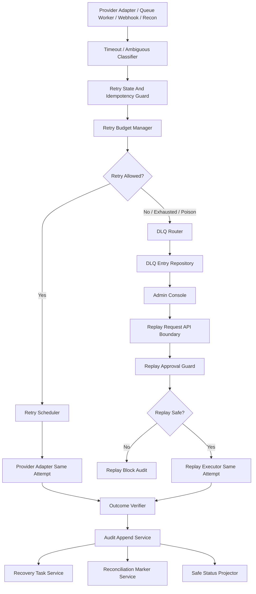

# 001110_Spec_Module_POS_Gateway_Timeout_Retry_DLQ_Replay_API_Data_Model_And_Test_Map.md

## 1. Document Control

| Field | Value |
|---|---|
| Project | yoonsul_wait_order_handoff / CatchMenu-Catch&Order |
| Band | 00100_project_foundation |
| Document Type | Spec |
| Document Layer | Module |
| Document Role | POS Gateway Timeout / Retry / DLQ / Replay API, Data Model, And Test Map |
| Parent Overview | 001090_Spec_Overview_POS_Gateway_Timeout_Retry_DLQ_And_Replay_Main_Flow.md |
| Parent Logic | 001100_Spec_Logic_POS_Gateway_Timeout_Retry_DLQ_Replay_State_Transition_And_Exception_Rule.md |
| Related Approval Package | 000990_Index_POS_Gateway_Approval_Implementation_Package_Closeout.md |
| Related Cancel Refund Package | 001080_Index_POS_Gateway_Cancel_Refund_Implementation_Package_Closeout.md |
| Related Runtime Flow Bundle | 064120_Flow_POS_Gateway_Timeout_Retry_DLQ_And_Replay.md |
| Related Module Template | 000680_Template_Development_Foundation_Module_Document.md |
| Related Source Tree Matrix | 000820_Matrix_Development_Foundation_Source_Tree_To_Module_Document_Map.md |
| Related Owner Register | 000830_Register_Development_Foundation_Repository_Module_Owner_Map.md |
| Related Restricted Register | 000750_Register_Development_Foundation_Restricted_File_And_Zone_Control.md |
| Status | Draft / Pending Codebase Hydration |
| Owner | Architecture / Engineering / QA / Compliance / Operations |
| AI Solo Change | Documentation drafting allowed; runtime implementation approval prohibited |

---

## 2. Purpose

This Module document maps POS Gateway timeout, retry, DLQ, and replay Logic rules to implementation-facing APIs, modules, data models, queues, jobs, tests, and evidence.

It is the third layer in the Development Foundation chain:

```text
Overview → Logic → Module → File → Test → Evidence
```

Actual source paths and test paths must be filled after codebase hydration.

---

## 3. Scope

### 3.1 Included

- Timeout classification module.
- Ambiguous response classifier.
- Retry eligibility guard.
- Retry budget manager.
- Retry scheduler.
- State and idempotency guard.
- Dead-letter queue router.
- DLQ entry repository.
- Replay request API boundary.
- Replay controller and approval guard.
- Outcome verifier.
- UNKNOWN recovery task manager.
- Audit append service.
- Reconciliation readiness marker.
- Customer/store/admin safe status projection.
- Test and evidence map.

### 3.2 Excluded

- Provider-specific approval/cancel/refund business rule implementation.
- Offline local ledger resync.
- Settlement dispute adjudication.
- Secret rotation.
- DB migration execution.
- Production deployment.

---

## 4. Implementation Readiness Warning

This document contains expected module boundaries and placeholder paths.

Runtime implementation is blocked until:

1. actual source paths are known,
2. actual tests are known,
3. restricted files are registered,
4. owners are assigned,
5. retry budgets and provider contracts are approved,
6. human approval exists for restricted replay/retry zones,
7. evidence targets are created.

---

## 5. Runtime Module Map

| Module | Responsibility | Related Logic Rule | Restricted Zone | Owner |
|---|---|---|---|---|
| timeout_classifier | Classifies timeout before/after provider send | R001~R002 | Conditional | Engineering / Operations |
| ambiguous_response_classifier | Classifies malformed/partial provider responses | R003 | RZ-PAY / RZ-CONTRACT | Engineering / QA |
| retry_state_idempotency_guard | Checks attempt, payload hash, terminal state, idempotency | R004~R007 | RZ-PAY | Engineering / Compliance |
| retry_budget_manager | Enforces max attempts, elapsed time, backoff, jitter, concurrency | R007~R008 | RZ-OPS | Engineering / Operations |
| retry_scheduler | Schedules controlled retry under same attempt | R007~R008 | RZ-OPS | Engineering |
| dlq_router | Routes exhausted, poison, unsafe, or unapproved messages to DLQ | R008~R010 | RZ-OPS / RZ-AUDIT | Engineering / Operations |
| dlq_entry_repository | Stores DLQ entry metadata, payload hash, owner, evidence | R009 | RZ-DB / RZ-AUDIT | Engineering / Compliance |
| replay_request_api_boundary | Receives replay/recovery requests from admin/system | R010~R012 | RZ-OPS / RZ-PAY | Engineering |
| replay_approval_guard | Validates actor authority, approval, state, idempotency, payload hash | R010~R012 | RZ-PAY / RZ-AUDIT | Engineering / Compliance |
| replay_executor | Executes approved replay as same-attempt continuation | R011~R012 | RZ-PAY | Engineering |
| outcome_verifier | Verifies final provider/reconciliation result | R014~R015 | RZ-PAY / RZ-SETTLE | Engineering / Compliance |
| unknown_recovery_task_service | Creates and tracks UNKNOWN recovery tasks | R015 | RZ-OPS | Engineering / Operations |
| retry_replay_audit_append_service | Appends timeout/retry/DLQ/replay material events | R013 | RZ-AUDIT | Engineering / Compliance |
| retry_reconciliation_marker_service | Creates reconciliation/recovery readiness marker | R014~R015 | RZ-SETTLE / RZ-AUDIT | Engineering / Compliance |
| retry_status_projector | Projects safe customer/store/admin status | R015 | Conditional | Engineering / Product |
| retry_dlq_replay_test_harness | Tests classification, retry, DLQ, replay, audit, recovery | All | Conditional | QA / Engineering |

---

## 6. Source File Map

Actual paths must be filled after hydration.

| Source File / Folder | Expected Role | Related Module | Related Logic | Test File | Evidence |
|---|---|---|---|---|---|
| TBD | Timeout classifier | timeout_classifier | R001~R002 | TBD | timeout_classification_evidence |
| TBD | Ambiguous response classifier | ambiguous_response_classifier | R003 | TBD | ambiguous_response_evidence |
| TBD | Retry state/idempotency guard | retry_state_idempotency_guard | R004~R007 | TBD | retry_guard_evidence |
| TBD | Retry budget manager | retry_budget_manager | R007~R008 | TBD | retry_budget_evidence |
| TBD | Retry scheduler | retry_scheduler | R007~R008 | TBD | retry_scheduled_evidence |
| TBD | DLQ router | dlq_router | R008~R010 | TBD | dlq_routed_evidence |
| TBD | DLQ entry repository | dlq_entry_repository | R009 | TBD | dlq_entry_evidence |
| TBD | Replay request API boundary | replay_request_api_boundary | R010~R012 | TBD | replay_request_evidence |
| TBD | Replay approval guard | replay_approval_guard | R010~R012 | TBD | replay_approval_evidence |
| TBD | Replay executor | replay_executor | R011~R012 | TBD | replay_executed_evidence |
| TBD | Outcome verifier | outcome_verifier | R014~R015 | TBD | outcome_verified_evidence |
| TBD | UNKNOWN recovery task service | unknown_recovery_task_service | R015 | TBD | recovery_task_evidence |
| TBD | Retry/replay audit append service | retry_replay_audit_append_service | R013 | TBD | audit_append_evidence |
| TBD | Reconciliation marker service | retry_reconciliation_marker_service | R014~R015 | TBD | recon_marker_evidence |
| TBD | Status projector | retry_status_projector | R015 | TBD | safe_projection_evidence |

---

## 7. API / Interface Map

### 7.1 Failure Classification Interface

| Interface | Direction | Caller | Callee | Request | Response | Related Logic |
|---|---|---|---|---|---|---|
| classifyProviderFailure | Internal | Provider Adapter / Worker | Timeout / Ambiguous Classifier | attempt_id, operation_type, error, response_hash, provider_send_state | failure_classification, unknown_required, retry_candidate | R001~R003 |

### 7.2 Retry Decision Interface

| Interface | Direction | Caller | Callee | Request | Response | Related Logic |
|---|---|---|---|---|---|---|
| evaluateRetryEligibility | Internal | Failure Classifier | Retry Guard / Budget Manager | attempt_id, operation_type, payload_hash, current_state, retry_count | retry_allowed, block_reason, schedule | R004~R008 |
| scheduleRetry | Internal | Retry Orchestrator | Retry Scheduler | attempt_id, retry_no, scheduled_at, operation_type | retry_job_id | R007~R008 |

### 7.3 DLQ Interface

| Interface | Direction | Caller | Callee | Request | Response | Related Logic |
|---|---|---|---|---|---|---|
| routeToDLQ | Internal | Retry Orchestrator / Worker | DLQ Router | attempt_id, payload_hash, reason, restricted_zone, last_error | dlq_entry_id | R008~R010 |
| readDLQEntryForReview | Internal | Admin Console | DLQ Repository | dlq_entry_id | DLQ metadata and safe payload reference | R009~R012 |

### 7.4 Replay Interface

| Interface | Direction | Caller | Callee | Request | Response | Related Logic |
|---|---|---|---|---|---|---|
| requestReplay | Internal | Admin/System | Replay Request API | dlq_entry_id or attempt_id, actor, reason, approval_ref | replay_request_id, validation_state | R010~R012 |
| approveAndExecuteReplay | Internal | Replay Controller | Replay Executor / Provider Adapter | replay_request_id, attempt_id, payload_hash, approval_ref | replay_state, result_state | R011~R012 |

---

## 8. Data Model Map

Actual schema names must be confirmed after hydration.

| Data Model / Table | Purpose | Key Fields | Related Logic | Restricted? |
|---|---|---|---|---:|
| operation_attempts | Shared attempt reference for approval/refund/provider operation | attempt_id, operation_type, entity_ref, status, idempotency_key, payload_hash | R001~R007 | Yes |
| retry_attempts | Retry schedule and execution history | retry_attempt_id, attempt_id, retry_no, scheduled_at, executed_at, result | R007~R008 | Yes |
| retry_budget_policies | Provider/operation retry configuration | provider, operation_type, max_attempts, max_elapsed, backoff, jitter | R007~R008 | Conditional |
| dlq_entries | Dead-letter queue metadata | dlq_entry_id, source_queue, attempt_id, failure_classification, payload_hash, owner_queue | R008~R010 | Yes |
| replay_requests | Replay request and approval state | replay_request_id, dlq_entry_id, attempt_id, actor, approval_ref, decision | R010~R012 | Yes |
| recovery_tasks | UNKNOWN/DLQ/replay recovery task | task_id, attempt_id, reason, owner, status, sla | R015 | Conditional |
| provider_status_checks | Read-only provider status verification | status_check_id, attempt_id, provider_ref, result, checked_at | R014~R015 | Yes |
| audit_events | Immutable audit trace | audit_event_id, event_type, entity_ref, hash/ref, created_at | R013 | Yes |
| reconciliation_markers | Reconciliation/recovery readiness | marker_id, attempt_id, provider_ref, readiness_state | R014~R015 | Yes |

---

## 9. Field-Level Rules

| Field | Required Rule |
|---|---|
| attempt_id | Required for retry/DLQ/replay correlation |
| operation_type | Must identify approval, cancel, refund, webhook, reconciliation, or provider status check |
| idempotency_key | Required for money-moving retry/replay |
| payload_hash | Required for retry/replay safety |
| failure_classification | Required before retry or DLQ decision |
| retry_count | Required before scheduling retry |
| retry_budget_policy_id | Required for scheduled retry |
| dlq_entry_id | Required for DLQ review/replay path |
| replay_request_id | Required for replay approval/execution |
| approval_ref | Required for restricted replay |
| audit_event_id | Required for material transition evidence |
| credential_ref | May be referenced but secret value must not be logged |

---

## 10. Queue / Job / Event Map

| Item | Type | Producer | Consumer | Related Logic | Retry / DLQ | Evidence |
|---|---|---|---|---|---|---|
| operation.timeout.detected | Event | Provider Adapter | Failure Classifier | R001~R002 | Classification first | timeout_evidence |
| operation.ambiguous.detected | Event | Provider Adapter | Failure Classifier | R003 | Classification first | ambiguous_response_evidence |
| retry.scheduled | Job/Event | Retry Orchestrator | Retry Scheduler | R007~R008 | Budgeted retry | retry_scheduled_evidence |
| retry.executed | Event | Retry Scheduler | Provider Adapter / Audit | R007~R008 | Same attempt only | retry_executed_evidence |
| retry.exhausted | Event | Retry Orchestrator | DLQ Router | R008 | DLQ route | retry_exhausted_evidence |
| dlq.routed | Event | DLQ Router | DLQ Repository / Audit | R009 | Review/replay path | dlq_routed_evidence |
| replay.requested | Event | Admin/System | Replay Controller | R010~R012 | Approval required | replay_request_evidence |
| replay.approved | Event | Replay Controller | Replay Executor | R011 | Same attempt only | replay_approval_evidence |
| replay.blocked | Event | Replay Controller | Audit / Admin | R010~R012 | No execution | replay_blocked_evidence |
| outcome.verified | Event | Provider Status / Replay / Retry | Ledger / Audit / Recon | R014 | Closeout path | outcome_verified_evidence |
| unknown.persisted | Event | Retry/Replay | Recovery Task Service | R015 | Recovery SLA | unknown_persistent_evidence |

---

## 11. Function / Class Responsibility Map

Expected symbols must be confirmed after hydration.

| Function / Class | Responsibility | Must Not Do | Related Logic | Test |
|---|---|---|---|---|
| classifyTimeoutFailure | Classify local timeout vs unknown after send | Must not mark final outcome | R001~R002 | timeout classification tests |
| classifyAmbiguousResponse | Classify malformed/partial provider response | Must not mark malformed as success | R003 | ambiguous response tests |
| validateRetryStateAndIdempotency | Check attempt, state, idempotency, payload hash | Must not allow duplicate money movement | R004~R007 | retry guard tests |
| evaluateRetryBudget | Check retry count/time/backoff/jitter/concurrency | Must not allow retry storm | R007~R008 | retry budget tests |
| scheduleControlledRetry | Schedule retry under same attempt | Must not create new attempt | R007~R008 | retry scheduler tests |
| routeEventToDLQ | Route unsafe/exhausted/poison messages | Must not discard evidence | R008~R010 | DLQ routing tests |
| createDLQEntry | Persist DLQ metadata and safe payload reference | Must not store secrets | R009 | DLQ entry tests |
| validateReplayRequest | Validate replay actor, approval, attempt, state, payload | Must not approve unsafe replay | R010~R012 | replay validation tests |
| executeApprovedReplay | Execute approved replay under same attempt | Must not create new money command | R011~R012 | replay execution tests |
| verifyProviderOutcome | Confirm final provider/reconciliation state | Must not guess final state | R014~R015 | outcome verification tests |
| createUnknownRecoveryTask | Create recovery task for unresolved unknown | Must not hide unknown | R015 | recovery task tests |
| appendRetryReplayAuditEvent | Append timeout/retry/DLQ/replay evidence | Must not mutate prior audit | R013 | audit tests |
| projectRetryReplayStatus | Build safe customer/store/admin status | Must not show UNKNOWN as completed | R015 | projection tests |

---

## 12. Error Handling Map

| Error Type | Module Behavior | User/Store/Admin Behavior | Evidence |
|---|---|---|---|
| Timeout before send | Local timeout classification; safe retry/failure | Processing or retry pending | local_timeout_evidence |
| Timeout after send | UNKNOWN external state | Pending verification | unknown_after_send_evidence |
| Malformed response | Ambiguous classification | Pending verification / admin review | ambiguous_response_evidence |
| Missing idempotency | Block retry/replay; DLQ/review | Admin review | idempotency_missing_evidence |
| Payload hash conflict | Block retry/replay | Admin/security review | payload_conflict_evidence |
| Terminal state | Block write retry; allow read-only verification | Admin review if needed | terminal_state_block_evidence |
| Retry budget exhausted | DLQ route | Admin/Ops review | retry_exhausted_evidence |
| Poison message | DLQ route | Admin/Ops review | poison_message_evidence |
| Replay without approval | Block replay | Admin approval required | replay_blocked_evidence |
| Audit append failure | Incident + no closeout | Admin/compliance review | audit_append_failure_evidence |
| Outcome still unknown | Recovery task remains open | Pending verification | unknown_persistent_evidence |

---

## 13. Security Implementation Map

| Security Control | Implementation Point | Test | Evidence |
|---|---|---|---|
| Idempotency required for money-moving replay | retry_state_idempotency_guard / replay_approval_guard | missing_idempotency_test | idempotency_missing_evidence |
| Payload hash conflict block | retry_state_idempotency_guard | payload_hash_conflict_test | payload_conflict_evidence |
| Terminal state write-retry block | retry_state_idempotency_guard | terminal_state_retry_block_test | terminal_state_block_evidence |
| Replay approval guard | replay_approval_guard | replay_without_approval_test | replay_blocked_evidence |
| No raw secret in DLQ | dlq_entry_repository | dlq_secret_masking_test | secret_masking_evidence |
| Retry storm prevention | retry_budget_manager | retry_storm_test | retry_budget_evidence |
| Safe UNKNOWN projection | retry_status_projector | projection_guard_test | safe_projection_evidence |
| Restricted file gate | 00750 register | diff review | restricted_zone_evidence |

---

## 14. Test Map

| Test Type | Required Scenarios | Candidate Test File | Evidence |
|---|---|---|---|
| Unit | failure classification, retry eligibility, retry budget, DLQ routing, replay validation | TBD | unit_test_report |
| Integration | timeout → retry → ledger/audit/recon; DLQ → replay controller → outcome verification | TBD | integration_test_report |
| Contract | provider timeout, malformed response, late response, status re-query | TBD | contract_test_report |
| Fault Injection | network loss, queue failure, poison message, audit failure, ledger failure | TBD | fault_test_report |
| Security | replay without approval, payload mismatch, missing idempotency, secret masking | TBD | security_test_report |
| Audit | every retry/DLQ/replay transition creates audit event | TBD | audit_test_report |
| Reconciliation | UNKNOWN and verified outcomes create correct recovery/recon markers | TBD | reconciliation_test_report |
| Regression | no duplicate approval/refund from retry/replay | TBD | regression_test_report |

---

## 15. Traceability Matrix

| Flow Step | Logic Rule | Module | Source File | Function/Class | Test | Evidence |
|---|---|---|---|---|---|---|
| Detect timeout | R001~R002 | timeout_classifier | TBD | classifyTimeoutFailure | TBD | timeout_classification_evidence |
| Detect ambiguous response | R003 | ambiguous_response_classifier | TBD | classifyAmbiguousResponse | TBD | ambiguous_response_evidence |
| Check retry guard | R004~R007 | retry_state_idempotency_guard | TBD | validateRetryStateAndIdempotency | TBD | retry_guard_evidence |
| Check retry budget | R007~R008 | retry_budget_manager | TBD | evaluateRetryBudget | TBD | retry_budget_evidence |
| Schedule retry | R007~R008 | retry_scheduler | TBD | scheduleControlledRetry | TBD | retry_scheduled_evidence |
| Route DLQ | R008~R010 | dlq_router | TBD | routeEventToDLQ | TBD | dlq_routed_evidence |
| Store DLQ entry | R009 | dlq_entry_repository | TBD | createDLQEntry | TBD | dlq_entry_evidence |
| Request replay | R010~R012 | replay_request_api_boundary | TBD | requestReplay | TBD | replay_request_evidence |
| Approve/block replay | R010~R012 | replay_approval_guard | TBD | validateReplayRequest | TBD | replay_approval_or_block_evidence |
| Execute replay | R011~R012 | replay_executor | TBD | executeApprovedReplay | TBD | replay_executed_evidence |
| Verify outcome | R014~R015 | outcome_verifier | TBD | verifyProviderOutcome | TBD | outcome_verified_evidence |
| Create UNKNOWN recovery task | R015 | unknown_recovery_task_service | TBD | createUnknownRecoveryTask | TBD | recovery_task_evidence |
| Append audit | R013 | retry_replay_audit_append_service | TBD | appendRetryReplayAuditEvent | TBD | audit_append_evidence |
| Create recon marker | R014~R015 | retry_reconciliation_marker_service | TBD | createRetryReplayReconciliationMarker | TBD | recon_marker_evidence |
| Project safe status | R015 | retry_status_projector | TBD | projectRetryReplayStatus | TBD | safe_projection_evidence |

---

## 16. Mermaid Module Diagram



---

## 17. Code Handoff Requirements

Before any implementation:

- [ ] Actual source paths are filled.
- [ ] Restricted paths are registered in 00750.
- [ ] Module owners are confirmed in 00830.
- [ ] Test files are identified.
- [ ] Evidence packet target is defined.
- [ ] Retry budgets are approved.
- [ ] DLQ ownership and SLA are approved.
- [ ] Replay approval policy is approved.
- [ ] Human approval exists for restricted replay/retry changes.
- [ ] Timeout/retry/DLQ/replay handoff readiness checklist is passed.
- [ ] Bounded Claude/Cursor prompts are prepared.

---

## 18. Open Questions

| Question | Owner | Blocking? |
|---|---|---:|
| What are the actual source paths for retry/DLQ/replay modules? | Engineering | Yes |
| What provider operations permit write retry? | Architecture / Compliance | Yes |
| What is the first retry budget policy? | Operations / Architecture | Yes |
| How are retry budgets configured per provider? | Engineering / Operations | Yes |
| What DLQ storage and owner queue will be canonical? | Engineering / Operations | Yes |
| Who may approve replay? | Product / Compliance / Operations | Yes |
| What is the canonical audit event for replay decision? | Compliance / Engineering | Yes |
| Which test framework is used? | Engineering / QA | Yes |

---

## 19. Summary

This Module document maps POS Gateway timeout/retry/DLQ/replay logic to expected implementation surfaces.

It is not yet a code handoff packet.

Implementation requires actual hydration results and the complete chain:

```text
Overview → Logic → Module → File → Test → Evidence
```

along with the parent Runtime Flow Bundle chain:

```text
Flow Step → Module → File → Test → Evidence
```
