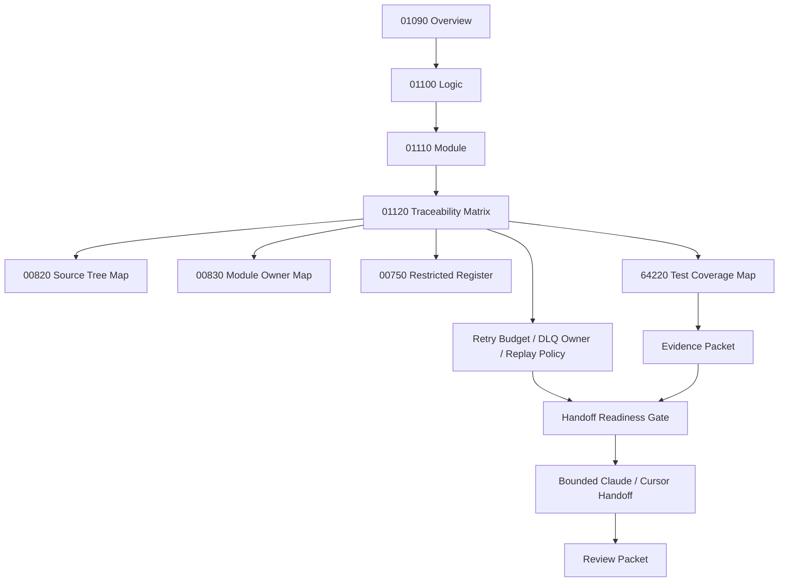

# 001120_Matrix_POS_Gateway_Timeout_Retry_DLQ_Replay_Overview_Logic_Module_To_Flow_Bundle_Traceability.md

## 1. Document Control

| Field | Value |
|---|---|
| Project | yoonsul_wait_order_handoff / CatchMenu-Catch&Order |
| Band | 00100_project_foundation |
| Document Type | Matrix |
| Document Role | POS Gateway Timeout / Retry / DLQ / Replay Overview / Logic / Module To Flow Bundle Traceability |
| Related Overview | 001090_Spec_Overview_POS_Gateway_Timeout_Retry_DLQ_And_Replay_Main_Flow.md |
| Related Logic | 001100_Spec_Logic_POS_Gateway_Timeout_Retry_DLQ_Replay_State_Transition_And_Exception_Rule.md |
| Related Module | 001110_Spec_Module_POS_Gateway_Timeout_Retry_DLQ_Replay_API_Data_Model_And_Test_Map.md |
| Related Approval Package Traceability | 000940_Matrix_POS_Gateway_Approval_Overview_Logic_Module_To_Flow_Bundle_Traceability.md |
| Related Cancel Refund Package Traceability | 001030_Matrix_POS_Gateway_Cancel_Refund_Overview_Logic_Module_To_Flow_Bundle_Traceability.md |
| Related Development Foundation Traceability | 000690_Matrix_Development_Foundation_Overview_Logic_Module_Traceability.md |
| Related Source Tree Matrix | 000820_Matrix_Development_Foundation_Source_Tree_To_Module_Document_Map.md |
| Related Runtime Flow Bundle | 064120_Flow_POS_Gateway_Timeout_Retry_DLQ_And_Replay.md |
| Related Flow Registry | 064000_Index_Runtime_Flow_Bundle_Registry.md |
| Related Flow Module Map | 064210_Matrix_Flow_To_Module_Implementation_Map.md |
| Related Flow Test Map | 064220_Matrix_Flow_To_Test_Coverage_Map.md |
| Status | Draft / Hydration Required |
| Owner | Architecture / Engineering / QA / Compliance / Operations |
| AI Solo Change | Documentation mapping allowed; runtime implementation approval prohibited |

---

## 2. Purpose

This matrix connects the POS Gateway Timeout / Retry / DLQ / Replay `Overview → Logic → Module` document set to the parent Runtime Flow Bundle.

It ensures the implementation package is not driven by a single document.

The required development chain is:

```text
Overview → Logic → Module → File → Test → Evidence
```

The parent Runtime Flow Bundle chain is:

```text
Flow Step → Module → File → Test → Evidence
```

This matrix bridges those two chains for timeout, retry, DLQ, and replay.

---

## 3. Traceability Scope

### 3.1 Included

- 01090 Overview flow steps.
- 01100 Logic rules.
- 01110 Module mappings.
- 64120 Runtime Flow Bundle alignment.
- Test coverage expectations.
- Evidence expectations.
- Restricted-zone awareness.
- Hydration-dependent TBD fields.

### 3.2 Excluded

- Actual source code changes.
- Actual DB migration.
- Provider credential handling.
- Production release approval.
- Provider-specific approval/refund business logic.
- Offline local ledger resync.
- Settlement dispute adjudication.

---

## 4. Traceability Matrix

| Trace ID | Overview Flow Step | Logic Rule | Module | Source File | Test Coverage | Evidence | Runtime Flow Step | Status |
|---|---|---|---|---|---|---|---|---|
| POSTRDR-TRACE-001 | Timeout detected before/after provider send | R001~R002 | timeout_classifier | TBD | timeout classification test | timeout_classification_evidence | Timeout detection | Draft |
| POSTRDR-TRACE-002 | Ambiguous provider response detected | R003 | ambiguous_response_classifier | TBD | ambiguous response test | ambiguous_response_evidence | Ambiguous response classification | Draft |
| POSTRDR-TRACE-003 | Missing idempotency blocks retry/replay | R004 | retry_state_idempotency_guard | TBD | missing idempotency test | idempotency_missing_evidence | Idempotency safety gate | Draft |
| POSTRDR-TRACE-004 | Payload hash conflict blocks retry/replay | R005 | retry_state_idempotency_guard | TBD | payload conflict test | payload_conflict_evidence | Payload conflict block | Draft |
| POSTRDR-TRACE-005 | Terminal state blocks write retry | R006 | retry_state_idempotency_guard | TBD | terminal state retry block test | terminal_state_block_evidence | Terminal state guard | Draft |
| POSTRDR-TRACE-006 | Retry eligibility decision | R007 | retry_state_idempotency_guard / retry_budget_manager | TBD | retry eligibility test | retry_eligibility_evidence | Retry eligibility | Draft |
| POSTRDR-TRACE-007 | Retry budget exhausted | R008 | retry_budget_manager / dlq_router | TBD | retry budget exhausted test | retry_exhausted_evidence | Retry exhaustion | Draft |
| POSTRDR-TRACE-008 | Poison/non-retryable message routed to DLQ | R009 | dlq_router / dlq_entry_repository | TBD | DLQ routing test | dlq_routed_evidence | DLQ routing | Draft |
| POSTRDR-TRACE-009 | Replay requested | R010~R012 | replay_request_api_boundary | TBD | replay request validation test | replay_request_evidence | Replay request intake | Draft |
| POSTRDR-TRACE-010 | Replay approval/block decision | R010~R012 | replay_approval_guard | TBD | replay without approval / unsafe replay test | replay_approval_or_block_evidence | Replay safety gate | Draft |
| POSTRDR-TRACE-011 | Replay executed under same attempt | R011~R012 | replay_executor | TBD | same-attempt replay test | replay_executed_evidence | Controlled replay execution | Draft |
| POSTRDR-TRACE-012 | Audit append after retry/DLQ/replay event | R013 | retry_replay_audit_append_service | TBD | audit append/immutability test | audit_append_evidence | Audit ledger append | Draft |
| POSTRDR-TRACE-013 | Outcome verified | R014 | outcome_verifier | TBD | outcome verification test | outcome_verified_evidence | Outcome verification | Draft |
| POSTRDR-TRACE-014 | UNKNOWN persists and recovery task remains open | R015 | unknown_recovery_task_service | TBD | UNKNOWN persistence recovery test | unknown_persistent_evidence | UNKNOWN recovery | Draft |
| POSTRDR-TRACE-015 | Reconciliation marker created | R014~R015 | retry_reconciliation_marker_service | TBD | reconciliation marker test | recon_marker_evidence | Reconciliation readiness | Draft |
| POSTRDR-TRACE-016 | Safe customer/store/admin projection | R015 | retry_status_projector | TBD | safe projection test | safe_projection_evidence | Status projection | Draft |
| POSTRDR-TRACE-017 | Evidence packet closeout | R001~R015 | retry_dlq_replay_test_harness / evidence packet | TBD | evidence completeness review | timeout_retry_dlq_replay_evidence_packet | Flow evidence closeout | Draft |

---

## 5. Status Values

| Status | Meaning |
|---|---|
| Draft | Proposed trace row |
| Mapped | Overview, Logic, Module, and Flow Step are linked |
| Hydration Required | Actual source/test paths are still unknown |
| Test Ready | Test target is known |
| Evidence Ready | Evidence target is known |
| Approved | Ready for implementation handoff |
| Blocked | Missing document, source path, test, evidence, or approval |
| Deprecated | Replaced but retained for audit history |

---

## 6. Hydration Dependency

This matrix is not implementation-ready until actual paths are added from codebase hydration.

Required hydration sources:

| Required Source | Document |
|---|---|
| Actual source paths | 000840_Evidence_Development_Foundation_First_Codebase_Hydration_Report.md or later hydration packet |
| Source-to-module rows | 000820_Matrix_Development_Foundation_Source_Tree_To_Module_Document_Map.md |
| Module owner rows | 000830_Register_Development_Foundation_Repository_Module_Owner_Map.md |
| Restricted file rows | 000750_Register_Development_Foundation_Restricted_File_And_Zone_Control.md |
| Actual test paths | 064220_Matrix_Flow_To_Test_Coverage_Map.md or hydration output |

---

## 7. Restricted-Zone Traceability

| Trace ID | Restricted Area | AI Solo Allowed? | Human Approval Required? |
|---|---|---:|---:|
| POSTRDR-TRACE-003 | Idempotency for money-moving retry/replay | No | Yes |
| POSTRDR-TRACE-004 | Payload conflict / duplicate prevention | No | Yes |
| POSTRDR-TRACE-005 | Terminal financial state guard | No | Yes |
| POSTRDR-TRACE-006 | Retry eligibility for money movement | No | Yes |
| POSTRDR-TRACE-008 | DLQ routing for restricted events | No | Yes |
| POSTRDR-TRACE-010 | Replay approval/block decision | No | Yes |
| POSTRDR-TRACE-011 | Replay execution | No | Yes |
| POSTRDR-TRACE-012 | Audit ledger append | No | Yes |
| POSTRDR-TRACE-013 | Outcome verification | No | Yes |
| POSTRDR-TRACE-015 | Reconciliation readiness | No | Yes |

Any implementation touching these rows must pass No-AI-Solo approval.

---

## 8. Test Coverage Requirements By Trace Row

| Trace ID | Minimum Test Types |
|---|---|
| POSTRDR-TRACE-001 | Unit, fault injection |
| POSTRDR-TRACE-002 | Unit, contract |
| POSTRDR-TRACE-003 | Unit, security |
| POSTRDR-TRACE-004 | Unit, security |
| POSTRDR-TRACE-005 | Unit, regression |
| POSTRDR-TRACE-006 | Unit, integration |
| POSTRDR-TRACE-007 | Unit, fault injection |
| POSTRDR-TRACE-008 | Integration, DLQ, operations |
| POSTRDR-TRACE-009 | Unit, security |
| POSTRDR-TRACE-010 | Unit, security, approval |
| POSTRDR-TRACE-011 | Integration, replay, regression |
| POSTRDR-TRACE-012 | Audit, immutability |
| POSTRDR-TRACE-013 | Integration, reconciliation |
| POSTRDR-TRACE-014 | Recovery, SLA, fault injection |
| POSTRDR-TRACE-015 | Integration, reconciliation |
| POSTRDR-TRACE-016 | Unit, regression |
| POSTRDR-TRACE-017 | Evidence review |

---

## 9. Evidence Requirements By Trace Row

| Trace ID | Evidence |
|---|---|
| POSTRDR-TRACE-001 | local_timeout_evidence, unknown_after_send_evidence |
| POSTRDR-TRACE-002 | ambiguous_response_evidence |
| POSTRDR-TRACE-003 | idempotency_missing_evidence |
| POSTRDR-TRACE-004 | payload_conflict_evidence |
| POSTRDR-TRACE-005 | terminal_state_block_evidence |
| POSTRDR-TRACE-006 | retry_eligibility_evidence |
| POSTRDR-TRACE-007 | retry_exhausted_evidence |
| POSTRDR-TRACE-008 | poison_message_evidence, dlq_routed_evidence |
| POSTRDR-TRACE-009 | replay_request_evidence |
| POSTRDR-TRACE-010 | replay_approval_evidence, replay_blocked_evidence |
| POSTRDR-TRACE-011 | replay_executed_evidence |
| POSTRDR-TRACE-012 | audit_append_evidence |
| POSTRDR-TRACE-013 | outcome_verified_evidence |
| POSTRDR-TRACE-014 | unknown_persistent_evidence, recovery_task_evidence |
| POSTRDR-TRACE-015 | recon_marker_evidence |
| POSTRDR-TRACE-016 | safe_projection_evidence |
| POSTRDR-TRACE-017 | timeout_retry_dlq_replay_evidence_packet |

---

## 10. Code Handoff Readiness Check

This POS Gateway Timeout / Retry / DLQ / Replay package is ready for code handoff only when:

- [ ] 01090 Overview is reviewed.
- [ ] 01100 Logic is reviewed.
- [ ] 01110 Module map is reviewed.
- [ ] 01120 Traceability matrix is updated with actual source paths.
- [ ] 00820 source tree mapping has actual file rows.
- [ ] 00830 owner map has actual module owners.
- [ ] 00750 restricted register has actual restricted files.
- [ ] 64220 test map has actual or planned test rows.
- [ ] Retry budget policy is approved.
- [ ] DLQ owner and SLA are approved.
- [ ] Replay approval policy is approved.
- [ ] Evidence packet target is defined.
- [ ] Human approval exists for restricted rows.
- [ ] Timeout/retry/DLQ/replay handoff readiness checklist is passed.

---

## 11. Mermaid Traceability Diagram



---

## 12. Relationship With Approval And Cancel/Refund Packages

Timeout/retry/DLQ/replay protects both upstream money flows.

| Dependency | Source |
|---|---|
| Approval attempt state | 00910~00990 Approval package |
| Cancel/refund attempt state | 01000~01080 Cancel/Refund package |
| Approval idempotency key and payload hash | Approval module and ledger |
| Refund idempotency key and payload hash | Cancel/refund module and ledger |
| Provider request/response reference | Approval and cancel/refund evidence |
| Audit chain continuity | Approval and cancel/refund audit evidence |
| Reconciliation baseline | Approval and cancel/refund reconciliation markers |

Replay must never create a new independent financial command when the original package requires same-attempt continuation.

---

## 13. Open Questions

| Question | Owner | Blocking? |
|---|---|---:|
| What are actual timeout/retry/DLQ/replay source paths? | Engineering | Yes |
| Which operations allow idempotent write retry? | Architecture / Compliance | Yes |
| What retry budget applies per operation/provider? | Operations / Architecture | Yes |
| What DLQ storage and owner queue are canonical? | Engineering / Operations | Yes |
| Who can approve replay of money-moving events? | Product / Compliance / Operations | Yes |
| What is the canonical replay audit event schema? | Compliance / Engineering | Yes |
| Where is final evidence packet stored? | QA / Compliance | Yes |

---

## 14. Summary

This matrix confirms that POS Gateway Timeout / Retry / DLQ / Replay is represented as a connected implementation package:

```text
01090 Overview
  ↓
01100 Logic
  ↓
01110 Module
  ↓
01120 Traceability
  ↓
Source / Test / Evidence / Gate
```

It is not code-handoff ready until real source paths, tests, owners, policies, restricted approvals, and evidence targets are filled after hydration.
