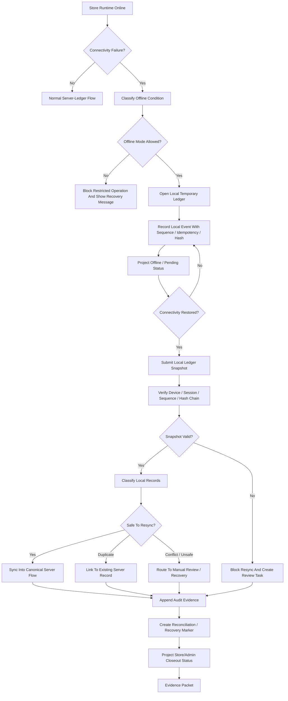
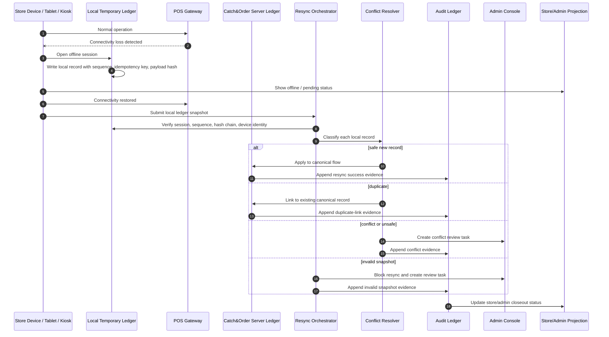

# 001180_Spec_Overview_POS_Gateway_Store_Offline_Local_Ledger_And_Resync_Main_Flow.md

## 1. Document Control

| Field | Value |
|---|---|
| Project | yoonsul_wait_order_handoff / CatchMenu-Catch&Order |
| Band | 00100_project_foundation |
| Document Type | Spec |
| Document Layer | Overview |
| Document Role | POS Gateway Store Offline / Local Ledger / Resync Main Flow Overview |
| Related Approval Package Closeout | 000990_Index_POS_Gateway_Approval_Implementation_Package_Closeout.md |
| Related Cancel Refund Package Closeout | 001080_Index_POS_Gateway_Cancel_Refund_Implementation_Package_Closeout.md |
| Related Timeout Retry DLQ Replay Closeout | 001170_Index_POS_Gateway_Timeout_Retry_DLQ_Replay_Implementation_Package_Closeout.md |
| Related Runtime Flow Bundle | 064130_Flow_POS_Gateway_Store_Offline_Local_Ledger_And_Resync.md |
| Related Flow Registry | 064000_Index_Runtime_Flow_Bundle_Registry.md |
| Related Development Foundation Model | 000640_Policy_Development_Foundation_Overview_Logic_Module_Documentation_Model.md |
| Related Traceability Matrix | 000690_Matrix_Development_Foundation_Overview_Logic_Module_Traceability.md |
| Next Logic Document | 001190_Spec_Logic_POS_Gateway_Store_Offline_Local_Ledger_Resync_State_Transition_And_Exception_Rule.md |
| Next Module Document | 001200_Spec_Module_POS_Gateway_Store_Offline_Local_Ledger_Resync_API_Data_Model_And_Test_Map.md |
| Status | Draft |
| Owner | Product / Architecture / Engineering / QA / Compliance / Operations |
| AI Solo Change | Documentation drafting allowed; runtime implementation approval prohibited |

---

## 2. Purpose

This overview defines the POS Gateway Store Offline / Local Ledger / Resync main flow for CatchMenu / Catch&Order.

It covers how the runtime behaves when the store network, POS connection, provider connection, local tablet, kiosk, or gateway path becomes unavailable and temporary local records must later be reconciled with the canonical server ledger.

This document is the `Overview` layer of the Development Foundation chain:

```text
Overview → Logic → Module → File → Test → Evidence
```

It must be followed by Logic and Module documents before implementation handoff.

---

## 3. Scope

### 3.1 Included

- Store offline detection.
- Local temporary ledger boundary.
- Local order/payment handoff record creation.
- Local sequence and idempotency key assignment.
- Offline-safe status projection.
- Resync eligibility.
- Conflict detection.
- Duplicate prevention during resync.
- Canonical server ledger reconciliation.
- POS/provider late response handling.
- Audit evidence.
- Recovery task creation.
- Store/admin review flow.
- Evidence packet requirements.

### 3.2 Excluded

- Fully offline card payment authorization without provider approval.
- Provider-specific offline payment scheme.
- Cash handling policy.
- Manual settlement dispute adjudication.
- Secret rotation.
- DB migration execution.
- Production deployment.
- Hardware device procurement.

---

## 4. Business Intent

Store offline handling exists because restaurant operations do not stop just because network infrastructure fails.

However, offline handling must not create fake financial certainty.

Core goal:

```text
Allow the store to continue operationally where safe, but never fabricate provider approval, refund completion, settlement certainty, or audit finality.
```

The system must prevent:

- duplicate order submission,
- duplicate approval,
- duplicate refund,
- fake completed payment,
- local-only record treated as canonical,
- local ledger tampering,
- resync overwrite of verified server state,
- missing audit trail,
- hidden offline backlog,
- late provider response conflict.

---

## 5. Primary Actors And Systems

| Actor / System | Role |
|---|---|
| Store Device / Tablet / Kiosk | May create local temporary records during connectivity failure |
| POS Gateway | Detects connectivity failure and later coordinates resync |
| Local Temporary Ledger | Holds bounded offline records with hashes and sequence |
| Catch&Order Server Ledger | Canonical ledger and final state owner |
| POS / KDS | May receive local operational handoff where allowed |
| Provider Adapter | Handles provider status verification after reconnect |
| Resync Orchestrator | Validates and replays local records into canonical flow |
| Conflict Resolver | Detects duplicate/conflicting records |
| Audit Ledger | Records offline, local, resync, conflict, and closeout evidence |
| Admin Console | Reviews offline backlog and conflicts |
| Store Staff | Operates degraded mode and resolves manual exceptions |
| Human Approver | Approves restricted resync or conflict resolution where required |

---

## 6. High-Level Flow

```text
1. Store runtime detects loss of server, POS, provider, or gateway connectivity.
2. System enters offline/degraded mode if policy allows.
3. Local Temporary Ledger is opened with store_id, device_id, session_id, sequence, and hash chain.
4. Operational events are recorded locally with idempotency keys and payload hashes.
5. UI clearly projects offline/pending state; it must not show provider-approved payment unless already verified.
6. When connectivity returns, Resync Orchestrator requests local ledger snapshot.
7. Snapshot integrity, sequence, device identity, session boundary, and payload hash chain are verified.
8. Each local record is classified as new, duplicate, conflicting, stale, unsafe, or manual-review-required.
9. Safe records are synchronized into the server canonical flow.
10. Unsafe or conflicting records are blocked and routed to recovery/manual review.
11. Server ledger, audit ledger, and reconciliation markers are updated.
12. Store/admin UI receives closeout or recovery status.
13. Evidence packet records offline session, local ledger, resync decision, conflict, audit, and final outcome.
```

---

## 7. Runtime Flow Diagram



---

## 8. Runtime Sequence Diagram



---

## 9. Offline Condition Types

Detailed state rules must be defined in:

```text
001190_Spec_Logic_POS_Gateway_Store_Offline_Local_Ledger_Resync_State_Transition_And_Exception_Rule.md
```

High-level condition types:

| Condition | Meaning |
|---|---|
| SERVER_UNREACHABLE | Store device cannot reach Catch&Order server |
| POS_UNREACHABLE | Store device or gateway cannot reach POS |
| PROVIDER_UNREACHABLE | Provider or PG/VAN path is unavailable |
| LOCAL_DEVICE_ONLY | Store device can operate locally but cannot sync |
| PARTIAL_CONNECTIVITY | Some systems reachable, others not |
| LATE_PROVIDER_RESPONSE | Provider response arrives after local/offline decision |
| LOCAL_LEDGER_CORRUPT | Local ledger integrity check fails |
| LOCAL_LEDGER_CONFLICT | Local record conflicts with canonical server state |
| RESYNC_PENDING | Local records wait for server sync |
| RESYNC_BLOCKED | Local records require review or approval |
| RESYNC_CLOSED | Offline session safely closed with evidence |

---

## 10. Offline Operation Boundary

| Operation | Offline Allowed? | Notes |
|---|---:|---|
| Local order draft capture | Conditional | Store policy and device identity required |
| Local kitchen handoff note | Conditional | Must be marked local/pending |
| Customer-facing payment success | No | Must not fabricate provider approval |
| Provider approval request | No if provider unreachable | May only resume when verified connectivity exists |
| Refund execution | No | Refund requires canonical state and provider confirmation |
| Local status projection | Yes | Must show offline/pending, not final |
| Local queue/order sequence | Conditional | Must use device/session sequence and hash chain |
| Resync into server ledger | Conditional | Requires validation, conflict checks, audit |
| Manual conflict resolution | Conditional | Requires human approval |
| Offline settlement closeout | No | Settlement requires canonical/reconciliation evidence |

---

## 11. Local Temporary Ledger Boundary

Local Temporary Ledger is not the canonical ledger.

It may store:

- offline session metadata,
- local event sequence,
- local order/request snapshot,
- idempotency key,
- payload hash,
- device identity reference,
- local timestamp,
- staff/operator reference where available,
- offline status projection,
- sync status,
- evidence reference.

It must not store:

- raw secrets,
- provider credentials,
- unmasked payment credentials,
- unverified final approval status,
- unverified refund completion,
- permanent settlement finality.

---

## 12. Resync Boundary

Resync may be allowed only when:

1. store_id is known,
2. device_id is known,
3. offline session is known,
4. local sequence is complete or gaps are explained,
5. local payload hash chain is valid,
6. idempotency keys are present for mutation-like records,
7. canonical server state is checked before apply,
8. duplicate detection passes,
9. conflict detection passes,
10. restricted approval exists where required,
11. audit event is appended,
12. evidence target exists.

Resync must be blocked when:

- local ledger integrity fails,
- local sequence has unexplained gaps,
- device identity is unknown,
- local record conflicts with verified server state,
- local record would create duplicate approval/refund,
- local record claims final provider success without proof,
- idempotency key is missing for mutation,
- policy or approval is missing,
- evidence target is missing.

---

## 13. Major Control Points

| Control Point | Purpose |
|---|---|
| Offline condition classification | Distinguish server/POS/provider/device failures |
| Offline mode policy | Decide what can continue locally |
| Local ledger open/close | Bound offline session |
| Device identity guard | Prevent rogue local ledger |
| Local sequence guard | Detect dropped/reordered local records |
| Payload hash chain | Detect tampering |
| Idempotency guard | Prevent duplicate mutation during resync |
| Canonical state check | Prevent overwrite of verified server state |
| Conflict resolver | Route unsafe records to review |
| Audit append | Preserve offline/resync evidence |
| Safe projection | Prevent fake payment/refund completion |
| Reconciliation marker | Ensure final server/provider consistency |

---

## 14. No-AI-Solo Zone

This flow touches restricted runtime operations.

| Area | AI Solo Allowed? | Human Approval Required? |
|---|---:|---:|
| Local ledger integrity model | No | Yes |
| Resync of money-adjacent records | No | Yes |
| Conflict resolution affecting order/payment/refund state | No | Yes |
| Duplicate prevention guard | No | Yes |
| Server canonical ledger merge | No | Yes |
| Audit ledger append behavior | No | Yes |
| Reconciliation closeout | No | Yes |
| DB migration/schema change | No | Yes |
| Secret/credential handling | No | Yes |
| Production release/deploy | No | Yes |

AI may assist with documentation, mapping, read-only inspection, and diff review.  
AI may not independently approve local ledger merge, resync, conflict resolution, or canonical ledger mutation.

---

## 15. Related Flow Bundle Documents

| Document | Relationship |
|---|---|
| 064000_Index_Runtime_Flow_Bundle_Registry.md | Runtime Flow Bundle registry |
| 064130_Flow_POS_Gateway_Store_Offline_Local_Ledger_And_Resync.md | Parent store offline/local ledger/resync flow |
| 064100_Flow_POS_Gateway_Approval_To_Audit_Ledger_And_Reconciliation.md | Upstream approval flow |
| 064110_Flow_POS_Gateway_Cancel_Refund_Recovery_And_Audit.md | Upstream cancel/refund flow |
| 064120_Flow_POS_Gateway_Timeout_Retry_DLQ_And_Replay.md | Related timeout/retry/replay recovery flow |
| 064200_Matrix_Flow_To_MD_Dependency_Graph.md | Dependency graph |
| 064210_Matrix_Flow_To_Module_Implementation_Map.md | Runtime module map |
| 064220_Matrix_Flow_To_Test_Coverage_Map.md | Runtime test coverage map |
| 064300_Checklist_Flow_Bundle_Code_Handoff_Readiness_Gate.md | Runtime handoff readiness |
| 064370_Governance_Flow_Bundle_Human_Approval_And_No_AI_Solo_Zone_Control.md | Human approval / No-AI-Solo control |
| 064390_Checklist_Flow_Bundle_Pre_Merge_And_Release_Gate.md | Pre-merge/release gate |

---

## 16. Required Downstream Documents

This overview is incomplete as an implementation package until the following exist:

| Required Document | Purpose |
|---|---|
| 001190_Spec_Logic_POS_Gateway_Store_Offline_Local_Ledger_Resync_State_Transition_And_Exception_Rule.md | Defines offline state transitions, local ledger rules, resync eligibility, conflict handling, audit, and recovery rules |
| 001200_Spec_Module_POS_Gateway_Store_Offline_Local_Ledger_Resync_API_Data_Model_And_Test_Map.md | Maps logic to APIs, modules, data models, queues, jobs, tests, and evidence |
| 001210_Matrix_POS_Gateway_Store_Offline_Local_Ledger_Resync_Overview_Logic_Module_To_Flow_Bundle_Traceability.md | Connects Overview/Logic/Module to Flow Bundle |
| 001220_Checklist_POS_Gateway_Store_Offline_Local_Ledger_Resync_Code_Handoff_Readiness.md | Determines handoff readiness |
| 001230_Template_POS_Gateway_Store_Offline_Local_Ledger_Resync_Claude_Code_Handoff_Prompt.md | Provides bounded Claude handoff |
| 001240_Template_POS_Gateway_Store_Offline_Local_Ledger_Resync_Cursor_IDE_File_Level_Assist_Prompt.md | Provides bounded Cursor assist |
| 001250_Evidence_POS_Gateway_Store_Offline_Local_Ledger_Resync_Code_Handoff_And_Review_Packet.md | Records handoff/review evidence |
| 001260_Index_POS_Gateway_Store_Offline_Local_Ledger_Resync_Implementation_Package_Closeout.md | Closes the package |

---

## 17. Implementation Readiness Status

| Readiness Item | Status |
|---|---|
| Overview defined | Draft |
| Logic defined | Pending 01190 |
| Module mapped | Pending 01200 and hydration |
| Source files known | Pending hydration |
| Tests known | Pending hydration/test map |
| Evidence target known | Pending implementation ticket |
| Restricted approval ready | Pending human approval |
| Ready for code handoff | No |

---

## 18. Open Questions

| Question | Owner | Blocking? |
|---|---|---:|
| Which operations are allowed during store offline mode? | Product / Compliance / Operations | Yes |
| What device identity is trusted for local ledger creation? | Security / Engineering | Yes |
| What is the local ledger storage boundary? | Architecture / Engineering | Yes |
| How is the local hash chain formed and verified? | Architecture / Security | Yes |
| What local data retention policy applies? | Compliance / Operations | Yes |
| What conflicts require human approval? | Product / Compliance | Yes |
| What is the first safe test environment for offline/resync? | Engineering / QA | Yes |

---

## 19. Summary

This Overview document defines the high-level POS Gateway store offline, local ledger, and resync path.

It must not be used alone as an implementation instruction.

Implementation may proceed only after the chain is complete:

```text
Overview → Logic → Module → File → Test → Evidence
```

and the parent Runtime Flow Bundle gate confirms:

```text
Flow Step → Module → File → Test → Evidence
```
