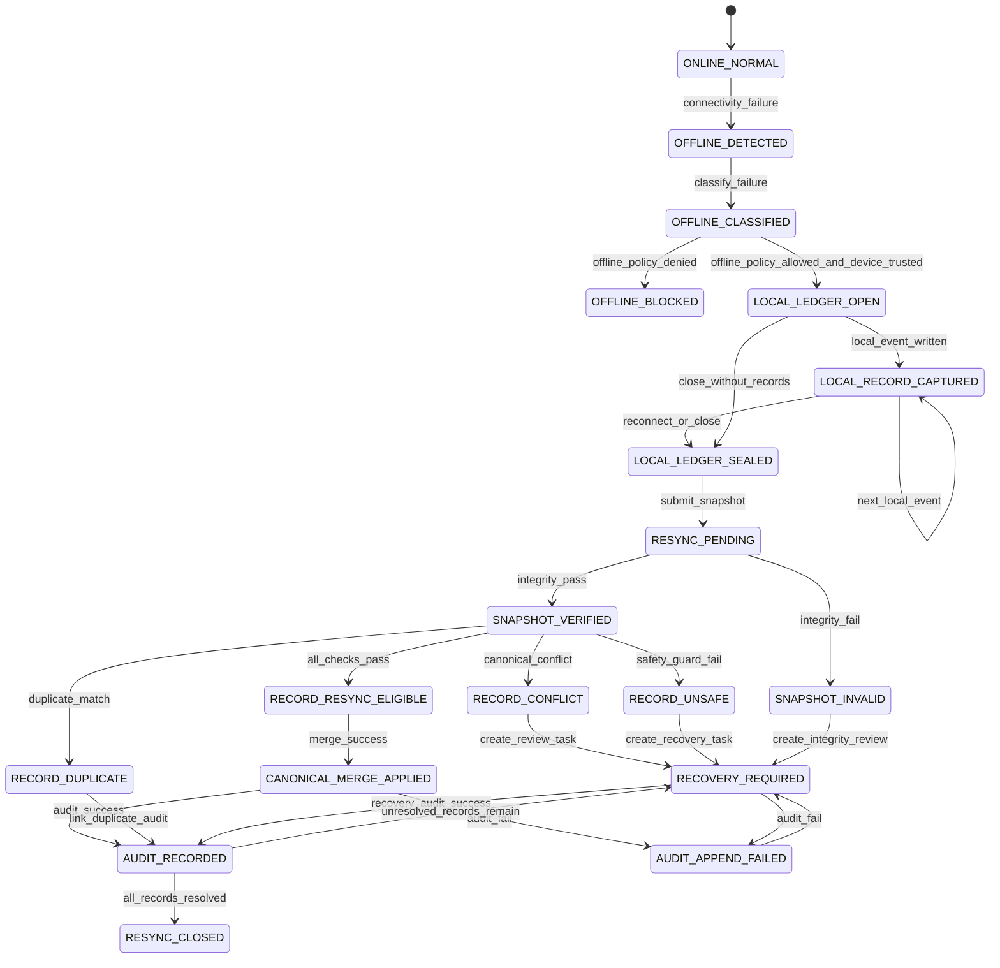

# 001190_Spec_Logic_POS_Gateway_Store_Offline_Local_Ledger_Resync_State_Transition_And_Exception_Rule.md

## 1. Document Control

| Field | Value |
|---|---|
| Project | yoonsul_wait_order_handoff / CatchMenu-Catch&Order |
| Band | 00100_project_foundation |
| Document Type | Spec |
| Document Layer | Logic |
| Document Role | POS Gateway Store Offline / Local Ledger / Resync State Transition And Exception Rule |
| Parent Overview | 001180_Spec_Overview_POS_Gateway_Store_Offline_Local_Ledger_And_Resync_Main_Flow.md |
| Related Runtime Flow Bundle | 064130_Flow_POS_Gateway_Store_Offline_Local_Ledger_And_Resync.md |
| Related Approval Package | 000990_Index_POS_Gateway_Approval_Implementation_Package_Closeout.md |
| Related Cancel Refund Package | 001080_Index_POS_Gateway_Cancel_Refund_Implementation_Package_Closeout.md |
| Related Timeout Retry DLQ Replay Package | 001170_Index_POS_Gateway_Timeout_Retry_DLQ_Replay_Implementation_Package_Closeout.md |
| Related Logic Template | 000670_Template_Development_Foundation_Logic_Document.md |
| Related Traceability Matrix | 000690_Matrix_Development_Foundation_Overview_Logic_Module_Traceability.md |
| Related Flow Registry | 064000_Index_Runtime_Flow_Bundle_Registry.md |
| Next Module Document | 001200_Spec_Module_POS_Gateway_Store_Offline_Local_Ledger_Resync_API_Data_Model_And_Test_Map.md |
| Status | Draft |
| Owner | Architecture / Engineering / QA / Compliance / Operations |
| AI Solo Change | Documentation drafting allowed; runtime implementation approval prohibited |

---

## 2. Purpose

This Logic document defines the state transition, offline session, local temporary ledger, resync eligibility, duplicate prevention, conflict handling, audit, recovery, and evidence rules for POS Gateway Store Offline / Local Ledger / Resync.

It is the second layer of the Development Foundation implementation chain:

```text
Overview → Logic → Module → File → Test → Evidence
```

This document must be reviewed before runtime code handoff.

---

## 3. Scope

### 3.1 Included

- Offline condition classification.
- Offline mode eligibility.
- Local temporary ledger open/close rules.
- Device identity and session boundary.
- Local sequence and hash-chain rules.
- Local record eligibility.
- Resync eligibility.
- Duplicate detection.
- Conflict detection.
- Canonical server ledger merge rules.
- Safe status projection.
- Audit append rules.
- Recovery and manual review rules.
- Evidence requirements.

### 3.2 Excluded

- Fully offline card authorization without provider approval.
- Provider-specific offline payment scheme.
- Cash handling policy.
- Manual settlement dispute adjudication.
- Secret rotation.
- DB migration execution.
- Production deployment.
- Hardware procurement.

---

## 4. Business Logic Intent

Store offline logic exists to keep store operations moving without pretending that the financial system is still certain.

Core rule:

```text
Offline local records are temporary operational evidence, not canonical financial truth.
```

A local ledger record may become canonical only when:

```text
device identity
offline session
sequence
hash chain
idempotency
canonical server state
duplicate check
conflict check
policy approval
audit evidence
```

all pass.

---

## 5. No-AI-Solo Zone Classification

| Area | AI Solo Allowed? | Human Approval Required? | Reason |
|---|---:|---:|---|
| Local ledger integrity model | No | Yes | Tamper and fraud risk |
| Device identity trust model | No | Yes | Rogue device risk |
| Resync of money-adjacent records | No | Yes | Duplicate charge/refund/order risk |
| Conflict resolution affecting canonical state | No | Yes | Financial and operational impact |
| Server canonical ledger merge | No | Yes | Source-of-truth integrity |
| Audit ledger append behavior | No | Yes | Evidence integrity |
| Reconciliation closeout | No | Yes | Settlement consistency |
| DB schema/migration | No | Yes | Data integrity |
| Secret/credential handling | No | Yes | Security |
| Release/deploy | No | Yes | Runtime stability |

---

## 6. Primary State Model

| State | Meaning | Entry Condition | Exit Condition | Terminal? |
|---|---|---|---|---:|
| ONLINE_NORMAL | Store is operating against canonical server flow | Connectivity healthy | Failure detected | No |
| OFFLINE_DETECTED | Connectivity failure detected | Server/POS/provider/device path fails | Offline classification | No |
| OFFLINE_CLASSIFIED | Offline condition classified | Failure type identified | Offline allowed or blocked | No |
| OFFLINE_BLOCKED | Offline operation is not allowed | Policy denies offline operation | Recovery/admin review | Conditional |
| LOCAL_LEDGER_OPEN | Local temporary ledger session opened | Offline allowed and device trusted | Local record write or session close | No |
| LOCAL_RECORD_CAPTURED | Local event recorded | Local sequence/idempotency/hash written | More local records or reconnect | No |
| LOCAL_LEDGER_SEALED | Local session sealed for sync | Reconnect or manual close | Resync submission | No |
| RESYNC_PENDING | Local ledger snapshot submitted | Connectivity restored | Integrity verification | No |
| SNAPSHOT_INVALID | Local ledger snapshot failed integrity check | Device/session/sequence/hash failure | Manual review | Conditional |
| SNAPSHOT_VERIFIED | Snapshot integrity verified | Integrity checks pass | Record classification | No |
| RECORD_DUPLICATE | Local record matches existing canonical record | Duplicate detection pass | Link and audit | Conditional |
| RECORD_CONFLICT | Local record conflicts with canonical state | Conflict detected | Manual review | Conditional |
| RECORD_UNSAFE | Local record lacks required idempotency/policy/proof | Safety guard fails | Manual review/recovery | Conditional |
| RECORD_RESYNC_ELIGIBLE | Local record is safe to apply | All checks pass | Canonical merge | No |
| CANONICAL_MERGE_APPLIED | Local record merged into server canonical flow | Merge succeeds | Audit/recon marker | No |
| AUDIT_APPEND_FAILED | Audit append failed | Material transition audit failed | Incident/recovery | No |
| AUDIT_RECORDED | Offline/resync evidence appended | Audit write succeeds | Projection/recon/closeout | No |
| RECOVERY_REQUIRED | Manual review or recovery task required | Conflict/invalid/unsafe/audit failure | Resolution or closeout | No |
| RESYNC_CLOSED | Offline session safely closed with evidence | All records resolved or blocked with evidence | None | Yes |

---

## 7. State Transition Diagram



---

## 8. Event Model

| Event | Producer | Consumer | Required Payload | Idempotency Key | Audit Required |
|---|---|---|---|---|---:|
| store.offline.detected | Store Device / Gateway | Offline Classifier | store_id, device_id, failure_type, detected_at | offline_session_id | Yes |
| offline.session.opened | Offline Controller | Local Ledger | store_id, device_id, session_id, policy_ref | offline_session_id | Yes |
| local.record.captured | Local Ledger | Local Ledger | local_seq, local_record_id, payload_hash, event_type | local_record_id | Yes |
| offline.session.sealed | Local Ledger | Resync Orchestrator | session_id, sequence_range, root_hash | offline_session_id | Yes |
| resync.snapshot.submitted | Device/Gateway | Resync Orchestrator | snapshot_ref, device_id, session_id, root_hash | resync_request_id | Yes |
| resync.snapshot.verified | Resync Orchestrator | Conflict Resolver | verification_result, sequence_range, hash_chain_status | resync_request_id | Yes |
| resync.record.classified | Conflict Resolver | Resync Orchestrator | local_record_id, classification, reason | local_record_id | Yes |
| resync.record.applied | Resync Orchestrator | Server Ledger / Audit | local_record_id, canonical_ref, result | local_record_id | Yes |
| resync.record.blocked | Conflict Resolver | Admin / Audit | local_record_id, block_reason | local_record_id | Yes |
| offline.conflict.review.created | Conflict Resolver | Admin Console | task_id, reason, evidence_ref | task_id | Yes |
| offline.resync.closed | Resync Orchestrator | Audit / Projection | session_id, closeout_state, unresolved_count | offline_session_id | Yes |

---

## 9. Offline Classification Rules

| Rule ID | Condition | Classification | Required Action | Evidence |
|---|---|---|---|---|
| LOGIC-POS-OFLR-R001 | Device cannot reach Catch&Order server | SERVER_UNREACHABLE | Evaluate offline policy | server_unreachable_evidence |
| LOGIC-POS-OFLR-R002 | Device/gateway cannot reach POS | POS_UNREACHABLE | Block or degraded local note depending on policy | pos_unreachable_evidence |
| LOGIC-POS-OFLR-R003 | Provider/PG/VAN path unavailable | PROVIDER_UNREACHABLE | Do not mark payment success; allow only safe pending records | provider_unreachable_evidence |
| LOGIC-POS-OFLR-R004 | Partial connectivity exists | PARTIAL_CONNECTIVITY | Restrict operations to safe reachable paths | partial_connectivity_evidence |
| LOGIC-POS-OFLR-R005 | Device identity cannot be verified | DEVICE_UNTRUSTED | Block local ledger opening | device_untrusted_evidence |
| LOGIC-POS-OFLR-R006 | Offline policy denies operation | OFFLINE_OPERATION_DENIED | Block operation and project recovery message | offline_denied_evidence |
| LOGIC-POS-OFLR-R007 | Offline policy allows operation | OFFLINE_OPERATION_ALLOWED | Open bounded local ledger | offline_allowed_evidence |

---

## 10. Local Ledger Rules

| Rule ID | Rule | Required Behavior | Evidence |
|---|---|---|---|
| LOGIC-POS-OFLR-R008 | Local ledger requires session | Every offline record must belong to a known offline_session_id | local_session_evidence |
| LOGIC-POS-OFLR-R009 | Local ledger requires trusted device | device_id and trust context must be recorded | device_trust_evidence |
| LOGIC-POS-OFLR-R010 | Local sequence must be monotonic | local_seq must increase without unexplained gaps | local_sequence_evidence |
| LOGIC-POS-OFLR-R011 | Payload hash required | Every local record must include payload_hash | payload_hash_evidence |
| LOGIC-POS-OFLR-R012 | Hash chain required | Each record must link to previous hash or session root | hash_chain_evidence |
| LOGIC-POS-OFLR-R013 | Idempotency key required for mutation-like local records | Missing key blocks resync | local_idempotency_evidence |
| LOGIC-POS-OFLR-R014 | Local ledger must not store secrets | Raw secret/payment credential values prohibited | local_secret_masking_evidence |
| LOGIC-POS-OFLR-R015 | Local final payment/refund status prohibited without proof | Do not record unverified provider success as final | local_status_projection_evidence |

---

## 11. Resync Eligibility Rules

| Rule ID | Condition | Required Action | Evidence |
|---|---|---|---|
| LOGIC-POS-OFLR-R016 | Snapshot device/session/sequence/hash all valid | Mark snapshot verified | snapshot_verified_evidence |
| LOGIC-POS-OFLR-R017 | Snapshot integrity fails | Block resync and create review task | snapshot_invalid_evidence |
| LOGIC-POS-OFLR-R018 | Local record matches existing canonical record | Link as duplicate, do not reapply | duplicate_link_evidence |
| LOGIC-POS-OFLR-R019 | Local record conflicts with canonical terminal state | Block record and create conflict review | canonical_conflict_evidence |
| LOGIC-POS-OFLR-R020 | Local record lacks required idempotency | Block record and create recovery task | resync_idempotency_missing_evidence |
| LOGIC-POS-OFLR-R021 | Local record claims provider success without proof | Block final status and require verification | unverified_provider_success_evidence |
| LOGIC-POS-OFLR-R022 | Local record passes all safety checks | Apply to canonical server flow | canonical_merge_evidence |
| LOGIC-POS-OFLR-R023 | Canonical merge fails | Create recovery task; do not silently retry | canonical_merge_failure_evidence |
| LOGIC-POS-OFLR-R024 | All records resolved or blocked with evidence | Close offline session | resync_closeout_evidence |

---

## 12. Conflict Handling Rules

| Conflict Type | Required Behavior |
|---|---|
| Same local record already canonical | Link as duplicate, do not reapply |
| Same idempotency key, same payload | Return existing canonical state |
| Same idempotency key, different payload | Block as conflict |
| Local record after canonical terminal state | Block unless read-only annotation |
| Local order conflicts with cancelled server state | Manual review |
| Local payment success without provider proof | Block final success projection |
| Local refund record without canonical approval/refund state | Block |
| Sequence gap | Block affected range until reviewed |
| Hash-chain mismatch | Block entire session or affected range |
| Device identity mismatch | Block session and escalate security/ops review |

---

## 13. Safe Status Projection Rules

| Audience | Allowed Offline / Resync Status |
|---|---|
| Customer | Processing, Offline/Pending, Pending Verification, Contact Store |
| Store Staff | Offline Mode, Pending Sync, Sync Conflict, Recovery Required, Synced |
| Admin | Full offline session, sequence, conflict, hash, evidence details |
| AI Customer Center | SOP/evidence-based explanation only; no invented final state |

Projection rules:

1. Local record is not canonical.
2. Offline payment is not provider-approved unless prior proof exists.
3. Resync pending is not sync success.
4. Conflict review is not rejection or success.
5. UNKNOWN/provider-unverified state must remain pending verification.
6. Customer-facing final status requires canonical server and provider/reconciliation evidence.

---

## 14. Audit Ledger Rules

| Audit Item | Required |
|---|---:|
| Offline detected | Yes |
| Offline classification | Yes |
| Offline policy allowed/denied | Yes |
| Local session opened | Yes |
| Local record captured | Yes |
| Local session sealed | Yes |
| Resync snapshot submitted | Yes |
| Snapshot verified/invalid | Yes |
| Record duplicate linked | Yes |
| Record conflict blocked | Yes |
| Record unsafe blocked | Yes |
| Canonical merge applied | Yes |
| Canonical merge failed | Yes |
| Recovery task created | Yes |
| Resync closeout | Yes |
| Audit append failure | Yes |

Audit logs must not contain raw secrets, credentials, or unnecessary sensitive payment payloads.

---

## 15. Recovery / Manual Review Rules

| Condition | Required Recovery |
|---|---|
| Snapshot invalid | Integrity review task |
| Sequence gap | Sequence review task |
| Hash-chain mismatch | Tamper/security review task |
| Device mismatch | Device trust review task |
| Canonical conflict | Conflict resolver task |
| Local unverified provider success | Provider status verification task |
| Canonical merge failure | Engineering/ops recovery task |
| Audit append failure | Compliance/engineering incident |
| Unresolved offline session beyond SLA | Store/admin escalation |

---

## 16. Test Requirements

| Test Type | Required Scenarios |
|---|---|
| Unit | offline classification, local sequence, hash chain, idempotency, resync eligibility |
| Integration | offline session open → local records → resync → canonical merge/audit |
| Fault Injection | server loss, POS loss, provider loss, snapshot corruption, sequence gap, merge failure |
| Security | untrusted device, hash-chain mismatch, secret masking, payload tamper |
| Audit | every offline/resync transition creates audit evidence |
| Reconciliation | duplicate/conflict/canonical merge create correct markers |
| Regression | no duplicate order/payment/refund from local resync |
| Projection | local/pending/unknown never shown as final payment/refund success |

---

## 17. Evidence Requirements

| Evidence | Required For |
|---|---|
| server_unreachable_evidence | server connectivity failure |
| pos_unreachable_evidence | POS connectivity failure |
| provider_unreachable_evidence | provider connectivity failure |
| partial_connectivity_evidence | partial failure |
| device_untrusted_evidence | untrusted device block |
| offline_denied_evidence | offline policy denial |
| offline_allowed_evidence | offline policy allowed |
| local_session_evidence | local session open/close |
| device_trust_evidence | device identity proof |
| local_sequence_evidence | monotonic sequence proof |
| payload_hash_evidence | payload hash record |
| hash_chain_evidence | local hash-chain proof |
| local_idempotency_evidence | idempotency key proof |
| local_secret_masking_evidence | no raw secret storage |
| local_status_projection_evidence | safe offline projection |
| snapshot_verified_evidence | resync snapshot verification |
| snapshot_invalid_evidence | invalid snapshot block |
| duplicate_link_evidence | duplicate link, no reapply |
| canonical_conflict_evidence | conflict block |
| resync_idempotency_missing_evidence | idempotency missing block |
| unverified_provider_success_evidence | final status block |
| canonical_merge_evidence | server merge success |
| canonical_merge_failure_evidence | merge failure task |
| resync_closeout_evidence | offline session closeout |

---

## 18. Downstream Module Mapping Requirements

Required downstream document:

```text
001200_Spec_Module_POS_Gateway_Store_Offline_Local_Ledger_Resync_API_Data_Model_And_Test_Map.md
```

Minimum mapping:

| Logic Rule | Required Module Mapping |
|---|---|
| R001~R007 | offline condition classifier and policy guard |
| R008~R015 | local ledger session, sequence, hash, idempotency, storage guard |
| R016~R024 | resync orchestrator, integrity verifier, conflict resolver, canonical merge |
| Audit rules | offline/resync audit append service |
| Recovery rules | recovery task manager and admin review interface |
| Projection rules | offline/resync safe status projector |

---

## 19. Approval Gate

This Logic document is not implementation-ready until:

- [ ] Architecture confirms offline state model.
- [ ] Security confirms device identity and local hash-chain rules.
- [ ] Engineering confirms local ledger and resync implementability.
- [ ] QA confirms testability.
- [ ] Compliance confirms audit/evidence sufficiency.
- [ ] Operations confirms offline SLA, recovery, and store/admin review process.
- [ ] Product confirms offline-allowed operations.
- [ ] No-AI-Solo classification is accepted.
- [ ] Module document 01200 is created.
- [ ] Source files are mapped after hydration.
- [ ] Test coverage map is updated.

---

## 20. Summary

This document defines the logic rules for POS Gateway Store Offline / Local Ledger / Resync.

It must not be used alone as a code instruction.

Runtime implementation requires the full chain:

```text
Overview → Logic → Module → File → Test → Evidence
```

and the Runtime Flow Bundle chain:

```text
Flow Step → Module → File → Test → Evidence
```
