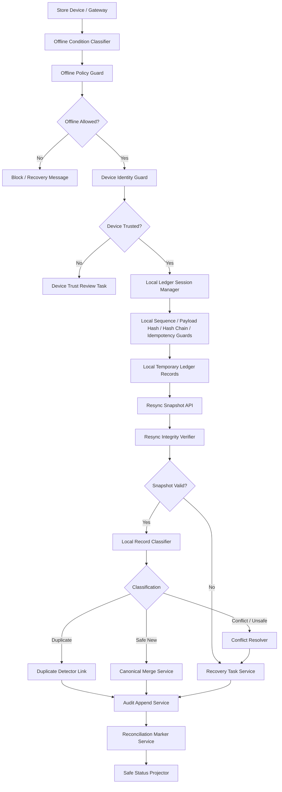

# 001200_Spec_Module_POS_Gateway_Store_Offline_Local_Ledger_Resync_API_Data_Model_And_Test_Map.md

## 1. Document Control

| Field | Value |
|---|---|
| Project | yoonsul_wait_order_handoff / CatchMenu-Catch&Order |
| Band | 00100_project_foundation |
| Document Type | Spec |
| Document Layer | Module |
| Document Role | POS Gateway Store Offline / Local Ledger / Resync API, Data Model, And Test Map |
| Parent Overview | 001180_Spec_Overview_POS_Gateway_Store_Offline_Local_Ledger_And_Resync_Main_Flow.md |
| Parent Logic | 001190_Spec_Logic_POS_Gateway_Store_Offline_Local_Ledger_Resync_State_Transition_And_Exception_Rule.md |
| Related Approval Package | 000990_Index_POS_Gateway_Approval_Implementation_Package_Closeout.md |
| Related Cancel Refund Package | 001080_Index_POS_Gateway_Cancel_Refund_Implementation_Package_Closeout.md |
| Related Timeout Retry DLQ Replay Package | 001170_Index_POS_Gateway_Timeout_Retry_DLQ_Replay_Implementation_Package_Closeout.md |
| Related Runtime Flow Bundle | 064130_Flow_POS_Gateway_Store_Offline_Local_Ledger_And_Resync.md |
| Related Module Template | 000680_Template_Development_Foundation_Module_Document.md |
| Related Source Tree Matrix | 000820_Matrix_Development_Foundation_Source_Tree_To_Module_Document_Map.md |
| Related Owner Register | 000830_Register_Development_Foundation_Repository_Module_Owner_Map.md |
| Related Restricted Register | 000750_Register_Development_Foundation_Restricted_File_And_Zone_Control.md |
| Status | Draft / Pending Codebase Hydration |
| Owner | Architecture / Engineering / QA / Compliance / Operations |
| AI Solo Change | Documentation drafting allowed; runtime implementation approval prohibited |

---

## 2. Purpose

This Module document maps POS Gateway Store Offline / Local Ledger / Resync Logic rules to implementation-facing APIs, modules, data models, queues, jobs, tests, and evidence.

It is the third layer in the Development Foundation chain:

```text
Overview → Logic → Module → File → Test → Evidence
```

Actual source paths and test paths must be filled after codebase hydration.

---

## 3. Scope

### 3.1 Included

- Offline condition classifier.
- Offline mode policy guard.
- Device identity guard.
- Local temporary ledger session manager.
- Local sequence manager.
- Local payload hash and hash-chain verifier.
- Local idempotency guard.
- Local secret/payload masking guard.
- Resync snapshot submission API.
- Resync snapshot integrity verifier.
- Local record classifier.
- Duplicate detector.
- Conflict resolver.
- Canonical server ledger merge service.
- Recovery/manual review task service.
- Offline/resync audit append service.
- Reconciliation marker service.
- Safe status projector.
- Test and evidence map.

### 3.2 Excluded

- Fully offline card authorization without provider approval.
- Provider-specific offline payment scheme.
- Cash handling policy.
- Manual settlement dispute adjudication.
- Secret rotation.
- DB migration execution.
- Production deployment.
- Hardware procurement.

---

## 4. Implementation Readiness Warning

This document contains expected module boundaries and placeholder paths.

Runtime implementation is blocked until:

1. actual source paths are known,
2. actual tests are known,
3. restricted files are registered,
4. owners are assigned,
5. offline-allowed operations are approved,
6. local ledger storage boundary is approved,
7. device identity trust model is approved,
8. human approval exists for restricted resync/conflict zones,
9. evidence targets are created.

---

## 5. Runtime Module Map

| Module | Responsibility | Related Logic Rule | Restricted Zone | Owner |
|---|---|---|---|---|
| offline_condition_classifier | Classifies server/POS/provider/device/partial connectivity failure | R001~R004 | Conditional | Engineering / Operations |
| offline_policy_guard | Decides whether offline operation is allowed or blocked | R006~R007 | RZ-OPS / RZ-COMPLIANCE | Product / Compliance / Engineering |
| device_identity_guard | Verifies device identity before local ledger creation | R005, R009 | RZ-SECURITY | Security / Engineering |
| local_ledger_session_manager | Opens, seals, and closes local temporary ledger sessions | R008~R009 | RZ-LOCAL-LEDGER | Engineering / Security |
| local_sequence_manager | Maintains monotonic local sequence and detects gaps | R010 | RZ-LOCAL-LEDGER | Engineering |
| local_payload_hash_service | Creates and verifies local payload hashes | R011 | RZ-LOCAL-LEDGER / RZ-SECURITY | Engineering / Security |
| local_hash_chain_service | Creates and verifies local record hash chain | R012 | RZ-LOCAL-LEDGER / RZ-AUDIT | Engineering / Security |
| local_idempotency_guard | Requires idempotency for mutation-like local records | R013 | RZ-PAY / RZ-ORDER | Engineering / Compliance |
| local_secret_masking_guard | Prevents raw secrets/payment credentials in local storage | R014 | RZ-SECURITY | Security / Engineering |
| local_status_projection_guard | Prevents unverified final payment/refund status | R015 | RZ-PAY / RZ-REFUND | Product / Engineering |
| resync_snapshot_api_boundary | Receives offline session snapshots for resync | R016~R017 | RZ-API / RZ-LOCAL-LEDGER | Engineering |
| resync_integrity_verifier | Verifies device, session, sequence, payload hash, hash chain | R016~R017 | RZ-SECURITY / RZ-AUDIT | Engineering / Security |
| local_record_classifier | Classifies records as new, duplicate, conflict, unsafe, stale, review | R018~R022 | RZ-OPS / RZ-COMPLIANCE | Engineering / QA |
| duplicate_detector | Links duplicate local records to existing canonical records | R018 | RZ-ORDER / RZ-PAY | Engineering |
| conflict_resolver | Blocks conflicting records and creates review tasks | R019~R021 | RZ-PAY / RZ-REFUND / RZ-AUDIT | Engineering / Compliance |
| canonical_merge_service | Applies safe records into server canonical flow | R022~R023 | RZ-CANONICAL-LEDGER | Engineering / Compliance |
| offline_recovery_task_service | Creates recovery/manual review tasks | R017~R023 | RZ-OPS | Engineering / Operations |
| offline_resync_audit_append_service | Appends offline/resync material events | Audit rules | RZ-AUDIT | Engineering / Compliance |
| offline_reconciliation_marker_service | Creates reconciliation/readiness markers | R024 | RZ-SETTLE / RZ-AUDIT | Engineering / Compliance |
| offline_resync_status_projector | Projects safe customer/store/admin status | Projection rules | Conditional | Product / Engineering |
| offline_resync_test_harness | Tests offline, local ledger, integrity, conflict, merge, audit | All | Conditional | QA / Engineering |

---

## 6. Source File Map

Actual paths must be filled after hydration.

| Source File / Folder | Expected Role | Related Module | Related Logic | Test File | Evidence |
|---|---|---|---|---|---|
| TBD | Offline condition classifier | offline_condition_classifier | R001~R004 | TBD | offline_classification_evidence |
| TBD | Offline policy guard | offline_policy_guard | R006~R007 | TBD | offline_policy_evidence |
| TBD | Device identity guard | device_identity_guard | R005, R009 | TBD | device_trust_evidence |
| TBD | Local ledger session manager | local_ledger_session_manager | R008~R009 | TBD | local_session_evidence |
| TBD | Local sequence manager | local_sequence_manager | R010 | TBD | local_sequence_evidence |
| TBD | Payload hash service | local_payload_hash_service | R011 | TBD | payload_hash_evidence |
| TBD | Hash-chain service | local_hash_chain_service | R012 | TBD | hash_chain_evidence |
| TBD | Local idempotency guard | local_idempotency_guard | R013 | TBD | local_idempotency_evidence |
| TBD | Local secret masking guard | local_secret_masking_guard | R014 | TBD | local_secret_masking_evidence |
| TBD | Local status projection guard | local_status_projection_guard | R015 | TBD | local_status_projection_evidence |
| TBD | Resync snapshot API boundary | resync_snapshot_api_boundary | R016~R017 | TBD | snapshot_submission_evidence |
| TBD | Resync integrity verifier | resync_integrity_verifier | R016~R017 | TBD | snapshot_verified_or_invalid_evidence |
| TBD | Local record classifier | local_record_classifier | R018~R022 | TBD | local_record_classification_evidence |
| TBD | Duplicate detector | duplicate_detector | R018 | TBD | duplicate_link_evidence |
| TBD | Conflict resolver | conflict_resolver | R019~R021 | TBD | canonical_conflict_evidence |
| TBD | Canonical merge service | canonical_merge_service | R022~R023 | TBD | canonical_merge_evidence |
| TBD | Recovery task service | offline_recovery_task_service | R017~R023 | TBD | recovery_task_evidence |
| TBD | Audit append service | offline_resync_audit_append_service | Audit rules | TBD | audit_append_evidence |
| TBD | Reconciliation marker service | offline_reconciliation_marker_service | R024 | TBD | recon_marker_evidence |
| TBD | Status projector | offline_resync_status_projector | Projection rules | TBD | safe_projection_evidence |

---

## 7. API / Interface Map

### 7.1 Offline Detection Interface

| Interface | Direction | Caller | Callee | Request | Response | Related Logic |
|---|---|---|---|---|---|---|
| classifyOfflineCondition | Internal | Store Device / Gateway | Offline Condition Classifier | store_id, device_id, connectivity_snapshot, failure_type | offline_condition, allowed_next_step | R001~R004 |
| evaluateOfflinePolicy | Internal | Offline Controller | Offline Policy Guard | store_id, operation_type, device_id, offline_condition | allow, deny_reason, offline_scope | R006~R007 |

### 7.2 Local Ledger Interface

| Interface | Direction | Caller | Callee | Request | Response | Related Logic |
|---|---|---|---|---|---|---|
| openLocalLedgerSession | Local/Internal | Store Device | Local Ledger Session Manager | store_id, device_id, policy_ref, opened_at | offline_session_id, session_root | R008~R009 |
| captureLocalRecord | Local/Internal | Store Device | Local Ledger | offline_session_id, local_seq, event_type, payload_hash, idempotency_key | local_record_id, hash_chain_head | R010~R015 |
| sealLocalLedgerSession | Local/Internal | Store Device | Local Ledger Session Manager | offline_session_id, sequence_range, root_hash | sealed_snapshot_ref | R008~R012 |

### 7.3 Resync Interface

| Interface | Direction | Caller | Callee | Request | Response | Related Logic |
|---|---|---|---|---|---|---|
| submitResyncSnapshot | Internal API | Store Device / Gateway | Resync Snapshot API | store_id, device_id, offline_session_id, sealed_snapshot_ref | resync_request_id, accepted_for_validation | R016~R017 |
| verifyResyncSnapshot | Internal | Resync Orchestrator | Resync Integrity Verifier | resync_request_id, snapshot_ref | verified, invalid_reason, sequence_status, hash_status | R016~R017 |
| classifyLocalRecordForResync | Internal | Resync Orchestrator | Local Record Classifier | local_record_id, canonical_lookup_context | classification, reason | R018~R022 |
| applyCanonicalMerge | Internal | Resync Orchestrator | Canonical Merge Service | local_record_id, canonical_target, evidence_ref | merge_result, canonical_ref | R022~R023 |

### 7.4 Review / Recovery Interface

| Interface | Direction | Caller | Callee | Request | Response | Related Logic |
|---|---|---|---|---|---|---|
| createOfflineRecoveryTask | Internal | Conflict Resolver / Resync | Recovery Task Service | session_id, local_record_id, reason, evidence_ref | task_id | R017~R023 |
| projectOfflineResyncStatus | Internal | Resync / Audit | Status Projector | session_id, record_state, visibility_scope | customer_status, store_status, admin_status | Projection rules |

---

## 8. Data Model Map

Actual schema names must be confirmed after hydration.

| Data Model / Table | Purpose | Key Fields | Related Logic | Restricted? |
|---|---|---|---|---:|
| offline_sessions | Local/server record of offline session boundary | offline_session_id, store_id, device_id, opened_at, sealed_at, status, root_hash | R008~R009 | Yes |
| local_ledger_records | Local temporary event records | local_record_id, offline_session_id, local_seq, event_type, payload_hash, prev_hash, idempotency_key | R010~R015 | Yes |
| local_ledger_snapshots | Sealed snapshot submitted for resync | snapshot_id, offline_session_id, sequence_range, root_hash, snapshot_hash, submitted_at | R016~R017 | Yes |
| resync_requests | Server resync request state | resync_request_id, snapshot_id, status, requested_by, verification_result | R016~R024 | Yes |
| resync_record_results | Per-local-record resync classification/result | result_id, local_record_id, classification, canonical_ref, block_reason | R018~R024 | Yes |
| offline_conflict_tasks | Manual review/recovery tasks | task_id, session_id, record_id, reason, owner, status, sla | R017~R023 | Conditional |
| canonical_order_payment_refs | Canonical lookup targets for order/payment/refund | canonical_ref, entity_type, terminal_state, provider_ref | R018~R023 | Yes |
| audit_events | Immutable audit trace | audit_event_id, event_type, entity_ref, hash/ref, created_at | Audit rules | Yes |
| reconciliation_markers | Reconciliation/recovery readiness | marker_id, session_id, canonical_ref, readiness_state | R024 | Yes |

---

## 9. Field-Level Rules

| Field | Required Rule |
|---|---|
| store_id | Required for offline session and resync |
| device_id | Required and must be trusted before local ledger open |
| offline_session_id | Required for every local record |
| local_seq | Required and monotonic within offline session |
| prev_hash | Required except first record/session root |
| payload_hash | Required for every local record |
| idempotency_key | Required for mutation-like records |
| event_type | Required to classify record |
| local_timestamp | Recorded but not authoritative for canonical ordering alone |
| snapshot_hash | Required for sealed snapshot |
| verification_result | Required before any canonical merge |
| canonical_ref | Required when duplicate or applied record links to server state |
| block_reason | Required for conflict/unsafe/invalid record |
| audit_event_id | Required for material transition evidence |
| credential_ref | May be referenced but secret value must not be stored |

---

## 10. Queue / Job / Event Map

| Item | Type | Producer | Consumer | Related Logic | Retry / DLQ | Evidence |
|---|---|---|---|---|---|---|
| store.offline.detected | Event | Store Device / Gateway | Offline Classifier | R001~R004 | Audit/recovery | offline_detected_evidence |
| offline.session.opened | Event | Offline Controller | Local Ledger / Audit | R008~R009 | Local only | local_session_evidence |
| local.record.captured | Event | Local Ledger | Local Ledger / Audit | R010~R015 | Local only | local_record_evidence |
| offline.session.sealed | Event | Local Ledger | Resync Orchestrator | R008~R012 | Resync pending | local_session_sealed_evidence |
| resync.snapshot.submitted | Event/API | Store Device / Gateway | Resync Snapshot API | R016~R017 | Server-side validation | snapshot_submission_evidence |
| resync.snapshot.verified | Event | Resync Integrity Verifier | Record Classifier | R016~R017 | Continue classification | snapshot_verified_evidence |
| resync.snapshot.invalid | Event | Resync Integrity Verifier | Recovery Task / Audit | R017 | Review task | snapshot_invalid_evidence |
| resync.record.classified | Event | Local Record Classifier | Resync Orchestrator | R018~R022 | Apply/block/link | local_record_classification_evidence |
| resync.record.applied | Event | Canonical Merge Service | Audit / Recon | R022~R024 | Closeout path | canonical_merge_evidence |
| resync.record.blocked | Event | Conflict Resolver | Recovery Task / Audit | R019~R021 | Review task | conflict_block_evidence |
| offline.resync.closed | Event | Resync Orchestrator | Audit / Projection | R024 | Closeout | resync_closeout_evidence |

---

## 11. Function / Class Responsibility Map

Expected symbols must be confirmed after hydration.

| Function / Class | Responsibility | Must Not Do | Related Logic | Test |
|---|---|---|---|---|
| classifyOfflineCondition | Classify server/POS/provider/device/partial connectivity | Must not decide final financial state | R001~R004 | offline classification tests |
| evaluateOfflineOperationPolicy | Allow or deny offline operation scope | Must not allow provider success fabrication | R006~R007 | offline policy tests |
| verifyDeviceTrust | Verify device identity and trust context | Must not trust unknown device | R005, R009 | device trust tests |
| openOfflineSession | Open local temporary ledger session | Must not create canonical server state | R008~R009 | local session tests |
| appendLocalLedgerRecord | Append local record with sequence/hash/idempotency | Must not store secrets or final provider success | R010~R015 | local record tests |
| sealOfflineSession | Seal local session with sequence range/root hash | Must not omit unresolved records | R008~R012 | session seal tests |
| submitOfflineSnapshot | Submit snapshot to server resync | Must not apply directly | R016~R017 | snapshot submission tests |
| verifySnapshotIntegrity | Verify session/device/sequence/hash-chain | Must not ignore gaps or mismatch | R016~R017 | integrity tests |
| classifyResyncRecord | Classify record as new/duplicate/conflict/unsafe | Must not merge before classification | R018~R022 | classification tests |
| detectDuplicateCanonicalRecord | Detect and link duplicate canonical record | Must not reapply duplicate | R018 | duplicate tests |
| detectCanonicalConflict | Detect terminal-state or payload conflict | Must not overwrite canonical state | R019~R021 | conflict tests |
| applyCanonicalMerge | Merge safe record into canonical flow | Must not bypass audit/approval | R022~R023 | canonical merge tests |
| createOfflineRecoveryTask | Create manual review/recovery task | Must not hide conflict | R017~R023 | recovery tests |
| appendOfflineResyncAuditEvent | Append offline/resync evidence | Must not mutate prior audit | Audit rules | audit tests |
| projectOfflineResyncStatus | Project safe status to customer/store/admin | Must not show local pending as final | Projection rules | projection tests |

---

## 12. Error Handling Map

| Error Type | Module Behavior | User/Store/Admin Behavior | Evidence |
|---|---|---|---|
| Server unreachable | Classify and evaluate offline policy | Offline/Pending where allowed | server_unreachable_evidence |
| POS unreachable | Block or degrade depending on policy | POS unavailable / recovery required | pos_unreachable_evidence |
| Provider unreachable | Block final payment/refund success | Pending verification | provider_unreachable_evidence |
| Device untrusted | Block local ledger open | Admin/device trust review | device_untrusted_evidence |
| Sequence gap | Block affected range | Admin review | local_sequence_gap_evidence |
| Hash-chain mismatch | Block session/range | Security/ops review | hash_chain_mismatch_evidence |
| Missing idempotency | Block mutation-like resync | Admin review | resync_idempotency_missing_evidence |
| Duplicate canonical record | Link and do not reapply | Synced/duplicate linked | duplicate_link_evidence |
| Canonical conflict | Block record | Conflict review | canonical_conflict_evidence |
| Unverified provider success | Block final projection | Pending verification | unverified_provider_success_evidence |
| Canonical merge failure | Recovery task | Admin recovery required | canonical_merge_failure_evidence |
| Audit append failure | Incident and no closeout | Admin/compliance review | audit_append_failure_evidence |

---

## 13. Security Implementation Map

| Security Control | Implementation Point | Test | Evidence |
|---|---|---|---|
| Trusted device required | device_identity_guard | untrusted_device_test | device_untrusted_evidence |
| Local sequence monotonic | local_sequence_manager | sequence_gap_test | local_sequence_evidence |
| Payload hash required | local_payload_hash_service | missing_hash_test | payload_hash_evidence |
| Hash-chain required | local_hash_chain_service | hash_chain_mismatch_test | hash_chain_evidence |
| Idempotency required for mutation | local_idempotency_guard | missing_idempotency_test | local_idempotency_evidence |
| No raw secret in local ledger | local_secret_masking_guard | secret_masking_test | local_secret_masking_evidence |
| Canonical state not overwritten | conflict_resolver / canonical_merge_service | terminal_conflict_test | canonical_conflict_evidence |
| Local pending not final status | local_status_projection_guard | projection_guard_test | safe_projection_evidence |
| Restricted file gate | 00750 register | diff review | restricted_zone_evidence |

---

## 14. Test Map

| Test Type | Required Scenarios | Candidate Test File | Evidence |
|---|---|---|---|
| Unit | offline classification, offline policy, device trust, local sequence, hash chain, idempotency | TBD | unit_test_report |
| Integration | offline session open → local records → snapshot → resync → canonical merge/audit | TBD | integration_test_report |
| Fault Injection | server loss, POS loss, provider loss, snapshot corruption, sequence gap, merge failure | TBD | fault_test_report |
| Security | untrusted device, hash-chain mismatch, payload tamper, secret masking | TBD | security_test_report |
| Audit | every offline/resync transition creates audit event | TBD | audit_test_report |
| Reconciliation | duplicate/conflict/canonical merge create correct markers | TBD | reconciliation_test_report |
| Regression | no duplicate order/payment/refund from local resync | TBD | regression_test_report |
| Projection | local/pending/unknown never shown as final payment/refund success | TBD | projection_test_report |

---

## 15. Traceability Matrix

| Flow Step | Logic Rule | Module | Source File | Function/Class | Test | Evidence |
|---|---|---|---|---|---|---|
| Detect offline condition | R001~R004 | offline_condition_classifier | TBD | classifyOfflineCondition | TBD | offline_classification_evidence |
| Evaluate offline policy | R006~R007 | offline_policy_guard | TBD | evaluateOfflineOperationPolicy | TBD | offline_policy_evidence |
| Verify device trust | R005, R009 | device_identity_guard | TBD | verifyDeviceTrust | TBD | device_trust_evidence |
| Open local session | R008~R009 | local_ledger_session_manager | TBD | openOfflineSession | TBD | local_session_evidence |
| Capture local record | R010~R015 | local ledger modules | TBD | appendLocalLedgerRecord | TBD | local_record_evidence |
| Seal local session | R008~R012 | local_ledger_session_manager | TBD | sealOfflineSession | TBD | local_session_sealed_evidence |
| Submit resync snapshot | R016~R017 | resync_snapshot_api_boundary | TBD | submitOfflineSnapshot | TBD | snapshot_submission_evidence |
| Verify snapshot integrity | R016~R017 | resync_integrity_verifier | TBD | verifySnapshotIntegrity | TBD | snapshot_verified_or_invalid_evidence |
| Classify local record | R018~R022 | local_record_classifier | TBD | classifyResyncRecord | TBD | local_record_classification_evidence |
| Detect duplicate | R018 | duplicate_detector | TBD | detectDuplicateCanonicalRecord | TBD | duplicate_link_evidence |
| Detect conflict | R019~R021 | conflict_resolver | TBD | detectCanonicalConflict | TBD | canonical_conflict_evidence |
| Apply canonical merge | R022~R023 | canonical_merge_service | TBD | applyCanonicalMerge | TBD | canonical_merge_evidence |
| Create recovery task | R017~R023 | offline_recovery_task_service | TBD | createOfflineRecoveryTask | TBD | recovery_task_evidence |
| Append audit | Audit rules | offline_resync_audit_append_service | TBD | appendOfflineResyncAuditEvent | TBD | audit_append_evidence |
| Create reconciliation marker | R024 | offline_reconciliation_marker_service | TBD | createOfflineReconciliationMarker | TBD | recon_marker_evidence |
| Project safe status | Projection rules | offline_resync_status_projector | TBD | projectOfflineResyncStatus | TBD | safe_projection_evidence |

---

## 16. Mermaid Module Diagram



---

## 17. Code Handoff Requirements

Before any implementation:

- [ ] Actual source paths are filled.
- [ ] Restricted paths are registered in 00750.
- [ ] Module owners are confirmed in 00830.
- [ ] Test files are identified.
- [ ] Evidence packet target is defined.
- [ ] Offline-allowed operation policy is approved.
- [ ] Device identity trust model is approved.
- [ ] Local ledger storage boundary is approved.
- [ ] Local hash-chain model is approved.
- [ ] Resync conflict policy is approved.
- [ ] Human approval exists for restricted local ledger/resync changes.
- [ ] Offline/local ledger/resync handoff readiness checklist is passed.
- [ ] Bounded Claude/Cursor prompts are prepared.

---

## 18. Open Questions

| Question | Owner | Blocking? |
|---|---|---:|
| What are the actual source paths for offline/local ledger/resync modules? | Engineering | Yes |
| What local storage mechanism is canonical? | Architecture / Engineering | Yes |
| What device trust model is used? | Security / Engineering | Yes |
| What operations are allowed offline? | Product / Compliance / Operations | Yes |
| What payload fields are allowed in local ledger? | Security / Compliance | Yes |
| What is the local retention and cleanup policy? | Compliance / Operations | Yes |
| Who approves conflict resolution? | Product / Compliance / Operations | Yes |
| What is the first safe offline/resync test environment? | Engineering / QA | Yes |

---

## 19. Summary

This Module document maps POS Gateway Store Offline / Local Ledger / Resync logic to expected implementation surfaces.

It is not yet a code handoff packet.

Implementation requires actual hydration results and the complete chain:

```text
Overview → Logic → Module → File → Test → Evidence
```

along with the parent Runtime Flow Bundle chain:

```text
Flow Step → Module → File → Test → Evidence
```
