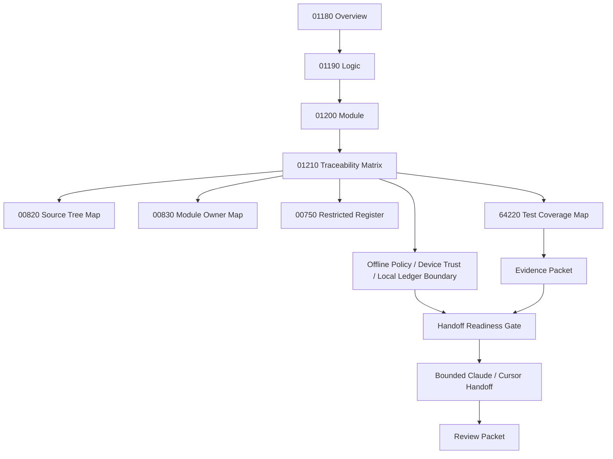

# 001210_Matrix_POS_Gateway_Store_Offline_Local_Ledger_Resync_Overview_Logic_Module_To_Flow_Bundle_Traceability.md

## 1. Document Control

| Field | Value |
|---|---|
| Project | yoonsul_wait_order_handoff / CatchMenu-Catch&Order |
| Band | 00100_project_foundation |
| Document Type | Matrix |
| Document Role | POS Gateway Store Offline / Local Ledger / Resync Overview / Logic / Module To Flow Bundle Traceability |
| Related Overview | 001180_Spec_Overview_POS_Gateway_Store_Offline_Local_Ledger_And_Resync_Main_Flow.md |
| Related Logic | 001190_Spec_Logic_POS_Gateway_Store_Offline_Local_Ledger_Resync_State_Transition_And_Exception_Rule.md |
| Related Module | 001200_Spec_Module_POS_Gateway_Store_Offline_Local_Ledger_Resync_API_Data_Model_And_Test_Map.md |
| Related Approval Package Traceability | 000940_Matrix_POS_Gateway_Approval_Overview_Logic_Module_To_Flow_Bundle_Traceability.md |
| Related Cancel Refund Package Traceability | 001030_Matrix_POS_Gateway_Cancel_Refund_Overview_Logic_Module_To_Flow_Bundle_Traceability.md |
| Related Timeout Retry DLQ Replay Traceability | 001120_Matrix_POS_Gateway_Timeout_Retry_DLQ_Replay_Overview_Logic_Module_To_Flow_Bundle_Traceability.md |
| Related Development Foundation Traceability | 000690_Matrix_Development_Foundation_Overview_Logic_Module_Traceability.md |
| Related Source Tree Matrix | 000820_Matrix_Development_Foundation_Source_Tree_To_Module_Document_Map.md |
| Related Runtime Flow Bundle | 064130_Flow_POS_Gateway_Store_Offline_Local_Ledger_And_Resync.md |
| Related Flow Registry | 064000_Index_Runtime_Flow_Bundle_Registry.md |
| Related Flow Module Map | 064210_Matrix_Flow_To_Module_Implementation_Map.md |
| Related Flow Test Map | 064220_Matrix_Flow_To_Test_Coverage_Map.md |
| Status | Draft / Hydration Required |
| Owner | Architecture / Engineering / QA / Compliance / Operations / Security |
| AI Solo Change | Documentation mapping allowed; runtime implementation approval prohibited |

---

## 2. Purpose

This matrix connects the POS Gateway Store Offline / Local Ledger / Resync `Overview → Logic → Module` document set to the parent Runtime Flow Bundle.

It ensures the implementation package is not driven by a single document.

The required development chain is:

```text
Overview → Logic → Module → File → Test → Evidence
```

The parent Runtime Flow Bundle chain is:

```text
Flow Step → Module → File → Test → Evidence
```

This matrix bridges those two chains for store offline, local temporary ledger, and resync.

---

## 3. Traceability Scope

### 3.1 Included

- 01180 Overview flow steps.
- 01190 Logic rules.
- 01200 Module mappings.
- 64130 Runtime Flow Bundle alignment.
- Test coverage expectations.
- Evidence expectations.
- Restricted-zone awareness.
- Hydration-dependent TBD fields.

### 3.2 Excluded

- Actual source code changes.
- Actual DB migration.
- Provider credential handling.
- Production release approval.
- Fully offline card authorization.
- Cash handling policy.
- Hardware procurement.

---

## 4. Traceability Matrix

| Trace ID | Overview Flow Step | Logic Rule | Module | Source File | Test Coverage | Evidence | Runtime Flow Step | Status |
|---|---|---|---|---|---|---|---|---|
| POSOFLR-TRACE-001 | Offline condition detected and classified | R001~R004 | offline_condition_classifier | TBD | offline classification test | offline_classification_evidence | Offline detection | Draft |
| POSOFLR-TRACE-002 | Device trust evaluated | R005, R009 | device_identity_guard | TBD | untrusted device test | device_trust_evidence | Device identity gate | Draft |
| POSOFLR-TRACE-003 | Offline operation policy evaluated | R006~R007 | offline_policy_guard | TBD | offline policy test | offline_policy_evidence | Offline mode policy | Draft |
| POSOFLR-TRACE-004 | Local ledger session opened | R008~R009 | local_ledger_session_manager | TBD | local session open test | local_session_evidence | Local ledger open | Draft |
| POSOFLR-TRACE-005 | Local record captured with sequence | R010 | local_sequence_manager | TBD | monotonic sequence / sequence gap test | local_sequence_evidence | Local sequence recording | Draft |
| POSOFLR-TRACE-006 | Payload hash recorded | R011 | local_payload_hash_service | TBD | missing hash / payload hash test | payload_hash_evidence | Local payload hash | Draft |
| POSOFLR-TRACE-007 | Hash chain maintained | R012 | local_hash_chain_service | TBD | hash chain mismatch test | hash_chain_evidence | Local hash-chain integrity | Draft |
| POSOFLR-TRACE-008 | Local idempotency enforced | R013 | local_idempotency_guard | TBD | missing local idempotency test | local_idempotency_evidence | Local mutation idempotency | Draft |
| POSOFLR-TRACE-009 | Local secret and sensitive payload masking enforced | R014 | local_secret_masking_guard | TBD | local secret masking test | local_secret_masking_evidence | Local storage security | Draft |
| POSOFLR-TRACE-010 | Local final payment/refund status blocked without proof | R015 | local_status_projection_guard | TBD | local final status block test | local_status_projection_evidence | Safe offline projection | Draft |
| POSOFLR-TRACE-011 | Local session sealed and snapshot submitted | R008~R017 | local_ledger_session_manager / resync_snapshot_api_boundary | TBD | snapshot submission test | snapshot_submission_evidence | Snapshot submission | Draft |
| POSOFLR-TRACE-012 | Snapshot integrity verified or blocked | R016~R017 | resync_integrity_verifier | TBD | snapshot verified / invalid test | snapshot_verified_or_invalid_evidence | Snapshot integrity gate | Draft |
| POSOFLR-TRACE-013 | Local record classified for resync | R018~R022 | local_record_classifier | TBD | local record classification test | local_record_classification_evidence | Record classification | Draft |
| POSOFLR-TRACE-014 | Duplicate local record linked, not reapplied | R018 | duplicate_detector | TBD | duplicate link test | duplicate_link_evidence | Duplicate prevention | Draft |
| POSOFLR-TRACE-015 | Canonical conflict blocked | R019~R021 | conflict_resolver | TBD | terminal conflict / provider proof conflict test | canonical_conflict_evidence | Conflict resolution gate | Draft |
| POSOFLR-TRACE-016 | Safe record applied into canonical flow | R022~R023 | canonical_merge_service | TBD | canonical merge test | canonical_merge_evidence | Canonical merge | Draft |
| POSOFLR-TRACE-017 | Recovery task created for invalid/conflict/unsafe records | R017~R023 | offline_recovery_task_service | TBD | recovery task test | recovery_task_evidence | Recovery/manual review | Draft |
| POSOFLR-TRACE-018 | Offline/resync audit appended | Audit rules | offline_resync_audit_append_service | TBD | audit append/immutability test | audit_append_evidence | Audit ledger append | Draft |
| POSOFLR-TRACE-019 | Reconciliation marker created | R024 | offline_reconciliation_marker_service | TBD | reconciliation marker test | recon_marker_evidence | Reconciliation readiness | Draft |
| POSOFLR-TRACE-020 | Safe customer/store/admin projection | Projection rules | offline_resync_status_projector | TBD | safe projection test | safe_projection_evidence | Status projection | Draft |
| POSOFLR-TRACE-021 | Evidence packet closeout | All rules | offline_resync_test_harness / evidence packet | TBD | evidence completeness review | offline_resync_evidence_packet | Flow evidence closeout | Draft |

---

## 5. Status Values

| Status | Meaning |
|---|---|
| Draft | Proposed trace row |
| Mapped | Overview, Logic, Module, and Flow Step are linked |
| Hydration Required | Actual source/test paths are still unknown |
| Test Ready | Test target is known |
| Evidence Ready | Evidence target is known |
| Approved | Ready for implementation handoff |
| Blocked | Missing document, source path, test, evidence, policy, or approval |
| Deprecated | Replaced but retained for audit history |

---

## 6. Hydration Dependency

This matrix is not implementation-ready until actual paths are added from codebase hydration.

Required hydration sources:

| Required Source | Document |
|---|---|
| Actual source paths | 000840_Evidence_Development_Foundation_First_Codebase_Hydration_Report.md or later hydration packet |
| Source-to-module rows | 000820_Matrix_Development_Foundation_Source_Tree_To_Module_Document_Map.md |
| Module owner rows | 000830_Register_Development_Foundation_Repository_Module_Owner_Map.md |
| Restricted file rows | 000750_Register_Development_Foundation_Restricted_File_And_Zone_Control.md |
| Actual test paths | 064220_Matrix_Flow_To_Test_Coverage_Map.md or hydration output |

---

## 7. Restricted-Zone Traceability

| Trace ID | Restricted Area | AI Solo Allowed? | Human Approval Required? |
|---|---|---:|---:|
| POSOFLR-TRACE-002 | Device identity trust model | No | Yes |
| POSOFLR-TRACE-004 | Local ledger integrity model | No | Yes |
| POSOFLR-TRACE-007 | Local hash-chain integrity | No | Yes |
| POSOFLR-TRACE-008 | Idempotency for local mutation/resync | No | Yes |
| POSOFLR-TRACE-012 | Snapshot integrity verification | No | Yes |
| POSOFLR-TRACE-014 | Duplicate prevention during resync | No | Yes |
| POSOFLR-TRACE-015 | Canonical conflict resolution | No | Yes |
| POSOFLR-TRACE-016 | Canonical server ledger merge | No | Yes |
| POSOFLR-TRACE-018 | Audit ledger append | No | Yes |
| POSOFLR-TRACE-019 | Reconciliation readiness | No | Yes |

Any implementation touching these rows must pass No-AI-Solo approval.

---

## 8. Test Coverage Requirements By Trace Row

| Trace ID | Minimum Test Types |
|---|---|
| POSOFLR-TRACE-001 | Unit, fault injection |
| POSOFLR-TRACE-002 | Unit, security |
| POSOFLR-TRACE-003 | Unit, policy |
| POSOFLR-TRACE-004 | Unit, integration |
| POSOFLR-TRACE-005 | Unit, fault injection |
| POSOFLR-TRACE-006 | Unit, security |
| POSOFLR-TRACE-007 | Unit, security, tamper |
| POSOFLR-TRACE-008 | Unit, regression |
| POSOFLR-TRACE-009 | Security, masking |
| POSOFLR-TRACE-010 | Unit, projection regression |
| POSOFLR-TRACE-011 | Integration |
| POSOFLR-TRACE-012 | Integration, security, tamper |
| POSOFLR-TRACE-013 | Unit, integration |
| POSOFLR-TRACE-014 | Regression, duplicate prevention |
| POSOFLR-TRACE-015 | Conflict, security, compliance |
| POSOFLR-TRACE-016 | Integration, reconciliation |
| POSOFLR-TRACE-017 | Recovery, operations |
| POSOFLR-TRACE-018 | Audit, immutability |
| POSOFLR-TRACE-019 | Reconciliation |
| POSOFLR-TRACE-020 | Projection regression |
| POSOFLR-TRACE-021 | Evidence review |

---

## 9. Evidence Requirements By Trace Row

| Trace ID | Evidence |
|---|---|
| POSOFLR-TRACE-001 | server_unreachable_evidence, pos_unreachable_evidence, provider_unreachable_evidence, partial_connectivity_evidence |
| POSOFLR-TRACE-002 | device_trust_evidence, device_untrusted_evidence |
| POSOFLR-TRACE-003 | offline_allowed_evidence, offline_denied_evidence |
| POSOFLR-TRACE-004 | local_session_evidence |
| POSOFLR-TRACE-005 | local_sequence_evidence |
| POSOFLR-TRACE-006 | payload_hash_evidence |
| POSOFLR-TRACE-007 | hash_chain_evidence |
| POSOFLR-TRACE-008 | local_idempotency_evidence |
| POSOFLR-TRACE-009 | local_secret_masking_evidence |
| POSOFLR-TRACE-010 | local_status_projection_evidence |
| POSOFLR-TRACE-011 | local_session_sealed_evidence, snapshot_submission_evidence |
| POSOFLR-TRACE-012 | snapshot_verified_evidence, snapshot_invalid_evidence |
| POSOFLR-TRACE-013 | local_record_classification_evidence |
| POSOFLR-TRACE-014 | duplicate_link_evidence |
| POSOFLR-TRACE-015 | canonical_conflict_evidence, unverified_provider_success_evidence |
| POSOFLR-TRACE-016 | canonical_merge_evidence, canonical_merge_failure_evidence |
| POSOFLR-TRACE-017 | recovery_task_evidence |
| POSOFLR-TRACE-018 | audit_append_evidence |
| POSOFLR-TRACE-019 | recon_marker_evidence |
| POSOFLR-TRACE-020 | safe_projection_evidence |
| POSOFLR-TRACE-021 | offline_resync_evidence_packet |

---

## 10. Code Handoff Readiness Check

This POS Gateway Store Offline / Local Ledger / Resync package is ready for code handoff only when:

- [ ] 01180 Overview is reviewed.
- [ ] 01190 Logic is reviewed.
- [ ] 01200 Module map is reviewed.
- [ ] 01210 Traceability matrix is updated with actual source paths.
- [ ] 00820 source tree mapping has actual file rows.
- [ ] 00830 owner map has actual module owners.
- [ ] 00750 restricted register has actual restricted files.
- [ ] 64220 test map has actual or planned test rows.
- [ ] Offline-allowed operation policy is approved.
- [ ] Device identity trust model is approved.
- [ ] Local ledger storage boundary is approved.
- [ ] Local hash-chain model is approved.
- [ ] Resync conflict policy is approved.
- [ ] Evidence packet target is defined.
- [ ] Human approval exists for restricted rows.
- [ ] Offline/local ledger/resync handoff readiness checklist is passed.

---

## 11. Mermaid Traceability Diagram



---

## 12. Relationship With Related Packages

Store offline/local ledger/resync interacts with approval, cancel/refund, and timeout/retry/DLQ/replay packages.

| Dependency | Source |
|---|---|
| Approval attempt state and provider proof | 00910~00990 Approval package |
| Cancel/refund attempt state and provider proof | 01000~01080 Cancel/Refund package |
| Timeout/UNKNOWN behavior | 01090~01170 Timeout/Retry/DLQ/Replay package |
| Idempotency and payload hash semantics | Approval, cancel/refund, retry/replay packages |
| Audit chain continuity | Approval, cancel/refund, retry/replay packages |
| Reconciliation baseline | Approval and cancel/refund reconciliation markers |
| Safe projection rules | Approval, cancel/refund, retry/replay status projectors |

Local resync must never overwrite verified canonical state from these packages.

---

## 13. Open Questions

| Question | Owner | Blocking? |
|---|---|---:|
| What are actual offline/local ledger/resync source paths? | Engineering | Yes |
| Which operations are allowed offline? | Product / Compliance / Operations | Yes |
| What device trust model is canonical? | Security / Engineering | Yes |
| What local storage mechanism is canonical? | Architecture / Engineering | Yes |
| What payload fields may be stored locally? | Security / Compliance | Yes |
| What is the local ledger retention and cleanup policy? | Compliance / Operations | Yes |
| Who approves conflict resolution? | Product / Compliance / Operations | Yes |
| Where is final evidence packet stored? | QA / Compliance | Yes |

---

## 14. Summary

This matrix confirms that POS Gateway Store Offline / Local Ledger / Resync is represented as a connected implementation package:

```text
01180 Overview
  ↓
01190 Logic
  ↓
01200 Module
  ↓
01210 Traceability
  ↓
Source / Test / Evidence / Gate
```

It is not code-handoff ready until real source paths, tests, owners, policies, restricted approvals, and evidence targets are filled after hydration.
