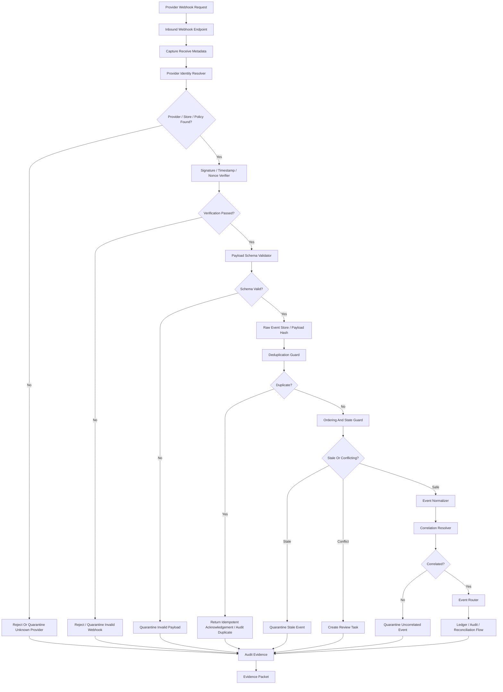
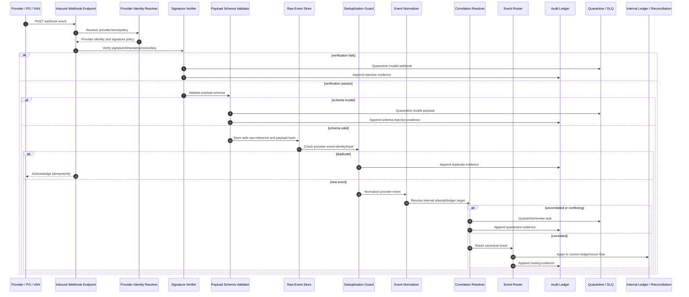

# 001270_Spec_Overview_POS_Gateway_Webhook_Inbound_Verification_And_Event_Normalization_Main_Flow.md

## 1. Document Control

| Field | Value |
|---|---|
| Project | yoonsul_wait_order_handoff / CatchMenu-Catch&Order |
| Band | 00100_project_foundation |
| Document Type | Spec |
| Document Layer | Overview |
| Document Role | POS Gateway Webhook Inbound Verification And Event Normalization Main Flow |
| Related Approval Package Closeout | 000990_Index_POS_Gateway_Approval_Implementation_Package_Closeout.md |
| Related Cancel Refund Package Closeout | 001080_Index_POS_Gateway_Cancel_Refund_Implementation_Package_Closeout.md |
| Related Timeout Retry DLQ Replay Closeout | 001170_Index_POS_Gateway_Timeout_Retry_DLQ_Replay_Implementation_Package_Closeout.md |
| Related Store Offline Local Ledger Resync Closeout | 001260_Index_POS_Gateway_Store_Offline_Local_Ledger_Resync_Implementation_Package_Closeout.md |
| Related Runtime Flow Bundle | 064140_Flow_POS_Gateway_Webhook_Inbound_Verification_And_Event_Normalization.md |
| Related Flow Registry | 064000_Index_Runtime_Flow_Bundle_Registry.md |
| Related Development Foundation Model | 000640_Policy_Development_Foundation_Overview_Logic_Module_Documentation_Model.md |
| Related Traceability Matrix | 000690_Matrix_Development_Foundation_Overview_Logic_Module_Traceability.md |
| Next Logic Document | 001280_Spec_Logic_POS_Gateway_Webhook_Inbound_Verification_Event_Normalization_State_Transition_And_Exception_Rule.md |
| Next Module Document | 001290_Spec_Module_POS_Gateway_Webhook_Inbound_Verification_Event_Normalization_API_Data_Model_And_Test_Map.md |
| Status | Draft |
| Owner | Product / Architecture / Engineering / QA / Compliance / Security / Operations |
| AI Solo Change | Documentation drafting allowed; runtime implementation approval prohibited |

---

## 2. Purpose

This overview defines the POS Gateway Webhook Inbound Verification and Event Normalization main flow for CatchMenu / Catch&Order.

It covers how inbound provider events are received, authenticated, deduplicated, normalized, ordered, correlated to internal attempts, routed into ledger/audit/reconciliation flows, and safely rejected or quarantined when invalid.

This document is the `Overview` layer of the Development Foundation chain:

```text
Overview → Logic → Module → File → Test → Evidence
```

It must be followed by Logic and Module documents before implementation handoff.

---

## 3. Scope

### 3.1 Included

- Inbound webhook endpoint boundary.
- Provider identity recognition.
- Signature and timestamp verification.
- Secret/key version handling.
- Payload schema validation.
- Raw event capture and safe retention.
- Replay attack protection.
- Duplicate event detection.
- Out-of-order event handling.
- Provider event to canonical event normalization.
- Correlation to approval/cancel/refund/settlement attempts.
- Event routing to ledger/audit/reconciliation.
- Invalid event quarantine.
- DLQ/replay handoff.
- Evidence packet requirements.

### 3.2 Excluded

- Provider-specific business settlement adjudication.
- Provider credential rotation procedure.
- Public API documentation for providers.
- Production deployment.
- DB migration execution.
- Manual dispute resolution.
- Offline local ledger resync implementation.

---

## 4. Business Intent

Provider webhooks are external facts entering the system.  
They may confirm payment, refund, cancellation, settlement, dispute, chargeback, or provider-side recovery outcomes.

The system must accept provider events only when they are trustworthy, traceable, deduplicated, and normalized.

Core goal:

```text
No inbound provider event may mutate internal financial state until provider identity, signature, freshness, payload schema, event identity, and correlation are verified.
```

The system must prevent:

- forged webhook,
- replay attack,
- duplicate provider event mutation,
- out-of-order state overwrite,
- invalid payload mutation,
- wrong provider mapping,
- raw secret exposure,
- fake approval/refund completion,
- audit gap,
- reconciliation mismatch,
- AI/customer-center invented final result.

---

## 5. Primary Actors And Systems

| Actor / System | Role |
|---|---|
| Provider / PG / VAN | Sends inbound webhook event |
| Inbound Webhook Endpoint | Receives external HTTP event |
| Provider Identity Resolver | Identifies provider and merchant/store context |
| Signature Verifier | Verifies signature, timestamp, nonce, and key version |
| Payload Schema Validator | Validates required fields and schema version |
| Raw Event Store | Stores safe raw event reference and payload hash |
| Webhook Deduplication Guard | Prevents duplicate event mutation |
| Ordering / State Guard | Prevents stale or out-of-order overwrite |
| Event Normalizer | Converts provider payload to canonical internal event |
| Correlation Resolver | Links event to internal payment/refund/settlement attempt |
| Event Router | Routes normalized event to ledger/audit/reconciliation flow |
| Audit Ledger | Records inbound verification and routing evidence |
| DLQ / Quarantine | Holds invalid, unsafe, uncorrelated, or conflicting events |
| Admin Console | Reviews quarantined or uncorrelated events |
| AI Customer Center | May explain only verified SOP/evidence-based state |

---

## 6. High-Level Flow

```text
1. Provider sends webhook to inbound endpoint.
2. Endpoint records receive metadata and minimal safe envelope.
3. Provider Identity Resolver identifies provider, store, merchant, endpoint, and expected signature policy.
4. Signature Verifier validates signature, timestamp freshness, nonce/replay guard, and key version.
5. Payload Schema Validator validates schema, required identifiers, event type, event timestamp, and amount/currency where applicable.
6. Raw Event Store persists payload hash and safe raw event reference.
7. Deduplication Guard checks provider_event_id, event_hash, attempt_id, and provider reference.
8. Ordering / State Guard checks whether event is newer, stale, duplicate, or conflicting.
9. Event Normalizer converts provider-specific payload into canonical event.
10. Correlation Resolver links canonical event to approval/cancel/refund/settlement/dispute/reconciliation target.
11. Event Router sends event to the correct internal ledger/audit/reconciliation flow.
12. Invalid, duplicate, stale, conflicting, or uncorrelated events are quarantined or DLQ-routed.
13. Audit Ledger records every material verification, rejection, normalization, routing, quarantine, and closeout.
14. Evidence packet records webhook receive, verification, deduplication, normalization, routing, and final state.
```

---

## 7. Runtime Flow Diagram



---

## 8. Runtime Sequence Diagram



---

## 9. Event Categories

Detailed rules must be defined in:

```text
001280_Spec_Logic_POS_Gateway_Webhook_Inbound_Verification_Event_Normalization_State_Transition_And_Exception_Rule.md
```

High-level categories:

| Category | Meaning |
|---|---|
| PAYMENT_APPROVED | Provider confirms approval/payment success |
| PAYMENT_REJECTED | Provider confirms rejection/failure |
| PAYMENT_CANCELLED | Provider confirms cancellation |
| REFUND_COMPLETED | Provider confirms refund |
| REFUND_REJECTED | Provider rejects refund |
| SETTLEMENT_REPORTED | Provider reports settlement item |
| DISPUTE_OPENED | Provider reports dispute/chargeback-like state |
| DISPUTE_CLOSED | Provider reports dispute closeout |
| PROVIDER_STATUS_UPDATE | Provider sends non-final status update |
| UNKNOWN_PROVIDER_EVENT | Event type is unknown or not yet mapped |
| DUPLICATE_EVENT | Same event already processed or acknowledged |
| STALE_EVENT | Event is older than accepted state transition |
| CONFLICTING_EVENT | Event conflicts with canonical internal state |
| INVALID_EVENT | Signature/schema/identity invalid |
| UNCORRELATED_EVENT | Event cannot be linked to internal attempt or merchant context |

---

## 10. Verification Boundary

A webhook may proceed to normalization only when:

1. provider identity is known,
2. endpoint/store/merchant context is known,
3. signature policy is found,
4. signature is valid,
5. timestamp is within allowed window,
6. nonce/replay key is not reused outside policy,
7. key version is accepted,
8. payload schema is valid,
9. provider event identity exists,
10. payload hash is captured,
11. raw payload is stored safely or safely referenced,
12. audit evidence is created.

If any verification step fails, the event must be rejected or quarantined without financial mutation.

---

## 11. Normalization Boundary

Provider-specific payload must be normalized to canonical event shape before internal routing.

Canonical event must include:

```text
canonical_event_id
provider
provider_event_id
provider_event_type
canonical_event_type
store_id
merchant_ref
attempt_ref
provider_ref
amount
currency
event_time
received_at
payload_hash
verification_status
normalization_status
correlation_status
evidence_ref
```

The normalizer must not:

- infer provider success without explicit provider proof,
- convert unknown event types to final financial states,
- drop amount/currency where financial state changes,
- overwrite internal terminal state,
- hide duplicate/stale/conflicting events.

---

## 12. Deduplication Boundary

Duplicate detection must consider:

- provider_event_id,
- payload_hash,
- provider reference,
- merchant/store reference,
- attempt reference,
- canonical event type,
- event timestamp,
- idempotency/correlation key.

Duplicate provider events should be acknowledged idempotently where safe, but must not reapply ledger mutation.

---

## 13. Ordering And State Boundary

Out-of-order webhooks are expected.

The system must not let stale events overwrite newer verified state.

Ordering guard must check:

- internal attempt current state,
- event timestamp,
- provider event sequence if available,
- provider status priority,
- terminal state protection,
- reconciliation state,
- prior duplicate/late event history.

If ordering cannot be safely determined, event must be quarantined or routed to review.

---

## 14. Quarantine / DLQ Boundary

Events must be quarantined or DLQ-routed when:

- provider identity is unknown,
- signature verification fails,
- timestamp freshness fails,
- nonce/replay check fails,
- schema validation fails,
- required identifiers are missing,
- event type is unknown,
- correlation fails,
- event is stale and cannot be safely ignored,
- event conflicts with canonical state,
- audit append fails,
- normalization fails,
- routing target is ambiguous.

Quarantine is not deletion.  
It is a controlled evidence state.

---

## 15. Major Control Points

| Control Point | Purpose |
|---|---|
| Provider identity resolver | Prevent wrong provider/store mapping |
| Signature verifier | Prevent forged webhook |
| Timestamp/nonce guard | Prevent replay attack |
| Key version check | Support safe secret rotation window |
| Schema validator | Prevent malformed mutation |
| Raw event safe store | Preserve evidence without leaking secrets |
| Payload hash | Provide tamper evidence |
| Deduplication guard | Prevent duplicate mutation |
| Ordering/state guard | Prevent stale overwrite |
| Event normalizer | Convert provider payload to canonical event |
| Correlation resolver | Link event to internal attempt/ledger target |
| Event router | Send event to correct internal flow |
| Quarantine/DLQ | Preserve unsafe events for review |
| Audit append | Preserve verification and routing evidence |

---

## 16. No-AI-Solo Zone

This flow touches restricted runtime operations.

| Area | AI Solo Allowed? | Human Approval Required? |
|---|---:|---:|
| Webhook signature verification logic | No | Yes |
| Secret/key version handling | No | Yes |
| Replay attack prevention | No | Yes |
| Event deduplication affecting financial mutation | No | Yes |
| Event normalization to final payment/refund state | No | Yes |
| Correlation to internal financial attempt | No | Yes |
| Ledger mutation from webhook | No | Yes |
| Quarantine/replay handling | No | Yes |
| Audit ledger append behavior | No | Yes |
| DB migration/schema change | No | Yes |
| Production release/deploy | No | Yes |

AI may assist with documentation, mapping, read-only inspection, and diff review.  
AI may not independently approve webhook verification, event normalization, or financial-state mutation.

---

## 17. Related Flow Bundle Documents

| Document | Relationship |
|---|---|
| 064000_Index_Runtime_Flow_Bundle_Registry.md | Runtime Flow Bundle registry |
| 064140_Flow_POS_Gateway_Webhook_Inbound_Verification_And_Event_Normalization.md | Parent webhook inbound verification and normalization flow |
| 064100_Flow_POS_Gateway_Approval_To_Audit_Ledger_And_Reconciliation.md | Approval flow affected by webhooks |
| 064110_Flow_POS_Gateway_Cancel_Refund_Recovery_And_Audit.md | Cancel/refund flow affected by webhooks |
| 064120_Flow_POS_Gateway_Timeout_Retry_DLQ_And_Replay.md | DLQ/replay recovery for webhook events |
| 064130_Flow_POS_Gateway_Store_Offline_Local_Ledger_And_Resync.md | Offline/resync interaction for late provider events |
| 064200_Matrix_Flow_To_MD_Dependency_Graph.md | Dependency graph |
| 064210_Matrix_Flow_To_Module_Implementation_Map.md | Runtime module map |
| 064220_Matrix_Flow_To_Test_Coverage_Map.md | Runtime test coverage map |
| 064300_Checklist_Flow_Bundle_Code_Handoff_Readiness_Gate.md | Runtime handoff readiness |
| 064370_Governance_Flow_Bundle_Human_Approval_And_No_AI_Solo_Zone_Control.md | Human approval / No-AI-Solo control |
| 064390_Checklist_Flow_Bundle_Pre_Merge_And_Release_Gate.md | Pre-merge/release gate |

---

## 18. Required Downstream Documents

This overview is incomplete as an implementation package until the following exist:

| Required Document | Purpose |
|---|---|
| 001280_Spec_Logic_POS_Gateway_Webhook_Inbound_Verification_Event_Normalization_State_Transition_And_Exception_Rule.md | Defines verification, deduplication, ordering, normalization, correlation, quarantine, audit, and exception rules |
| 001290_Spec_Module_POS_Gateway_Webhook_Inbound_Verification_Event_Normalization_API_Data_Model_And_Test_Map.md | Maps logic to APIs, modules, data models, queues, jobs, tests, and evidence |
| 001300_Matrix_POS_Gateway_Webhook_Inbound_Verification_Event_Normalization_Overview_Logic_Module_To_Flow_Bundle_Traceability.md | Connects Overview/Logic/Module to Flow Bundle |
| 001310_Checklist_POS_Gateway_Webhook_Inbound_Verification_Event_Normalization_Code_Handoff_Readiness.md | Determines handoff readiness |
| 001320_Template_POS_Gateway_Webhook_Inbound_Verification_Event_Normalization_Claude_Code_Handoff_Prompt.md | Provides bounded Claude handoff |
| 001330_Template_POS_Gateway_Webhook_Inbound_Verification_Event_Normalization_Cursor_IDE_File_Level_Assist_Prompt.md | Provides bounded Cursor assist |
| 001340_Evidence_POS_Gateway_Webhook_Inbound_Verification_Event_Normalization_Code_Handoff_And_Review_Packet.md | Records handoff/review evidence |
| 001350_Index_POS_Gateway_Webhook_Inbound_Verification_Event_Normalization_Implementation_Package_Closeout.md | Closes the package |

---

## 19. Implementation Readiness Status

| Readiness Item | Status |
|---|---|
| Overview defined | Draft |
| Logic defined | Pending 01280 |
| Module mapped | Pending 01290 and hydration |
| Source files known | Pending hydration |
| Tests known | Pending hydration/test map |
| Evidence target known | Pending implementation ticket |
| Restricted approval ready | Pending human approval |
| Ready for code handoff | No |

---

## 20. Open Questions

| Question | Owner | Blocking? |
|---|---|---:|
| What webhook providers are in MVP scope? | Product / Provider Integration | Yes |
| What signature scheme applies per provider? | Security / Engineering | Yes |
| What timestamp freshness window is allowed? | Security / Compliance | Yes |
| What provider event IDs are guaranteed unique? | Provider Integration | Yes |
| What is the canonical normalized event schema? | Architecture / Engineering | Yes |
| What events can mutate ledger state? | Compliance / Engineering | Yes |
| What events must be quarantine-only in MVP? | Product / Compliance | Yes |
| What is the first safe webhook test environment? | Engineering / QA | Yes |

---

## 21. Summary

This Overview document defines the high-level POS Gateway webhook inbound verification and event normalization path.

It must not be used alone as an implementation instruction.

Implementation may proceed only after the chain is complete:

```text
Overview → Logic → Module → File → Test → Evidence
```

and the parent Runtime Flow Bundle gate confirms:

```text
Flow Step → Module → File → Test → Evidence
```
