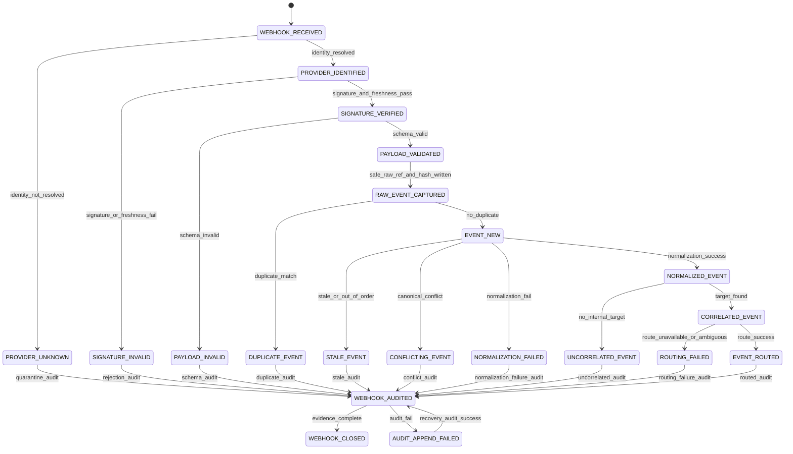

# 001280_Spec_Logic_POS_Gateway_Webhook_Inbound_Verification_Event_Normalization_State_Transition_And_Exception_Rule.md

## 1. Document Control

| Field | Value |
|---|---|
| Project | yoonsul_wait_order_handoff / CatchMenu-Catch&Order |
| Band | 00100_project_foundation |
| Document Type | Spec |
| Document Layer | Logic |
| Document Role | POS Gateway Webhook Inbound Verification / Event Normalization State Transition And Exception Rule |
| Parent Overview | 001270_Spec_Overview_POS_Gateway_Webhook_Inbound_Verification_And_Event_Normalization_Main_Flow.md |
| Related Runtime Flow Bundle | 064140_Flow_POS_Gateway_Webhook_Inbound_Verification_And_Event_Normalization.md |
| Related Approval Package | 000990_Index_POS_Gateway_Approval_Implementation_Package_Closeout.md |
| Related Cancel Refund Package | 001080_Index_POS_Gateway_Cancel_Refund_Implementation_Package_Closeout.md |
| Related Timeout Retry DLQ Replay Package | 001170_Index_POS_Gateway_Timeout_Retry_DLQ_Replay_Implementation_Package_Closeout.md |
| Related Store Offline Local Ledger Resync Package | 001260_Index_POS_Gateway_Store_Offline_Local_Ledger_Resync_Implementation_Package_Closeout.md |
| Related Logic Template | 000670_Template_Development_Foundation_Logic_Document.md |
| Related Traceability Matrix | 000690_Matrix_Development_Foundation_Overview_Logic_Module_Traceability.md |
| Related Flow Registry | 064000_Index_Runtime_Flow_Bundle_Registry.md |
| Next Module Document | 001290_Spec_Module_POS_Gateway_Webhook_Inbound_Verification_Event_Normalization_API_Data_Model_And_Test_Map.md |
| Status | Draft |
| Owner | Architecture / Engineering / QA / Compliance / Security / Operations |
| AI Solo Change | Documentation drafting allowed; runtime implementation approval prohibited |

---

## 2. Purpose

This Logic document defines the state transition, verification, deduplication, ordering, normalization, correlation, routing, quarantine, audit, and evidence rules for POS Gateway Webhook Inbound Verification and Event Normalization.

It is the second layer of the Development Foundation implementation chain:

```text
Overview → Logic → Module → File → Test → Evidence
```

This document must be reviewed before runtime code handoff.

---

## 3. Scope

### 3.1 Included

- Inbound webhook state model.
- Provider identity resolution rules.
- Signature verification rules.
- Timestamp freshness rules.
- Nonce/replay protection rules.
- Key version rules.
- Payload schema validation rules.
- Safe raw event capture rules.
- Payload hash rules.
- Event identity and deduplication rules.
- Ordering and stale event handling rules.
- Provider-to-canonical event normalization rules.
- Correlation to internal attempt/ledger target.
- Routing to approval/cancel/refund/settlement/dispute/reconciliation flow.
- Quarantine and DLQ rules.
- Audit append rules.
- Evidence requirements.

### 3.2 Excluded

- Provider credential rotation procedure.
- Provider settlement dispute adjudication.
- Manual dispute resolution.
- DB migration execution.
- Production deployment.
- Public provider API documentation.
- Offline local ledger implementation.

---

## 4. Business Logic Intent

Inbound provider events are external facts.  
They are not automatically trusted.

Core rule:

```text
A webhook event may not mutate financial or operational canonical state until identity, signature, freshness, replay protection, schema, event identity, ordering, normalization, correlation, and audit requirements pass.
```

Invalid or uncertain events must be rejected, quarantined, or routed to DLQ without financial mutation.

---

## 5. No-AI-Solo Zone Classification

| Area | AI Solo Allowed? | Human Approval Required? | Reason |
|---|---:|---:|---|
| Webhook signature verification logic | No | Yes | Forgery and financial mutation risk |
| Secret/key version handling | No | Yes | Credential security |
| Replay attack prevention | No | Yes | Duplicate mutation and fraud risk |
| Event deduplication affecting financial mutation | No | Yes | Duplicate approval/refund risk |
| Event normalization to final payment/refund state | No | Yes | Incorrect final-state risk |
| Correlation to internal financial attempt | No | Yes | Wrong ledger mutation risk |
| Ledger mutation from webhook | No | Yes | Canonical state integrity |
| Quarantine/replay handling | No | Yes | Unsafe event recovery risk |
| Audit ledger append behavior | No | Yes | Evidence integrity |
| DB schema/migration | No | Yes | Data integrity |
| Production release/deploy | No | Yes | Runtime stability |

---

## 6. Primary State Model

| State | Meaning | Entry Condition | Exit Condition | Terminal? |
|---|---|---|---|---:|
| WEBHOOK_RECEIVED | HTTP webhook request arrived | Inbound endpoint received request | Provider identity resolution | No |
| PROVIDER_UNKNOWN | Provider/store/policy cannot be resolved | Identity resolver fails | Quarantine/reject | Conditional |
| PROVIDER_IDENTIFIED | Provider/store/policy resolved | Identity resolver succeeds | Signature verification | No |
| SIGNATURE_INVALID | Signature, timestamp, nonce, or key version fails | Verification fails | Reject/quarantine/audit | Conditional |
| SIGNATURE_VERIFIED | Signature and freshness checks pass | Verification succeeds | Schema validation | No |
| PAYLOAD_INVALID | Payload schema or required fields fail | Schema validation fails | Quarantine/audit | Conditional |
| PAYLOAD_VALIDATED | Payload schema valid | Schema validation succeeds | Raw event capture | No |
| RAW_EVENT_CAPTURED | Payload hash and safe raw reference stored | Raw capture succeeds | Deduplication | No |
| DUPLICATE_EVENT | Event already processed or acknowledged | Deduplication matches | Idempotent ack/audit | Conditional |
| EVENT_NEW | Event identity not previously processed | Deduplication passes | Ordering/state guard | No |
| STALE_EVENT | Event is older than accepted state transition | Ordering guard fails as stale | Quarantine/ignore with evidence | Conditional |
| CONFLICTING_EVENT | Event conflicts with canonical state | Ordering/correlation conflict | Review/quarantine | Conditional |
| NORMALIZATION_FAILED | Provider payload cannot be mapped safely | Normalizer fails | Quarantine/audit | Conditional |
| NORMALIZED_EVENT | Provider payload mapped to canonical event | Normalization succeeds | Correlation | No |
| UNCORRELATED_EVENT | Event cannot be linked to target | Correlation fails | Quarantine/review | Conditional |
| CORRELATED_EVENT | Event linked to internal attempt/ledger target | Correlation succeeds | Routing | No |
| ROUTING_FAILED | Internal target or route is ambiguous/unavailable | Router fails | DLQ/recovery | Conditional |
| EVENT_ROUTED | Event routed to target ledger/reconciliation flow | Routing succeeds | Audit/closeout | No |
| AUDIT_APPEND_FAILED | Material audit append fails | Audit write fails | Incident/recovery | No |
| WEBHOOK_AUDITED | Verification/routing/rejection evidence appended | Audit succeeds | Closeout/projection | No |
| WEBHOOK_CLOSED | Event has terminal accepted/rejected/quarantined evidence | All required evidence exists | None | Yes |

---

## 7. State Transition Diagram



---

## 8. Event Model

| Event | Producer | Consumer | Required Payload | Idempotency / Dedup Key | Audit Required |
|---|---|---|---|---|---:|
| webhook.received | Inbound Endpoint | Identity Resolver / Audit | received_at, endpoint_ref, request_ref, source_ip_ref | request_ref | Yes |
| webhook.provider_identified | Identity Resolver | Signature Verifier | provider, store_id, merchant_ref, signature_policy_ref | request_ref | Yes |
| webhook.signature_verified | Signature Verifier | Schema Validator | provider, key_version, timestamp_status, nonce_status | provider_event_id or request_ref | Yes |
| webhook.signature_rejected | Signature Verifier | Quarantine / Audit | reject_reason, policy_ref | request_ref | Yes |
| webhook.payload_validated | Schema Validator | Raw Event Store | schema_version, event_type, required_ids | provider_event_id | Yes |
| webhook.payload_rejected | Schema Validator | Quarantine / Audit | invalid_fields, schema_version | request_ref | Yes |
| webhook.raw_captured | Raw Event Store | Dedup Guard | payload_hash, raw_ref | provider_event_id + payload_hash | Yes |
| webhook.duplicate_detected | Dedup Guard | Audit / Endpoint | duplicate_reason, prior_event_ref | provider_event_id + payload_hash | Yes |
| webhook.normalized | Event Normalizer | Correlation Resolver | canonical_event, payload_hash, evidence_ref | canonical_event_id | Yes |
| webhook.normalization_failed | Event Normalizer | Quarantine / Audit | failure_reason, provider_event_type | provider_event_id | Yes |
| webhook.correlated | Correlation Resolver | Event Router | attempt_ref, canonical_target, correlation_confidence | canonical_event_id | Yes |
| webhook.uncorrelated | Correlation Resolver | Quarantine / Audit | missing_target_reason | provider_event_id | Yes |
| webhook.routed | Event Router | Ledger / Audit / Reconciliation | route_target, canonical_event_id | canonical_event_id | Yes |
| webhook.quarantined | Quarantine | Admin / Audit | reason, evidence_ref, review_required | quarantine_id | Yes |
| webhook.closed | Webhook Processor | Audit / Projection | final_webhook_state, evidence_ref | provider_event_id | Yes |

---

## 9. Provider Identity Rules

| Rule ID | Condition | Required Action | Evidence |
|---|---|---|---|
| LOGIC-POS-WH-R001 | Inbound endpoint receives webhook | Capture request metadata and request_ref | webhook_received_evidence |
| LOGIC-POS-WH-R002 | Provider/store/merchant cannot be resolved | Reject or quarantine without mutation | provider_unknown_evidence |
| LOGIC-POS-WH-R003 | Provider/store/merchant resolved | Load provider signature policy and schema policy | provider_identified_evidence |
| LOGIC-POS-WH-R004 | Endpoint is not registered for provider | Reject or quarantine without mutation | endpoint_policy_mismatch_evidence |
| LOGIC-POS-WH-R005 | Merchant/store context mismatches known mapping | Quarantine and create review task | merchant_context_mismatch_evidence |

---

## 10. Signature / Freshness / Replay Rules

| Rule ID | Condition | Required Action | Evidence |
|---|---|---|---|
| LOGIC-POS-WH-R006 | Signature missing | Reject or quarantine; no mutation | signature_missing_evidence |
| LOGIC-POS-WH-R007 | Signature invalid | Reject or quarantine; no mutation | signature_invalid_evidence |
| LOGIC-POS-WH-R008 | Timestamp missing where required | Reject or quarantine; no mutation | timestamp_missing_evidence |
| LOGIC-POS-WH-R009 | Timestamp outside freshness window | Reject or quarantine; no mutation | timestamp_stale_evidence |
| LOGIC-POS-WH-R010 | Nonce/replay key already used outside policy | Reject or quarantine; no mutation | replay_detected_evidence |
| LOGIC-POS-WH-R011 | Key version is unknown or retired | Reject or quarantine unless approved grace policy exists | key_version_invalid_evidence |
| LOGIC-POS-WH-R012 | Signature, timestamp, nonce, and key version pass | Allow schema validation | signature_verified_evidence |

---

## 11. Payload Schema Rules

| Rule ID | Condition | Required Action | Evidence |
|---|---|---|---|
| LOGIC-POS-WH-R013 | Required event identity missing | Quarantine; no mutation | provider_event_id_missing_evidence |
| LOGIC-POS-WH-R014 | Required provider reference missing | Quarantine; no mutation | provider_ref_missing_evidence |
| LOGIC-POS-WH-R015 | Required amount/currency missing for financial event | Quarantine; no mutation | amount_currency_missing_evidence |
| LOGIC-POS-WH-R016 | Unknown schema version | Quarantine or route to review | schema_version_unknown_evidence |
| LOGIC-POS-WH-R017 | Payload field type invalid | Quarantine; no mutation | schema_invalid_evidence |
| LOGIC-POS-WH-R018 | Payload schema valid | Capture raw reference and payload hash | payload_validated_evidence |

---

## 12. Raw Event Capture Rules

| Rule ID | Rule | Required Behavior | Evidence |
|---|---|---|---|
| LOGIC-POS-WH-R019 | Payload hash required | Store payload_hash before mutation | payload_hash_evidence |
| LOGIC-POS-WH-R020 | Safe raw event reference required | Store safe raw_ref or masked payload reference | raw_event_capture_evidence |
| LOGIC-POS-WH-R021 | No raw secret logging | Do not store raw signatures/secrets/credentials in logs or evidence | webhook_secret_masking_evidence |
| LOGIC-POS-WH-R022 | Immutable receive evidence | Do not mutate original received event evidence | raw_event_immutability_evidence |

---

## 13. Deduplication Rules

| Rule ID | Condition | Required Action | Evidence |
|---|---|---|---|
| LOGIC-POS-WH-R023 | Same provider_event_id and same payload_hash already processed | Return idempotent acknowledgement; do not reapply | duplicate_same_payload_evidence |
| LOGIC-POS-WH-R024 | Same provider_event_id but different payload_hash | Quarantine as identity/hash conflict | duplicate_hash_conflict_evidence |
| LOGIC-POS-WH-R025 | Same provider_ref and canonical_event_type already terminal | Do not reapply; route to duplicate/stale handling | duplicate_terminal_state_evidence |
| LOGIC-POS-WH-R026 | No duplicate found | Continue ordering/state guard | event_new_evidence |

---

## 14. Ordering / Canonical State Rules

| Rule ID | Condition | Required Action | Evidence |
|---|---|---|---|
| LOGIC-POS-WH-R027 | Event is older than current verified state | Mark stale; no overwrite | stale_event_evidence |
| LOGIC-POS-WH-R028 | Event conflicts with terminal internal state | Quarantine and create review task | canonical_conflict_evidence |
| LOGIC-POS-WH-R029 | Event has same semantic state as current canonical state | Link as duplicate/no-op with audit | semantic_duplicate_evidence |
| LOGIC-POS-WH-R030 | Ordering cannot be determined | Quarantine or route to manual review | ordering_unknown_evidence |
| LOGIC-POS-WH-R031 | Event passes ordering and state guard | Continue normalization | ordering_verified_evidence |

---

## 15. Normalization Rules

| Rule ID | Condition | Required Action | Evidence |
|---|---|---|---|
| LOGIC-POS-WH-R032 | Provider event type is unknown | Quarantine; do not map to final state | unknown_provider_event_evidence |
| LOGIC-POS-WH-R033 | Provider event maps to canonical event type | Produce canonical_event_type and canonical_event_id | event_normalized_evidence |
| LOGIC-POS-WH-R034 | Financial event lacks explicit provider proof | Do not normalize to final approval/refund state | provider_proof_missing_evidence |
| LOGIC-POS-WH-R035 | Amount/currency mismatch with internal attempt | Quarantine and create review task | amount_currency_mismatch_evidence |
| LOGIC-POS-WH-R036 | Normalization fails | Quarantine; no mutation | normalization_failed_evidence |

---

## 16. Correlation Rules

| Rule ID | Condition | Required Action | Evidence |
|---|---|---|---|
| LOGIC-POS-WH-R037 | Event correlates to approval attempt | Route to approval ledger flow | approval_correlation_evidence |
| LOGIC-POS-WH-R038 | Event correlates to cancel/refund attempt | Route to cancel/refund ledger flow | refund_correlation_evidence |
| LOGIC-POS-WH-R039 | Event correlates to settlement item | Route to settlement/reconciliation flow | settlement_correlation_evidence |
| LOGIC-POS-WH-R040 | Event correlates to dispute | Route to dispute/review flow | dispute_correlation_evidence |
| LOGIC-POS-WH-R041 | Event cannot be correlated | Quarantine and create review task | uncorrelated_event_evidence |
| LOGIC-POS-WH-R042 | Event correlates to multiple possible targets | Quarantine as ambiguous correlation | ambiguous_correlation_evidence |

---

## 17. Routing Rules

| Rule ID | Condition | Required Action | Evidence |
|---|---|---|---|
| LOGIC-POS-WH-R043 | Correlated approval event | Route to approval/audit/reconciliation flow | webhook_approval_route_evidence |
| LOGIC-POS-WH-R044 | Correlated cancel/refund event | Route to cancel/refund/audit/reconciliation flow | webhook_refund_route_evidence |
| LOGIC-POS-WH-R045 | Correlated settlement event | Route to settlement/reconciliation flow | webhook_settlement_route_evidence |
| LOGIC-POS-WH-R046 | Correlated dispute event | Route to dispute/manual review flow | webhook_dispute_route_evidence |
| LOGIC-POS-WH-R047 | Routing target unavailable | DLQ/retry path without financial mutation | routing_failed_evidence |
| LOGIC-POS-WH-R048 | Routing succeeds | Append route evidence and closeout | event_routed_evidence |

---

## 18. Quarantine / DLQ Rules

| Condition | Required Behavior |
|---|---|
| Unknown provider | Quarantine/reject without mutation |
| Endpoint policy mismatch | Quarantine/reject without mutation |
| Signature invalid | Reject/quarantine without mutation |
| Timestamp stale | Reject/quarantine without mutation |
| Replay detected | Reject/quarantine without mutation |
| Schema invalid | Quarantine without mutation |
| Duplicate hash conflict | Quarantine/review |
| Stale event | No overwrite; quarantine or no-op with audit |
| Canonical conflict | Quarantine/manual review |
| Unknown provider event type | Quarantine/review |
| Provider proof missing | Quarantine/review |
| Correlation missing | Quarantine/review |
| Ambiguous correlation | Quarantine/manual review |
| Routing failure | DLQ/retry with evidence |
| Audit append failure | Incident/recovery path |

Quarantine must preserve evidence and must not silently delete inbound events.

---

## 19. Audit Ledger Rules

| Audit Item | Required |
|---|---:|
| Webhook received | Yes |
| Provider identity resolved or failed | Yes |
| Signature verification pass/fail | Yes |
| Timestamp/nonce/key version pass/fail | Yes |
| Schema validation pass/fail | Yes |
| Raw event payload hash captured | Yes |
| Deduplication result | Yes |
| Ordering/state guard result | Yes |
| Normalization result | Yes |
| Correlation result | Yes |
| Routing result | Yes |
| Quarantine/DLQ result | Yes |
| Duplicate no-op result | Yes |
| Conflict review task created | Yes |
| Webhook closeout | Yes |
| Audit append failure | Yes |

Audit logs must not include raw secrets, credentials, or unnecessary sensitive payload data.

---

## 20. Safe Projection Rules

| Audience | Allowed Status |
|---|---|
| Customer | Processing, Confirmed, Failed, Pending Verification, Contact Store |
| Store Staff | Provider Event Received, Verified, Pending Review, Conflict, Routed, Quarantined |
| Admin | Full verification/correlation/routing/quarantine details |
| AI Customer Center | SOP/evidence-based explanation only; no invented final state |

Projection rules:

1. Invalid webhook must not create final customer-visible state.
2. Duplicate webhook must not re-trigger customer/store finalization.
3. Unknown event must not be shown as payment/refund success.
4. Uncorrelated event must remain pending review.
5. Webhook event must not override verified internal terminal state without approved rule.
6. AI customer center must not infer final payment/refund status without ledger/audit evidence.

---

## 21. Test Requirements

| Test Type | Required Scenarios |
|---|---|
| Unit | identity resolution, signature verification, timestamp window, nonce replay, schema validation, normalization, correlation |
| Integration | receive → verify → validate → dedup → normalize → correlate → route → audit |
| Security | forged signature, stale timestamp, nonce replay, key version invalid, raw secret masking |
| Fault Injection | duplicate event, hash conflict, unknown provider, unknown event type, routing failure, audit failure |
| Regression | duplicate webhook does not create duplicate approval/refund/settlement state |
| Ordering | stale event does not overwrite newer terminal state |
| Audit | every material decision creates evidence |
| Projection | invalid/unknown/unverified webhook never shown as final customer success |

---

## 22. Evidence Requirements

| Evidence | Required For |
|---|---|
| webhook_received_evidence | inbound request received |
| provider_unknown_evidence | provider resolution failure |
| provider_identified_evidence | provider/store/policy resolved |
| endpoint_policy_mismatch_evidence | endpoint mismatch |
| merchant_context_mismatch_evidence | merchant/store mismatch |
| signature_missing_evidence | missing signature |
| signature_invalid_evidence | invalid signature |
| timestamp_missing_evidence | timestamp required but absent |
| timestamp_stale_evidence | timestamp outside window |
| replay_detected_evidence | nonce/replay duplicate |
| key_version_invalid_evidence | unknown/retired key version |
| signature_verified_evidence | verification pass |
| provider_event_id_missing_evidence | missing provider event ID |
| provider_ref_missing_evidence | missing provider reference |
| amount_currency_missing_evidence | missing financial amount/currency |
| schema_version_unknown_evidence | unknown schema version |
| schema_invalid_evidence | schema invalid |
| payload_validated_evidence | payload valid |
| payload_hash_evidence | hash captured |
| raw_event_capture_evidence | raw event safe reference |
| webhook_secret_masking_evidence | no raw secret in storage/log/evidence |
| raw_event_immutability_evidence | raw receive evidence immutable |
| duplicate_same_payload_evidence | duplicate no-op |
| duplicate_hash_conflict_evidence | duplicate ID with hash conflict |
| duplicate_terminal_state_evidence | terminal duplicate no-op |
| event_new_evidence | new event accepted for processing |
| stale_event_evidence | stale event blocked/no-op |
| canonical_conflict_evidence | canonical conflict quarantined |
| semantic_duplicate_evidence | same semantic state linked |
| ordering_unknown_evidence | order unknown routed to review |
| ordering_verified_evidence | ordering guard pass |
| unknown_provider_event_evidence | unknown event type quarantined |
| event_normalized_evidence | normalized canonical event |
| provider_proof_missing_evidence | provider proof missing |
| amount_currency_mismatch_evidence | amount/currency mismatch |
| normalization_failed_evidence | normalization failure |
| approval_correlation_evidence | approval correlation |
| refund_correlation_evidence | refund correlation |
| settlement_correlation_evidence | settlement correlation |
| dispute_correlation_evidence | dispute correlation |
| uncorrelated_event_evidence | no correlation |
| ambiguous_correlation_evidence | multiple candidate targets |
| webhook_approval_route_evidence | approval route |
| webhook_refund_route_evidence | refund route |
| webhook_settlement_route_evidence | settlement route |
| webhook_dispute_route_evidence | dispute route |
| routing_failed_evidence | route failure |
| event_routed_evidence | route success |
| webhook_closeout_evidence | final closeout |

---

## 23. Downstream Module Mapping Requirements

Required downstream document:

```text
001290_Spec_Module_POS_Gateway_Webhook_Inbound_Verification_Event_Normalization_API_Data_Model_And_Test_Map.md
```

Minimum mapping:

| Logic Rule | Required Module Mapping |
|---|---|
| R001~R005 | inbound endpoint, provider identity resolver |
| R006~R012 | signature verifier, timestamp guard, nonce replay guard, key version guard |
| R013~R018 | payload schema validator |
| R019~R022 | raw event store, payload hash service, secret masking guard |
| R023~R026 | webhook deduplication guard |
| R027~R031 | ordering/state guard |
| R032~R036 | event normalizer |
| R037~R042 | correlation resolver |
| R043~R048 | event router, DLQ/quarantine, audit append |
| Audit rules | webhook audit append service |
| Projection rules | safe status projector |

---

## 24. Approval Gate

This Logic document is not implementation-ready until:

- [ ] Architecture confirms webhook state model.
- [ ] Security confirms signature/timestamp/nonce/key version rules.
- [ ] Engineering confirms schema/dedup/normalization/correlation implementability.
- [ ] QA confirms testability.
- [ ] Compliance confirms audit/evidence sufficiency.
- [ ] Operations confirms quarantine/DLQ/review process.
- [ ] Product confirms event categories and MVP provider scope.
- [ ] No-AI-Solo classification is accepted.
- [ ] Module document 01290 is created.
- [ ] Source files are mapped after hydration.
- [ ] Test coverage map is updated.

---

## 25. Summary

This document defines the logic rules for POS Gateway Webhook Inbound Verification and Event Normalization.

It must not be used alone as a code instruction.

Runtime implementation requires the full chain:

```text
Overview → Logic → Module → File → Test → Evidence
```

and the Runtime Flow Bundle chain:

```text
Flow Step → Module → File → Test → Evidence
```
