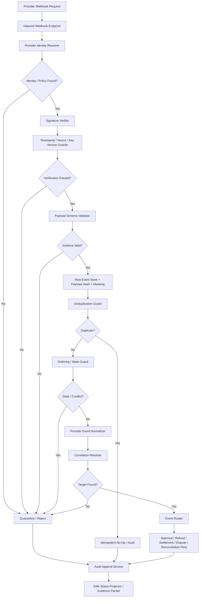

# 001290_Spec_Module_POS_Gateway_Webhook_Inbound_Verification_Event_Normalization_API_Data_Model_And_Test_Map.md

## 1. Document Control

| Field | Value |
|---|---|
| Project | yoonsul_wait_order_handoff / CatchMenu-Catch&Order |
| Band | 00100_project_foundation |
| Document Type | Spec |
| Document Layer | Module |
| Document Role | POS Gateway Webhook Inbound Verification / Event Normalization API, Data Model, And Test Map |
| Parent Overview | 001270_Spec_Overview_POS_Gateway_Webhook_Inbound_Verification_And_Event_Normalization_Main_Flow.md |
| Parent Logic | 001280_Spec_Logic_POS_Gateway_Webhook_Inbound_Verification_Event_Normalization_State_Transition_And_Exception_Rule.md |
| Related Approval Package | 000990_Index_POS_Gateway_Approval_Implementation_Package_Closeout.md |
| Related Cancel Refund Package | 001080_Index_POS_Gateway_Cancel_Refund_Implementation_Package_Closeout.md |
| Related Timeout Retry DLQ Replay Package | 001170_Index_POS_Gateway_Timeout_Retry_DLQ_Replay_Implementation_Package_Closeout.md |
| Related Store Offline Local Ledger Resync Package | 001260_Index_POS_Gateway_Store_Offline_Local_Ledger_Resync_Implementation_Package_Closeout.md |
| Related Runtime Flow Bundle | 064140_Flow_POS_Gateway_Webhook_Inbound_Verification_And_Event_Normalization.md |
| Related Module Template | 000680_Template_Development_Foundation_Module_Document.md |
| Related Source Tree Matrix | 000820_Matrix_Development_Foundation_Source_Tree_To_Module_Document_Map.md |
| Related Owner Register | 000830_Register_Development_Foundation_Repository_Module_Owner_Map.md |
| Related Restricted Register | 000750_Register_Development_Foundation_Restricted_File_And_Zone_Control.md |
| Status | Draft / Pending Codebase Hydration |
| Owner | Architecture / Engineering / QA / Compliance / Security / Operations |
| AI Solo Change | Documentation drafting allowed; runtime implementation approval prohibited |

---

## 2. Purpose

This Module document maps POS Gateway Webhook Inbound Verification / Event Normalization logic rules to implementation-facing APIs, modules, data models, queues, jobs, tests, and evidence.

It is the third layer in the Development Foundation chain:

```text
Overview → Logic → Module → File → Test → Evidence
```

Actual source paths and test paths must be filled after codebase hydration.

---

## 3. Scope

### 3.1 Included

- Inbound webhook endpoint boundary.
- Provider identity resolver.
- Endpoint/store/merchant context resolver.
- Signature verifier.
- Timestamp freshness guard.
- Nonce/replay guard.
- Key version guard.
- Payload schema validator.
- Raw event capture service.
- Payload hash service.
- Webhook secret masking guard.
- Deduplication guard.
- Ordering/state guard.
- Provider event normalizer.
- Correlation resolver.
- Event router.
- Quarantine/DLQ router.
- Webhook audit append service.
- Webhook safe status projector.
- Test and evidence map.

### 3.2 Excluded

- Provider credential rotation procedure.
- Provider settlement dispute adjudication.
- Manual dispute resolution.
- DB migration execution.
- Production deployment.
- Public provider API documentation.
- Offline local ledger implementation.

---

## 4. Implementation Readiness Warning

This document contains expected module boundaries and placeholder paths.

Runtime implementation is blocked until:

1. actual source paths are known,
2. actual tests are known,
3. restricted files are registered,
4. owners are assigned,
5. provider signature policies are approved,
6. timestamp freshness and replay window policies are approved,
7. canonical normalized event schema is approved,
8. event-to-ledger mutation rules are approved,
9. quarantine/DLQ review policy is approved,
10. evidence targets are created,
11. human approval exists for restricted webhook verification and financial-state mutation paths.

---

## 5. Runtime Module Map

| Module | Responsibility | Related Logic Rule | Restricted Zone | Owner |
|---|---|---|---|---|
| inbound_webhook_endpoint | Receives provider HTTP webhook requests and captures request metadata | R001 | RZ-API / RZ-SECURITY | Engineering / Security |
| provider_identity_resolver | Resolves provider, store, merchant, endpoint, and signature policy | R002~R005 | RZ-SECURITY / RZ-PROVIDER | Engineering / Provider Integration |
| webhook_signature_verifier | Verifies signature using provider policy and key version | R006~R012 | RZ-SECURITY | Security / Engineering |
| webhook_timestamp_guard | Validates timestamp freshness window | R008~R009 | RZ-SECURITY | Security / Engineering |
| webhook_nonce_replay_guard | Detects nonce/replay attempts | R010 | RZ-SECURITY / RZ-IDEMPOTENCY | Security / Engineering |
| webhook_key_version_guard | Validates active/grace/retired key version | R011~R012 | RZ-SECURITY / RZ-SECRET | Security / Engineering |
| webhook_payload_schema_validator | Validates provider payload schema and required fields | R013~R018 | RZ-API / RZ-PROVIDER | Engineering / QA |
| webhook_raw_event_store | Stores safe raw event reference and immutable receive metadata | R019~R022 | RZ-AUDIT / RZ-DATA | Engineering / Compliance |
| webhook_payload_hash_service | Computes and stores payload hash | R019 | RZ-AUDIT / RZ-SECURITY | Engineering / Security |
| webhook_secret_masking_guard | Prevents raw secret/signature/credential leakage | R021 | RZ-SECURITY | Security / Engineering |
| webhook_deduplication_guard | Detects duplicate, hash-conflict, and terminal duplicate events | R023~R026 | RZ-IDEMPOTENCY / RZ-PAY | Engineering / Compliance |
| webhook_ordering_state_guard | Blocks stale or conflicting state transitions | R027~R031 | RZ-PAY / RZ-REFUND / RZ-LEDGER | Engineering / Compliance |
| provider_event_normalizer | Converts provider-specific payload to canonical event | R032~R036 | RZ-PAY / RZ-REFUND / RZ-SETTLE | Engineering / Provider Integration |
| webhook_correlation_resolver | Links normalized event to internal approval/refund/settlement/dispute target | R037~R042 | RZ-LEDGER / RZ-RECON | Engineering / Compliance |
| webhook_event_router | Routes canonical event to approval/refund/settlement/dispute/recon flows | R043~R048 | RZ-LEDGER / RZ-AUDIT | Engineering / Compliance |
| webhook_quarantine_dlq_router | Quarantines invalid, unsafe, uncorrelated, stale, or conflicting events | Quarantine rules | RZ-DLQ / RZ-OPS | Engineering / Operations |
| webhook_audit_append_service | Appends verification, rejection, routing, quarantine, and closeout evidence | Audit rules | RZ-AUDIT | Engineering / Compliance |
| webhook_status_projector | Projects safe customer/store/admin status | Projection rules | Conditional | Product / Engineering |
| webhook_test_harness | Tests verification, schema, dedup, ordering, normalization, correlation, routing, audit | All | Conditional | QA / Engineering |

---

## 6. Source File Map

Actual paths must be filled after hydration.

| Source File / Folder | Expected Role | Related Module | Related Logic | Test File | Evidence |
|---|---|---|---|---|---|
| TBD | Inbound webhook endpoint | inbound_webhook_endpoint | R001 | TBD | webhook_received_evidence |
| TBD | Provider identity resolver | provider_identity_resolver | R002~R005 | TBD | provider_identified_or_unknown_evidence |
| TBD | Signature verifier | webhook_signature_verifier | R006~R012 | TBD | signature_verified_or_rejected_evidence |
| TBD | Timestamp freshness guard | webhook_timestamp_guard | R008~R009 | TBD | timestamp_freshness_evidence |
| TBD | Nonce/replay guard | webhook_nonce_replay_guard | R010 | TBD | replay_detected_evidence |
| TBD | Key version guard | webhook_key_version_guard | R011~R012 | TBD | key_version_evidence |
| TBD | Payload schema validator | webhook_payload_schema_validator | R013~R018 | TBD | schema_validation_evidence |
| TBD | Raw event store | webhook_raw_event_store | R019~R022 | TBD | raw_event_capture_evidence |
| TBD | Payload hash service | webhook_payload_hash_service | R019 | TBD | payload_hash_evidence |
| TBD | Secret masking guard | webhook_secret_masking_guard | R021 | TBD | webhook_secret_masking_evidence |
| TBD | Deduplication guard | webhook_deduplication_guard | R023~R026 | TBD | duplicate_or_new_event_evidence |
| TBD | Ordering/state guard | webhook_ordering_state_guard | R027~R031 | TBD | ordering_state_guard_evidence |
| TBD | Provider event normalizer | provider_event_normalizer | R032~R036 | TBD | event_normalized_or_failed_evidence |
| TBD | Correlation resolver | webhook_correlation_resolver | R037~R042 | TBD | correlation_evidence |
| TBD | Event router | webhook_event_router | R043~R048 | TBD | event_routed_evidence |
| TBD | Quarantine/DLQ router | webhook_quarantine_dlq_router | Quarantine rules | TBD | quarantine_dlq_evidence |
| TBD | Audit append service | webhook_audit_append_service | Audit rules | TBD | audit_append_evidence |
| TBD | Status projector | webhook_status_projector | Projection rules | TBD | safe_projection_evidence |

---

## 7. API / Interface Map

### 7.1 Inbound Webhook Interface

| Interface | Direction | Caller | Callee | Request | Response | Related Logic |
|---|---|---|---|---|---|---|
| receiveProviderWebhook | External Inbound | Provider / PG / VAN | Inbound Webhook Endpoint | headers, body, endpoint_ref, source metadata | ack / reject / accepted_for_processing | R001 |
| resolveProviderIdentity | Internal | Webhook Endpoint | Provider Identity Resolver | endpoint_ref, headers, merchant hints, store hints | provider_context, signature_policy, schema_policy | R002~R005 |

### 7.2 Verification Interface

| Interface | Direction | Caller | Callee | Request | Response | Related Logic |
|---|---|---|---|---|---|---|
| verifyWebhookSignature | Internal | Webhook Endpoint | Signature Verifier | provider_context, headers, raw_body, key_version | verified, reject_reason | R006~R012 |
| checkWebhookTimestamp | Internal | Signature Verifier | Timestamp Guard | provider_context, timestamp | freshness_status | R008~R009 |
| checkWebhookNonceReplay | Internal | Signature Verifier | Nonce Replay Guard | provider_context, nonce, provider_event_id | replay_status | R010 |
| validateWebhookKeyVersion | Internal | Signature Verifier | Key Version Guard | provider_context, key_version | key_status | R011~R012 |

### 7.3 Payload / Raw Event Interface

| Interface | Direction | Caller | Callee | Request | Response | Related Logic |
|---|---|---|---|---|---|---|
| validateWebhookPayloadSchema | Internal | Webhook Endpoint | Payload Schema Validator | provider_context, raw_body, schema_policy | valid, invalid_fields, event_identity | R013~R018 |
| captureRawWebhookEvent | Internal | Webhook Endpoint | Raw Event Store | provider_context, raw_body, payload_hash, receive_metadata | raw_event_ref | R019~R022 |
| computeWebhookPayloadHash | Internal | Raw Event Store | Payload Hash Service | raw_body | payload_hash | R019 |
| maskWebhookSensitiveFields | Internal | Raw Event Store / Logger | Secret Masking Guard | headers, raw_body, evidence_payload | masked_payload | R021 |

### 7.4 Processing Interface

| Interface | Direction | Caller | Callee | Request | Response | Related Logic |
|---|---|---|---|---|---|---|
| checkWebhookDeduplication | Internal | Webhook Processor | Deduplication Guard | provider_event_id, payload_hash, provider_ref, canonical_event_type | duplicate_status, prior_ref | R023~R026 |
| checkWebhookOrderingState | Internal | Webhook Processor | Ordering/State Guard | provider_event, canonical_target_state | ordering_status, state_decision | R027~R031 |
| normalizeProviderEvent | Internal | Webhook Processor | Provider Event Normalizer | provider_context, provider_payload | canonical_event | R032~R036 |
| correlateWebhookEvent | Internal | Webhook Processor | Correlation Resolver | canonical_event, provider_ref, attempt hints | correlation_result, target_ref | R037~R042 |
| routeWebhookEvent | Internal | Webhook Processor | Event Router | canonical_event, target_ref, correlation_result | route_result | R043~R048 |
| quarantineWebhookEvent | Internal | Any guard | Quarantine/DLQ Router | event_ref, reason, evidence_ref | quarantine_id | Quarantine rules |

---

## 8. Data Model Map

Actual schema names must be confirmed after hydration.

| Data Model / Table | Purpose | Key Fields | Related Logic | Restricted? |
|---|---|---|---|---:|
| webhook_receive_events | Immutable receive envelope | request_ref, provider_hint, endpoint_ref, received_at, source_ip_ref, headers_hash | R001 | Yes |
| provider_webhook_policies | Provider endpoint/signature/schema policy | provider, endpoint_ref, signature_policy_ref, schema_version, key_version_policy | R002~R012 | Yes |
| webhook_verification_results | Verification pass/fail result | request_ref, provider, signature_status, timestamp_status, nonce_status, key_version_status | R006~R012 | Yes |
| webhook_payload_validations | Schema validation result | request_ref, schema_version, event_type, valid, invalid_fields | R013~R018 | Conditional |
| webhook_raw_event_refs | Safe raw event reference and hash | raw_event_ref, request_ref, payload_hash, masked_ref, retention_state | R019~R022 | Yes |
| webhook_event_identities | Provider event identity and dedup index | provider_event_id, provider_ref, payload_hash, canonical_event_type, first_seen_at | R023~R026 | Yes |
| webhook_ordering_decisions | Ordering/state guard result | provider_event_id, target_ref, current_state, event_state, decision | R027~R031 | Yes |
| webhook_normalized_events | Canonical normalized event | canonical_event_id, provider_event_id, canonical_event_type, amount, currency, event_time, payload_hash | R032~R036 | Yes |
| webhook_correlations | Correlation to internal target | canonical_event_id, target_type, target_ref, confidence, status | R037~R042 | Yes |
| webhook_route_results | Routing result | canonical_event_id, route_target, route_status, routed_at | R043~R048 | Yes |
| webhook_quarantine_items | Quarantined/DLQ events | quarantine_id, request_ref, provider_event_id, reason, review_required, status | Quarantine rules | Yes |
| audit_events | Immutable audit trace | audit_event_id, event_type, entity_ref, evidence_ref, created_at | Audit rules | Yes |

---

## 9. Canonical Event Shape

The canonical event produced by the normalizer should include at minimum:

```text
canonical_event_id
provider
provider_event_id
provider_event_type
canonical_event_type
store_id
merchant_ref
attempt_ref
provider_ref
amount
currency
event_time
received_at
payload_hash
verification_status
schema_status
dedup_status
ordering_status
normalization_status
correlation_status
route_target
evidence_ref
```

Rules:

1. Unknown provider event types must not become final financial states.
2. Financial events must preserve amount and currency.
3. Final approval/refund states require explicit provider proof.
4. Canonical event must carry payload_hash and evidence_ref.
5. Normalization must not drop correlation-critical identifiers.

---

## 10. Queue / Job / Event Map

| Item | Type | Producer | Consumer | Related Logic | Retry / DLQ | Evidence |
|---|---|---|---|---|---|---|
| webhook.received | Event | Inbound Endpoint | Identity Resolver / Audit | R001 | Quarantine if invalid | webhook_received_evidence |
| webhook.provider_identified | Event | Identity Resolver | Signature Verifier | R002~R005 | Quarantine if unknown | provider_identified_evidence |
| webhook.signature_verified | Event | Signature Verifier | Schema Validator | R006~R012 | Reject/quarantine if fail | signature_verified_evidence |
| webhook.payload_validated | Event | Schema Validator | Raw Event Store | R013~R018 | Quarantine if invalid | payload_validated_evidence |
| webhook.raw_captured | Event | Raw Event Store | Dedup Guard | R019~R022 | Block if capture fails | raw_event_capture_evidence |
| webhook.duplicate_detected | Event | Dedup Guard | Audit / Endpoint | R023~R025 | No reapply | duplicate_same_payload_evidence |
| webhook.event_new | Event | Dedup Guard | Ordering Guard | R026 | Continue | event_new_evidence |
| webhook.ordering_verified | Event | Ordering Guard | Normalizer | R027~R031 | Quarantine if stale/conflict | ordering_verified_evidence |
| webhook.normalized | Event | Normalizer | Correlator | R032~R036 | Quarantine if fail | event_normalized_evidence |
| webhook.correlated | Event | Correlator | Router | R037~R042 | Quarantine if missing/ambiguous | correlation_evidence |
| webhook.routed | Event | Router | Ledger / Audit / Recon | R043~R048 | DLQ if route failure | event_routed_evidence |
| webhook.quarantined | Event | Any guard | Admin / Audit / DLQ | Quarantine rules | Review task | quarantine_dlq_evidence |
| webhook.closed | Event | Webhook Processor | Audit / Projection | Audit rules | Closeout | webhook_closeout_evidence |

---

## 11. Function / Class Responsibility Map

Expected symbols must be confirmed after hydration.

| Function / Class | Responsibility | Must Not Do | Related Logic | Test |
|---|---|---|---|---|
| receiveProviderWebhook | Receive inbound request and create request_ref | Must not mutate financial state directly | R001 | inbound endpoint tests |
| resolveProviderIdentity | Resolve provider/store/merchant/policy | Must not guess provider from unsafe payload only | R002~R005 | identity tests |
| verifyWebhookSignature | Verify signature using policy/key version | Must not accept invalid/unknown key | R006~R012 | signature tests |
| checkWebhookTimestampFreshness | Enforce freshness window | Must not accept stale timestamps | R008~R009 | timestamp tests |
| checkWebhookNonceReplay | Detect replay/nonce reuse | Must not allow replay mutation | R010 | replay tests |
| validateWebhookPayloadSchema | Validate provider payload fields | Must not normalize invalid payload | R013~R018 | schema tests |
| captureRawWebhookEvent | Store payload hash and safe raw ref | Must not leak secrets | R019~R022 | raw capture tests |
| checkWebhookDeduplication | Detect duplicates/hash conflicts | Must not reapply duplicate mutation | R023~R026 | dedup tests |
| checkWebhookOrderingState | Detect stale/conflicting transitions | Must not overwrite newer terminal state | R027~R031 | ordering tests |
| normalizeProviderEvent | Create canonical event | Must not infer final state without proof | R032~R036 | normalization tests |
| correlateWebhookEvent | Link event to internal target | Must not choose ambiguous target | R037~R042 | correlation tests |
| routeWebhookEvent | Route event to correct ledger/recon flow | Must not route unverified/uncorrelated event | R043~R048 | routing tests |
| quarantineWebhookEvent | Preserve unsafe event for review | Must not delete evidence silently | Quarantine rules | quarantine tests |
| appendWebhookAuditEvent | Append verification/routing evidence | Must not mutate prior audit | Audit rules | audit tests |
| projectWebhookStatus | Project safe status | Must not show invalid/unverified as final | Projection rules | projection tests |

---

## 12. Error Handling Map

| Error Type | Module Behavior | User/Store/Admin Behavior | Evidence |
|---|---|---|---|
| Unknown provider | Reject/quarantine without mutation | Admin review if needed | provider_unknown_evidence |
| Endpoint policy mismatch | Reject/quarantine without mutation | Admin/security review | endpoint_policy_mismatch_evidence |
| Invalid signature | Reject/quarantine without mutation | Admin/security review | signature_invalid_evidence |
| Stale timestamp | Reject/quarantine without mutation | Admin/security review | timestamp_stale_evidence |
| Replay detected | Reject/quarantine without mutation | Security review | replay_detected_evidence |
| Unknown key version | Reject/quarantine unless approved grace policy | Security review | key_version_invalid_evidence |
| Invalid schema | Quarantine without mutation | Admin/provider review | schema_invalid_evidence |
| Duplicate same payload | Idempotent ack/no-op | No duplicate projection | duplicate_same_payload_evidence |
| Duplicate hash conflict | Quarantine/review | Admin/security review | duplicate_hash_conflict_evidence |
| Stale event | No overwrite; quarantine/no-op | Admin review if needed | stale_event_evidence |
| Canonical conflict | Quarantine/review | Admin/compliance review | canonical_conflict_evidence |
| Unknown event type | Quarantine/review | Admin/provider review | unknown_provider_event_evidence |
| Missing provider proof | Quarantine/review | Pending verification | provider_proof_missing_evidence |
| Uncorrelated event | Quarantine/review | Admin review | uncorrelated_event_evidence |
| Routing failure | DLQ/retry path without financial mutation | Ops review | routing_failed_evidence |
| Audit append failure | Incident/recovery path | Compliance/engineering review | audit_append_failure_evidence |

---

## 13. Security Implementation Map

| Security Control | Implementation Point | Test | Evidence |
|---|---|---|---|
| Provider identity required | provider_identity_resolver | unknown_provider_test | provider_unknown_evidence |
| Endpoint policy required | provider_identity_resolver | endpoint_mismatch_test | endpoint_policy_mismatch_evidence |
| Signature verification required | webhook_signature_verifier | invalid_signature_test | signature_invalid_evidence |
| Timestamp freshness required | webhook_timestamp_guard | stale_timestamp_test | timestamp_stale_evidence |
| Nonce/replay prevention | webhook_nonce_replay_guard | replay_detected_test | replay_detected_evidence |
| Key version validation | webhook_key_version_guard | invalid_key_version_test | key_version_invalid_evidence |
| Payload hash required | webhook_payload_hash_service | missing_hash_test | payload_hash_evidence |
| Secret masking required | webhook_secret_masking_guard | secret_masking_test | webhook_secret_masking_evidence |
| Duplicate mutation prevented | webhook_deduplication_guard | duplicate_no_reapply_test | duplicate_same_payload_evidence |
| Terminal state protected | webhook_ordering_state_guard | stale_overwrite_test | stale_event_evidence |
| Unknown final state blocked | provider_event_normalizer | unknown_event_type_test | unknown_provider_event_evidence |

---

## 14. Test Map

| Test Type | Required Scenarios | Candidate Test File | Evidence |
|---|---|---|---|
| Unit | provider identity, signature, timestamp, nonce, key version, schema, dedup, ordering, normalization, correlation | TBD | unit_test_report |
| Integration | receive → verify → schema → raw capture → dedup → normalize → correlate → route → audit | TBD | integration_test_report |
| Security | forged signature, stale timestamp, nonce replay, invalid key version, secret masking | TBD | security_test_report |
| Fault Injection | unknown provider, schema invalid, duplicate hash conflict, unknown event type, route failure, audit failure | TBD | fault_test_report |
| Regression | duplicate webhook does not create duplicate approval/refund/settlement | TBD | regression_test_report |
| Ordering | stale event does not overwrite newer terminal state | TBD | ordering_test_report |
| Audit | every material decision creates audit evidence | TBD | audit_test_report |
| Projection | invalid/unknown/unverified webhook never shown as final success | TBD | projection_test_report |

---

## 15. Traceability Matrix

| Flow Step | Logic Rule | Module | Source File | Function/Class | Test | Evidence |
|---|---|---|---|---|---|---|
| Receive webhook | R001 | inbound_webhook_endpoint | TBD | receiveProviderWebhook | TBD | webhook_received_evidence |
| Resolve provider identity | R002~R005 | provider_identity_resolver | TBD | resolveProviderIdentity | TBD | provider_identified_or_unknown_evidence |
| Verify signature/freshness/replay/key | R006~R012 | webhook_signature_verifier + guards | TBD | verifyWebhookSignature | TBD | signature_verified_or_rejected_evidence |
| Validate schema | R013~R018 | webhook_payload_schema_validator | TBD | validateWebhookPayloadSchema | TBD | schema_validation_evidence |
| Capture raw ref/hash | R019~R022 | webhook_raw_event_store / payload_hash / masking guard | TBD | captureRawWebhookEvent | TBD | raw_event_capture_evidence |
| Deduplicate event | R023~R026 | webhook_deduplication_guard | TBD | checkWebhookDeduplication | TBD | duplicate_or_new_event_evidence |
| Check ordering/state | R027~R031 | webhook_ordering_state_guard | TBD | checkWebhookOrderingState | TBD | ordering_state_guard_evidence |
| Normalize event | R032~R036 | provider_event_normalizer | TBD | normalizeProviderEvent | TBD | event_normalized_or_failed_evidence |
| Correlate target | R037~R042 | webhook_correlation_resolver | TBD | correlateWebhookEvent | TBD | correlation_evidence |
| Route event | R043~R048 | webhook_event_router | TBD | routeWebhookEvent | TBD | event_routed_evidence |
| Quarantine/DLQ | Quarantine rules | webhook_quarantine_dlq_router | TBD | quarantineWebhookEvent | TBD | quarantine_dlq_evidence |
| Append audit | Audit rules | webhook_audit_append_service | TBD | appendWebhookAuditEvent | TBD | audit_append_evidence |
| Project safe status | Projection rules | webhook_status_projector | TBD | projectWebhookStatus | TBD | safe_projection_evidence |

---

## 16. Mermaid Module Diagram



---

## 17. Code Handoff Requirements

Before any implementation:

- [ ] Actual source paths are filled.
- [ ] Restricted paths are registered in 00750.
- [ ] Module owners are confirmed in 00830.
- [ ] Test files are identified.
- [ ] Evidence packet target is defined.
- [ ] MVP provider webhook list is approved.
- [ ] Provider signature policies are approved.
- [ ] Timestamp freshness and replay policies are approved.
- [ ] Canonical normalized event schema is approved.
- [ ] Financial-state mutation rules are approved.
- [ ] Quarantine/DLQ review process is approved.
- [ ] Human approval exists for restricted webhook verification and ledger mutation paths.
- [ ] Webhook handoff readiness checklist is passed.
- [ ] Bounded Claude/Cursor prompts are prepared.

---

## 18. Open Questions

| Question | Owner | Blocking? |
|---|---|---:|
| What are the actual source paths for webhook inbound modules? | Engineering | Yes |
| What providers are included in MVP webhook scope? | Product / Provider Integration | Yes |
| What signature scheme applies per provider? | Security / Provider Integration | Yes |
| What timestamp freshness window is allowed? | Security / Compliance | Yes |
| How are nonce/replay keys stored and expired? | Security / Engineering | Yes |
| What is the canonical normalized event schema? | Architecture / Engineering | Yes |
| Which events can mutate financial ledger state? | Compliance / Engineering | Yes |
| What is the quarantine/DLQ owner and SLA? | Operations / Compliance | Yes |

---

## 19. Summary

This Module document maps POS Gateway Webhook Inbound Verification / Event Normalization logic to expected implementation surfaces.

It is not yet a code handoff packet.

Implementation requires actual hydration results and the complete chain:

```text
Overview → Logic → Module → File → Test → Evidence
```

along with the parent Runtime Flow Bundle chain:

```text
Flow Step → Module → File → Test → Evidence
```
