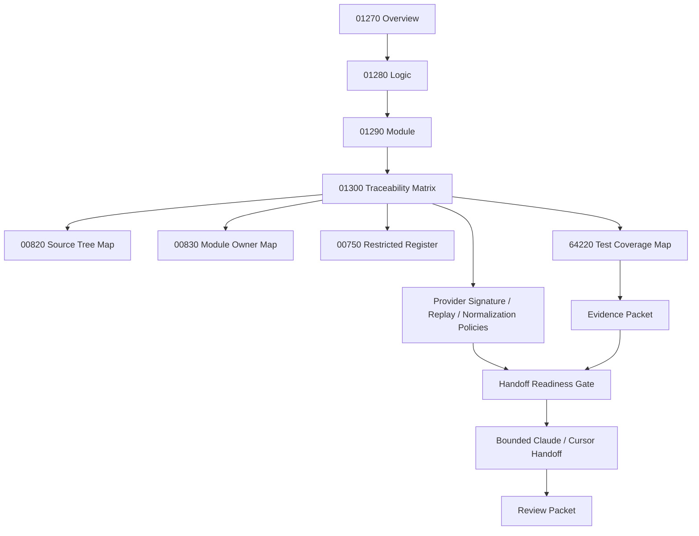

# 001300_Matrix_POS_Gateway_Webhook_Inbound_Verification_Event_Normalization_Overview_Logic_Module_To_Flow_Bundle_Traceability.md

## 1. Document Control

| Field | Value |
|---|---|
| Project | yoonsul_wait_order_handoff / CatchMenu-Catch&Order |
| Band | 00100_project_foundation |
| Document Type | Matrix |
| Document Role | POS Gateway Webhook Inbound Verification / Event Normalization Overview / Logic / Module To Flow Bundle Traceability |
| Related Overview | 001270_Spec_Overview_POS_Gateway_Webhook_Inbound_Verification_And_Event_Normalization_Main_Flow.md |
| Related Logic | 001280_Spec_Logic_POS_Gateway_Webhook_Inbound_Verification_Event_Normalization_State_Transition_And_Exception_Rule.md |
| Related Module | 001290_Spec_Module_POS_Gateway_Webhook_Inbound_Verification_Event_Normalization_API_Data_Model_And_Test_Map.md |
| Related Runtime Flow Bundle | 064140_Flow_POS_Gateway_Webhook_Inbound_Verification_And_Event_Normalization.md |
| Related Flow Registry | 064000_Index_Runtime_Flow_Bundle_Registry.md |
| Related Flow Module Map | 064210_Matrix_Flow_To_Module_Implementation_Map.md |
| Related Flow Test Map | 064220_Matrix_Flow_To_Test_Coverage_Map.md |
| Related Development Foundation Traceability | 000690_Matrix_Development_Foundation_Overview_Logic_Module_Traceability.md |
| Related Source Tree Matrix | 000820_Matrix_Development_Foundation_Source_Tree_To_Module_Document_Map.md |
| Related Restricted Register | 000750_Register_Development_Foundation_Restricted_File_And_Zone_Control.md |
| Status | Draft / Hydration Required |
| Owner | Architecture / Engineering / QA / Compliance / Security / Operations |
| AI Solo Change | Documentation mapping allowed; runtime implementation approval prohibited |

---

## 2. Purpose

This matrix connects the POS Gateway Webhook Inbound Verification / Event Normalization `Overview → Logic → Module` document set to the parent Runtime Flow Bundle.

The required development chain is:

```text
Overview → Logic → Module → File → Test → Evidence
```

The parent Runtime Flow Bundle chain is:

```text
Flow Step → Module → File → Test → Evidence
```

This matrix bridges those two chains for inbound webhook verification, schema validation, deduplication, ordering, normalization, correlation, routing, quarantine, audit, and safe projection.

---

## 3. Traceability Scope

### 3.1 Included

- 01270 Overview flow steps.
- 01280 Logic rules.
- 01290 Module mappings.
- 64140 Runtime Flow Bundle alignment.
- Test coverage expectations.
- Evidence expectations.
- Restricted-zone awareness.
- Hydration-dependent TBD fields.

### 3.2 Excluded

- Actual source code changes.
- Actual DB migration.
- Provider secret rotation execution.
- Production release approval.
- Public provider API publication.
- Manual dispute adjudication.

---

## 4. Traceability Matrix

| Trace ID | Overview Flow Step | Logic Rule | Module | Source File | Test Coverage | Evidence | Runtime Flow Step | Status |
|---|---|---|---|---|---|---|---|---|
| POSWH-TRACE-001 | Webhook request received | R001 | inbound_webhook_endpoint | TBD | inbound receive test | webhook_received_evidence | Inbound receive | Draft |
| POSWH-TRACE-002 | Provider identity resolved | R002~R005 | provider_identity_resolver | TBD | provider identity / endpoint mismatch test | provider_identified_or_unknown_evidence | Provider identity gate | Draft |
| POSWH-TRACE-003 | Signature verified | R006~R007, R012 | webhook_signature_verifier | TBD | missing/invalid signature test | signature_verified_or_rejected_evidence | Signature verification | Draft |
| POSWH-TRACE-004 | Timestamp freshness verified | R008~R009 | webhook_timestamp_guard | TBD | stale timestamp test | timestamp_freshness_evidence | Timestamp freshness gate | Draft |
| POSWH-TRACE-005 | Nonce/replay verified | R010 | webhook_nonce_replay_guard | TBD | replay detected test | replay_detected_evidence | Replay attack guard | Draft |
| POSWH-TRACE-006 | Key version verified | R011~R012 | webhook_key_version_guard | TBD | invalid key version test | key_version_evidence | Key version guard | Draft |
| POSWH-TRACE-007 | Payload schema validated | R013~R018 | webhook_payload_schema_validator | TBD | schema validation test | schema_validation_evidence | Payload schema validation | Draft |
| POSWH-TRACE-008 | Raw event reference and payload hash captured | R019~R022 | webhook_raw_event_store / payload_hash_service | TBD | raw capture / hash test | raw_event_capture_evidence | Raw event capture | Draft |
| POSWH-TRACE-009 | Raw secrets masked | R021 | webhook_secret_masking_guard | TBD | secret masking test | webhook_secret_masking_evidence | Sensitive data masking | Draft |
| POSWH-TRACE-010 | Duplicate event detected or accepted as new | R023~R026 | webhook_deduplication_guard | TBD | duplicate no-reapply / hash conflict test | duplicate_or_new_event_evidence | Deduplication guard | Draft |
| POSWH-TRACE-011 | Ordering and canonical state checked | R027~R031 | webhook_ordering_state_guard | TBD | stale overwrite / terminal conflict test | ordering_state_guard_evidence | Ordering/state guard | Draft |
| POSWH-TRACE-012 | Provider event normalized | R032~R036 | provider_event_normalizer | TBD | unknown event / provider proof / amount mismatch test | event_normalized_or_failed_evidence | Event normalization | Draft |
| POSWH-TRACE-013 | Event correlated to internal target | R037~R042 | webhook_correlation_resolver | TBD | approval/refund/settlement/dispute/uncorrelated test | correlation_evidence | Correlation resolver | Draft |
| POSWH-TRACE-014 | Event routed to target flow | R043~R048 | webhook_event_router | TBD | route success/failure test | event_routed_evidence | Event routing | Draft |
| POSWH-TRACE-015 | Invalid/unsafe event quarantined or DLQ-routed | Quarantine rules | webhook_quarantine_dlq_router | TBD | quarantine/DLQ test | quarantine_dlq_evidence | Quarantine/DLQ | Draft |
| POSWH-TRACE-016 | Audit evidence appended | Audit rules | webhook_audit_append_service | TBD | audit append test | audit_append_evidence | Audit ledger append | Draft |
| POSWH-TRACE-017 | Safe status projected | Projection rules | webhook_status_projector | TBD | invalid/unknown not final test | safe_projection_evidence | Safe projection | Draft |
| POSWH-TRACE-018 | Evidence packet closeout | All rules | webhook_test_harness / evidence packet | TBD | evidence completeness review | webhook_evidence_packet | Flow evidence closeout | Draft |

---

## 5. Status Values

| Status | Meaning |
|---|---|
| Draft | Proposed trace row |
| Mapped | Overview, Logic, Module, and Flow Step are linked |
| Hydration Required | Actual source/test paths are still unknown |
| Test Ready | Test target is known |
| Evidence Ready | Evidence target is known |
| Approved | Ready for implementation handoff |
| Blocked | Missing document, source path, test, evidence, policy, or approval |
| Deprecated | Replaced but retained for audit history |

---

## 6. Hydration Dependency

This matrix is not implementation-ready until actual paths are added from codebase hydration.

Required hydration sources:

| Required Source | Document |
|---|---|
| Actual source paths | 000840_Evidence_Development_Foundation_First_Codebase_Hydration_Report.md or later hydration packet |
| Source-to-module rows | 000820_Matrix_Development_Foundation_Source_Tree_To_Module_Document_Map.md |
| Module owner rows | 000830_Register_Development_Foundation_Repository_Module_Owner_Map.md |
| Restricted file rows | 000750_Register_Development_Foundation_Restricted_File_And_Zone_Control.md |
| Actual test paths | 064220_Matrix_Flow_To_Test_Coverage_Map.md or hydration output |

---

## 7. Restricted-Zone Traceability

| Trace ID | Restricted Area | AI Solo Allowed? | Human Approval Required? |
|---|---|---:|---:|
| POSWH-TRACE-002 | Provider/store/merchant identity mapping | No | Yes |
| POSWH-TRACE-003 | Signature verification | No | Yes |
| POSWH-TRACE-004 | Timestamp freshness security window | No | Yes |
| POSWH-TRACE-005 | Nonce/replay protection | No | Yes |
| POSWH-TRACE-006 | Key version and secret policy | No | Yes |
| POSWH-TRACE-010 | Deduplication affecting financial mutation | No | Yes |
| POSWH-TRACE-011 | Terminal state and ordering guard | No | Yes |
| POSWH-TRACE-012 | Final financial-state normalization | No | Yes |
| POSWH-TRACE-013 | Correlation to internal financial attempt | No | Yes |
| POSWH-TRACE-014 | Ledger/reconciliation route mutation | No | Yes |
| POSWH-TRACE-016 | Audit ledger append behavior | No | Yes |

Any implementation touching these rows must pass No-AI-Solo approval.

---

## 8. Test Coverage Requirements By Trace Row

| Trace ID | Minimum Test Types |
|---|---|
| POSWH-TRACE-001 | Unit, integration |
| POSWH-TRACE-002 | Unit, security |
| POSWH-TRACE-003 | Unit, security |
| POSWH-TRACE-004 | Unit, security |
| POSWH-TRACE-005 | Unit, security, replay |
| POSWH-TRACE-006 | Unit, security |
| POSWH-TRACE-007 | Unit, schema |
| POSWH-TRACE-008 | Unit, audit |
| POSWH-TRACE-009 | Security, masking |
| POSWH-TRACE-010 | Unit, regression, duplicate prevention |
| POSWH-TRACE-011 | Unit, ordering, regression |
| POSWH-TRACE-012 | Unit, provider mapping, regression |
| POSWH-TRACE-013 | Unit, integration |
| POSWH-TRACE-014 | Integration, routing |
| POSWH-TRACE-015 | Fault injection, operations |
| POSWH-TRACE-016 | Audit, immutability |
| POSWH-TRACE-017 | Projection regression |
| POSWH-TRACE-018 | Evidence review |

---

## 9. Evidence Requirements By Trace Row

| Trace ID | Evidence |
|---|---|
| POSWH-TRACE-001 | webhook_received_evidence |
| POSWH-TRACE-002 | provider_unknown_evidence, provider_identified_evidence, endpoint_policy_mismatch_evidence, merchant_context_mismatch_evidence |
| POSWH-TRACE-003 | signature_missing_evidence, signature_invalid_evidence, signature_verified_evidence |
| POSWH-TRACE-004 | timestamp_missing_evidence, timestamp_stale_evidence |
| POSWH-TRACE-005 | replay_detected_evidence |
| POSWH-TRACE-006 | key_version_invalid_evidence |
| POSWH-TRACE-007 | provider_event_id_missing_evidence, provider_ref_missing_evidence, amount_currency_missing_evidence, schema_version_unknown_evidence, schema_invalid_evidence, payload_validated_evidence |
| POSWH-TRACE-008 | payload_hash_evidence, raw_event_capture_evidence, raw_event_immutability_evidence |
| POSWH-TRACE-009 | webhook_secret_masking_evidence |
| POSWH-TRACE-010 | duplicate_same_payload_evidence, duplicate_hash_conflict_evidence, duplicate_terminal_state_evidence, event_new_evidence |
| POSWH-TRACE-011 | stale_event_evidence, canonical_conflict_evidence, semantic_duplicate_evidence, ordering_unknown_evidence, ordering_verified_evidence |
| POSWH-TRACE-012 | unknown_provider_event_evidence, event_normalized_evidence, provider_proof_missing_evidence, amount_currency_mismatch_evidence, normalization_failed_evidence |
| POSWH-TRACE-013 | approval_correlation_evidence, refund_correlation_evidence, settlement_correlation_evidence, dispute_correlation_evidence, uncorrelated_event_evidence, ambiguous_correlation_evidence |
| POSWH-TRACE-014 | webhook_approval_route_evidence, webhook_refund_route_evidence, webhook_settlement_route_evidence, webhook_dispute_route_evidence, routing_failed_evidence, event_routed_evidence |
| POSWH-TRACE-015 | quarantine_dlq_evidence |
| POSWH-TRACE-016 | audit_append_evidence |
| POSWH-TRACE-017 | safe_projection_evidence |
| POSWH-TRACE-018 | webhook_evidence_packet |

---

## 10. Code Handoff Readiness Check

This POS Gateway Webhook Inbound Verification / Event Normalization package is ready for code handoff only when:

- [ ] 01270 Overview is reviewed.
- [ ] 01280 Logic is reviewed.
- [ ] 01290 Module map is reviewed.
- [ ] 01300 Traceability matrix is updated with actual source paths.
- [ ] 00820 source tree mapping has actual file rows.
- [ ] 00830 owner map has actual module owners.
- [ ] 00750 restricted register has actual restricted files.
- [ ] 64220 test map has actual or planned test rows.
- [ ] MVP provider webhook list is approved.
- [ ] Provider signature policies are approved.
- [ ] Timestamp freshness window is approved.
- [ ] Nonce/replay storage and expiry policy is approved.
- [ ] Key version policy is approved.
- [ ] Canonical normalized event schema is approved.
- [ ] Financial-state mutation rules are approved.
- [ ] Quarantine/DLQ review owner and SLA are approved.
- [ ] Evidence packet target is defined.
- [ ] Human approval exists for restricted rows.
- [ ] Webhook code handoff readiness checklist is passed.

---

## 11. Mermaid Traceability Diagram



---

## 12. Relationship With Related Packages

Webhook inbound verification and event normalization interacts with approval, cancel/refund, timeout/retry/DLQ, and offline/resync packages.

| Dependency | Source |
|---|---|
| Approval attempt state and provider proof | 00910~00990 Approval package |
| Cancel/refund attempt state and provider proof | 01000~01080 Cancel/Refund package |
| Timeout/UNKNOWN/DLQ behavior | 01090~01170 Timeout/Retry/DLQ/Replay package |
| Offline late provider event interaction | 01180~01260 Store Offline / Local Ledger / Resync package |
| Idempotency and payload hash semantics | Approval, cancel/refund, retry/replay packages |
| Audit chain continuity | Approval, cancel/refund, retry/replay packages |
| Reconciliation baseline | Approval and cancel/refund reconciliation markers |
| Safe projection rules | Approval, cancel/refund, retry/replay status projectors |

Webhook events must never overwrite verified canonical state without approved state-transition rules.

---

## 13. Open Questions

| Question | Owner | Blocking? |
|---|---|---:|
| What are actual webhook inbound source paths? | Engineering | Yes |
| Which providers are included in MVP webhook scope? | Product / Provider Integration | Yes |
| What signature scheme applies per provider? | Security / Provider Integration | Yes |
| What timestamp freshness window is approved? | Security / Compliance | Yes |
| How are nonce/replay keys stored and expired? | Security / Engineering | Yes |
| What is the canonical normalized event schema? | Architecture / Engineering | Yes |
| Which events can mutate ledger state? | Compliance / Engineering | Yes |
| Who owns quarantine/DLQ review and SLA? | Operations / Compliance | Yes |
| Where is final evidence packet stored? | QA / Compliance | Yes |

---

## 14. Summary

This matrix confirms that POS Gateway Webhook Inbound Verification / Event Normalization is represented as a connected implementation package:

```text
01270 Overview
  ↓
01280 Logic
  ↓
01290 Module
  ↓
01300 Traceability
  ↓
Source / Test / Evidence / Gate
```

It is not code-handoff ready until real source paths, tests, owners, policies, restricted approvals, and evidence targets are filled after hydration.
