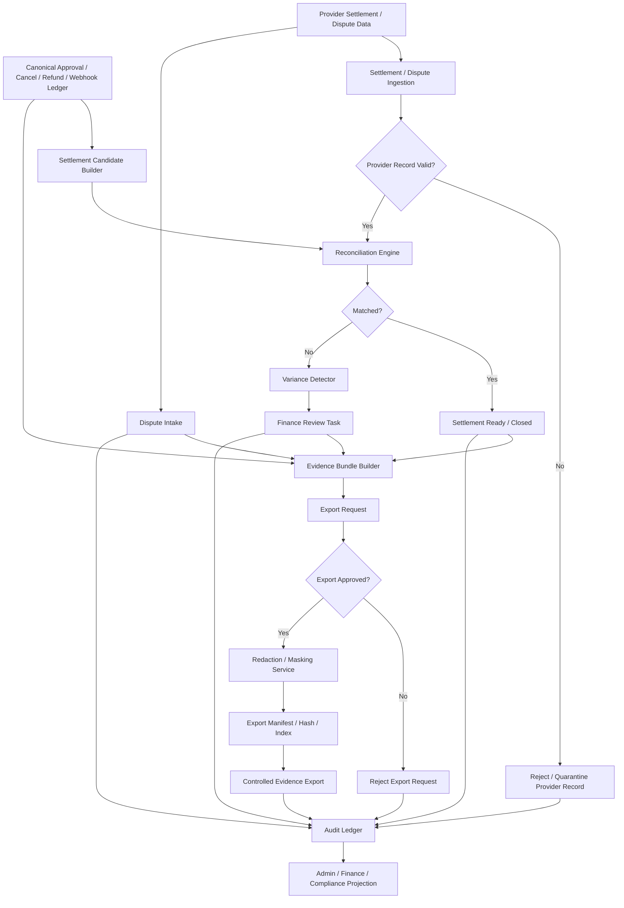
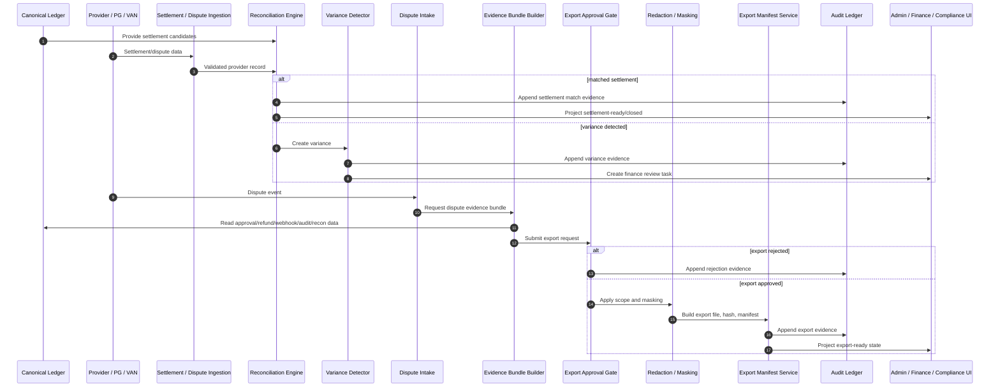

# 001360_Spec_Overview_POS_Gateway_Settlement_Dispute_And_Evidence_Export_Main_Flow.md

## 1. Document Control

| Field | Value |
|---|---|
| Project | yoonsul_wait_order_handoff / CatchMenu-Catch&Order |
| Band | 00100_project_foundation |
| Document Type | Spec |
| Document Layer | Overview |
| Document Role | POS Gateway Settlement / Dispute / Evidence Export Main Flow |
| Related Approval Package Closeout | 000990_Index_POS_Gateway_Approval_Implementation_Package_Closeout.md |
| Related Cancel Refund Package Closeout | 001080_Index_POS_Gateway_Cancel_Refund_Implementation_Package_Closeout.md |
| Related Timeout Retry DLQ Replay Closeout | 001170_Index_POS_Gateway_Timeout_Retry_DLQ_Replay_Implementation_Package_Closeout.md |
| Related Store Offline Local Ledger Resync Closeout | 001260_Index_POS_Gateway_Store_Offline_Local_Ledger_Resync_Implementation_Package_Closeout.md |
| Related Webhook Inbound Verification Closeout | 001350_Index_POS_Gateway_Webhook_Inbound_Verification_Event_Normalization_Implementation_Package_Closeout.md |
| Related Runtime Flow Bundle | 064150_Flow_POS_Gateway_Settlement_Dispute_And_Evidence_Export.md |
| Related Flow Registry | 064000_Index_Runtime_Flow_Bundle_Registry.md |
| Related Development Foundation Model | 000640_Policy_Development_Foundation_Overview_Logic_Module_Documentation_Model.md |
| Related Traceability Matrix | 000690_Matrix_Development_Foundation_Overview_Logic_Module_Traceability.md |
| Next Logic Document | 001370_Spec_Logic_POS_Gateway_Settlement_Dispute_Evidence_Export_State_Transition_And_Exception_Rule.md |
| Next Module Document | 001380_Spec_Module_POS_Gateway_Settlement_Dispute_Evidence_Export_API_Data_Model_And_Test_Map.md |
| Status | Draft |
| Owner | Product / Architecture / Engineering / QA / Compliance / Finance / Operations |
| AI Solo Change | Documentation drafting allowed; settlement/dispute/evidence export runtime approval prohibited |

---

## 2. Purpose

This overview defines the POS Gateway Settlement / Dispute / Evidence Export main flow for CatchMenu / Catch&Order.

It covers how approval, cancellation, refund, webhook, reconciliation, and audit data are converted into settlement-ready records, dispute-ready evidence bundles, and controlled export packets.

This document is the `Overview` layer of the Development Foundation chain:

```text
Overview → Logic → Module → File → Test → Evidence
```

It must be followed by Logic and Module documents before implementation handoff.

---

## 3. Scope

### 3.1 Included

- Settlement candidate creation.
- Settlement provider record ingestion.
- Settlement matching and variance detection.
- Fee/tax/commission field normalization.
- Dispute event intake.
- Dispute evidence bundle assembly.
- Legal hold and retention markers.
- Evidence export request and approval.
- Evidence export redaction/masking.
- Export file generation.
- Export hash and manifest.
- Export access control.
- Audit ledger append.
- Reconciliation closeout.
- Finance/admin projection.
- Exception routing.

### 3.2 Excluded

- Final accounting policy for corporate finance.
- Tax filing.
- Manual legal argument drafting.
- Direct provider dispute portal operation.
- Production DB migration.
- Secret rotation.
- Production deployment.
- External regulator submission procedure.

---

## 4. Business Intent

Settlement and dispute handling turns operational events into financial and legal evidence.

Core goal:

```text
Every settlement, dispute, and evidence export must be traceable from provider event to internal ledger to audit evidence to controlled export.
```

The system must prevent:

- settlement without approval/refund baseline,
- provider settlement mismatch hidden from finance,
- dispute evidence missing source events,
- evidence export without authorization,
- export containing raw secrets or unnecessary sensitive data,
- tampered export file,
- unlogged export access,
- deletion of evidence under dispute/legal hold,
- AI-generated unsupported financial/legal conclusion.

---

## 5. Primary Actors And Systems

| Actor / System | Role |
|---|---|
| Provider / PG / VAN | Sends settlement/dispute data or provides settlement reports |
| POS Gateway | Normalizes provider settlement/dispute/evidence context |
| Settlement Ingestion Service | Receives provider settlement records |
| Reconciliation Engine | Matches internal ledger and provider settlement |
| Variance Detector | Detects mismatch, missing, duplicate, or fee variance |
| Dispute Intake Service | Records dispute/chargeback-like events |
| Evidence Bundle Builder | Assembles source events, audit logs, ledger records, and snapshots |
| Export Approval Gate | Requires authorized human approval for export |
| Redaction / Masking Service | Removes secrets and unnecessary sensitive data |
| Export Manifest Service | Creates hash, manifest, and export index |
| Audit Ledger | Records settlement/dispute/export evidence |
| Admin Console | Reviews settlement, dispute, and export state |
| Finance Reviewer | Reviews settlement variance and closeout |
| Compliance / Legal Reviewer | Reviews dispute, retention, legal hold, and export |
| AI Customer Center | May explain only verified SOP/evidence-based status |

---

## 6. High-Level Flow

```text
1. Internal approval/cancel/refund/webhook events create settlement candidates.
2. Provider settlement/dispute data is ingested or referenced.
3. Settlement Ingestion Service validates provider records and source identity.
4. Reconciliation Engine matches provider records to internal canonical ledger.
5. Variance Detector flags missing, duplicate, fee mismatch, tax mismatch, amount mismatch, or timing mismatch.
6. Matched settlement records become settlement-ready or settlement-closed.
7. Variance records create finance review tasks.
8. Dispute Intake Service records provider dispute or chargeback-like events.
9. Evidence Bundle Builder assembles approval, refund, webhook, audit, reconciliation, customer/store timeline, and export metadata.
10. Export Approval Gate verifies request purpose, requester role, scope, retention/legal hold state, and authorization.
11. Redaction / Masking Service removes secrets and unnecessary sensitive data.
12. Export Manifest Service creates export file hash, manifest, index, and retention marker.
13. Audit Ledger records every settlement, dispute, export, access, approval, rejection, and closeout event.
14. Admin/finance/compliance UI projects settlement/dispute/export status.
```

---

## 7. Runtime Flow Diagram



---

## 8. Runtime Sequence Diagram



---

## 9. Core State Categories

Detailed state rules must be defined in:

```text
001370_Spec_Logic_POS_Gateway_Settlement_Dispute_Evidence_Export_State_Transition_And_Exception_Rule.md
```

High-level categories:

| Category | Meaning |
|---|---|
| SETTLEMENT_CANDIDATE | Internal canonical event is eligible for provider settlement matching |
| PROVIDER_SETTLEMENT_RECEIVED | Provider settlement item received or referenced |
| SETTLEMENT_MATCHED | Provider settlement matches internal ledger |
| SETTLEMENT_VARIANCE | Amount, fee, tax, timing, missing, duplicate, or provider mismatch |
| SETTLEMENT_CLOSED | Settlement item is fully reconciled with evidence |
| DISPUTE_RECEIVED | Provider dispute/chargeback-like item received |
| DISPUTE_UNCORRELATED | Dispute cannot be linked to internal record |
| DISPUTE_EVIDENCE_READY | Evidence bundle assembled |
| EXPORT_REQUESTED | Evidence export requested |
| EXPORT_REJECTED | Export request denied |
| EXPORT_APPROVED | Export request approved by authorized role |
| EXPORT_REDACTED | Export packet has required redaction/masking |
| EXPORT_GENERATED | Export file and manifest generated |
| EXPORT_CLOSED | Export delivered/recorded with audit evidence |
| LEGAL_HOLD_ACTIVE | Evidence cannot be deleted or modified due to hold |
| RETENTION_EXPIRED | Retention expired only if no legal hold/dispute remains |

---

## 10. Settlement Boundary

A settlement record may be marked matched only when:

1. internal canonical approval/refund/cancel state is known,
2. provider settlement record identity is known,
3. provider/merchant/store context is matched,
4. amount and currency match or approved variance exists,
5. fee/tax/commission fields are normalized,
6. settlement date and transaction date are captured,
7. duplicate settlement is checked,
8. refund/cancel adjustments are applied,
9. reconciliation marker is created,
10. audit evidence is appended.

If any condition fails, the record must become variance/review, not silently settle.

---

## 11. Dispute Boundary

A dispute record may be linked to internal evidence only when:

1. provider dispute identity is known,
2. provider/merchant/store context is matched,
3. approval/refund/cancel source record is found,
4. customer/order/store timeline is available where needed,
5. webhook/provider event history is available,
6. audit ledger chain is available,
7. amount/currency and dispute reason are captured,
8. evidence scope is approved,
9. legal hold/retention state is set if required.

If correlation fails, the dispute must be quarantined or routed to manual review.

---

## 12. Evidence Export Boundary

Evidence export may proceed only when:

1. requester identity is known,
2. requester role is authorized,
3. export purpose is recorded,
4. export scope is approved,
5. legal hold/retention state is checked,
6. export packet source records are resolved,
7. redaction/masking rules are applied,
8. raw secrets and unnecessary sensitive data are excluded,
9. export hash and manifest are created,
10. export access is logged,
11. audit event is appended.

No evidence export may be created by AI alone.

---

## 13. Major Control Points

| Control Point | Purpose |
|---|---|
| Settlement candidate builder | Converts canonical financial events to settlement candidates |
| Provider settlement validation | Prevents malformed or wrong-provider settlement records |
| Reconciliation engine | Matches internal ledger to provider settlement |
| Variance detector | Finds amount/fee/tax/timing/missing/duplicate mismatch |
| Finance review task | Prevents silent financial mismatch |
| Dispute intake | Captures dispute source identity and reason |
| Evidence bundle builder | Assembles source events and audit chain |
| Export approval gate | Prevents unauthorized evidence export |
| Redaction/masking service | Prevents secret and sensitive data leakage |
| Export manifest/hash | Detects export tamper |
| Legal hold/retention marker | Prevents improper deletion |
| Audit append | Preserves every material decision |

---

## 14. No-AI-Solo Zone

This flow touches restricted financial, legal, and evidence-export operations.

| Area | AI Solo Allowed? | Human Approval Required? |
|---|---:|---:|
| Settlement closeout | No | Yes |
| Settlement variance resolution | No | Yes |
| Dispute correlation | No | Yes |
| Evidence bundle scope | No | Yes |
| Evidence export approval | No | Yes |
| Redaction/masking policy | No | Yes |
| Legal hold / retention decision | No | Yes |
| Export file generation and delivery | No | Yes |
| Audit ledger append behavior | No | Yes |
| DB migration/schema change | No | Yes |
| Production release/deploy | No | Yes |

AI may assist with documentation, mapping, read-only inspection, and diff review.  
AI may not independently approve settlement closeout, dispute decision, evidence export, legal hold, or release.

---

## 15. Related Flow Bundle Documents

| Document | Relationship |
|---|---|
| 064000_Index_Runtime_Flow_Bundle_Registry.md | Runtime Flow Bundle registry |
| 064150_Flow_POS_Gateway_Settlement_Dispute_And_Evidence_Export.md | Parent settlement/dispute/evidence export flow |
| 064100_Flow_POS_Gateway_Approval_To_Audit_Ledger_And_Reconciliation.md | Approval source records |
| 064110_Flow_POS_Gateway_Cancel_Refund_Recovery_And_Audit.md | Cancel/refund source records |
| 064120_Flow_POS_Gateway_Timeout_Retry_DLQ_And_Replay.md | Recovery and unknown-state source records |
| 064130_Flow_POS_Gateway_Store_Offline_Local_Ledger_And_Resync.md | Offline/resync source records |
| 064140_Flow_POS_Gateway_Webhook_Inbound_Verification_And_Event_Normalization.md | Provider event source records |
| 064200_Matrix_Flow_To_MD_Dependency_Graph.md | Dependency graph |
| 064210_Matrix_Flow_To_Module_Implementation_Map.md | Runtime module map |
| 064220_Matrix_Flow_To_Test_Coverage_Map.md | Runtime test coverage map |
| 064300_Checklist_Flow_Bundle_Code_Handoff_Readiness_Gate.md | Runtime handoff readiness |
| 064370_Governance_Flow_Bundle_Human_Approval_And_No_AI_Solo_Zone_Control.md | Human approval / No-AI-Solo control |
| 064390_Checklist_Flow_Bundle_Pre_Merge_And_Release_Gate.md | Pre-merge/release gate |

---

## 16. Required Downstream Documents

This overview is incomplete as an implementation package until the following exist:

| Required Document | Purpose |
|---|---|
| 001370_Spec_Logic_POS_Gateway_Settlement_Dispute_Evidence_Export_State_Transition_And_Exception_Rule.md | Defines settlement, variance, dispute, evidence export, legal hold, audit, and exception rules |
| 001380_Spec_Module_POS_Gateway_Settlement_Dispute_Evidence_Export_API_Data_Model_And_Test_Map.md | Maps logic to APIs, modules, data models, queues, jobs, tests, and evidence |
| 001390_Matrix_POS_Gateway_Settlement_Dispute_Evidence_Export_Overview_Logic_Module_To_Flow_Bundle_Traceability.md | Connects Overview/Logic/Module to Flow Bundle |
| 001400_Checklist_POS_Gateway_Settlement_Dispute_Evidence_Export_Code_Handoff_Readiness.md | Determines handoff readiness |
| 001410_Template_POS_Gateway_Settlement_Dispute_Evidence_Export_Claude_Code_Handoff_Prompt.md | Provides bounded Claude handoff |
| 001420_Template_POS_Gateway_Settlement_Dispute_Evidence_Export_Cursor_IDE_File_Level_Assist_Prompt.md | Provides bounded Cursor assist |
| 001430_Evidence_POS_Gateway_Settlement_Dispute_Evidence_Export_Code_Handoff_And_Review_Packet.md | Records handoff/review evidence |
| 001440_Index_POS_Gateway_Settlement_Dispute_Evidence_Export_Implementation_Package_Closeout.md | Closes the package |

---

## 17. Implementation Readiness Status

| Readiness Item | Status |
|---|---|
| Overview defined | Draft |
| Logic defined | Pending 01370 |
| Module mapped | Pending 01380 and hydration |
| Source files known | Pending hydration |
| Tests known | Pending hydration/test map |
| Evidence target known | Pending implementation ticket |
| Restricted approval ready | Pending human approval |
| Ready for code handoff | No |

---

## 18. Open Questions

| Question | Owner | Blocking? |
|---|---|---:|
| Which providers produce settlement records in MVP scope? | Product / Provider Integration / Finance | Yes |
| What fields define settlement identity per provider? | Finance / Engineering | Yes |
| What variance tolerance is allowed? | Finance / Compliance | Yes |
| What dispute types are in MVP scope? | Compliance / Operations | Yes |
| What evidence bundle scope is required per dispute/export purpose? | Compliance / Legal / Operations | Yes |
| What redaction/masking policy applies to export packets? | Security / Compliance | Yes |
| Who can approve evidence export? | Compliance / Operations | Yes |
| What is the first safe settlement/dispute test environment? | Engineering / QA | Yes |

---

## 19. Summary

This Overview document defines the high-level POS Gateway settlement, dispute, and evidence export path.

It must not be used alone as an implementation instruction.

Implementation may proceed only after the chain is complete:

```text
Overview → Logic → Module → File → Test → Evidence
```

and the parent Runtime Flow Bundle gate confirms:

```text
Flow Step → Module → File → Test → Evidence
```
