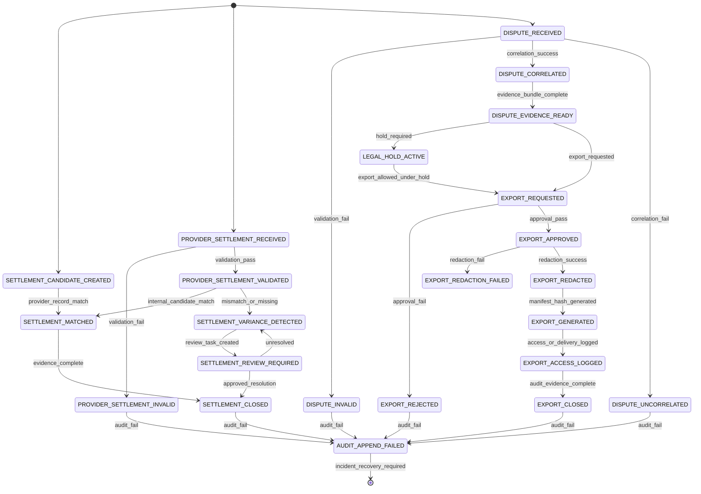

# 001370_Spec_Logic_POS_Gateway_Settlement_Dispute_Evidence_Export_State_Transition_And_Exception_Rule.md

## 1. Document Control

| Field | Value |
|---|---|
| Project | yoonsul_wait_order_handoff / CatchMenu-Catch&Order |
| Band | 00100_project_foundation |
| Document Type | Spec |
| Document Layer | Logic |
| Document Role | POS Gateway Settlement / Dispute / Evidence Export State Transition And Exception Rule |
| Parent Overview | 001360_Spec_Overview_POS_Gateway_Settlement_Dispute_And_Evidence_Export_Main_Flow.md |
| Related Runtime Flow Bundle | 064150_Flow_POS_Gateway_Settlement_Dispute_And_Evidence_Export.md |
| Related Approval Package | 000990_Index_POS_Gateway_Approval_Implementation_Package_Closeout.md |
| Related Cancel Refund Package | 001080_Index_POS_Gateway_Cancel_Refund_Implementation_Package_Closeout.md |
| Related Timeout Retry DLQ Replay Package | 001170_Index_POS_Gateway_Timeout_Retry_DLQ_Replay_Implementation_Package_Closeout.md |
| Related Store Offline Local Ledger Resync Package | 001260_Index_POS_Gateway_Store_Offline_Local_Ledger_Resync_Implementation_Package_Closeout.md |
| Related Webhook Package | 001350_Index_POS_Gateway_Webhook_Inbound_Verification_Event_Normalization_Implementation_Package_Closeout.md |
| Related Logic Template | 000670_Template_Development_Foundation_Logic_Document.md |
| Related Traceability Matrix | 000690_Matrix_Development_Foundation_Overview_Logic_Module_Traceability.md |
| Related Flow Registry | 064000_Index_Runtime_Flow_Bundle_Registry.md |
| Next Module Document | 001380_Spec_Module_POS_Gateway_Settlement_Dispute_Evidence_Export_API_Data_Model_And_Test_Map.md |
| Status | Draft |
| Owner | Architecture / Engineering / QA / Compliance / Finance / Security / Operations |
| AI Solo Change | Documentation drafting allowed; settlement/dispute/evidence export runtime approval prohibited |

---

## 2. Purpose

This Logic document defines the state transitions and exception rules for POS Gateway Settlement / Dispute / Evidence Export.

It is the second layer of the Development Foundation implementation chain:

```text
Overview → Logic → Module → File → Test → Evidence
```

It controls how internal ledger events, provider settlement data, dispute records, evidence bundles, export approvals, redaction, manifests, hashes, retention, legal holds, and audit records interact.

---

## 3. Scope

### 3.1 Included

- Settlement candidate creation.
- Provider settlement ingestion.
- Settlement validation.
- Settlement matching.
- Settlement variance detection.
- Settlement closeout.
- Dispute intake.
- Dispute correlation.
- Evidence bundle assembly.
- Legal hold and retention marking.
- Evidence export request.
- Export approval/rejection.
- Export redaction and masking.
- Export manifest and hash generation.
- Export access logging.
- Audit ledger append.
- Exception and review task routing.

### 3.2 Excluded

- Corporate accounting close policy.
- Tax filing.
- Manual legal argument drafting.
- Provider dispute portal operation.
- External regulator submission.
- Production DB migration.
- Production release/deployment.

---

## 4. Business Logic Intent

Settlement and dispute evidence are financial and legal-grade records.

Core rule:

```text
No settlement may close, no dispute may resolve, and no evidence export may be generated unless its source ledger, provider record, audit chain, authorization, masking, manifest, and retention/legal-hold state are traceable.
```

The system must prefer `variance`, `review`, or `blocked` over silent assumption.

---

## 5. No-AI-Solo Zone Classification

| Area | AI Solo Allowed? | Human Approval Required? | Reason |
|---|---:|---:|---|
| Settlement match/closeout | No | Yes | Financial close risk |
| Settlement variance resolution | No | Yes | Accounting and provider dispute risk |
| Fee/tax/commission normalization | No | Yes | Financial accuracy risk |
| Dispute correlation | No | Yes | Legal/financial evidence risk |
| Evidence bundle scope | No | Yes | Legal and privacy risk |
| Evidence export approval | No | Yes | External disclosure risk |
| Redaction/masking policy | No | Yes | Sensitive data leakage risk |
| Legal hold/retention decision | No | Yes | Compliance/legal risk |
| Export manifest/hash generation | No | Yes | Evidence integrity risk |
| Audit ledger append behavior | No | Yes | Evidence integrity |
| DB schema/migration | No | Yes | Data integrity |
| Production release/deploy | No | Yes | Runtime stability |

---

## 6. Primary State Model

| State | Meaning | Entry Condition | Exit Condition | Terminal? |
|---|---|---|---|---:|
| SETTLEMENT_CANDIDATE_CREATED | Internal canonical ledger item is eligible for settlement | Approval/refund/cancel/webhook/recon source exists | Provider settlement matching starts | No |
| PROVIDER_SETTLEMENT_RECEIVED | Provider settlement item received or referenced | Settlement feed/report/webhook ingested | Validation starts | No |
| PROVIDER_SETTLEMENT_INVALID | Provider settlement item malformed or untrusted | Validation fails | Quarantine/review/audit | Conditional |
| PROVIDER_SETTLEMENT_VALIDATED | Provider settlement item is structurally valid | Validation succeeds | Matching starts | No |
| SETTLEMENT_MATCHED | Provider settlement matches internal canonical ledger | Match criteria satisfied | Closeout or review | No |
| SETTLEMENT_VARIANCE_DETECTED | Amount, fee, tax, timing, duplicate, missing, or provider mismatch found | Match criteria fail or tolerance exceeded | Finance review | No |
| SETTLEMENT_REVIEW_REQUIRED | Settlement requires human finance/compliance review | Variance or policy condition | Review decision | No |
| SETTLEMENT_CLOSED | Settlement item is reconciled and evidenced | Match/variance approved and evidence appended | None | Yes |
| DISPUTE_RECEIVED | Provider dispute/chargeback-like item received | Dispute source ingested | Validation/correlation | No |
| DISPUTE_INVALID | Dispute item malformed or untrusted | Validation fails | Quarantine/review/audit | Conditional |
| DISPUTE_CORRELATED | Dispute linked to internal approval/refund/order/ledger | Correlation succeeds | Evidence bundle | No |
| DISPUTE_UNCORRELATED | Dispute cannot be linked | Correlation fails | Manual review/quarantine | Conditional |
| DISPUTE_EVIDENCE_READY | Evidence bundle assembled | Required source records found | Export request or review | No |
| LEGAL_HOLD_ACTIVE | Evidence under legal/dispute hold | Hold rule triggered or reviewer sets hold | Hold release approved | Conditional |
| EXPORT_REQUESTED | Evidence export requested | Authorized user requests export | Approval gate | No |
| EXPORT_REJECTED | Export denied | Approval fails | Audit closeout | Yes |
| EXPORT_APPROVED | Export approved | Authorized approval passes | Redaction/masking | No |
| EXPORT_REDACTION_FAILED | Required redaction/masking fails | Redaction service fails | Block/review | Conditional |
| EXPORT_REDACTED | Export packet redacted/masked | Redaction succeeds | Manifest/hash | No |
| EXPORT_GENERATED | Export file, hash, manifest, and index generated | Manifest service succeeds | Access/delivery logging | No |
| EXPORT_ACCESS_LOGGED | Export access/download/delivery logged | Export access occurs | Closeout | No |
| EXPORT_CLOSED | Export completed with evidence and audit | Export evidence complete | None | Yes |
| AUDIT_APPEND_FAILED | Required audit append fails | Audit write failure | Incident/recovery | No |

---

## 7. State Transition Diagram



---

## 8. Settlement Event Model

| Event | Producer | Consumer | Required Payload | Idempotency / Dedup Key | Audit Required |
|---|---|---|---|---|---:|
| settlement.candidate_created | Canonical Ledger / Reconciliation | Settlement Engine | ledger_ref, provider_ref, amount, currency, event_type | ledger_ref + provider_ref | Yes |
| settlement.provider_received | Provider Ingestion | Settlement Validator | provider_settlement_id, merchant_ref, amount, fee, tax, currency, settlement_date | provider_settlement_id | Yes |
| settlement.provider_invalid | Settlement Validator | Quarantine / Audit | reject_reason, provider_record_ref | provider_settlement_id | Yes |
| settlement.provider_validated | Settlement Validator | Reconciliation Engine | normalized_provider_record | provider_settlement_id | Yes |
| settlement.matched | Reconciliation Engine | Audit / Finance Projection | ledger_ref, provider_settlement_id, match_basis | ledger_ref + provider_settlement_id | Yes |
| settlement.variance_detected | Variance Detector | Finance Review | variance_type, expected_value, provider_value | variance_id | Yes |
| settlement.review_required | Variance Detector | Finance Reviewer | variance_id, required_decision | review_task_id | Yes |
| settlement.closed | Finance / Reconciliation Engine | Audit / Projection | closeout_ref, evidence_ref | settlement_closeout_ref | Yes |

---

## 9. Dispute Event Model

| Event | Producer | Consumer | Required Payload | Idempotency / Dedup Key | Audit Required |
|---|---|---|---|---|---:|
| dispute.received | Provider / Admin | Dispute Intake | provider_dispute_id, reason, amount, currency, provider_ref | provider_dispute_id | Yes |
| dispute.invalid | Dispute Validator | Quarantine / Audit | reject_reason, provider_dispute_id | provider_dispute_id | Yes |
| dispute.correlated | Correlation Resolver | Evidence Builder | dispute_id, ledger_ref, order_ref, payment_ref | dispute_id + ledger_ref | Yes |
| dispute.uncorrelated | Correlation Resolver | Manual Review | dispute_id, missing_reason | dispute_id | Yes |
| dispute.evidence_ready | Evidence Builder | Export Approval Gate | evidence_bundle_id, source_refs | evidence_bundle_id | Yes |
| dispute.legal_hold_active | Compliance / Legal | Retention Guard | hold_id, scope, reason | hold_id | Yes |

---

## 10. Evidence Export Event Model

| Event | Producer | Consumer | Required Payload | Idempotency / Dedup Key | Audit Required |
|---|---|---|---|---|---:|
| export.requested | Authorized User / Admin | Export Approval Gate | requester, purpose, scope, target_bundle | export_request_id | Yes |
| export.rejected | Export Approval Gate | Audit / Admin | reason, approver_ref | export_request_id | Yes |
| export.approved | Export Approval Gate | Redaction Service | approver_ref, approved_scope, purpose | export_request_id | Yes |
| export.redaction_failed | Redaction Service | Review / Audit | failure_reason, field_scope | export_request_id | Yes |
| export.redacted | Redaction Service | Manifest Service | redacted_bundle_ref | export_request_id | Yes |
| export.generated | Manifest Service | Access Control / Audit | export_file_ref, hash, manifest_ref | export_file_hash | Yes |
| export.access_logged | Access Control | Audit | accessor, timestamp, purpose, export_file_ref | export_access_id | Yes |
| export.closed | Export Service | Audit / Projection | export_closeout_ref, manifest_ref | export_closeout_ref | Yes |

---

## 11. Settlement Candidate Rules

| Rule ID | Condition | Required Action | Evidence |
|---|---|---|---|
| LOGIC-POS-SET-R001 | Canonical approval/refund/cancel/webhook ledger item becomes settlement-eligible | Create settlement candidate | settlement_candidate_evidence |
| LOGIC-POS-SET-R002 | Source ledger item is not terminal or not verified | Do not create settlement candidate | settlement_candidate_blocked_evidence |
| LOGIC-POS-SET-R003 | Provider reference is missing | Mark candidate incomplete/review | provider_ref_missing_evidence |
| LOGIC-POS-SET-R004 | Duplicate settlement candidate exists | Do not create duplicate; link to prior | settlement_candidate_duplicate_evidence |

---

## 12. Provider Settlement Validation Rules

| Rule ID | Condition | Required Action | Evidence |
|---|---|---|---|
| LOGIC-POS-SET-R005 | Provider settlement record received | Capture raw reference and provider identity | provider_settlement_received_evidence |
| LOGIC-POS-SET-R006 | Provider/merchant/store context cannot be resolved | Quarantine; no settlement closeout | provider_settlement_context_missing_evidence |
| LOGIC-POS-SET-R007 | Required settlement identity missing | Quarantine/review | provider_settlement_identity_missing_evidence |
| LOGIC-POS-SET-R008 | Amount/currency/fee/tax fields malformed | Quarantine/review | provider_settlement_schema_invalid_evidence |
| LOGIC-POS-SET-R009 | Provider settlement record passes validation | Normalize provider settlement record | provider_settlement_validated_evidence |

---

## 13. Settlement Matching Rules

| Rule ID | Condition | Required Action | Evidence |
|---|---|---|---|
| LOGIC-POS-SET-R010 | Provider settlement matches internal ledger within approved policy | Mark matched | settlement_matched_evidence |
| LOGIC-POS-SET-R011 | Amount mismatch detected | Create variance | settlement_amount_variance_evidence |
| LOGIC-POS-SET-R012 | Currency mismatch detected | Create variance; block closeout | settlement_currency_variance_evidence |
| LOGIC-POS-SET-R013 | Fee/tax/commission mismatch detected | Create variance or review according to tolerance | settlement_fee_tax_variance_evidence |
| LOGIC-POS-SET-R014 | Provider settlement is duplicate | Block duplicate closeout | settlement_duplicate_evidence |
| LOGIC-POS-SET-R015 | Internal candidate missing provider settlement | Mark missing provider settlement variance | settlement_missing_provider_record_evidence |
| LOGIC-POS-SET-R016 | Provider settlement missing internal candidate | Mark orphan provider settlement variance | settlement_orphan_provider_record_evidence |
| LOGIC-POS-SET-R017 | Settlement variance exists | Create finance review task | settlement_review_task_evidence |
| LOGIC-POS-SET-R018 | Finance/compliance approves variance resolution | Mark variance resolved with evidence | settlement_variance_resolution_evidence |
| LOGIC-POS-SET-R019 | Settlement match/variance resolution complete | Mark settlement closed | settlement_closed_evidence |

---

## 14. Dispute Intake And Correlation Rules

| Rule ID | Condition | Required Action | Evidence |
|---|---|---|---|
| LOGIC-POS-SET-R020 | Provider dispute received | Capture dispute identity and reason | dispute_received_evidence |
| LOGIC-POS-SET-R021 | Provider dispute identity missing | Quarantine/review | dispute_identity_missing_evidence |
| LOGIC-POS-SET-R022 | Dispute amount/currency malformed | Quarantine/review | dispute_schema_invalid_evidence |
| LOGIC-POS-SET-R023 | Dispute source context unresolved | Quarantine/review | dispute_context_missing_evidence |
| LOGIC-POS-SET-R024 | Dispute correlates to internal payment/refund/order/ledger | Mark correlated | dispute_correlated_evidence |
| LOGIC-POS-SET-R025 | Dispute has no internal target | Mark uncorrelated and create review task | dispute_uncorrelated_evidence |
| LOGIC-POS-SET-R026 | Dispute correlates to multiple targets | Mark ambiguous and create review task | dispute_ambiguous_correlation_evidence |
| LOGIC-POS-SET-R027 | Dispute is correlated and valid | Trigger evidence bundle build | dispute_evidence_build_requested_evidence |

---

## 15. Evidence Bundle Rules

| Rule ID | Condition | Required Action | Evidence |
|---|---|---|---|
| LOGIC-POS-SET-R028 | Evidence bundle requested | Resolve source records and audit chain | evidence_bundle_requested_evidence |
| LOGIC-POS-SET-R029 | Required source record missing | Block bundle; create review task | evidence_source_missing_evidence |
| LOGIC-POS-SET-R030 | Audit chain incomplete | Block bundle; create compliance review | evidence_audit_chain_gap_evidence |
| LOGIC-POS-SET-R031 | Source records resolved | Assemble evidence bundle | evidence_bundle_assembled_evidence |
| LOGIC-POS-SET-R032 | Legal hold required | Mark legal hold active | legal_hold_active_evidence |
| LOGIC-POS-SET-R033 | Retention expired but dispute/legal hold active | Block deletion/export mutation | retention_blocked_by_hold_evidence |
| LOGIC-POS-SET-R034 | Evidence bundle is complete | Mark dispute evidence ready | dispute_evidence_ready_evidence |

---

## 16. Evidence Export Rules

| Rule ID | Condition | Required Action | Evidence |
|---|---|---|---|
| LOGIC-POS-SET-R035 | Export requested | Capture requester, purpose, scope | export_requested_evidence |
| LOGIC-POS-SET-R036 | Requester unauthorized | Reject export | export_unauthorized_evidence |
| LOGIC-POS-SET-R037 | Export purpose missing | Reject export | export_purpose_missing_evidence |
| LOGIC-POS-SET-R038 | Export scope exceeds approval | Reject or require narrowed approval | export_scope_exceeded_evidence |
| LOGIC-POS-SET-R039 | Export approved by authorized role | Mark export approved | export_approved_evidence |
| LOGIC-POS-SET-R040 | Redaction/masking fails | Block export | export_redaction_failed_evidence |
| LOGIC-POS-SET-R041 | Raw secret/signature/credential detected in export | Block export and create security review | export_secret_leak_blocked_evidence |
| LOGIC-POS-SET-R042 | Redaction/masking succeeds | Mark export redacted | export_redacted_evidence |
| LOGIC-POS-SET-R043 | Export file generated | Create hash, manifest, index | export_generated_evidence |
| LOGIC-POS-SET-R044 | Export access/download/delivery occurs | Log access event | export_access_logged_evidence |
| LOGIC-POS-SET-R045 | Export evidence complete | Mark export closed | export_closed_evidence |

---

## 17. Audit Ledger Rules

| Rule ID | Condition | Required Action | Evidence |
|---|---|---|---|
| LOGIC-POS-SET-R046 | Any settlement/dispute/export state changes | Append audit event | audit_append_evidence |
| LOGIC-POS-SET-R047 | Audit append fails | Block closeout/export and create incident | audit_append_failed_evidence |
| LOGIC-POS-SET-R048 | Prior audit record exists | Do not mutate prior audit history | audit_immutability_evidence |
| LOGIC-POS-SET-R049 | Export generated | Record hash, manifest, requester, approver, and access policy | export_manifest_audit_evidence |
| LOGIC-POS-SET-R050 | Legal hold active | Preserve evidence and block deletion | legal_hold_audit_evidence |

---

## 18. Exception Routing Rules

| Exception | Required Behavior |
|---|---|
| Missing provider settlement record | Create variance, do not close settlement silently |
| Orphan provider settlement record | Create variance/review, do not create fake internal ledger |
| Amount mismatch | Create variance, require finance review |
| Currency mismatch | Block closeout, require review |
| Fee/tax mismatch | Apply tolerance only if approved policy exists |
| Duplicate settlement | Block duplicate closeout |
| Dispute missing identity | Quarantine/review |
| Dispute uncorrelated | Manual review |
| Dispute ambiguous | Manual review, no automatic target selection |
| Evidence source missing | Block bundle/export |
| Audit chain gap | Block bundle/export and compliance review |
| Export unauthorized | Reject and audit |
| Export scope exceeded | Reject or require narrowed approval |
| Redaction failure | Block export |
| Secret/signature detected in export | Block export and security review |
| Manifest/hash failure | Block export |
| Audit append failure | Incident/recovery path |

---

## 19. Safe Projection Rules

| Audience | Allowed Status |
|---|---|
| Customer | Payment Completed, Refund Completed, Under Review, Contact Store |
| Store Staff | Settlement Pending, Settlement Matched, Variance Review, Dispute Received, Evidence Preparing |
| Admin | Full settlement/dispute/export state and review tasks |
| Finance | Settlement match, variance, fee/tax/timing mismatch, closeout |
| Compliance/Legal | Dispute evidence, legal hold, export approval, retention |
| AI Customer Center | SOP/evidence-based explanation only; no invented settlement/dispute/legal conclusion |

Projection rules:

1. Settlement variance must not be shown as settled.
2. Dispute uncorrelated must not be shown as resolved.
3. Evidence bundle missing audit chain must not be export-ready.
4. Export request must not be shown as approved before authorized approval.
5. AI must not provide legal/financial conclusions without evidence state.
6. Customer-facing output must avoid internal provider/security/audit details.

---

## 20. Test Requirements

| Test Type | Required Scenarios |
|---|---|
| Unit | settlement candidate, provider validation, match, variance, dispute correlation, evidence bundle, export approval, redaction, manifest |
| Integration | ledger → settlement candidate → provider record → match/variance → audit; dispute → evidence → export → audit |
| Security | unauthorized export, scope exceeded, secret/signature leak detection, masking |
| Compliance | legal hold blocks deletion, retention blocked by dispute, export approval required |
| Fault Injection | missing provider record, orphan provider record, amount mismatch, audit append fail, manifest fail |
| Regression | duplicate settlement does not close twice; uncorrelated dispute does not resolve |
| Audit | every material state transition appends evidence |
| Projection | variance/dispute/export pending states do not appear as final |

---

## 21. Evidence Requirements

| Evidence | Required For |
|---|---|
| settlement_candidate_evidence | settlement candidate creation |
| settlement_candidate_blocked_evidence | blocked candidate creation |
| provider_ref_missing_evidence | missing provider reference |
| settlement_candidate_duplicate_evidence | duplicate candidate |
| provider_settlement_received_evidence | provider settlement receipt |
| provider_settlement_context_missing_evidence | missing provider/store/merchant context |
| provider_settlement_identity_missing_evidence | missing provider settlement identity |
| provider_settlement_schema_invalid_evidence | malformed settlement record |
| provider_settlement_validated_evidence | valid provider settlement |
| settlement_matched_evidence | settlement match |
| settlement_amount_variance_evidence | amount variance |
| settlement_currency_variance_evidence | currency variance |
| settlement_fee_tax_variance_evidence | fee/tax/commission variance |
| settlement_duplicate_evidence | duplicate settlement |
| settlement_missing_provider_record_evidence | missing provider settlement |
| settlement_orphan_provider_record_evidence | provider record without internal candidate |
| settlement_review_task_evidence | review task creation |
| settlement_variance_resolution_evidence | human variance resolution |
| settlement_closed_evidence | settlement closeout |
| dispute_received_evidence | dispute receipt |
| dispute_identity_missing_evidence | missing dispute identity |
| dispute_schema_invalid_evidence | malformed dispute |
| dispute_context_missing_evidence | missing dispute context |
| dispute_correlated_evidence | dispute correlation |
| dispute_uncorrelated_evidence | uncorrelated dispute |
| dispute_ambiguous_correlation_evidence | ambiguous dispute target |
| dispute_evidence_build_requested_evidence | evidence build requested |
| evidence_bundle_requested_evidence | evidence bundle request |
| evidence_source_missing_evidence | missing source evidence |
| evidence_audit_chain_gap_evidence | missing audit chain |
| evidence_bundle_assembled_evidence | bundle assembled |
| legal_hold_active_evidence | legal hold active |
| retention_blocked_by_hold_evidence | retention blocked |
| dispute_evidence_ready_evidence | evidence ready |
| export_requested_evidence | export request |
| export_unauthorized_evidence | unauthorized export |
| export_purpose_missing_evidence | missing export purpose |
| export_scope_exceeded_evidence | scope exceeded |
| export_approved_evidence | export approved |
| export_redaction_failed_evidence | redaction failure |
| export_secret_leak_blocked_evidence | secret/signature leakage blocked |
| export_redacted_evidence | export redacted |
| export_generated_evidence | export generated |
| export_access_logged_evidence | access logged |
| export_closed_evidence | export closed |
| audit_append_evidence | audit append |
| audit_append_failed_evidence | audit failure |
| audit_immutability_evidence | audit history immutable |
| export_manifest_audit_evidence | export manifest/hash audit |
| legal_hold_audit_evidence | legal hold audit |

---

## 22. Downstream Module Mapping Requirements

Required downstream document:

```text
001380_Spec_Module_POS_Gateway_Settlement_Dispute_Evidence_Export_API_Data_Model_And_Test_Map.md
```

Minimum mapping:

| Logic Rule | Required Module Mapping |
|---|---|
| R001~R004 | settlement candidate builder |
| R005~R009 | provider settlement ingestion and validator |
| R010~R019 | reconciliation engine, variance detector, finance review task |
| R020~R027 | dispute intake, validator, correlation resolver |
| R028~R034 | evidence bundle builder, legal hold, retention guard |
| R035~R045 | export request, approval gate, redaction/masking, manifest/hash, access logger |
| R046~R050 | audit append service, audit immutability, export manifest audit |
| Projection rules | safe status projector |

---

## 23. Approval Gate

This Logic document is not implementation-ready until:

- [ ] Architecture confirms state model.
- [ ] Finance confirms settlement match and variance rules.
- [ ] Compliance confirms evidence, dispute, retention, and legal hold rules.
- [ ] Security confirms export redaction/masking and secret leakage controls.
- [ ] Engineering confirms implementability.
- [ ] QA confirms testability.
- [ ] Operations confirms review tasks and SLA.
- [ ] Product confirms MVP settlement/dispute/export scope.
- [ ] No-AI-Solo classification is accepted.
- [ ] Module document 01380 is created.
- [ ] Source files are mapped after hydration.
- [ ] Test coverage map is updated.

---

## 24. Summary

This document defines the logic rules for POS Gateway Settlement / Dispute / Evidence Export.

It must not be used alone as a code instruction.

Runtime implementation requires the full chain:

```text
Overview → Logic → Module → File → Test → Evidence
```

and the Runtime Flow Bundle chain:

```text
Flow Step → Module → File → Test → Evidence
```
