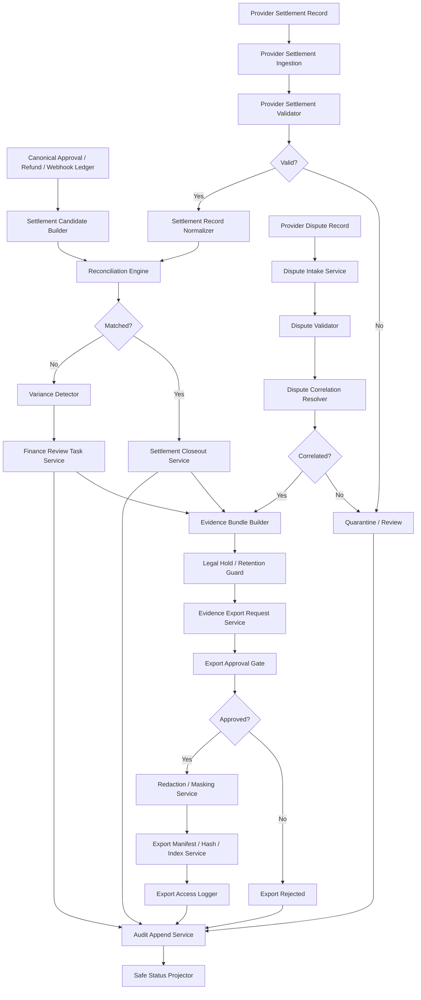

# 001380_Spec_Module_POS_Gateway_Settlement_Dispute_Evidence_Export_API_Data_Model_And_Test_Map.md

## 1. Document Control

| Field | Value |
|---|---|
| Project | yoonsul_wait_order_handoff / CatchMenu-Catch&Order |
| Band | 00100_project_foundation |
| Document Type | Spec |
| Document Layer | Module |
| Document Role | POS Gateway Settlement / Dispute / Evidence Export API, Data Model, And Test Map |
| Parent Overview | 001360_Spec_Overview_POS_Gateway_Settlement_Dispute_And_Evidence_Export_Main_Flow.md |
| Parent Logic | 001370_Spec_Logic_POS_Gateway_Settlement_Dispute_Evidence_Export_State_Transition_And_Exception_Rule.md |
| Related Approval Package | 000990_Index_POS_Gateway_Approval_Implementation_Package_Closeout.md |
| Related Cancel Refund Package | 001080_Index_POS_Gateway_Cancel_Refund_Implementation_Package_Closeout.md |
| Related Timeout Retry DLQ Replay Package | 001170_Index_POS_Gateway_Timeout_Retry_DLQ_Replay_Implementation_Package_Closeout.md |
| Related Store Offline Local Ledger Resync Package | 001260_Index_POS_Gateway_Store_Offline_Local_Ledger_Resync_Implementation_Package_Closeout.md |
| Related Webhook Package | 001350_Index_POS_Gateway_Webhook_Inbound_Verification_Event_Normalization_Implementation_Package_Closeout.md |
| Related Runtime Flow Bundle | 064150_Flow_POS_Gateway_Settlement_Dispute_And_Evidence_Export.md |
| Related Module Template | 000680_Template_Development_Foundation_Module_Document.md |
| Related Source Tree Matrix | 000820_Matrix_Development_Foundation_Source_Tree_To_Module_Document_Map.md |
| Related Owner Register | 000830_Register_Development_Foundation_Repository_Module_Owner_Map.md |
| Related Restricted Register | 000750_Register_Development_Foundation_Restricted_File_And_Zone_Control.md |
| Status | Draft / Pending Codebase Hydration |
| Owner | Architecture / Engineering / QA / Compliance / Finance / Security / Operations |
| AI Solo Change | Documentation drafting allowed; settlement/dispute/evidence export runtime implementation approval prohibited |

---

## 2. Purpose

This Module document maps POS Gateway Settlement / Dispute / Evidence Export logic rules to implementation-facing APIs, modules, data models, queues, jobs, tests, and evidence.

It is the third layer in the Development Foundation chain:

```text
Overview → Logic → Module → File → Test → Evidence
```

Actual source paths and test paths must be filled after codebase hydration.

---

## 3. Scope

### 3.1 Included

- Settlement candidate builder.
- Provider settlement ingestion service.
- Provider settlement validator.
- Settlement normalizer.
- Reconciliation engine.
- Variance detector.
- Finance review task creator.
- Settlement closeout service.
- Dispute intake service.
- Dispute validator.
- Dispute correlation resolver.
- Evidence bundle builder.
- Legal hold marker.
- Retention guard.
- Evidence export request service.
- Export approval gate.
- Redaction/masking service.
- Export manifest/hash/index service.
- Export access logger.
- Audit append service.
- Safe projection service.
- Test and evidence map.

### 3.2 Excluded

- Corporate accounting close policy.
- Tax filing.
- Provider dispute portal operation.
- Manual legal argument drafting.
- External regulator submission.
- Production DB migration execution.
- Secret rotation.
- Production release/deployment.

---

## 4. Implementation Readiness Warning

This document contains expected module boundaries and placeholder paths.

Runtime implementation is blocked until:

1. actual source paths are known,
2. actual tests are known,
3. restricted files are registered,
4. owners are assigned,
5. MVP provider settlement/dispute/export scope is approved,
6. settlement identity and variance tolerance policy are approved,
7. dispute correlation policy is approved,
8. evidence bundle scope policy is approved,
9. export approval role policy is approved,
10. redaction/masking policy is approved,
11. legal hold/retention policy is approved,
12. audit/export manifest format is approved,
13. human approval exists for restricted settlement/dispute/export paths.

---

## 5. Runtime Module Map

| Module | Responsibility | Related Logic Rule | Restricted Zone | Owner |
|---|---|---|---|---|
| settlement_candidate_builder | Converts verified canonical ledger events into settlement candidates | R001~R004 | RZ-LEDGER / RZ-SETTLE | Engineering / Finance |
| provider_settlement_ingestion_service | Receives or references provider settlement records | R005 | RZ-PROVIDER / RZ-SETTLE | Engineering / Provider Integration |
| provider_settlement_validator | Validates provider identity, merchant/store context, settlement identity, amount/currency/fee/tax fields | R006~R009 | RZ-SETTLE / RZ-COMPLIANCE | Engineering / Finance |
| settlement_record_normalizer | Normalizes provider settlement fields into canonical settlement record | R009 | RZ-SETTLE | Engineering / Finance |
| reconciliation_engine | Matches provider settlement records with internal ledger candidates | R010~R016 | RZ-LEDGER / RZ-RECON | Engineering / Finance |
| settlement_variance_detector | Detects amount/currency/fee/tax/timing/missing/orphan/duplicate variance | R011~R017 | RZ-RECON / RZ-FINANCE | Finance / Engineering |
| finance_review_task_service | Creates finance/compliance review tasks for variance | R017~R018 | RZ-FINANCE / RZ-OPS | Finance / Operations |
| settlement_closeout_service | Marks settlement as closed only after match or approved variance resolution | R018~R019 | RZ-SETTLE / RZ-AUDIT | Finance / Compliance |
| dispute_intake_service | Receives provider dispute/chargeback-like events | R020 | RZ-DISPUTE | Operations / Compliance |
| dispute_validator | Validates dispute identity, amount/currency, provider/store context | R021~R023 | RZ-DISPUTE / RZ-COMPLIANCE | Compliance / Engineering |
| dispute_correlation_resolver | Links dispute to payment/refund/order/ledger target | R024~R027 | RZ-DISPUTE / RZ-LEDGER | Compliance / Engineering |
| evidence_bundle_builder | Assembles source events, audit chain, ledger records, snapshots, and context | R028~R034 | RZ-EVIDENCE / RZ-LEGAL | Compliance / Engineering |
| legal_hold_service | Marks legal/dispute hold and blocks deletion/mutation where required | R032~R033, R050 | RZ-LEGAL / RZ-RETENTION | Compliance / Legal |
| retention_guard | Enforces retention and legal hold rules before deletion/export mutation | R033 | RZ-RETENTION | Compliance / Engineering |
| evidence_export_request_service | Captures export requester, purpose, scope, and target bundle | R035~R038 | RZ-EXPORT / RZ-COMPLIANCE | Operations / Compliance |
| export_approval_gate | Approves or rejects export by authorized role | R036~R039 | RZ-EXPORT / RZ-LEGAL | Compliance / Operations |
| export_redaction_masking_service | Applies redaction/masking and blocks secret/signature leakage | R040~R042 | RZ-SECURITY / RZ-EXPORT | Security / Compliance |
| export_manifest_service | Generates export file, hash, manifest, and index | R043, R049 | RZ-EVIDENCE / RZ-AUDIT | Engineering / Compliance |
| export_access_logger | Logs access, download, delivery, and viewer purpose | R044~R045 | RZ-AUDIT / RZ-EXPORT | Engineering / Operations |
| settlement_dispute_audit_append_service | Appends settlement/dispute/export material events to audit ledger | R046~R050 | RZ-AUDIT | Engineering / Compliance |
| settlement_dispute_status_projector | Projects safe settlement/dispute/export state to admin, finance, compliance, store, and customer surfaces | Projection rules | Conditional | Product / Engineering |
| settlement_dispute_test_harness | Tests matching, variance, dispute correlation, evidence bundle, export approval, redaction, manifest, audit | All | Conditional | QA / Engineering |

---

## 6. Source File Map

Actual paths must be filled after hydration.

| Source File / Folder | Expected Role | Related Module | Related Logic | Test File | Evidence |
|---|---|---|---|---|---|
| TBD | Settlement candidate builder | settlement_candidate_builder | R001~R004 | TBD | settlement_candidate_evidence |
| TBD | Provider settlement ingestion | provider_settlement_ingestion_service | R005 | TBD | provider_settlement_received_evidence |
| TBD | Provider settlement validator | provider_settlement_validator | R006~R009 | TBD | provider_settlement_validated_evidence |
| TBD | Settlement record normalizer | settlement_record_normalizer | R009 | TBD | provider_settlement_validated_evidence |
| TBD | Reconciliation engine | reconciliation_engine | R010~R016 | TBD | settlement_matched_or_variance_evidence |
| TBD | Settlement variance detector | settlement_variance_detector | R011~R017 | TBD | settlement_variance_evidence |
| TBD | Finance review task service | finance_review_task_service | R017~R018 | TBD | settlement_review_task_evidence |
| TBD | Settlement closeout service | settlement_closeout_service | R018~R019 | TBD | settlement_closed_evidence |
| TBD | Dispute intake service | dispute_intake_service | R020 | TBD | dispute_received_evidence |
| TBD | Dispute validator | dispute_validator | R021~R023 | TBD | dispute_validation_evidence |
| TBD | Dispute correlation resolver | dispute_correlation_resolver | R024~R027 | TBD | dispute_correlation_evidence |
| TBD | Evidence bundle builder | evidence_bundle_builder | R028~R034 | TBD | evidence_bundle_assembled_evidence |
| TBD | Legal hold service | legal_hold_service | R032~R033, R050 | TBD | legal_hold_active_evidence |
| TBD | Retention guard | retention_guard | R033 | TBD | retention_blocked_by_hold_evidence |
| TBD | Evidence export request service | evidence_export_request_service | R035~R038 | TBD | export_requested_evidence |
| TBD | Export approval gate | export_approval_gate | R036~R039 | TBD | export_approved_or_rejected_evidence |
| TBD | Redaction/masking service | export_redaction_masking_service | R040~R042 | TBD | export_redacted_evidence |
| TBD | Export manifest service | export_manifest_service | R043, R049 | TBD | export_generated_evidence |
| TBD | Export access logger | export_access_logger | R044~R045 | TBD | export_access_logged_evidence |
| TBD | Audit append service | settlement_dispute_audit_append_service | R046~R050 | TBD | audit_append_evidence |
| TBD | Status projector | settlement_dispute_status_projector | Projection rules | TBD | safe_projection_evidence |

---

## 7. API / Interface Map

### 7.1 Settlement Interfaces

| Interface | Direction | Caller | Callee | Request | Response | Related Logic |
|---|---|---|---|---|---|---|
| createSettlementCandidate | Internal | Canonical Ledger / Reconciliation | Settlement Candidate Builder | ledger_ref, provider_ref, amount, currency, event_type | settlement_candidate_ref / blocked_reason | R001~R004 |
| ingestProviderSettlementRecord | Internal / External | Provider Feed / Admin / Webhook | Provider Settlement Ingestion | provider_record, provider_context | provider_settlement_ref | R005 |
| validateProviderSettlementRecord | Internal | Ingestion Service | Provider Settlement Validator | provider_settlement_ref | valid / invalid / quarantine_reason | R006~R009 |
| normalizeProviderSettlementRecord | Internal | Validator | Settlement Record Normalizer | provider_record | canonical_settlement_record | R009 |
| matchSettlementRecord | Internal | Reconciliation Engine | Reconciliation Engine | settlement_candidate, provider_settlement_record | match / variance / missing / orphan | R010~R016 |
| detectSettlementVariance | Internal | Reconciliation Engine | Variance Detector | expected_record, provider_record | variance_result | R011~R017 |
| createSettlementReviewTask | Internal | Variance Detector | Finance Review Task Service | variance_result, evidence_ref | review_task_ref | R017 |
| closeSettlementRecord | Internal | Finance / Reconciliation | Settlement Closeout Service | match_ref, variance_resolution_ref | settlement_closeout_ref | R018~R019 |

### 7.2 Dispute Interfaces

| Interface | Direction | Caller | Callee | Request | Response | Related Logic |
|---|---|---|---|---|---|---|
| receiveDisputeRecord | Internal / External | Provider / Admin | Dispute Intake Service | provider_dispute_record | dispute_ref | R020 |
| validateDisputeRecord | Internal | Dispute Intake | Dispute Validator | dispute_ref | valid / invalid / quarantine_reason | R021~R023 |
| correlateDisputeRecord | Internal | Dispute Validator | Dispute Correlation Resolver | dispute_ref, provider_ref, amount, currency | correlated_target / uncorrelated / ambiguous | R024~R027 |
| requestDisputeEvidenceBundle | Internal | Dispute Correlation Resolver | Evidence Bundle Builder | dispute_ref, target_refs | evidence_bundle_ref / blocked_reason | R028~R034 |

### 7.3 Evidence Export Interfaces

| Interface | Direction | Caller | Callee | Request | Response | Related Logic |
|---|---|---|---|---|---|---|
| requestEvidenceExport | Internal | Admin / Finance / Compliance | Evidence Export Request Service | requester, purpose, scope, bundle_ref | export_request_ref | R035 |
| approveEvidenceExport | Internal | Authorized Reviewer | Export Approval Gate | export_request_ref, approval_decision | approved / rejected | R036~R039 |
| redactEvidenceExport | Internal | Export Approval Gate | Redaction / Masking Service | bundle_ref, approved_scope | redacted_bundle_ref / failure | R040~R042 |
| generateEvidenceExport | Internal | Redaction Service | Export Manifest Service | redacted_bundle_ref | export_file_ref, hash, manifest_ref | R043, R049 |
| logEvidenceExportAccess | Internal | Export Access Gateway | Export Access Logger | accessor, export_file_ref, purpose | access_log_ref | R044~R045 |
| appendSettlementDisputeAudit | Internal | Any module | Audit Append Service | event_type, entity_ref, evidence_ref | audit_event_ref | R046~R050 |

---

## 8. Data Model Map

Actual schema names must be confirmed after hydration.

| Data Model / Table | Purpose | Key Fields | Related Logic | Restricted? |
|---|---|---|---|---:|
| settlement_candidates | Internal settlement-eligible ledger items | settlement_candidate_id, ledger_ref, provider_ref, amount, currency, candidate_status | R001~R004 | Yes |
| provider_settlement_records | Provider settlement records | provider_settlement_id, provider, merchant_ref, store_id, amount, fee, tax, currency, settlement_date | R005~R009 | Yes |
| normalized_settlement_records | Canonical settlement records | normalized_settlement_id, provider_settlement_id, canonical_amount, fee, tax, currency, normalized_status | R009 | Yes |
| settlement_matches | Match result between provider and internal ledger | settlement_match_id, candidate_ref, provider_settlement_ref, match_status, match_basis | R010~R016 | Yes |
| settlement_variances | Amount/currency/fee/tax/timing/missing/orphan/duplicate variance | variance_id, variance_type, expected_value, provider_value, review_status | R011~R018 | Yes |
| settlement_review_tasks | Finance/compliance review tasks | review_task_id, variance_id, owner, due_at, decision, evidence_ref | R017~R018 | Yes |
| settlement_closeouts | Final settlement closeout evidence | settlement_closeout_id, match_ref, variance_resolution_ref, closed_at, evidence_ref | R019 | Yes |
| dispute_records | Provider dispute/chargeback-like records | dispute_id, provider_dispute_id, reason, amount, currency, provider_ref, status | R020~R023 | Yes |
| dispute_correlations | Dispute-to-internal target mapping | dispute_correlation_id, dispute_id, target_type, target_ref, correlation_status | R024~R027 | Yes |
| evidence_bundles | Evidence bundle for dispute/export | evidence_bundle_id, source_refs, bundle_status, legal_hold_ref, audit_chain_ref | R028~R034 | Yes |
| legal_holds | Legal/dispute hold markers | legal_hold_id, scope_ref, reason, active, release_ref | R032~R033, R050 | Yes |
| retention_decisions | Retention/delete/export mutation decisions | retention_decision_id, entity_ref, retention_state, hold_blocked | R033 | Yes |
| evidence_export_requests | Export request, purpose, scope, requester | export_request_id, requester, purpose, scope, bundle_ref, approval_status | R035~R039 | Yes |
| evidence_export_redactions | Redaction/masking results | redaction_id, export_request_id, redacted_fields, blocked_fields, status | R040~R042 | Yes |
| evidence_export_files | Export file metadata | export_file_id, export_request_id, file_ref, hash, manifest_ref, created_at | R043, R049 | Yes |
| evidence_export_access_logs | Export access/download/delivery logs | export_access_id, accessor, export_file_ref, purpose, accessed_at | R044~R045 | Yes |
| audit_events | Immutable audit trace | audit_event_id, event_type, entity_ref, evidence_ref, created_at | R046~R050 | Yes |

---

## 9. Canonical Settlement Record Shape

A normalized settlement record should include:

```text
normalized_settlement_id
provider
provider_settlement_id
merchant_ref
store_id
ledger_ref
approval_ref
refund_ref
cancel_ref
provider_ref
gross_amount
refund_amount
net_amount
fee_amount
tax_amount
commission_amount
currency
transaction_date
settlement_date
provider_report_date
match_status
variance_status
evidence_ref
audit_ref
```

Rules:

1. Missing internal ledger target must not create fake ledger.
2. Missing provider record must not be silently closed.
3. Amount/currency mismatch must become variance unless approved policy says otherwise.
4. Fee/tax/commission tolerance must be explicit.
5. Settlement closeout must carry evidence_ref and audit_ref.

---

## 10. Canonical Dispute Record Shape

A dispute record should include:

```text
dispute_id
provider
provider_dispute_id
merchant_ref
store_id
reason_code
reason_text
dispute_amount
currency
provider_ref
ledger_ref
approval_ref
refund_ref
order_ref
customer_ref_masked
dispute_received_at
correlation_status
evidence_bundle_ref
legal_hold_ref
review_status
audit_ref
```

Rules:

1. Uncorrelated disputes must not be resolved automatically.
2. Ambiguous disputes must not select a financial target automatically.
3. Dispute evidence must include audit chain references.
4. Customer data must be masked according to approved policy.

---

## 11. Canonical Evidence Export Shape

An evidence export record should include:

```text
export_request_id
requester_ref
requester_role
purpose
approved_scope
evidence_bundle_ref
legal_hold_status
retention_status
redaction_status
redacted_bundle_ref
export_file_ref
export_hash
manifest_ref
access_policy_ref
approved_by
approved_at
generated_at
access_log_ref
audit_ref
```

Rules:

1. Export cannot proceed without authorized approval.
2. Export purpose and scope are mandatory.
3. Redaction/masking must precede file generation.
4. Raw secrets/signatures/credentials must be blocked.
5. Export file must have hash and manifest.
6. Export access must be logged.

---

## 12. Queue / Job / Event Map

| Item | Type | Producer | Consumer | Related Logic | Retry / DLQ | Evidence |
|---|---|---|---|---|---|---|
| settlement.candidate_created | Event | Canonical Ledger | Settlement Candidate Builder | R001~R004 | Review if invalid | settlement_candidate_evidence |
| settlement.provider_received | Event | Provider Ingestion | Provider Settlement Validator | R005 | Quarantine if invalid | provider_settlement_received_evidence |
| settlement.provider_validated | Event | Validator | Reconciliation Engine | R006~R009 | Quarantine if invalid | provider_settlement_validated_evidence |
| settlement.matched | Event | Reconciliation Engine | Settlement Closeout / Audit | R010 | Review if policy mismatch | settlement_matched_evidence |
| settlement.variance_detected | Event | Variance Detector | Finance Review | R011~R017 | Review task | settlement_variance_evidence |
| settlement.review_required | Task | Variance Detector | Finance Reviewer | R017~R018 | Escalate by SLA | settlement_review_task_evidence |
| settlement.closed | Event | Closeout Service | Audit / Projection | R019 | Block if audit fails | settlement_closed_evidence |
| dispute.received | Event | Dispute Intake | Dispute Validator | R020 | Quarantine if invalid | dispute_received_evidence |
| dispute.correlated | Event | Correlation Resolver | Evidence Builder | R024~R027 | Review if missing/ambiguous | dispute_correlated_evidence |
| dispute.evidence_ready | Event | Evidence Builder | Export Request / Admin | R028~R034 | Block if missing source | dispute_evidence_ready_evidence |
| export.requested | Event | Admin/Finance/Compliance | Export Approval Gate | R035 | Reject if invalid | export_requested_evidence |
| export.approved | Event | Approval Gate | Redaction Service | R036~R039 | Reject if unauthorized | export_approved_evidence |
| export.redacted | Event | Redaction Service | Manifest Service | R040~R042 | Block if failure | export_redacted_evidence |
| export.generated | Event | Manifest Service | Access Logger / Audit | R043 | Block if hash/manifest fail | export_generated_evidence |
| export.access_logged | Event | Access Logger | Audit | R044~R045 | Incident if log fail | export_access_logged_evidence |
| audit.appended | Event | Audit Service | Review / Projection | R046~R050 | Incident if fail | audit_append_evidence |

---

## 13. Function / Class Responsibility Map

Expected symbols must be confirmed after hydration.

| Function / Class | Responsibility | Must Not Do | Related Logic | Test |
|---|---|---|---|---|
| createSettlementCandidate | Create settlement candidate from verified ledger | Must not use unverified/non-terminal source | R001~R004 | candidate tests |
| ingestProviderSettlementRecord | Receive provider settlement record | Must not close settlement | R005 | ingestion tests |
| validateProviderSettlementRecord | Validate provider/context/schema | Must not match invalid record | R006~R009 | validation tests |
| normalizeSettlementRecord | Normalize settlement fields | Must not drop fee/tax/currency | R009 | normalization tests |
| matchSettlementRecord | Match provider and internal record | Must not hide mismatch | R010~R016 | matching tests |
| detectSettlementVariance | Detect amount/currency/fee/tax/timing/missing/orphan/duplicate variance | Must not auto-resolve without policy | R011~R017 | variance tests |
| createFinanceReviewTask | Create review task for variance | Must not close variance | R017 | review task tests |
| closeSettlementRecord | Close settlement with evidence | Must not close without match/approved variance | R018~R019 | closeout tests |
| receiveDisputeRecord | Capture dispute record | Must not resolve dispute | R020 | dispute intake tests |
| validateDisputeRecord | Validate dispute identity/context | Must not correlate invalid record | R021~R023 | dispute validation tests |
| correlateDisputeRecord | Link dispute to internal target | Must not choose ambiguous target | R024~R027 | dispute correlation tests |
| buildEvidenceBundle | Assemble source/audit evidence | Must not omit required source/audit chain | R028~R034 | evidence bundle tests |
| markLegalHold | Apply legal hold | Must not allow deletion under hold | R032~R033 | legal hold tests |
| enforceRetentionGuard | Enforce retention/hold | Must not delete held evidence | R033 | retention tests |
| requestEvidenceExport | Capture export request | Must not approve export | R035 | export request tests |
| approveEvidenceExport | Approve/reject export | Must not approve unauthorized scope | R036~R039 | export approval tests |
| redactEvidenceExport | Redact/mask evidence packet | Must not leak secrets/signatures | R040~R042 | redaction tests |
| generateEvidenceExportManifest | Generate hash/manifest/index | Must not generate without redaction | R043, R049 | manifest tests |
| logEvidenceExportAccess | Log access/download/delivery | Must not allow unlogged access | R044~R045 | access logging tests |
| appendSettlementDisputeAudit | Append immutable audit | Must not mutate prior audit | R046~R050 | audit tests |
| projectSettlementDisputeStatus | Project safe status | Must not expose internal sensitive details | Projection rules | projection tests |

---

## 14. Error Handling Map

| Error Type | Module Behavior | User/Store/Admin Behavior | Evidence |
|---|---|---|---|
| Source ledger non-terminal | Block settlement candidate | Admin/finance review | settlement_candidate_blocked_evidence |
| Provider reference missing | Candidate incomplete/review | Admin/finance review | provider_ref_missing_evidence |
| Provider settlement context missing | Quarantine/review | Finance/provider review | provider_settlement_context_missing_evidence |
| Provider settlement schema invalid | Quarantine/review | Finance/provider review | provider_settlement_schema_invalid_evidence |
| Amount mismatch | Variance/review | Finance review | settlement_amount_variance_evidence |
| Currency mismatch | Block closeout/review | Finance review | settlement_currency_variance_evidence |
| Fee/tax mismatch | Variance according to policy | Finance review | settlement_fee_tax_variance_evidence |
| Duplicate settlement | Block duplicate closeout | Finance review | settlement_duplicate_evidence |
| Missing provider record | Variance/review | Finance review | settlement_missing_provider_record_evidence |
| Orphan provider record | Variance/review | Finance/provider review | settlement_orphan_provider_record_evidence |
| Dispute identity missing | Quarantine/review | Compliance review | dispute_identity_missing_evidence |
| Dispute uncorrelated | Manual review | Compliance/admin review | dispute_uncorrelated_evidence |
| Dispute ambiguous | Manual review | Compliance/admin review | dispute_ambiguous_correlation_evidence |
| Evidence source missing | Block bundle/export | Compliance review | evidence_source_missing_evidence |
| Audit chain gap | Block bundle/export | Compliance review | evidence_audit_chain_gap_evidence |
| Unauthorized export | Reject export | Compliance/admin review | export_unauthorized_evidence |
| Export purpose missing | Reject export | Requester correction | export_purpose_missing_evidence |
| Export scope exceeded | Reject or require narrowed approval | Compliance review | export_scope_exceeded_evidence |
| Redaction failure | Block export | Security/compliance review | export_redaction_failed_evidence |
| Secret/signature detected | Block export and create security review | Security review | export_secret_leak_blocked_evidence |
| Manifest/hash failure | Block export | Engineering/compliance review | export_generated_evidence |
| Audit append failure | Incident/recovery path | Compliance/engineering review | audit_append_failed_evidence |

---

## 15. Security / Compliance Implementation Map

| Control | Implementation Point | Test | Evidence |
|---|---|---|---|
| Settlement candidate requires verified terminal ledger source | settlement_candidate_builder | non_terminal_candidate_blocked_test | settlement_candidate_blocked_evidence |
| Provider context required | provider_settlement_validator | context_missing_test | provider_settlement_context_missing_evidence |
| Amount/currency mismatch variance | reconciliation_engine / variance_detector | amount_currency_variance_test | settlement_amount_variance_evidence |
| Duplicate settlement closeout blocked | reconciliation_engine | duplicate_settlement_test | settlement_duplicate_evidence |
| Dispute ambiguous correlation blocked | dispute_correlation_resolver | ambiguous_dispute_test | dispute_ambiguous_correlation_evidence |
| Evidence bundle requires audit chain | evidence_bundle_builder | audit_chain_gap_test | evidence_audit_chain_gap_evidence |
| Legal hold blocks deletion/mutation | legal_hold_service / retention_guard | legal_hold_delete_block_test | retention_blocked_by_hold_evidence |
| Export requires authorized role | export_approval_gate | unauthorized_export_test | export_unauthorized_evidence |
| Export requires purpose/scope | evidence_export_request_service | missing_purpose_scope_test | export_purpose_missing_evidence |
| Redaction blocks secret/signature leakage | export_redaction_masking_service | export_secret_leak_test | export_secret_leak_blocked_evidence |
| Export file hash/manifest required | export_manifest_service | manifest_hash_test | export_generated_evidence |
| Export access logged | export_access_logger | access_log_test | export_access_logged_evidence |
| Audit append required | settlement_dispute_audit_append_service | audit_append_test | audit_append_evidence |

---

## 16. Test Map

| Test Type | Required Scenarios | Candidate Test File | Evidence |
|---|---|---|---|
| Unit | candidate creation, provider validation, matching, variance, dispute validation, correlation, evidence bundle, export approval, redaction, manifest | TBD | unit_test_report |
| Integration | ledger → settlement candidate → provider record → match/variance → closeout → audit | TBD | settlement_integration_report |
| Integration | dispute → correlation → evidence bundle → export request → approval → redaction → manifest → access log → audit | TBD | dispute_export_integration_report |
| Security | unauthorized export, scope exceeded, secret/signature leak, masking | TBD | security_test_report |
| Compliance | legal hold blocks deletion, retention blocked by dispute/hold, evidence export approval required | TBD | compliance_test_report |
| Fault Injection | missing provider record, orphan provider record, amount mismatch, audit append fail, manifest fail | TBD | fault_test_report |
| Regression | duplicate settlement does not close twice; uncorrelated dispute does not resolve | TBD | regression_test_report |
| Audit | every material decision creates audit evidence | TBD | audit_test_report |
| Projection | variance/dispute/export pending states do not appear final | TBD | projection_test_report |

---

## 17. Traceability Matrix

| Flow Step | Logic Rule | Module | Source File | Function/Class | Test | Evidence |
|---|---|---|---|---|---|---|
| Create settlement candidate | R001~R004 | settlement_candidate_builder | TBD | createSettlementCandidate | TBD | settlement_candidate_evidence |
| Receive provider settlement | R005 | provider_settlement_ingestion_service | TBD | ingestProviderSettlementRecord | TBD | provider_settlement_received_evidence |
| Validate settlement record | R006~R009 | provider_settlement_validator | TBD | validateProviderSettlementRecord | TBD | provider_settlement_validated_evidence |
| Normalize settlement record | R009 | settlement_record_normalizer | TBD | normalizeSettlementRecord | TBD | provider_settlement_validated_evidence |
| Match settlement | R010~R016 | reconciliation_engine | TBD | matchSettlementRecord | TBD | settlement_matched_or_variance_evidence |
| Detect variance | R011~R017 | settlement_variance_detector | TBD | detectSettlementVariance | TBD | settlement_variance_evidence |
| Create finance review | R017~R018 | finance_review_task_service | TBD | createFinanceReviewTask | TBD | settlement_review_task_evidence |
| Close settlement | R018~R019 | settlement_closeout_service | TBD | closeSettlementRecord | TBD | settlement_closed_evidence |
| Receive dispute | R020 | dispute_intake_service | TBD | receiveDisputeRecord | TBD | dispute_received_evidence |
| Validate dispute | R021~R023 | dispute_validator | TBD | validateDisputeRecord | TBD | dispute_validation_evidence |
| Correlate dispute | R024~R027 | dispute_correlation_resolver | TBD | correlateDisputeRecord | TBD | dispute_correlation_evidence |
| Build evidence bundle | R028~R034 | evidence_bundle_builder | TBD | buildEvidenceBundle | TBD | evidence_bundle_assembled_evidence |
| Mark legal hold | R032~R033, R050 | legal_hold_service | TBD | markLegalHold | TBD | legal_hold_active_evidence |
| Enforce retention guard | R033 | retention_guard | TBD | enforceRetentionGuard | TBD | retention_blocked_by_hold_evidence |
| Request export | R035~R038 | evidence_export_request_service | TBD | requestEvidenceExport | TBD | export_requested_evidence |
| Approve export | R036~R039 | export_approval_gate | TBD | approveEvidenceExport | TBD | export_approved_or_rejected_evidence |
| Redact export | R040~R042 | export_redaction_masking_service | TBD | redactEvidenceExport | TBD | export_redacted_evidence |
| Generate export manifest | R043, R049 | export_manifest_service | TBD | generateEvidenceExportManifest | TBD | export_generated_evidence |
| Log export access | R044~R045 | export_access_logger | TBD | logEvidenceExportAccess | TBD | export_access_logged_evidence |
| Append audit | R046~R050 | settlement_dispute_audit_append_service | TBD | appendSettlementDisputeAudit | TBD | audit_append_evidence |
| Project safe status | Projection rules | settlement_dispute_status_projector | TBD | projectSettlementDisputeStatus | TBD | safe_projection_evidence |

---

## 18. Mermaid Module Diagram



---

## 19. Code Handoff Requirements

Before any implementation:

- [ ] Actual source paths are filled.
- [ ] Restricted paths are registered in 00750.
- [ ] Module owners are confirmed in 00830.
- [ ] Test files are identified.
- [ ] Evidence packet target is defined.
- [ ] MVP provider settlement/dispute/export scope is approved.
- [ ] Settlement identity and variance tolerance policy are approved.
- [ ] Fee/tax/commission normalization policy is approved.
- [ ] Dispute correlation policy is approved.
- [ ] Evidence bundle scope policy is approved.
- [ ] Export approval role policy is approved.
- [ ] Redaction/masking policy is approved.
- [ ] Legal hold/retention policy is approved.
- [ ] Export manifest/hash/index format is approved.
- [ ] Human approval exists for restricted settlement/dispute/export paths.
- [ ] Settlement/dispute/evidence export handoff readiness checklist is passed.
- [ ] Bounded Claude/Cursor prompts are prepared.

---

## 20. Open Questions

| Question | Owner | Blocking? |
|---|---|---:|
| What are actual settlement/dispute/export source paths? | Engineering | Yes |
| Which providers are included in MVP settlement scope? | Product / Finance / Provider Integration | Yes |
| What settlement identity fields exist per provider? | Finance / Engineering | Yes |
| What variance tolerance is allowed? | Finance / Compliance | Yes |
| What fee/tax/commission normalization rules apply? | Finance / Compliance | Yes |
| What dispute types are in MVP scope? | Compliance / Operations | Yes |
| What evidence bundle scope is required per dispute/export purpose? | Compliance / Legal | Yes |
| Who can approve evidence export? | Compliance / Operations | Yes |
| What redaction/masking policy applies? | Security / Compliance | Yes |
| How are export hashes/manifests retained? | Compliance / Engineering | Yes |
| How does legal hold interact with retention/deletion? | Legal / Compliance | Yes |

---

## 21. Summary

This Module document maps POS Gateway Settlement / Dispute / Evidence Export logic to expected implementation surfaces.

It is not yet a code handoff packet.

Implementation requires actual hydration results and the complete chain:

```text
Overview → Logic → Module → File → Test → Evidence
```

along with the parent Runtime Flow Bundle chain:

```text
Flow Step → Module → File → Test → Evidence
```
