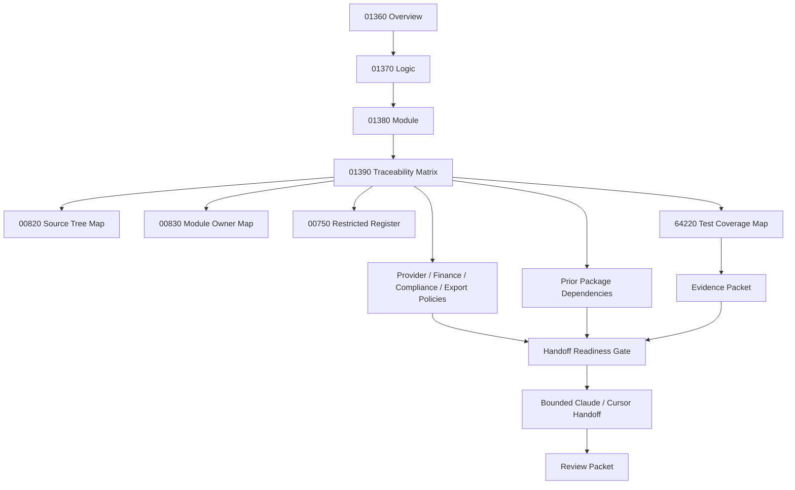

# 001390_Matrix_POS_Gateway_Settlement_Dispute_Evidence_Export_Overview_Logic_Module_To_Flow_Bundle_Traceability.md

## 1. Document Control

| Field | Value |
|---|---|
| Project | yoonsul_wait_order_handoff / CatchMenu-Catch&Order |
| Band | 00100_project_foundation |
| Document Type | Matrix |
| Document Role | POS Gateway Settlement / Dispute / Evidence Export Overview / Logic / Module To Flow Bundle Traceability |
| Related Overview | 001360_Spec_Overview_POS_Gateway_Settlement_Dispute_And_Evidence_Export_Main_Flow.md |
| Related Logic | 001370_Spec_Logic_POS_Gateway_Settlement_Dispute_Evidence_Export_State_Transition_And_Exception_Rule.md |
| Related Module | 001380_Spec_Module_POS_Gateway_Settlement_Dispute_Evidence_Export_API_Data_Model_And_Test_Map.md |
| Related Runtime Flow Bundle | 064150_Flow_POS_Gateway_Settlement_Dispute_And_Evidence_Export.md |
| Related Runtime Flow Registry | 064000_Index_Runtime_Flow_Bundle_Registry.md |
| Related Flow Module Map | 064210_Matrix_Flow_To_Module_Implementation_Map.md |
| Related Flow Test Map | 064220_Matrix_Flow_To_Test_Coverage_Map.md |
| Related Development Foundation Traceability | 000690_Matrix_Development_Foundation_Overview_Logic_Module_Traceability.md |
| Related Source Tree Matrix | 000820_Matrix_Development_Foundation_Source_Tree_To_Module_Document_Map.md |
| Related Restricted Register | 000750_Register_Development_Foundation_Restricted_File_And_Zone_Control.md |
| Status | Draft / Hydration Required |
| Owner | Architecture / Engineering / QA / Compliance / Finance / Security / Operations |
| AI Solo Change | Documentation mapping allowed; settlement/dispute/evidence export runtime approval prohibited |

---

## 2. Purpose

This matrix connects the POS Gateway Settlement / Dispute / Evidence Export `Overview → Logic → Module` document set to the parent Runtime Flow Bundle.

The required development chain is:

```text
Overview → Logic → Module → File → Test → Evidence
```

The parent Runtime Flow Bundle chain is:

```text
Flow Step → Module → File → Test → Evidence
```

This matrix bridges both chains for settlement candidates, provider settlement ingestion, reconciliation, variance, dispute intake, evidence bundle building, legal hold, retention, export approval, redaction, manifest/hash, access logging, audit, and safe projection.

---

## 3. Traceability Scope

### 3.1 Included

- 01360 Overview flow steps.
- 01370 Logic rules.
- 01380 Module mappings.
- 64150 Runtime Flow Bundle alignment.
- Test coverage expectations.
- Evidence expectations.
- Restricted-zone awareness.
- Upstream dependency awareness.
- Hydration-dependent TBD fields.

### 3.2 Excluded

- Actual source code changes.
- Actual DB migration.
- Provider settlement portal operation.
- Legal argument drafting.
- Tax filing.
- Production release approval.

---

## 4. Traceability Matrix

| Trace ID | Overview Flow Step | Logic Rule | Module | Source File | Test Coverage | Evidence | Runtime Flow Step | Status |
|---|---|---|---|---|---|---|---|---|
| POSSET-TRACE-001 | Internal ledger item becomes settlement candidate | R001~R004 | settlement_candidate_builder | TBD | candidate creation / non-terminal block / duplicate candidate test | settlement_candidate_evidence | Settlement candidate creation | Draft |
| POSSET-TRACE-002 | Provider settlement record received | R005 | provider_settlement_ingestion_service | TBD | provider settlement ingestion test | provider_settlement_received_evidence | Provider settlement ingestion | Draft |
| POSSET-TRACE-003 | Provider settlement record validated | R006~R009 | provider_settlement_validator | TBD | context missing / identity missing / schema invalid test | provider_settlement_validated_evidence | Settlement validation | Draft |
| POSSET-TRACE-004 | Provider settlement record normalized | R009 | settlement_record_normalizer | TBD | fee/tax/currency normalization test | provider_settlement_validated_evidence | Settlement normalization | Draft |
| POSSET-TRACE-005 | Settlement record matched | R010 | reconciliation_engine | TBD | exact match test | settlement_matched_evidence | Settlement matching | Draft |
| POSSET-TRACE-006 | Amount/currency/fee/tax/timing variance detected | R011~R017 | settlement_variance_detector | TBD | amount/currency/fee/tax/timing variance tests | settlement_variance_evidence | Variance detection | Draft |
| POSSET-TRACE-007 | Missing/orphan/duplicate settlement handled | R014~R017 | reconciliation_engine / settlement_variance_detector | TBD | missing provider / orphan provider / duplicate settlement tests | settlement_missing_or_orphan_or_duplicate_evidence | Settlement exception handling | Draft |
| POSSET-TRACE-008 | Finance review task created | R017~R018 | finance_review_task_service | TBD | review task creation / SLA test | settlement_review_task_evidence | Finance review | Draft |
| POSSET-TRACE-009 | Settlement closed | R018~R019 | settlement_closeout_service | TBD | closeout after match / approved variance test | settlement_closed_evidence | Settlement closeout | Draft |
| POSSET-TRACE-010 | Dispute received | R020 | dispute_intake_service | TBD | dispute intake test | dispute_received_evidence | Dispute intake | Draft |
| POSSET-TRACE-011 | Dispute validated | R021~R023 | dispute_validator | TBD | missing identity / invalid schema / missing context test | dispute_validation_evidence | Dispute validation | Draft |
| POSSET-TRACE-012 | Dispute correlated | R024~R027 | dispute_correlation_resolver | TBD | correlated / uncorrelated / ambiguous dispute test | dispute_correlation_evidence | Dispute correlation | Draft |
| POSSET-TRACE-013 | Evidence bundle requested and assembled | R028~R034 | evidence_bundle_builder | TBD | source missing / audit gap / bundle assembled test | evidence_bundle_assembled_evidence | Evidence bundle build | Draft |
| POSSET-TRACE-014 | Legal hold and retention enforced | R032~R033, R050 | legal_hold_service / retention_guard | TBD | legal hold blocks deletion / retention blocked test | legal_hold_active_evidence | Legal hold / retention | Draft |
| POSSET-TRACE-015 | Export requested | R035~R038 | evidence_export_request_service | TBD | requester / purpose / scope test | export_requested_evidence | Export request | Draft |
| POSSET-TRACE-016 | Export approved or rejected | R036~R039 | export_approval_gate | TBD | unauthorized / scope exceeded / approved export test | export_approved_or_rejected_evidence | Export approval gate | Draft |
| POSSET-TRACE-017 | Export redacted and masked | R040~R042 | export_redaction_masking_service | TBD | redaction failure / secret leak blocked / masked export test | export_redacted_evidence | Export redaction | Draft |
| POSSET-TRACE-018 | Export manifest, hash, and index generated | R043, R049 | export_manifest_service | TBD | hash/manifest/index test | export_generated_evidence | Export manifest/hash | Draft |
| POSSET-TRACE-019 | Export access logged | R044~R045 | export_access_logger | TBD | access/download/delivery log test | export_access_logged_evidence | Export access logging | Draft |
| POSSET-TRACE-020 | Audit appended for material decisions | R046~R050 | settlement_dispute_audit_append_service | TBD | audit append / audit immutability / audit failure test | audit_append_evidence | Audit ledger append | Draft |
| POSSET-TRACE-021 | Safe status projected | Projection rules | settlement_dispute_status_projector | TBD | variance/dispute/export pending not shown final test | safe_projection_evidence | Safe projection | Draft |
| POSSET-TRACE-022 | Evidence packet closeout | All rules | settlement_dispute_test_harness / review packet | TBD | evidence completeness review | settlement_dispute_export_review_packet | Flow evidence closeout | Draft |

---

## 5. Status Values

| Status | Meaning |
|---|---|
| Draft | Proposed trace row |
| Mapped | Overview, Logic, Module, and Flow Step are linked |
| Hydration Required | Actual source/test paths are still unknown |
| Test Ready | Test target is known |
| Evidence Ready | Evidence target is known |
| Approved | Ready for implementation handoff |
| Blocked | Missing document, source path, test, evidence, policy, or approval |
| Deprecated | Replaced but retained for audit history |

---

## 6. Hydration Dependency

This matrix is not implementation-ready until actual paths are added from codebase hydration.

Required hydration sources:

| Required Source | Document |
|---|---|
| Actual source paths | 000840_Evidence_Development_Foundation_First_Codebase_Hydration_Report.md or later hydration packet |
| Source-to-module rows | 000820_Matrix_Development_Foundation_Source_Tree_To_Module_Document_Map.md |
| Module owner rows | 000830_Register_Development_Foundation_Repository_Module_Owner_Map.md |
| Restricted file rows | 000750_Register_Development_Foundation_Restricted_File_And_Zone_Control.md |
| Actual test paths | 064220_Matrix_Flow_To_Test_Coverage_Map.md or hydration output |

---

## 7. Restricted-Zone Traceability

| Trace ID | Restricted Area | AI Solo Allowed? | Human Approval Required? |
|---|---|---:|---:|
| POSSET-TRACE-001 | Settlement candidate creation from financial ledger | No | Yes |
| POSSET-TRACE-003 | Provider settlement validation | No | Yes |
| POSSET-TRACE-004 | Fee/tax/currency normalization | No | Yes |
| POSSET-TRACE-005 | Settlement matching | No | Yes |
| POSSET-TRACE-006 | Settlement variance detection | No | Yes |
| POSSET-TRACE-008 | Finance/compliance review task | No | Yes |
| POSSET-TRACE-009 | Settlement closeout | No | Yes |
| POSSET-TRACE-012 | Dispute correlation | No | Yes |
| POSSET-TRACE-013 | Evidence bundle scope and assembly | No | Yes |
| POSSET-TRACE-014 | Legal hold and retention | No | Yes |
| POSSET-TRACE-016 | Evidence export approval | No | Yes |
| POSSET-TRACE-017 | Export redaction/masking | No | Yes |
| POSSET-TRACE-018 | Export manifest/hash | No | Yes |
| POSSET-TRACE-019 | Export access logging | No | Yes |
| POSSET-TRACE-020 | Audit append behavior | No | Yes |

Any implementation touching these rows must pass No-AI-Solo approval.

---

## 8. Test Coverage Requirements By Trace Row

| Trace ID | Minimum Test Types |
|---|---|
| POSSET-TRACE-001 | Unit, integration |
| POSSET-TRACE-002 | Unit, integration |
| POSSET-TRACE-003 | Unit, fault injection |
| POSSET-TRACE-004 | Unit, finance normalization |
| POSSET-TRACE-005 | Unit, integration, reconciliation |
| POSSET-TRACE-006 | Unit, finance variance, regression |
| POSSET-TRACE-007 | Unit, fault injection, regression |
| POSSET-TRACE-008 | Unit, operations/SLA |
| POSSET-TRACE-009 | Unit, integration, audit |
| POSSET-TRACE-010 | Unit, integration |
| POSSET-TRACE-011 | Unit, fault injection |
| POSSET-TRACE-012 | Unit, integration, ambiguity regression |
| POSSET-TRACE-013 | Integration, compliance, audit-chain |
| POSSET-TRACE-014 | Compliance, retention, legal hold |
| POSSET-TRACE-015 | Unit, access control |
| POSSET-TRACE-016 | Security, access control, compliance |
| POSSET-TRACE-017 | Security, redaction, masking |
| POSSET-TRACE-018 | Unit, integrity/hash |
| POSSET-TRACE-019 | Audit, access logging |
| POSSET-TRACE-020 | Audit, immutability |
| POSSET-TRACE-021 | Projection regression |
| POSSET-TRACE-022 | Evidence review |

---

## 9. Evidence Requirements By Trace Row

| Trace ID | Evidence |
|---|---|
| POSSET-TRACE-001 | settlement_candidate_evidence, settlement_candidate_blocked_evidence, provider_ref_missing_evidence, settlement_candidate_duplicate_evidence |
| POSSET-TRACE-002 | provider_settlement_received_evidence |
| POSSET-TRACE-003 | provider_settlement_context_missing_evidence, provider_settlement_identity_missing_evidence, provider_settlement_schema_invalid_evidence, provider_settlement_validated_evidence |
| POSSET-TRACE-004 | provider_settlement_validated_evidence |
| POSSET-TRACE-005 | settlement_matched_evidence |
| POSSET-TRACE-006 | settlement_amount_variance_evidence, settlement_currency_variance_evidence, settlement_fee_tax_variance_evidence |
| POSSET-TRACE-007 | settlement_duplicate_evidence, settlement_missing_provider_record_evidence, settlement_orphan_provider_record_evidence |
| POSSET-TRACE-008 | settlement_review_task_evidence, settlement_variance_resolution_evidence |
| POSSET-TRACE-009 | settlement_closed_evidence |
| POSSET-TRACE-010 | dispute_received_evidence |
| POSSET-TRACE-011 | dispute_identity_missing_evidence, dispute_schema_invalid_evidence, dispute_context_missing_evidence |
| POSSET-TRACE-012 | dispute_correlated_evidence, dispute_uncorrelated_evidence, dispute_ambiguous_correlation_evidence |
| POSSET-TRACE-013 | dispute_evidence_build_requested_evidence, evidence_bundle_requested_evidence, evidence_source_missing_evidence, evidence_audit_chain_gap_evidence, evidence_bundle_assembled_evidence, dispute_evidence_ready_evidence |
| POSSET-TRACE-014 | legal_hold_active_evidence, retention_blocked_by_hold_evidence, legal_hold_audit_evidence |
| POSSET-TRACE-015 | export_requested_evidence, export_purpose_missing_evidence, export_scope_exceeded_evidence |
| POSSET-TRACE-016 | export_unauthorized_evidence, export_approved_evidence |
| POSSET-TRACE-017 | export_redaction_failed_evidence, export_secret_leak_blocked_evidence, export_redacted_evidence |
| POSSET-TRACE-018 | export_generated_evidence, export_manifest_audit_evidence |
| POSSET-TRACE-019 | export_access_logged_evidence, export_closed_evidence |
| POSSET-TRACE-020 | audit_append_evidence, audit_append_failed_evidence, audit_immutability_evidence |
| POSSET-TRACE-021 | safe_projection_evidence |
| POSSET-TRACE-022 | settlement_dispute_export_review_packet |

---

## 10. Dependency On Prior Implementation Packages

| Dependency Area | Source Package | Required Before Runtime Handoff |
|---|---|---|
| Canonical approval ledger | 00910~00990 Approval package | Yes |
| Approval audit/reconciliation evidence | 00910~00990 Approval package | Yes |
| Cancel/refund ledger and recovery state | 01000~01080 Cancel/Refund package | Yes |
| Refund/cancel audit evidence | 01000~01080 Cancel/Refund package | Yes |
| UNKNOWN/DLQ/replay state | 01090~01170 Timeout/Retry/DLQ/Replay package | Yes |
| Offline/local ledger/resync late event behavior | 01180~01260 Store Offline / Local Ledger / Resync package | Conditional |
| Provider webhook verification and normalization | 01270~01350 Webhook package | Yes |
| Payload hash / provider proof chain | Approval / Cancel / Webhook packages | Yes |
| Audit ledger continuity | All prior packages | Yes |

Settlement/dispute/evidence export must not fabricate missing upstream proof.

---

## 11. Policy Dependency Matrix

| Policy / Configuration | Required For | Status |
|---|---|---|
| MVP provider settlement scope | provider settlement ingestion | Pending |
| Provider settlement identity fields | settlement matching | Pending |
| Settlement variance tolerance | variance detection and closeout | Pending |
| Fee/tax/commission normalization | settlement normalization | Pending |
| Dispute type scope | dispute intake/correlation | Pending |
| Dispute correlation policy | dispute correlation | Pending |
| Evidence bundle scope policy | evidence bundle assembly | Pending |
| Export approval role policy | export approval | Pending |
| Export purpose/scope policy | export request | Pending |
| Redaction/masking policy | export redaction | Pending |
| Secret/signature leakage block policy | export security | Pending |
| Legal hold/retention policy | legal hold and retention | Pending |
| Export manifest/hash/index format | export generation | Pending |
| Export access logging policy | export access | Pending |
| Audit event format | audit append | Pending |

Runtime implementation is blocked until all relevant policy dependencies are approved.

---

## 12. Code Handoff Readiness Check

This POS Gateway Settlement / Dispute / Evidence Export package is ready for code handoff only when:

- [ ] 01360 Overview is reviewed.
- [ ] 01370 Logic is reviewed.
- [ ] 01380 Module map is reviewed.
- [ ] 01390 Traceability matrix is updated with actual source paths.
- [ ] 00820 source tree mapping has actual file rows.
- [ ] 00830 owner map has actual module owners.
- [ ] 00750 restricted register has actual restricted files.
- [ ] 64220 test map has actual or planned test rows.
- [ ] Prior approval/cancel-refund/retry/offline/webhook dependencies are mapped.
- [ ] MVP provider settlement/dispute/export scope is approved.
- [ ] Settlement identity fields are approved.
- [ ] Variance tolerance policy is approved.
- [ ] Fee/tax/commission normalization policy is approved.
- [ ] Dispute correlation policy is approved.
- [ ] Evidence bundle scope policy is approved.
- [ ] Export approval role policy is approved.
- [ ] Redaction/masking policy is approved.
- [ ] Legal hold/retention policy is approved.
- [ ] Export manifest/hash format is approved.
- [ ] Export access logging policy is approved.
- [ ] Evidence packet target is defined.
- [ ] Human approval exists for restricted rows.
- [ ] Settlement/dispute/evidence export code handoff readiness checklist is passed.

---

## 13. Mermaid Traceability Diagram



---

## 14. Open Questions

| Question | Owner | Blocking? |
|---|---|---:|
| What are actual settlement/dispute/export source paths? | Engineering | Yes |
| Which providers are included in MVP settlement scope? | Product / Finance / Provider Integration | Yes |
| What settlement identity fields exist per provider? | Finance / Engineering | Yes |
| What variance tolerance is allowed? | Finance / Compliance | Yes |
| What fee/tax/commission normalization rules apply? | Finance / Compliance | Yes |
| What dispute types are in MVP scope? | Compliance / Operations | Yes |
| What evidence bundle scope is required per dispute/export purpose? | Compliance / Legal | Yes |
| Who can approve evidence export? | Compliance / Operations | Yes |
| What redaction/masking policy applies? | Security / Compliance | Yes |
| How are export hashes/manifests retained? | Compliance / Engineering | Yes |
| How does legal hold interact with retention/deletion? | Legal / Compliance | Yes |
| Where is the final review packet stored? | QA / Compliance | Yes |

---

## 15. Summary

This matrix confirms that POS Gateway Settlement / Dispute / Evidence Export is represented as a connected implementation package:

```text
01360 Overview
  ↓
01370 Logic
  ↓
01380 Module
  ↓
01390 Traceability
  ↓
Source / Test / Evidence / Gate
```

It is not code-handoff ready until real source paths, tests, owners, policies, restricted approvals, upstream dependencies, and evidence targets are filled after hydration.
