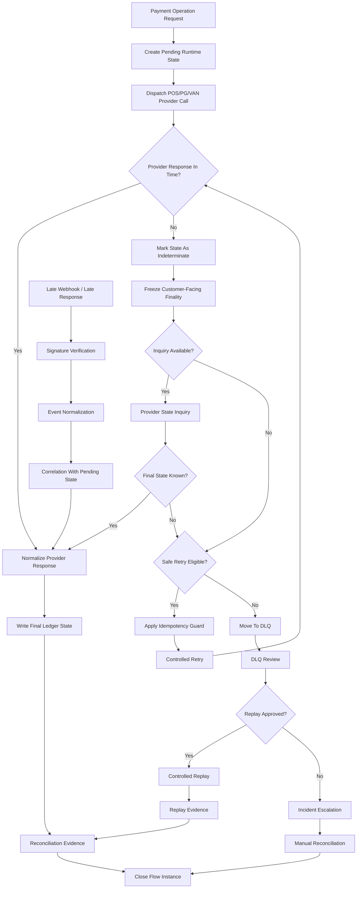

# 064120_Flow_POS_Gateway_Timeout_Retry_DLQ_And_Replay.md

## 1. Document Control

| Field | Value |
|---|---|
| Document ID | 64120 |
| Document Type | Flow |
| Document Name | POS Gateway Timeout Retry DLQ And Replay |
| Runtime Band | 64000 Runtime Flow Bundle Registry |
| System SOP Range | 50000~99999 |
| Related Index | 064000_Index_Runtime_Flow_Bundle_Registry.md |
| Primary Runtime Domain | POS Gateway / Payment Runtime / Audit Ledger |
| Implementation Unit | Flow Bundle |
| AI Coding Permission | Restricted |
| Status | Draft |

## 2. Purpose

This document defines the Flow Bundle for POS Gateway timeout, retry, dead-letter queue, and replay operations.

The purpose of this Flow Bundle is to prevent timeout ambiguity from becoming duplicate approval, duplicate cancellation, lost settlement evidence, broken audit ledger continuity, or uncontrolled replay.

This flow must not be implemented as a single Markdown-file task. It must be implemented only after the following four Flow Bundle artifacts are prepared and reviewed:

1. MD Dependency Graph
2. Runtime Flow Diagram
3. Module Impact Map
4. Test Coverage Map

## 3. Core Principle

Timeout is not failure by default.

A timeout means the local runtime does not yet have a final trusted state. Therefore, the system must enter a controlled pending, inquiry, retry, DLQ, or replay path instead of assuming success or failure.

No AI agent, IDE assistant, or automated patch process may directly change timeout, retry, DLQ, replay, payment ledger, reconciliation, secret, deployment, or migration logic without Flow Bundle approval.

## 4. Scope

This Flow Bundle covers:

- POS approval request timeout
- POS cancellation request timeout
- PG/VAN response delay
- webhook arrival after timeout
- retry eligibility decision
- retry idempotency control
- dead-letter queue entry
- DLQ classification
- controlled replay
- replay approval boundary
- replay audit evidence
- reconciliation after timeout
- duplicate approval prevention
- duplicate refund prevention
- settlement mismatch detection
- incident escalation when final state cannot be determined

This Flow Bundle does not directly cover:

- normal approval happy path
- normal cancellation happy path
- settlement export happy path
- POS offline local ledger resync full flow
- provider onboarding
- secret rotation procedure
- production migration execution

Those are governed by separate Flow, SOP, Runbook, or Matrix documents.

## 5. Flow Bundle Boundary

### 5.1 Entry Events

A transaction may enter this Flow Bundle when one or more of the following events occurs:

| Entry Event | Description | Required Control |
|---|---|---|
| approval_request_timeout | POS/PG approval request did not return within the configured timeout window | mark as indeterminate, not failed |
| cancel_request_timeout | cancellation/refund request did not return within the configured timeout window | mark as cancellation indeterminate |
| webhook_after_timeout | provider webhook arrives after local timeout state | verify signature and correlate idempotency key |
| retry_limit_reached | retry attempts exceed policy limit | move to DLQ |
| reconciliation_mismatch | provider ledger and internal ledger disagree | freeze automated replay |
| operator_replay_request | authorized operator requests replay | require approval and evidence packet |
| replay_execution_failure | replay fails after controlled execution | escalate incident |

### 5.2 Exit States

| Exit State | Meaning | Allowed Next Action |
|---|---|---|
| final_approved | provider confirms approval | write audit ledger and reconciliation evidence |
| final_declined | provider confirms decline | close transaction as declined |
| final_cancelled | provider confirms cancellation/refund | write reversal ledger and evidence |
| final_failed | provider confirms failure without financial movement | close with failure evidence |
| unresolved_indeterminate | final state cannot be verified | incident escalation and manual reconciliation |
| dlq_waiting_review | event moved to DLQ | operator review required |
| replay_completed | replay completed under controlled policy | append replay evidence |
| replay_blocked | replay denied due to risk or mismatch | incident or manual handling |

## 6. Flow Step Definition

All implementation work must be managed in the following order:

Flow Step → Module → File → Test → Evidence

### 6.1 Runtime Flow Steps

| Step | Name | Runtime Rule | Evidence Required |
|---|---|---|---|
| 1 | Receive Payment Operation Request | accept approval/cancel request with idempotency key | request receipt log |
| 2 | Create Pending Runtime State | write pending state before external call | pending ledger event |
| 3 | Dispatch External Provider Call | call POS/PG/VAN provider through gateway adapter | outbound call evidence |
| 4 | Detect Timeout | classify timeout without assuming final result | timeout classification log |
| 5 | Freeze Customer-Facing Finality | do not show final success/failure unless provider state is known | UI/API state evidence |
| 6 | Start Inquiry or Safe Retry Decision | decide inquiry first, retry only if safe | retry decision record |
| 7 | Apply Idempotency Guard | prevent duplicate approval/cancel execution | idempotency check log |
| 8 | Receive Late Response or Webhook | normalize late response/webhook into canonical event | webhook verification evidence |
| 9 | Correlate Provider State | match provider transaction id, approval number, order id, amount, store, timestamp | correlation evidence |
| 10 | Resolve Final State | write final approved/declined/cancelled/failed/unresolved state | final state ledger event |
| 11 | Route to DLQ if Unresolved | move unsafe or exhausted event to DLQ | DLQ entry record |
| 12 | Review DLQ | classify by financial risk and replay eligibility | review record |
| 13 | Execute Controlled Replay | replay only approved safe event types | replay execution evidence |
| 14 | Run Reconciliation Check | compare internal ledger with provider/POS settlement data | reconciliation evidence |
| 15 | Close Flow Bundle Instance | close with evidence packet or incident link | closure evidence packet |

## 7. Runtime Flow Diagram



## 8. MD Dependency Graph

### 8.1 Required Upstream Documents

| Dependency Type | Document | Reason |
|---|---|---|
| Registry | 064000_Index_Runtime_Flow_Bundle_Registry.md | Flow Bundle governance entry |
| Flow | 064100_Flow_POS_Gateway_Approval_To_Audit_Ledger_And_Reconciliation.md | approval ledger baseline |
| Flow | 064110_Flow_POS_Gateway_Cancel_Refund_Recovery_And_Audit.md | cancellation/refund recovery baseline |
| WorkPackage | 06340_WorkPackage_POS_Gateway_Idempotency_Queue_Retry_Dead_Letter_Replay_And_Duplicate_Prevention.md | retry/DLQ/idempotency implementation boundary |
| WorkPackage | 06380_WorkPackage_POS_Gateway_Reconciliation_Audit_Evidence_Settlement_And_Accounting_Guard.md | reconciliation and settlement guard |
| Policy | 05630_POS_Gateway_Performance_Capacity_Load_Shedding_And_Cost_Guardrail_Policy.md | timeout and retry pressure guardrail |
| Policy | 05640_POS_Gateway_Compliance_Financial_Audit_Regulatory_And_Consumer_Protection_Readiness_Policy.md | financial audit and consumer protection boundary |
| SOP | 50700_SOP_Index_Financial_Grade_Audit_Ledger_Legal_Hold_Export_Retention_And_Governance.md | audit ledger governance index |

### 8.2 Required Downstream Documents

| Downstream Document | Purpose |
|---|---|
| 064200_Matrix_Flow_To_MD_Dependency_Graph.md | register this flow dependency map |
| 064210_Matrix_Flow_To_Module_Implementation_Map.md | map runtime modules and implementation files |
| 064220_Matrix_Flow_To_Test_Coverage_Map.md | map tests required before implementation |
| DLQ Runbook document | operator-facing DLQ review and replay procedure |
| Replay Evidence Template | replay approval and evidence capture format |
| Incident Escalation SOP | unresolved financial state handling |

## 9. Module Impact Map

| Module | Impact | Required Control |
|---|---|---|
| pos_gateway_adapter | provider call timeout and response normalization | timeout must produce indeterminate state |
| payment_runtime_service | payment operation state machine | no direct failed/success assumption on timeout |
| idempotency_service | duplicate prevention | key must include provider/store/order/operation boundary |
| retry_orchestrator | retry scheduling and limit control | safe retry policy only |
| dlq_service | dead-letter routing and review queue | financial risk classification required |
| replay_service | controlled replay execution | approval and evidence required |
| webhook_ingestion_service | late webhook handling | signature verification and canonical normalization |
| audit_ledger_service | append-only transaction events | immutable event write required |
| reconciliation_service | provider/internal ledger comparison | mismatch blocks automated replay |
| evidence_packet_service | timeout/retry/replay proof generation | evidence packet must close flow |
| admin_console | operator review and approval | RBAC/ABAC required |
| alerting_incident_service | unresolved or unsafe state escalation | incident link must be preserved |

## 10. File Impact Categories

The implementation file list must be produced in the 64210 module implementation matrix before code work begins.

At minimum, the impacted files must be grouped by the following categories:

| Category | Examples |
|---|---|
| API route files | approval, cancel, inquiry, replay, DLQ review endpoints |
| service files | payment runtime, retry, idempotency, DLQ, replay, evidence |
| adapter files | POS provider, PG/VAN provider, webhook adapter |
| database migration files | transaction state, DLQ table, replay audit fields, idempotency constraints |
| schema files | canonical event, timeout event, replay request, DLQ classification |
| test files | unit, integration, contract, replay, reconciliation, incident tests |
| admin UI files | DLQ review, replay approval, incident view |
| observability files | metrics, alerts, dashboards, audit log export |

## 11. Test Coverage Map

No implementation may proceed until this Flow Bundle is mapped into test coverage.

| Test Layer | Required Test |
|---|---|
| Unit Test | timeout classification does not mark payment as failed by default |
| Unit Test | retry eligibility denies unsafe duplicate financial operation |
| Unit Test | idempotency key prevents duplicate approval/cancel execution |
| Contract Test | provider timeout response and late response mapping |
| Contract Test | webhook signature verification and event normalization |
| Integration Test | timeout → inquiry → final approved |
| Integration Test | timeout → late webhook → final approved |
| Integration Test | timeout → retry limit → DLQ |
| Integration Test | DLQ review → replay approved → replay evidence |
| Integration Test | reconciliation mismatch blocks replay |
| End-to-End Test | customer-facing state remains pending until final state is known |
| Regression Test | duplicate approval cannot be created by repeated retry |
| Regression Test | duplicate refund cannot be created by replay |
| Security Test | replay endpoint requires privileged approval |
| Audit Test | every timeout/retry/DLQ/replay step writes append-only audit event |
| Disaster Test | service restart does not lose pending indeterminate transactions |

## 12. Evidence Packet Requirements

Each timeout/retry/DLQ/replay flow instance must produce an evidence packet containing:

- original operation id
- idempotency key
- store id
- POS provider id
- PG/VAN provider id if applicable
- order id
- operation type
- requested amount
- currency
- timeout timestamp
- retry policy version
- retry attempts
- provider inquiry result if available
- late webhook or late response reference if available
- DLQ entry id if applicable
- replay approval id if applicable
- replay executor id if applicable
- reconciliation result
- final transaction state
- incident id if unresolved
- audit ledger event references

## 13. AI Coding Restriction

### 13.1 Claude Code Usage

Claude Code may be used only after this Flow Bundle has:

1. MD Dependency Graph completed
2. Runtime Flow Diagram approved
3. Module Impact Map completed
4. Test Coverage Map completed
5. protected files identified
6. database migration risk reviewed
7. secret and deployment boundaries excluded or separately approved

Claude Code must receive the Flow Bundle as the implementation scope. It must not be instructed to modify a single MD-derived feature in isolation.

### 13.2 Cursor Usage

Cursor may be used for:

- local file search
- small refactor suggestions
- test patch assistance
- implementation review
- IDE navigation
- isolated non-financial code edits

Cursor must not be used as the autonomous executor for timeout, retry, DLQ, replay, payment ledger, reconciliation, security, migration, or deployment changes.

### 13.3 AI-Prohibited Direct Modification Areas

AI may not directly modify the following without human-controlled Flow Bundle approval:

- payment finality logic
- duplicate approval prevention logic
- duplicate refund prevention logic
- idempotency constraint migration
- audit ledger append-only enforcement
- reconciliation settlement logic
- webhook secret verification
- provider credential handling
- production deployment scripts
- rollback scripts
- financial data migration
- DLQ replay approval policy

## 14. Runtime State Rules

| State | Description | Rule |
|---|---|---|
| pending_dispatched | provider call sent, no final result yet | customer finality prohibited |
| timeout_indeterminate | timeout occurred | inquiry or safe retry only |
| inquiry_pending | provider state inquiry in progress | retry blocked unless inquiry fails safely |
| retry_scheduled | retry allowed under policy | idempotency required |
| dlq_pending_review | event moved to DLQ | automated replay prohibited |
| replay_approved | replay approved by authorized operator | evidence required before execution |
| replay_executed | replay executed | reconciliation required |
| final_resolved | final state known | close with evidence |
| unresolved_incident | final state unknown or disputed | manual reconciliation required |

## 15. Financial Safety Rules

1. A timeout must never be treated as automatic failure.
2. A timeout must never be treated as automatic success.
3. Retry must never create a second financial movement for the same operation.
4. Replay must be denied when reconciliation mismatch exists.
5. Replay must be denied when idempotency reference is missing.
6. Cancellation replay must be stricter than approval replay.
7. Refund replay must require original approval correlation.
8. Late webhook must be verified before it can resolve state.
9. Provider approval number must not be overwritten by replay.
10. Audit ledger must preserve every state transition.

## 16. Observability Requirements

The following metrics and alerts are required:

| Metric / Alert | Purpose |
|---|---|
| payment_timeout_count | timeout volume tracking |
| timeout_indeterminate_open_count | unresolved timeout exposure |
| retry_attempt_count | retry pressure tracking |
| retry_denied_count | unsafe retry detection |
| dlq_entry_count | dead-letter volume |
| dlq_financial_risk_count | financial-risk DLQ count |
| replay_requested_count | replay governance tracking |
| replay_denied_count | replay safety tracking |
| duplicate_prevention_hit_count | idempotency guard evidence |
| late_webhook_after_timeout_count | delayed provider event tracking |
| reconciliation_mismatch_after_timeout_count | settlement risk indicator |
| unresolved_incident_count | manual escalation volume |

## 17. Implementation Gate

This Flow Bundle is not ready for code execution until all gates below are complete.

| Gate | Required Status |
|---|---|
| MD Dependency Graph | Required |
| Runtime Flow Diagram | Required |
| Module Impact Map | Required |
| Test Coverage Map | Required |
| Protected File List | Required |
| Migration Risk Review | Required if DB changes exist |
| Secret Boundary Review | Required if provider/webhook logic changes exist |
| Rollback Plan | Required |
| Evidence Packet Template | Required |
| Human Approval | Required |

## 18. Handoff Prompt For Implementation Agent

Use the following controlled instruction when handing this Flow Bundle to Claude Code or another implementation agent:

```text
Implement only the approved Flow Bundle: 064120_Flow_POS_Gateway_Timeout_Retry_DLQ_And_Replay.md.

Do not treat any single Markdown document as the implementation unit.
Follow the sequence: Flow Step → Module → File → Test → Evidence.

Before modifying code, produce:
1. MD Dependency Graph confirmation
2. Runtime Flow Diagram confirmation
3. Module Impact Map with exact files
4. Test Coverage Map with exact test files
5. Protected file list
6. Migration and secret boundary risk list

Do not modify payment finality, reconciliation, audit ledger, migration, deployment, provider secret, or replay approval logic unless the protected-change gate is explicitly approved.

For timeout behavior, never assume success or failure without provider-confirmed state or reconciliation evidence.

For retry and replay behavior, enforce idempotency and duplicate financial movement prevention.

Every implementation change must be traceable to Flow Step → Module → File → Test → Evidence.
```

## 19. Open Items

| Item | Owner | Status |
|---|---|---|
| Provider-specific timeout SLA matrix | POS Gateway Owner | Open |
| Inquiry-first vs retry-first provider policy | Payment Runtime Owner | Open |
| DLQ financial risk classification taxonomy | Audit / Finance Owner | Open |
| Replay approval RBAC/ABAC role map | Security Owner | Open |
| Evidence packet schema | Audit Ledger Owner | Open |
| Customer-facing pending-state message policy | CX / AI Customer Center Owner | Open |

## 20. Related Future Documents

This document should be cross-linked from:

- 064200_Matrix_Flow_To_MD_Dependency_Graph.md
- 064210_Matrix_Flow_To_Module_Implementation_Map.md
- 064220_Matrix_Flow_To_Test_Coverage_Map.md
- 064130_Flow_POS_Gateway_Store_Offline_Local_Ledger_And_Resync.md
- 064140_Flow_POS_Gateway_Webhook_Inbound_Verification_And_Event_Normalization.md
- 064150_Flow_POS_Gateway_Settlement_Dispute_And_Evidence_Export.md

## 21. Final Rule

The timeout, retry, DLQ, and replay path is a financial safety flow.

It must be designed as a Flow Bundle, implemented as a Flow Bundle, tested as a Flow Bundle, and evidenced as a Flow Bundle.

No code agent may reduce this flow into a single-file patch task.
