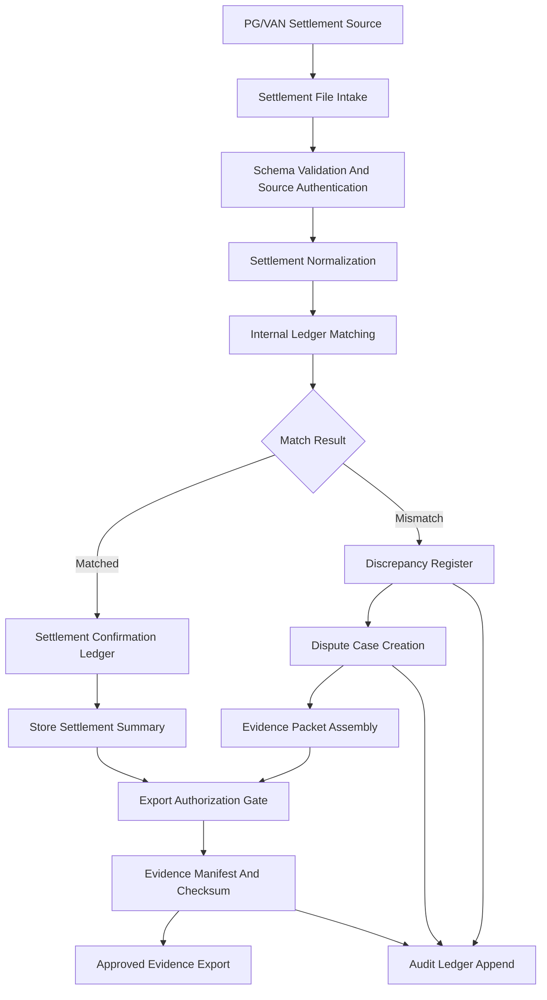
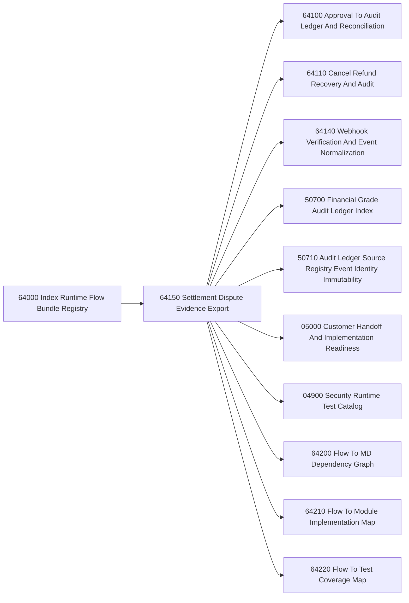
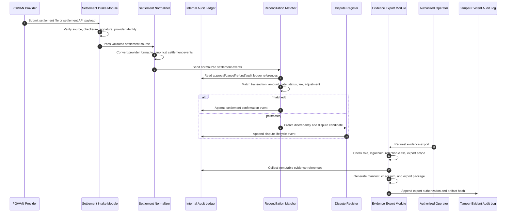

# 064150_Flow_POS_Gateway_Settlement_Dispute_And_Evidence_Export.md

## 1. Document Purpose

This document defines the Runtime Flow Bundle for POS Gateway settlement, dispute handling, and evidence export within the `yoonsul_wait_order_handoff` / CatchMenu-Catch&Order system.

This Flow Bundle does not treat a single Markdown file as an implementation unit. Instead, it binds policy documents, SOPs, ledgers, runtime modules, tests, and evidence artifacts into one implementation-controlled flow.

The core purpose is to ensure that settlement results, disputed transactions, PG/VAN reconciliation files, internal audit ledgers, and externally exportable evidence packets are handled as one traceable runtime bundle.

## 2. Naming And Registry Position

- Document Band: `64000 Runtime Flow Bundle Registry`
- Document Type: `Flow`
- File Name: `064150_Flow_POS_Gateway_Settlement_Dispute_And_Evidence_Export.md`
- Parent Index: `064000_Index_Runtime_Flow_Bundle_Registry.md`
- Related Flow Bundles:
  - `064100_Flow_POS_Gateway_Approval_To_Audit_Ledger_And_Reconciliation.md`
  - `064110_Flow_POS_Gateway_Cancel_Refund_Recovery_And_Audit.md`
  - `064120_Flow_POS_Gateway_Timeout_Retry_DLQ_And_Replay.md`
  - `064130_Flow_POS_Gateway_Store_Offline_Local_Ledger_And_Resync.md`
  - `064140_Flow_POS_Gateway_Webhook_Inbound_Verification_And_Event_Normalization.md`

## 3. Flow Bundle Principle

Settlement and dispute handling must never be implemented as a narrow export function.

It must be implemented as a controlled Flow Bundle covering:

1. Settlement source ingestion
2. PG/VAN settlement file normalization
3. Internal transaction ledger matching
4. Approval/cancel/refund netting
5. Fee, commission, and adjustment calculation boundary
6. Dispute intake and classification
7. Evidence packet assembly
8. Legal hold and retention tagging
9. Export authorization
10. Tamper-evident audit logging

No code change may be assigned to Claude Code, Cursor, or any AI coding assistant until the dependency graph, runtime flow diagram, module impact map, and test coverage map for this bundle are complete.

## 4. Scope

### 4.1 In Scope

This Flow Bundle includes:

- PG/VAN settlement file ingestion
- Daily settlement batch linkage
- Store-level settlement summary generation
- Transaction-level settlement matching
- Approval, cancel, refund, and partial refund reconciliation
- Settlement discrepancy detection
- Dispute case creation
- Evidence export package creation
- Audit ledger linkage
- Legal hold tagging
- Retention class assignment
- Export approval workflow
- Evidence checksum and manifest generation
- Operator, admin, and support action logging

### 4.2 Out of Scope

This Flow Bundle does not directly implement:

- Initial payment approval processing
- Customer-facing payment UI
- POS terminal hardware control
- KDS fulfillment state control
- Bank account remittance execution
- Accounting system final journal posting
- Tax filing submission
- Manual legal opinion drafting

Those functions may consume outputs from this bundle but must be governed by separate Flow Bundles or downstream integration contracts.

## 5. High-Level Runtime Flow



## 6. Flow Steps

| Step | Flow Step | Runtime Meaning | Required Evidence |
|---:|---|---|---|
| 1 | Settlement source received | PG/VAN settlement file, API payload, or batch report is received | Source receipt log |
| 2 | Source authenticity checked | File source, signature, checksum, channel, and provider identity are verified | Authenticity validation record |
| 3 | Settlement schema validated | Required columns, amount fields, provider codes, transaction IDs, and dates are validated | Schema validation result |
| 4 | Settlement normalized | Provider-specific settlement data is converted to canonical settlement event format | Normalized settlement event log |
| 5 | Internal ledger matched | Settlement events are matched against approval/cancel/refund/audit ledgers | Matching result record |
| 6 | Net settlement calculated | Gross approval, cancel, refund, fee, adjustment, and payable amount are calculated | Settlement calculation snapshot |
| 7 | Discrepancy classified | Missing, duplicate, amount mismatch, date mismatch, fee mismatch, or unknown provider status is classified | Discrepancy register entry |
| 8 | Dispute case opened | Material mismatch is converted into a dispute case with owner and SLA | Dispute case record |
| 9 | Evidence packet assembled | Transaction logs, ledger rows, provider records, operator logs, and manifests are bundled | Evidence packet manifest |
| 10 | Export approval requested | Export is held until authorized by permitted role | Export approval record |
| 11 | Export generated | Evidence file package is created with checksum and retention class | Export artifact metadata |
| 12 | Audit ledger appended | All settlement, dispute, and export operations are appended to tamper-evident audit ledger | Audit append record |

## 7. MD Dependency Graph



### 7.1 Primary Document Dependencies

| Dependency | Purpose |
|---|---|
| `064000_Index_Runtime_Flow_Bundle_Registry.md` | Parent registry for all Flow Bundles |
| `064100_Flow_POS_Gateway_Approval_To_Audit_Ledger_And_Reconciliation.md` | Supplies approval and reconciliation baseline |
| `064110_Flow_POS_Gateway_Cancel_Refund_Recovery_And_Audit.md` | Supplies cancel/refund adjustment baseline |
| `064140_Flow_POS_Gateway_Webhook_Inbound_Verification_And_Event_Normalization.md` | Supplies inbound provider event integrity boundary |
| `50700_SOP_Index_Financial_Grade_Audit_Ledger_Legal_Hold_Export_Retention_And_Governance.md` | Governs audit ledger, legal hold, retention, and export rules |
| `50710_SOP_Audit_Ledger_Source_Registry_Event_Identity_Immutability_And_Tamper_Evidence_Governance_Operation.md` | Governs source registry, event identity, immutability, and tamper evidence |
| `064200_Matrix_Flow_To_MD_Dependency_Graph.md` | Consolidated dependency graph registry |
| `064210_Matrix_Flow_To_Module_Implementation_Map.md` | Consolidated module impact registry |
| `064220_Matrix_Flow_To_Test_Coverage_Map.md` | Consolidated test coverage registry |

## 8. Runtime Flow Diagram



## 9. Module Impact Map

| Module | Impact Level | Required Control |
|---|---:|---|
| `pos_gateway_settlement_intake` | High | Provider identity, file authenticity, checksum, replay prevention |
| `settlement_normalizer` | High | Provider-specific mapping to canonical settlement event schema |
| `transaction_reconciliation_matcher` | Critical | Idempotent matching against approval/cancel/refund ledgers |
| `discrepancy_register` | Critical | Classification, owner assignment, SLA, escalation state |
| `dispute_case_service` | Critical | Case lifecycle, evidence linkage, operator traceability |
| `audit_ledger_service` | Critical | Immutable append, event identity, tamper evidence |
| `evidence_packet_builder` | Critical | Manifest, checksum, file binding, export scope restriction |
| `legal_hold_retention_service` | Critical | Hold status, retention class, deletion block |
| `admin_export_authorization` | High | RBAC/ABAC, maker-checker approval, export reason capture |
| `store_settlement_summary_service` | Medium | Store-facing summary view, mismatch visibility, no raw secret exposure |
| `notification_service` | Medium | Dispute alert, settlement mismatch alert, export completion alert |
| `observability_pipeline` | High | Metrics, traces, audit event correlation |

## 10. File Impact Map

Actual file paths must be confirmed by repository scan before implementation. The following is the expected logical file impact boundary.

| Layer | Expected File Group | AI Edit Permission |
|---|---|---|
| API Route | settlement intake and evidence export endpoints | Restricted |
| Service | settlement normalization and reconciliation services | Restricted |
| Ledger | audit ledger append and transaction matching services | No AI-alone edit |
| Database | settlement, dispute, export manifest, and audit tables | No AI-alone edit |
| Worker | daily settlement batch worker and export builder worker | Restricted |
| Queue | settlement ingestion queue, dispute escalation queue | Restricted |
| Security | provider credential, signature, checksum, export authorization | No AI-alone edit |
| Admin UI | dispute review and evidence export screen | AI-assisted after contract lock |
| Test | unit, integration, contract, reconciliation, export, audit tests | AI-assisted |
| Evidence | generated test evidence packets and manifests | AI-assisted with review |

## 11. Test Coverage Map

| Test Category | Required Coverage | Blocking Level |
|---|---|---:|
| Source authenticity test | Reject invalid provider, invalid signature, wrong checksum, unexpected channel | Critical |
| Schema validation test | Reject malformed settlement file and missing required fields | Critical |
| Normalization test | Convert provider-specific records into canonical settlement events | Critical |
| Ledger matching test | Match approval, cancel, refund, partial refund, and adjustment records | Critical |
| Duplicate settlement test | Prevent duplicate settlement confirmation for same transaction/provider reference | Critical |
| Amount mismatch test | Detect gross, net, fee, refund, and payable mismatches | Critical |
| Date mismatch test | Detect approval date, settlement date, batch date, and timezone mismatch | High |
| Dispute lifecycle test | Create, assign, escalate, resolve, and close dispute case | Critical |
| Evidence packet test | Generate manifest, checksum, ledger reference set, and immutable export package | Critical |
| Export authorization test | Enforce RBAC/ABAC and maker-checker approval before export | Critical |
| Legal hold test | Block deletion or destructive export when legal hold is active | Critical |
| Audit append test | Confirm every settlement, dispute, and export action produces tamper-evident audit entry | Critical |
| Regression test | Verify approval/cancel/refund flows remain consistent after settlement bundle changes | Critical |

## 12. Evidence Requirements

Each implementation cycle must produce the following evidence:

1. Flow Bundle implementation plan
2. MD dependency graph snapshot
3. Runtime flow diagram snapshot
4. Module impact map snapshot
5. Test coverage map snapshot
6. Settlement file fixture set
7. Reconciliation test results
8. Dispute lifecycle test results
9. Evidence export sample package
10. Export manifest and checksum sample
11. Audit ledger append sample
12. Security review notes
13. DB migration review record, if any
14. Operator approval record, if export flow changed

## 13. Security And Governance Boundary

The following areas are AI-alone edit prohibited:

- Settlement calculation logic
- Fee and payable amount calculation logic
- PG/VAN credential and secret handling
- Signature and checksum validation
- DB migration for settlement, dispute, audit, legal hold, or export tables
- Audit ledger immutability logic
- Evidence export authorization logic
- Legal hold and retention deletion block logic
- Production deployment scripts
- Settlement provider contract mapping

AI may assist with draft code, tests, comments, diagrams, and refactoring proposals only after the Flow Bundle artifacts are reviewed.

## 14. Claude Code And Cursor Usage Rule

### 14.1 Claude Code

Claude Code may be used only as a Flow Bundle implementation assistant after the following artifacts are locked:

- MD Dependency Graph
- Runtime Flow Diagram
- Module Impact Map
- Test Coverage Map
- Flow Step to Module to File mapping
- Test and Evidence checklist

Claude Code must be instructed to operate at Flow Bundle scope, not single-MD scope.

### 14.2 Cursor

Cursor may be used for:

- Local file navigation
- Small refactoring
- Test file creation
- Type cleanup
- Naming alignment
- Documentation cross-link updates

Cursor must not independently modify restricted settlement, audit, security, secret, DB migration, or production deployment logic.

## 15. Implementation Control Sequence

Every implementation task in this Flow Bundle must follow this order:

```text
Flow Step -> Module -> File -> Test -> Evidence
```

No implementation task should start from a file name alone.

## 16. Open Items

| Item | Status | Note |
|---|---|---|
| Provider settlement schema inventory | Open | Need provider-by-provider settlement format registry |
| Fee calculation ownership | Open | Must define whether Catch & Order calculates or only verifies fees |
| Evidence export format | Open | ZIP, JSON manifest, CSV, PDF, or mixed package to be defined |
| Legal hold class mapping | Open | Must align with 50700 and 50710 SOP family |
| Dispute SLA matrix | Open | Store, provider, PG/VAN, internal operator responsibility must be mapped |
| Accounting handoff boundary | Open | Final accounting journal posting is downstream and must be separated |

## 17. Acceptance Criteria

This Flow Bundle is accepted only when:

1. Settlement source identity and authenticity are validated.
2. Provider settlement data is normalized into canonical settlement events.
3. Internal approval/cancel/refund/audit ledgers are matched against settlement records.
4. Mismatches are classified and converted into dispute cases.
5. Evidence packets can be generated with manifest and checksum.
6. Export requires authorization and is fully audit logged.
7. Legal hold and retention rules are applied before export or deletion.
8. Duplicate settlement confirmation is prevented.
9. Audit ledger records every material settlement, dispute, and export action.
10. Test coverage map is complete before code implementation starts.

## 18. Next Registry Documents

This Flow Bundle should be consolidated into the following matrix documents:

- `064200_Matrix_Flow_To_MD_Dependency_Graph.md`
- `064210_Matrix_Flow_To_Module_Implementation_Map.md`
- `064220_Matrix_Flow_To_Test_Coverage_Map.md`
