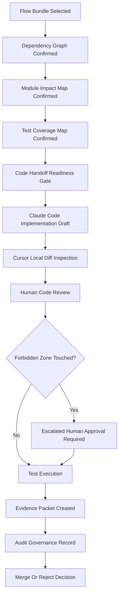

# 064360_Audit_Flow_Bundle_AI_Assisted_Implementation_Governance.md

## 1. Document Purpose

This document defines the audit governance policy for AI-assisted implementation in the `yoonsul_wait_order_handoff` / CatchMenu-Catch&Order Runtime Flow Bundle Architecture.

The purpose of this document is to prevent AI tools from directly changing high-risk runtime areas without Flow Bundle evidence, human review, test coverage, and traceable approval.

CatchMenu-Catch&Order is no longer treated as a simple ordering application. It is a POS-connected, PG/VAN-adjacent, reconciliation-aware, audit-ledger-driven runtime system. Therefore, implementation work must be audited at the Flow Bundle level, not at the single Markdown file level.

## 2. Position In Document Hierarchy

| Field | Value |
|---|---|
| Document Number | 64360 |
| Document Type | Audit |
| Runtime Band | 64000 Runtime Flow Bundle Registry |
| System SOP Range | 50000~99999 |
| Primary Scope | AI-assisted implementation governance |
| Related Tools | Claude Code, Cursor, human reviewer, CI pipeline |
| Output Role | Audit policy and traceability control |

## 3. Core Governance Rule

AI tools may assist implementation only after a Flow Bundle has been defined through the following artifacts:

1. MD Dependency Graph
2. Runtime Flow Diagram
3. Module Impact Map
4. Test Coverage Map
5. Code Handoff Readiness Gate
6. Implementation Review Evidence Packet
7. Exception And Waiver Log, if applicable

No AI-generated code change may be accepted solely because an individual MD file appears complete.

## 4. AI Tool Role Boundary

| Tool | Allowed Role | Forbidden Role |
|---|---|---|
| Claude Code | Flow Bundle implementation assistant | Independent payment, settlement, audit, security, DB migration, secret, or deployment modifier |
| Cursor | IDE-level assist, partial diff review, localized refactor support | Architecture owner, financial flow modifier, secret handler, migration executor |
| ChatGPT | Planning, document drafting, review checklist, risk framing | Direct production code operator |
| Human Reviewer | Final authority for high-risk approval | None |
| CI/CD | Automated verification and evidence collection | Manual risk acceptance replacement |

## 5. Absolute No-AI-Solo Zones

The following areas must not be modified by AI alone:

| Zone | Reason | Required Control |
|---|---|---|
| Payment approval logic | Duplicate charge and liability risk | Human review + integration test + evidence packet |
| Cancel/refund logic | Customer protection and settlement risk | Human review + ledger reversal test |
| Settlement calculation | Financial reporting and dispute risk | Dual review + reconciliation evidence |
| Audit ledger immutability | Legal hold and tamper-evidence risk | Security review + append-only verification |
| DB migration | Data corruption and rollback risk | Migration plan + dry run + rollback test |
| Secret management | Credential leak risk | Secret vault owner approval |
| Production deployment | Runtime outage risk | Release gate + rollback gate |
| Webhook signature verification | Spoofing and replay attack risk | Security test + negative test |
| DLQ replay | Duplicate event replay risk | Idempotency proof + replay audit |
| Local ledger resync | Offline conflict and double posting risk | Conflict simulation + reconciliation evidence |

## 6. Required Audit Trail Fields

Every AI-assisted implementation request must produce or reference an audit trail with the following fields:

| Field | Required | Description |
|---|---:|---|
| Flow Bundle ID | Yes | Example: `64100` |
| Flow Bundle Name | Yes | Runtime flow title |
| Trigger Document | Yes | Document that initiated the implementation request |
| Dependent MD List | Yes | Policy, SOP, WorkPackage, Audit, Matrix, Evidence documents |
| AI Tool Used | Yes | Claude Code, Cursor, or other |
| Prompt Version | Yes | Exact prompt template version used |
| Human Requester | Yes | Person initiating implementation |
| Human Reviewer | Yes | Person approving diff and test evidence |
| Files Changed | Yes | Concrete source/config/test file list |
| Forbidden Zone Touched | Yes | Yes/No with explanation |
| Tests Added Or Updated | Yes | Unit, integration, contract, failure, audit tests |
| Evidence Packet Link | Yes | Link/path to review evidence |
| Exception/Waiver ID | Conditional | Required if procedure was bypassed |
| Approval Status | Yes | Draft, blocked, approved, rejected, deferred |

## 7. AI Prompt Governance

AI implementation prompts must follow the approved Flow Bundle prompt templates.

Related documents:

- `064310_Template_Flow_Bundle_Claude_Code_Handoff_Prompt.md`
- `064320_Template_Flow_Bundle_Cursor_IDE_Assist_Prompt.md`

A valid prompt must include:

1. Flow Bundle ID
2. Allowed file scope
3. Forbidden file scope
4. Related MD dependency list
5. Runtime flow summary
6. Module impact map
7. Test obligations
8. Evidence output requirement
9. Explicit instruction not to modify no-AI-solo zones without human approval
10. Request for a diff summary before final acceptance

## 8. Minimum Review Workflow



## 9. Flow Bundle Governance Matrix

| Flow Bundle | AI Implementation Risk | Mandatory Review Level | Evidence Required |
|---|---|---|---|
| 64100 Approval To Audit Ledger And Reconciliation | Critical | Dual human review | Approval event, idempotency, audit ledger, reconciliation evidence |
| 64110 Cancel Refund Recovery And Audit | Critical | Dual human review | Cancel/refund reversal, customer protection, audit evidence |
| 64120 Timeout Retry DLQ And Replay | Critical | Human review + replay simulation | Retry, DLQ, idempotency, duplicate prevention evidence |
| 64130 Store Offline Local Ledger And Resync | Critical | Human review + conflict simulation | Offline ledger, resync, conflict resolution evidence |
| 64140 Webhook Inbound Verification And Event Normalization | Critical | Security review required | Signature, replay attack, normalization, quarantine evidence |
| 64150 Settlement Dispute And Evidence Export | Critical | Finance/audit review required | Settlement, dispute, export, legal hold evidence |

## 10. Diff Control Requirements

AI-generated diffs must be reviewed against the following checklist:

| Check | Required Result |
|---|---|
| Diff is linked to a Flow Bundle ID | Required |
| Diff references related MD documents | Required |
| Diff changes only allowed files | Required |
| Diff avoids no-AI-solo zones unless approved | Required |
| Diff includes test changes | Required |
| Diff includes migration only with separate approval | Required if migration exists |
| Diff includes no raw secret or credential | Required |
| Diff includes no hardcoded customer-facing message | Required |
| Diff includes rollback note | Required for runtime behavior change |
| Diff produces evidence packet | Required |

## 11. Evidence Classification

AI-assisted implementation evidence must be classified as follows:

| Evidence Type | Description | Storage Requirement |
|---|---|---|
| Prompt Evidence | Exact AI prompt used | Versioned document or artifact path |
| Diff Evidence | Git diff or patch summary | Repository evidence folder or PR |
| Test Evidence | Test command and result | CI artifact or captured log |
| Runtime Evidence | Simulation or sandbox output | Evidence packet |
| Audit Evidence | Ledger/reconciliation proof | Audit evidence folder |
| Review Evidence | Human approval or rejection note | Review packet |
| Exception Evidence | Waiver or escalation record | Exception register |

## 12. Human Approval Gate

A human reviewer must explicitly approve the following before merge:

1. The Flow Bundle scope is correct.
2. The changed files match the Module Impact Map.
3. No forbidden zone was modified without escalation.
4. All required tests were executed.
5. Evidence packet was created.
6. Reconciliation/audit impact was reviewed.
7. Rollback path is documented.
8. Any exception is recorded in `064350_Register_Flow_Bundle_Implementation_Exception_And_Waiver_Log.md`.

## 13. Rejection Conditions

An AI-assisted implementation must be rejected if any of the following are found:

| Condition | Action |
|---|---|
| Missing Flow Bundle ID | Reject |
| Missing dependency graph | Reject |
| Unknown file modified | Reject |
| Payment/settlement/audit logic changed without approval | Reject |
| Secret exposed in prompt, code, or log | Reject and rotate secret |
| Migration added without migration plan | Reject |
| Test coverage missing | Reject |
| Evidence packet missing | Reject |
| Cursor/Claude changed scope beyond instruction | Reject and re-scope |
| AI fabricated a dependency or test result | Reject and audit prompt |

## 14. Audit Record Template

```markdown
## AI Assisted Implementation Audit Record

- Audit Record ID:
- Date:
- Flow Bundle ID:
- Flow Bundle Name:
- Requester:
- Reviewer:
- AI Tool Used:
- Prompt Template:
- Related MD Documents:
- Files Changed:
- Forbidden Zone Touched: Yes / No
- Exception/Waiver ID:
- Tests Executed:
- Evidence Packet Path:
- Review Decision: Approved / Rejected / Deferred
- Reviewer Notes:
```

## 15. Relationship To Existing 64000 Band Documents

| Related Document | Relationship |
|---|---|
| `064000_Index_Runtime_Flow_Bundle_Registry.md` | Defines overall registry and implementation unit concept |
| `064100_Flow_POS_Gateway_Approval_To_Audit_Ledger_And_Reconciliation.md` | Critical approval/reconciliation flow |
| `064110_Flow_POS_Gateway_Cancel_Refund_Recovery_And_Audit.md` | Critical cancel/refund flow |
| `064120_Flow_POS_Gateway_Timeout_Retry_DLQ_And_Replay.md` | Critical retry/replay flow |
| `064130_Flow_POS_Gateway_Store_Offline_Local_Ledger_And_Resync.md` | Critical offline ledger/resync flow |
| `064140_Flow_POS_Gateway_Webhook_Inbound_Verification_And_Event_Normalization.md` | Critical inbound verification flow |
| `064150_Flow_POS_Gateway_Settlement_Dispute_And_Evidence_Export.md` | Critical settlement/dispute flow |
| `064200_Matrix_Flow_To_MD_Dependency_Graph.md` | Required dependency mapping |
| `064210_Matrix_Flow_To_Module_Implementation_Map.md` | Required module impact mapping |
| `064220_Matrix_Flow_To_Test_Coverage_Map.md` | Required test coverage mapping |
| `064300_Checklist_Flow_Bundle_Code_Handoff_Readiness_Gate.md` | Required pre-handoff gate |
| `064310_Template_Flow_Bundle_Claude_Code_Handoff_Prompt.md` | Claude Code prompt governance |
| `064320_Template_Flow_Bundle_Cursor_IDE_Assist_Prompt.md` | Cursor assist prompt governance |
| `064330_Runbook_Flow_Bundle_Code_Review_And_Diff_Control.md` | Diff review procedure |
| `064340_Evidence_Flow_Bundle_Implementation_Review_Packet.md` | Evidence packet format |
| `064350_Register_Flow_Bundle_Implementation_Exception_And_Waiver_Log.md` | Exception and waiver register |

## 16. Governance Principle

The system must remain implementation-friendly without becoming AI-unsafe.

Therefore:

- Individual MD files define policy, contract, SOP, and evidence.
- Flow Bundles define the actual implementation unit.
- Claude Code may implement only within the Flow Bundle boundary.
- Cursor may assist only within controlled local diff scope.
- Human review remains mandatory for high-risk areas.
- Evidence must exist before code is accepted.
- Audit trail must survive after implementation is complete.

## 17. Closeout Criteria

This audit governance document is considered active when:

1. Every Flow Bundle has a registered governance record.
2. Every AI-assisted code change references a Flow Bundle ID.
3. Every high-risk diff has human review evidence.
4. Every exception has an exception/waiver log entry.
5. Every implementation review produces an evidence packet.
6. No payment, settlement, audit, security, migration, secret, or deployment change is accepted through AI-only modification.
