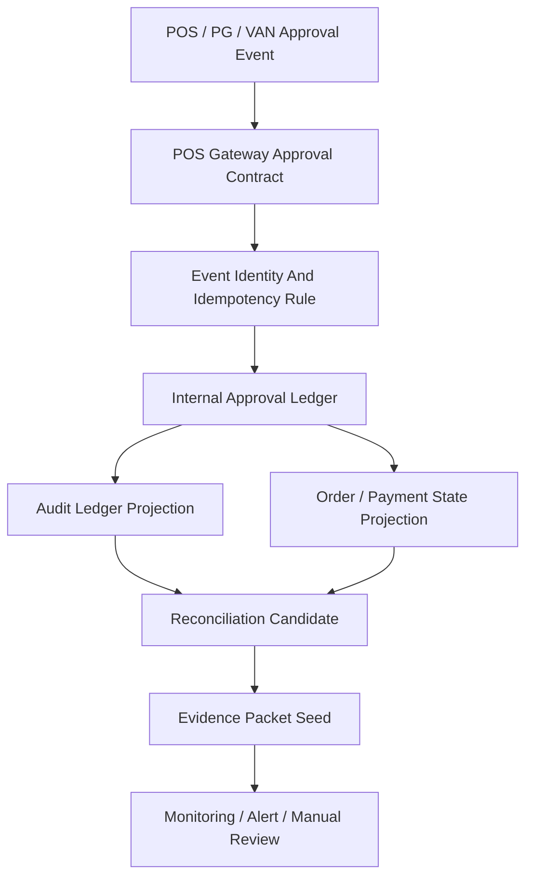
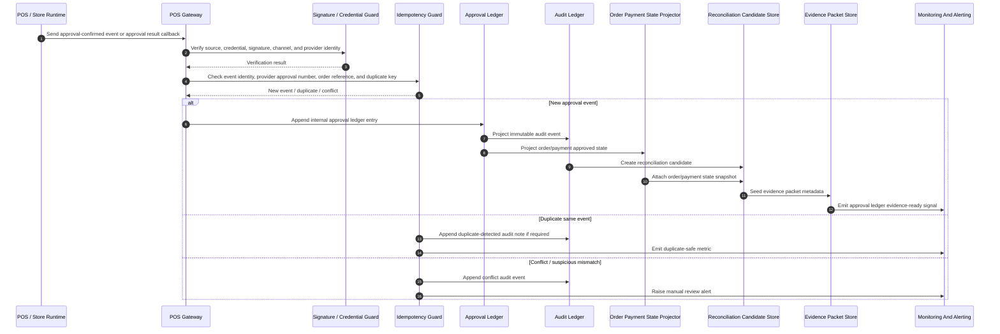

# 701000_Flow_POS_Gateway_Approval_To_Audit_Ledger_And_Reconciliation.md

## 1. Document Control

| Field | Value |
|---|---|
| Document Number | 701000 |
| Document Type | Flow |
| Document Band | 700900 Runtime Flow Bundle Registry |
| Title | POS Gateway Approval To Audit Ledger And Reconciliation |
| System | yoonsul_wait_order_handoff / CatchMenu / Catch & Order |
| Scope | POS approval event ingestion, internal approval ledger write, audit ledger projection, reconciliation readiness |
| Status | Draft |
| Owner | Runtime Architecture / POS Gateway / Financial Audit Governance |
| Related Index | 700900_Index_Runtime_Flow_Bundle_Registry.md |

---

## 2. Purpose

This document defines the first implementation-level Flow Bundle for POS Gateway approval events.

The purpose of this Flow Bundle is to prevent the project from treating a single Markdown document as a single implementation unit. POS approval, PG/VAN approval result, internal order state, financial audit ledger, reconciliation, and evidence export must be implemented as one controlled runtime flow.

This file defines the required implementation boundary before Claude Code, Cursor, or any AI-assisted coding tool is allowed to modify production-related code.

---

## 3. Flow Bundle Summary

| Item | Definition |
|---|---|
| Flow Bundle ID | FLOW-701000 |
| Flow Name | POS Gateway Approval To Audit Ledger And Reconciliation |
| Runtime Class | Financial runtime / approval ledger / audit evidence |
| Primary Trigger | POS or payment provider approval success or approval-confirmed callback |
| Primary Output | Immutable internal approval ledger entry and audit ledger projection |
| Secondary Output | Reconciliation candidate record and evidence packet seed |
| Risk Class | High |
| AI Direct Modification | Prohibited for payment, settlement, audit, secret, DB migration, and production deployment areas |

---

## 4. Flow Entry Criteria

This Flow Bundle may be implemented only after the following are available.

| Required Artifact | Required Status | Notes |
|---|---:|---|
| MD Dependency Graph | Required | All source policy, SOP, WorkPackage, audit, and evidence docs must be mapped |
| Runtime Flow Diagram | Required | Runtime sequence from approval trigger to reconciliation candidate must be drawn |
| Module Impact Map | Required | Gateway, ledger, audit, reconciliation, DB, queue, and monitoring impact must be listed |
| Test Coverage Map | Required | Unit, contract, integration, replay, reconciliation, and evidence tests must be mapped |
| Evidence Path | Required | Evidence output naming and retention owner must be known |
| Rollback Plan | Required | Approval ledger rollback is not allowed; correction must be compensating-event based |

---

## 5. MD Dependency Graph

### 5.1 Required Source Document Groups

This Flow Bundle depends on multiple document groups. The exact file list may be extended as the repository evolves, but implementation must not proceed unless the following groups have been reviewed.

| Group | Expected Document Type | Purpose |
|---|---|---|
| POS Gateway WorkPackage | WorkPackage / Policy | Defines POS gateway approval, provider boundary, idempotency, queue, retry, and audit guardrails |
| Financial Audit Ledger | SOP / Audit / Governance | Defines immutable event identity, tamper evidence, retention, and legal hold/export requirements |
| Runtime Foundation | Policy / Boundary / ADR | Defines cross-room runtime architecture, gateway trust boundary, event normalization, and failover assumptions |
| Data Model State Machine | Spec / Matrix / Policy | Defines order state, payment state, approval state, and reconciliation state transitions |
| Security Runtime Test Catalog | Checklist / Evidence / Test | Defines security, credential, webhook, replay, and financial integrity test catalog |
| Customer Handoff Readiness | Checklist / Evidence / Report | Defines first-store rollout and implementation evidence requirements |
| AI Customer Center | Policy / SOP | Defines customer-facing explanation limits and support escalation boundaries |

### 5.2 Dependency Graph Rule

A Markdown document is not an implementation unit. It is a source of one or more contractual constraints.

Implementation must map each referenced Markdown document to at least one of the following dependency roles.

| Dependency Role | Meaning |
|---|---|
| Policy Source | Provides governance or business rule |
| Runtime Contract | Defines input/output, state transition, provider boundary, or event contract |
| Security Control | Defines credential, signature, authorization, tamper, or data-protection rule |
| Ledger Rule | Defines append-only, correction, reconciliation, or audit evidence rule |
| Test Source | Provides required test case, acceptance condition, or evidence checklist |
| Operational SOP | Provides human recovery, escalation, or release procedure |

### 5.3 Minimum Dependency Nodes

The implementation graph for FLOW-701000 must include at least these nodes.



---

## 6. Runtime Flow Diagram

### 6.1 Runtime Sequence



### 6.2 Runtime Flow Steps

| Step | Runtime Action | Owner Module | Required Evidence |
|---:|---|---|---|
| 1 | Receive approval event | POS Gateway Inbound Adapter | Raw event hash, provider, source channel |
| 2 | Verify credential and source | Credential / Signature Guard | Verification result, key version, timestamp |
| 3 | Normalize provider payload | Event Normalizer | Canonical event payload, schema version |
| 4 | Check idempotency | Idempotency Guard | Idempotency key, duplicate/conflict decision |
| 5 | Append approval ledger | Approval Ledger Module | Ledger entry ID, append timestamp, immutable hash |
| 6 | Project audit event | Audit Ledger Projector | Audit event ID, chain hash or tamper evidence marker |
| 7 | Project order/payment state | State Projector | State transition record, previous/current state |
| 8 | Create reconciliation candidate | Reconciliation Module | Candidate ID, settlement matching keys |
| 9 | Seed evidence packet | Evidence Module | Evidence packet path, retention class |
| 10 | Emit monitoring signal | Monitoring Module | Metric, trace ID, alert if abnormal |

---

## 7. Module Impact Map

### 7.1 Primary Modules

| Module | Impact Level | Required Change Type | AI Direct Modification |
|---|---:|---|---|
| POS Gateway Inbound Adapter | High | Provider event intake and validation path | Allowed only for non-payment mock or test harness after review |
| Credential / Signature Guard | Critical | Source verification, key version handling, replay protection | Prohibited |
| Event Normalizer | High | Provider-specific to canonical event mapping | Review required |
| Idempotency Guard | Critical | Duplicate, replay, conflict detection | Prohibited without human review |
| Approval Ledger Module | Critical | Append-only approval record | Prohibited |
| Audit Ledger Projector | Critical | Immutable audit projection and tamper evidence | Prohibited |
| Order Payment State Projector | High | Approved-state projection and conflict guard | Review required |
| Reconciliation Candidate Store | Critical | Settlement matching seed | Prohibited |
| Evidence Packet Store | High | Evidence metadata, export path, retention class | Review required |
| Monitoring / Alerting | Medium | Metrics, traces, incident alerts | Allowed with test review |

### 7.2 Data Stores

| Store | Purpose | Modification Rule |
|---|---|---|
| approval_ledger | Internal approval truth record | Append-only; no destructive update |
| audit_ledger | Tamper-evident audit projection | Append-only; correction via compensating event |
| order_payment_state | Runtime projection for order/payment state | State transition must be traceable to ledger event |
| reconciliation_candidates | Matching seed for PG/VAN settlement and internal ledger | Must preserve provider reference and internal reference |
| evidence_packets | Evidence metadata and export readiness | Retention class required |
| provider_event_raw_archive | Raw payload archive where allowed | Hash and retention policy required |

---

## 8. Test Coverage Map

### 8.1 Required Test Classes

| Test Class | Minimum Coverage Requirement | Evidence Output |
|---|---|---|
| Contract Test | Provider approval payload maps to canonical approval event | Contract test result file |
| Signature Test | Invalid signature, expired key, wrong provider, and replay are rejected | Security evidence log |
| Idempotency Test | Duplicate approval does not create duplicate ledger entry | Idempotency decision evidence |
| Conflict Test | Same approval key with mismatched amount/order/store is blocked | Conflict alert evidence |
| Ledger Append Test | Approval ledger is append-only and immutable after write | Ledger integrity report |
| Audit Projection Test | Every approval ledger write creates audit projection | Audit projection report |
| State Projection Test | Order/payment state changes only through approved ledger event | State transition evidence |
| Reconciliation Seed Test | Candidate includes required settlement matching keys | Reconciliation candidate report |
| Replay Test | Approved event replay is safe and deterministic | Replay test result |
| Evidence Export Test | Evidence packet seed can be exported and traced | Evidence export sample |
| Observability Test | Metrics, trace ID, and alert rules fire as expected | Monitoring test snapshot |

### 8.2 Minimum Acceptance Conditions

Implementation is not accepted unless all conditions below are satisfied.

| Acceptance ID | Condition |
|---|---|
| AC-701000-01 | One external approval event creates at most one internal approval ledger entry |
| AC-701000-02 | Duplicate events are recognized without creating duplicate financial records |
| AC-701000-03 | Amount, currency, store, terminal, order, provider, and approval number mismatches are treated as conflict |
| AC-701000-04 | Every accepted approval ledger entry creates an audit ledger projection |
| AC-701000-05 | Every accepted approval ledger entry creates or updates a reconciliation candidate |
| AC-701000-06 | Manual correction never edits the original approval ledger row destructively |
| AC-701000-07 | Secret, credential, DB migration, and production deployment changes are not performed by AI alone |
| AC-701000-08 | Evidence packet seed exists for every accepted approval event |

---

## 9. Controlled Implementation Order

All implementation work for this Flow Bundle must follow this order.

```text
Flow Step → Module → File → Test → Evidence
```

### 9.1 Work Breakdown

| Order | Work Unit | Description |
|---:|---|---|
| 1 | Flow Step Definition | Confirm runtime sequence and state transition boundaries |
| 2 | Module Boundary Review | Confirm impacted modules and prohibited zones |
| 3 | File Candidate List | Identify exact source files before modification |
| 4 | Test Plan Binding | Attach required tests to each file change |
| 5 | Evidence Path Binding | Define evidence output for each test and runtime event |
| 6 | Code Change | Permit Claude Code or human developer to implement within reviewed scope |
| 7 | Review Gate | Human review for critical areas |
| 8 | Release Gate | Deployment only after evidence package is complete |

---

## 10. AI Tool Boundary

### 10.1 Claude Code Usage

Claude Code may be used as a Flow Bundle implementation agent only after the four required maps are complete.

Allowed use cases:

- generating non-production scaffolding after file list approval
- creating test harnesses
- drafting provider adapter mock code
- producing module-level implementation diff proposals
- generating documentation updates from reviewed implementation evidence

### 10.2 Cursor Usage

Cursor may be used as an IDE assistant for partial edits, navigation, refactor suggestions, and small test fixes.

Cursor must not be used as the sole decision-maker for payment, settlement, ledger, audit, or security behavior.

### 10.3 Prohibited AI-Only Areas

The following areas require human review and cannot be modified by AI alone.

| Area | Reason |
|---|---|
| Payment approval logic | Financial record integrity |
| Cancel/refund logic | Consumer protection and settlement risk |
| Settlement/reconciliation | Accounting and legal evidence risk |
| Audit ledger immutability | Tamper evidence and legal hold risk |
| DB migration | Irreversible data impact |
| Secret / credential handling | Security breach risk |
| Production deployment | Operational and financial incident risk |
| Provider contract mapping | External dependency and legal interpretation risk |

---

## 11. Evidence Requirements

Each implementation of FLOW-701000 must produce an evidence packet.

### 11.1 Evidence Packet Contents

| Evidence Item | Required |
|---|---:|
| MD dependency graph snapshot | Yes |
| Runtime flow diagram snapshot | Yes |
| Module impact map | Yes |
| Test coverage map | Yes |
| Contract test results | Yes |
| Idempotency test results | Yes |
| Ledger append integrity report | Yes |
| Audit projection report | Yes |
| Reconciliation candidate report | Yes |
| Monitoring snapshot | Yes |
| Human review approval for critical zones | Yes |
| Release decision record | Yes |

### 11.2 Evidence Naming Rule

Evidence files should follow the project naming rule and include the Flow Bundle ID.

Example:

```text
701000_Evidence_FLOW_701000_POS_Gateway_Approval_To_Audit_Ledger_And_Reconciliation_Test_Result.md
```

---

## 12. Failure And Recovery Principles

| Failure Type | Handling Rule |
|---|---|
| Duplicate approval callback | Do not duplicate ledger; record duplicate-safe decision |
| Approval amount mismatch | Block reconciliation candidate and raise manual review |
| Provider approval number missing | Reject or quarantine according to provider contract |
| Ledger write failure | Do not acknowledge success; retry through controlled queue if safe |
| Audit projection failure | Freeze downstream reconciliation until projection is repaired |
| State projection failure | Ledger remains source of truth; rebuild projection from ledger |
| Evidence packet failure | Release gate blocked until evidence is regenerated |

---

## 13. Cross-References

| Related Document | Relationship |
|---|---|
| 700900_Index_Runtime_Flow_Bundle_Registry.md | Parent registry and Flow Bundle governance index |
| 701010_Flow_POS_Gateway_Cancel_Refund_Recovery_And_Audit.md | Cancel/refund counterpart flow |
| 701020_Flow_POS_Gateway_Timeout_Retry_DLQ_And_Replay.md | Timeout, retry, replay, and DLQ safety flow |
| 701030_Flow_POS_Gateway_Store_Offline_Local_Ledger_And_Resync.md | Offline local ledger and resync flow |
| 701040_Flow_POS_Gateway_Webhook_Inbound_Verification_And_Event_Normalization.md | Webhook verification and normalization flow |
| 701050_Flow_POS_Gateway_Settlement_Dispute_And_Evidence_Export.md | Settlement, dispute, and evidence export flow |
| 701100_Matrix_Flow_To_MD_Dependency_Graph.md | Consolidated dependency matrix |
| 701110_Matrix_Flow_To_Module_Implementation_Map.md | Consolidated module implementation map |
| 701120_Matrix_Flow_To_Test_Coverage_Map.md | Consolidated test coverage map |

---

## 14. Governance Decision

FLOW-701000 is a controlled implementation Flow Bundle.

No code change related to approval ingestion, payment ledger, audit projection, reconciliation candidate creation, or evidence export may proceed based on a single Markdown file alone.

All work must be traced through:

```text
Flow Bundle → MD Dependency Graph → Runtime Flow Diagram → Module Impact Map → Test Coverage Map → File Change → Evidence Packet
```

This rule is mandatory for CatchMenu / Catch & Order because POS, PG/VAN, reconciliation, and audit ledger boundaries create financial-grade operational risk.
