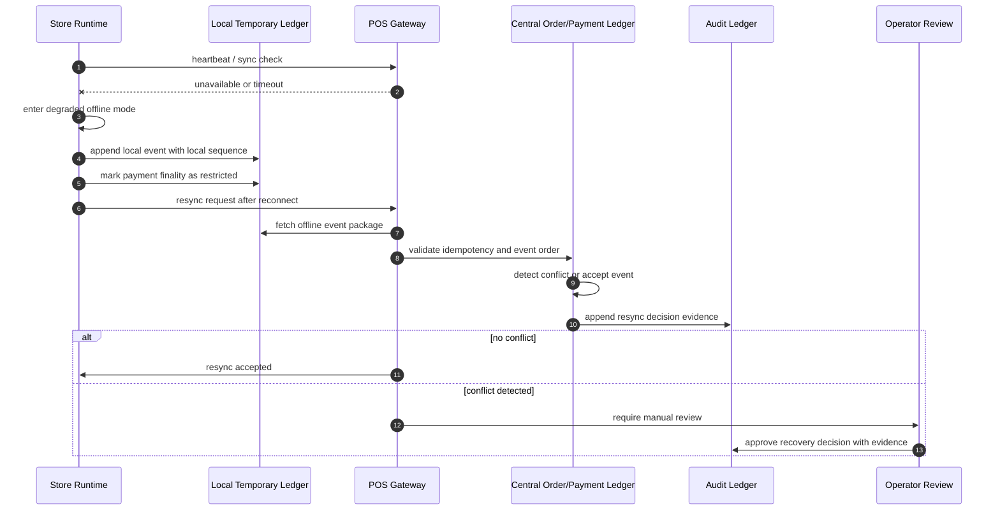

# 701030_Flow_POS_Gateway_Store_Offline_Local_Ledger_And_Resync.md

## 1. Document Control

| Field | Value |
|---|---|
| Document Number | 701030 |
| Document Type | Flow |
| Runtime Band | 700900 Runtime Flow Bundle Registry |
| Flow Bundle Name | POS Gateway Store Offline Local Ledger And Resync |
| System Scope | CatchMenu / Catch & Order POS Gateway, Store Runtime, Local Temporary Ledger, Audit Ledger, Reconciliation |
| Implementation Unit | Flow Bundle, not single MD file |
| AI Coding Rule | Claude Code may implement only after Dependency Graph, Runtime Flow Diagram, Module Impact Map, and Test Coverage Map are approved |
| Restricted Zone | Payment, settlement, audit, DB migration, secret, security boundary, and production deployment require human approval |
| Status | Draft |

---

## 2. Purpose

This document defines the Flow Bundle for store offline operation, local temporary ledger capture, central resynchronization, conflict resolution, and audit evidence generation.

The purpose is to prevent data loss, duplicate payment effects, unauthorized ledger mutation, and untraceable order state changes when a store loses network connectivity or the POS Gateway cannot reach upstream systems.

This document does not treat one Markdown file as one implementation unit. It binds multiple policy, SOP, ledger, runtime, security, and test documents into a single controlled implementation bundle.

---

## 3. Flow Bundle Principle

The offline flow must be implemented as a bundle because it crosses several high-risk boundaries.

| Boundary | Risk |
|---|---|
| Store device to local runtime | device loss, clock drift, tampering, duplicate local events |
| Local temporary ledger to central gateway | replay, conflict, ordering ambiguity, idempotency failure |
| Order state to payment state | false paid state, stale approval, refund mismatch |
| Central ledger to audit ledger | missing evidence, unverifiable mutation, non-replayable history |
| Recovery operation to human approval | unsafe auto-fix, silent data rewrite, weak incident trace |

No code change may begin until this Flow Bundle has explicit mapping for Flow Step → Module → File → Test → Evidence.

---

## 4. Scope

### 4.1 Included

- Store offline detection
- Local temporary ledger creation
- Local event sequence assignment
- Offline order acceptance guardrail
- Offline payment-state restriction
- Local-to-central resync request
- Central idempotency and replay protection
- Conflict detection and resolution
- Audit ledger append
- Evidence packet generation
- Operator review and incident handoff

### 4.2 Excluded

- Direct card authorization while fully offline unless separately certified and contractually allowed
- Manual mutation of financial ledger records
- Unapproved DB migration
- Secret rotation procedure
- Production deployment automation
- Settlement finalization without central reconciliation

---

## 5. Flow Entry Conditions

This Flow Bundle begins when one or more of the following conditions are detected.

| Entry Condition | Description | Required Handling |
|---|---|---|
| Store network outage | Store runtime cannot reach central Catch & Order runtime | Enter degraded offline mode |
| POS Gateway timeout | Gateway cannot confirm upstream POS/PG/VAN state | Freeze payment finality and preserve evidence |
| Central API unavailable | Store can operate locally but cannot synchronize | Use local temporary ledger |
| Resync requested | Store runtime reconnects after outage | Run central validation and conflict detection |
| Audit review required | Local and central states diverge | Human-approved recovery path required |

---

## 6. Flow Exit Conditions

The flow may exit only when one of the following conditions is satisfied.

| Exit Condition | Meaning |
|---|---|
| Clean resync completed | All local events are accepted into central ledger without conflict |
| Conflict resolved | Conflicting events are resolved through approved recovery rules and evidence is attached |
| Manual review pending | Events are quarantined and no financial finality is asserted |
| Incident escalated | Recovery cannot be completed safely and incident procedure is opened |
| Store remains degraded | Offline mode continues with restricted capabilities |

---

## 7. Required Four Pre-Implementation Artifacts

### 7.1 MD Dependency Graph

The MD Dependency Graph must identify all policy, SOP, implementation, audit, and evidence documents that govern this flow.

Minimum dependency groups:

| Group | Required MD Relationship |
|---|---|
| POS Gateway resilience | timeout, retry, idempotency, DLQ, replay, duplicate prevention |
| Store runtime operations | local order capture, KDS/manual kitchen continuity, degraded mode |
| Financial audit ledger | append-only ledger, reconciliation, legal hold, evidence export |
| Security | credential isolation, webhook verification, tamper evidence, access control |
| Test catalog | offline simulation, replay test, conflict test, operator recovery test |

The graph must make clear which documents are normative, which are implementation references, and which are evidence templates.

### 7.2 Runtime Flow Diagram

The Runtime Flow Diagram must show the following runtime sequence.

### 7.3 Module Impact Map

The Module Impact Map must identify every module touched by the offline/resync path.

| Module | Impact |
|---|---|
| Store Runtime | offline detection, degraded mode, local event capture |
| Local Temporary Ledger | append-only local event storage, local sequence, hash chain, sync marker |
| POS Gateway | resync intake, idempotency validation, replay guard, upstream status check |
| Order State Machine | offline-safe state transition restrictions |
| Payment State Machine | no false paid state, no unverified finality |
| Audit Ledger | append-only resync evidence and conflict decision records |
| Reconciliation Engine | compare local, central, PG/VAN, and POS states |
| Admin Console | operator review, quarantine queue, approval and waiver logging |
| Alerting/Incident Module | outage alert, conflict alert, resync failure alert |
| Evidence Export | store outage packet, replay packet, operator decision packet |

### 7.4 Test Coverage Map

The Test Coverage Map must include normal, degraded, conflict, security, and evidence tests.

| Test Area | Required Test |
|---|---|
| Offline entry | heartbeat failure causes degraded mode without data loss |
| Local ledger | local event is append-only and sequence-stable |
| Payment restriction | offline event cannot become final paid state without verified approval |
| Resync acceptance | non-conflicting local events replay exactly once |
| Duplicate replay | duplicate local package is rejected or idempotently ignored |
| Conflict detection | central event and local event mismatch enters quarantine |
| Clock drift | local timestamp drift does not override central ordering rules |
| Tamper evidence | modified local event hash fails validation |
| Operator recovery | manual decision requires reason, actor, timestamp, and evidence |
| Audit export | complete resync evidence packet can be exported |

---

## 8. Flow Step Control Table

| Step | Runtime Step | Module | File/Code Target | Test Target | Evidence Target |
|---:|---|---|---|---|---|
| 1 | Detect loss of connectivity | Store Runtime | heartbeat / sync monitor | outage simulation test | outage detection log |
| 2 | Enter degraded offline mode | Store Runtime | degraded mode controller | mode transition test | degraded mode event |
| 3 | Restrict unsafe functions | Order/Payment State Machine | state guard | restricted transition test | blocked action log |
| 4 | Append local event | Local Temporary Ledger | append-only local ledger writer | local append test | local event record |
| 5 | Assign local sequence/hash | Local Temporary Ledger | sequence and hash-chain module | sequence integrity test | local hash proof |
| 6 | Reconnect and request resync | POS Gateway | resync intake endpoint | reconnect test | resync request log |
| 7 | Validate local package | POS Gateway | validator / schema / signature check | invalid package test | validation report |
| 8 | Check idempotency | POS Gateway / Central Ledger | idempotency key registry | duplicate replay test | idempotency decision |
| 9 | Compare central state | Reconciliation Engine | local-central comparator | mismatch test | comparison report |
| 10 | Accept or quarantine event | Central Ledger | event accept/quarantine module | conflict handling test | accept/quarantine record |
| 11 | Append audit evidence | Audit Ledger | audit append writer | audit append test | audit ledger event |
| 12 | Export evidence packet | Evidence Export | packet generator | export completeness test | resync evidence packet |

---

## 9. Offline Capability Matrix

| Capability | Online | Offline Degraded | After Resync |
|---|---:|---:|---:|
| Queue/waiting registration | Allowed | Allowed with local sequence | Centralized |
| Order draft capture | Allowed | Allowed with restriction | Replayed/validated |
| Kitchen memo/manual KDS note | Allowed | Allowed | Reconciled |
| Payment authorization | Allowed | Restricted unless certified path exists | Verified centrally |
| Paid state finalization | Allowed | Not allowed without verified approval | Allowed after reconciliation |
| Refund/cancel finality | Allowed | Not allowed without central verification | Allowed after recovery rules |
| Settlement inclusion | Allowed | Not allowed | Allowed after clean reconciliation |
| Audit evidence append | Central append | Local evidence staged | Central audit append |

---

## 10. Data Contract Requirements

Every offline local event package must contain at minimum:

| Field | Requirement |
|---|---|
| store_id | Required |
| device_id | Required |
| local_session_id | Required |
| local_event_id | Required, unique per local session |
| local_sequence | Required, monotonic per local session |
| event_type | Required |
| event_payload | Required, schema versioned |
| local_created_at | Required, not authoritative for financial ordering |
| previous_event_hash | Required when hash chain is active |
| event_hash | Required |
| sync_status | pending / accepted / rejected / quarantined |
| operator_context | Required for manual override or recovery action |

Financial finality fields must not be derived from local-only evidence unless a separately approved certified offline payment path exists.

---

## 11. Conflict Classes

| Conflict Class | Example | Default Decision |
|---|---|---|
| Duplicate local event | Same local_event_id submitted twice | Idempotent ignore after evidence append |
| Sequence gap | local_sequence jumps from 7 to 10 | Quarantine session |
| Hash mismatch | event_hash does not match payload | Reject and escalate |
| Central state mismatch | Central order already canceled, local says served | Quarantine and operator review |
| Payment ambiguity | Local says paid, central has no verified approval | Do not mark paid; require reconciliation |
| Clock drift | Local time appears before/after impossible window | Use central ordering and flag drift |
| Device identity mismatch | Package signed by unexpected device | Reject or quarantine per security policy |

---

## 12. AI Coding Boundary

### 12.1 Claude Code Allowed Zone

Claude Code may assist with:

- generating module skeletons after Flow Bundle approval
- creating tests from the Test Coverage Map
- implementing non-financial local ledger validation logic under review
- generating admin UI draft components for review queues
- producing documentation updates and evidence template drafts

### 12.2 Cursor Allowed Zone

Cursor may assist with:

- localized refactoring
- IDE navigation
- small code edits within approved files
- test fixture updates
- type/interface alignment

### 12.3 AI Single-Agent Forbidden Zone

AI must not independently modify:

- payment approval finality rules
- settlement inclusion logic
- financial audit ledger mutation logic
- DB migration scripts
- secret or credential handling
- production deployment configuration
- security boundary verification
- legal retention or evidence deletion policy

---

## 13. Evidence Requirements

Each offline/resync incident must produce an evidence packet that includes:

| Evidence | Description |
|---|---|
| outage window | detected start/end, heartbeat failures, affected store/device |
| local event list | ordered local events with sequence and hash |
| resync request | request ID, actor/system, timestamp, package checksum |
| validation result | schema, hash, sequence, identity, idempotency outcome |
| reconciliation result | local vs central vs POS/PG/VAN comparison where applicable |
| conflict decisions | accepted/rejected/quarantined with reasons |
| operator approval | actor, role, timestamp, reason, attachment |
| audit ledger reference | immutable audit event IDs |
| export checksum | evidence packet checksum and retention marker |

---

## 14. Cross-Link Requirements

This Flow document must be linked from:

- `700900_Index_Runtime_Flow_Bundle_Registry.md`
- `701100_Matrix_Flow_To_MD_Dependency_Graph.md`
- `701110_Matrix_Flow_To_Module_Implementation_Map.md`
- `701120_Matrix_Flow_To_Test_Coverage_Map.md`
- POS Gateway resilience WorkPackage documents
- Financial-grade audit ledger SOP documents in the 50000+ system SOP band
- Store runtime degraded operation and manual kitchen continuity documents

---

## 15. Implementation Gate

Implementation may begin only after the following gate checklist is complete.

| Gate | Required Status |
|---|---|
| MD Dependency Graph approved | Required |
| Runtime Flow Diagram approved | Required |
| Module Impact Map approved | Required |
| Test Coverage Map approved | Required |
| Restricted-zone review completed | Required |
| DB migration review completed if applicable | Required |
| Security review completed if applicable | Required |
| Evidence template approved | Required |
| Rollback/resync failure procedure defined | Required |

---

## 16. Status

This document establishes `701030_Flow_POS_Gateway_Store_Offline_Local_Ledger_And_Resync.md` as the controlled Flow Bundle for offline store operation, local temporary ledger handling, central resynchronization, conflict quarantine, and audit evidence generation.

The next expected Flow document is:

`701040_Flow_POS_Gateway_Webhook_Inbound_Verification_And_Event_Normalization.md`
