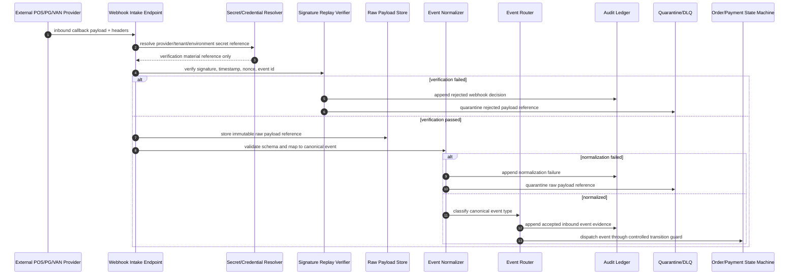

# 701040_Flow_POS_Gateway_Webhook_Inbound_Verification_And_Event_Normalization.md

## 1. Document Control

| Field | Value |
|---|---|
| Document Number | 701040 |
| Document Type | Flow |
| Runtime Band | 700900 Runtime Flow Bundle Registry |
| Flow Bundle Name | POS Gateway Webhook Inbound Verification And Event Normalization |
| System Scope | CatchMenu / Catch & Order POS Gateway, Webhook Intake, Security Boundary, Event Normalization, Audit Ledger |
| Implementation Unit | Flow Bundle, not single MD file |
| AI Coding Rule | Claude Code may implement only after Dependency Graph, Runtime Flow Diagram, Module Impact Map, and Test Coverage Map are approved |
| Restricted Zone | Webhook signature verification, secret handling, financial event mutation, DB migration, audit ledger, security boundary, and production deployment require human approval |
| Status | Draft |

---

## 2. Purpose

This document defines the Flow Bundle for receiving inbound webhook callbacks from POS, PG, VAN, kiosk, payment partner, and settlement partner systems.

The purpose is to ensure that every inbound event is authenticated, authorized, replay-protected, normalized into the Catch & Order canonical event model, quarantined when unsafe, and appended to the audit trail before it can influence order, payment, refund, settlement, or reconciliation state.

This Flow Bundle prevents the common failure where a webhook is treated as a simple controller endpoint. In CatchMenu / Catch & Order, webhook intake is a financial-grade runtime boundary and must be implemented as a controlled bundle across policy, security, runtime, test, and evidence documents.

---

## 3. Flow Bundle Principle

Inbound webhooks are not trusted application messages. They are external-origin events crossing into the runtime boundary.

| Boundary | Risk |
|---|---|
| External provider to POS Gateway | forged callback, spoofed provider, wrong environment |
| Network transport to intake endpoint | replay, delay, duplicate delivery, malformed payload |
| Provider schema to canonical event | semantic mismatch, missing identifiers, currency or amount mismatch |
| Event normalization to state machine | unauthorized state transition, stale event overwrite, duplicate finality |
| Webhook handling to audit ledger | missing evidence, unverifiable decisions, non-replayable incident history |
| Secret management to verification logic | leaked secret, stale signing key, environment cross-use |

No webhook may directly mutate financial state. All inbound events must pass through verification, normalization, idempotency, quarantine/accept decision, audit append, and then controlled downstream dispatch.

---

## 4. Scope

### 4.1 Included

- Inbound webhook endpoint boundary
- Provider identity resolution
- Environment and tenant matching
- Signature and timestamp verification
- Secret lookup without secret exposure
- Replay protection
- Duplicate delivery idempotency
- Raw payload capture and retention reference
- Schema validation
- Canonical event normalization
- Event classification and routing
- Quarantine decision
- Audit ledger append
- Downstream dispatch to order/payment/refund/reconciliation modules
- Evidence packet generation for webhook incidents

### 4.2 Excluded

- Direct settlement finalization
- Direct ledger mutation before verification
- Manual editing of raw webhook payloads
- Unapproved provider credential rotation
- DB migration execution
- Production endpoint exposure change
- AI-only modification of security verification logic

---

## 5. Flow Entry Conditions

This Flow Bundle begins when an external system sends a callback or event notification to a Catch & Order webhook intake endpoint.

| Entry Condition | Description | Required Handling |
|---|---|---|
| Payment approval callback | PG/VAN/POS reports approval result | Verify and normalize before payment state impact |
| Cancel/refund callback | Provider reports cancellation, void, refund, or partial refund | Verify original transaction linkage |
| Settlement callback | Provider reports settlement, deposit, fee, dispute, or adjustment event | Route to settlement/dispute flow after normalization |
| Status callback | POS or partner reports order/payment status transition | Validate allowed transition |
| Retry callback | Provider resends same event | Idempotency decision required |
| Unknown callback | Unknown provider, tenant, event type, or schema | Quarantine and alert |

---

## 6. Flow Exit Conditions

The flow may exit only when one of the following conditions is reached.

| Exit Condition | Meaning |
|---|---|
| Accepted and dispatched | Event is verified, normalized, idempotent, audit-appended, and dispatched downstream |
| Idempotently ignored | Duplicate event is recognized and no new state mutation occurs |
| Quarantined | Event cannot safely affect runtime state and is held for review |
| Rejected | Event fails authentication, authorization, schema, replay, or environment validation |
| Incident escalated | Event pattern indicates provider error, attack, credential issue, or systemic mismatch |

---

## 7. Required Four Pre-Implementation Artifacts

### 7.1 MD Dependency Graph

The MD Dependency Graph must identify all documents that govern external callback intake, credential verification, event normalization, state transition, and audit evidence.

Minimum dependency groups:

| Group | Required MD Relationship |
|---|---|
| Runtime Flow Registry | 700900 index and all related 701000~701050 flow documents |
| POS Gateway security | webhook signature, provider credential, secret rotation, environment isolation |
| POS Gateway resilience | retry, timeout, idempotency, DLQ, replay, duplicate prevention |
| Payment and refund state | approval, cancel, refund, recovery, state machine contracts |
| Audit ledger | raw event reference, verification decision, normalization decision, state-impact evidence |
| Reconciliation | provider event comparison against internal ledger and settlement evidence |
| Test catalog | forged webhook, replay webhook, duplicate callback, schema drift, quarantine, evidence export |
| SOP/System SOP | incident response, credential compromise handling, legal hold, export retention |

The graph must identify which documents are normative contracts, which are implementation references, and which are evidence templates.

### 7.2 Runtime Flow Diagram

The Runtime Flow Diagram must show the inbound webhook path before any state mutation.

### 7.3 Module Impact Map

The Module Impact Map must identify every module touched by the webhook inbound path.

| Module | Impact |
|---|---|
| Webhook Intake API | endpoint routing, method guard, payload size limit, provider path boundary |
| Provider Registry | provider identity, tenant mapping, environment mapping, event type allowance |
| Secret Vault Adapter | secret reference lookup, key version selection, rotation support, no plaintext logging |
| Signature Verifier | HMAC/JWS/provider-specific verification, timestamp tolerance, nonce validation |
| Replay Guard | event id registry, nonce registry, timestamp replay window, duplicate decision |
| Raw Payload Store | immutable raw payload capture, retention pointer, legal hold reference |
| Schema Validator | provider schema validation, required identifiers, amount/currency constraints |
| Event Normalizer | provider-specific payload to canonical event mapping |
| Idempotency Registry | duplicate callback handling and exactly-once state impact guard |
| Event Router | canonical event classification and downstream topic selection |
| Order State Machine | controlled order-state transition after verification |
| Payment State Machine | controlled approval/cancel/refund state transition after verification |
| Audit Ledger | verification, normalization, routing, dispatch, quarantine evidence append |
| DLQ/Quarantine | rejected, malformed, unknown, stale, duplicate, or unsafe events |
| Admin Console | webhook incident review, payload reference view, manual recovery approval |
| Alerting/Incident Module | attack pattern, provider drift, credential mismatch, callback failure alerts |
| Evidence Export | webhook verification packet and incident packet generation |

### 7.4 Test Coverage Map

The Test Coverage Map must include positive, negative, duplicate, security, provider drift, and evidence tests.

| Test Area | Required Test |
|---|---|
| Valid webhook | signed event is accepted and normalized |
| Invalid signature | forged event is rejected and audit-appended |
| Missing signature | unsigned event is rejected before normalization |
| Timestamp replay | stale callback fails replay window validation |
| Duplicate event id | duplicate callback is idempotently ignored |
| Wrong tenant | event signed for another tenant is rejected |
| Wrong environment | sandbox event cannot mutate production state |
| Schema drift | missing or unknown fields trigger quarantine |
| Amount mismatch | callback amount mismatch blocks state mutation |
| Currency mismatch | currency mismatch blocks state mutation |
| Unsupported event type | unknown event type enters quarantine |
| Raw payload immutability | stored raw reference cannot be edited silently |
| Secret logging | plaintext secret never appears in logs or evidence packets |
| State guard | webhook cannot bypass order/payment state machine rules |
| Audit completeness | verification, normalization, routing, and dispatch decisions are exportable |
| DLQ replay | quarantined event can be replayed only through approved recovery path |

---

## 8. Flow Step Control Table

| Step | Runtime Step | Module | File/Code Target | Test Target | Evidence Target |
|---:|---|---|---|---|---|
| 1 | Receive inbound callback | Webhook Intake API | provider webhook route/controller | valid callback intake test | inbound request envelope log |
| 2 | Resolve provider and tenant | Provider Registry | provider/tenant resolver | unknown provider/tenant test | provider resolution record |
| 3 | Resolve secret reference | Secret Vault Adapter | secret version lookup | wrong key version test | secret reference id only |
| 4 | Verify signature | Signature Verifier | provider-specific verifier | invalid signature test | signature verification decision |
| 5 | Verify timestamp and nonce | Replay Guard | replay window/nonce registry | replay attack test | replay decision record |
| 6 | Store raw payload reference | Raw Payload Store | immutable raw store writer | raw immutability test | raw payload hash/reference |
| 7 | Validate schema | Schema Validator | provider schema validator | schema drift test | schema validation report |
| 8 | Normalize event | Event Normalizer | provider-to-canonical mapper | normalization mapping test | canonical event record |
| 9 | Check idempotency | Idempotency Registry | event id/idempotency key registry | duplicate delivery test | idempotency decision |
| 10 | Classify and route | Event Router | canonical event router | unsupported type test | routing decision |
| 11 | Apply state guard | Order/Payment State Machine | transition guard | invalid transition test | state guard decision |
| 12 | Append audit evidence | Audit Ledger | audit append writer | audit append test | webhook audit event |
| 13 | Quarantine unsafe event | DLQ/Quarantine | quarantine writer | unsafe event quarantine test | quarantine packet |
| 14 | Export evidence packet | Evidence Export | webhook packet generator | export completeness test | webhook evidence packet |

---

## 9. Webhook Trust Decision Matrix

| Condition | Decision | State Mutation Allowed | Required Evidence |
|---|---|---:|---|
| Signature valid, timestamp valid, schema valid, idempotent first event | Accept | Yes, through state guard only | verification + normalization + dispatch evidence |
| Valid duplicate event | Idempotently ignore | No new mutation | duplicate decision evidence |
| Invalid signature | Reject | No | rejection evidence and alert if repeated |
| Missing signature | Reject | No | missing signature evidence |
| Stale timestamp | Reject or quarantine by provider rule | No | replay decision evidence |
| Unknown provider | Quarantine | No | provider resolution failure evidence |
| Wrong tenant/environment | Reject | No | environment mismatch evidence |
| Schema invalid | Quarantine | No | schema validation failure evidence |
| Amount/currency mismatch | Quarantine and alert | No | financial mismatch evidence |
| Unsupported event type | Quarantine | No | unsupported type evidence |
| State transition invalid | Quarantine | No | transition guard evidence |

---

## 10. Canonical Event Contract Requirements

Every normalized inbound webhook event must produce a canonical event envelope before downstream dispatch.

Minimum canonical fields:

| Field | Requirement |
|---|---|
| canonical_event_id | Internal immutable event identifier |
| provider_event_id | Original provider event identifier |
| provider_code | Registered provider identity |
| tenant_id | Store/operator tenant identity |
| store_id | Store identity, if applicable |
| environment | dev/stage/sandbox/prod separation marker |
| event_type | canonical approval/cancel/refund/status/settlement/dispute type |
| event_version | canonical mapping version |
| occurred_at_provider | provider event timestamp |
| received_at_gateway | gateway receipt timestamp |
| transaction_id | internal transaction linkage, if known |
| provider_transaction_id | provider transaction linkage |
| order_id | internal order linkage, if known |
| amount | amount value for financial events |
| currency | currency code for financial events |
| original_reference | original transaction reference for cancel/refund/dispute |
| raw_payload_hash | hash of immutable raw payload |
| raw_payload_reference | storage pointer, not mutable body copy |
| verification_decision_id | signature/replay verification decision linkage |
| normalization_decision_id | mapping/schema decision linkage |
| idempotency_key | key controlling exactly-once state impact |
| audit_event_id | audit ledger linkage |

No downstream module may rely on provider-specific raw payload fields directly. Provider payloads must be consumed only by adapter/normalizer logic and evidence viewers.

---

## 11. Security And Secret Boundary

Webhook verification is a security boundary and cannot be treated as ordinary application validation.

| Control | Required Rule |
|---|---|
| Secret lookup | Use provider/tenant/environment/key-version reference; do not hardcode secrets |
| Secret logging | Never log plaintext secrets, derived signing material, or full authorization headers |
| Rotation | Support overlapping old/new key validation during approved rotation window |
| Environment isolation | Sandbox/dev callbacks cannot affect production records |
| Provider isolation | Provider A signature cannot validate Provider B payload |
| Tenant isolation | Store or tenant mismatch blocks state mutation |
| Clock tolerance | Timestamp drift tolerance must be explicit and tested |
| Payload size | Oversized callback must be rejected or quarantined before expensive processing |
| Header normalization | Header casing and encoding differences must be handled safely |
| Algorithm allowlist | Only approved verification algorithms are allowed |
| Fail-safe mode | Verification ambiguity must fail closed, not fail open |

---

## 12. Normalization Rules

Provider-specific callbacks must be converted to canonical event types before any business decision.

| Provider Event Class | Canonical Handling |
|---|---|
| Approval success | Map to payment approval candidate, then state guard validates transition |
| Approval failure | Map to payment failure event without paid finality |
| Cancel/void success | Map to cancel event linked to original approval |
| Refund success | Map to refund event with original transaction reference and amount check |
| Partial refund | Map to partial refund event with cumulative amount guard |
| Settlement/deposit | Map to settlement evidence candidate, not direct final settlement |
| Dispute/chargeback | Map to dispute flow and evidence export queue |
| Order status | Map to order-state candidate with allowed transition check |
| Unknown event | Quarantine and add provider schema drift evidence |

Normalization must not repair financially meaningful values silently. Amount, currency, merchant id, transaction id, approval number, cancel reference, and settlement reference mismatches must be explicit decision records.

---

## 13. Idempotency And Replay Requirements

Webhook providers commonly send duplicate callbacks. Duplicate delivery is normal; duplicate financial effect is not.

| Requirement | Description |
|---|---|
| Provider event id registry | Store provider event identifier and canonical event linkage |
| Idempotency key | Derive or assign stable state-impact key per provider event |
| Duplicate decision | Duplicate event must result in same decision or no-op, not new state mutation |
| Replay window | Reject or quarantine stale events outside allowed timestamp window |
| Nonce/event id replay | Repeated nonce or event id must be detected |
| Raw payload comparison | Same event id with different payload hash must trigger incident/quarantine |
| Downstream exactly-once guard | State machine must verify idempotency again before mutation |
| DLQ replay guard | Manual replay from quarantine must not bypass idempotency |

---

## 14. Quarantine And DLQ Rules

Unsafe inbound events must be preserved, not discarded silently.

| Quarantine Reason | Required Handling |
|---|---|
| Authentication failure | Reject, audit, alert on repeated pattern |
| Unknown provider or tenant | Quarantine with provider resolution failure |
| Wrong environment | Reject and alert if production endpoint receives sandbox drift |
| Schema failure | Quarantine for provider schema review |
| Financial mismatch | Quarantine and block state mutation |
| Duplicate id with changed payload | Quarantine and escalate as possible tamper/provider defect |
| Invalid state transition | Quarantine and attach current state snapshot |
| Unsupported event type | Quarantine and create mapping review task |
| Raw storage failure | Fail closed; do not process state mutation without evidence reference |

Quarantined events may be replayed only through approved operator or engineering recovery flow with evidence packet linkage.

---

## 15. Audit Ledger Requirements

Every inbound webhook decision must be audit-appended.

Required audit event classes:

| Audit Event | Required Fields |
|---|---|
| webhook_received | provider, tenant, endpoint, received_at, request id, payload hash |
| webhook_verification_passed | provider, key version reference, signature method, timestamp decision |
| webhook_verification_failed | failure reason, provider candidate, request id, payload hash |
| webhook_replay_rejected | timestamp/nonce/event id reason, prior event linkage |
| webhook_raw_stored | raw payload hash, immutable storage reference, retention class |
| webhook_schema_validated | schema version, validation result |
| webhook_normalized | canonical event id, mapping version, event type |
| webhook_idempotency_decided | idempotency key, first/duplicate/conflict decision |
| webhook_routed | downstream module/topic, routing decision |
| webhook_state_guard_decided | transition allowed/blocked, current state snapshot reference |
| webhook_quarantined | reason, DLQ id, operator review requirement |
| webhook_dispatched | downstream dispatch id and result |

Audit events must avoid plaintext secret exposure and must use references/hashes for sensitive payload data.

---

## 16. Human Approval And AI Coding Restriction

The following changes are restricted and require human approval before execution or merge.

| Change Area | AI Role | Human Role |
|---|---|---|
| Signature algorithm | Draft comparison or test cases | Approve selected algorithm and provider contract |
| Secret lookup/rotation | Prepare non-secret implementation skeleton | Approve vault path, key version, rotation window |
| Provider credential | No direct edit | Register, rotate, revoke, and verify credential |
| State-impact mapping | Draft mapping table | Approve financial meaning and state transition |
| DB migration | Draft migration proposal only | Review and execute through controlled process |
| Production route exposure | No standalone deployment | Approve endpoint exposure and rollback plan |
| Quarantine replay | Prepare evidence summary | Approve replay or manual resolution |
| Audit retention/legal hold | Draft export structure | Approve retention, legal hold, and export scope |

Claude Code may implement only the approved Flow Bundle. Cursor may assist with local edits, refactoring, and test corrections, but must not independently alter restricted areas.

---

## 17. Required Evidence Packets

This Flow Bundle must produce evidence suitable for technical audit, incident review, provider dispute, and legal retention.

| Evidence Packet | Contents |
|---|---|
| Webhook Verification Packet | request id, provider, tenant, endpoint, signature decision, timestamp decision, key version reference |
| Raw Payload Packet | immutable raw reference, hash, retention class, schema version |
| Normalization Packet | provider event id, canonical event id, mapping version, field mapping summary |
| Idempotency Packet | idempotency key, duplicate/first/conflict decision, prior linkage |
| Quarantine Packet | reason, DLQ id, current state snapshot, required reviewer |
| Dispatch Packet | downstream module, transition guard result, audit event id |
| Incident Packet | repeated failure pattern, provider drift, attack suspicion, operator actions |

Evidence packets must be exportable without exposing secrets or unnecessary personal data.

---

## 18. Relationship To Other Runtime Flow Bundles

| Related Flow | Relationship |
|---|---|
| 701000 Approval To Audit Ledger And Reconciliation | Approval callbacks may feed approval state candidate after verification |
| 701010 Cancel Refund Recovery And Audit | Cancel/refund callbacks must link to original approval and recovery controls |
| 701020 Timeout Retry DLQ And Replay | Duplicate callbacks, delayed callbacks, and DLQ replay share idempotency rules |
| 701030 Store Offline Local Ledger And Resync | Offline/resync events may conflict with later provider callbacks |
| 701050 Settlement Dispute And Evidence Export | Settlement/dispute callbacks route into evidence and reconciliation flows |
| 701100 Flow To MD Dependency Graph | This document must be included in dependency matrix |
| 701110 Flow To Module Implementation Map | Modules listed here must be mapped to implementation ownership |
| 701120 Flow To Test Coverage Map | Tests listed here must be represented in coverage matrix |

---

## 19. Implementation Readiness Gate

Implementation is not allowed until the following checklist is satisfied.

| Gate | Required Status |
|---|---|
| MD Dependency Graph | Approved |
| Runtime Flow Diagram | Approved |
| Module Impact Map | Approved |
| Test Coverage Map | Approved |
| Provider signature contract | Confirmed |
| Secret vault path and key version policy | Approved |
| Environment isolation rule | Approved |
| Canonical event schema | Approved |
| Idempotency strategy | Approved |
| Quarantine/DLQ replay rule | Approved |
| Audit event schema | Approved |
| Evidence export template | Approved |
| Human restricted-zone checklist | Approved |

---

## 20. Cursor / Claude Code Instruction Boundary

When this Flow Bundle is passed to Claude Code or Cursor, the instruction must be phrased as Flow Bundle implementation, not single-file implementation.

Required implementation order:

1. Read 700900 Runtime Flow Bundle Registry.
2. Read this 701040 Flow document.
3. Build or update the MD Dependency Graph.
4. Build or update the Runtime Flow Diagram.
5. Build or update the Module Impact Map.
6. Build or update the Test Coverage Map.
7. Identify Flow Step → Module → File → Test → Evidence mapping.
8. Produce implementation plan without modifying restricted-zone code.
9. Request human approval for secret/security/payment/audit/DB/deployment changes.
10. Implement only approved non-restricted code changes.
11. Run mapped tests.
12. Produce evidence packet.

Forbidden instruction forms:

- "Implement 701040.md."
- "Fix the webhook endpoint quickly."
- "Let AI adjust signature verification."
- "Normalize provider events and update payment status directly."
- "Change the webhook secret or route in production."

Approved instruction form:

- "Implement the approved 701040 Flow Bundle by following Flow Step → Module → File → Test → Evidence mapping. Do not modify restricted security, secret, payment, audit, DB migration, or deployment areas without explicit human approval."

---

## 21. Open Questions

| Question | Owner | Resolution Rule |
|---|---|---|
| Which provider-specific signature schemes are MVP scope? | Architecture / Payment Integration | Must be confirmed before implementation |
| What is the allowed timestamp replay window per provider? | Security / Provider Contract | Must be explicit and tested |
| How are key versions selected during rotation? | Security / DevOps | Must be approved before secret integration |
| What is the canonical event schema version for MVP? | Backend Architecture | Must be frozen before mapper implementation |
| Which webhook event types are blocked from MVP? | Product / Architecture | Must be listed in unsupported event quarantine rule |
| What retention class applies to raw payload storage? | Legal / Compliance | Must align with audit/legal hold policy |
| Who can replay quarantined webhook events? | Operations / Security | Must require role-based approval |

---

## 22. Completion Criteria

This Flow Bundle is considered complete only when:

- all four pre-implementation artifacts are approved;
- provider webhook contracts are mapped to canonical events;
- signature, timestamp, replay, tenant, and environment verification are implemented and tested;
- raw payloads are immutably referenced;
- no webhook can directly mutate payment/order state without state guard and idempotency;
- unsafe events enter quarantine/DLQ with audit evidence;
- evidence packets can be exported;
- restricted-zone changes have human approval records;
- Claude Code/Cursor implementation evidence is attached to the Flow Bundle.

---

## 23. Next Document

The next Runtime Flow Bundle document is:

`701050_Flow_POS_Gateway_Settlement_Dispute_And_Evidence_Export.md`
